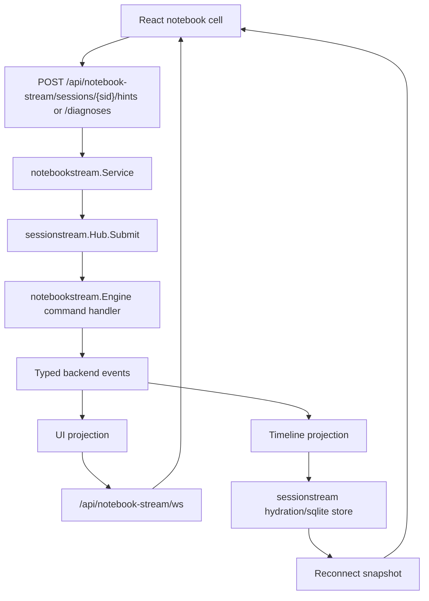

[]
# CozoDB Editor Modernization — Sessionstream Hard Cutover

This article explains the modernization of the CozoDB editor notebook from a legacy SEM/websocket streaming design to a typed `sessionstream` architecture. The work happened in `/home/manuel/workspaces/2026-06-20/ui-notebook-package/2026-03-14--cozodb-editor` on branch `task/ui-notebook-package`. The related ticket documentation lives in `/home/manuel/workspaces/2026-06-20/ui-notebook-package/ui-notebook/ttmp/2026/06/21/NOTEBOOK-BACKEND-001--notebook-backend-sessionstream-chatapp-migration`.

The modernization was not a single dependency bump. It changed the notebook's event model, transport boundary, frontend state shape, AI integration path, protobuf contracts, validation surface, and local build assumptions. The old notebook used a direct `/ws/hints` websocket and Pinocchio SEM-style event envelopes for hints, diagnosis, and structured Cozo artifacts. The new notebook uses HTTP command ingress, a `sessionstream` websocket for subscription and fanout, concrete protobuf messages for commands/events/entities, SQLite-backed hydration for reconnect snapshots, and a frontend projection that consumes typed notebook stream frames directly.

> [!summary]
> - **The notebook now owns its stream domain.** `backend/pkg/notebookstream` is a CozoDB-editor package built on `sessionstream`; `pinocchio/pkg/chatapp` remains reference architecture rather than the notebook domain model.
> - **Command ingress and streaming fanout are separated.** Hints and diagnoses are submitted over HTTP, while `/api/notebook-stream/ws` handles subscribe/snapshot/live UI events.
> - **The old SEM path was deleted, not wrapped.** The migration removed `/ws/hints`, frontend SEM projections, `features/cozo-sem`, backend SEM registries, and Pinocchio webchat/timeline dependencies.
> - **Artifacts are typed again, but no longer SEM-shaped.** Cozo hint, query suggestion, and documentation reference artifacts are protobuf-backed `NotebookCozoArtifact` events/entities.
> - **Validation now covers the new protocol.** Backend package tests cover stream hydration, HTTP routes, websocket hello/subscribe/live fanout, and full `go test ./...`; frontend tests cover projection and rendering, with Storybook smoke verification.

## Why this modernization was necessary

The earlier notebook streaming path mixed several responsibilities in one channel. A browser opened `/ws/hints`, sent request frames over that websocket, and received response events over the same connection. Some response events were plain text deltas. Other response events represented structured Cozo artifacts through SEM projection types. The frontend then normalized those envelopes through `semProjection` and feature modules under `features/cozo-sem`.

That design had two practical problems. First, the transport contract was local to this notebook rather than shared with the newer `sessionstream` substrate used elsewhere in the local package set. It did not use the snapshot-before-live protocol, typed schema registry, or hydration-store interfaces that `sessionstream` already provides. Second, the old SEM integration kept the notebook coupled to Pinocchio packages that had moved toward sessionstream/chatapp patterns. Keeping the old envelopes alive would have made every future feature pay a compatibility cost.

The migration goal was therefore explicit: move the notebook onto local `./geppetto`, `./pinocchio`, and especially `./sessionstream`, while removing legacy streaming code rather than building compatibility wrappers. The target architecture keeps product-specific notebook concepts in the CozoDB editor repository and uses `sessionstream` only as the substrate for typed commands, events, projections, hydration, and websocket delivery.

## The old path and the new path

The old path treated websocket messages as the primary API. The browser sent a hint or diagnosis request directly to the hint websocket. The backend ran the AI engine, streamed text deltas, translated structured payloads into SEM events, and wrote JSON frames back to the same websocket. Reconnect behavior and durable hydration were not the primary model.

The new path treats the stream as a session-oriented event log with projections. HTTP submits commands. The backend command handler publishes backend events. UI projections derive client-facing events. Timeline projections derive durable entities. The websocket subscribes to a session, sends a snapshot, acknowledges the subscription, and then delivers live UI events.



The important change is not only the websocket path. The command path and the read path now have different responsibilities. HTTP is used for command ingress because a submit action is a request/response operation with validation and an accepted/rejected outcome. The websocket is used for subscriptions because it carries snapshots and live UI events after the command has been accepted.

The session identifier is also explicit. The current design uses one session per notebook:

```go
func NotebookSessionID(notebookID string) sessionstream.SessionId {
    notebookID = strings.TrimSpace(notebookID)
    if notebookID == "" {
        return ""
    }
    return sessionstream.SessionId("notebook:" + notebookID)
}
```

This is a conservative choice. A notebook-level session is broad enough to hydrate all hint, diagnosis, and artifact state for the page, while remaining narrow enough that the frontend can subscribe once for the document it is viewing.

## Backend package boundaries

The backend now has two main layers for streaming.

| Package | Responsibility |
|---|---|
| `backend/pkg/notebook` | Integrates the stream server into the existing notebook module, mounts HTTP routes, mounts websocket routes, adapts the existing AI engine, owns runtime/schema access, and keeps preset-specific configuration. |
| `backend/pkg/notebookstream` | Owns notebook stream domain commands, event names, entity names, protobuf schema registration, command handling, projections, service methods, and tests that do not require the full notebook runtime. |
| `backend/pkg/hints` | Continues to own prompt construction, Geppetto inference, text streaming, structured output extraction, and Cozo-specific structured payload parsing. |
| `sessionstream` | Provides the generic Hub, schema registry, projection interfaces, hydration store, snapshot model, and websocket transport. It does not know what a Cozo notebook cell is. |

The `notebook` package constructs the substrate. The core assembly is in `backend/pkg/notebook/stream_server.go`:

```go
reg := sessionstream.NewSchemaRegistry()
notebookstream.RegisterSchemas(reg)

store, closeStore, err := openNotebookHydrationStore(config, reg)
ws, err := wstransport.NewServer(notebookSnapshotProvider{store: store})

hub, err := sessionstream.NewHub(
    sessionstream.WithSchemaRegistry(reg),
    sessionstream.WithHydrationStore(store),
    sessionstream.WithUIFanout(ws),
)

engine := notebookstream.NewEngine(
    notebookstream.WithHintRunner(config.HintRunner),
    notebookstream.WithDiagnosisRunner(config.DiagnosisRunner),
)
notebookstream.Install(hub, engine)
```

This construction sequence is the invariant for the new runtime. The schema registry must know every command, backend event, UI event, and timeline entity. The store must decode the same types that the projections write. The websocket server needs a snapshot provider tied to the same hydration store. The Hub needs the websocket as its `UIFanout` so that projected UI events reach subscribers.

The `notebookstream` package then registers behavior on the Hub:

```go
func Install(hub *sessionstream.Hub, engine *Engine) error {
    if err := hub.RegisterCommand(CommandStartHint, engine.handleStartHint); err != nil {
        return err
    }
    if err := hub.RegisterCommand(CommandStartDiagnosis, engine.handleStartDiagnosis); err != nil {
        return err
    }
    if err := hub.RegisterUIProjection(sessionstream.UIProjectionFunc(engine.uiProjection)); err != nil {
        return err
    }
    if err := hub.RegisterTimelineProjection(sessionstream.TimelineProjectionFunc(engine.timelineProjection)); err != nil {
        return err
    }
    return nil
}
```

The Hub remains generic. The notebook package supplies the command handlers and projections that give the stream its domain meaning.

## Protobuf as the contract

The migration introduced Buf scaffolding and a notebook stream protobuf file at `backend/proto/cozodb/notebook/v1/notebook_stream.proto`. The generated Go package is committed under `backend/pkg/notebookstream/pb/proto/cozodb/notebook/v1`.

The contract begins with hint and diagnosis commands:

```proto
message StartHintCommand {
  string notebook_id = 1;
  string owner_cell_id = 2;
  string run_id = 3;
  string question = 4;
  repeated string history = 5;
  optional int32 anchor_line = 6;
  string idempotency_key = 7;
}

message StartDiagnosisCommand {
  string notebook_id = 1;
  string owner_cell_id = 2;
  string run_id = 3;
  string script = 4;
  string error = 5;
  string idempotency_key = 6;
}
```

Each command produces a small event sequence. Hints produce `NotebookHintStarted`, zero or more `NotebookHintTextPatch` events, and either `NotebookHintFinished` or `NotebookHintFailed`. Diagnoses follow the same structure with diagnosis-specific messages and an optional `code` field on completion.

The artifact contract is separate because structured Cozo artifacts have different semantics from text hints. The important entity is `NotebookCozoArtifact`:

```proto
message NotebookCozoArtifact {
  string item_id = 1;
  string family = 2;
  string status = 3;
  string bundle_id = 4;
  string parent_id = 5;
  int32 ordinal = 6;
  CozoAnchor anchor = 7;
  string mode = 8;
  string notebook_id = 9;
  string owner_cell_id = 10;
  string run_id = 11;
  string error = 12;
  string raw = 13;

  oneof payload {
    CozoHintPayload hint = 20;
    CozoQuerySuggestionPayload query_suggestion = 21;
    CozoDocRefPayload doc_ref = 22;
  }
}
```

This schema replaced a looser SEM-oriented representation. The known Cozo artifact families are no longer transmitted as ad hoc frontend envelope contents. They are typed fields on a protobuf message, and the oneof makes the payload family explicit.

## How hint execution works now

A hint starts with an HTTP POST:

```text
POST /api/notebook-stream/sessions/notebook:<notebookID>/hints
```

The request body contains the notebook ID, owner cell ID, run ID, question, optional history, optional anchor line, and optional idempotency key. The route validates that the question is non-empty and then calls `notebookstream.Service.SubmitHint`.

The service submits a typed command to the Hub. The command handler validates the payload, publishes a started event, invokes the configured `HintRunner`, publishes patch events for every text delta, publishes artifact events from the artifact callback, and finally publishes a finished or failed event.

The core shape in `backend/pkg/notebookstream/engine.go` is:

```go
messageID := e.nextMessageID("hint")
pub.Publish(ctx, sessionstream.Event{
    Name:      EventHintStarted,
    SessionId: cmd.SessionId,
    Payload:   &notebookv1.NotebookHintStarted{MessageId: messageID, ...},
})

result, err := e.hintRunner.GenerateHint(
    ctx,
    hintRequestFromCommand(payload),
    func(delta string) {
        sequence++
        pub.Publish(ctx, sessionstream.Event{
            Name:      EventHintTextPatch,
            SessionId: cmd.SessionId,
            Payload:   &notebookv1.NotebookHintTextPatch{MessageId: messageID, Delta: delta, Sequence: sequence},
        })
    },
    artifactPublisher(ctx, cmd.SessionId, pub),
)

if err != nil {
    return pub.Publish(ctx, sessionstream.Event{Name: EventHintFailed, ...})
}
return pub.Publish(ctx, sessionstream.Event{Name: EventHintFinished, ...})
```

The handler does not update React state. It does not write websocket frames directly. It publishes backend events. The projections decide which events become live UI events and which events become durable timeline entities.

## Diagnosis became first-class again

During the hard frontend/backend cutover, diagnosis temporarily moved through generic hint prompting because the SEM diagnosis request path was deleted. The modernization then restored diagnosis as a first-class stream command.

This matters because diagnosis is not the same operation as a general hint. It has a different input shape: a failing script and an error message. It has a different primary output: explanatory text plus an optional replacement query. It also has different frontend rendering: diagnosis cards are attached to error outputs and can apply fixes to the current cell.

The diagnosis path now mirrors hints but keeps its own command, events, entity, HTTP route, runner, and frontend projection:

```text
POST /api/notebook-stream/sessions/{sid}/diagnoses
  -> StartDiagnosisCommand
  -> NotebookDiagnosisStarted
  -> NotebookDiagnosisTextPatch*
  -> NotebookDiagnosisFinished | NotebookDiagnosisFailed
  -> NotebookDiagnosisEntity
```

The frontend submits diagnosis through the notebook stream transport rather than by formatting a synthetic hint prompt. `NotebookCellCard` looks up the latest completed diagnosis entity for the cell and passes a `diagnosisFix` object into `NotebookCellCardView`, which renders the existing `DiagnosisCard` with add/apply actions.

## Structured artifacts without SEM

The old rich artifact path used SEM rendering modules under `frontend/src/features/cozo-sem`. Those modules handled hint cards, query suggestions, and documentation references from SEM envelopes. The hard cutover deleted that tree rather than keeping a second compatibility layer.

The replacement uses a bridge from `hints.EventCozoPayload*` events to `NotebookCozoArtifact` protobuf messages. The hints package still owns structured extraction because it is closest to Geppetto streaming and final assistant text parsing. The notebook package now adapts those domain events into sessionstream artifacts.

The adapter lives in `backend/pkg/notebook/ai_engine.go`. It checks whether the AI engine supports sink-aware methods such as `GenerateHintWithSinks` and `DiagnoseErrorWithSinks`, then installs a sink that converts structured hint events:

```go
type cozoArtifactSink struct {
    onArtifact notebookstream.ArtifactCallback
}

func (s cozoArtifactSink) PublishEvent(event gepevents.Event) error {
    artifact := artifactFromCozoEvent(event)
    if artifact != nil {
        s.onArtifact(artifact)
    }
    return nil
}
```

The bridge preserves projection metadata from `hints.ProjectionDefaults`: bundle ID, parent ID, ordinal, anchor, mode, notebook ID, owner cell ID, and run ID. That metadata is not presentation detail. It is how the UI can attach artifacts to the correct cell and how reconnect snapshots can reconstruct meaningful artifact order.

The projection policy is precise:

| Artifact event | UI event | Durable timeline entity |
|---|---:|---:|
| `NotebookCozoArtifactPreview` | yes | no |
| `NotebookCozoArtifactExtracted` | yes | yes |
| `NotebookCozoArtifactFailed` | yes | yes |

Previews are intentionally transient because partial structured output can change while the model is still streaming. Extracted artifacts are durable because they come from the final parsed assistant text. Failed artifacts are also durable because they are useful debugging and reconnect evidence; they show that a structured block existed but could not be parsed or validated.

## Frontend state after the cutover

The frontend used to have `hintsSocket`, `semProjection`, SEM handlers, and `features/cozo-sem`. Those were removed. The new state path is centered on `frontend/src/transport/notebookStreamSocket.ts` and `frontend/src/stream/notebookStreamProjection.ts`.

The transport is deliberately small. It opens `/api/notebook-stream/ws`, subscribes to `notebook:<id>`, handles ping/pong, dispatches frames by session ID, and submits commands over HTTP:

```ts
export interface NotebookStreamSocket {
  connected: boolean;
  subscribe: (sessionId: string, handler: NotebookStreamFrameHandler) => () => void;
  submitHint: (sessionId: string, payload: StartHintPayload) => Promise<boolean>;
  submitDiagnosis: (sessionId: string, payload: StartDiagnosisPayload) => Promise<boolean>;
}
```

The projection is where server frames become React state. It handles snapshot entities and live UI events for hints, diagnoses, and Cozo artifacts. The state shape is normalized by entity type:

```ts
export interface NotebookStreamProjectionState {
  hintsById: Record<string, NotebookHintEntity>;
  hintOrder: string[];
  diagnosesById: Record<string, NotebookDiagnosisEntity>;
  diagnosisOrder: string[];
  cozoArtifactsById: Record<string, NotebookCozoArtifactEntity>;
  cozoArtifactOrder: string[];
  order: string[];
}
```

The frontend understands protobuf JSON field names such as `itemId`, `bundleId`, `ownerCellId`, and `querySuggestion`. It parses `NotebookCozoArtifact` snapshot entities and the three artifact UI event types. `getCozoArtifactsForCell` returns artifacts for a cell sorted by ordinal. `getHintResponseForCell` prefers typed hint artifacts over generic hint text so structured code and chips render when the model emits them.

Rendering is handled by `frontend/src/features/cozo-artifacts/CozoArtifactList.tsx`. It renders:

- typed hint artifacts through the existing `HintResponseCard`,
- query suggestion artifacts as query suggestion cards with insert/add actions,
- documentation references as doc reference cards,
- failed artifacts as explicit failed artifact cards.

`NotebookCellCardView` receives `cozoArtifacts` and includes them in the output area. Typed artifacts suppress the generic fallback hint card to avoid rendering the same AI result twice.

## What was deleted

The migration was intentionally a hard cutover. The old path was not left as a hidden fallback. The diff from the pre-migration base to the current branch removed production code including:

| Removed path | Reason |
|---|---|
| `backend/pkg/notebook/websocket.go` | Replaced by HTTP command routes plus `sessionstream` websocket subscription/fanout. |
| `backend/pkg/notebook/websocket_test.go` | The old `/ws/hints` protocol is no longer supported. |
| `backend/pkg/notebook/ws_config.go` | The legacy websocket configuration path no longer exists. |
| `backend/pkg/notebook/current_cozo_ws.go` | Current Cozo preset no longer mounts the legacy hint websocket. |
| `backend/pkg/notebook/timeline.go` | Pinocchio timeline hydration was replaced or bypassed by notebook-owned storage/sessionstream paths. |
| `backend/pkg/hints/sem_registry.go` | Structured artifacts no longer register through SEM. |
| `frontend/src/transport/hintsSocket.ts` | The frontend now uses `notebookStreamSocket`. |
| `frontend/src/sem/*` | The SEM projection and handlers are gone. |
| `frontend/src/features/cozo-sem/*` | Rich Cozo rendering was reintroduced as typed `cozo-artifacts`, not SEM widgets. |
| `frontend/src/notebook/registerCurrentCozoSemHandlers.ts` | No current-Cozo SEM handler registration remains. |

The cleanup was verified by scans such as:

```bash
rg -n "pinocchio/pkg/(sem|webchat)|EventTranslator|RegisterCozoSemHandlers" backend/pkg -S
```

The scan returned no backend matches after the typed artifact work.

## Local package and toolchain adjustments

The migration depended on local workspace packages. The root `go.work` includes local `./geppetto`, `./pinocchio`, and `./sessionstream`, and the backend module was added to the local workspace for validation. Several adjustments were needed because those packages had evolved.

The Geppetto event names changed from older text event types to `EventTextDelta` and `EventTextSegmentFinished`. The notebook code was updated to consume those events in `backend/pkg/hints/streaming_sink.go`. The Goja import changed to the local `github.com/go-go-golems/go-go-goja/pkg/engine` package. The application bootstrap code also had to adapt to the latest Geppetto profile bootstrap API by providing a `ConfigPlanBuilder`.

Full backend validation was initially blocked by a native Cozo library issue:

```text
/usr/bin/ld: cannot find -lcozo_c: No such file or directory
collect2: error: ld returned 1 exit status
```

The static library existed in the original checkout at `/home/manuel/code/wesen/2026-03-14--cozodb-editor/backend/lib/libcozo_c.a`. The current workspace header matched the original header, so the library was copied into the ignored local `backend/lib/` directory. The copied artifact had checksum:

```text
af33d822bc22e751f45f3be415b74761270110f85c07e6df2edcecfefb315e66  backend/lib/libcozo_c.a
```

That copy unblocked native linking. The remaining full-test failures were Geppetto bootstrap API drift, fixed by adding the app-owned config plan builder and preserving the Pinocchio profile registry fallback.

## Validation and testing

The final validation surface is broader than the original websocket tests. It covers the substrate, the domain package, the HTTP routes, the websocket behavior, the frontend projection, and the rendered UI.

Backend validation passes:

```bash
cd /home/manuel/workspaces/2026-06-20/ui-notebook-package/2026-03-14--cozodb-editor/backend
go test ./... -count=1
```

The observed successful output included:

```text
ok  	github.com/wesen/cozodb-editor/backend
ok  	github.com/wesen/cozodb-editor/backend/pkg/hints
ok  	github.com/wesen/cozodb-editor/backend/pkg/notebook
ok  	github.com/wesen/cozodb-editor/backend/pkg/notebookstream
```

Frontend validation passes:

```bash
cd /home/manuel/workspaces/2026-06-20/ui-notebook-package/2026-03-14--cozodb-editor/frontend
npx tsc --noEmit
npm test
npm run lint
npm run build
```

The frontend test run showed 6 files and 18 tests passing after the typed artifact rendering work.

The notebook stream route tests in `backend/pkg/notebook/stream_routes_test.go` now cover:

- hint submit bad request validation,
- accepted hint submit response,
- snapshot after accepted hint submit,
- websocket hello frame,
- subscribe request,
- empty snapshot,
- subscribed acknowledgement,
- live hint started/patch/finished UI event fanout.

Frontend visual smoke was also performed through Storybook and Playwright. The story URL was:

```text
http://127.0.0.1:6006/?path=/story/notebook-notebookcellcardview--with-typed-cozo-artifact
```

The browser snapshot showed the rendered `QUERY SUGGESTION` card with the label `Bind age in the relation scan`, the suggested query `?[name, age] := *users{name, age}, age > 30`, and the `Insert code` / `Add to notebook` actions. Playwright reported zero console errors for the story.

## Commit sequence

The modernization was built in small commits. The main code commits are:

| Commit | Message | Main contribution |
|---|---|---|
| `6d1ae5c` | `backend: add notebookstream proto scaffolding` | Added Buf and initial protobuf scaffolding. |
| `2705303` | `backend: scaffold notebookstream package` | Added the first `notebookstream` package structure. |
| `a1e8f55` | `backend: add notebook stream server scaffolding` | Added server assembly, routes, config, and module wiring. |
| `3b82a05` | `backend: add fake hint stream flow` | Added fake hint flow, terminal events, and hydration tests. |
| `314bf69` | `backend: hard cutover from legacy notebook streaming` | Deleted backend legacy websocket/SEM/timeline code and wired real hint generation. |
| `4a1611b` | `frontend: hard cutover from legacy SEM hints socket` | Deleted frontend SEM/hints socket path and added notebook stream transport/projection. |
| `20519a1` | `notebookstream: add diagnosis flow` | Added first-class diagnosis commands/events/entities and frontend diagnosis submission/rendering. |
| `3fb3e58` | `backend: restore local Cozo link validation` | Restored local native library validation and fixed Geppetto bootstrap drift. |
| `ddfd8db` | `notebookstream: add typed Cozo artifacts` | Added typed artifact protobufs, events, projections, and backend conversion. |
| `7edce32` | `frontend: render typed Cozo artifacts` | Added frontend artifact projection and rich typed artifact rendering. |
| `bb7b87b` | `backend: test notebook stream routes` | Added HTTP/websocket route tests for the new stream path. |

The diff from the original base to the current branch is large but focused: 96 files changed, about 5,519 insertions and 4,281 deletions. That ratio is important. The migration added typed infrastructure, tests, and new rendering, but it also removed a substantial amount of old protocol code instead of preserving it indefinitely.

## Current status

The current system is in a usable post-cutover state for hints, diagnosis, and typed Cozo artifacts. The backend validates against the local package workspace. The frontend validates and renders typed artifact stories. The legacy SEM/webchat production imports are gone from the notebook path.

What is complete:

- The backend has a typed `notebookstream` package built on `sessionstream`.
- Hints submit over HTTP and stream as sessionstream UI/timeline events.
- Diagnosis submits over HTTP and streams as its own sessionstream flow.
- Structured Cozo artifacts are typed protobuf events/entities.
- The frontend consumes notebook stream frames directly.
- Rich artifact rendering exists without `features/cozo-sem`.
- The old `/ws/hints` path and frontend SEM projection are removed.
- Full backend and frontend validation pass locally.

What remains open:

- Cell output hydration still uses local notebook run/output storage rather than typed sessionstream entities. The old Pinocchio timeline dependency is gone, but a full cell-output sessionstream migration remains a future phase.
- A dedicated frontend websocket snapshot-before-live ordering test is still pending. The backend websocket transport behavior is tested, and frontend projection tests exist, but a browser/client ordering test would provide stronger confidence.
- Diagnosis and Cozo artifact route/websocket tests could be expanded beyond the current hint-focused route tests.
- The ignored `backend/lib/libcozo_c.a` local artifact should be documented or restored through a setup script for fresh workspaces and CI.

## Engineering lessons

The main lesson is that a protocol migration should change the ownership model before it changes individual UI components. The old system had event shapes, transport semantics, structured artifact rendering, and runtime execution concerns tangled together. The new system makes ownership explicit:

- `sessionstream` owns generic event runtime semantics.
- `backend/pkg/notebookstream` owns notebook stream semantics.
- `backend/pkg/notebook` owns application assembly and integration.
- `backend/pkg/hints` owns LLM prompt execution and structured extraction.
- The frontend stream projection owns browser state normalization.
- Feature components own rendering.

That separation made the hard cutover possible. Once the protobuf contract existed, each layer could be replaced without preserving the old envelope. Once the frontend projection existed, React components no longer needed SEM handler registration. Once route tests existed, the new transport path could be validated as a protocol rather than only as implementation code.

The second lesson is that typed artifacts should be modeled as their own domain objects. A hint text delta and a query suggestion artifact are not the same kind of data. They can be produced by the same inference run, and they can be delivered through the same sessionstream session, but their persistence and rendering rules differ. Modeling them separately made it possible to treat previews as transient UI events while hydrating extracted and failed artifacts as durable entities.

The third lesson is that a hard cutover must be paired with broad validation. Deleting compatibility code is only safe when the new path has enough tests to replace the confidence the old tests provided. In this migration, confidence came from package-level hydration tests, full backend tests, frontend projection tests, component rendering tests, Storybook smoke, and explicit legacy scans.

## Related project reports

- [[ARTICLE - Fluent Builders with Go-Backed Objects for JavaScript]] — relevant to the follow-on notebook Widget IR DSL work: Go-backed fluent builders keep domain invariants in Go while JavaScript stays readable.
- [[ARTICLE - Minitrace API Redesign - From Prototype Complexity to Normalized SQL and Fluent Builders]] — related hard-cutover pattern: remove overlapping legacy API surfaces once a normalized substrate and fluent builder become canonical.
- [[ARTICLE - Minitrace Viz API Redesign - Normalized SQL and Fluent Goja Builders]] — earlier minitrace-viz design report that frames the “one canonical surface instead of several exploratory DSLs” lesson.
- [[PROJ - Geppetto - Opinionated JS APIs and Engine Profiles]] — related ownership split: core libraries own generic configuration/substrate; applications own runtime behavior and domain policy.
- [[PROJ - CozoDB Editor - Notebook Packaging and JavaScript Preset]] — historical CozoDB editor context before the sessionstream hard cutover and package/DSL work.

## References

- Backend repository: `/home/manuel/workspaces/2026-06-20/ui-notebook-package/2026-03-14--cozodb-editor`
- Ticket workspace: `/home/manuel/workspaces/2026-06-20/ui-notebook-package/ui-notebook/ttmp/2026/06/21/NOTEBOOK-BACKEND-001--notebook-backend-sessionstream-chatapp-migration`
- Backend stream proto: `/home/manuel/workspaces/2026-06-20/ui-notebook-package/2026-03-14--cozodb-editor/backend/proto/cozodb/notebook/v1/notebook_stream.proto`
- Backend stream package: `/home/manuel/workspaces/2026-06-20/ui-notebook-package/2026-03-14--cozodb-editor/backend/pkg/notebookstream`
- Backend stream server: `/home/manuel/workspaces/2026-06-20/ui-notebook-package/2026-03-14--cozodb-editor/backend/pkg/notebook/stream_server.go`
- Backend stream routes: `/home/manuel/workspaces/2026-06-20/ui-notebook-package/2026-03-14--cozodb-editor/backend/pkg/notebook/stream_routes.go`
- Backend route tests: `/home/manuel/workspaces/2026-06-20/ui-notebook-package/2026-03-14--cozodb-editor/backend/pkg/notebook/stream_routes_test.go`
- Frontend transport: `/home/manuel/workspaces/2026-06-20/ui-notebook-package/2026-03-14--cozodb-editor/frontend/src/transport/notebookStreamSocket.ts`
- Frontend projection: `/home/manuel/workspaces/2026-06-20/ui-notebook-package/2026-03-14--cozodb-editor/frontend/src/stream/notebookStreamProjection.ts`
- Frontend artifact renderer: `/home/manuel/workspaces/2026-06-20/ui-notebook-package/2026-03-14--cozodb-editor/frontend/src/features/cozo-artifacts/CozoArtifactList.tsx`
- Implementation diary: `/home/manuel/workspaces/2026-06-20/ui-notebook-package/ui-notebook/ttmp/2026/06/21/NOTEBOOK-BACKEND-001--notebook-backend-sessionstream-chatapp-migration/reference/01-investigation-diary.md`
