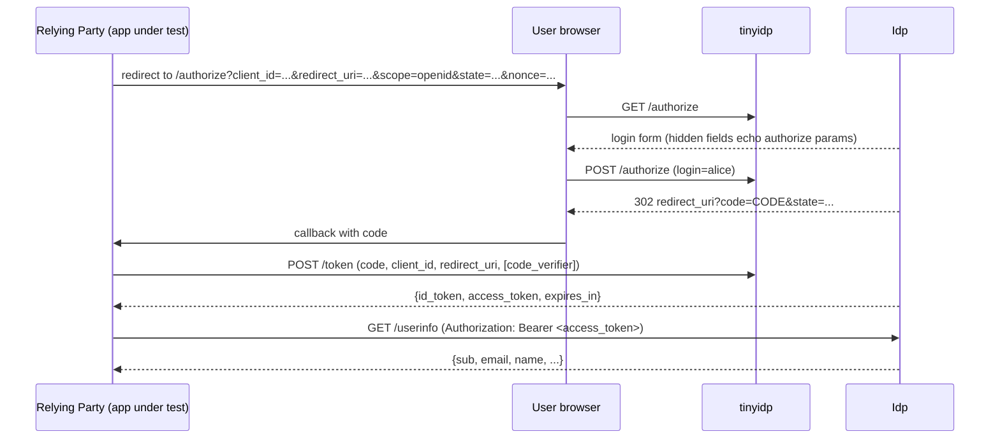
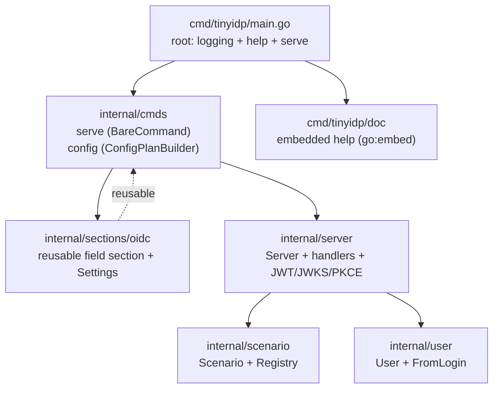

# Mock OIDC IdP: Building a Test Identity Provider with Glazed and Scenario Registries

This article is a deep-dive technical analysis of `tinyidp`, a minimal mock OpenID Connect Identity Provider written in Go. It explains what the system is, why each part exists, and how the pieces fit together. By the end, a reader should be able to rebuild the provider from the design described here, understand the invariants that make it correct, and extend it with new failure cases without touching handler code.

The reference repository is `/home/manuel/code/wesen/2026-06-22--mock-oidc-idp` (Go module `github.com/manuel/tinyidp`, Go 1.25.5). It is approximately 2,400 lines of Go across five internal packages, backed by 41 tests and 15 commits at the time of writing. The full design doc, phased task breakdown, and implementation diary live in the repo under `ttmp/2026/06/22/MOCK-OIDC-IDP--...`.

> [!summary]
> The project has three load-bearing ideas:
> 1. A test identity provider does not need a database, consent screens, or persistent keys. It needs the OIDC happy path plus a way to reproduce failure modes.
> 2. Failures should be modeled as data, not as branches scattered across handlers. A scenario registry makes adding a failure case a single-entry change.
> 3. Configuration should be a reusable schema section, not a pile of env-var reads. Adopting the Glazed command framework gives layered precedence (defaults, config, env, flags) and a documented path to profiles for free.

## Why this project exists

Applications that implement OIDC login need an identity provider to test against. The conventional answer is to run Keycloak inside a Docker Compose file. That answer is expensive for the problem it solves.

Keycloak is a production identity system. It boots slowly, runs a real database-backed realm, ships an admin UI, and performs migrations. Configuring a single client, a redirect URI, and one test user takes many clicks through that admin UI. Reproducing a failure mode — an expired ID token, a wrong audience, a UserInfo endpoint that returns a different subject — is either impossible or requires custom scripting against Keycloak's APIs. In continuous integration, the test suite becomes coupled to Docker availability and to pulling a large container image.

Most of that machinery is irrelevant to the actual test goal. A relying party under test needs four things from a provider: a discovery document that advertises the endpoints, a JWKS endpoint that publishes signing keys, an authorize endpoint that issues a one-time code after a login, and a token endpoint that exchanges that code for a signed ID token and an opaque access token. A UserInfo endpoint that returns claims for the access token completes the happy path. Nothing about testing an OIDC client requires realms, accounts, consent, or persistence.

`tinyidp` replaces Keycloak-in-Docker with a single Go binary that implements exactly that surface and nothing more. It binds to the loopback interface by default. It generates its RSA signing key in memory at startup. It stores authorization codes and access tokens in process memory. A restart invalidates every outstanding code and rotates the JWKS. For a test tool, all of these are acceptable tradeoffs, and each one removes a category of operational complexity.

## What the system is not

The boundary matters because it defines what the code is allowed to do. `tinyidp` is not production grade. It performs no real authentication — any typed login is accepted. It has no consent step. It has no refresh tokens, no revocation, no logout, no pairwise subjects, no dynamic client registration, and no TLS enforcement. The redirect URI allowlist is enforced before any redirect, but redirect handling is not hardened against a hostile deployment.

These omissions are deliberate. The system is built to run on `127.0.0.1` on a developer's machine or inside a `go test` process. Treating it as anything else would be a category error. The README and the embedded help pages state this constraint explicitly, and the default listen address encodes it: `127.0.0.1:5556`.

## The OIDC surface that matters

OpenID Connect is a protocol with many optional parts. A mock provider only needs to implement the subset that a typical relying party exercises. The table below lists the endpoints `tinyidp` exposes and the responsibility of each.

| Endpoint | Method | Responsibility |
|----------|--------|----------------|
| `/.well-known/openid-configuration` | GET | Advertise the issuer, endpoint URLs, supported response types, grant types, signing algorithms, scopes, claims, PKCE methods, and token-endpoint auth methods. |
| `/jwks` | GET | Publish the public half of the signing key as a JWK set so clients can verify ID token signatures. |
| `/authorize` | GET, POST | GET renders a login form; POST accepts a login, stores an authorization code, and redirects to the relying party with `code` and `state`. |
| `/token` | POST | Validate the code, the client, and PKCE; issue an RS256-signed ID token and an opaque access token. |
| `/userinfo` | GET | Look up the access token and return the user's claims. |
| `/healthz` | GET | Return `ok` for liveness probes in tests. |

The authorization code flow ties these endpoints together. Understanding the sequence is a prerequisite for understanding every later design decision, because the scenario registry exists to inject failures at specific points in this sequence.



Two properties of this flow shape the implementation. First, the authorization code is one-time use. A second exchange of the same code must fail. Second, the ID token must be verifiable by the relying party using only the public key published at `/jwks`. The implementation invariants below exist to preserve these two properties.

## Architecture and package layout

The codebase separates the HTTP layer from the configuration layer from the behavior layer. Each concern is a package, and the dependencies point in one direction: the command layer depends on the section layer and the server layer; the server layer depends on the scenario and user layers; nothing depends back toward the command layer.



The package layout mirrors this graph.

```
cmd/tinyidp/
  main.go                          # root command wiring
  doc/doc.go                        # embeds pages/
  doc/pages/{tinyidp,oidc-config}.md
internal/
  cmds/serve.go                     # serve as a cmds.BareCommand
  cmds/config.go                    # ConfigFilePlanBuilder for --config-file
  sections/oidc/{section,settings}.go  # reusable Glazed field section
  server/{server,authorize,token,userinfo,jwt,helpers,embed}.go
  server/static/login.html          # embedded login form
  scenario/scenario.go              # Scenario struct + Registry + builtins
  user/user.go                      # deterministic subject derivation
```

The `Server` struct is the single owner of mutable state. Everything that changes at runtime lives behind one mutex.

```go
type Server struct {
    issuer       string
    clientID     string
    clientSecret string
    redirectURIs map[string]bool

    key *rsa.PrivateKey
    kid string

    registry *scenario.Registry

    mu     sync.Mutex
    codes  map[string]authCode
    tokens map[string]accessToken
}
```

The signing key and the registry are set once at construction and never mutated, so they need no synchronization. The `codes` and `tokens` maps are the only shared mutable state, and every access to them goes through `s.mu`. The two structs stored in those maps carry the scenario forward from the authorize endpoint to the token and userinfo endpoints.

```go
type authCode struct {
    ClientID, RedirectURI, Scope, Nonce string
    CodeChallenge, CodeChallengeMethod string
    Expires                             time.Time
    User                                user.User
    Scenario                            *scenario.Scenario
}

type accessToken struct {
    User     user.User
    Expires  time.Time
    Scenario *scenario.Scenario
}
```

Storing a pointer to the same `Scenario` object on both the code and the access token is the mechanism that lets a single login drive behavior at three different endpoints. The authorize handler resolves the login to a scenario once; the token handler reads `ac.Scenario` to decide whether to fail; the userinfo handler reads `at.Scenario` to decide whether to fail. No re-lookup, no drift.

## Signing and verifying tokens by hand

A relying party verifies an ID token by fetching the provider's public key from `/jwks` and checking the signature. `tinyidp` implements both halves of this with the Go standard library: it signs with `rsa.SignPKCS1v15` over SHA-256, and the test suite verifies with `rsa.VerifyPKCS1v15`. No third-party JWT library is used for the signing path, which keeps the dependency surface at zero for the HTTP and crypto layers.

A JWT is three base64url-encoded segments joined by periods: `header.payload.signature`. The header declares the algorithm and the key identifier. The payload is a JSON object of claims. The signature is the RS256 signature of the bytes `header.payload`.

```go
func (s *Server) signJWT(claims map[string]any) (string, error) {
    header := map[string]any{"typ": "JWT", "alg": "RS256", "kid": s.kid}
    h, _ := json.Marshal(header)
    c, _ := json.Marshal(claims)

    input := b64(h) + "." + b64(c)
    sum := sha256.Sum256([]byte(input))
    sig, err := rsa.SignPKCS1v15(cryptoRandReader, s.key, crypto.SHA256, sum[:])
    if err != nil {
        return "", err
    }
    return input + "." + b64(sig), nil
}
```

The JWKS endpoint publishes the public half of the same key. Reconstructing an RSA public key from a JWK is two `big.Int.SetBytes` calls: one for the modulus `n`, one for the exponent `e`. The test suite does exactly this to verify that the ID token it received was signed by the key the provider advertised. This round-trip is the single most important correctness property of the happy path, and it is pinned by a test rather than assumed.

```go
n := new(big.Int).SetBytes(nBytes)
e := new(big.Int).SetBytes(eBytes).Int64()
pub := &rsa.PublicKey{N: n, E: int(e)}

sum := sha256.Sum256([]byte(parts[0] + "." + parts[1]))
if err := rsa.VerifyPKCS1v15(pub, crypto.SHA256, sum[:], sig); err != nil {
    t.Fatalf("id_token signature verification failed: %v", err)
}
```

The provider advertises only RS256 in discovery. This is a deliberate narrowing. JWT `alg=none` and HS/RS key confusion are well-known attack classes against JWT verifiers. A test tool should exercise the algorithm real relying parties actually use, and it should not expose the confused-algorithm surface by default. Exotic algorithm cases are deferred to a future phase where they can be opt-in scenarios rather than a default capability.

## Synthetic users without a database

A test provider needs to produce different authenticated principals so a relying party can be tested against more than one user. It does not need an account database, passwords, or persistence. The design decision is to derive a user deterministically from the typed login string.

The subject identifier is computed as a truncated hash of a salted, normalized login.

```go
func FromLogin(login string) User {
    login = Normalize(login)  // strings.ToLower(strings.TrimSpace(login))
    sum := sha256.Sum256([]byte("tinyidp:user:" + login))
    sub := "user-" + base64.RawURLEncoding.EncodeToString(sum[:16])

    email := login
    if !strings.Contains(email, "@") {
        email = login + "@example.test"
    }
    name := login
    if i := strings.Index(name, "@"); i >= 0 {
        name = name[:i]
    }
    return User{Sub: sub, Email: email, Name: name}
}
```

Three properties of this function matter, and each is a deliberate choice rather than a default.

The subject is stable. Logging in as `alice` today and logging in as `alice` tomorrow produce the same `sub`, with no storage. A relying party's test that asserts on a subject can be written against a fixed value. The test `TestSubIsStableAcrossLogins` pins this by running the full flow twice and comparing.

The subject is not the raw login. A relying party that accidentally treats the login string as the subject would not be caught if the provider returned `sub = "alice"`. Returning `sub = "user-NfTfZYYJ1idFA58J4RDISA"` forces the relying party to treat the subject as an opaque identifier, which is the correct OIDC behavior.

The login is normalized before hashing. `Alice`, ` alice `, and `alice` all hash to the same subject. This matches what a user expects from a login field and removes a class of "the same user is two different users" bugs from test runs. The salt prefix `tinyidp:user:` prevents the subject space from colliding with subjects produced by any other system that happens to hash logins the same way.

## The scenario registry

This is the central design decision of the project, and it is worth understanding why it exists before reading how it works.

If failure behavior is implemented directly in handlers, each new failure case requires editing every handler that participates in the flow. An authorization-endpoint failure needs a branch in `authorize`. A token-endpoint failure needs a branch in `token`. An ID-token claim mutation needs a branch in `token` after the claims are built. A UserInfo failure needs a branch in `userinfo`. After ten failure cases, the handlers are a pile of string switches, and adding an eleventh case means remembering to touch three files in the right order. The code drifts. A failure documented in the README is not actually wired in the handler, or a handler branch references a login string that no scenario lists.

The scenario registry replaces those scattered branches with a single data structure. A `Scenario` bundles a synthetic user with optional failure hooks for each stage of the flow. The handlers resolve a login to a scenario once, then branch on the scenario's fields. Adding a failure case becomes adding one entry to the registry. The handlers do not change.

```go
type Scenario struct {
    Name        string
    Description string
    Category    string
    User        user.User

    AuthError     string                            // OAuth error code returned at /authorize
    TokenError    string                            // "invalid_grant" | "server_error" | "slow"
    UserInfoError string                            // "401" | "500" | "sub_mismatch"
    MutateClaims  func(claims map[string]any, now time.Time)
}
```

The `Registry` maps a normalized login to a `Scenario`, with a fallback that derives a normal user from any unrecognized login. The fallback is what makes the login field accept arbitrary input: typing `carol@example.test` works even though no scenario is registered for it.

```go
func (r *Registry) Lookup(login string) (Scenario, bool) {
    if sc, ok := r.m[login]; ok {
        return sc, true
    }
    return r.fallback(login), false
}
```

The "one-file add" property is not a claim; it is a test. `TestScenarioHookIsThreadedThroughFlow` injects a scenario that adds a custom claim to the ID token, runs the full authorize-to-userinfo flow, and asserts the custom claim appears in the issued token. No handler code was changed to add the scenario. If a future refactor breaks the threading of `*Scenario` through the handlers, this test fails.

### How scenarios thread through the handlers

The authorize handler resolves the login to a scenario, applies the authorization-stage failure if present, and otherwise stores the scenario on the authorization code.

```go
sc, _ := s.registry.Lookup(login)

if sc.AuthError != "" {
    redirectOAuthError(w, r, ar.RedirectURI, ar.State, sc.AuthError, "simulated "+sc.AuthError)
    return
}
s.issueCodeAndRedirect(w, r, ar, sc.User, &sc)
```

The token handler reads the scenario off the code, applies the token-stage failure before issuing, applies the claim mutation after building the claims, and stores the scenario on the access token.

```go
switch ac.Scenario.TokenError {
case "invalid_grant":
    tokenError(w, http.StatusBadRequest, "invalid_grant", "...")
    return
case "server_error":
    tokenError(w, http.StatusInternalServerError, "server_error", "...")
    return
case "slow":
    time.Sleep(10 * time.Second)
}

// ... store access token with ac.Scenario ...

claims := map[string]any{ /* iss, sub, aud, exp, iat, auth_time, email, ... */ }
if ac.Nonce != "" {
    claims["nonce"] = ac.Nonce
}
if ac.Scenario.MutateClaims != nil {
    ac.Scenario.MutateClaims(claims, now)
}
idToken, err := s.signJWT(claims)
```

The userinfo handler reads the scenario off the access token and applies the userinfo-stage failure.

```go
switch at.Scenario.UserInfoError {
case "401":
    http.Error(w, "simulated invalid bearer token", http.StatusUnauthorized)
    return
case "500":
    http.Error(w, "simulated userinfo server error", http.StatusInternalServerError)
    return
case "sub_mismatch":
    writeJSON(w, http.StatusOK, map[string]any{
        "sub":            at.User.Sub + "-different",
        "email":          at.User.Email,
        "email_verified": true,
        "name":           at.User.Name,
    })
    return
}
```

The ordering of operations in the token handler is load-bearing and deserves attention. The `TokenError` switch runs before the access token is stored and before the ID token is signed, so a `server_error` scenario never issues a token. The `MutateClaims` hook runs after the base claims are built, including the nonce echo, so a mutator can delete or override any claim including `iss`, `aud`, and `nonce`. Signing happens after mutation, which means the mutated token is still correctly signed — a relying party that verifies the signature will pass that check and then fail on claim validation. That is exactly the failure surface a test of claim validation needs.

## The failure surface

The registry ships nineteen scenarios. Two are normal users. Seventeen are failures, grouped by the stage of the flow they exercise. Each failure is a data entry of roughly five lines in `builtinScenarios`. The full list, with the behavior each produces, is below.

| Login | Stage | Behavior |
|-------|-------|----------|
| `alice` | — | Normal user. |
| `bob` | — | Normal user, distinct subject. |
| `fail-access-denied` | authorize | Redirect to RP with `error=access_denied`; no code issued. |
| `fail-login-required` | authorize | Redirect with `error=login_required`. |
| `fail-consent-required` | authorize | Redirect with `error=consent_required`. |
| `fail-server-error` | authorize | Redirect with `error=server_error`. |
| `token-invalid-grant` | token | 400 `invalid_grant` at code exchange. |
| `token-server-error` | token | 500 `server_error` at code exchange. |
| `token-slow` | token | Sleep 10 seconds, then succeed. |
| `id-expired` | id token | `exp` set one hour in the past. |
| `id-wrong-aud` | id token | `aud` set to `some-other-client`. |
| `id-wrong-iss` | id token | `iss` appended with `/wrong`. |
| `id-missing-email` | id token | `email` and `email_verified` deleted. |
| `id-email-unverified` | id token | `email_verified` set to false. |
| `id-bad-nonce` | id token | `nonce` set to `wrong-nonce` (only when the RP sent a nonce). |
| `id-future-iat` | id token | `iat` and `auth_time` set ten minutes in the future. |
| `userinfo-401` | userinfo | 401 at `/userinfo`. |
| `userinfo-500` | userinfo | 500 at `/userinfo`. |
| `userinfo-sub-mismatch` | userinfo | 200 with a `sub` differing from the ID token's `sub`. |

Two design choices in this list deserve explanation because they are the cases a reviewer should look at most carefully.

The `id-bad-nonce` mutator only fires when the relying party sent a nonce. The hook checks `if _, ok := claims["nonce"]; ok` before overwriting. If an RP omits the nonce, the scenario becomes a no-op and a normal token is issued. The alternative — always setting `nonce = "wrong-nonce"` — would have the provider echo a nonce the RP never sent, which is itself a different and unrelated bug class. The chosen behavior keeps each scenario testing exactly one thing.

The `userinfo-sub-mismatch` scenario returns HTTP 200 with a valid JSON body whose `sub` differs from the ID token's `sub`. It is the subtlest case in the set. A relying party that only checks the status code at `/userinfo` will treat this as success and then operate on claims that disagree with the authenticated identity. The test `TestPhase4_UserInfoSubMismatch` asserts the mismatch by decoding both the ID token claims and the userinfo response and confirming they differ.

## The login page as a projection of the registry

A login page that requires the developer to memorize magic usernames defeats the purpose of a test tool. The login page is therefore rendered from the scenario registry itself, so the page and the registry cannot drift.

The `Grouped` method on the registry buckets scenarios by their `Category` field, preserving first-seen order. The authorize GET handler converts those groups into the template's data model and renders them as quick-pick buttons.

```go
func (s *Server) scenarioGroups() []scenarioGroup {
    in := s.registry.Grouped()
    out := make([]scenarioGroup, 0, len(in))
    for _, g := range in {
        items := make([]scenarioItem, 0, len(g.Items))
        for _, sc := range g.Items {
            items = append(items, scenarioItem{Name: sc.Name, Description: sc.Description})
        }
        out = append(out, scenarioGroup{Label: g.Label, Items: items})
    }
    return out
}
```

The embedded HTML template iterates the groups and renders one button per scenario. A small script fills the login input when a button is clicked. The manual login input remains, so arbitrary usernames — including unrecognized ones that fall through to the registry's derived-user fallback — still work.

The consequence is that adding a scenario in Phase 4 automatically surfaced it on the login page. No separate step updated the UI. The test `TestLoginPageListsBuiltinScenarios` asserts that the page contains the "Quick picks" section and a `data-login` button for `alice` and `bob`, which is the contract that keeps the page honest.

## The Glazed CLI layer

The first version of the provider read its configuration from `OIDC_*` environment variables in a hand-rolled `main` function. That approach does not scale to reusable configuration, config-file support, self-documenting help, or a path to profiles. The project was refactored to use the Glazed command framework, which provides all of these through a consistent pattern.

The OIDC provider configuration is defined once as a reusable Glazed field section. The section declares five fields with defaults: `issuer`, `addr`, `client-id`, `client-secret`, and `redirect-uris`. Any command that needs provider configuration composes the same section, and the flags, the environment-variable equivalents, and the config-file schema are all derived from that single definition.

```go
func NewSection() (schema.Section, error) {
    return schema.NewSection(Slug, "OIDC Provider Configuration", schema.WithFields(
        fields.New("issuer", fields.TypeString,
            fields.WithDefault("http://localhost:5556"),
            fields.WithHelp("Issuer URL advertised in discovery")),
        fields.New("addr", fields.TypeString,
            fields.WithDefault("127.0.0.1:5556"),
            fields.WithHelp("Listen address (loopback by default)")),
        fields.New("client-id", fields.TypeString, fields.WithDefault("dev-client"), ...),
        fields.New("client-secret", fields.TypeString, fields.WithDefault(""), ...),
        fields.New("redirect-uris", fields.TypeStringList,
            fields.WithDefault([]string{"http://localhost:3000/callback", "http://127.0.0.1:3000/callback"}), ...),
    ))
}
```

The `serve` command is implemented as a `cmds.BareCommand`, which is the Glazed interface for a command that runs and returns an error without emitting tabular rows. A long-running HTTP server has no row output, so this is the correct interface rather than the row-emitting `GlazeCommand`.

The root command follows the canonical Glazed initialization pattern: it adds the logging section so every child command inherits `--log-level` and `--log-format`, it loads the embedded help pages into a help system, and it calls `help_cmd.SetupCobraRootCommand` to wire `tinyidp help` and `tinyidp help <slug>`.

### Layered configuration precedence

The Glazed parser chain applies sources in reverse precedence order, so the last source applied has the highest precedence. When the `serve` command is built with `AppName: "tinyidp"` and a `ConfigPlanBuilder`, the effective precedence is fixed.


The precedence is not asserted in prose; it is verified. The test `TestEnvOverridesDefaults` sets `TINYIDP_ISSUER` and `TINYIDP_CLIENT_ID` and confirms the env values override the section defaults through `sources.Execute`. A manual triple-check with `--print-parsed-fields` confirms the full chain: a value set in a config file resolves to the config value; the same value with an env override resolves to the env value; the same value with a flag resolves to the flag value. The `--print-parsed-fields` introspection flag, provided by the Glazed command-settings section, emits the parse log for every field including the `source:` that won each value.

### The `--config-file` builder

Glazed does not implicitly load config files. The `--config-file` flag is added to every command by the command-settings section, but without a `ConfigPlanBuilder` it is a no-op. There is a test in the Glazed suite asserting this: `TestCobraParserDoesNotImplicitlyLoadConfigFileWithoutPlanBuilder`. To make the flag functional, `tinyidp` provides a builder that reads `--config-file` and returns a config plan with that file as an explicit layer.

```go
func ConfigFilePlanBuilder(_ *values.Values, cmd *cobra.Command, _ []string) (*config.Plan, error) {
    cfgFile, err := cmd.Flags().GetString("config-file")
    if err != nil || cfgFile == "" {
        return config.NewPlan(config.WithLayerOrder(config.LayerExplicit)), nil
    }
    return config.NewPlan(config.WithLayerOrder(config.LayerExplicit)).Add(
        config.ExplicitFile(cfgFile).Named("config-file"),
    ), nil
}
```

Returning an empty plan when no file is given is a clean no-op: no layers are added, no other sources are affected. The config file is a YAML document keyed by section slug, so the OIDC section lives under `oidc:`.

```yaml
oidc:
  client-id: my-app
  client-secret: dev-secret
  redirect-uris:
    - http://localhost:8080/callback
```

### Profiles: ready, not yet loading

Profile support is wired at the flag level. `cli.WithProfileSettingsSection()` adds `--profile` and `--profile-file` and the matching `TINYIDP_PROFILE` and `TINYIDP_PROFILE_FILE` environment variables. What is not yet wired is the middleware that resolves a `profiles.yaml` into applied overrides. This is a deliberate staging: the flag plumbing is in place, so adding profile-file resolution later is a small change that wires `middlewares.GatherFlagsFromProfiles` into the parser chain. The help pages state that a `profiles.yaml` is required for `--profile` to do anything, so the current state is not misleading.

The intended profile semantics, once wired, are that profiles are a mid-precedence default: a profile overrides the section defaults but is overridden by config files, environment variables, and flags. This makes a profile the right place for environment presets — a `dev` profile that points at a local issuer and a `ci` profile that uses a different client — without those presets overriding explicit flags.

## Concurrency and correctness invariants

The provider is a concurrent HTTP server. Two invariants must hold for it to be correct, and the implementation preserves each by construction.

The first invariant is that an authorization code is one-time use. The token handler pops the code atomically under the mutex: it reads the code, deletes it, and releases the lock in a single critical section. If the read and the delete were separated, two concurrent token exchanges for the same code could both read the code before either deleted it, and both would succeed.

```go
s.mu.Lock()
ac, ok := s.codes[code]
delete(s.codes, code)
s.mu.Unlock()
```

The test `TestCodeIsOneTimeUse` pins this: a first exchange succeeds, and a second exchange of the same code returns 400 `invalid_grant`.

The second invariant is that the redirect URI allowlist is enforced before any redirect. A request with a disallowed `redirect_uri` must never be redirected back to that URI, because redirecting to an attacker-controlled URL is the classic OAuth redirect attack. The validation lives in `parseAuthorizeRequest`, which is called on both the GET and POST paths of `/authorize`. A disallowed URI produces a direct 400 response, never a redirect. The test `TestAuthorizeGETRejectsDisallowedRedirectURI` pins this.

A subtler invariant is the ordering of operations in the token handler. The `TokenError` switch must run before the access token is stored, so a `server_error` scenario does not leave a token in the map. The `MutateClaims` hook must run after the base claims are built, so it can override any claim. Signing must run after mutation. These orderings are commented in the code, and a future refactor that moves them would not be caught by the existing tests unless the mutator test runs, which it does.

## The testing strategy

The test suite uses `httptest.NewServer` to mount the provider on a real HTTP server with a random port, then drives the full authorize-to-userinfo flow with a standard `http.Client`. This approach was chosen over live-port testing because it is deterministic, fast, and assertable. A test that spins up a real `ListenAndServe` on a fixed port is brittle: it races with other tests, it cannot run in parallel, and it requires the test to parse HTTP responses from a subprocess.

The `registerRoutes` method exists to make this possible. It wires the handlers onto a caller-provided `*http.ServeMux` without calling `ListenAndServe`. The production `main` calls it with a fresh mux and serves it; the test harness calls it with a fresh mux and wraps it in `httptest.NewServer`. The same code path is exercised in both cases.

The flow test verifies the ID token signature against the JWKS public key on every run. This is the property that makes the happy path real: a relying party can fetch the key, reconstruct the RSA public key from the JWK's `n` and `e`, and verify the signature. If the signing key and the published key ever diverge, or if the signature algorithm is wrong, this test fails. It is the single test that most directly validates the core OIDC contract.

The failure scenarios are covered by a matrix test. `TestPhase4_AuthErrorScenariosRedirectWithError` runs each authorization-failure scenario as a subtest and asserts the redirect carries the correct OAuth error code and no code. `TestPhase4_TokenErrorScenarios` asserts the token endpoint returns the correct status and error for each token failure. `TestPhase4_IDTokenMutations` runs each ID-token mutation scenario, verifies the signature after mutation, and asserts the specific claim was changed. `TestPhase4_UserInfoFailures` and `TestPhase4_UserInfoSubMismatch` cover the userinfo failures. Each failure case has exactly one test that asserts the documented behavior. If a scenario is added but its test is forgotten, the scenario is untested; if a scenario's test is added but the scenario is removed, the test fails. The matrix is the contract between the registry and the documented behavior.

## What was deferred and why

The project defines an MVP cutoff at Phase 4. Phases 5 through 12 are documented in the repo's phased task breakdown but are not implemented. The deferrals are worth recording because each one represents a deliberate scope decision rather than an oversight.

The deferred phases, in order, are: multiple clients with distinct configurations (public PKCE-only, confidential with secret, permissive default); IdP session cookies with `prompt=none`, `prompt=login`, `max_age`, and `login_hint`; claim variants including groups, roles, tenants, and unicode names; a debug UI for inspecting issued codes and tokens; refresh tokens with rotation and reuse detection; JWKS key rotation with unknown-kid and bad-signature cases; RP-initiated logout; and a public Go test helper that spins up a provider inside `go test`.

Two of these are worth calling out as the most valuable next steps. Multiple clients would let a single provider test public and confidential relying parties against the same instance, which is the common real-world shape. The Go test helper would make the provider embeddable in a relying party's own test suite, removing the need to run a separate process. Both build cleanly on the existing structure: multiple clients extends the client validation in `parseAuthorizeRequest`; the test helper exposes the `New` constructor and `RegisterRoutes` that already exist.

## Working rules

The key points a reader should take away from this system.

- A test identity provider needs the OIDC happy path plus a way to reproduce failures. It does not need a database, consent, persistence, or an admin UI. Removing those removes the operational cost that makes Keycloak-in-Docker expensive for testing.
- The authorization code is one-time use, and the pop-and-delete must share one mutex critical section. Splitting the read and the delete reintroduces a code-reuse race.
- The redirect URI allowlist is enforced before any redirect. A disallowed URI produces a direct error response, never a redirect. This is the single most important security property of the authorize endpoint.
- Failures are data, not branches. The scenario registry makes adding a failure case a single-entry change and keeps the handlers thin. The "one-file add" property is a test, not a claim.
- The same `*Scenario` object is stored on both the authorization code and the access token, so one login drives behavior at three endpoints without re-lookup.
- Operation ordering in the token handler is load-bearing: the token-error switch runs before issuing; the claim-mutation hook runs after the base claims are built; signing runs after mutation. A mutated token is still correctly signed.
- Subjects are derived deterministically from a salted, normalized login. The subject is stable across restarts, is not the raw login, and normalizes case and whitespace.
- The provider advertises only RS256. The confused-algorithm attack surface is not exposed by default.
- Configuration is a reusable field section defined once. Flags, environment variables, and config-file schema are derived from that single definition and cannot drift.
- The configuration precedence chain is verified, not asserted. `--print-parsed-fields` emits the source that won each value, and a test pins the env-overrides-defaults behavior.

## Important project docs

These live in the repository rather than in the vault.

- `/home/manuel/code/wesen/2026-06-22--mock-oidc-idp/ttmp/2026/06/22/MOCK-OIDC-IDP--mock-oidc-identity-provider-for-local-testing-keycloak-replacement/design-doc/01-mock-oidc-idp-design-and-implementation-guide.md` — the full design doc with decision records.
- `.../reference/02-implementation-phases-and-tasks.md` — the checkbox per-task breakdown for Phases 0 through 12.
- `.../reference/01-implementation-diary.md` — the chronological implementation diary, including failures and sharp edges.
- `/home/manuel/code/wesen/2026-06-22--mock-oidc-idp/README.md` — run and configuration instructions.
- `/home/manuel/code/wesen/2026-06-22--mock-oidc-idp/internal/scenario/scenario.go` — the scenario registry and built-in scenarios.
- `/home/manuel/code/wesen/2026-06-22--mock-oidc-idp/internal/sections/oidc/section.go` — the reusable OIDC configuration section.

## Open questions

- Should the `token-slow` duration be configurable rather than a fixed 10 seconds? A fixed sleep is painful in continuous integration and blocks a handler goroutine for its full duration.
- Should `Grouped` derive category order from map iteration, which is non-deterministic in Go, or should categories carry an explicit priority? The current first-seen order is stable for the existing scenarios but will shuffle once many categories exist.
- Should profile-file resolution be wired now, or is the flag-ready state sufficient until a concrete need for environment presets appears?
- The env-prefix change from `OIDC_*` to `TINYIDP_*` (driven by the Glazed `AppName`) is a breaking change for anyone following the pre-Glazed smoke-test commands. Confirm this is acceptable for an unreleased tool, or add a compatibility shim.

## Near-term next steps

- Wire `middlewares.GatherFlagsFromProfiles` so `--profile` resolves a `profiles.yaml` against the documented precedence. The flag plumbing already exists.
- Add a `print-config` subcommand that composes the same OIDC section and emits the resolved configuration. This is the natural second consumer of the reusable section and validates that the section is genuinely reusable.
- Begin Phase 5 (multiple clients) by extracting the single-client fields on `Server` into a client registry, keeping the existing `dev-client` as one entry.
- Add a test for code expiry. The 5-minute TTL is currently only proven indirectly; a fake clock or a short-TTL environment knob would pin it.

## Project working rule

> [!important]
> Add failure cases as scenario registry entries, never as handler branches. If adding a failure requires editing more than one file outside `internal/scenario`, the scenario abstraction has regressed and the handler has absorbed behavior that belongs in the data.

## Related notes

- [[ARTICLE - Playbook - Self-Contained Go Wasm and JavaScript Browser Applications]] — another Glazed-grounded Go deep dive; the same reusable-section and layered-config patterns appear there in a different domain.
