# Mock OIDC IdP: Sessions, Claims, Refresh Tokens, and the Multi-Client Registry

This article is a follow-up to [[ARTICLE - Mock OIDC IdP - Building a Test Identity Provider with Glazed and Scenario Registries]]. The first article covered the OIDC happy path, the scenario registry, and the Glazed CLI layer. This article covers everything that came after: switchable configuration via profiles, the multi-client registry, the session layer (`prompt`, `max_age`, `login_hint`, `auth_time`), declarative claim modeling, a loopback debug UI, and refresh-token rotation with reuse detection.

By the end of this article, a reader should understand how the mock IdP grew from a single-client, single-login provider into one that reproduces the behaviors real relying parties actually depend on: silent login, forced re-authentication, claim-based authorization, token renewal, and the failure modes each of those introduces.

The reference repository is `/home/manuel/code/wesen/2026-06-22--mock-oidc-idp` (Go module `github.com/manuel/tinyidp`). At the time of writing it is approximately 4,900 lines of Go across six internal packages, backed by 97 tests. Phases 0 through 9 are complete; JWKS key rotation, logout, and the embedded Go test helper remain.

> [!summary]
> The follow-up work is organized around four load-bearing ideas:
> 1. Configuration became switchable. Profiles load a named bundle of overrides with a documented precedence, and `print-config` proves the reusable section is genuinely shared across commands.
> 2. The provider grew from one client to a registry. Per-client redirect allowlists, PKCE requirements, and cross-client code rejection make a single instance test a public SPA, a confidential web app, and a permissive dev client at once.
> 3. The session layer makes `auth_time` honest. Carrying the login time through the code into the token — rather than recomputing it at issuance — is what makes silent re-issuance and `max_age` checks mean what the spec says.
> 4. Claims are declarative and consistent. `ExtraClaims` and `OmitClaims` describe a user's real attributes across both the ID token and userinfo, leaving `MutateClaims` for the single purpose of injecting an invalid ID token.

## Switchable configuration: profiles and print-config

The first article left profiles as a ready-but-unwired feature: the `--profile` flag existed, but no `profiles.yaml` was ever loaded. The follow-up makes profiles functional and adds a second command that consumes the same configuration section, proving the section is reusable rather than accidentally coupled to `serve`.

### Profile resolution as a middleware chain

Glazed does not implicitly load profile files. The `--profile-file` flag is added to every command by the command-settings section, but without a `ConfigPlanBuilder` and a profile middleware it is a no-op. Wiring profiles means replacing the default parser chain with one that inserts `GatherFlagsFromProfiles` at the correct precedence layer.

The precedence the mock implements, from lowest to highest, is:

```
defaults  <  profiles  <  config files (--config-file)  <  env (TINYIDP_*)  <  args  <  flags
```

Profiles sit above defaults — a profile is a convenient baseline, like a `dev` issuer versus a `ci` issuer — but below config, env, and flags, so a local override always wins. This is the placement the Glazed documentation recommends for environment presets, and it is the placement a relying party author expects when they set a flag to debug a single value.

The middleware chain is built in reverse precedence order, because the last source applied has the highest precedence:

```go
mws = append(mws,
    cmd_sources.FromCobra(cmd, ...),        // flags (highest)
    cmd_sources.FromArgs(args, ...),         // positional args
    cmd_sources.FromEnv(envPrefix, ...),    // env (TINYIDP_*)
    cmd_sources.FromConfigPlanBuilder(...), // config files (--config-file)
    cmd_sources.GatherFlagsFromProfiles(   // profiles (above defaults)
        defFile, profileFile, profile, "default", ...),
    cmd_sources.FromDefaults(...),          // defaults (lowest)
)
```

The subtle part is that profile *selection* itself can come from an environment variable (`TINYIDP_PROFILE`). If the middleware that reads `--profile` were constructed before env was applied, it would capture the default profile name and load the wrong profile. The implementation resolves the selection first, by bootstrapping the profile-settings section from cobra plus env, and only then constructs the profile middleware with the resolved values.

### The error behavior that makes profiles safe to use

A profile system is only useful if it fails loudly when it is misconfigured. The mock implements three error cases, each of which matters:

| Situation | Behavior |
|-----------|----------|
| `--profile-file` points at a non-existent file that is not the default | Error. A typo in the path never silently falls back to defaults. |
| The default file is missing and the requested profile is `default` | Silent skip. `tinyidp serve` works out of the box with no `profiles.yaml`. |
| The default file is missing and a non-default profile is requested | Error. `TINYIDP_PROFILE=staging` with no file fails rather than running with defaults. |

The first case is the one that catches real mistakes. Without it, a developer who typos `--profile-file profles.yaml` would get a server running with the built-in defaults and spend an hour wondering why their profile had no effect.

### print-config: the second consumer

`tinyidp print-config` composes the same reusable `oidc` field section as `serve`, resolves it through the identical precedence chain, and emits the result as a single Glazed row. Its existence is a correctness argument: if `print-config` could not compose the same section and resolve it identically, the "reusable section" claim would be false.

```go
func (c *PrintConfigCommand) RunIntoGlazeProcessor(...) error {
    cfg, _ := oidc.GetSettings(vals)
    row := types.NewRow(
        types.MRP("issuer", cfg.Issuer),
        types.MRP("addr", cfg.Addr),
        types.MRP("client_id", cfg.ClientID),
        types.MRP("client_secret", cfg.ClientSecret),
        types.MRP("redirect_uris", cfg.RedirectURIs),
    )
    return gp.AddRow(ctx, row)
}
```

`print-config` is also a debugging tool. Because it runs the full chain — defaults, profiles, config, env, flags — its output is exactly what `serve` would use for the same inputs. A developer can confirm which issuer and redirect URIs the server will run with before starting it, including which source won each value.

## The multi-client registry

The first article's provider accepted a single client. The follow-up introduces a client registry so one running instance can serve a public SPA, a confidential web app, and a permissive dev client simultaneously. This is the shape real relying parties are tested against, because real deployments mix client types.

### Three built-in clients, one registry

| Client | Type | PKCE | Secret | Default redirect |
|--------|------|------|--------|------------------|
| `dev-client` | public | optional | (none) | `http://localhost:3000/callback`, `http://127.0.0.1:3000/callback` |
| `public-spa` | public | **required** | (none) | `http://localhost:8080/callback` |
| `web-app` | confidential | optional | `dev-secret` | `http://localhost:8080/callback` |

Each client owns its own redirect URI allowlist, its own PKCE requirement, and its own scope allowlist. Validation in `parseAuthorizeRequest` looks up the client by ID and checks each property against that specific client:

```go
c, ok := s.clients.Lookup(ar.ClientID)
if !ok { return ar, errText("unknown client_id") }
if !c.AllowsRedirectURI(ar.RedirectURI) { return ar, errText("redirect_uri not allowed for this client") }
if !c.AllowsScope(ar.Scope) { return ar, errText("scope not allowed for this client") }
if c.RequirePKCE && ar.CodeChallenge == "" { return ar, errText("this client requires PKCE") }
```

A redirect URI is valid for a specific client, not globally. The single-client model collapsed this distinction; the registry makes it explicit, and a request that reuses `public-spa`'s redirect URI against `web-app` is rejected unless `web-app` also allows it.

### Cross-client code rejection

The most important new security property is that a code issued to one client cannot be redeemed by another. This comes from an existing check, not a new one, because of how the code stores its provenance.

At `/authorize`, the code's `ClientID` is set from the authorize request's `client_id`. At `/token`, the handler authenticates the client and then compares the code's `ClientID` to the authenticating client:

```go
if ac.ClientID != clientID || ac.RedirectURI != r.Form.Get("redirect_uri") {
    tokenError(w, http.StatusBadRequest, "invalid_grant", "client_id or redirect_uri mismatch")
    return
}
```

If the two differ, the code was issued to a different client. No new check was needed; the existing one already does the right thing once multiple clients exist. The test `TestPhase5_CrossClientCodeRejection` pins this by issuing a code as `dev-client` and attempting to redeem it as `web-app`.

### Merging a configured client into a builtin

The OIDC section still exposes `--client-id`, `--client-secret`, and `--redirect-uris`. When the configured client ID matches a builtin, the configuration is **merged** into the builtin rather than replacing it. This resolves a subtle problem the replace behavior introduced.

Under replace, configuring `--client-id public-spa --redirect-uris http://localhost:9090/cb` produced a `public-spa` client with `RequirePKCE` set to false — the opposite of what the builtin name promises. A test relying on "public-spa requires PKCE" would pass against the builtin and silently pass insecurely once a developer added a custom redirect URI. Merge fixes this by preserving the builtin's class-defining properties.

```go
func Merge(base, override Client) Client {
    out := base
    out.ID = override.ID
    if override.Secret != "" { out.Secret = override.Secret }
    out.RedirectURIs = unionStrings(base.RedirectURIs, override.RedirectURIs)
    return out
}
```

The merge rule generalizes cleanly: configured non-empty scalar values override, list values union, and fields absent from the config schema are taken from the base. `RequirePKCE` and `AllowedScopes` have no override in the OIDC section, so they always come from the builtin. A configured ID that does not match any builtin registers a new permissive client, preserving the single-client quick-test behavior.

## The session layer

The session layer is the largest addition in the follow-up. It introduces an IdP session cookie, an in-memory session store, and the OIDC re-authentication parameters. Without it, the mock can only test the initial-login path, which is the least interesting part of OIDC session handling.

### The authorize GET decision tree

The GET branch of `/authorize` now implements the OIDC session rules. The logic is a decision tree that depends on three inputs: whether a valid session exists, whether `prompt=login` was requested, and whether `max_age` was exceeded.

```mermaid
flowchart TD
    start["GET /authorize"] --> read["read session cookie"]
    read --> check{"prompt contains none?"}
    check -->|yes| none{"valid session AND fresh enough?"}
    none -->|no| err["redirect: error=login_required"]
    none -->|yes| silent1["silently issue code"]
    check -->|no| force{"prompt=login OR max_age exceeded?"}
    force -->|yes| form["show login form (re-auth)"]
    force -->|no| sess{"valid session?"}
    sess -->|yes| silent2["silently issue code"]
    sess -->|no| form2["show login form"]

    style err fill:#8b3a3a,stroke:#b55,color:#fff
    style silent1 fill:#2d4a22,stroke:#4a7c3f
    style silent2 fill:#2d4a22,stroke:#4a7c3f
    style form fill:#1a3a5c,stroke:#3a7cbd
    style form2 fill:#1a3a5c,stroke:#3a7cbd
```



`prompt=none` forbids any user interface, so if re-authentication is required it must surface as a `login_required` error rather than the login form. This is the constraint that gives the decision tree its shape: the `prompt=none` branch cannot fall through to "show form".

### The auth_time invariant

The single most important design decision in the session layer is that `auth_time` is carried from the login through the code into the token, rather than recomputed at token issuance. Understanding why this matters requires understanding what `auth_time` is for.

A relying party that requests `max_age=300` is asking: "was the user authenticated within the last 300 seconds?" It checks this by reading `auth_time` from the ID token and verifying `auth_time + 300 >= now`. If the IdP sets `auth_time` to the token-issuance time, this check is always true, because the token was just issued. The check becomes meaningless.

The mock carries the real authentication time:

```go
// At login (POST /authorize):
sess := newSession(login, sc.User, &sc)   // AuthTime = now
s.setSessionCookie(w, sess)
s.issueCodeAndRedirect(w, r, ar, sc.User, &sc, sess.AuthTime)

// At the token endpoint:
claims := map[string]any{
    ...
    "auth_time": ac.AuthTime.Unix(),   // the real login time, not now()
}
```

When a silent re-issue happens minutes after the original login, the ID token's `auth_time` is the original login time. A relying party checking `auth_time + max_age >= now` sees the true age of the session and can correctly demand re-authentication. The test `TestPhase6_SilentIssuePreservesAuthTime` pins this by sleeping 1.5 seconds between the login and the silent issue, then asserting `auth_time` is the login time, not the issue time.

### The cookie is not Secure

The session cookie is `HttpOnly` and `SameSite=Lax`, but it is not `Secure`. This is deliberate. The mock IdP serves plain HTTP on loopback (`http://localhost:5556`), and a `Secure` cookie is only sent over HTTPS. Marking the cookie `Secure` would make sessions silently never work — the browser would refuse to send the cookie, and every `prompt=none` request would return `login_required` regardless of whether the user had logged in. For a loopback test tool, plain HTTP is correct, and the cookie matches it.

### max_age and prompt are parsed, not matched as substrings

`prompt` is a space-delimited list in OIDC (for example, `prompt="login none"`). A substring check for `"none"` would false-match a value like `"nologin"`. The mock splits on whitespace:

```go
func promptHas(prompt, want string) bool {
    for _, p := range strings.Fields(prompt) {
        if p == want { return true }
    }
    return false
}
```

`max_age` is an integer number of seconds. A session is "fresh enough" if the time since `auth_time` is within `max_age`:

```go
func (sess *session) freshEnough(maxAge int) bool {
    if maxAge <= 0 { return true }
    return time.Since(sess.AuthTime) <= time.Duration(maxAge)*time.Second
}
```

A `max_age` of zero means "no constraint", which is the absence of the parameter. This matters because the mock must accept an authorize request that omits `max_age` entirely, not treat the omission as `max_age=0` in a way that would force re-authentication.

## Declarative claims: ExtraClaims and OmitClaims

The first article's `MutateClaims` hook mutates the ID token after its claims are built. The follow-up adds two declarative fields that describe a user's real attributes, and the distinction between them matters.

### Why two mechanisms are needed

`MutateClaims` is a *failure injection* hook. It makes the ID token wrong — sets `exp` in the past, changes `aud`, drops `email` — so a relying party can be tested on whether it catches the invalid token. It affects the ID token only, by design, because its purpose is to test ID-token validation.

A positive claim shape — "this user has no email", "this user is in the admin group" — is a different kind of thing. It describes the user's actual attributes, and those attributes should appear identically in both the ID token and the userinfo response. If a mock modeled "user has no email" by deleting email from the ID token only, the ID token and userinfo would disagree, which is itself a bug class.

The follow-up introduces two fields to model positive claim shapes declaratively:

- `ExtraClaims map[string]any` — merged into both the ID token and userinfo after the base claims are built.
- `OmitClaims []string` — deleted from both after ExtraClaims are merged.

The ordering in the token handler is load-bearing:

```go
// base claims (iss, sub, aud, exp, iat, auth_time, email, name, ...)
for k, v := range ac.Scenario.ExtraClaims { claims[k] = v }   // Phase 7
for _, k := range ac.Scenario.OmitClaims { delete(claims, k) } // Phase 7
if ac.Scenario.MutateClaims != nil { ac.Scenario.MutateClaims(claims, now) } // Phase 4
```

`MutateClaims` runs last, so a Phase 4 failure mutator can override anything, including a value set by ExtraClaims. This keeps the two mechanisms composable: a future scenario could set `aud` via ExtraClaims and then corrupt it via MutateClaims, and both would apply in order.

### Claim variants

The registry ships nine claim-bearing scenarios, grouped under "Claim variants":

| Scenario | What it emits |
|----------|---------------|
| `admin` | `groups:[admin, engineering]`, `roles:[owner]`, `preferred_username:admin` |
| `viewer` | `groups:[viewer]`, `roles:[reader]` |
| `no-groups` | no groups/roles claims at all |
| `many-groups` | eight groups (stress claim parsing) |
| `tenant-a-admin` | `groups:[admin]`, `tenant:tenant-a` |
| `tenant-b-viewer` | `groups:[viewer]`, `tenant:tenant-b` |
| `unicode-name` | `name:"Müller Frédéric"`, `locale:de-DE` |
| `no-email` | email and email_verified omitted (via OmitClaims) |
| `unverified-email` | `email_verified:false` |

Discovery advertises the new claims: `groups`, `roles`, `tenant`, `preferred_username`, and `locale` now appear in `claims_supported`.

The `no-email` scenario is the one that exposed the need for `OmitClaims`. Its first implementation used `MutateClaims` to delete email, which worked for the ID token but left email in the userinfo response — the ID token and userinfo disagreed. The fix was to introduce `OmitClaims`, honored by both endpoints, and switch `no-email` to it. This is the cleanest expression of the distinction: `OmitClaims` describes the user's attributes; `MutateClaims` injects a token-level failure.

### userinfoClaims: one helper, agreement guaranteed

Before the follow-up, the userinfo handler built its response as a hardcoded map of `sub`/`email`/`email_verified`/`name`. The `sub_mismatch` failure scenario returned a different hardcoded subset. With Phase 7's extra claims, that hardcoded subset would have silently dropped `groups`, `roles`, and `tenant`, making the `sub_mismatch` scenario disagree on more than just `sub`.

The fix was to centralize the response body in a single helper:

```go
func userinfoClaims(at accessToken) map[string]any {
    resp := map[string]any{
        "sub": at.User.Sub, "email": at.User.Email,
        "email_verified": true, "name": at.User.Name,
    }
    for k, v := range at.Scenario.ExtraClaims { resp[k] = v }
    for _, k := range at.Scenario.OmitClaims { delete(resp, k) }
    return resp
}
```

The normal path and the `sub_mismatch` path both call it; the `sub_mismatch` path overrides `sub` afterward. The result is that `sub_mismatch` disagrees with the ID token on exactly `sub` and nothing else, which is the failure it is meant to test.

## The debug UI

Flows that involve sessions, refresh tokens, and scenarios are hard to inspect from the outside. The debug UI exposes the in-memory state so a developer can see what the IdP actually issued without adding log statements.

### Loopback-only introspection

Five endpoints live under `/debug`:

| Endpoint | Returns |
|----------|---------|
| `/debug` | Counts of sessions, codes, and tokens, plus the endpoint map. |
| `/debug/sessions` | Active sessions (id prefix, login, sub, auth_time, expires). |
| `/debug/codes` | Outstanding authorization codes (code prefix, client_id, redirect_uri, sub, scenario, expires). |
| `/debug/tokens` | Issued access tokens (token prefix, sub, scenario, expires). |
| `/debug/reset` | POST-only. Clears all sessions, codes, tokens, and refresh tokens. |

Every `/debug/*` request is guarded by a loopback check:

```go
func requireLoopback(w http.ResponseWriter, r *http.Request) bool {
    host, _, _ := net.SplitHostPort(r.RemoteAddr)
    ip := net.ParseIP(host)
    if ip == nil || !ip.IsLoopback() {
        http.Error(w, "debug endpoints are loopback-only", http.StatusForbidden)
        return false
    }
    return true
}
```

This matters because the server can be bound to a LAN address (`OIDC_ADDR=0.0.0.0:5556`) for mobile-device testing. Without the guard, exposing the server to the LAN would also expose every issued token. The guard ensures that a LAN binding exposes only the OIDC endpoints, never the debug state.

Secrets are shown as an 8-character prefix. A listing does not expose the full code, token, or session ID, but the prefix is enough to match an entry against a flow log.

The reset endpoint is POST-only so a stray GET — a browser prefetch, a clicked link — cannot wipe state. The test `TestPhase8_DebugResetIsPostOnly` pins this.

## Refresh tokens and rotation

The final addition in the follow-up is refresh-token support. An RP that requests the `offline_access` scope receives a refresh token alongside its access token, and can renew the access token without re-authentication.

### The offline_access trigger

The authorization-code exchange issues a refresh token only when the RP requested `offline_access`:

```go
if hasScope(ac.Scope, "offline_access") {
    rt := s.issueRefreshToken(ac.User, ac.Scenario, ac.ClientID, ac.Scope, now)
    resp["refresh_token"] = rt
}
```

A flow without `offline_access` produces no refresh token. This matches the spec: `offline_access` is the scope that signals the RP wants a refresh token, and an RP that does not request it should not receive one.

### Rotation and reuse detection

The refresh-token grant rotates the token on every use. The presented token is deleted, and a new one is issued:

```go
s.mu.Lock()
rtok, ok := s.refreshTokens[rt]
delete(s.refreshTokens, rt)   // rotation: the old token cannot be reused
s.mu.Unlock()

if !ok { tokenError(w, ..., "invalid_grant", "unknown refresh token (rotated, revoked, or never issued)"); return }
```

Reuse of a rotated token fails, because the token was deleted on first use. A second presentation of the same token finds nothing in the map and returns `invalid_grant`. This is the standard OAuth refresh-token-rotation reuse signal: a refresh token that has already been used to obtain a new one is invalid, and its reuse indicates the token may have been intercepted.

The delete happens inside the same critical section as the lookup, so two concurrent refresh requests for the same token cannot both succeed. One wins; the other finds the token gone. This is the same atomic pop-and-delete pattern the authorization-code handler uses, for the same reason: one-time-use tokens require the read and the delete to share one mutex.

### Cross-client refresh is rejected

A refresh token carries the `ClientID` it was issued to. The refresh handler compares it to the authenticating client:

```go
if rtok.ClientID != clientID {
    tokenError(w, http.StatusBadRequest, "invalid_grant", "client_id mismatch")
    return
}
```

A refresh token issued to `dev-client` cannot be redeemed by `web-app`. This mirrors the cross-client code rejection in the authorization-code flow and is tested by `TestPhase9_RefreshWrongClientRejected`.

## What the mock now reproduces

The follow-up expands the set of real OIDC behaviors the mock can reproduce. The table below maps each capability to the test that pins it.

| Capability | How it is tested |
|------------|------------------|
| Profile overrides defaults | `TestProfileOverridesDefaults` |
| Env overrides profile | `TestProfileEnvOverridesProfile` |
| Missing default file = silent skip | `TestProfileMissingDefaultFileSkipsSilently` |
| Explicit missing file = error | `TestProfileExplicitMissingFileErrors` |
| `print-config` shares the section | `TestPrintConfigEmitsResolvedDefaults` |
| `public-spa` requires PKCE | `TestPhase5_PublicSpaRequiresPKCE` |
| `web-app` requires secret | `TestPhase5_WebAppRequiresSecret` |
| Cross-client code rejected | `TestPhase5_CrossClientCodeRejection` |
| Merge preserves RequirePKCE | `TestMergePreservesBuiltinProperties` |
| `prompt=none` + no session = login_required | `TestPhase6_PromptNoneNoSessionReturnsLoginRequired` |
| `prompt=none` + session = silent issue | `TestPhase6_PromptNoneWithSessionSilentlyIssues` |
| Silent issue uses session user | `TestPhase6_SilentIssueUsesSessionUser` |
| `prompt=login` forces form | `TestPhase6_PromptLoginForcesFormEvenWithSession` |
| `auth_time` preserved across silent issue | `TestPhase6_SilentIssuePreservesAuthTime` |
| `max_age` exceeded forces re-auth | `TestPhase6_MaxAgeExceedsForcesReauth` |
| `login_hint` prefills form | `TestPhase6_LoginHintPrefillsForm` |
| ExtraClaims in ID token + userinfo agree | `TestPhase7_AdminClaims` |
| OmitClaims drops from both | `TestPhase7_NoEmailDeletesClaims` |
| Debug UI lists state | `TestPhase8_DebugTokensListsIssuedToken` |
| Debug reset clears state | `TestPhase8_DebugResetClearsState` |
| `offline_access` issues refresh token | `TestPhase9_OfflineAccessIssuesRefreshToken` |
| Refresh rotation rejects reuse | `TestPhase9_RefreshRotationRejectsReuse` |
| Cross-client refresh rejected | `TestPhase9_RefreshWrongClientRejected` |

## Working rules

The key points a reader should take away from the follow-up work.

- Profile resolution is a middleware chain with a fixed precedence. Profiles sit above defaults and below config, env, and flags, so a local override always wins. The chain is verified, not asserted.
- A profile system must fail loudly when misconfigured. An explicit missing file errors; only the missing default file with the default profile is a silent skip.
- `print-config` is both a debugging tool and a proof of reusability. If it cannot compose the same section as `serve` and resolve it identically, the reusable-section claim is false.
- A client registry makes per-client redirect allowlists, PKCE requirements, and scope allowlists explicit. Cross-client code rejection comes from carrying the authorize-time `client_id` on the code.
- Merging a configured client into a builtin preserves the builtin's class-defining properties (`RequirePKCE`, `Secret`, `AllowedScopes`). Replace loses them; merge keeps them.
- `auth_time` is carried from the login through the code into the token, not recomputed at issuance. This is what makes `max_age` checks honest.
- The authorize GET decision tree cannot show a form for `prompt=none`. That constraint gives the tree its shape: `prompt=none` with no valid session must return `login_required`.
- `ExtraClaims` and `OmitClaims` describe a user's real attributes and are honored by both the ID token and userinfo. `MutateClaims` is a failure-injection hook that affects the ID token only. Conflating them produces a mock where the ID token and userinfo disagree.
- Refresh-token rotation deletes the presented token and issues a new one. Reuse of a rotated token fails, which is the standard reuse signal. The delete shares one critical section with the lookup.
- Debug endpoints are loopback-only. A LAN binding exposes the OIDC endpoints, never the debug state.

## Important project docs

These live in the repository.

- `/home/manuel/code/wesen/2026-06-22--mock-oidc-idp/ttmp/2026/06/22/MOCK-OIDC-IDP--mock-oidc-identity-provider-for-local-testing-keycloak-replacement/reference/01-implementation-diary.md` — the chronological diary, Steps 9 through 13 cover the follow-up work.
- `/home/manuel/code/wesen/2026-06-22--mock-oidc-idp/internal/cmds/profiles.go` — the profile middleware chain.
- `/home/manuel/code/wesen/2026-06-22--mock-oidc-idp/internal/client/client.go` — the client registry and `Merge`.
- `/home/manuel/code/wesen/2026-06-22--mock-oidc-idp/internal/server/session.go` — the session store, cookie, and `prompt`/`max_age` helpers.
- `/home/manuel/code/wesen/2026-06-22--mock-oidc-idp/internal/server/authorize.go` — the `authorizeGET` decision tree.
- `/home/manuel/code/wesen/2026-06-22--mock-oidc-idp/internal/server/token.go` — the authorization-code and refresh-token grants.
- `/home/manuel/code/wesen/2026-06-22--mock-oidc-idp/internal/server/debug.go` — the loopback debug UI.

## Open questions

- Sessions never expire from the map. A `freshEnough` check gates reads, but stale sessions accumulate. A janitor goroutine or lazy deletion would address this; it is low priority for a test tool.
- The `token-slow` scenario sleeps a fixed 10 seconds. A scenario field or env knob would make it CI-friendly.
- Claim variants use a flat `groups`/`roles` shape. Keycloak-style nested shapes (`realm_access.roles`) are not yet modeled and would be an opt-in scenario class.
- When the OIDC-section `--client-id` matches a builtin, the merge unions redirect URIs. A user who previously relied on `--redirect-uris` *replacing* the builtin's set now gets the union. This is a minor backward-incompatible change within the unreleased Phase 5 cycle.

## Near-term next steps

- JWKS key rotation: multiple signing keys, `kid-not-found`, bad-signature, and JWKS failure scenarios. This tests relying-party key caching and signature validation under rotation.
- RP-initiated logout: `/end-session`, `id_token_hint`, `post_logout_redirect_uri`, and `state`.
- A public Go test helper: `func Start(t testing.TB, opts Options) *Provider`, so a relying party's own test suite can embed the mock without a separate process.

## Project working rule

> [!important]
> Positive claim shapes go in `ExtraClaims`/`OmitClaims`; failure injection goes in `MutateClaims`. If a scenario's claims appear in the ID token but not in userinfo (outside the explicit `userinfo-sub-mismatch` failure), the abstraction has regressed and a hook has leaked across the ID-token boundary.

## Related notes

- [[ARTICLE - Mock OIDC IdP - Building a Test Identity Provider with Glazed and Scenario Registries]] — the first article, covering the OIDC happy path, the scenario registry, and the Glazed CLI layer.
- [[ARTICLE - Playbook - Self-Contained Go Wasm and JavaScript Browser Applications]] — another Glazed-grounded deep dive using the same reusable-section and layered-config patterns.
