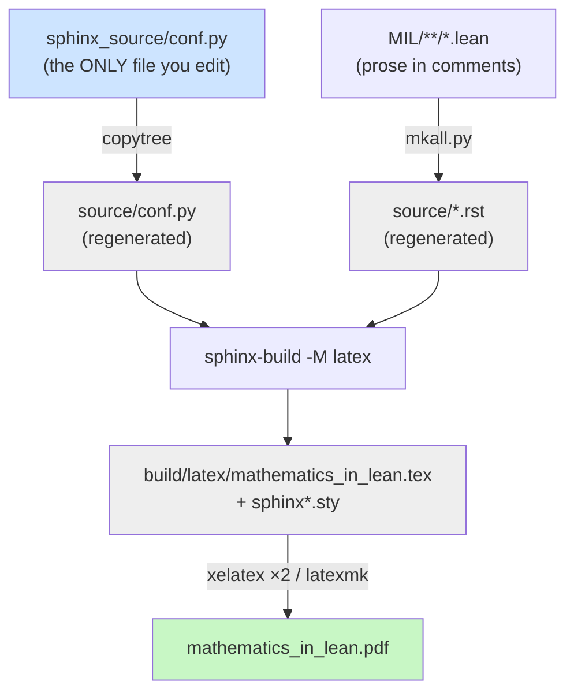

# Taking Control of Sphinx LaTeX PDF Typography

This note explains how to change the typography of a PDF that Sphinx produces through its LaTeX builder, and how to build a live-reloading preview loop while doing so. The worked example is the *Mathematics in Lean* textbook, whose shipped PDF reads poorly: long lines, a heavy chapter-opening style, blue headings, framed code blocks. By the end you should be able to locate the single file that controls the look of any Sphinx LaTeX PDF, change the page measure, fonts, running heads, chapter headings, code blocks, and colours, and set up a `latexmk -pvc` loop that rebuilds and reloads the PDF on every save.

The audience is someone comfortable with LaTeX and the shell who has inherited a Sphinx project and wants the PDF to look deliberate rather than default. The reference work happened on the `typography/readability-pass` branch of `/home/manuel/code/others/maths/mathematics_in_lean_source`; the full investigation diary lives in that project's `ttmp/2026/06/22/PDF-TYPO-01--*` docmgr ticket.

> [!summary]
> - A Sphinx LaTeX PDF's entire appearance is controlled by one Python dict, `latex_elements` in `conf.py`, plus the `latex_engine` setting. Everything else is generated.
> - The three layers you actually touch are Sphinx options (`pointsize`, `geometry`, `sphinxsetup`), raw LaTeX in the `preamble` string (`fancyhdr`, `hyperref`), and the `fncychap` package that owns chapter-opening pages.
> - Chapter headings are not styled by Sphinx directly. They come from `fncychap`'s **Bjarne** style, and you reshape them by redefining `\DOCH`, `\DOTI`, and `\DOTIS`.
> - A true live loop needs `latexmk -pvc`, but two project-specific traps — the preamble running outside `\makeatletter`, and a missing `xindy` — will stop you until you work around them.

## Why this note exists

Sphinx is documentation infrastructure first and a typesetting system second. Its HTML output gets almost all the attention, and its LaTeX/PDF output ships with defaults that are correct but plain: the `manual` document class at 10pt on letterpaper, full-width text, the `sphinx_rtd_theme` blue carried into headings, and framed verbatim blocks. For a book-length document those defaults produce a PDF that is technically fine and unpleasant to read. The line measure is the worst offender — a 6.5-inch column of 10pt text runs far past the length the eye tracks comfortably.

The difficulty is not that Sphinx is hard to customise. It is that the customisation surface is spread across three layers that look unrelated until you see how they compose: Sphinx's own `latex_elements` keys, arbitrary LaTeX injected through a `preamble` string, and third-party LaTeX packages that Sphinx loads on your behalf and that you must reach past Sphinx to reconfigure. This note maps those layers and records the specific traps that cost time.

## The build pipeline, and why you can only edit one file

The first thing to establish is which file you are allowed to edit, because most of the directory looks editable and most of it is regenerated on every build.

*Mathematics in Lean* is maintained as two repositories. The public `leanprover-community/mathematics_in_lean` repo is a **distribution**: it contains the rendered HTML, the committed `mathematics_in_lean.pdf`, and the generated `MIL/**/*.lean` exercise files. It does not contain the book source. The authoring repo, `mathematics_in_lean_source`, holds the real inputs: the chapter prose lives inside the `MIL/**/*.lean` files as specially marked comments, and the typography lives in `sphinx_source/conf.py`.

The build is driven by a `Makefile` whose only real rule runs a Python script before invoking Sphinx:

```make
%: Makefile
	scripts/mkall.py
	@$(SPHINXBUILD) -M $@ "$(SOURCEDIR)" "$(BUILDDIR)" $(SPHINXOPTS) $(O)
```

`scripts/mkall.py` calls `mkdoc.make_everything()`, and that function begins by **deleting** the directory you might be tempted to edit:

```python
def make_everything():
    if sphinx_dir.exists():
        shutil.rmtree(sphinx_dir)          # rm -rf source/
    ...
    shutil.copytree(sphinx_source_dir, sphinx_dir)   # sphinx_source/ -> source/
    make_sphinx_index_file()
    make_sphinx_chapter_files()            # generate .rst from the .lean files
    process_sections()
```

The consequence is a strict rule: **edit `sphinx_source/conf.py`; never edit `source/conf.py` or anything under `build/`.** The `source/` tree and the `build/latex/*.tex` files are outputs. This is the single most important fact about the project, and it is invisible until you read `mkdoc.py`.



## The single point of control: `latex_elements`

Sphinx exposes the entire LaTeX preamble through one dictionary. The relevant part of `conf.py` is small:

```python
latex_engine = 'xelatex'

latex_elements = {
    'pointsize': '12pt',
    'geometry': r'\usepackage[letterpaper,hmargin=1.5in,vmargin=1.1in,headheight=15pt]{geometry}',
    'sphinxsetup': 'verbatimwithframe=false, VerbatimColor={RGB}{245,245,245}, TitleColor={RGB}{0,0,0}',
    'preamble': r'''
        ... arbitrary LaTeX ...
    ''',
}
```

`latex_engine` is the deepest lever and, for this book, already correct. The shipped PDF embeds the FreeFont family (FreeSerif/FreeSans/FreeMono) alongside Computer Modern math fonts. That mix is not pdflatex's doing; it is Sphinx's default `fontpkg` **for the xelatex engine**, which selects FreeFont for Unicode coverage. The book's text is dense with `∀ ↦ ℝ ⟨⟩`, so Unicode coverage is mandatory and xelatex is the right engine. Knowing the engine tells you the rest: under xelatex you select fonts with `fontspec` (`\setmainfont`), and the FreeFont default is an override target, not a missing piece.

The keys divide cleanly by what they govern.

| Key | Governs | Mechanism |
|-----|---------|-----------|
| `pointsize` | Body text size | Document class option (`10pt`/`11pt`/`12pt` only) |
| `geometry` | Margins, line measure, header height | Replaces Sphinx's `geometry` package call |
| `sphinxsetup` | Code-block frame/colour, heading colour | Sphinx's own key=value options |
| `fontpkg` | Body/sans/mono fonts | `\setmainfont` etc. (not set here; defaults to FreeFont) |
| `preamble` | Everything else | Raw LaTeX appended to the preamble |

### Measure and size: the change that mattered most

The readability complaint was line length, not font choice. Two keys fix it. `pointsize` goes from the 10pt default to `12pt`. `geometry` is replaced to set `hmargin=1.5in`, which on letterpaper (8.5in wide) yields a text block of 8.5 − 2×1.5 = 5.5 inches. A 5.5-inch column at 12pt holds roughly 65–75 characters per line, which is the range the eye tracks without strain. The larger type and shorter measure together took the book from 213 to roughly 300 pages, which is expected and correct: the page count rose because each page now carries less text, which is the entire point.

This is worth stating as a rule because it is counterintuitive to people who reach for fonts first: **measure and leading fix "hard to read" far more often than font choice does.** A famous typeface set to a 6.5-inch measure still reads badly.

### Code blocks and colours: `sphinxsetup`

Sphinx styles verbatim blocks and headings through `sphinxsetup`, a key=value string parsed by Sphinx's LaTeX support packages. Three options did the work:

- `verbatimwithframe=false` removes the box drawn around code listings. With no frame there are no corners, so "no border, no rounded corners" is a single option, not two.
- `VerbatimColor={RGB}{245,245,245}` fills the listing with a flat light grey.
- `TitleColor={RGB}{0,0,0}` sets headings to black. The default is a dark blue (`{rgb}{0.126,0.263,0.361}`) inherited from the RTD theme. `TitleColor` also reaches the running heads, because Sphinx's header font command `\py@HeaderFamily` is defined in terms of it.

Headings are only half of "blue". The table of contents and internal cross-references are coloured by `hyperref`, not by `TitleColor`. Those require a separate instruction in the `preamble`:

```latex
\hypersetup{linkcolor=black}   % TOC + internal cross-refs black; external URLs stay coloured
```

`linkcolor` controls internal links (TOC entries, `\ref`), while `urlcolor` controls external links. Setting only `linkcolor` blackens the book's internal navigation while leaving genuine web URLs visibly coloured, which is usually what a print-oriented PDF wants.

### The `\makeatletter` trap

The `preamble` string is the escape hatch for everything Sphinx does not expose as a key. It is also where the first real failure occurred. The header and chapter-heading code uses macros whose names contain `@` — `\py@HeaderFamily`, `\p@`, `\DOTI` — and Sphinx injects the `preamble` into the document **outside** any `\makeatletter … \makeatother` group. With `@` at its normal catcode, `\p@` does not tokenise as the control sequence `\p@`; it tokenises as `\p` followed by a stray `@`. The build failed with a cascade of `Undefined control sequence` and `Illegal unit of measure (pt inserted)` errors whose root was a single missing catcode change.

The fix is to wrap every block that touches an `@`-name:

```latex
\makeatletter
  ... \fancypagestyle{normal}{ ... \py@HeaderFamily ... }
  ... \renewcommand{\DOCH}{ ... \vskip 2\p@ }
\makeatother
```

The symptom is distinctive once you have seen it: the error trace shows the engine choking on `\p` with a `@` orphaned on the next line. Whenever you paste LaTeX that uses internal `@`-macros into a Sphinx `preamble`, assume you need `\makeatletter`.

## Running heads with `fancyhdr`

The default Sphinx running head carries the book title and uses the document class's mark mechanism. To replace it you load `fancyhdr` and redefine the two page styles Sphinx uses: `normal` for body pages and `plain` for chapter-opening pages.

The mark mechanism is the part that repays understanding. In a two-sided `report`/`book`-derived class, two "marks" track position: `\leftmark` is set by `\chaptermark` and normally reads "Chapter N. Title"; `\rightmark` is set by `\sectionmark` and reads "N.M Title". `fancyhdr`'s slot selectors then place content by side and parity: `[L]`/`[C]`/`[R]` for left/centre/right, optionally suffixed `E`/`O` for even (verso) and odd (recto) pages.

The final layout mirrors the running head across the spread — chapter title on verso pages, section on recto pages, page number on the right of both — which is the standard book convention and keeps each page uncluttered:

```latex
\makeatletter
% leftmark = chapter title only (drop the "Chapter N." prefix)
\renewcommand{\chaptermark}[1]{\markboth{#1}{}}
\fancypagestyle{normal}{
  \fancyhf{}
  \fancyhead[LE]{\py@HeaderFamily\nouppercase{\leftmark}}%  verso: chapter title
  \fancyhead[LO]{\py@HeaderFamily\nouppercase{\rightmark}}% recto: section
  \fancyhead[R]{\py@HeaderFamily\thepage}
  \renewcommand{\headrulewidth}{0.4pt}
  \renewcommand{\footrulewidth}{0pt}
}
\fancypagestyle{plain}{          % chapter-opening pages: page number only
  \fancyhf{}
  \fancyhead[R]{\py@HeaderFamily\thepage}
  \renewcommand{\headrulewidth}{0.4pt}
  \renewcommand{\footrulewidth}{0pt}
}
\makeatother
```

Three details in that block are load-bearing:

- **Redefining `\chaptermark` strips the prefix.** The default `\chaptermark` writes "Chapter N. Title" into `\leftmark`. Replacing it with `\markboth{#1}{}` writes only the title, so the head reads "Introduction" rather than "Chapter 1. Introduction". `\markboth`'s second argument is empty because the chapter mark should not also disturb the right mark.
- **`\nouppercase` matters.** The class wraps marks in uppercasing in some configurations; `\nouppercase` keeps the head in mixed case to match the body.
- **`plain` is a separate style.** Chapter-opening pages do not use `normal`; they use `plain`. If you forget to redefine `plain`, the opening page keeps the class default (a centred footer page number) and looks inconsistent. Leaving the title out of `plain` is deliberate: the opening page already carries the large chapter title in its body.

The single most confusing bug in the whole exercise was a consequence of the verso/recto split combined with a PDF viewer. An intermediate version used `\fancyhead[LE]` to put the title on verso pages only. The viewer displayed the document two-up **without** a cover offset, so even pages rendered on the visual right. The title therefore appeared to be "on the right page and missing from the left", which read as a bug. It was not a bug; it was the difference between the document's notion of verso/recto and the viewer's spread layout. The lesson is to reason about running heads in terms of `verso = even` and `recto = odd`, which are properties of the document, and to verify by rendering specific even and odd pages rather than trusting a spread view.

## Chapter headings belong to `fncychap`, not Sphinx

Reshaping the chapter-opening pages required finding where they are defined, and they are not defined by Sphinx. The generated `.tex` contains `\usepackage[Bjarne]{fncychap}`. The `fncychap` package's **Bjarne** style is what prints the word "CHAPTER", then the chapter number spelled as an English word ("ONE", "TWO"), then a rule, then the title in uppercase.

`fncychap` factors a chapter opening into three macros, and Sphinx's `sphinxlatexstyleheadings.sty` sets their fonts for the Bjarne case. The default `\@makechapterhead` wrapper that calls them looks like this:

```latex
\def\@makechapterhead#1{%
  \vspace*{50\p@}%        % (A) space ABOVE the heading block
  {\parindent\z@ \raggedright \normalfont
    \ifnum \c@secnumdepth >\m@ne \if@mainmatter \DOCH \fi \fi
    \interlinepenalty\@M
    \if@mainmatter \DOTI{#1}\else \DOTIS{#1}\fi}}
```

- `\DOCH` ("DO CHapter") prints the name line and the number.
- `\DOTI` ("DO TItle") prints the title for numbered chapters.
- `\DOTIS` is the same for starred/unnumbered chapters such as the index.

The goal was a minimal opening: the spelled number small, the title large, both flush left, in the same sans-serif heading font as the rest of the book, with no "CHAPTER" word and no rules. That is a redefinition of all three macros plus the `\Ch*Var` font hooks:

```latex
\ChTitleUpperCase
\ChNumVar{\raggedright\py@HeaderFamily\large}   % the spelled number, e.g. TWO
\ChTitleVar{\raggedright\py@HeaderFamily\Huge}  % the title, e.g. BASICS
\ChRuleWidth{0pt}
\renewcommand{\DOCH}{%
  \CNoV\TheAlphaChapter\par\nobreak             % number only; no \@chapapp ("CHAPTER")
  \vskip -17\p@                                 % (B) gap between number and title
}
\renewcommand{\DOTI}[1]{\CTV\FmTi{#1}\par\nobreak \vskip 40\p@}   % (C) space below
\renewcommand{\DOTIS}[1]{\CTV\FmTi{#1}\par\nobreak \vskip 40\p@}
```

Two non-obvious points emerged here. First, the heading font is `\py@HeaderFamily`, which Sphinx defines as `\sffamily\bfseries`. An earlier draft used `\normalfont` in the `\Ch*Var` hooks, which silently reverted the chapter title to the serif body font; matching "the same sans-serif font as the section headings" meant using `\py@HeaderFamily`, not `\normalfont`. Second, **small caps are not available in this stack.** FreeSans has no true small-caps variant, so `\scshape` on the sans heading font produces either faux caps or nothing. The choice was full uppercase in sans, because small caps would have required switching the title to a serif that carries the feature.

### The three vertical spaces of a chapter opening

A frequent request — "move the title up/down" — is ambiguous until you see that a chapter opening has three independent vertical gaps, living in two different macros:

| Space | Where it lives | Default | How to change |
|-------|----------------|---------|---------------|
| (A) Above the number | `\@makechapterhead`'s leading `\vspace*{50\p@}` | 50pt | Redefine `\@makechapterhead`, or add a leading `\vskip` at the top of `\DOCH` |
| (B) Number → title | trailing `\vskip` in `\DOCH` | (style-dependent) | Edit the `\vskip` value in `\DOCH` |
| (C) Title → body | trailing `\vskip` in `\DOTI` and `\DOTIS` | 40pt | Edit both `\DOTI` and `\DOTIS`, keeping them equal |

The trap in (C) is that there are two macros, not one. `\DOTI` handles numbered chapters and `\DOTIS` handles unnumbered ones; changing only `\DOTI` makes the index page's spacing diverge from the rest of the book. The trap in (A) is that the space above does not live in `\DOCH` at all — nudging `\DOCH` adjusts where the block sits relative to the 50pt that `\@makechapterhead` already inserted, so to set the top space absolutely you must redefine `\@makechapterhead` itself.

### `\headheight` is a real constraint

Once the build ran under `latexmk`, which scans the log more strictly than a bare `xelatex` invocation, a warning surfaced that two manual passes had hidden: `Package fancyhdr Warning: \headheight is too small (12.0pt)`. A taller running head at 12pt body size needs more vertical room than the default 12pt head box. The fix belongs with the other page geometry, as an option to the `geometry` package rather than a separate `\setlength`:

```python
'geometry': r'\usepackage[letterpaper,hmargin=1.5in,vmargin=1.1in,headheight=15pt]{geometry}',
```

Passing `headheight` to `geometry` keeps the header height and the rest of the page geometry computed together, which avoids the mismatch warnings you get from setting `\headheight` independently after `geometry` has already done its arithmetic.

## The live preview loop

The motivating requirement was a live-reloading view for trying fonts and spacing. LaTeX has no native hot reload, so the loop is assembled from `latexmk` and a file watcher.

`latexmk` is a build driver that runs the engine as many times as the document needs — to settle cross-references, the table of contents, and, critically here, the running heads, which only stabilise on the second pass. Doing two manual `xelatex` runs is the by-hand version of what `latexmk` automates. Its `-pvc` flag ("preview continuously") keeps the process alive, watches the `.tex` and its dependencies, rebuilds on every save, and signals the PDF viewer to reload.

Two project-specific obstacles stood between that description and a working loop.

**`latexmk` reads Sphinx's `latexmkrc`, which calls `xindy`.** When Sphinx generates `build/latex/`, it writes a `latexmkrc` configured to build the index with `xindy`. `latexmk` 4.x auto-reads `latexmkrc` from the current directory, so even a plain invocation picks up the `xindy` configuration — and `xindy` was not installed. The index step failed with return code −1, and worse, the failure was cached in `.fdb_latexmk`, so later runs kept reporting it even after the underlying command would have worked. `makeindex` was installed and processed the very same `.idx` file without complaint when run by hand. The workaround drives `latexmk` in its built-in xelatex mode and overrides the index program after the rc file is read:

```bash
latexmk -pdfxe \
  -e '$makeindex = q{makeindex %O -o %D %S}' \
  mathematics_in_lean.tex
```

`-pdfxe` selects xelatex without relying on the rc's engine settings, and `-e` executes Perl after the rc files load, so the `makeindex` override wins. (The cleaner alternative is `apt install xindy`, after which Sphinx's own `make` target works unmodified.)

**`latexmk` watches the `.tex`, but you edit `conf.py`.** This is the structural mismatch from the build-pipeline section. `latexmk -pvc` watches `build/latex/mathematics_in_lean.tex`, which is a generated file. Editing `sphinx_source/conf.py` does not change the `.tex` until `make latex` regenerates it. The loop therefore needs two layers: a watcher on `conf.py` that runs `make latex`, and `latexmk -pvc` that recompiles when the regenerated `.tex` changes.


The watcher uses `entr`, fed the file list on standard input:

```bash
printf '%s\n' sphinx_source/conf.py sphinx_source/unixode.sty \
  | entr -n sh -c 'make latex'        # regenerate the .tex on every save
```

`make latex` only reads `conf.py` and writes into `source/` and `build/`; it never modifies `conf.py`, so there is no feedback loop. The two processes run together: a `conf.py` save triggers `entr → make latex`, which rewrites the `.tex`, which `latexmk -pvc` notices and recompiles, which `okular` (a viewer that reloads on file change) re-renders in place.

There is a real speed tradeoff between the two layers. A full `make latex` regenerates every chapter's `.rst` from the Lean sources and is slow — tens of seconds on this book. For rapid micro-tuning of a single value such as the chapter-title gap, it is far faster to edit `build/latex/mathematics_in_lean.tex` directly and let `latexmk -pvc` rebuild only that, then copy the settled value back into `conf.py`. The full loop is for correctness; the direct-`.tex` loop is for iteration speed.

## Failure modes worth remembering

| Symptom | Cause | Fix |
|---------|-------|-----|
| `Undefined control sequence` on `\p`, with `@` orphaned | `preamble` runs outside `\makeatletter`; `@` has normal catcode | Wrap `@`-macro blocks in `\makeatletter … \makeatother` |
| Chapter title silently turns serif | `\normalfont` in `\Ch*Var` instead of `\py@HeaderFamily` | Use `\py@HeaderFamily` to match the section-heading font |
| `\scshape` title looks wrong/absent | FreeSans has no real small caps | Use uppercase in sans, or switch the title to a serif with small caps |
| Title "on the wrong page" in a spread view | Viewer shows two-up without cover offset; `[LE]`/`[LO]` are verso/recto | Reason in even/odd terms; verify by rendering specific even and odd pages |
| `fancyhdr Warning: \headheight is too small` | Taller head needs more than the default 12pt box | Add `headheight=15pt` to the `geometry` options |
| `latexmk` exit 12, index never builds | Auto-read `latexmkrc` calls missing `xindy`; failure cached in `.fdb_latexmk` | `latexmk -pdfxe -e '$makeindex=q{makeindex %O -o %D %S}'`, or install `xindy` |
| Edits to `source/` or `build/` vanish | `mkall.py` deletes and regenerates them | Edit `sphinx_source/` only |

## Working rules

- Find the engine first (`latex_engine`). It determines whether you select fonts with `fontspec` (xelatex/lualatex) or with NFSS packages (pdflatex), and it determines the default `fontpkg`.
- Treat `conf.py`'s `latex_elements` as the only source of truth and the generated `source/`/`build/` trees as disposable.
- Reach for Sphinx keys before raw LaTeX: `pointsize`, `geometry`, `sphinxsetup` cover size, measure, code blocks, and heading colour without a line of LaTeX.
- When you do drop into the `preamble`, wrap anything with an `@` in its name in `\makeatletter`.
- For chapter openings, edit `fncychap`'s `\DOCH`/`\DOTI`/`\DOTIS`, not Sphinx. Keep `\DOTI` and `\DOTIS` in sync.
- Fix measure and leading before reaching for a new typeface.
- Build with `latexmk` for the live loop, but expect to override the index program and to watch `conf.py` in a second layer.

## Reference: the change sequence

The work landed as a sequence of small, reviewable commits on `typography/readability-pass` in `/home/manuel/code/others/maths/mathematics_in_lean_source`, each isolating one decision:

```
26ff49d  12pt body text and wider margins (the readability fix)
309c42b  running heads, chapter headings, code blocks, black titles
5c04fc6  running-head title on the left of every page
0f649a4  split running head — chapter left, section+page right
4c266fe  mirror running heads — chapter on verso, section on recto
ce4927b  fix fancyhdr headheight warning (headheight=15pt)
```

The full investigation diary, a knob-by-knob tweak playbook, and helper scripts (`01-render-chapter.sh` to preview a single chapter by reading the PDF outline, `02-live-preview.sh` for the `latexmk -pvc` loop) live in the docmgr ticket at `/home/manuel/code/others/maths/mathematics_in_lean/ttmp/2026/06/22/PDF-TYPO-01--redo-pdf-typography-with-live-reload-preview-workflow/`.

## Related notes

- Source repo: `/home/manuel/code/others/maths/mathematics_in_lean_source` (branch `typography/readability-pass`)
- Distribution repo: `/home/manuel/code/others/maths/mathematics_in_lean`
- Sphinx LaTeX customisation reference: https://www.sphinx-doc.org/en/master/latex.html
- `fncychap` and `fancyhdr` are standard TeX Live packages; `kpsewhich fncychap.sty` locates the Bjarne-style source.
