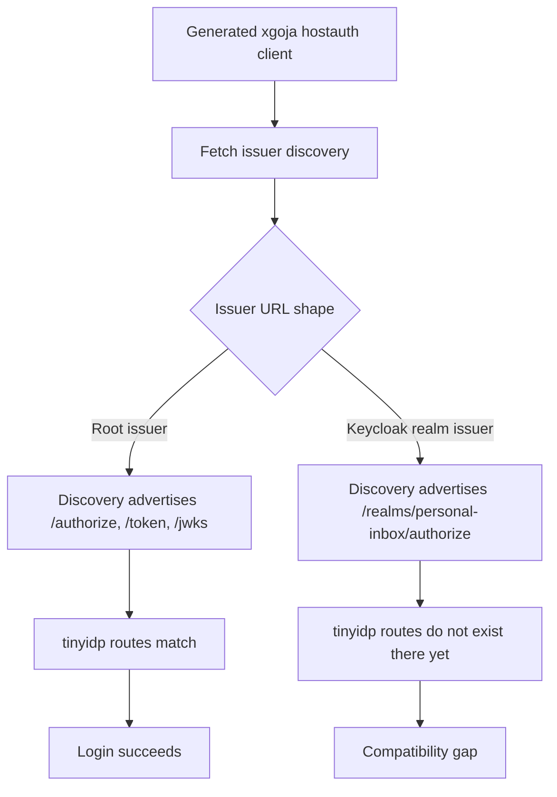
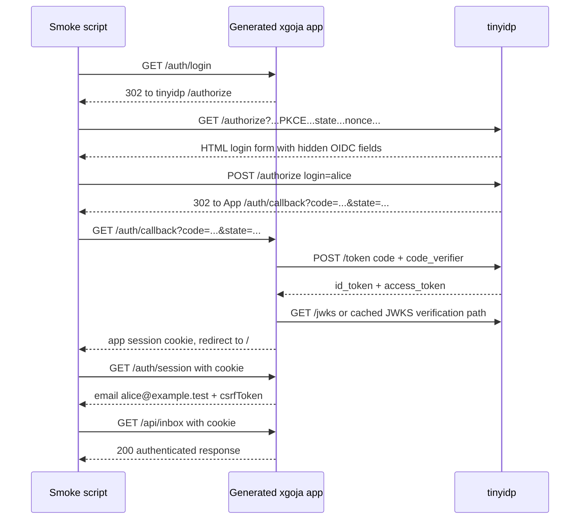

# tinyidp as a Keycloak Replacement for go-go-goja Auth Testing

This report explains what was learned when `tinyidp`, a small mock OpenID Connect provider, was tested as a replacement for Keycloak in the `go-go-goja` auth examples. It is written as a handoff document for a colleague who will continue the work in the active `go-go-goja` auth branch rather than in the workspace where the first experiment happened.

The result is precise: the replacement works for the first small xgoja Keycloak tutorial target when the relying party is configured to use a root `tinyidp` issuer. No changes to `tinyidp` were needed to prove the OIDC authorization-code login flow. The work required a build of the generated xgoja app, a ticket-local smoke script, and a different issuer URL shape. The remaining gap is Keycloak-style realm-path URL compatibility, not basic OIDC behavior.

> [!summary]
> - `tinyidp` successfully completed a full generated xgoja login flow: `/auth/login` → `tinyidp /authorize` → app `/auth/callback` → token exchange → app session → authenticated API.
> - The experiment targeted personal-knowledge-inbox Step 06 because it is the first small Keycloak tutorial step and uses generated hostauth OIDC without the later appauth/device-code complexity.
> - We did not need to modify `tinyidp` for the proof. We did need to configure the generated app with a root issuer, not a Keycloak realm issuer.
> - The next real implementation should happen in the active `go-go-goja` auth branch: promote the proof script into a `tinyidp-smoke` target, then add `tinyidp` base-path support if Keycloak-compatible issuer URLs are required.

## What happened

The initial request was to evaluate a new WIP mock identity provider located at:

```text
/home/manuel/workspaces/2026-06-20/ui-notebook-package/2026-06-22--mock-oidc-idp
```

The evaluation was intentionally framed as a Keycloak replacement exercise. The instruction was to go back to the first use of Keycloak for testing and see whether the new provider could be used in its place. The investigation found several Keycloak-backed examples under the `goja-express-auth` workspace, especially:

```text
/home/manuel/workspaces/2026-06-12/goja-express-auth/go-go-goja/examples/xgoja/19-express-keycloak-auth-host
/home/manuel/workspaces/2026-06-12/goja-express-auth/go-go-goja/examples/xgoja/21-generated-host-auth
/home/manuel/workspaces/2026-06-12/goja-express-auth/go-go-goja/examples/xgoja/23-personal-knowledge-inbox/06-browser-login-keycloak
/home/manuel/workspaces/2026-06-12/goja-express-auth/go-go-goja/examples/xgoja/23-personal-knowledge-inbox/08-device-authorization
```

The first target chosen for the experiment was Step 06 of the personal-knowledge-inbox tutorial:

```text
/home/manuel/workspaces/2026-06-12/goja-express-auth/go-go-goja/examples/xgoja/23-personal-knowledge-inbox/06-browser-login-keycloak
```

That target is the right first step because it isolates the generated OIDC hostauth behavior. It does not require the broader Postgres-backed appauth, audit, capability-token, and invite flows in example 19. It also does not require device authorization, which `tinyidp` does not currently implement.

The work was documented in a new `docmgr` ticket created in the mock IdP repo:

```text
/home/manuel/workspaces/2026-06-20/ui-notebook-package/2026-06-22--mock-oidc-idp/ttmp/2026/06/22/TINYIDP-XGOJA-001--replace-keycloak-tutorial-smoke-tests-with-tinyidp
```

That ticket contains the intern-facing design guide, task list, diary, changelog, and a ticket-local smoke script. This was useful for the proof, but the user correctly noticed that the next implementation work belongs in the ongoing `go-go-goja` auth branch, not in the `ui-notebook-package` workspace.

## Did we need to change anything?

For the proof, no changes to `tinyidp` itself were required. The provider already had the required OIDC endpoints for the generated xgoja hostauth flow:

```text
GET  /.well-known/openid-configuration
GET  /jwks
GET  /authorize
POST /token
GET  /userinfo
GET  /healthz
```

The proof required three practical things:

1. Build the generated Step 06 xgoja host binary.
2. Start `tinyidp` with a client id and redirect URI that match the generated app.
3. Start the generated app with `--auth-oidc-issuer-url` pointing at the root `tinyidp` issuer.

The working `tinyidp` command shape was:

```bash
GOWORK=off go run ./cmd/tinyidp serve \
  --addr 127.0.0.1:19087 \
  --issuer http://127.0.0.1:19087 \
  --client-id personal-inbox-local \
  --redirect-uris http://127.0.0.1:19794/auth/callback
```

The matching generated app command shape was:

```bash
./dist/personal-knowledge-inbox-browser-login-keycloak serve inbox server \
  --http-listen 127.0.0.1:19794 \
  --db /tmp/personal-inbox-api.sqlite \
  --auth-oidc-issuer-url http://127.0.0.1:19087 \
  --auth-oidc-client-id personal-inbox-local \
  --auth-oidc-public-base-url http://127.0.0.1:19794 \
  --auth-session-cookie-allow-insecure-http=true \
  --auth-default-store-driver sqlite \
  --auth-default-store-dsn /tmp/personal-inbox-auth.sqlite \
  --auth-default-store-apply-schema=true
```

The proof script then drove the browser login flow using Python's standard-library HTTP and HTML parsing modules. It did not use Playwright or a real browser. It followed redirects, parsed the `tinyidp` login form, posted `login=alice`, followed the callback back to the generated app, and asserted that `/auth/session` contained `alice@example.test` and a CSRF token.

The successful output was:

```text
ok tinyidp step06 full login smoke; session email= alice@example.test
ok tinyidp replacement smoke
```

The important point is that the generated hostauth OIDC code did not require a Keycloak-specific issuer. It required an OIDC issuer with compatible discovery metadata, authorization endpoint behavior, token endpoint behavior, JWKS, and claims. `tinyidp` already provided enough of that surface.

## The current compatibility boundary

The successful proof used a root issuer:

```text
http://127.0.0.1:19087
```

The existing Step 06 Keycloak configuration uses a realm-style issuer:

```text
http://127.0.0.1:18086/realms/personal-inbox
```

This difference matters because OIDC clients usually discover endpoint URLs from the issuer metadata. `tinyidp` currently registers its HTTP routes at root. Discovery returns endpoint URLs by concatenating the configured issuer with endpoint suffixes. If `tinyidp` is configured with a realm-path issuer, it will advertise endpoints such as:

```text
http://127.0.0.1:19087/realms/personal-inbox/authorize
http://127.0.0.1:19087/realms/personal-inbox/token
http://127.0.0.1:19087/realms/personal-inbox/jwks
```

But the server currently serves:

```text
http://127.0.0.1:19087/authorize
http://127.0.0.1:19087/token
http://127.0.0.1:19087/jwks
```

That is the primary remaining incompatibility. The OIDC behavior works. The Keycloak URL shape does not work yet unless the relying party is reconfigured to use a root issuer.



The next implementation phase should add explicit base-path support to `tinyidp`, or introduce a Keycloak compatibility mode that mounts the OIDC routes below `/realms/<realm>`.

## The flow that was proven

The validated flow exercised the generated app, the IdP, and the app session layer together. This is stronger than checking only the redirect location.



Several details are important for a colleague continuing the work:

- The app sends PKCE parameters. `tinyidp` accepts and verifies PKCE in the token exchange.
- The app uses an opaque app session cookie after the callback. The OIDC tokens stay server-side.
- The app's session JSON uses the existing generated hostauth shape. It does not include `authenticated: true`; it returns fields such as `email`, `csrfToken`, `userId`, and `claims` directly.
- The app's claim vocabulary still includes names such as `keycloakSub`, because the surrounding example was written during the Keycloak-focused phase. The value now comes from a generic OIDC `sub`, not from Keycloak specifically.

## The proof script

The ticket-local script is here:

```text
/home/manuel/workspaces/2026-06-20/ui-notebook-package/2026-06-22--mock-oidc-idp/ttmp/2026/06/22/TINYIDP-XGOJA-001--replace-keycloak-tutorial-smoke-tests-with-tinyidp/scripts/01-step06-tinyidp-smoke.sh
```

It is useful as source material, but it should not be treated as the final home. The next branch should move or adapt it into the relevant `go-go-goja` example tree, probably as a `tinyidp-smoke` Makefile target under Step 06.

The script performs these steps:

```bash
# 1. Start tinyidp.
GOWORK=off go run ./cmd/tinyidp serve \
  --addr "$IDP_ADDR" \
  --issuer "http://$IDP_ADDR" \
  --client-id "$CLIENT_ID" \
  --redirect-uris "http://$APP_ADDR/auth/callback"

# 2. Wait for discovery.
curl -fsS "http://$IDP_ADDR/.well-known/openid-configuration"

# 3. Start generated xgoja app.
"$BIN" serve inbox server \
  --http-listen "$APP_ADDR" \
  --auth-oidc-issuer-url "http://$IDP_ADDR" \
  --auth-oidc-client-id "$CLIENT_ID" \
  --auth-oidc-public-base-url "http://$APP_ADDR" \
  --auth-session-cookie-allow-insecure-http=true \
  --auth-default-store-driver sqlite \
  --auth-default-store-dsn "$authdb" \
  --auth-default-store-apply-schema=true

# 4. Drive /auth/login -> tinyidp form -> app callback.
# 5. Assert /auth/session and /api/inbox.
```

The Python fragment uses `http.cookiejar.CookieJar`, `urllib.request`, and `html.parser.HTMLParser`. That was deliberate. It keeps the smoke test portable, fast, and independent of a browser automation runtime.

## The first failure modes encountered

The first failure was not an OIDC problem. Running `go test ./...` inside the mock IdP repo picked up the parent workspace `go.work`, whose Go version line was stale relative to sibling modules. The error was:

```text
go: module ../rag-evaluation-system listed in go.work file requires go >= 1.26.4, but go.work lists go 1.26; to update it:
	go work use
...
```

The correct local validation command for this repo is therefore:

```bash
GOWORK=off go test ./... -count=1
```

The second failure was a port collision. A first live probe used `127.0.0.1:18086`, the same port as the existing Keycloak tutorial. The request returned an unrelated JSON error:

```json
{"error":"Unable to find matching target resource method"}
```

Switching to high ticket-local ports solved that:

```text
tinyidp: 127.0.0.1:19087
generated app: 127.0.0.1:19794
```

The third failure was an incorrect assumption about the `/auth/session` response shape. The app did not return `authenticated: true`; it returned a session object directly:

```json
{
  "claims": {
    "keycloakSub": "user-...",
    "name": "alice",
    "preferredUsername": ""
  },
  "csrfToken": "...",
  "email": "alice@example.test",
  "emailVerified": true,
  "tenantIds": null,
  "userId": "user:user-..."
}
```

The correct assertion is to check for `email`, `csrfToken`, and an authenticated API response.

## What to do in the go-go-goja auth branch

The current proof should be carried into the active `go-go-goja` auth work, not continued in the `ui-notebook-package` workspace. The work should happen in the branch where auth examples and generated hostauth are being developed.

The recommended sequence is:

1. Copy or adapt the ticket-local smoke script into the Step 06 example.
2. Add `tinyidp-smoke` to the Step 06 Makefile while keeping `keycloak-smoke` intact.
3. Update the Step 06 README with a tinyidp section and the root-issuer caveat.
4. Run the new target from a clean checkout.
5. Decide whether `tinyidp-smoke` should become part of the default `make smoke` target.
6. Add `tinyidp` base-path support if the examples should preserve Keycloak-looking issuer URLs.
7. Move on to example 19 and later examples only after Step 06 is stable.

A possible Makefile shape is:

```make
TINYIDP_ROOT ?= /path/to/2026-06-22--mock-oidc-idp
TINYIDP_PORT ?= 19087
TINYIDP_APP_ADDR ?= 127.0.0.1:19794
TINYIDP_ISSUER := http://127.0.0.1:$(TINYIDP_PORT)
TINYIDP_BASE_URL := http://$(TINYIDP_APP_ADDR)

.PHONY: tinyidp-smoke

tinyidp-smoke: doctor build
	@set -eu; \
	# start tinyidp; start generated app; drive login; assert session + API
```

The first implementation should avoid deleting Keycloak. Keep both targets:

```bash
make keycloak-smoke  # real Keycloak compatibility
make tinyidp-smoke   # fast local mock IdP compatibility
```

Once `tinyidp-smoke` is stable, it can become the default local smoke. Keycloak can remain as a slower compatibility test.

## Recommended tinyidp improvements

The proof did not require new `tinyidp` behavior, but the long-term replacement campaign will benefit from several features.

### Base-path / realm-path support

Add explicit route base-path support:

```bash
tinyidp serve \
  --issuer http://127.0.0.1:19087/realms/personal-inbox \
  --base-path /realms/personal-inbox
```

The server should then register routes under that path:

```go
func (s *Server) RegisterRoutesAt(mux *http.ServeMux, basePath string) {
    mux.HandleFunc(basePath + "/.well-known/openid-configuration", s.discovery)
    mux.HandleFunc(basePath + "/jwks", s.jwks)
    mux.HandleFunc(basePath + "/authorize", s.authorize)
    mux.HandleFunc(basePath + "/token", s.token)
    mux.HandleFunc(basePath + "/userinfo", s.userinfo)
}
```

The current `RegisterRoutes` can call `RegisterRoutesAt(mux, "")` so existing root behavior remains unchanged.

### Example profiles

`tinyidp` already has Glazed profile support. Add a checked-in profile for Step 06:

```yaml
personal-inbox-step06:
  oidc:
    issuer: http://127.0.0.1:19087
    addr: 127.0.0.1:19087
    client-id: personal-inbox-local
    redirect-uris:
      - http://127.0.0.1:19794/auth/callback
```

Then the IdP command becomes:

```bash
GOWORK=off go run ./cmd/tinyidp serve \
  --profile personal-inbox-step06 \
  --profile-file ./examples/profiles.yaml
```

This moves configuration out of long shell commands and proves that the reusable Glazed OIDC section is useful in a real integration.

### Configurable users and claims

The current default login name `alice` yields `alice@example.test`, which is enough for the Step 06 proof. Later examples may need stable `sub` values, groups, roles, tenant IDs, or other claims. Add a user/scenario config file before trying to replace heavier Keycloak realm fixtures.

A possible shape:

```yaml
users:
  - login: alice
    sub: user-alice
    email: alice@example.test
    name: Alice Inbox
    email-verified: true
    claims:
      groups: ["inbox-users"]
  - login: bob
    sub: user-bob
    email: bob@example.test
    name: Bob Inbox
    email-verified: true
```

This should be implemented as data feeding the scenario registry, not as special cases in HTTP handlers.

### Device authorization support

Do not attempt to replace personal-inbox Step 08 yet. Step 08 uses device authorization. `tinyidp` does not currently implement device-code endpoints. That is a separate feature, not a smoke-script adjustment.

## What not to do next

Do not rewrite the generated hostauth OIDC client just to support `tinyidp`. The proof shows the client already works with a standards-shaped provider.

Do not delete the Keycloak examples immediately. Keycloak remains useful as a real external IdP compatibility target. The right near-term change is to add `tinyidp-smoke` beside `keycloak-smoke`, then decide which one belongs in default CI.

Do not make `tinyidp` pretend to be production infrastructure. The provider should remain a local testing tool with loopback defaults and explicit warnings. It should gain compatibility features that help test relying parties, not account-management features that recreate Keycloak.

Do not treat the ticket-local smoke script as the final artifact. It is a working proof harness. The final version belongs in the go-go-goja auth branch near the example it tests.

## Related ticket and artifacts

The detailed ticket created during the experiment is:

```text
/home/manuel/workspaces/2026-06-20/ui-notebook-package/2026-06-22--mock-oidc-idp/ttmp/2026/06/22/TINYIDP-XGOJA-001--replace-keycloak-tutorial-smoke-tests-with-tinyidp
```

Important files from that ticket:

```text
design-doc/01-tinyidp-as-a-keycloak-replacement-for-xgoja-oidc-tutorial-tests.md
reference/01-integration-diary.md
tasks.md
scripts/01-step06-tinyidp-smoke.sh
```

The bundle was uploaded to reMarkable at:

```text
/ai/2026/06/22/TINYIDP-XGOJA-001/TINYIDP XGOJA Keycloak Replacement Guide
```

The ticket commit in the mock IdP repo was:

```text
bc9eaaa docs: add tinyidp xgoja replacement guide
```

## Working rules for the colleague continuing this work

The continuation path is straightforward if the ownership boundary stays clear.

- The generated xgoja app owns app sessions, CSRF tokens, protected routes, and user normalization.
- `tinyidp` owns OIDC discovery, authorization, token exchange, JWKS, userinfo, and failure scenarios.
- The smoke script owns process startup, port selection, form driving, and assertions.
- The first promoted target should be Step 06, not example 19 or device authorization.
- Use root issuer first. Add realm-path support only after the `tinyidp-smoke` target is stable.
- Keep Keycloak smoke as a comparison target until the replacement policy is decided.

The key technical fact is that no deep integration was necessary. The system worked because the generated hostauth code was already written against OIDC, not against Keycloak's implementation details. The remaining work is operationalization: place the smoke in the correct branch, make it easy to run, and close the URL-shape gap so `tinyidp` can eventually replace Keycloak with less per-example configuration.
