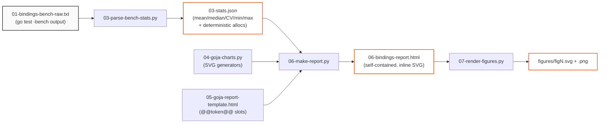

# A Self-Contained Scientific Report Pipeline: Benchmarks to HTML

This article documents the report-generation system built to turn raw `go test -bench` output into a single, self-contained, scientifically-styled HTML document with inline figures. It records the design constraints that shaped the system, the architecture of the pipeline, the philosophy behind the charts and the typography, and the specific implementation problems encountered and solved. It is written so that the same approach can be reused for any benchmark or measurement report, not only the goja binding study that triggered it.

The triggering report is [[ARTICLE - goja Binding Mechanisms - The Cost of Exposing Go to JavaScript]]. The pipeline lives in the docmgr ticket `2026-06-23-goja-bindings-benchmark`, under `scripts/` and `various/`, in the `benchmark-goja-proxy-object` workspace. Every script is numbered to make the data-flow order explicit.

> [!summary]
> - The pipeline is a chain of numbered stages, each reading the previous stage's output, so the path from raw benchmark output to the final HTML is fully traceable and reproducible.
> - Statistical communication foregrounds deterministic quantities (allocation counts) over noisy ones (nanoseconds). The charts encode this distinction: noisy quantities get range indicators, deterministic quantities get exact annotations.
> - Every figure is inline SVG generated by pure Python functions. No charting library and no JavaScript are used, so the report is a single static file that renders identically anywhere.
> - The visual language is a Swiss/editorial design: black ink on white, one red-orange accent, a monospace face for data and section numbers, a sans-serif for body, and a serif for the abstract.

## Why this note exists

A benchmark report is only as credible as its presentation. A chart that hides measurement noise, a number reported without its spread, or a "self-contained" file that secretly fetches a megabyte of JavaScript from a content delivery network each undermine the report's claim to scientific honesty. The goal of this system was to generate a report whose visual presentation communicated the measurements as precisely as the text did, and whose construction guaranteed self-containment and reproducibility.

The article is durable because the problems it solves — separating signal from noise in benchmark data, rendering charts deterministically without runtime dependencies, and templating HTML from computed statistics — recur in any measurement-reporting task. The goja binding study is the concrete instance; the pipeline is the reusable pattern.

## Design constraints

Five constraints shaped every decision in the system. They are stated first because each later choice follows from one of them.

The first constraint is **self-containment**. The final document must be a single HTML file that renders correctly when opened directly from disk, emailed as an attachment, or archived for years. This forbids any runtime dependency: no charting library, no data fetched over the network, no server-side rendering. The only network requests permitted are optional markdown libraries for unrelated message rendering in the reference template, and even those were removed for the benchmark report.

The second constraint is **determinism**. Two runs of the pipeline on the same input data must produce byte-identical output, so that a report can be diffed between benchmark runs and so that figures never look different merely because they were regenerated. This forbids randomized layout, browser-dependent font rendering in the figures, and any timestamp embedded in the figures themselves.

The third constraint is **traceability**. A reader who distrusts a number in the report must be able to trace it back to the raw benchmark output through an unbroken chain of files. This requires that every stage of the pipeline write an intermediate artifact and that each stage consume only the artifact of the previous stage.

The fourth constraint is **statistical honesty**. The benchmark produces two qualitatively different kinds of quantity: deterministic counts (allocations, bytes) that are invariant across samples, and noisy measurements (nanoseconds) that vary run to run. The presentation must not treat them as the same kind of number.

The fifth constraint is **information density without decoration**. Charts exist to communicate specific claims, not to decorate the page. No chart is included unless it answers a question the prose cannot answer more directly.

## The pipeline architecture

The pipeline is a linear chain of seven numbered stages. The numbering is not cosmetic: it is the documentation of the data-flow order. Each stage reads the output of the previous stage and writes its own output, and no stage reads anything except its declared input. The result is that the entire report can be regenerated from the raw benchmark text by executing the stages in order.



The stages are deliberately small. Stage 03 only parses; it does not compute derived quantities that require judgment. Stage 06 only assembles; it does not recompute statistics. Stage 04 is a pure library of functions that take data and return SVG strings, with no file input or output of its own. This separation means each stage can be tested or inspected in isolation. When a number in the report looks wrong, the investigation proceeds backward through exactly one stage at a time.

The two stages before 03 — the benchmark source (`01-...go`) and the run script (`02-run-bindings-bench.sh`) — produce the raw input. They are part of the same numbering scheme so the whole chain reads as one sequence.

## Statistical communication: deterministic invariants versus noisy measurements

The single most important decision in the report was how to present the two qualitatively different quantities the benchmark produces. Go's benchmark allocator reports `B/op` and `allocs/op`, and these values are deterministic: they count the allocations performed by a fixed code path, and they are identical across every sample of every run. The `ns/op` value, by contrast, is a wall-clock measurement that varies with system load, cache state, and thermal throttling.

The report treats these differently at every level. In the abstract, the deterministic counts are used to make load-bearing claims ("exactly one extra allocation"), while nanoseconds are reported with their spread and qualified as illustrative. In the tables, allocation counts are presented as exact integers, while nanoseconds are rounded and accompanied by a coefficient of variation. In the charts, this distinction drives the choice of visual encoding.

The parse stage (`03-parse-bench-stats.py`) computes both kinds of quantity and labels them. The coefficient of variation (standard deviation divided by mean) is computed for every benchmark precisely so that the reader can see which measurements are stable and which are not. The coefficient of variation is itself a finding: the Proxy paths have coefficients between 18% and 29%, while the non-Proxy paths are under 5%.

```python
# 03-parse-bench-stats.py — both quantity types computed and labeled
out[name] = {
    "mean": mean, "std": std,
    "cv": std / mean * 100,          # noisy quantity: report its spread
    "min": min(ns), "max": max(ns),
    "median": statistics.median(ns),
    "B": b, "allocs": al,            # deterministic quantity: an invariant
}
```

This is the reason the report can make confident claims from five-sample runs. Five samples are too few for a tight confidence interval on a noisy measurement. But the allocation count fixes each configuration at a precise position, and the relationship between allocation count and latency is then stable enough to support strong claims. The chart design in the next section makes that relationship visible.

## Chart philosophy: one question per chart

The report contains four charts, and each was designed to answer exactly one question that the prose could not answer as directly. A chart that answers no specific question is decoration, and decoration was forbidden by the fifth design constraint.

The first chart answers *how do the six call mechanisms rank, and how large is the spread between them*. It is a horizontal bar chart on a logarithmic vertical scale. The logarithmic scale is a deliberate, defensible choice: the mechanisms span nearly an order of magnitude, from 220 ns to 2017 ns. A linear axis would compress the three fastest bars to near-invisibility and visually misrepresent the multiplicative relationship between them. Allocation counts are annotated directly on each bar, because the allocation count is the deterministic explanation for the bar length and should not require the reader to cross-reference a table.

The second chart answers *what is the relationship between allocations and latency across all configurations at once*. It is a scatter plot with allocations per operation on the horizontal axis and nanoseconds on the vertical axis. This is the chart that does the most work, because it reveals the single relationship — a near-linear trend at roughly 86 ns per allocation — that explains the entire call regime. A dashed reference ray encodes the trend slope explicitly so the eye can see how tightly the points follow it. The property reads are plotted on the same axes, and their refusal to climb the trend line is itself the finding of the next section: reads are not allocation-bound.

The third and fourth charts answer *how stable is each measurement*. They are dot-and-range plots. For each configuration, a horizontal line spans the minimum to maximum across the five samples, a filled dot marks the median, and a tick marks the mean. The width of the line is the measurement noise, rendered honestly rather than hidden. This chart type was chosen over an error bar or a box plot because the sample size is small (five) and the raw min–median–max range communicates the spread more directly than a computed standard deviation would. The contrast between the tight lines of the non-Proxy measurements and the wide lines of the Proxy measurements is the visual proof of the noise finding.

A specific labeling decision in the scatter chart illustrates the information-first principle. The three one-allocation property reads cluster within nine nanoseconds of each other, so their individual labels collide and become unreadable. Rather than spread the labels with leader lines or a legend — which would imply a distinction the data does not support — the reads are plotted as unlabeled points with a single annotation pointing to the detailed breakdown in the third chart. The clustering is itself the finding, and labeling each point would obscure it.

## The visual design language

The report borrows a Swiss/editorial typographic system from a transcript-analysis report used as a reference. The choice was deliberate: editorial typography is designed for long-form reading under constraints of hierarchy and restraint, which matches a scientific report better than the dashboard aesthetic of most charting tools.

![[goja-report-style-masthead.png]]

The system uses four faces, each with a defined role. A monospace face (`ui-monospace`) carries all data: section numbers, axis labels, table headers, and numeric annotations. A sans-serif face (`-apple-system`, Inter) carries the body prose and headings. A serif face (Georgia) carries the abstract, marking it typographically as the document's precis rather than as ordinary body text. The single accent color, a red-orange (`#E8470C`), is reserved for three things only: the kicker label, the median dots in the range charts, and the call-regime points and trend line in the scatter chart. Restricting the accent to the data that carries the report's primary claim gives the eye a single path through every figure.

The page is organized on a hairline-rule grid. Each section begins with a numbered head (`02 /` in the accent color, the title in bold sans-serif, a right-aligned tag), and sections are separated by full black rules. The masthead carries a ten-pixel black top bar, a short kicker, a large left-aligned title, and a four-column metadata strip. These are not stylistic flourishes; they are the hierarchy. A reader scanning the document can navigate by section number, identify the abstract by its serif face, and locate the load-bearing data by its accent color, without reading a word.

![[goja-report-style-call-section.png]]

The figures are drawn in the same palette. Bars and points are black ink, with the accent reserved for the call-regime data and the medians. Axis lines and gridlines are hairline gray (`#e5e5e5`) so they recede behind the data. No chart has a border, a background fill, or a three-dimensional effect, because none of those encodes information.

## SVG generation without JavaScript

Every figure is generated as inline SVG by pure Python functions in `04-goja-charts.py`. The functions take the parsed statistics as input and return an SVG string. The report driver embeds these strings directly into the HTML. This satisfies the self-containment constraint: the final file contains its own figures as vector markup, not as references to images on disk and not as calls to a runtime library.

The alternative — a JavaScript charting library such as Chart.js or Plotly — was rejected for three reasons. It would break self-containment by requiring a network fetch or a vendored script. It would break determinism, because canvas and SVG rendering in a browser depends on the browser's font metrics and sub-pixel rendering. And it would break the information-first constraint, because general-purpose charting libraries optimize for visual appeal and configurability rather than for the specific, restrained encodings the report needed.

The tradeoff is that the charts are written by hand. Each chart function lays out its own coordinate system, computes its own scale, and emits its own axis ticks. This is more code than calling `plot()`, but the code is short, readable, and produces exactly the intended encoding. The logarithmic scale in the first chart, the reference ray in the second, and the min–median–max encoding in the third are each a few lines of explicit arithmetic that a library call could not express without fighting the library's defaults.

```python
# 04-goja-charts.py — explicit scale, no library defaults to fight
lo, hi = math.log10(150), math.log10(2400)
def x(v):
    return L + (math.log10(v) - lo) / (hi - lo) * pw
# call-regime reference ray (~86 ns/alloc), fit from the data
p.append(f'<line x1="{sx(0):.1f}" y1="{sy(0):.1f}" x2="{sx(xmax):.1f}" '
         f'y2="{sy(85.6*xmax):.1f}" stroke="{ACCENT}" stroke-dasharray="6 4"/>')
```

## Templating: the @@token@@ convention

The report template (`05-goja-report-template.html`) is a complete HTML document with placeholder tokens written as `@@name@@`. The driver (`06-make-report.py`) computes a flat dictionary mapping each token name to its value, then substitutes. The template's CSS — which contains many literal curly braces — is never touched by the substitution, so no escaping is needed.

This convention exists to solve a specific problem. A more obvious approach would use Python's `str.format` with `{name}` placeholders, or an f-string. But the template contains an entire CSS stylesheet, whose rule blocks are dense with braces: `.kpi .v{font:700 34px/1 var(--sans)}`. Under `str.format` every one of those braces would have to be doubled to `{{ }}` to avoid a formatting error, which would make the CSS unreadable and error-prone to edit. The `@@name@@` tokens are chosen because `@@` appears nowhere in valid HTML or CSS, so the substitution is a single safe regular-expression replacement that leaves the stylesheet untouched.

The driver enforces a contract between template and code: it scans the template for every referenced token and exits with an error if any token has no value defined. This catches mismatches at generation time rather than leaving a literal `@@foo@@` in the output. A second rule, applied after substitution, asserts that no `@@` remains in the final document.

```python
# 06-make-report.py — fail closed on undefined or leftover tokens
referenced = set(re.findall(r"@@([a-zA-Z0-9_]+)@@", tmpl))
missing = referenced - set(tokens)
if missing:
    sys.exit(f"ERROR: template references undefined tokens: {sorted(missing)}")
out = re.sub(r"@@([a-zA-Z0-9_]+)@@", repl, tmpl)
assert "@@" not in out
```

One further rule governs the tokens: arithmetic is never written in the template. A phrase such as "the additional nine allocations" is not expressed as `@@wrap_alloc@@ - @@nat_alloc@@`; instead the driver computes `wrap_alloc_delta` and the template references only the flat token. This keeps the template free of logic and makes the mapping between a number in the report and its computation a single, auditable entry in the driver.

## Figure rasterization and glyph substitution

The HTML report carries its figures as inline SVG, which renders crisply in any browser. For embedding the same figures in the Obsidian vault — where wikilink image embeds reference raster files — the pipeline includes a rasterization stage (`07-render-figures.py`) that extracts each SVG from the report and converts it to PNG.

The stage uses Inkscape in headless export mode, exporting at a fixed width so the PNGs stay crisp at display size. Inkscape was chosen over browser screenshotting because it produces deterministic, high-quality vector rasterization without depending on a running browser, and over `rsvg-convert` and `cairosvg` because those were not installed on the machine. The choice is documented in the script itself so a future reader knows the dependency and its rationale.

Rasterization surfaced one concrete problem worth recording. The scatter chart's trend-line label used the Unicode "almost equal to" sign, written in the SVG as the HTML entity `&#8776;`. Inkscape's default font stack substituted the glyph and rendered it as a tilde (`~`) rather than the intended `≈`. A rasterizer's font substitution is a data-dependent branch: a glyph present in one font may be absent in another and replaced silently. The fix was not to fight the substitution but to reconcile the label to `~86 ns/alloc`, so that the rendered text matches the figure exactly. The general lesson is to verify rasterized output against the SVG, because entity expansion and font substitution are points where intended and rendered text can diverge.

## Working rules

- Separate deterministic quantities from noisy ones at every level of the report. Use counts to make claims and measurements to corroborate them.
- Give every chart exactly one question to answer. If a chart answers no question the prose cannot, remove it.
- Prefer a logarithmic axis when values span an order of magnitude. A linear axis on multiplicative data hides the fastest values and implies an additive relationship that does not exist.
- Render measurement noise honestly. A dot-and-range plot that shows the raw spread is more truthful than an error bar that hides a small sample behind a computed statistic.
- Generate figures as inline SVG with pure functions. Self-containment and determinism both depend on avoiding runtime charting libraries.
- Use a token convention that cannot collide with the templated language. The `@@name@@` convention exists because CSS is full of braces that `str.format` would misparse.
- Compute all derived values in the driver and reference only flat tokens in the template. Keep the template free of arithmetic so the mapping from claim to computation is one line.
- Verify rasterized output against its vector source. Font substitution and entity expansion are silent failure points in figure rendering.

## Reproducibility

The full chain, from raw benchmark output to HTML report to rasterized figures, is reproducible from the ticket directory:

```bash
python3 scripts/03-parse-bench-stats.py    # -> various/03-stats.json
python3 scripts/06-make-report.py          # -> various/06-bindings-report.html
python3 scripts/07-render-figures.py       # -> various/figures/figN.{svg,png}
```

Stage 02 (`02-run-bindings-bench.sh`) regenerates the raw benchmark input if the measurements themselves need to be repeated. The raw five-sample output and the parsed statistics are filed alongside the report in `various/`, so a reader can audit any number in the report against its source without re-running anything.

## Related notes

- [[ARTICLE - goja Binding Mechanisms - The Cost of Exposing Go to JavaScript]] — the report this pipeline produces; the concrete instance.
- [[ARTICLE - Lazy Data Structures over goja Proxy - Go-Backed On-Demand JavaScript Objects]] — the design that motivated the benchmark.
