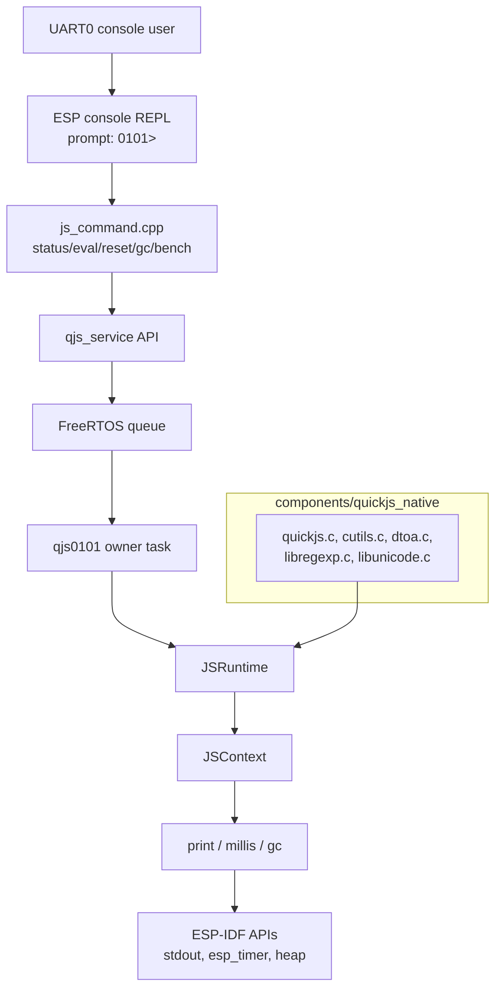
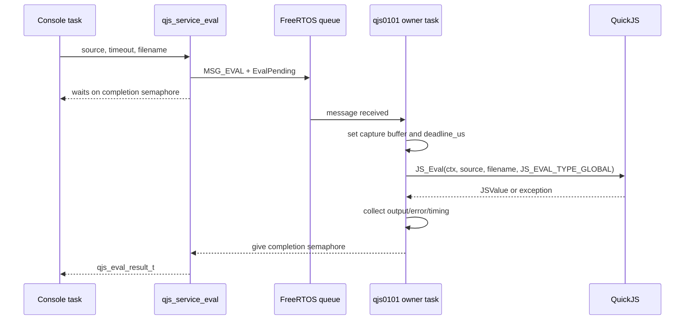

# Native QuickJS on ESP32-P4: Removing Wasm from the Firmware Stack

This is the native embedded-JavaScript branch of the [[esp32]] project map.

This report explains the native QuickJS firmware implemented for the ESP32-P4 after the earlier QuickJS-through-Wasm experiment succeeded. The result is a working ESP-IDF firmware target, `0101-esp32-p4-native-quickjs`, that compiles upstream QuickJS directly into the firmware, starts a single-owner JavaScript service task, and exposes an interactive UART console with `js status`, `js eval`, `js reset`, `js gc`, and `js bench`.

The important result is not only that the firmware runs. The important result is that the system becomes simpler and much faster when the Wasm layer is removed. The previous firmware, `0100-esp32-p4-quickjs-wasm`, proved that QuickJS could run as a WebAssembly module under WAMR on the ESP32-P4. That path was valuable because it established the host API, revealed the WAMR embedding rules, and produced a baseline. The native path takes the same JavaScript engine and the same board, removes WAMR and Wasm linear memory, and lets ESP-IDF compile QuickJS as normal C code for the ESP32-P4 RISC-V target.

> [!summary]
> - `0101-esp32-p4-native-quickjs` compiles full upstream QuickJS directly into ESP-IDF and runs it on the ESP32-P4 without WAMR, without a Wasm module, and without a guest linear-memory boundary.
> - The runtime is still single-owner. A FreeRTOS task owns `JSRuntime*` and `JSContext*`; console commands submit eval/status/reset work through `components/qjs_service`.
> - The measured improvement is large: native QuickJS initializes in about 6 ms, evaluates `print(1+2)` in about 2 ms, runs a 100k integer loop in about 133 ms, and computes `fib(20)` in about 32 ms. The earlier WAMR path initialized in about 2.7 s and ran the 100k loop in about 3.7 s.
> - Two device-only details mattered: upstream QuickJS needed small ESP-IDF compatibility fixes, and recursive JavaScript needed a 32 KiB owner-task stack to avoid a FreeRTOS stack protection fault.

## Why this project exists

The previous firmware answered a specific research question: can QuickJS be compiled to WebAssembly and executed by WAMR inside ESP-IDF firmware on the ESP32-P4? The answer was yes. The working device logs showed `qjs_init` completing and `js eval "print(1+2)"` returning `3`. That result is recorded in [[ARTICLE - QuickJS Wasm on ESP32-P4 - Device Bring-Up and Two WAMR Embedding Crashes]] and the host-side architecture is recorded in [[ARTICLE - QuickJS Wasm on WAMR - Running a JS Engine Inside a Wasm Sandbox]].

Once that path worked, a second question became more important: should the product firmware continue to run QuickJS through WAMR, or should it compile QuickJS directly into the ESP32-P4 application? The ESP32-P4 board in this project has 32 MB PSRAM and a 360 MHz CPU. The first WAMR firmware had already reserved a 16 MB WAMR pool in PSRAM and still had enough headroom to boot and evaluate JavaScript. Memory capacity was not the limiting factor. The extra runtime layer was.

The WAMR path has this execution structure:

```text
ESP console command
  -> C++ runner queue
  -> WAMR runtime
  -> wasm32 QuickJS C code
  -> QuickJS bytecode interpreter
  -> user JavaScript
```

The native path has this structure:

```text
ESP console command
  -> qjs_service queue
  -> native QuickJS C code
  -> QuickJS bytecode interpreter
  -> user JavaScript
```

Removing WAMR changes several things at the same time. It removes the Wasm module build step, the WAMR runtime dependency, the embedded `quickjs.wasm` blob, the WAMR native-symbol import table, the Wasm guest memory allocation path, and the WAMR thread-environment rule that required a long-lived pthread in the previous firmware. It does not remove the need for runtime ownership. QuickJS contexts are mutable engine state; they should still be accessed by one task at a time.

The project therefore had two goals:

1. Prove that full upstream QuickJS can be compiled natively by ESP-IDF for `esp32p4` and run on the real board.
2. Turn that proof into a reusable firmware architecture rather than leaving a one-off `app_main` smoke test.

## The final shape of the project

The implementation lives in the ESP32 workspace:

```text
/home/manuel/workspaces/2025-12-21/echo-base-documentation/esp32-s3-m5
```

The main files are:

| Path | Role |
|---|---|
| `components/quickjs_native/` | ESP-IDF component that vendors upstream QuickJS core engine sources. |
| `components/quickjs_native/CMakeLists.txt` | Compiles QuickJS sources and applies local compile flags/compatibility include. |
| `components/quickjs_native/quickjs_espidf_compat.h` | Declares `malloc_usable_size()` for the ESP-IDF build. |
| `components/qjs_service/include/qjs_service.h` | Public C API for the native QuickJS service. |
| `components/qjs_service/qjs_service.cpp` | FreeRTOS owner-task service that owns `JSRuntime*` and `JSContext*`. |
| `0101-esp32-p4-native-quickjs/` | ESP32-P4 firmware target. |
| `0101-esp32-p4-native-quickjs/main/app_main.cpp` | Starts `qjs_service` and the UART0 ESP console REPL. |
| `0101-esp32-p4-native-quickjs/main/js_command.cpp` | Implements `js status`, `js eval`, `js reset`, `js gc`, and `js bench`. |
| `ttmp/2026/06/23/ESP32-P4-NATIVE-QUICKJS--.../` | Ticket docs, design guide, diary, tasks, and changelog. |

The code was developed in commit-sized checkpoints:

| Commit | Purpose |
|---|---|
| `55eb024` | Vendor native QuickJS and add first ESP32-P4 smoke firmware. |
| `c271fda` | Record first hardware smoke validation. |
| `58b87c8` | Add `components/qjs_service` owner-task service. |
| `d1b9a02` | Add interactive native QuickJS console commands. |
| `68ac88a` | Record Phase 5 hardware validation and native-vs-WAMR measurements. |
| `6083a5a` | Finalize ticket handoff, doctor result, and reMarkable upload. |

## The architecture in one view

The final firmware separates three responsibilities. The QuickJS source component makes the engine buildable. The service component owns the runtime and defines the concurrency contract. The application component creates the console interface.



The diagram matters because it shows where state is allowed to move. Console commands do not call `JS_Eval` directly. They call `qjs_service_eval`. The service API packages the request and sends it to the owner task. The owner task calls QuickJS. That rule is the central design decision in the native firmware.

## Why the owner task remains necessary

Removing WAMR removes WAMR-specific problems. It does not remove the need to serialize access to the JavaScript runtime. `JSRuntime*` and `JSContext*` represent mutable interpreter state: atoms, shapes, objects, exception state, garbage collector metadata, the global object, and the current interrupt handler state. If two FreeRTOS tasks call into the same context at the same time, the code has to prove that the engine permits it and that the caller protects every shared state transition. This firmware does not attempt that. It uses one owner task.

The public API makes this explicit:

```c
typedef struct qjs_service qjs_service_t;

typedef struct {
  const char* task_name;
  uint32_t task_stack_words;
  uint32_t task_priority;
  int32_t task_core_id;
  uint32_t queue_len;
  size_t memory_limit_bytes;
  size_t stack_limit_bytes;
  bool can_block;
} qjs_service_config_t;

esp_err_t qjs_service_start(const qjs_service_config_t* cfg, qjs_service_t** out);
esp_err_t qjs_service_eval(qjs_service_t* s, const char* code, size_t len,
                           uint32_t timeout_ms, const char* filename,
                           qjs_eval_result_t* out);
esp_err_t qjs_service_reset(qjs_service_t* s, uint32_t timeout_ms);
esp_err_t qjs_service_get_status(qjs_service_t* s, qjs_service_status_t* out,
                                 uint32_t timeout_ms);
```

The service can also run arbitrary jobs on the owner task:

```c
typedef esp_err_t (*qjs_job_fn_t)(JSContext* ctx, void* user);

typedef struct {
  qjs_job_fn_t fn;
  void* user;
  uint32_t timeout_ms;
} qjs_job_t;

esp_err_t qjs_service_run(qjs_service_t* s, const qjs_job_t* job);
esp_err_t qjs_service_post(qjs_service_t* s, const qjs_job_t* job);
```

This is the extension point for future board APIs. A display bridge, keyboard bridge, timer service, or HTTP handler should not store a global `JSContext*` and call it from an arbitrary task. It should submit a job to `qjs_service`. The job then runs on the owner task and receives the context only for the duration of that callback.

The runtime state owned by `components/qjs_service/qjs_service.cpp` is small and explicit:

```c++
struct Service {
  qjs_service_config_t cfg = {};
  TaskHandle_t task = nullptr;
  QueueHandle_t q = nullptr;
  SemaphoreHandle_t ready = nullptr;

  JSRuntime* rt = nullptr;
  JSContext* ctx = nullptr;
  std::string* capture = nullptr;
  int64_t deadline_us = 0;
  bool busy = false;
  uint32_t eval_count = 0;
  uint32_t reset_count = 0;
  uint32_t last_eval_ms = 0;
};
```

The `capture` pointer is used only during eval to collect output from `print()`. The `deadline_us` field is read by QuickJS's interrupt handler. The counters feed `js status`.

## Vendoring QuickJS into ESP-IDF

The native engine component is `components/quickjs_native`. It vendors the core upstream QuickJS files from the already-proven 0100 source checkout. The included set is intentionally smaller than the full QuickJS CLI tree:

```text
quickjs.c
quickjs.h
quickjs-atom.h
quickjs-opcode.h
cutils.c / cutils.h
dtoa.c / dtoa.h
libregexp.c / libregexp.h
libregexp-opcode.h
libunicode.c / libunicode.h
libunicode-table.h
unicode_gen_def.h
list.h
VERSION
LICENSE
```

The component excludes `quickjs-libc.c`. That decision is important. `quickjs-libc.c` is the command-line QuickJS standard library layer: file access, OS helpers, module loader behavior, and CLI-oriented functions. Firmware should expose explicit APIs. In the first milestone the explicit globals are `print`, `millis`, and `gc`. Later firmware can add GPIO, display, keyboard, timers, and storage with deliberate contracts.

The native port required three ESP-IDF compatibility decisions.

### `malloc_usable_size` must be declared

QuickJS uses `malloc_usable_size()` for memory accounting. ESP-IDF provides the symbol, but the declaration was not visible to QuickJS in this build. The component solves that with a forced include:

```c
#pragma once
#include <stddef.h>

#ifdef __cplusplus
extern "C" {
#endif

size_t malloc_usable_size(void *ptr);

#ifdef __cplusplus
}
#endif
```

The source component uses `-include quickjs_espidf_compat.h` so the declaration is present without modifying QuickJS for this specific issue.

### ESP-IDF newlib does not provide `tm_gmtoff`

Upstream QuickJS's date implementation uses `tm.tm_gmtoff` on non-Windows platforms. The ESP-IDF/newlib configuration for this target does not provide that field. The local vendor patch makes QuickJS use the portable `gmtime`/`localtime`/`mktime` fallback path when `ESP_PLATFORM` is defined. This is a small source patch in `components/quickjs_native/quickjs/quickjs.c`.

The rule for future updates is to keep this patch visible and reviewable. If the vendored QuickJS version is refreshed, this date/time portability patch must be checked again.

### ESP-IDF turns upstream warnings into errors

ESP-IDF's default warning policy can make third-party source fail on warnings. On this RISC-V/newlib configuration, upstream QuickJS emits several `int*` versus `int32_t*` incompatible pointer warnings. The component keeps those warnings visible but prevents them from failing the build with a local `-Wno-error=incompatible-pointer-types` for `quickjs_native`. The suppression is scoped to the third-party component, not applied globally.

## Runtime creation and the firmware globals

The service creates the runtime on the owner task. The critical sequence is:

```c++
s->rt = JS_NewRuntime();
JS_SetRuntimeOpaque(s->rt, s);
JS_SetMemoryLimit(s->rt, s->cfg.memory_limit_bytes);
JS_SetMaxStackSize(s->rt, s->cfg.stack_limit_bytes);
JS_SetCanBlock(s->rt, s->cfg.can_block ? 1 : 0);
JS_SetInterruptHandler(s->rt, interrupt_handler, s);

s->ctx = JS_NewContext(s->rt);
JS_SetContextOpaque(s->ctx, s);
install_globals(s);
```

The firmware configures:

```c++
constexpr size_t kQuickJsMemoryLimit = 2 * 1024 * 1024;
constexpr size_t kQuickJsStackLimit = 64 * 1024;

cfg.task_name = "qjs0101";
cfg.task_stack_words = 32768;
cfg.task_priority = 8;
cfg.queue_len = 8;
cfg.memory_limit_bytes = kQuickJsMemoryLimit;
cfg.stack_limit_bytes = kQuickJsStackLimit;
cfg.can_block = false;
```

There are two stack values, and they are not the same thing. `JS_SetMaxStackSize` sets QuickJS's own maximum C stack check. The FreeRTOS task stack size controls how much native stack the owner task actually has. The project initially used a 12 KiB owner-task stack and later raised it to 32 KiB after `fib(20)` crashed with a FreeRTOS stack protection fault in `JS_CallInternal`. This is one of the concrete implementation lessons: QuickJS recursion consumes native task stack, and the FreeRTOS task stack must be sized for the workload even when QuickJS has its own stack limit.

The first firmware globals are minimal:

```c++
print(...args)  // converts arguments with JS_ToCString and captures/writes a line
millis()        // returns esp_timer_get_time() / 1000
gc()            // calls JS_RunGC(JS_GetRuntime(ctx))
```

The `print` implementation is also the output-capture mechanism. During eval, the service sets `s->capture` to a local `std::string`. `print` appends to that string. Outside eval capture, it writes to stdout.

```c++
if (s && s->capture) {
  s->capture->append(line);
} else {
  fwrite(line.data(), 1, line.size(), stdout);
  fflush(stdout);
}
```

The design keeps `print` small. It does not format objects like the full QuickJS CLI does. It converts each argument with `JS_ToCString`, inserts spaces between arguments, appends a newline, and returns `undefined`.

## The eval path

The eval path is short, but every step has a purpose.



The service result is deliberately explicit:

```c
typedef struct {
  bool ok;
  bool timed_out;
  uint32_t elapsed_ms;
  char* output;
  char* error;
} qjs_eval_result_t;
```

The caller owns `output` and `error` and must call `qjs_eval_result_free()`. This ownership rule is visible in `js_command.cpp`: every path that calls `qjs_service_eval` eventually frees the result.

On success, the service returns captured `print` output and, if the expression returned a non-`undefined` value, appends that value converted through `JS_ToCString`. On exception, it calls `JS_GetException`, stringifies the exception, and returns `ok=false` with `error` set.

The console prints the result in a stable form:

```text
[console-eval] ok=1 timed_out=0 elapsed=2ms
3
```

Errors intentionally produce a non-zero ESP console command result:

```text
[console-eval] ok=0 timed_out=0 elapsed=0ms
error: Error: boom
Command returned non-zero error code: 0x1 (ERROR)
```

That final ESP console line is useful during scripted validation because it marks the command as failed. It may be too noisy for a product shell. The project leaves that as a review point rather than hiding errors.

## Deadlines and interruption

QuickJS supports interruption through `JS_SetInterruptHandler`. The firmware stores an absolute deadline in microseconds before calling `JS_Eval`:

```c++
s->deadline_us = timeout_ms ? (esp_timer_get_time() + (int64_t)timeout_ms * 1000) : 0;
JSValue val = JS_Eval(...);
```

The interrupt handler checks the deadline:

```c++
static int interrupt_handler(JSRuntime* rt, void* opaque) {
  (void)rt;
  auto* s = static_cast<Service*>(opaque);
  if (!s || s->deadline_us == 0) return 0;
  return esp_timer_get_time() > s->deadline_us;
}
```

When the handler returns non-zero, QuickJS interrupts execution and reports an exception. The console sets a 1000 ms default eval timeout. That value was chosen from device evidence. A 5000 ms timeout did eventually interrupt `while(true){}`, but it allowed the FreeRTOS task watchdog to report that the `qjs0101` task was running too long on CPU0. Reducing the console timeout to 1000 ms produced clean output:

```text
0101>  js eval "while(true){}"
[console-eval] ok=0 timed_out=1 elapsed=1000ms
error: InternalError: interrupted
Command returned non-zero error code: 0x1 (ERROR)
```

This is a good first milestone behavior. It does not prove that every long-running script is harmless. It proves that QuickJS interruption works and that the console default is below the observed watchdog threshold.

## The console surface

The application entry point starts the service and then starts the ESP console REPL on UART0:

```c++
qjs_service_t *svc = start_quickjs_service();

esp_console_repl_t *repl = nullptr;
esp_console_repl_config_t repl_cfg = ESP_CONSOLE_REPL_CONFIG_DEFAULT();
repl_cfg.prompt = "0101> ";
repl_cfg.task_stack_size = 8192;
esp_console_register_help_command();
register_js_commands(svc);

esp_console_dev_uart_config_t hw_cfg = ESP_CONSOLE_DEV_UART_CONFIG_DEFAULT();
esp_console_new_repl_uart(&hw_cfg, &repl_cfg, &repl);
esp_console_start_repl(repl);
```

The ESP32-P4 board uses the CH343 USB-UART bridge on UART0. Unlike the ESP32-S3 projects in the same repository, the P4 console here is not USB Serial/JTAG. The firmware follows the 0099/0100 P4 baseline rather than the S3 console default.

The console command implementation is intentionally simple:

```text
js status
js eval <source>
js reset
js gc
js bench
```

`js eval` joins all remaining argv tokens with spaces, so both quoted and unquoted forms work as long as the shell/monitor passes them as intended. Source length is bounded to 2048 bytes.

`js bench` runs three snippets. Each snippet is wrapped in an immediately invoked function expression:

```javascript
(()=>{
  let t = millis();
  let s = 0;
  for (let i = 0; i < 100000; i++) s += i;
  print('sum100k=' + String(millis() - t) + ',s=' + String(s));
})()
```

The IIFE wrapper was added after the first implementation failed. Top-level `let` declarations persist in the same QuickJS context. Running one benchmark after another with `let t` at top level caused `SyntaxError: redeclaration of 't'`. Wrapping each benchmark gives each run its own lexical scope.

## What changed compared with the WAMR firmware

The native firmware is not just a faster version of the WAMR firmware. Several design responsibilities moved or disappeared.

| Area | 0100 QuickJS-WASM | 0101 native QuickJS |
|---|---|---|
| Engine build | Build QuickJS to `quickjs.wasm` with `wasi-sdk`. | Compile QuickJS C sources as an ESP-IDF component. |
| Runtime layer | WAMR interprets the Wasm module. | QuickJS runs as native ESP32-P4 code. |
| Host boundary | Wasm imports under module `env`; strings must cross guest memory. | C functions are registered directly with QuickJS using `JS_NewCFunction`. |
| Engine memory | WAMR linear memory plus WAMR runtime pool. | QuickJS allocator under ESP-IDF, constrained with `JS_SetMemoryLimit`. |
| Thread issue | `wasm_runtime_call_wasm` needed a pthread owner because WAMR called `pthread_self`. | FreeRTOS owner task is enough; it exists to serialize QuickJS access. |
| Embedded asset | `quickjs.wasm` embedded in flash and copied to PSRAM before load. | No embedded Wasm blob. |
| Startup | `qjs_init` about 2.7 s. | Runtime/context init about 6 ms. |
| 100k loop | About 3.7 s JS-side. | About 133 ms JS-side. |

The native firmware also avoids the two WAMR device failure modes. There is no call to `wasm_runtime_load`, so there is no mutable module-buffer requirement. There is no call to `wasm_runtime_call_wasm`, so there is no WAMR thread identity assertion. Those problems were solved in 0100, but the native path removes them from the system.

## Device measurements

All measurements below came from the ESP32-P4 hardware over `/dev/ttyACM0` using `idf.py monitor` in a tmux session. The board booted with 32 MB PSRAM at 200 MHz and CPU frequency 360 MHz.

### Startup

```text
I (...) qjs_service: task start name=qjs0101 prio=8 core=0
I (...) qjs_service: runtime init status=ESP_OK elapsed=6 ms
I (...) 0101: QuickJS ready. Try: js eval "print(1+2)" or js bench
```

### Basic eval and exception handling

```text
0101>  js eval "print(1+2)"
[console-eval] ok=1 timed_out=0 elapsed=2ms
3

0101>  js eval "throw new Error('boom')"
[console-eval] ok=0 timed_out=0 elapsed=0ms
error: Error: boom
Command returned non-zero error code: 0x1 (ERROR)
```

### Benchmarks

```text
0101>  js bench
[bench-10k] ok=1 timed_out=0 elapsed=13ms
sum10k=11,s=49995000
[bench-100k] ok=1 timed_out=0 elapsed=133ms
sum100k=133,s=4999950000
[bench-fib20] ok=1 timed_out=0 elapsed=32ms
fib20=6765,ms=31
```

### Timeout

```text
0101>  js eval "while(true){}"
[console-eval] ok=0 timed_out=1 elapsed=1000ms
error: InternalError: interrupted
Command returned non-zero error code: 0x1 (ERROR)
```

### Reset and state isolation

```text
0101>  js eval "globalThis.persist=42; print(persist)"
[console-eval] ok=1 timed_out=0 elapsed=2ms
42
0101>  js reset
reset: ESP_OK
0101>  js eval "print(typeof persist)"
[console-eval] ok=1 timed_out=0 elapsed=0ms
undefined
```

The reset command rebuilds the runtime/context and clears user-defined globals. That makes `js reset` a practical recovery boundary for the console workflow.

### Allocation smoke

```text
0101>  js eval "(()=>{let t=millis(); let a=[]; for(let i=0;i<2000;i++) a.push({i, s:'x'.repeat(32)}); print('alloc2000='+String(millis()-t)+',len='+String(a.length));})()"
[console-eval] ok=1 timed_out=0 elapsed=37ms
alloc2000=33,len=2000
```

A repeated allocation and explicit GC stress also completed:

```text
[console-eval] ok=1 timed_out=0 elapsed=280ms
stress-ok
```

The status command remained ready after these tests.

## Native versus Wasm timing

The performance difference is large enough that the architecture decision is no longer ambiguous for this board if the product does not require a Wasm sandbox boundary.

| Operation | QuickJS-WASM on WAMR (`0100`) | Native QuickJS (`0101`) |
|---|---:|---:|
| Runtime init | ~2.7 s | ~6 ms |
| `print(1+2)` eval | ~50 ms host-visible roundtrip | ~2 ms reported eval time |
| 10k integer loop | ~365 ms JS-side / ~441 ms roundtrip | ~11 ms JS-side / ~13 ms eval |
| 100k integer loop | ~3.71 s JS-side / ~3.81 s roundtrip | ~133 ms JS-side / ~133 ms eval |
| `fib(20)` | WAMR operand stack overflow in first measurement | `fib20=6765`, ~31 ms JS-side / ~32 ms eval |
| Infinite loop | Not stabilized in the first WAMR measurement set | Interrupts at ~1000 ms with `timed_out=1` |

The table should be read with two caveats. First, the measurements are device observations from one firmware build and one board, not a formal benchmark suite. Second, the native `elapsed` values are measured around `JS_Eval` inside the service, while the earlier WAMR numbers included some host-visible roundtrip observations. The conclusion remains stable because the differences are far larger than the measurement overhead.

## Failure modes encountered during the native implementation

The native path avoided the WAMR crashes, but it had its own device and build issues. These failures are valuable because they define the porting rules for future QuickJS updates.

### Missing generated/support headers

The first QuickJS source copy omitted files that are not obvious if one only reads the `.c` list:

```text
fatal error: libregexp-opcode.h: No such file or directory
fatal error: list.h: No such file or directory
fatal error: libunicode-table.h: No such file or directory
```

The fix was to vendor the generated and support headers along with the core C files. Future updates should copy the entire minimal required set, not just the obvious translation units.

### ESP-IDF portability failures

The second build failed on platform details:

```text
implicit declaration of function 'malloc_usable_size'
error: 'struct tm' has no member named 'tm_gmtoff'
error: passing argument ... from incompatible pointer type [-Wincompatible-pointer-types]
```

The fixes were scoped:

- declare `malloc_usable_size` with `quickjs_espidf_compat.h`;
- use the portable timezone fallback when `ESP_PLATFORM` is defined;
- locally disable `-Werror=incompatible-pointer-types` for the third-party QuickJS component.

### Benchmark lexical redeclaration

The first `js bench` implementation used top-level `let t` in multiple evals. QuickJS correctly preserved the top-level lexical binding in the global context, so the second benchmark failed:

```text
[bench-100k] ok=0 timed_out=0 elapsed=0ms
error: SyntaxError: redeclaration of 't'
```

The fix was to wrap every benchmark snippet in an IIFE. The rule is general: repeated console eval examples should avoid persistent top-level lexical declarations unless persistence is the behavior being tested.

### Owner-task stack too small for recursion

After the IIFE fix, `fib(20)` crashed when the owner task stack was 12 KiB:

```text
Guru Meditation Error: Core  0 panic'ed (Stack protection fault).
Detected in task "qjs0101" ... JS_CallInternal ... quickjs.c:17749
```

The fix was to raise `cfg.task_stack_words` to 32768. The important point is that `JS_SetMaxStackSize` and the FreeRTOS task stack are distinct controls. QuickJS recursion consumes native C stack. If the FreeRTOS task stack is too small, the system can fault before the JavaScript-level behavior is useful.

### Timeout longer than the task watchdog threshold

A 5000 ms console timeout allowed the task watchdog to report that `qjs0101` had run too long on CPU0 during `while(true){}`. The QuickJS interrupt eventually worked, but the watchdog warning made the operator experience noisy and suggested an unsafe default. The console timeout was reduced to 1000 ms.

Longer timeouts can be added later as an explicit option. The default should be conservative.

## What the native firmware proves

The implementation proves several concrete points:

- Full upstream QuickJS can be compiled directly into ESP-IDF for the ESP32-P4 target.
- A small compatibility layer is enough for the first native port; the engine does not need broad source rewrites.
- A FreeRTOS owner-task model is sufficient for an interactive console runtime.
- QuickJS interruption works on device through `JS_SetInterruptHandler`.
- Reset can rebuild the runtime and clear user globals.
- Native execution is much faster than the QuickJS-WASM/WAMR path for the measured workloads.

It also proves what still needs care:

- Recursive JavaScript requires adequate owner-task stack.
- Long-running eval must have a deadline shorter than the watchdog threshold unless the service is changed to feed/yield safely.
- QuickJS memory reporting needs interpretation. The status output includes `memory_used_size`, `malloc_size`, and `atom_count`; these fields are useful, but the exact meaning of `malloc_size` under this allocator should be reviewed before treating it as the primary memory metric.
- The current API surface is intentionally small. GPIO, display, keyboard, timers, module loading, and storage are not implemented yet.

## How to reproduce the firmware

Build:

```bash
cd /home/manuel/workspaces/2025-12-21/echo-base-documentation/esp32-s3-m5/0101-esp32-p4-native-quickjs
source /home/manuel/esp/esp-idf-5.4.2/export.sh
idf.py set-target esp32p4
idf.py build
```

Flash:

```bash
idf.py -p /dev/ttyACM0 flash
```

Monitor with a single serial owner:

```bash
tmux kill-session -t qjs0101 2>/dev/null || true
tmux new-session -d -s qjs0101 -c "$PWD" \
  "bash -lc 'source /home/manuel/esp/esp-idf-5.4.2/export.sh >/dev/null 2>&1; idf.py -p /dev/ttyACM0 monitor'"
sleep 6
tmux capture-pane -t qjs0101 -p | tail -80
```

Try the console:

```text
0101> js status
0101> js eval "print(1+2)"
0101> js eval "throw new Error('boom')"
0101> js reset
0101> js gc
0101> js bench
0101> js eval "while(true){}"
```

Kill the monitor before reflashing:

```bash
tmux kill-session -t qjs0101
```

This matters because `/dev/ttyACM0` is single-owner during flashing and monitoring. Parallel monitor/flash/probe processes produce misleading failures.

## Review guide

A reviewer should start with the service API, not with the vendored QuickJS source. The central question is whether the firmware's ownership and error semantics are right. The suggested order is:

1. `components/qjs_service/include/qjs_service.h` — public API and ownership contract.
2. `components/qjs_service/qjs_service.cpp` — owner task, queue messages, runtime lifecycle, eval result formatting, output capture, deadlines, reset, and status.
3. `0101-esp32-p4-native-quickjs/main/app_main.cpp` — service configuration, stack sizing, REPL startup.
4. `0101-esp32-p4-native-quickjs/main/js_command.cpp` — command parsing, timeout default, benchmark snippets, and result printing.
5. `components/quickjs_native/CMakeLists.txt` and `components/quickjs_native/README.md` — vendored source list and ESP-IDF compatibility decisions.
6. `components/quickjs_native/quickjs/quickjs.c` — verify the local `ESP_PLATFORM` timezone fallback patch when updating QuickJS.

The review questions are specific:

- Does every path that receives `qjs_eval_result_t` free it with `qjs_eval_result_free`?
- Does any code outside the owner task touch `JSRuntime*` or `JSContext*` directly?
- Should JavaScript exceptions return a non-zero console command status, or should the shell treat them as successful command execution with a failed JS result?
- Is 32 KiB the right default owner-task stack for the intended scripts?
- Should the console timeout become a command-line option?
- Should future firmware use a custom `JS_NewRuntime2` allocator to steer QuickJS allocations into PSRAM explicitly?

## Where to extend the system next

The next useful work is not more proof that QuickJS runs. That is done. The next useful work is deciding which firmware APIs JavaScript should get and how those APIs should be scheduled.

A sensible sequence is:

1. Add a serial validation script that opens the monitor once, sends the standard commands, and checks expected output. This turns the current manual tmux transcript into a repeatable regression test.
2. Add `js bench alloc` and `js bench stress` subcommands so allocation measurements are not pasted ad hoc at the console.
3. Add explicit GPIO APIs only after choosing safe pins and documenting pin ownership.
4. Add PicoCalc display and keyboard bindings from the 0099 firmware after deciding whether JavaScript should draw directly or submit higher-level UI operations.
5. Add timer APIs using the existing 0067 MicroQuickJS timer bridge as prior art, but keep timer callbacks serialized through the owner task.
6. Evaluate a PSRAM-first custom allocator only if real workloads show memory pressure or fragmentation problems.

The working rule for future bindings is simple: native code may expose functions to JavaScript, but JavaScript engine state remains owned by `qjs_service`. If an interrupt, timer, HTTP request, keyboard event, or display callback needs to run JavaScript, it should submit a job to the service rather than entering QuickJS directly.

## Related notes and source material

- Previous host-side Wasm article: [[ARTICLE - QuickJS Wasm on WAMR - Running a JS Engine Inside a Wasm Sandbox]].
- Previous device-side WAMR postmortem: [[ARTICLE - QuickJS Wasm on ESP32-P4 - Device Bring-Up and Two WAMR Embedding Crashes]].
- Native ticket docs: `/home/manuel/workspaces/2025-12-21/echo-base-documentation/esp32-s3-m5/ttmp/2026/06/23/ESP32-P4-NATIVE-QUICKJS--native-quickjs-firmware-on-the-esp32-p4-intern-implementation-guide/`.
- Native firmware: `/home/manuel/workspaces/2025-12-21/echo-base-documentation/esp32-s3-m5/0101-esp32-p4-native-quickjs/`.
- Native service: `/home/manuel/workspaces/2025-12-21/echo-base-documentation/esp32-s3-m5/components/qjs_service/`.
- Native QuickJS vendor component: `/home/manuel/workspaces/2025-12-21/echo-base-documentation/esp32-s3-m5/components/quickjs_native/`.
- Prior service model: `/home/manuel/workspaces/2025-12-21/echo-base-documentation/esp32-s3-m5/components/mqjs_service/`.
- ESP32-P4 board baseline: `/home/manuel/workspaces/2025-12-21/echo-base-documentation/esp32-s3-m5/0099-esp32-p4-picocalc-display-keyboard/`.
