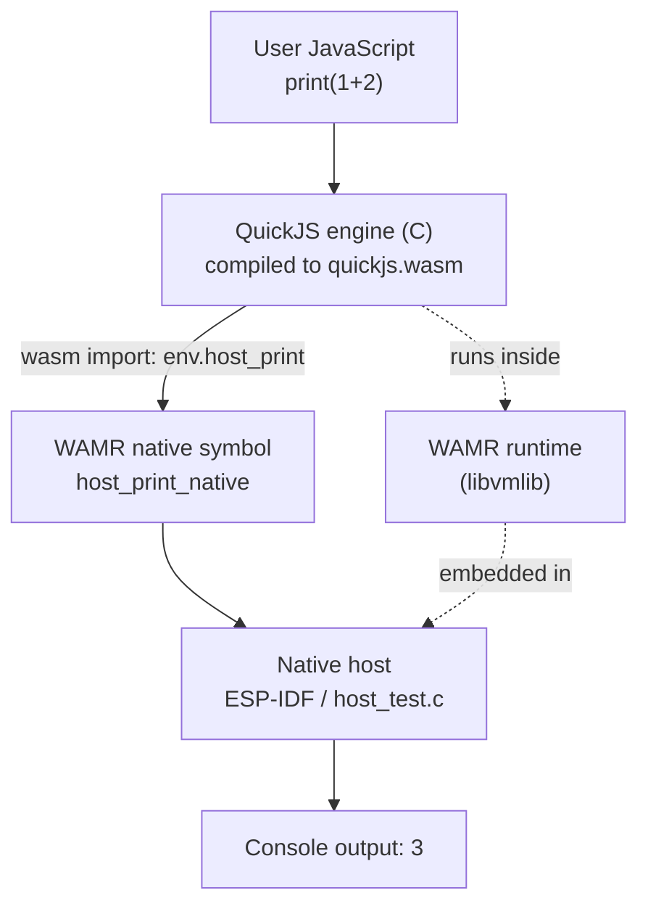

# QuickJS as a Wasm Module Under WAMR

This note records how to run the QuickJS JavaScript engine after compiling it to a WebAssembly module and executing that module with the WebAssembly Micro Runtime (WAMR). It is written from a working host-side implementation that evaluates JavaScript through a QuickJS engine which is itself running inside a Wasm sandbox. The note preserves the architecture, the build pipeline, and the failure modes encountered while making the stack run end to end. The concrete vehicle is firmware `0100-esp32-p4-quickjs-wasm`, destined for an ESP32-P4, but the findings apply to any host that embeds WAMR.

> [!summary]
> - The system is a three-layer stack: user JavaScript, a QuickJS engine compiled to Wasm, and a WAMR runtime embedded in a native host. There are two distinct host boundaries, and data crosses each one differently.
> - Building QuickJS to Wasm with `wasi-sdk` requires resolving four compile/link gaps before the module will load: a missing `malloc_usable_size` declaration, an undefined `CONFIG_VERSION`, a dead `<setjmp.h>` include, and the need to export `malloc` and `free`.
> - The one failure that blocked evaluation was a QuickJS stack-overflow check that reads the real C stack pointer. Under WAMR's interpreter that pointer does not correspond to JavaScript recursion depth, so the check false-trips on the first parse. The fix is `JS_SetMaxStackSize(rt, 0)`.

## Why this note exists

Compiling an existing C engine to Wasm and running it under an embedded Wasm runtime is a recurring pattern: it gives a host a sandboxed, portable scripting engine without porting the engine to the host's native ABI. The pattern looks simple in outline — compile the engine, embed the runtime, call an exported function — but the details that make it actually work are not obvious and are rarely written down together. This note captures those details so they do not have to be rediscovered.

The reference implementation evaluates JavaScript on a host PC through a WAMR host test that uses the exact code path the eventual ESP32-P4 firmware will use. A passing host test means the Wasm module and the host API contract are correct before any device work begins.

## The system under study

Three execution layers are nested. At the outermost layer is the native host: ESP-IDF firmware on an ESP32-P4, or for development a small C program on a PC. The host embeds WAMR, which is the Wasm runtime. Inside WAMR runs a single Wasm module, `quickjs.wasm`, which contains the QuickJS C engine compiled to `wasm32-wasi`. Inside that engine runs the user's JavaScript.



The diagram is the whole system in one picture. Read it from top to bottom. A JavaScript call to `print` does not reach the host directly. It reaches a C function that lives inside the Wasm module, and that C function reaches the host by calling a Wasm import. Each arrow in the diagram is a boundary that has its own calling convention.

### The two host boundaries

There are two boundaries, and confusing them is the most common mistake. They are different in kind, not in degree.

The first boundary is between WAMR and the Wasm module. WAMR is the host; `quickjs.wasm` is the guest. The guest declares imports — `host_print`, `host_millis`, `host_gpio_write` — in a Wasm import module named `env`. WAMR satisfies those imports with native C functions the embedder registers through `wasm_runtime_register_natives`. Arguments cross this boundary as raw Wasm types: 32-bit integers and pointers expressed as offsets into the guest's linear memory. A string passed from the host into the guest must be copied into the guest's memory first, because the guest cannot read host memory.

The second boundary is between QuickJS and the user's JavaScript. QuickJS is the host; the user's script is the guest. When the script calls `print(...)`, it calls a global that the embedder registered with `JS_NewCFunction`. That global is a C function that lives inside the Wasm module. The function's body calls one of the `env` imports, which crosses the first boundary and reaches the native host.

A single `print("hello")` therefore crosses both boundaries in sequence: the JavaScript call reaches `js_print` (a C function inside the Wasm module), and `js_print` calls `host_print` (a Wasm import satisfied by a WAMR native symbol), which calls into ESP-IDF and writes to the console. Understanding that there are two boundaries, and that only the inner one is visible to JavaScript, is the foundation for everything that follows.

## Building the Wasm module

The build runs on a host PC, not in ESP-IDF. Its input is the QuickJS C source and a small wrapper; its output is `quickjs.wasm`. The toolchain is `wasi-sdk`, which packages Clang, LLD, and a WASI sysroot (`wasi-libc`, a musl-derived libc) so that a normal C program can target `wasm32-wasi` and get a working `malloc`, `printf`, and the WASI imports those imply.

The wrapper, `wasm_main.c`, is the bridge between the two boundaries. It declares the `env` imports, defines the JavaScript globals in C, and exports two entry points the host will call.

```c
#include "quickjs.h"

__attribute__((import_module("env"), import_name("host_print")))
extern void host_print(const char *s);

__attribute__((import_module("env"), import_name("host_millis")))
extern int host_millis(void);

static JSValue js_print(JSContext *c, JSValueConst ths, int argc, JSValueConst *argv) {
    const char *s = JS_ToCString(c, argv[0]);
    if (s) { host_print(s); host_print("\n"); JS_FreeCString(c, s); }
    return JS_UNDEFINED;
}

void qjs_init(void) {                       /* exported */
    JSRuntime *rt = JS_NewRuntime();
    JS_SetMaxStackSize(rt, 0);             /* see "Execution-model mismatch" */
    JSContext *ctx = JS_NewContext(rt);
    JS_SetPropertyStr(ctx, JS_GetGlobalObject(ctx), "print",
                      JS_NewCFunction(ctx, js_print, "print", 1));
}

int qjs_eval(const char *src, int len) {   /* exported */
    JSValue r = JS_Eval(ctx, src, len, "<console>", JS_EVAL_TYPE_GLOBAL);
    int ok = JS_IsException(r) ? -1 : 0;
    JS_FreeValue(ctx, r);
    return ok;
}
```

The module is built as a reactor — a library module that exports named functions rather than a command module that exports `_start`. The link command expresses this directly.

```bash
$WASI_SDK_PATH/bin/clang --target=wasm32-wasip1 -O2 \
  -DCONFIG_VERSION="\"$(cat quickjs/VERSION)\"" \
  -include wasm_shim.h -I wasm_overrides -I quickjs \
  quickjs/quickjs.c quickjs/cutils.c quickjs/dtoa.c \
  quickjs/libregexp.c quickjs/libunicode.c wasm_main.c \
  -o quickjs.wasm \
  -Wl,--no-entry -Wl,--export=qjs_init -Wl,--export=qjs_eval \
  -Wl,--export=malloc -Wl,--export=free -Wl,--allow-undefined \
  -Wl,--initial-memory=8388608 -Wl,--max-memory=16777216
```

The flags matter and each one is load-bearing. `--target=wasm32-wasip1` selects the WASI preview1 target, whose imports WAMR implements. `--no-entry` produces a reactor instead of a command. `--export=qjs_init` and `--export=qjs_eval` are the functions WAMR will look up. `--export=malloc` and `--export=free` are required by WAMR to allocate inside the guest heap. `--allow-undefined` permits the `env.host_*` imports to remain unresolved at link time, because WAMR supplies them at runtime. The memory flags give the engine an eight-megabyte initial linear memory that can grow to sixteen.

Four problems had to be solved before this command produced a loadable module. They are listed below in the order they were encountered.

### `malloc_usable_size` is not declared

QuickJS's default allocator calls `malloc_usable_size` for memory accounting. The function exists in `wasi-libc`'s `dlmalloc`, but it is not declared in any header QuickJS includes, so Clang rejects the call as an implicit declaration under C99. The fix is a one-line shim, force-included so the declaration is visible in every translation unit without patching QuickJS.

```c
/* wasm_shim.h */
#include <stddef.h>
size_t malloc_usable_size(void *ptr);
```

The `-include wasm_shim.h` flag injects this declaration into each translation unit. The definition comes from `libc.a`. An earlier attempt also defined the function in a `wasm_shim.c`; that produced a duplicate symbol against `dlmalloc`'s definition, which is how it was confirmed that the symbol is already linked.

### `CONFIG_VERSION` is undefined

QuickJS formats its version into a string with `fprintf(fp, "QuickJS memory usage -- " CONFIG_VERSION " version, ...")`. The upstream Makefile defines `CONFIG_VERSION` from a `VERSION` file; the Wasm build must do the same. The fix is `-DCONFIG_VERSION="\"$(cat quickjs/VERSION)\""`, which yields `-DCONFIG_VERSION="\"2026-06-04\""`.

### `<setjmp.h>` is included but never used

`dtoa.c` includes `<setjmp.h>`. The include is dead: a search across the QuickJS sources finds the include but no call to `setjmp`, `longjmp`, or any use of `jmp_buf`. The include is nonetheless fatal, because `wasi-libc`'s `setjmp.h` emits a hard `#error` unless the build enables the WebAssembly Exception Handling proposal.

The principled fix is not to enable exception handling. Enabling it would require compiling with `-mllvm -wasm-enable-sjlj` and running under an engine that implements the proposal, neither of which the target needs. Instead a stub `setjmp.h` is placed in a directory found before the sysroot, satisfying the dead include without pulling in the proposal.

```c
/* wasm_overrides/setjmp.h */
#ifndef _WASM_STUB_SETJMP_H
#define _WASM_STUB_SETJMP_H
typedef int jmp_buf[4];
static int (setjmp)(jmp_buf b) { (void)b; return 0; }
static void (longjmp)(jmp_buf b, int v) { (void)b; (void)v; for (;;) {} }
#endif
```

The `-I wasm_overrides` flag ensures `#include <setjmp.h>` resolves to this stub. An earlier attempt used `-D__wasm_exception_handling__` to silence the `#error`; that tells `wasi-libc` that exception handling is compiled in when it is not, and was abandoned in favour of the stub.

### The module must export `malloc` and `free`

WAMR allocates inside the guest heap by calling the module's own `malloc` and `free`. With a `wasi-sdk` module those are internal by default, so `wasm_runtime_module_dup_data` fails with a diagnostic: `app heap is corrupted ... please add -Wl,--export=malloc -Wl,--export=free`. Adding those two exports lets WAMR copy data into the guest's linear memory, which is how the JavaScript source string reaches `qjs_eval`.

## Embedding WAMR as the host

The host program mirrors the firmware's intended path. It initialises WAMR with a memory pool, registers the `env` native symbols, loads the module, instantiates it, calls `qjs_init`, then calls `qjs_eval` with a JavaScript string copied into the guest's memory.

```c
static void host_print(wasm_exec_env_t env, const char *s) { fputs(s, stdout); fflush(stdout); }

static NativeSymbol native_symbols[] = {
    { "host_print",  (void *)host_print,  "($)",  NULL },  /* one string, no return */
    { "host_millis", (void *)host_millis, "()i",  NULL },
    { "host_gpio_write", (void *)host_gpio_write, "(ii)", NULL },
};

RuntimeInitArgs args = {};
args.mem_alloc_type = Alloc_With_Pool;
args.mem_alloc_option.pool.heap_buf  = heap;          /* 8 MB on host, PSRAM on device */
args.mem_alloc_option.pool.heap_size = sizeof(heap);
args.native_module_name = "env";
args.n_native_symbols   = 3;
args.native_symbols      = native_symbols;
wasm_runtime_full_init(&args);

wasm_module_t mod  = wasm_runtime_load(buf, size, err, sizeof err);
wasm_module_inst_t inst = wasm_runtime_instantiate(mod, 32*1024, 512*1024, err, sizeof err);
wasm_exec_env_t env = wasm_runtime_create_exec_env(inst, 32*1024);

wasm_function_inst_t f = wasm_runtime_lookup_function(inst, "qjs_init");
wasm_runtime_call_wasm(env, f, 0, NULL);               /* zero args */

f = wasm_runtime_lookup_function(inst, "qjs_eval");
uint64_t wptr = wasm_runtime_module_dup_data(inst, src, strlen(src) + 1);
uint32_t av[2] = { (uint32_t)wptr, (uint32_t)strlen(src) };
wasm_runtime_call_wasm(env, f, 2, av);                 /* ptr, len */
```

Two details in this code are easy to get wrong. The native symbol signature for `host_print` is `"($)"`, which means one string argument and no return. The `$` tells WAMR to copy the guest string and NUL-terminate it, so the C function receives an ordinary `const char *`. If the wrapper declared `host_print(const char *s, int len)` instead, the signature and the import would disagree and the string would be misread. The second detail is that the JavaScript source is passed with `wasm_runtime_module_dup_data`, never as a host pointer; the sandbox forbids the guest from reading host memory, so the string must be copied into the guest's linear memory and the guest-space address passed to `qjs_eval`.

## The execution-model mismatch

After the four build problems were solved, the module loaded, instantiated, and `qjs_init` ran successfully. The QuickJS runtime and context were created and the `print` global was registered. Then `qjs_eval` failed for every input, including `1+2`, with an exception that initially appeared to have no message.

The exception was a real `Error` object (`JS_IsError` returned true), but `JS_ToCString` on it returned `NULL`. Reading the error's `.name` and `.message` properties directly — which are string lookups, not `toString` calls — revealed the actual error: `SyntaxError: stack overflow`.

That string is the key. QuickJS's parser calls `js_parse_error(s, "stack overflow")` when `js_check_stack_overflow` returns true. The check is short.

```c
static inline BOOL js_check_stack_overflow(JSRuntime *rt, size_t alloca_size) {
    uintptr_t sp = (uintptr_t)__builtin_frame_address(0) - alloca_size;
    return unlikely(sp < rt->stack_limit);
}
```

The check reads the real C stack pointer and compares it to `rt->stack_limit`, which is `rt->stack_top - rt->stack_size`. `rt->stack_top` is captured once, at `JS_NewRuntime`. The check exists to bound C-stack recursion in native QuickJS, where deep JavaScript recursion consumes real C stack frames.

Under WAMR's interpreter that model does not hold. The interpreter executes Wasm bytecode in a loop; each Wasm function call does not add a native C frame that tracks JavaScript recursion depth. The host C stack pointer that `__builtin_frame_address` returns therefore has no stable relationship to how deeply the JavaScript being parsed recurses. The pointer at parse time can fall below the limit captured at runtime creation time simply because the two points are in different host call frames, and the check trips. For `1+2` there is no recursion at all, which is why the false positive was conclusive evidence of a measurement problem rather than a real overflow.

The reason `JS_ToCString` returned `NULL` is the same defect compounding. Converting the thrown `SyntaxError` to a string calls `toString`, which re-enters the engine and re-runs the stack check, which trips again, so the conversion fails and returns `NULL`. The exception appeared message-less because the mechanism that would have printed the message was itself broken by the same false trip. Dumping `.name` and `.message` as properties bypassed `toString` and exposed the real error.

The fix is one line in `qjs_init`:

```c
JS_SetMaxStackSize(rt, 0);
```

With `stack_size` set to zero, `update_stack_limit` sets `rt->stack_limit = 0` and the check `sp < 0` is always false. The check is disabled. Stack bounds are not lost: WAMR enforces the Wasm stack, so unbounded JavaScript recursion surfaces as a Wasm stack trap that returns `false` from `wasm_runtime_call_wasm` rather than as a clean JavaScript exception. That is the correct trade for an interpreted engine, where the C-stack limit models a recursion mechanism that does not exist.

After this change the smoke test passes:

```
print(1+2)                       -> 3              (returned 0)
print(6*7)                       -> 42             (returned 0)
for(let i=0;i<3;i++) print(i)    -> 0 1 2          (returned 0)
let s="hi"; print(s+" wasm")     -> hi wasm        (returned 0)
throw new Error('boom')         -> Error: boom    (returned -1, exception printed)
```

A native build of the identical `qjs_init`/`qjs_eval`/`js_print` sources with `gcc` had passed from the first attempt. That isolation was what pinned the failure to the Wasm execution model rather than to the embedding logic, and is the single most useful debugging step for this class of problem: build the same wrapper natively and confirm it works, then attribute any Wasm-only failure to the build or the runtime.

## Working rules

- Build the engine as a Wasm reactor with `--no-entry` and explicit `--export` of the entry points the host will call. Do not rely on a command module's `_start`.
- Export `malloc` and `free` so the runtime can allocate inside the guest heap. Without them, `wasm_runtime_module_dup_data` fails.
- Pass strings into the guest with `wasm_runtime_module_dup_data` and pass the guest-space address. Never pass a host pointer; the sandbox forbids the guest from reading it.
- Match native symbol signatures to the import declarations exactly. A `($)` host function takes one string; a wrapper that declares two parameters will silently misread arguments.
- When a C library includes `<setjmp.h>` but does not use it, stub the header rather than enabling the Exception Handling proposal. Enable features only when the engine and the workload require them.
- Expect modern Clang to emit reference types. Enable `WAMR_BUILD_REF_TYPES` on the host and `CONFIG_WAMR_ENABLE_REF_TYPES` on the device, or module loading fails.
- Disable QuickJS's C-stack-overflow check with `JS_SetMaxStackSize(rt, 0)` whenever QuickJS runs under a Wasm interpreter. The check models native C recursion, which the interpreter does not use, and false-trips on the first parse.
- When an exception appears message-less, read the error's `.name` and `.message` properties directly. `toString` may be broken by the same defect that produced the exception.

## Reproducing it

The implementation lives in firmware `0100-esp32-p4-quickjs-wasm`. The build is two stages: build the Wasm module, then build and run the WAMR host test.

```bash
cd 0100-esp32-p4-quickjs-wasm/wasm-src
git clone --depth 1 https://github.com/bellard/quickjs.git quickjs
export WASI_SDK_PATH=/home/manuel/tools/wasi-sdk-33.0-x86_64-linux
./build-quickjs-wasm.sh                      # produces ../wasm-build/quickjs.wasm
python3 wasm_inspect.py ../wasm-build/quickjs.wasm   # verify imports/exports

cd host-test
cmake -B build -DWAMR_ROOT_DIR=../../0079-papers3-wamr-assemblyscript-console/managed_components/bytecodealliance__wasm-micro-runtime
cmake --build build -j
./build/host_test ../../wasm-build/quickjs.wasm "print(1+2)"   # expect: 3
```

A native comparison, useful to isolate embedding bugs from Wasm-build bugs:

```bash
gcc -O2 -DCONFIG_VERSION=\"native-test\" -I quickjs \
  quickjs/quickjs.c quickjs/cutils.c quickjs/dtoa.c quickjs/libregexp.c quickjs/libunicode.c \
  wasm_main.c native_test.c -lm -lpthread -o /tmp/qjs_native
/tmp/qjs_native "print(1+2)"                  # expect: 3
```

The `wasm_inspect.py` script is a dependency-free Wasm section parser that replaces `wabt`'s `wasm-objdump` when the latter cannot be installed. It lists the module's imports and exports so the contract can be verified without external tooling.

## Open questions and next steps

- The host test uses an eight-megabyte pool. On the ESP32-P4 the pool will live in PSRAM and is currently sized at two megabytes, with a 256-kilobyte QuickJS JavaScript heap. These are estimates and must be validated against the high-water mark reported by `wasm_runtime_get_mem_alloc_info` once the firmware runs on hardware.
- Disabling QuickJS's stack check means unbounded JavaScript recursion produces a Wasm stack trap rather than a clean `RangeError`. For an interactive console this is acceptable; a production scripting surface should add a watchdog or a `js reset` command that re-instantiates the module after a trap.
- The WAMR runtime used is the version vendored by an existing project (`2.4.0~1`, early 2024). The Wasm module is produced by `wasi-sdk-33` (Clang 22). If a newer WAMR behaves differently, the device component version may need to move in step.
- The next step is Phase 1: port the WAMR host API into `0100/main/`, embed `quickjs.wasm` through `EMBED_FILES`, implement the `js eval` and `js status` console commands, build for `esp32p4`, and flash to the PicoCalc ESP32-P4 board.

## Related notes

- Firmware scaffold and design guide: `0100-esp32-p4-quickjs-wasm` in the `esp32-s3-m5` workspace; design doc at `ttmp/2026/06/23/ESP32-P4-QUICKJS-WASM--run-quickjs-compiled-to-wasm-on-the-esp32-p4-intern-implementation-guide/design/01-quickjs-wasm-esp32p4-analysis-design-and-implementation-guide.md`.
- Prior WAMR embedding in this workspace: `0079-papers3-wamr-assemblyscript-console` and `0082-papers3-wamr-allocator-control`, which embed `espressif/wasm-micro-runtime` and run AssemblyScript Wasm modules. The host API pattern in this note is ported from those projects.
- ESP32-P4 target baseline: `0099-esp32-p4-picocalc-display-keyboard` (UART0 console, hex 200 MHz PSRAM, ESP-IDF 5.4.2).
