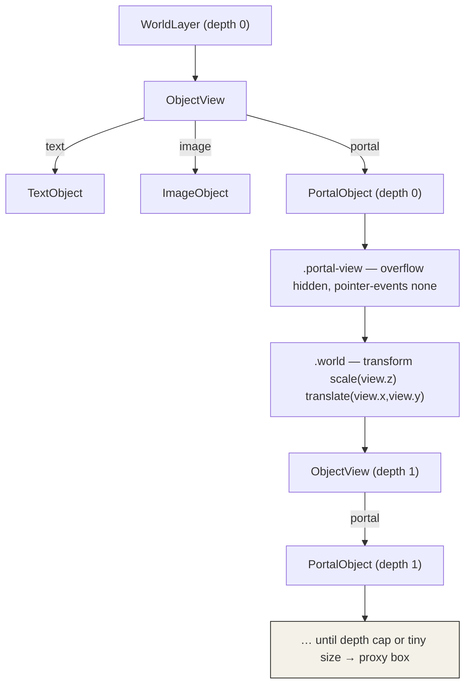

# Recursive Zoomable Portals: Nested Cameras and Look-On Navigation

This note explains how to implement portals in a zoomable user interface: on-surface objects that display a live, navigable, possibly self-referential view of another region of the same surface. It is written from the implementation in `pad-zui`, a Vite/React/Redux clone of the Pad zoomable interface (Perlin & Fox, SIGGRAPH 1993). The goal is to let a reader rebuild the feature from this note alone, including the parts of the design that are not obvious from the code: why a portal needs no content of its own, how recursion terminates, and why navigating a portal reuses the same code that navigates the screen.

The reference implementation lives at `/home/manuel/code/wesen/2026-06-23--wazero-qjs-performance/pad-zui`. The design document it is based on is `ttmp/.../PAD-ZUI-001/design-doc/03-recursive-portals-analysis-design-and-implementation-guide.md`.

> [!summary]
> - A portal is an object carrying its own *look-on* camera `view {x,y,z}`. There is no separate "camera" concept in the model: the screen is the root portal, and navigation is editing a look-on. The root `camera` and a portal's `view` are the same kind of value, so the same functions drive both.
> - Recursion is intrinsic — portals render the global object list, which contains portals. Termination is a depth cap plus an on-screen-size proxy, not cycle detection, because a self-referential portal is a valid result rather than an error.
> - A portal's window (its region on the surface) and its look-on (what it shows) are independent. Drag-creation frames a region at 1:1, so moving the window produces a view of a fixed elsewhere and resizing the window magnifies that region.

## Why this note exists

Zoomable interfaces are usually built as a pannable, zoomable canvas: one transformed layer of objects and a camera. That is enough for panning and zooming, but it is not a zoomable *user interface* in the sense Pad intended. The feature that separates the two is the portal — a view onto the surface that is itself placed on the surface. Once portals exist, overview-plus-detail, transclusion, and peripheral views become possible, and the interface can show the same object in several places at several scales at once.

The implementation is short, but three design decisions carry it, and each is easy to get wrong: representing a portal as a view rather than a container, terminating the recursion correctly, and unifying navigation of portals with navigation of the screen. This note states each decision, shows the code, and records the failure modes encountered while building it.

## The model: addresses, look-ons, and the root portal

The original Pad model is precise, and adopting its vocabulary prevents confusion later. Every visible item has an *address* `A = (x, y, z)`: a location and a scale. A *portal* is an item with a second address, its *look-on* `L`. The portal displays the region of the surface at `L`, drawn at the portal's own location. The screen itself is a portal — the *root portal* — and rendering the screen means rendering the root portal, then recursively rendering any displayed item that is itself a portal.

Two consequences of this model determine the implementation.

The first is that **there is no camera as a separate concept**. The thing usually called a camera is the root portal's look-on. Navigating the screen is changing that look-on. Perlin and Fox state the zoom operation in exactly these terms: incrementing a look-on's `z` doubles the size of the looked-on region, which decreases the magnification of everything seen through it. In `pad-zui` this is the root `camera`, and a portal's `view` is a look-on of the same shape. The implication for code is direct: any function that operates on the root camera operates unchanged on a portal's view.

The second is that **a portal owns no content**. It is a view, not a container. The surface holds one set of objects; a portal renders that same set through its look-on. Editing an object is therefore visible through every portal that shows it, in the same render, with no propagation code. The portal data type has no `children` field, and that absence is the point.

## The coordinate transform

The transform is the foundation, so it must be stated exactly. A world point `P` is mapped to a screen point by a camera `c = (x, y, z)`:

```
screen = (P + (c.x, c.y)) * c.z
```

In the DOM this is applied as a single CSS transform on the layer that holds the objects, with scale before translate:

```ts
// pad-zui/src/lib/coords.ts
export function worldLayerTransform(c: Camera): string {
  return `scale(${c.z}) translate(${c.x}px, ${c.y}px)`
}

export function screenToWorld(p: Point, c: Camera): Point {
  return { x: p.x / c.z - c.x, y: p.y / c.z - c.y }
}
```

A portal nests this transform. Its window is laid out inside the parent world layer, so it is already under the parent transform. Inside the window, a second world layer applies the portal's `view` with the identical formula. Nesting therefore composes by ordinary function composition: a point shown one level deep is transformed first by the portal's `view`, then by the parent camera. The effective magnification of content one level deep is `view.z * camera.z`; two levels deep, `view2.z * view1.z * camera.z`. The composite is never computed by hand — each level wraps its children in one more `scale()/translate()` element and the browser composes the matrices. This is why the rendering code is identical at every depth.

## Data model

A portal is a rectangle on the surface plus a look-on. The look-on has the same shape as the root camera.

```ts
// pad-zui/src/state/types.ts
export interface PortalObject extends BaseObject {
  type: 'portal'
  view: { x: number; y: number; z: number } // the look-on camera
}

export type CanvasObject = TextObject | ImageObject | PortalObject
```

`BaseObject` supplies `x, y, width, height` — the window, in world units. `view` is the look-on. There is no content field. A portal serializes to plain JSON, so persistence required no change: the existing localStorage path stores and restores portals like any other object.

## Rendering: recursion through a single type switch

Portals render portals, so `WorldLayer` and `PortalObject` are mutually recursive. To avoid a module-load cycle, the type switch is extracted into one component, `ObjectView`, that both use. The components reference each other only at render time, so the ES module cycle is harmless.

```ts
// pad-zui/src/components/ObjectView.tsx
export default function ObjectView({ obj, depth = 0 }: { obj: CanvasObject; depth?: number }) {
  switch (obj.type) {
    case 'text':   return <TextObject obj={obj} />
    case 'image':  return <ImageObject obj={obj} />
    case 'portal': return <PortalObject obj={obj} depth={depth} />
  }
}
```

`PortalObject` reads the global object list, applies its `view` to a nested world layer, and renders every object through `ObjectView` at `depth + 1`:

```ts
// pad-zui/src/components/objects/PortalObject.tsx (essential structure)
const objects = useAppSelector(selectAllObjects)
// ...
<div className="obj portal" style={{ left: obj.x, top: obj.y, width: obj.width, height: obj.height }}>
  <div className="portal-view">                                   {/* overflow:hidden; pointer-events:none */}
    <div className="world" style={{ transform: worldLayerTransform(obj.view) }}>
      {objects.map((o) => <ObjectView key={o.id} obj={o} depth={depth + 1} />)}
    </div>
  </div>
  <span className="portal-label">portal</span>
</div>
```

The render tree, with one nested portal, is the following.



Clipping is `overflow: hidden` on the window. The objects inside are not interactive: `.portal-view` is `pointer-events: none`, which is what makes a portal a view rather than an editor and, as shown below, is also what routes drag events to the window.

## Termination: a depth cap and a size proxy

A portal pointed at a region that contains itself renders itself, which renders itself, without limit. This is not a defect to forbid; it is the recursive view the model promises. The implementation draws a few levels and stops. Two independent guards do this.

```ts
const MAX_DEPTH = 3
const MIN_ON_SCREEN_PX = 24

const tooSmall = obj.width * rootZ < MIN_ON_SCREEN_PX
if (depth >= MAX_DEPTH || tooSmall) {
  return <div className="obj portal portal--proxy" style={base} {...drag}><span className="portal-label">portal</span></div>
}
```

The depth cap bounds recursion absolutely. The size proxy bounds it earlier and more cheaply: because magnification multiplies at each level, a nested portal shrinks geometrically, so its on-screen width drops below a few pixels well before the depth cap is reached. At that point there is nothing to see and the subtree is replaced by a static box. Cycle detection is the wrong tool here. A cycle is not an error to break; an integer depth counter is the correct mechanism precisely because the desired behavior is "render N levels, then stop."

## Navigation: editing a look-on

Because a portal's `view` is a look-on with the same shape as the root camera, navigating a portal is editing `view` with the same functions that edit the camera. The implementation reuses `zoomByWheel` and `panCamera` from `coords.ts` and dispatches `updateObject({ id, patch: { view } })`. Four gestures cover window placement and view aiming without ambiguity.

| Gesture | Target | Effect | Function |
|---|---|---|---|
| Scroll over a portal | `view.z` (and `view.x/.y`) | Zoom the look-on toward the cursor | `zoomByWheel(view, local, deltaY)` |
| Alt-drag over a portal | `view.x/.y` | Pan the look-on | `panCamera(view, dx, dy)` |
| Plain drag | `x, y` | Move the window | `useObjectDrag` → `moveBy` |
| Double-click | root `camera` | Fly the screen into the portal's view | `animateCamera(camera, view)` |

Two details make this work. The first is event routing. The root viewport installs a `wheel` listener on an ancestor element with `addEventListener`. A portal installs its own `wheel` listener on the `.portal` box. Both fire during the bubble phase, the descendant first, so the portal handler calls `stopPropagation()` to prevent the root from also zooming. Pointer events reach the `.portal` box because `.portal-view` is `pointer-events: none`; the handler branches on `altKey` to pan the view, and otherwise delegates to the window-move handler.

```ts
// converting a client point into the portal's local coordinate space
function toLocal(clientX: number, clientY: number) {
  const rect = boxRef.current!.getBoundingClientRect()
  const sx = rect.width / objRef.current.width   // on-screen px per local unit
  const sy = rect.height / objRef.current.height
  return { x: (clientX - rect.left) / sx, y: (clientY - rect.top) / sy, sx, sy }
}
```

The second detail is the local coordinate conversion above. Zoom-to-cursor inside a portal needs the cursor expressed in the portal's local units, not in screen pixels, because the portal may be nested and scaled by an arbitrary amount. `getBoundingClientRect()` gives the box's on-screen size; dividing by the box's local size yields the composite scale, which converts the client point into local space. The same `local` point is then passed to `zoomByWheel`, which keeps the world point under the cursor fixed in the portal's view.

The fly-in is a short animation of the root camera toward the portal's view. The offset is interpolated linearly and the zoom in log space, so the motion is even across scales:

```ts
// pad-zui/src/lib/anim.ts
const ratio = to.z / from.z
dispatch(setCamera({
  x: from.x + (to.x - from.x) * k,
  y: from.y + (to.y - from.y) * k,
  z: from.z * Math.pow(ratio, k),   // log-space zoom interpolation
}))
```

## Creation by drag-select: framing a region

Creation makes the window/look-on independence concrete. A tool mode in a `ui` slice arms portal drawing. While armed, dragging on the canvas rubber-bands a screen rectangle; on release the rectangle becomes a portal whose window is the dragged world rectangle and whose look-on frames that exact region at 1:1.

```ts
// pad-zui/src/components/CanvasViewport.tsx — finishMarquee
const a = screenToWorld({ x: m.x0, y: m.y0 }, camera)
const b = screenToWorld({ x: m.x1, y: m.y1 }, camera)
const minX = Math.min(a.x, b.x), minY = Math.min(a.y, b.y)
const width = Math.abs(a.x - b.x), height = Math.abs(a.y - b.y)
const view = { x: -minX, y: -minY, z: 1 }            // region top-left → portal local (0,0), 1:1
const portal = makePortalObject({ x: minX, y: minY }, view, { w: width, h: height })
```

Setting `view = { x: -minX, y: -minY, z: 1 }` maps the region's top-left corner to the portal's local origin at unit scale. The portal therefore opens as a transparent pane over the region it framed. Because the window and the look-on are independent, the two natural manipulations now have distinct, predictable meanings: moving the window leaves the look-on fixed, so the portal continues to show the framed region from a new location; resizing the window enlarges the box while the look-on stays put, which magnifies the region. The same data — `view` — that aims the portal also defines what "magnify" means, with no special case.

## Tricky details and failure modes

Several non-obvious points cost time and are worth recording.

- **`pointer-events: none` is load-bearing, not cosmetic.** It does two jobs at once: it makes the rendered contents of a portal non-interactive, and it lets pointer events fall through to the `.portal` box so the window can be dragged. Removing it breaks window dragging and makes nested text appear editable.

- **`stopPropagation` is required because the root wheel listener is on an ancestor.** The root viewport and the portal both register `wheel` via `addEventListener`. Without `stopPropagation` in the portal handler, scrolling over a portal zooms both the portal's view and the root camera. This is invisible in code review unless the ancestor listener is kept in mind.

- **Local coordinates must come from `getBoundingClientRect`, not from the camera.** A nested portal's on-screen scale is the product of every ancestor scale. Reconstructing that product from state is error-prone; reading the box's measured size is exact and one line.

- **The module cycle is real and is broken by `ObjectView`.** `WorldLayer` renders portals and `PortalObject` renders a world; importing one from the other directly risks an initialization-order error. Routing both through `ObjectView`, which is referenced only at render time, removes the hazard.

- **A portal renders the entire object list at every level.** This is acceptable for small documents and keeps the code simple, but it is the first thing to optimize at scale: cull a portal's children to `getViewport(view, w, h)` with `intersectsViewport`, both of which already exist. The cost multiplies with the number of overlapping portals, not just the object count.

- **Redux Toolkit and TypeScript 6 reject a partial `preloadedState`.** Unrelated to portals but encountered in the same codebase: `configureStore` with a partial `preloadedState` fails to type-check under TS 6.x with `Reducer<S>` not assignable to `Reducer<S, UnknownAction, S | undefined>`. The fix is to omit `preloadedState` and hydrate after store creation with dispatches.

- **jsdom does not implement `innerText`.** Tests that read an editable element's text get `''` from `innerText`. The component reads `innerText` and falls back to `textContent`, which both fixes the tests and is more robust in real browsers.

## Working rules

- Represent a portal as a view with a look-on, never as a container with children. The single global object list is the only source of objects.
- Drive portal navigation with the same coordinate functions that drive the screen. If a navigation operation cannot be expressed as an edit to a look-on, the model has been broken.
- Terminate recursion with a depth cap and a size proxy. Do not detect cycles; self-reference is a valid view.
- Keep `.portal-view` at `pointer-events: none` and route window-drag to the `.portal` box.
- Convert cursor positions to a portal's local space with `getBoundingClientRect`, then reuse the existing zoom-to-cursor function.
- Keep the look-on and the window independent. Creation frames a region at 1:1; moving and resizing then have unambiguous meanings.

## Related notes

- Reference implementation: `/home/manuel/code/wesen/2026-06-23--wazero-qjs-performance/pad-zui` (`src/components/objects/PortalObject.tsx`, `src/components/ObjectView.tsx`, `src/lib/coords.ts`, `src/lib/anim.ts`, `src/components/CanvasViewport.tsx`).
- Design document: `ttmp/.../PAD-ZUI-001/design-doc/03-recursive-portals-analysis-design-and-implementation-guide.md`.
- Primary source: Ken Perlin and David Fox, "Pad: An Alternative Approach to the Computer Interface," SIGGRAPH 1993 — the address/look-on model, the root portal, and look-on navigation.
