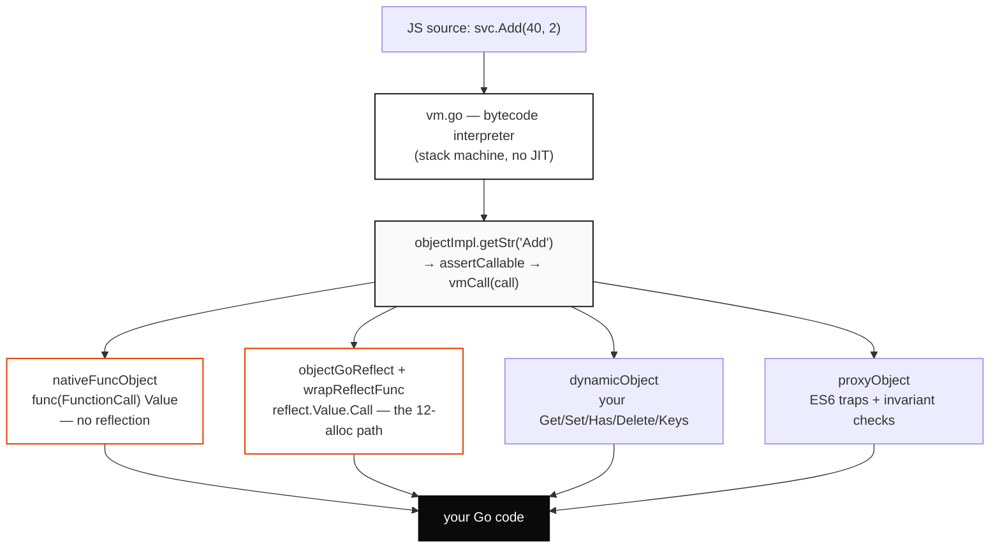

# goja Binding Mechanisms: The Cost of Exposing Go to JavaScript

This article measures and explains every mechanism by which the [goja](https://github.com/dop251/goja) JavaScript runtime exposes Go objects and functions to JavaScript, and it answers a specific engineering question: what does it cost to expose a Go value as an ES6 `Proxy` whose property traps dispatch manually to Go code? The measurements come from a dedicated benchmark suite written against the local goja fork used by the `go-go-goja` host project. The article is written for an engineer who needs to choose a binding mechanism for a hot path and wants the decision grounded in measured numbers rather than intuition.

The benchmark workspace is `/home/manuel/workspaces/2026-06-23/benchmark-goja-proxy-object`. The runnable benchmark is `go-go-goja/perf/goja/phase3_bindings_bench_test.go`. The full docmgr ticket is `2026-06-23-goja-bindings-benchmark`. A self-contained HTML report with the same figures lives at `go-go-goja/ttmp/2026/06/23/2026-06-23-goja-bindings-benchmark--.../various/06-bindings-report.html`.

> [!summary]
> - In the function-call regime, latency is determined by allocation count. Each added allocation costs roughly 60–86 ns, so a reflection-wrapped call (12 allocations) is 3.4× slower than a native callable (3 allocations).
> - A Go-backed ES6 `Proxy` read costs about 192 ns and one extra allocation over the minimum; a `Proxy` call adds no allocations over a native call. For application code that performs real work on the Go side, this overhead is negligible.
> - `DynamicObject` matches the minimum read latency of a plain JavaScript object (about 124 ns, one allocation) while remaining fully Go-controlled. It is the preferred mechanism for Go-backed virtual objects unless an ES6-only trap is required.
> - `B/op` and `allocs/op` are deterministic code-path invariants, identical across every sample. Allocation counts are the reliable signal; nanosecond values corroborate them.

## Why this note exists

The motivating question came from a design choice: a colleague is building lazily-materialized Go data structures (on-demand maps, infinite arrays, dynamic namespaces) exposed to JavaScript as ordinary objects, using a `Proxy` with manual dispatch. The open question was whether the `Proxy` machinery is cheap enough to use as the default object type for this work. A single-read microbenchmark and a precise statement of where the cost lives answer that question and, more usefully, generalize to every other binding choice a goja host has to make.

The article is durable because the binding mechanisms are a fixed property of the goja runtime. The numbers will drift with hardware and goja versions, but the structure — which mechanism allocates how much, and why — does not change.

## The system under measurement

goja is an ECMAScript interpreter written in pure Go. There is no just-in-time compiler. Source text is parsed by `parser/`, compiled to a compact bytecode by `compiler*.go`, and executed by a stack-based interpreter in `vm.go`. Because there is no compilation to native code and no speculative optimization, the cost of moving between Go and JavaScript is paid on every operation. The choice of binding mechanism is therefore the performance decision in a goja host; there is no optimizer that will later erase a poor choice.

The measurements use a local fork of `github.com/dop251/goja`, selected by the workspace `go.work` (`use ./goja`). Every file reference in this article points into that local copy, because that is the engine the benchmark compiles against. The host project is `go-go-goja`, which wires Go-implemented modules into a goja runtime through the `goja_nodejs/require` subsystem.

## The interop model

JavaScript code never touches Go memory directly. This is the central fact that makes "exposing Go to JavaScript" a non-trivial operation, and it determines the cost of every binding mechanism.

A JavaScript value, from Go's perspective, is anything that satisfies the `Value` interface (`goja/value.go`). The interface exposes conversion methods — `ToInteger`, `ToFloat`, `ToString`, `Export` — but no field access and no method invocation. A Go `int` is not a JavaScript value; it must be converted by `vm.ToValue(42)` into an internal `valueInt`. A Go `*MyStruct` is not a JavaScript value either; it must be wrapped in an object that satisfies goja's internal `objectImpl` interface.

When JavaScript evaluates `svc.Add(40, 2)`, the interpreter does not reach into Go. It resolves `svc` to an object and asks that object to do the work. The object implements the methods of `objectImpl`: `getStr` to read a named property, `assertCallable` to expose a function, `vmCall` to invoke it. Different binding mechanisms are different implementations of `objectImpl`, each with its own dispatch path and its own allocation behavior.

The call path, from JavaScript source to the Go function body, passes through a fixed sequence of components:



The VM's call trampoline is `nativeFuncObject.vmCall` (`goja/func.go:558`). It builds a `FunctionCall` record from the operand stack and hands it to the callable:

```go
// Simplified from goja/func.go:558
func (f *nativeFuncObject) vmCall(vm *vm, n int) {
    vm.pushCtx()
    vm.sb = vm.sp - n
    ret := f.f(FunctionCall{
        Arguments: vm.stack[vm.sp-n : vm.sp],
        This:      vm.stack[vm.sp-n-2],
    })
    if ret == nil { ret = _undefined }
    vm.stack[vm.sp-n-2] = ret
    vm.popCtx()
}
```

If `f.f` is a Go closure of type `func(FunctionCall) Value`, the call is complete at this point: the trampoline runs, the closure executes, the result is placed on the stack. There is no reflection and no argument conversion. This is the minimum cost of a call into Go, and every other call mechanism adds work on top of it.

## The binding mechanisms

There are six mechanisms in active use across the call and read paths. Each subsection states what the mechanism is, gives its Go API, names the runtime code path, and gives its measured cost.

### 1. Native function

A native function is a Go closure whose signature is exactly `func(goja.FunctionCall) goja.Value`. When such a value is passed to `vm.Set` or `vm.ToValue`, goja recognizes the signature directly (`goja/runtime.go:1816`) and stores it as a `nativeFuncObject` whose `f` field is the closure. A call runs the trampoline above and nothing more.

```go
add := func(call goja.FunctionCall) goja.Value {
    a := call.Argument(0).ToInteger()
    b := call.Argument(1).ToInteger()
    return vm.ToValue(a + b)   // requires a *Runtime, so capture vm
}
vm.Set("add", add)
```

Measured cost: **220 ns, 3 allocations, 224 B**. This is the minimum measured latency for a call. Use it for primitives that JavaScript calls in tight loops.

### 2. Wrapped arbitrary function (the reflection path)

Any Go function whose signature is not exactly `func(FunctionCall) Value` falls through the `ToValue` type switch to the `reflect.Func` branch (`goja/runtime.go:1956`) and is wrapped by `newWrappedFunc` (`runtime.go:757`). The per-call work is `wrapReflectFunc` (`runtime.go:1973`):

```go
// Simplified from goja/runtime.go:1973
return func(call FunctionCall) Value {
    typ := value.Type()
    in := make([]reflect.Value, nargs)        // allocation per call
    for i, a := range call.Arguments {
        v := reflect.New(typ.In(i)).Elem()    // allocation per argument
        r.toReflectValue(a, v, &objectExportCtx{})
        in[i] = v
    }
    out := value.Call(in)                     // reflect dispatch
    // ... convert each out Value
}
```

Every argument is reflected into its parameter type, the call is dispatched through `reflect.Value.Call`, and each result is converted back. Measured cost: **752 ns, 12 allocations, 352 B** — 3.4× the native minimum, accounted for almost entirely by the nine additional allocations.

### 3. `modules.SetExport`

`SetExport` (`go-go-goja/modules/exports.go:4`) is the host's helper for attaching a Go value to a module's `exports` object. It calls `exports.Set(name, value)`, which takes the same `ToValue` path as mechanism 2. A call through `bench.add(40, 2)` therefore pays the reflection cost plus one property lookup on the exports object. Measured cost: **901 ns (median 918), 12 allocations, 352 B** — the same allocations as mechanism 2, with the additional time attributable to the property resolve. This is the default mechanism for module authoring and is never the bottleneck in application code.

### 4. Reflect struct (fields and methods)

A Go struct pointer passed to `vm.Set` is wrapped by `newObjectGoReflect` (`goja/object_goreflect.go`). Property reads go through `objectGoReflect.getStr` (`:195`), which resolves the name against a field and method index built from reflection. A method call resolves the method, then takes the full reflection argument path of mechanism 2.

```go
type Calc struct{ Field int }
func (c *Calc) Add(a, b int) int { return a + b }
vm.Set("svc", &Calc{Field: 42})
// JS:  svc.Field  -> 42      svc.Add(40, 2) -> 42
```

Measured cost: a field read is **187 ns, 2 allocations, 40 B**; a method call is **2017 ns, 24 allocations, 1168 B**, the most expensive call path, because it stacks a reflective method lookup on top of the reflection argument marshalling.

### 5. Live `map[string]interface{}`

A Go map passed to `vm.Set` is wrapped as `objectGoMapSimple`. The map is a live view: each property read returns the raw `interface{}` stored under the key, which goja then converts with `ToValue` on every access. Measured cost: a read of an integer value is **127 ns, 1 allocation, 32 B**. A call to a function stored in such a map is **1737 ns, 21 allocations, 1088 B**, because the function value is re-wrapped through reflection on every single access. The map does not cache the wrapped function. Storing functions in a live map that JavaScript calls in a loop is the most expensive call path per unit of work and should be replaced by building the object once with `vm.NewObject()`.

### 6. `DynamicObject` and `DynamicArray`

A `DynamicObject` is a Go value implementing a five-method interface (`goja/object_dynamic.go:17`): `Get`, `Set`, `Has`, `Delete`, `Keys`. `vm.NewDynamicObject(handler)` (`object_dynamic.go:99`) wraps it as a first-class object. A property read runs `dynamicObject.getStr` (`object_dynamic.go:193`), which calls `handler.Get(key)` directly. `DynamicArray` is the analogous interface for indexed access (`Len`, `Get`, `Set`, `SetLen`).

```go
type kv struct{ m map[string]goja.Value }
func (k *kv) Get(s string) goja.Value         { return k.m[s] }
func (k *kv) Set(s string, v goja.Value) bool { k.m[s] = v; return true }
func (k *kv) Has(s string) bool               { _, ok := k.m[s]; return ok }
func (k *kv) Delete(s string) bool            { delete(k.m, s); return true }
func (k *kv) Keys() []string                  { out := make([]string, 0, len(k.m)); for s := range k.m { out = append(out, s) }; return out }
vm.Set("obj", vm.NewDynamicObject(&kv{m: map[string]goja.Value{"v": vm.ToValue(42)}}))
```

Measured cost: a read is **124 ns, 1 allocation, 32 B** — equal, within measurement noise, to a reused plain JavaScript object. An indexed array read is **168 ns, 2 allocations, 96 B**. This is the preferred mechanism for a Go-controlled object that JavaScript reads often.

### 7. ES6 Proxy with native traps

The ES6 `Proxy` is exposed to Go through `ProxyTrapConfig` (`goja/builtin_proxy.go:256`), a struct of optional callbacks, one per trap. `vm.NewProxy(target, config)` (`builtin_proxy.go:351`) creates the proxy. A property read dispatches through `proxyObject.getStr` (`goja/proxy.go:601`), which calls the `Get` trap and then performs an invariant check against the proxy target.

```go
v42 := vm.ToValue(42)
target := vm.NewObject()
vm.Set("obj", vm.NewProxy(target, &goja.ProxyTrapConfig{
    Get: func(_ *goja.Object, prop string, _ goja.Value) goja.Value {
        if prop == "v" { return v42 }     // manual dispatch
        return goja.Undefined()
    },
    Has: func(_ *goja.Object, prop string) bool { return prop == "v" },
}))
```

The dispatch path in `proxy.go` is:

```go
// Simplified from goja/proxy.go:601
func (p *proxyObject) getStr(name unistring.String, receiver Value) Value {
    target := p.target
    if v, ok := p.checkHandler().getStr(target, name, receiver); ok {  // -> Get trap
        p.proxyGetChecks(target.self.getOwnPropStr(name), v, name)     // invariant check
        return v
    }
    return target.self.getStr(name, receiver)
}
```

The `proxyGetChecks` call re-inspects the target's own property to enforce the ECMAScript proxy invariants (a non-configurable, non-writable property on the target must agree with the trap's return value). This second inspection is the source of the additional allocation in the read path. Measured cost: a read is **192 ns, 2 allocations, 48 B**; a call through the `Apply` trap is **277 ns, 3 allocations, 224 B** — identical allocation signature to a native call.

## Method

The benchmark holds every variable constant except the binding mechanism. Each configuration exposes a Go value to a fresh goja runtime, compiles a one-expression JavaScript program once, then runs that program repeatedly. Every program performs the same logical work — evaluate `add(40, 2)` or read `obj.v` — and every program yields `42`, which the harness verifies. Compilation and runtime construction sit outside the timed loop, so the only quantity being measured is the Go↔JavaScript operation itself.

Each configuration is sampled five times (`-count=5`) at one second of iterations each (`-benchtime=1s`). The figures report the mean of those samples and their spread.

There is one property of the measurement that determines how the results should be read. Go's benchmark allocator reports allocations per operation, and that count is deterministic: it is a property of the executed code path, not a noisy measurement. Across all five samples, for every configuration, the allocation count is identical. Nanoseconds vary run to run; allocation counts do not. The allocation count is the reliable signal, and the nanosecond values corroborate it.

```bash
go test ./perf/goja -run '^$' \
  -bench 'BindingFunctionCall|BindingPropertyGet|BindingArrayIndexGet|ProxyDispatchDetail' \
  -benchtime=1s -count=5 -benchmem | tee raw.txt
benchstat raw.txt
```

## Function calls: an allocation-bound regime

A call into Go has two possible shapes, decided when the value is passed to `vm.Set`. If the Go value has the exact native signature, goja stores it verbatim and the trampoline invokes it with no translation. Any other function type falls through to the reflection wrapper, which reflects each argument, allocates a `[]reflect.Value`, dispatches through `reflect.Call`, and converts each result.

The difference between these two shapes is the entire result of this section. The native call costs 220 ns and 3 allocations. The reflection-wrapped call costs 752 ns and 12 allocations. The allocation ratio is 4; the time ratio is 3.4. The allocation ratio is the exact integer because it is a code-path invariant.

![[goja-bindings-fig1-call-cost.png]]

The four intermediate mechanisms are ordered by their allocation count, and that count explains their position almost completely.

| Mechanism | ns/call | allocs | marginal ns/alloc |
|---|---:|---:|---:|
| Wrapped func (reflect, 2 args) | 752 | 12 | 59 |
| Map of funcs (func re-wrapped every access) | 1737 | 21 | 84 |
| Reflect struct method (method lookup + reflect) | 2017 | 24 | 86 |

*Marginal cost is computed against the native minimum (3 allocs, 220 ns): Δns / Δallocs.*

The marginal cost of one allocation is not constant. It rises from 59 ns for a plain wrapped function to roughly 85 ns once the path also performs a reflective method lookup or re-wraps a function on every access. An allocation has a baseline cost, and the reflection work surrounding the allocation adds more. The reflect-struct-method path is the most expensive not only because it allocates the most bytes but because it performs two full reflection traversals: resolve the method, then marshal its arguments.

## The single relationship that explains the call regime

When all sixteen configurations are plotted together, they reduce to one relationship. Latency increases with allocation count along a near-linear trend, and the trend's slope is approximately 86 ns per allocation. This slope is the unifying constant of the call regime.

![[goja-bindings-fig2-allocs-vs-latency.png]]

Two regimes are visible at once. The function calls increase along the trend line as their allocation count rises. The property reads remain at low latency regardless of whether they allocate once or twice, because their dominant cost is the fixed overhead of a property dispatch, not the allocation it may or may not perform.

This chart is the reason the results support confident claims from five-sample runs. Individual nanosecond measurements vary, but the allocation count fixes each point at a precise horizontal position, and the latency then falls on a line whose slope is stable. A mechanism that forces more allocations costs more, and the slope predicts by how much before the measurement is taken.

## Property reads: a fixed-overhead regime

Reading a property is cheaper than calling a function, and the ranking of mechanisms is different. The minimum read latency is a group of one-allocation readers at approximately 123 ns: a reused plain JavaScript object, a live Go map, and a `DynamicObject`. They are statistically indistinguishable from one another. A fully Go-controlled object can read as fast as a plain JavaScript object.

![[goja-bindings-fig3-read-latency.png]]

The two-allocation readers — reflect struct field, `DynamicArray`, and the `Proxy` — all pay one additional allocation over the minimum and land at 1.4–1.6× its latency. This is consistent with the call regime: one allocation is worth approximately 60–86 ns, and the read delta is 123 → 192 ns, which is approximately 69 ns for one allocation. The two regimes agree.

For reads, prefer `DynamicObject` over `Proxy`. Both give Go full control over what JavaScript sees, but `DynamicObject` reaches the one-allocation minimum at 124 ns through a five-method interface, while the `Proxy` pays a second allocation at 192 ns to enforce the ES6 invariants against its target. Reserve the `Proxy` for cases that require an ES6-only trap — `construct`, `ownKeys`, `set` interception, `defineProperty` — that the dynamic interface cannot express.

## The Proxy, dissected

The motivating question concerns the `Proxy`, so its cost separates into three components: the `Proxy` machinery (the runtime's invariant checking), the dispatch logic written inside the trap, and the measurement noise of the `Proxy` path itself.

The benchmark held the machinery fixed and varied only the body of the `Get` trap. A `switch` that hits, a `map` that hits, and a miss that returns `undefined` are the three sensible ways to write a manual-dispatch trap. All three allocate identically: 2 allocations, 48 B.

![[goja-bindings-fig4-proxy-dispatch.png]]

| Trap body | mean ns | CV | allocs | note |
|---|---:|---:|---:|---|
| switch — hit | 158 | 3.7% | 2 | fastest and most stable |
| map — hit | 199 | 21.7% | 2 | bimodal: 173 or 275 |
| miss → undefined | 218 | 28.8% | 2 | continues onto the prototype chain |

The result is the opposite of a naive expectation: a hit is faster than a miss. When the trap returns a value, the lookup terminates. When it returns `undefined`, goja is obligated to continue the property lookup onto the proxy target's prototype chain before yielding `undefined`. An early return on a hit is both clearer to read and faster to execute.

The measurement noise is itself a finding. The non-`Proxy` measurements in this article have coefficients of variation under 5% — the native function is 1.5%, the wrapped function 0.8%. The `Proxy` property read is 18.2%, and the miss is 28.8%. The `Proxy` path is intrinsically more variable. The cause is its invariant-checking machinery: `proxyObject.getStr` re-inspects the target's own property on every access, a data-dependent branch whose timing depends on the target's property layout. Decisions about the `Proxy` should use the median, and a single `Proxy` sample should not be trusted.

The call path tells a different story. Fronting a callable target with a `Proxy` and invoking it through the `Apply` trap costs 277 ns with 3 allocations — the same allocation signature as a native call, and only approximately 57 ns more for one additional Go-callback invocation. A design that calls a `Proxy` rather than reading it does not pay the `Proxy`'s read overhead.

## Results

All measurements, consolidated. Hardware: 11th-generation Intel i7-1165G7. Engine: the local goja fork. Toolchain: go1.26.4. Five samples at 1 s each.

| Benchmark | mean ns | allocs | B | CV |
|---|---:|---:|---:|---:|
| **Function calls** `add(40,2)` | | | | |
| Native func | 220 | 3 | 224 | 1.5% |
| Proxy (Apply) | 277 | 3 | 224 | 1.7% |
| Wrapped func | 752 | 12 | 352 | 0.8% |
| SetExport | 901 | 12 | 352 | 12.2% |
| Map of funcs | 1737 | 21 | 1088 | 2.3% |
| Reflect method | 2017 | 24 | 1168 | 1.6% |
| **Property reads** `obj.v` | | | | |
| Plain object (reused) | 118 | 1 | 32 | 8.4% |
| DynamicObject | 124 | 1 | 32 | 3.4% |
| Go map | 127 | 1 | 32 | 2.3% |
| DynamicArray (`arr[i]`) | 168 | 2 | 96 | 4.6% |
| Reflect field | 187 | 2 | 40 | 3.4% |
| Proxy (Get) | 192 | 2 | 48 | 18.2% |

## Decision guidance

The choice of mechanism follows from two questions: does JavaScript call the value or read it, and how often.

- **A primitive called in a tight loop** should be a native function (`func(FunctionCall) Value`). This is the only mechanism that reaches the 220 ns minimum.
- **A function called at application frequency** should be an ordinary typed Go function set through `vm.Set` or `SetExport`. The reflection cost is invisible next to any real work.
- **A Go-backed virtual object that JavaScript reads often** should be a `DynamicObject`. It matches the plain-object read latency while remaining fully Go-controlled.
- **A `Proxy` is justified only when an ES6 trap beyond `Get`/`Has` is required** — construction, key enumeration, `set` interception, property definition. For read-heavy virtual objects, `DynamicObject` is faster and simpler.
- **A live `map[string]interface{}` is appropriate for plain data only.** A function stored in such a map is re-wrapped through reflection on every access; build the object once with `vm.NewObject()` if JavaScript calls its members.

## Threats to validity

The results rest on allocation counts and on ratios between mechanisms measured under identical conditions, both of which are insulated from the following limitations.

- **No JIT, one goroutine.** goja interprets bytecode and a runtime is not safe for concurrent use. These are single-threaded, interpreted numbers.
- **Wall-clock on a shared machine.** The nanoseconds were measured on an interactive laptop. Absolute latency should be read as ±10–20%; ratios and allocation counts are robust.
- **Five samples.** Enough to expose the `Proxy`'s instability, too few for tight confidence intervals. The deterministic allocation counts compensate.
- **Single-key reads only.** Each read fetches one property. Enumeration (`Object.keys`, `for…in`, `JSON.stringify`) is a multi-trap cascade for a `Proxy` and is not measured here. It is the obvious next experiment, and it is likely the regime where the `Proxy` overhead is largest.
- **One payload.** Every call returns a small integer. Larger or nested return values add conversion cost orthogonal to the binding choice.

## Reproducibility

The benchmark is `go-go-goja/perf/goja/phase3_bindings_bench_test.go`. From the `go-go-goja` module root:

```bash
go test ./perf/goja -run '^$' \
  -bench 'BindingFunctionCall|BindingPropertyGet|BindingArrayIndexGet|ProxyDispatchDetail' \
  -benchtime=1s -count=5 -benchmem | tee raw.txt
benchstat raw.txt
```

The ticket also ships a reproducer (`scripts/02-run-bindings-bench.sh`), a statistics parser (`scripts/03-parse-bench-stats.py`), the chart generator (`scripts/04-goja-charts.py`), the report template (`scripts/05-goja-report-template.html`), the report driver (`scripts/06-make-report.py`), and the figure renderer (`scripts/07-render-figures.py`). The figures embedded in this note were produced by that pipeline and copied into `Attachments/`.

## Working rules

- Treat `allocs/op` as the primary signal and `ns/op` as corroboration. Allocation counts are deterministic; nanoseconds are not.
- In the call regime, estimate a mechanism's cost from its allocation count at roughly 60–86 ns per allocation above the 3-allocation native minimum.
- For a Go-backed object that JavaScript reads, default to `DynamicObject`. Reach for `Proxy` only when an ES6-only trap is required.
- Never store functions in a live `map[string]interface{}` that JavaScript calls repeatedly.
- Measure the `Proxy` with the median, never a single sample, because its invariant-checking path is intrinsically noisy.

## Related notes

- [[ARTICLE - Lazy Data Structures over goja Proxy - Go-Backed On-Demand JavaScript Objects]] — the design that motivated these measurements, and the natural next question (enumeration cost).
- [[PROJ - Goja WASM Web REPL - A JavaScript Sandbox in the Browser]] — another goja integration, in the browser.
