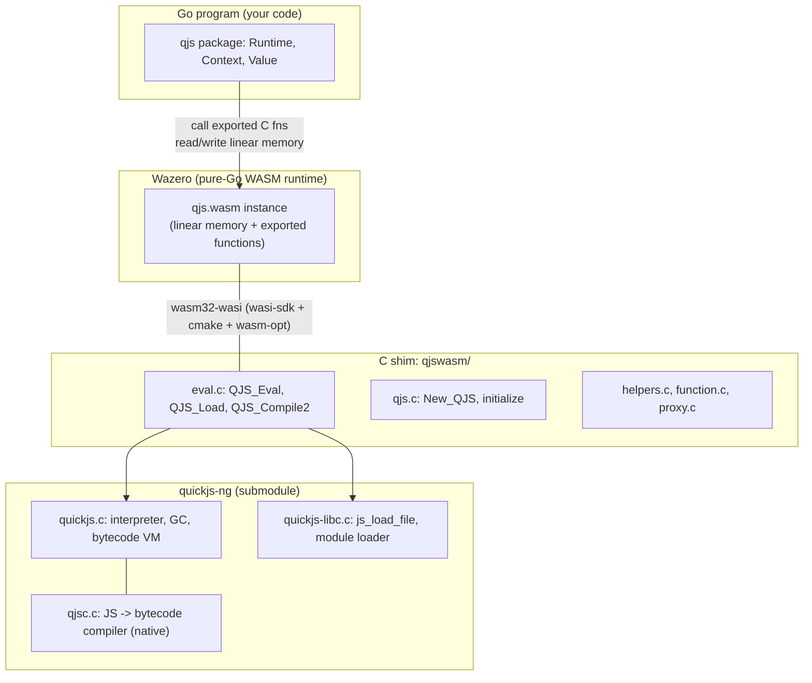
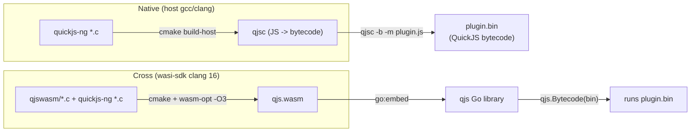
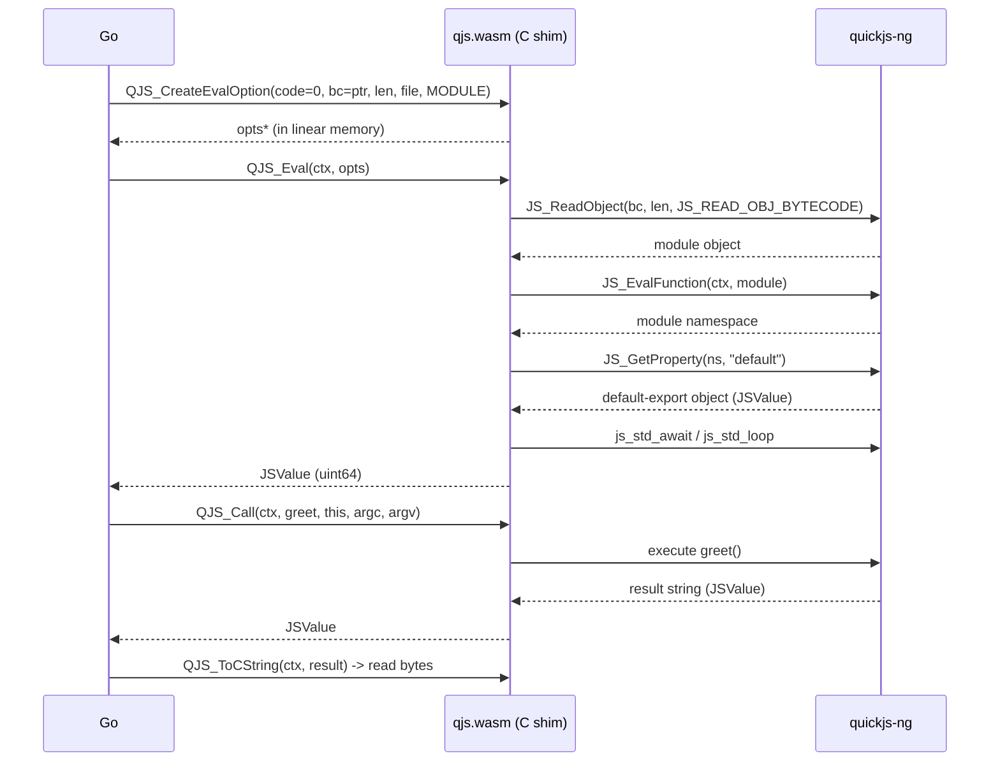

# fastschema/qjs on Wazero: From-Source Build and the qjsc Plugin Pipeline

This project report explains how `github.com/fastschema/qjs` is built and extended on a Linux host, and how a JavaScript module is compiled ahead of time with `qjsc` and then loaded as bytecode inside the resulting Go runtime. The goal is to make the entire stack legible to an engineer who has not touched it before: which layer does what, why each build step exists, where the C-to-Go contract lives, and which details will quietly break a faithful rebuild. By the end the reader should be able to reproduce the build, run a compiled plugin, and reason about the one behavioral regression that a from-source rebuild introduces.

The project lives at `/home/manuel/code/wesen/2026-06-23--wazero-qjs-performance`. The upstream library is checked out as a git submodule under `qjs/`, and all working artifacts (the rebuilt WebAssembly module, the compiled plugin, the Go loader, the diagnostic probe) live in `work/`. The library's own ticket workspace, with a full design document and diary, lives under `ttmp/`.

> [!summary]
> - `fastschema/qjs` is not a JavaScript engine written in Go. It is a WebAssembly host. The real engine, QuickJS-NG (C), is cross-compiled to a single `wasm32-wasi` module and executed by Wazero, a pure-Go WebAssembly runtime. Go calls exported C functions across the WASM boundary.
> - There are two independent compilation stages: building the engine module `qjs.wasm` (needs `wasi-sdk` + `cmake` + `wasm-opt`), and building the native compiler `qjsc` (needs only a host C compiler). A plugin is compiled by `qjsc` to QuickJS bytecode and loaded in Go with `qjs.Bytecode`.
> - A faithful rebuild with `wasi-sdk-20` links only after adding a `main` stub, because `qjs.c` defines `initialize()` and not `main`. The rebuilt module runs plugins correctly but regresses file-based module loading, because `wasi-sdk-20`'s `wasi-libc` does not lazily initialize WASI preopens the way the shipped artifact's older `wasi-libc` does. Bytecode loading is unaffected.

## Why this project exists

Embedding a JavaScript engine in a Go program is a recurring need: configuration evaluation, rule engines, plugin systems, user-supplied scripting. The two common approaches each have a structural cost. Writing the engine in Go (as `goja` does) duplicates the entire ECMAScript specification and perpetually lags it. Binding a C engine through CGO (as `modernc-quickjs` transpiles, or a direct cgo binding does) reintroduces a foreign function interface, with its build complexity, its memory-unsafety boundary, and its cross-compilation friction.

`fastschema/qjs` takes a third path. It takes the existing QuickJS-NG engine, compiles it to WebAssembly, and runs that module with Wazero. The engine stays the real, upstream C implementation, so ECMAScript correctness is inherited rather than reimplemented. The host stays pure Go, so there is no CGO and the build remains a single Go toolchain. The cost is moved to a different place: a WebAssembly boundary now sits between Go and the engine, and every value that crosses it must be marshaled through linear memory. The project exists to make that tradeoff concrete and runnable, and to provide the Go-facing API that hides the marshaling behind ordinary method calls.

The specific trigger for this project was a performance comparison. The repository directory is dated and named `wazero-qjs-performance`, and the library's own benchmarks position it against `goja` and `modernc-quickjs`. Building it from source on the host, and exercising the bytecode-loading path, is the prerequisite for any honest measurement.

## Current project status

The build is reproducible and the plugin pipeline runs end to end.

What exists:

- a from-source build of `qjs.wasm` under `wasi-sdk-20` (clang 16) with `binaryen` 120 optimization, stored at `work/qjs.wasm` (1,031,183 bytes).
- a native `qjsc` host compiler built from the quickjs-ng submodule (`qjs/qjswasm/quickjs/build-host/qjsc`, QuickJS-NG Compiler v0.10.1).
- a compiled plugin: `work/plugin.js` compiled with `qjsc -b -m` to `work/plugin.bin` (475 bytes of QuickJS bytecode).
- a Go loader (`work/loader`) that runs the bytecode plugin against either the shipped module or the from-source rebuild.
- a diagnostic probe (`work/fscheck`) that isolates the file-loading regression.
- the library's own test suite passing on the shipped module: `go test ./...` green in 5.5 seconds.

What is unresolved:

- the rebuilt module regresses file-based module loading relative to the shipped artifact (see the implementation details).
- the exact `wasi-sdk` version that produced the shipped `qjs.wasm` is not identified; the repository documents `wasi-sdk-20`, but the shipped artifact's behavior does not match a `wasi-sdk-20` build.

## The system under study

Four execution layers are nested. From the inside out, they are the engine, the C shim, the WebAssembly module and its Go host, and the Go API. Each layer has a distinct responsibility and a distinct boundary.



The engine layer is QuickJS-NG, checked out as a git submodule at `qjs/qjswasm/quickjs/` (commit `d01ca44`). Its core is `quickjs.c`: the interpreter, the garbage collector, and the bytecode virtual machine. `quickjs-libc.c` provides the parts of a C standard library that the engine needs to load files and resolve modules: `js_load_file`, the default module loader `js_module_loader`, and `js_std_await` for draining promises. `qjsc.c` is the standalone compiler that turns JavaScript source into QuickJS bytecode; it is built as a native host binary, not as part of the WebAssembly module.

The C shim layer, in `qjs/qjswasm/`, wraps the engine into a flat C application binary interface that Wazero can call. `qjs.c` owns runtime lifecycle: `New_QJS` creates a `JSRuntime` and `JSContext`, applies memory and stack limits, registers the module loader, and initializes the proxy-value class. `eval.c` owns evaluation: `QJS_Eval`, `QJS_Load`, and `QJS_Compile2`, plus the internal `load_buf` that dispatches between file input, in-memory source, and precompiled bytecode. `qjswasm.cmake` is the build glue that declares which sources compile into the module and, critically, which functions the module exports.

The host layer is Wazero. The Go side embeds the compiled module with `//go:embed qjs.wasm` in `qjs/runtime.go`, instantiates it under a Wazero runtime, provides the `wasi_snapshot_preview1` imports the module needs, and mounts a host directory as the module's filesystem root. Go calls into the module by looking up an exported function by name and invoking it with `uint64` arguments; it reads results back out of the module's linear memory.

The API layer is the `qjs` package itself: `Runtime`, `Context`, `Value`, and the functional options in `options.go`. These types present ordinary Go method calls — `ctx.Eval`, `value.GetPropertyStr`, `value.InvokeJS` — and hide the pointer arithmetic and memory management that the calls expand to underneath.

## The C-to-Go contract

The single most important file for understanding how the two sides communicate is `qjs/qjswasm/qjswasm.cmake`. It contains a long block of `target_link_options` entries, each one `--export=<symbol>`. That list is the contract. Every C function that Go intends to call must appear there, because WebAssembly only exposes functions to the host if they are explicitly exported. The list includes lifecycle functions (`New_QJS`, `New_QJSContext`, `QJS_Free`, `QJS_GetContext`), evaluation functions (`QJS_Eval`, `QJS_Load`, `QJS_Compile2`, `QJS_CreateEvalOption`), value-construction and introspection functions (`QJS_NewString`, `QJS_NewInt32`, `QJS_IsPromise`, `QJS_GetOwnPropertyNames`), and the memory primitives `malloc` and `free`.

If Go calls a function that is not on this list, the lookup returns nothing and the call fails. If a new C function is added to the shim but not exported, it exists in the binary but is invisible to the host. This is the first place to look when a Go call cannot find its target.

The argument and return convention is uniform and worth stating plainly. Every exported function takes and returns 64-bit integers. A Go string becomes a pointer: Go calls `malloc` to allocate bytes in the module's linear memory, writes the string bytes (plus a null terminator where the C side expects one), and passes the pointer. A JavaScript value, `JSValue`, is a tagged 64-bit quantity in QuickJS; it crosses the boundary as a `uint64` that Go wraps in a `Value`. Some functions return a packed pointer-and-length: the high 32 bits are an address in linear memory and the low 32 bits are a length, and `qjs/mem.go` provides `PackPtr` and `UnpackPtr` to assemble and disassemble them.

Ownership is the rule that breaks systems when it is violated. Memory allocated with `malloc` must be freed with `free`. A `JSValue` returned by C is reference-counted; the Go side must call `JS_FreeValue` on it when it is done, or the engine leaks memory inside the module. The `qjs` package enforces this with `defer value.Free()` and a `Handle` type that owns a pointer. Forgetting a `Free` leaks linear memory; freeing twice corrupts the engine's allocator.

## The two compilation stages

The build pipeline has two stages that share a source tree but use different compilers and produce different artifacts. Conflating them is the most common source of confusion.



The first stage builds `qjsc` as a native binary. It uses the host C compiler and the host C library, because `qjsc` is a developer tool that runs on the build machine to produce bytecode. It does not run inside the WebAssembly module. The second stage builds `qjs.wasm` as a cross-compiled `wasm32-wasi` module. It uses the WebAssembly System Interface SDK (`wasi-sdk`), which provides a clang configured to target `wasm32-wasi` together with a WASI-compatible C library. The two stages never share a build directory.

The bytecode that `qjsc` produces is portable between the two stages only because both stages compile the same QuickJS-NG source. `qjsc` writes bytecode in QuickJS's serialized format; the engine inside `qjs.wasm` reads it back with `JS_ReadObject`. The format carries a version, and a mismatch between the compiler and the engine would surface as a `JS_ReadObject` exception. Pinning the quickjs-ng submodule to one commit on both sides is what makes the plugin loadable.

## Building qjsc and compiling a plugin

`qjsc` is configured with CMake and built with a single `make` target. The build is fast because it only needs the engine's static library and the compiler itself.

```bash
cmake -S qjs/qjswasm/quickjs -B qjs/qjswasm/quickjs/build-host \
  -DCMAKE_BUILD_TYPE=Release -DQJS_BUILD_LIBC=ON
make -C qjs/qjswasm/quickjs/build-host qjsc -j"$(nproc)"
```

The compiler accepts a small set of flags, documented in its help text at `qjsc.c`. The three that matter for this pipeline are `-b`, `-e`, and `-m`. The `-b` flag selects raw bytecode output, which is the format `qjs.Bytecode` consumes. The `-e` flag selects a C source file with the bytecode embedded as a `uint8_t` array and a `main` function, suitable for static linking into a native binary. The `-m` flag compiles the input as an ECMAScript module rather than a classic script, which is required whenever the source uses `export` or `import`.

The plugin source is deliberately small and free of side effects, so that it can run inside a sandboxed runtime that exposes no network and only a controlled filesystem.

```javascript
// work/plugin.js
function fib(n) { return n <= 1 ? n : fib(n - 1) + fib(n - 2); }
export default {
  greet(name) { return `Hello, ${name}! From a qjsc-compiled QuickJS plugin.`; },
  fib,
  meta: { engine: "quickjs-ng", compiledBy: "qjsc -b -m", version: 1 },
};
```

Compiling it produces a 475-byte file whose first bytes are the QuickJS bytecode header.

```bash
qjsc -b -m -o work/plugin.bin work/plugin.js
qjsc -e -m -o work/plugin.c  work/plugin.js   # C variant, for reference
```

```
$ xxd work/plugin.bin | head -1
00000000: 150b 011c 776f 726b 2f70 6c75 6769 6e2e  ....work/plugin.
```

The bytes `15 0b 01 1c` are the header. The `0x15` is the bytecode tag that marks the start of a serialized object, and the following bytes encode the version and the embedded filename. The plugin's `export default { ... }` is important for the loading step: when the engine loads a module, the Go API returns the default export, so the object that `greet` and `fib` hang off of is what the caller receives.

## Building qjs.wasm from source

The module build is where the project's build assumptions stop being implicit. The repository's `Makefile` defines a `build` target that configures CMake with the `wasi-sdk` toolchain file and the project's own `qjswasm.cmake` include, then builds the `qjswasm` target and runs `wasm-opt -O3`. Running it as written, against a fresh `wasi-sdk-20`, does not link. The failure is precise.

```
wasm-ld: error: .../libc.a(__main_void.o): undefined symbol: main
clang-16: error: linker command failed with exit code 1
```

The error names the symbol that is missing, and the symbol is informative. `qjs/qjswasm/qjs.c` defines a function called `initialize`, which creates a global `QJSRuntime`, but it defines no function called `main`. The WebAssembly module is a library, not a program with an entry point, yet `wasi-sdk-20` is linking it as a command module. A WASI command module's C runtime, `crt1-command`, provides `_start`, and `_start` calls `main`. With no `main` defined, the link fails.

The question is why the shipped `qjs.wasm` does not have this problem. Inspecting the shipped artifact's exports answers it. The shipped module exports `_start` and `initialize`, and it exports neither `main` nor the reactor entry `_initialize`. That export set is the signature of a command module built with a `wasi-sdk` old enough that `main` was optional. In those older toolchains, `crt1-command`'s `_start` called `__main_void`, a weak symbol that defaulted to a no-op when no `main` was defined. In `wasi-sdk-20`, that indirection was removed and `main` became a hard reference. The shipped artifact predates the change.

Two ways exist to make a WebAssembly module that has no program entry point. The first is the reactor model, selected with `-mexec-model=reactor`, which links `crt1-reactor` and exports `_initialize` instead of `_start`. The second is to keep the command model and define `main`. The reactor model is the structurally cleaner answer for a library, and it links without complaint. It is also the wrong choice here, for two reasons.

The first reason is that the reactor model changes the export set, and the export set is a contract. The shipped module exports `_start`; a reactor build exports `_initialize`. Any host logic that enumerates or relies on the start symbol sees a different module. Matching the shipped artifact's export shape is the conservative choice, because it minimizes the behavioral surface that differs between the shipped and the rebuilt module.

The second reason is that the reactor model does not, by itself, fix the one behavioral difference that a rebuild introduces. That difference is the subject of the next section, and resolving it is not simply a matter of running the reactor init. Choosing the reactor model would therefore diverge from the shipped shape without buying the correctness it might seem to promise.

The chosen fix is a command-model build with a `main` stub. The stub is two lines.

```c
// work/main_stub.c
int main(void) { return 0; }
```

To add it without modifying the upstream submodule, a CMake wrapper includes the upstream `qjswasm.cmake` and then adds the stub as a source of the `qjswasm` target.

```cmake
# work/build-qjs.cmake
include(${CMAKE_CURRENT_LIST_DIR}/../qjs/qjswasm/qjswasm.cmake)
target_sources(qjswasm PRIVATE ${CMAKE_CURRENT_LIST_DIR}/main_stub.c)
```

The build command passes the wrapper as `CMAKE_PROJECT_INCLUDE`, points the toolchain at `wasi-sdk`, and sets `WASI_SDK_PREFIX` so the toolchain file resolves its compiler path correctly.

```bash
cmake -S qjs/qjswasm/quickjs -B qjs/qjswasm/quickjs/build \
  -DQJS_BUILD_LIBC=ON -DQJS_BUILD_CLI_WITH_MIMALLOC=OFF \
  -DWASI_SDK_PREFIX=$HOME/opt/wasi-sdk \
  -DCMAKE_TOOLCHAIN_FILE=$HOME/opt/wasi-sdk/share/cmake/wasi-sdk.cmake \
  -DCMAKE_PROJECT_INCLUDE=$PWD/work/build-qjs.cmake
make -C qjs/qjswasm/quickjs/build qjswasm -j"$(nproc)"
cp  qjs/qjswasm/quickjs/build/qjswasm work/qjs.wasm
wasm-opt -O3 work/qjs.wasm -o work/qjs.wasm
```

The `WASI_SDK_PREFIX` variable deserves emphasis. The `wasi-sdk` toolchain file constructs its compiler path from `${WASI_SDK_PREFIX}/bin/clang`. If the variable is unset, the path collapses to `/bin/clang`, which on most systems is the host compiler rather than the WebAssembly one. CMake still detects a C compiler, reports a clang version, and proceeds, but the build is no longer targeting WASI correctly and the ABI detection step fails in confusing ways. Setting `WASI_SDK_PREFIX` is not optional.

The rebuilt module exports `_start` and `initialize`, matching the shipped artifact's shape. Every function the Go side calls is present: `New_QJS`, `QJS_Eval`, `QJS_Compile2`, `QJS_Load`, `malloc`, `free`, and the rest of the export list. The module runs the plugin correctly. It does not, however, behave identically to the shipped module in every respect.

## Loading bytecode in Go

The plugin-loading path is where the four layers cooperate, and it is the path that the from-source rebuild handles correctly. The Go side reads the bytecode file, wraps it in a `qjs.Bytecode` option, and evaluates it as a module. The returned `Value` is the module's default export, because `eval.c`'s `qjs_eval_module` reads the module namespace, fetches the `default` property, and returns it when it is defined.

```go
rt, _ := qjs.New()                       // instantiate qjs.wasm under Wazero
defer rt.Close()
ctx := rt.Context()

bytecode, _ := os.ReadFile("plugin.bin")
plugin, _ := ctx.Eval("plugin.bin",
    qjs.Bytecode(bytecode), qjs.TypeModule())   // -> the default-export object
defer plugin.Free()

name := ctx.NewString("Intern"); defer name.Free()
g, _ := plugin.InvokeJS("greet", name); defer g.Free()
fmt.Println(g.String())                            // Hello, Intern! ...
```

Tracing the same call down to the engine shows how the layers translate it. The Go `Eval` builds a `QJSEvalOptions` struct in the module's linear memory by calling `QJS_CreateEvalOption`, passing the bytecode pointer, its length, the filename pointer, and the eval flags. It then calls `QJS_Eval`, which routes a module evaluation through `qjs_eval_module` and `QJS_Load` into `load_buf`.



`load_buf` is the dispatch point. It inspects the `QJSEvalOptions` to decide where the input comes from. When `bytecode_buf` is set, it calls `JS_ReadObject` with the `JS_READ_OBJ_BYTECODE` flag to rehydrate the serialized module, then `JS_EvalFunction` to run the module's initialization. When only source is present, it calls `JS_Eval` directly. When a filename is given and no buffer is present, it calls `js_load_file` to read the file from the module's filesystem. The last branch is the one that the from-source rebuild gets wrong.

Running the loader against the rebuilt module produces the expected output.

```
$ QJS_WASM=work/qjs.wasm go run ./work/loader work/plugin.bin
[loader] using WASM rebuild: work/qjs.wasm (1031183 bytes)
[loader] plugin bytecode: 475 bytes (magic  15  b)
[plugin.greet] Hello, Intern! From a qjsc-compiled QuickJS plugin.
[plugin.fib(10)] 55
[plugin.meta.engine] quickjs-ng
[plugin.meta.compiledBy] qjsc -b -m
[loader] OK: qjsc-compiled plugin loaded and executed
```

The loader accepts a `QJS_WASM` environment variable that points the runtime at a specific module through `qjs.Option{QuickJSWasmBytes}`. Without it, the runtime uses the module embedded in the library, which is the shipped artifact. This indirection is what lets the same loader demonstrate the plugin running on the from-source rebuild without replacing the in-tree module.

## The WASI preopen regression

The library's own test suite passes on the shipped module. On the rebuilt module, one test fails. The test loads a module from a file and then imports it through a relative path, and the import fails with a reference error.

```
ReferenceError: could not load module filename 'testdata/04_load/02_load_module_file.js'
```

The error string originates in `quickjs-libc.c`, in the default module loader, when `js_load_file` cannot open the path. The path is relative. Resolving a relative path under WASI is not a matter of a current working directory in the POSIX sense; it is a matter of the preopen table.

A WASI host exposes directories to a module as preopens. Each preopen is a file descriptor, conventionally starting at descriptor 3, that names a host directory. The module's C library, `wasi-libc`, builds an internal table of these preopens at startup by querying `fd_prestat_get` and `fd_prestat_dir_name` for each descriptor. When user code calls `open` with a relative path, `wasi-libc` resolves the path against a virtual current directory, then searches the preopen table for the descriptor that covers the resulting absolute path, and issues `path_open` against that descriptor. If the preopen table is empty or does not cover the path, the open fails.

Wazero provides the preopens from the host side. The Go runtime mounts a directory at `/` with `WithDirMount(option.CWD, "/")`, and Wazero answers `fd_prestat_get` queries for the resulting descriptor. The question is whether the module's `wasi-libc` has populated its internal table so that it knows to look there.

The behavior diverges between the two `wasi-libc` generations. The shipped artifact, built with an older `wasi-sdk`, lazily discovers preopens on the first file operation: even if no initialization function ran, the first `open` triggers the table population. The rebuilt module, built with `wasi-sdk-20`, does not lazily populate the table; it relies on the table being built during library initialization, which runs as part of the C runtime startup sequence.

Whether that startup sequence runs at all is the second half of the problem. Wazero calls a module's start functions at instantiation time, and the set of functions it tries is configurable. The `qjs` library calls `WithStartFunctions(option.StartFunctionName)`, and `option.StartFunctionName` defaults to the empty string. Wazero's instantiation loop, in `runtime.go`, iterates the configured names, looks up each as an exported function, and calls the first one it finds. An empty string is not an exported function, so the lookup returns nothing and the loop continues. The result is that Wazero calls no start function for either the shipped or the rebuilt module. Neither module's `_start` runs.

This is the point at which the two `wasi-libc` generations produce different outcomes from the same host behavior. The shipped module's older `wasi-libc` populates the preopen table lazily, on demand, so the absence of a start call does not matter; the first relative-path import triggers the population and succeeds. The rebuilt module's `wasi-sdk-20` `wasi-libc` does not populate lazily, so the absence of a start call means the table stays empty, and the relative-path import fails.

A diagnostic probe confirms the diagnosis and rules out the obvious fix. The probe, `work/fscheck`, imports a relative-path module under four configurations.

| Module build | Start function called | Relative import |
|---|---|---|
| shipped (older `wasi-sdk`) | none (default) | succeeds |
| rebuilt, reactor model | none (default) | fails |
| rebuilt, reactor model | `_initialize` | fails |
| rebuilt, command model | none (default) | fails |

The third row is the one that disproves the simple theory. The reactor model exports `_initialize`, and configuring Wazero to call it does run the reactor initialization, which includes the C library constructors. Calling `_initialize` does not restore file loading. The preopen population in `wasi-sdk-20`'s `wasi-libc` is not triggered by the constructor path alone in this configuration, or Wazero's interaction with it differs from a native WASI host's. The exact mechanism would require archaeology in the `wasi-libc` source; the experiment is sufficient to show that the regression is not solved by switching to the reactor model and invoking its init.

The regression is isolated to file-based module loading. The bytecode path never touches the filesystem, because `load_buf` takes the `bytecode_buf` branch and calls `JS_ReadObject` directly. The from-source rebuild is therefore correct and complete for the task this project set out to accomplish: build the engine, compile a plugin, and load it. It is incomplete for the broader case of loading modules from files, and that limitation is recorded rather than papered over.

The conservative resolution, recorded as a project decision, is to keep the shipped `qjs.wasm` in the library tree so the test suite stays green, and to keep the from-source rebuild at `work/qjs.wasm` as the artifact this project produced. The loader selects between them explicitly. This separates the tested, shipped module from the rebuilt, demonstrated one, and avoids silently regressing the library.

## Current commands

A single script reproduces the entire pipeline end to end. It installs the toolchain into `~/opt` if it is missing, initializes the submodule, builds `qjsc`, compiles the plugin, builds `qjs.wasm`, and runs the loader.

```bash
# Reproduce the whole build (no sudo required)
bash ttmp/2026/06/23/QJS-PERF--*/scripts/01-build-qjs-wasm-and-plugin.sh

# Run the plugin on the rebuilt module
cd work/loader && go mod tidy
QJS_WASM=$PWD/../qjs.wasm go run . $PWD/../plugin.bin

# Run the plugin on the shipped module (default)
cd work/loader && go run . $PWD/../plugin.bin

# Run the library's test suite (shipped module)
cd qjs && go test ./... -count=1 -timeout 300s

# Inspect a module's exports
wasm-opt --print qjs/qjs.wasm | grep '(export "'
```

## Important project docs

The library repository carries a full ticket workspace under `ttmp/`. The two documents that complement this report are the design document and the implementation diary. The design document is the intern-facing reference: the four-layer architecture, the C and Go API tables with file and line references, the build pipeline, the decision records, and the risk register. The diary is the chronological record of the build, including the verbatim link errors and the sequence of experiments that isolated the preopen regression.

- Design document: `ttmp/2026/06/23/QJS-PERF--*/design-doc/01-qjs-wazero-architecture-and-plugin-build-guide.md`
- Implementation diary: `ttmp/2026/06/23/QJS-PERF--*/reference/01-diary.md`
- Reproducible build script: `ttmp/2026/06/23/QJS-PERF--*/scripts/01-build-qjs-wasm-and-plugin.sh`
- Plugin source and artifacts: `work/plugin.js`, `work/plugin.bin`, `work/plugin.c`
- From-source module: `work/qjs.wasm`
- Go loader and probe: `work/loader/`, `work/fscheck/`

A bundle of the design document and diary was uploaded to reMarkable at `/ai/2026/06/23/QJS-PERF`.

## Open questions

- Which `wasi-sdk` version produced the shipped `qjs.wasm`? The repository documents `wasi-sdk-20`, but the shipped artifact's lazy preopen behavior does not match a `wasi-sdk-20` build. Identifying the version would let a rebuild match the shipped behavior exactly.
- Can a reactor-model build, combined with an explicit preopen refresh call or a different Wazero configuration, restore file-based module loading cleanly? Calling `_initialize` alone does not.
- Should the `qjs` library default `StartFunctionName` to a real start symbol so that library initialization runs deterministically, rather than relying on the `wasi-libc` generation to initialize lazily?

## Near-term next steps

- Add a Go test in `work/loader` that asserts `greet("Intern")` and `fib(10) == 55` on both the shipped and the rebuilt module, to lock the bytecode contract and catch version skew early.
- Add a bytecode-version sanity check before loading, reading the header bytes and asserting the version, so that an engine-compiler mismatch fails fast rather than surfacing as an opaque `JS_ReadObject` exception.
- File an upstream issue noting that `make build` fails on `wasi-sdk-20` without a `main` stub, and that the shipped artifact does not appear to have been built with `wasi-sdk-20`.
- Investigate the `wasi-libc` preopen initialization path in `wasi-sdk-20` to determine whether a runtime call exists that populates the table on demand, which would let the rebuilt module load files without changing the build.

## Project working rule

When the engine and the compiler come from the same source commit, bytecode is a load-time input and not a build artifact. Compile plugins with `qjsc -b` and load them with `qjs.Bytecode`, so that adding or updating a plugin does not require recompiling Go. When a from-source rebuild of the engine diverges from the shipped artifact, keep both and select between them explicitly, rather than replacing the tested module with an uncharacterized one.

## Related notes

- [[ARTICLE - QuickJS Wasm on WAMR - Running a JS Engine Inside a Wasm Sandbox]] — the same QuickJS-to-Wasm pattern under the WebAssembly Micro Runtime instead of Wazero, with a different host boundary and a different set of build gaps.
- [[ARTICLE - QuickJS Wasm on ESP32-P4 - Device Bring-Up and Two WAMR Embedding Crashes]] — the embedded target counterpart, including the stack-overflow check failure that the WAMR note isolates.
- [[wasm-from-go]] — the foundational distinction between Go compiled to Wasm (`GOOS=js GOARCH=wasm`) and a Go program that hosts a Wasm module, which is the distinction this project sits on.
- [[goja-embedding-in-go]] — the alternative of implementing the engine in Go, which this project explicitly avoids.
