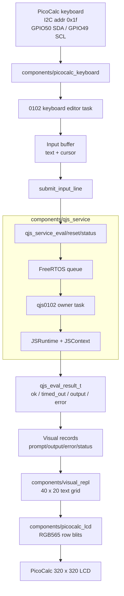

# ESP32-P4 Visual QuickJS REPL: From Engine Bring-Up to PicoCalc Interface

This report explains the current ESP32-P4 PicoCalc QuickJS work as one technical arc: first running QuickJS as WebAssembly under WAMR, then removing the Wasm layer and running upstream QuickJS natively, and finally turning the native engine into a visual LCD-backed REPL on the PicoCalc. The current firmware target, `0102-esp32-p4-visual-quickjs-repl`, boots the LCD, keyboard, and native QuickJS service together. It has a 40×20 text-cell renderer, a PicoCalc keyboard editor, hardware diagnostics, a validated black/red/orange/yellow/white palette, and a Phase 5 implementation that compiles and connects submitted keyboard input to `qjs_service_eval()`.

The important engineering result is that the JavaScript engine is no longer the risky part of the system. The native QuickJS service was already validated in `0101-esp32-p4-native-quickjs`, including eval, timeout, reset, status, and output capture. The remaining work has shifted toward user-interface correctness: LCD pixel format, row rendering, keyboard-controller power state, input editing, scrollback, and the contract between visual records and QuickJS results.

> [!summary]
> - The project established two QuickJS execution paths on ESP32-P4: `0100` proved QuickJS-as-Wasm under WAMR; `0101` proved full upstream QuickJS compiled natively into ESP-IDF with a single-owner service task.
> - The visual REPL target, `0102`, reuses the native QuickJS service and extracts the earlier PicoCalc LCD/keyboard work into reusable components.
> - The display path is now validated beyond simple fills: the renderer uses a fixed 40×20 grid, 8×16 cells, host-order RGB565 values, and LCD-component byte packing for both fill and blit paths.
> - The keyboard path works after a full PicoCalc power-cycle and has diagnostics that distinguish ESP32-side I2C recovery from a non-ACKing keyboard controller.
> - Phase 5 has begun: submitted visual input now calls `qjs_service_eval()`, renders output/error/status records, and supports `/help`, `/status`, and `/reset`; the build passes, but hardware eval smoke is the next validation step.

## Why this note exists

The individual tickets already record detailed implementation diaries. The WAMR ticket explains how QuickJS was compiled to WebAssembly and embedded in ESP-IDF. The native ticket explains why the Wasm layer was removed and how the `qjs_service` owner task was implemented. The visual REPL ticket explains how PicoCalc hardware and native QuickJS are being combined. This note preserves the larger design sequence for a future reader who needs to understand why the current architecture looks the way it does.

The current repository is:

```text
/home/manuel/workspaces/2025-12-21/echo-base-documentation/esp32-s3-m5
```

The main project directories are:

| Path | Role |
|---|---|
| `0100-esp32-p4-quickjs-wasm/` | QuickJS compiled to WebAssembly and executed by WAMR in ESP-IDF. |
| `0101-esp32-p4-native-quickjs/` | Native upstream QuickJS compiled into ESP-IDF with UART console commands. |
| `0102-esp32-p4-visual-quickjs-repl/` | Visual PicoCalc LCD/keyboard REPL firmware currently in progress. |
| `0099-esp32-p4-picocalc-display-keyboard/` | Prior PicoCalc LCD/keyboard bring-up that supplied the hardware baseline. |
| `components/quickjs_native/` | Vendored upstream QuickJS engine source set for native ESP-IDF builds. |
| `components/qjs_service/` | Single-owner QuickJS service used by `0101` and `0102`. |
| `components/picocalc_lcd/` | Reusable PicoCalc LCD SPI/RGB565 primitives extracted from `0099`. |
| `components/picocalc_keyboard/` | Reusable PicoCalc keyboard I2C primitives and diagnostics extracted from `0099`. |
| `components/visual_repl/` | Fixed-cell visual terminal model and renderer for `0102`. |

The active docmgr ticket is:

```text
ttmp/2026/06/24/ESP32-P4-VISUAL-QUICKJS-REPL--visual-quickjs-repl-on-the-esp32-p4-picocalc-lcd/
```

It contains the design guide, task list, changelog, and investigation diary for the visual REPL work.

## The three-stage execution path

The project did not start with a visual REPL. It started with the question of whether QuickJS could run on the ESP32-P4 at all, and it deliberately tested that through more than one execution model.

### Stage 1: QuickJS inside WebAssembly inside WAMR

The first path compiled QuickJS to a WASI-style WebAssembly module and loaded that module with WAMR inside ESP-IDF firmware. The firmware target was `0100-esp32-p4-quickjs-wasm`. It exported a small C ABI from the Wasm module, including initialization and eval functions, and the ESP32 host called those functions through WAMR.

The path looked like this:

```text
ESP console command
  -> firmware host API
  -> WAMR runtime
  -> quickjs.wasm
  -> upstream QuickJS C engine compiled to wasm32
  -> user JavaScript
```

This stage proved that the board could execute QuickJS through a sandboxed Wasm guest. It also exposed two embedding rules that mattered on real hardware.

First, WAMR mutates the module buffer during load. ESP-IDF `EMBED_FILES` data lives in read-only flash, so loading the embedded `quickjs.wasm` directly caused a fault. The fix was to copy the embedded Wasm blob into writable PSRAM before calling `wasm_runtime_load()`.

Second, WAMR thread environment ownership mattered. Calling WAMR from arbitrary ESP-IDF tasks triggered a `pthread_self` assertion. The fix was to create a long-lived pthread owner and route every `wasm_runtime_call_wasm()` through that owner. This decision foreshadowed the later native design: even when the engine changes, runtime ownership still needs to be explicit.

### Stage 2: native QuickJS under ESP-IDF

The second path removed WAMR. The firmware target `0101-esp32-p4-native-quickjs` compiles upstream QuickJS directly into the ESP-IDF application. The reusable components are `components/quickjs_native` and `components/qjs_service`.

The path became:

```text
ESP console command
  -> qjs_service API
  -> FreeRTOS owner task
  -> native QuickJS C engine
  -> user JavaScript
```

This stage made the firmware simpler and faster. The earlier WAMR path remained valuable because it established a baseline and forced the project to handle engine ownership carefully. The native path then removed guest linear memory, WAMR import/export plumbing, the embedded Wasm blob, and the WAMR thread-environment rule.

The native service kept one key invariant: `JSRuntime*` and `JSContext*` are owned by one task. Console commands do not call `JS_Eval` directly. They call `qjs_service_eval()`, `qjs_service_reset()`, or `qjs_service_get_status()`. The owner task executes the work and returns structured results.

The public API expresses that boundary:

```c
typedef struct qjs_service qjs_service_t;

typedef struct {
  bool ok;
  bool timed_out;
  uint32_t elapsed_ms;
  char* output;
  char* error;
} qjs_eval_result_t;

esp_err_t qjs_service_eval(qjs_service_t* s,
                           const char* code,
                           size_t len,
                           uint32_t timeout_ms,
                           const char* filename,
                           qjs_eval_result_t* out);

esp_err_t qjs_service_reset(qjs_service_t* s, uint32_t timeout_ms);
esp_err_t qjs_service_get_status(qjs_service_t* s,
                                 qjs_service_status_t* out,
                                 uint32_t timeout_ms);
```

This is the API now reused by the visual REPL.

### Stage 3: PicoCalc visual REPL

The third path is the active firmware target, `0102-esp32-p4-visual-quickjs-repl`. It keeps native QuickJS behind `qjs_service` and adds the PicoCalc device interface: LCD rendering and keyboard input.

The path now looks like this:

```text
PicoCalc keyboard
  -> keyboard I2C component
  -> visual input editor
  -> qjs_service_eval()
  -> QuickJS owner task
  -> output/error/status records
  -> visual_repl renderer
  -> PicoCalc LCD SPI blit
```

The important difference from `0101` is not the JavaScript engine. It is the user-interface model. `0101` can rely on a host serial terminal for input editing, scrollback, copy/paste, and display. `0102` must implement enough of those responsibilities on the device itself.

## Current visual REPL architecture

The visual REPL separates hardware access, JavaScript execution, and UI rendering. This separation is not an aesthetic preference. It is what keeps each subsystem testable while the hardware is still being validated.



The resulting responsibility table is compact:

| Component | Responsibility | Must not do |
|---|---|---|
| `picocalc_keyboard` | Own I2C bus/device access, poll FIFO events, expose diagnostics. | Know about JavaScript or screen layout. |
| `picocalc_lcd` | Own SPI panel operations, fills, rects, row/rect blits, RGB565 byte packing. | Know about text rows or QuickJS. |
| `visual_repl` | Own fixed-cell text model, styles, current input row, row rendering. | Call `JS_Eval` or manipulate I2C/SPI registers directly. |
| `qjs_service` | Own QuickJS runtime/context, eval/reset/status, timeouts, output capture. | Know about the PicoCalc screen or keyboard. |
| `0102 app_main.cpp` | Compose the components, provide UART diagnostics, bridge Enter submission to eval. | Bypass the service boundaries. |

This boundary is why the current Phase 5 change is small. The keyboard editor already has a submitted line. The QuickJS service already has `qjs_service_eval()`. The visual renderer already has `visual_repl_append_line()`. The bridge copies the input line, appends the prompt record, evaluates the source, and converts result fields into styled records.

The current bridge logic has this shape:

```cpp
void submit_input_line() {
    source = copy_current_input();
    append_prompt_record("> " + source);
    clear_input_model_without_render();
    evaluate_visual_input(source);
    visual_repl_render();
}

void evaluate_visual_input(const char *source) {
    if (source == "/reset") {
        qjs_service_reset(g_qjs, 2000);
        append_status_or_error();
        return;
    }

    if (source == "/status") {
        qjs_service_get_status(g_qjs, &status, 1000);
        append_status_lines(status, heap_state);
        return;
    }

    qjs_eval_result_t result = {};
    qjs_service_eval(g_qjs, source, strlen(source), 1000, "<lcd-repl>", &result);
    append_status("OK=... TIMEOUT=... ...MS");
    append_text_lines(OUTPUT, result.output);
    append_text_lines(ERROR, result.error);
    qjs_eval_result_free(&result);
}
```

The code currently builds. The next step is hardware validation, not more architecture work.

## LCD rendering: the fixed-cell contract

The PicoCalc LCD is 320×320 pixels. The current visual REPL uses 8×16 cells, which gives exactly 40 columns and 20 rows. The first 19 rows are scrollback/output; the last row is the input prompt. This geometry is intentionally simple because it makes the renderer deterministic during bring-up.

```text
320 px / 8 px  = 40 columns
320 px / 16 px = 20 rows
```

The renderer stores styled history rows and a separate input buffer. A full render draws the visible history rows and then draws the input row. An input-only render redraws only the final row, which keeps keyboard editing responsive.

The row renderer produces RGB565 pixels into a row buffer and calls the LCD component:

```c
esp_err_t picocalc_lcd_blit_row(uint16_t y,
                                uint16_t h,
                                const uint16_t *pixels,
                                size_t pixel_count);
```

Several hardware details were found only by looking at the LCD, not by reading logs.

### Font geometry

The first font attempt used 5×7 glyphs scaled 2× horizontally inside 8-pixel cells. That cannot fit: a 5-pixel-wide glyph scaled by 2 becomes 10 pixels wide. The symptom was clipped characters. The fix was to keep horizontal scale at 1 and vertical scale at 2, centering a 5×14 glyph inside each 8×16 cell.

This was not a cosmetic detail. The fixed-cell renderer depends on each logical cell owning a bounded pixel region. If glyphs overrun cells, cursor rendering, input editing, and row clearing become visually ambiguous.

### String termination

The row renderer also had to stop reading after the first `\0`. Fixed-width row rendering can easily keep reading stale bytes if a shorter string replaces a longer one. The fix was to zero-fill row buffers and treat all cells after the first terminator as spaces. This changed the renderer from "draw bytes from a fixed buffer" to "draw a C string into a fixed-width row," which matches how the rest of the UI thinks about records.

### Palette and byte order

The final requested visual style is a minimal Swiss terminal palette:

| Record type | Foreground | Background |
|---|---|---|
| System | white | black |
| Prompt | yellow | black |
| Input | white | black |
| Output | white | black |
| Error | red | black |
| Status | orange | black |

The display first needed color diagnostics. The firmware added:

```text
lcd rect <x> <y> <w> <h> <color>
lcd swatches
```

The `lcd swatches` command verified that simple fill rectangles showed the intended colors. That did not prove the renderer path. The visual REPL uses `picocalc_lcd_blit_row()`, and that path originally sent raw `uint16_t` memory to the LCD. On ESP32-P4, `uint16_t` values are little-endian in memory. The LCD expects RGB565 pixel bytes in panel order: high byte then low byte. A host-order RGB565 red value `0xf800` is stored as `00 f8` in memory, but the panel expects `f8 00`.

The fill path already packed bytes correctly. The blit path did not. The fix was to define the LCD component contract precisely:

> Callers pass host-order RGB565 values. The LCD component packs each value into panel-order bytes before SPI transmission.

That rule now applies to both fills and blits. The user confirmed that colors looked correct after the blit fix.

## Keyboard input: the bus can fail below firmware logic

The PicoCalc keyboard is an I2C device at address `0x1f`. It exposes a status register and a FIFO register. The current firmware polls the FIFO and maps key events into editor actions: printable characters, Enter, Backspace, Delete, Left, Right, Home, End, and Escape.

The line editor was implemented before it was fully validated on physical hardware. It supports insertion at the cursor, backspace, delete, cursor movement, Home/End, Escape-to-clear, and Enter-to-submit. The final Phase 4 smoke sequence was:

```text
Esc
abc
Left
X
Enter
```

The expected edited line was:

```text
abXc
```

The user confirmed that this physical input sequence worked. The ticket task list still needs to be updated to mark T4.6 complete, but the hardware evidence from the operator closes the functional question: the editor path is active on the device.

The more important keyboard lesson was power state. During bring-up, the ESP32-P4 firmware could recreate its I2C master bus and device handle, but the keyboard controller did not ACK. The diagnostics made this visible:

```text
kbd probe addr=0x1f: ESP_ERR_NOT_FOUND
kbd scan: (0 found)
```

After a full PicoCalc power-cycle, the same firmware saw the keyboard again:

```text
kbd probe addr=0x1f: ESP_OK
kbd scan: 0x1f (1 found)
```

This means that repeated ESP32-only flashes/resets can leave the external keyboard controller in a state where software recovery on the ESP32 side is not enough. The current firmware keeps the diagnostic commands because they provide a clean distinction:

| Observation | Meaning | Next action |
|---|---|---|
| `kbd probe` returns `ESP_OK` | Keyboard controller ACKs; debug event parsing/editor logic. | Continue firmware validation. |
| `kbd scan` finds `0x1f` but no events | Bus is present; wait for physical keypress or inspect FIFO/status behavior. | Continue input smoke. |
| `kbd scan` finds zero devices | The keyboard controller is not ACKing. | Ask for full PicoCalc/keyboard-controller power-cycle. |
| `picocalc_keyboard_recover()` returns `ESP_OK` but probe still fails | ESP32-side I2C objects were recreated, but the slave still does not respond. | Stop retrying; power-cycle the external controller. |

The reusable keyboard component now serializes I2C access with a FreeRTOS mutex, exposes `picocalc_keyboard_recover()`, exposes `picocalc_keyboard_probe_address()`, and reports recovery count plus last error. That is the right boundary because UART commands and the background keyboard task share the same physical bus.

## QuickJS integration: current Phase 5 state

The active Phase 5 tasks are:

| Task | Status | Notes |
|---|---|---|
| T5.1 Submit input to `qjs_service_eval()` | Implemented in code, build passed | Needs hardware flash/smoke. |
| T5.2 Render output records | Implemented in code, build passed | Splits output into 40-column visual rows. |
| T5.3 Render error records | Implemented in code, build passed | Exceptions/service errors/timeouts render as error/status rows. |
| T5.4 Add visual reset path | Implemented as `/reset`, build passed | Needs on-device reset-global validation. |
| T5.5 Add visual status path | Implemented as `/status`, build passed | Reports QuickJS status and heap lines. |
| T5.6 Hardware eval smoke | Not done yet | Next device step. |
| T5.7 Diary/changelog/commit | Not done yet | Should happen after hardware evidence. |

The current uncommitted firmware change in `0102-esp32-p4-visual-quickjs-repl/main/app_main.cpp` adds:

- `append_visual_text()` to split captured output/error text into display rows.
- `append_visual_status()` to append QuickJS/heap status lines.
- `evaluate_visual_input()` to handle `/help`, `/status`, `/reset`, and ordinary JavaScript eval.
- a new `submit_input_line()` path that copies the input, appends the prompt record, clears the input model, evaluates the source, and renders the screen.

The build command passed:

```bash
source /home/manuel/esp/esp-idf-5.4.2/export.sh
cd 0102-esp32-p4-visual-quickjs-repl
idf.py build
```

The resulting binary size was:

```text
0102-esp32-p4-visual-quickjs-repl.bin binary size 0xdbaa0 bytes.
Smallest app partition is 0x400000 bytes.
0x324560 bytes (79%) free.
```

That means the next step is not more static analysis. The next step is a hardware smoke test with one owner of `/dev/ttyACM0`.

The smoke sequence should be:

```text
/help
/status
print(1+2)
throw new Error("boom")
var x = 41; x + 1
/status
/reset
try { print(x) } catch (e) { print("reset ok") }
```

The expected visual behavior is:

| Input | Expected LCD result |
|---|---|
| `/help` | Orange/status command help lines. |
| `/status` | Orange/status QuickJS ready/eval/heap lines. |
| `print(1+2)` | Status line with `OK=1`, then output line `3`. |
| `throw new Error("boom")` | Red error/status line and exception text. |
| `var x = 41; x + 1` | Status line. Depending on current output-capture behavior, expression value may not print unless wrapped in `print(...)`. |
| `/reset` | Status line showing reset result. |
| `try { print(x) } catch ...` | Output proving the previous global was cleared. |

The distinction between expression values and printed output is important. The firmware captures `print()` output and exceptions. A bare expression may evaluate successfully without producing a visible line unless the service formats the completion value. That is acceptable for the current REPL milestone if documented, but the future UI may want to display non-`undefined` completion values.

## Parallel JavaScript development

A separate worktree was created so a colleague can develop portable QuickJS scripts without conflicting with firmware edits:

```text
/home/manuel/workspaces/2025-12-21/echo-base-documentation/esp32-s3-m5-js
```

The branch is:

```text
feature/0102-js-scripts
```

The committed setup is:

```text
188611b 0102 js: add portable QuickJS playbook
```

It adds:

```text
0102-esp32-p4-visual-quickjs-repl/js/README.md
0102-esp32-p4-visual-quickjs-repl/js/host-shim.js
0102-esp32-p4-visual-quickjs-repl/js/examples/smoke.js
0102-esp32-p4-visual-quickjs-repl/js/tests/run-smoke.sh
```

The development contract is deliberately small:

```text
Available: print(...args), millis(), gc()
Avoid: console.log, require, import, fs, path, process, Buffer, std, os, window, document, fetch
```

This contract matches the firmware direction. JavaScript examples that pass under desktop `qjs` with the host shim should later run through the device service with minimal changes. This allows script-side examples, demos, and self-tests to progress while the firmware branch continues LCD and keyboard validation.

## What the current implementation teaches

The most important technical lesson is that embedded JavaScript on this board is not one problem. It is a set of boundaries that each need an explicit contract.

### Runtime ownership must be explicit

Both WAMR and native QuickJS required an owner. WAMR required a long-lived pthread owner because of its thread-environment rules. Native QuickJS requires a service owner task because `JSRuntime*` and `JSContext*` are mutable engine state. The current `qjs_service` is the stable solution: all UI and console callers submit work through a queue, and one task touches the context.

### Pixel format must be defined at the component boundary

The display bugs were not caused by JavaScript or UI logic. They were caused by two LCD paths using different byte-order assumptions. The fix was to define a component-level contract: caller values are host-order RGB565; `picocalc_lcd` is responsible for panel-order SPI bytes. This rule should remain documented because future drawing APIs will otherwise repeat the same error.

### A visible UI needs a model, not only draw calls

The visual REPL stores history rows, styles, input text, and cursor position. That model is what makes input-row repaint, prompt records, error rows, and later scrollback possible. Directly drawing pixels from key handlers would have been faster to write at first, but it would make scrollback and redraw correctness harder.

### Hardware diagnostics are part of the product during bring-up

The `kbd probe`, `kbd scan`, `kbd recover`, `lcd swatches`, and `screen demo` commands are not incidental. They shorten the path from symptom to cause. The keyboard work showed why: `ESP_ERR_INVALID_STATE` was vague, but `kbd scan: (0 found)` proved that the keyboard controller was not ACKing. That changed the next action from firmware retry to physical power-cycle.

### Build success is not hardware success

The current Phase 5 integration compiles. That is useful evidence, but it does not prove that LCD output is readable, that keyboard submission remains stable under eval, that timeout/error rows render correctly, or that `/reset` clears globals on the real device. The next checkpoint must be a hardware smoke with monitor logs and visual confirmation.

## Near-term next steps

The immediate next step is to finish Phase 5 on the device.

1. Preserve serial single ownership for `/dev/ttyACM0` and stop stale monitors before flashing.
2. Flash the current `0102` Phase 5 build.
3. Open one monitor session, preferably in tmux as already used for this project.
4. Confirm boot logs show LCD init, keyboard init, and QuickJS service ready.
5. On the PicoCalc keyboard, run `/help`, `/status`, `print(1+2)`, an exception, and `/reset`.
6. Capture monitor logs and record whether the LCD output matches the expected styled records.
7. If the keyboard disappears again, run `kbd probe` and `kbd scan`; if `0x1f` is absent, request a full PicoCalc power-cycle rather than repeating ESP32-only recovery.
8. Update the ticket: mark T4.6 complete, mark T5.1 through T5.5 complete if hardware confirms them, record T5.6 evidence, update the diary/changelog, run `docmgr doctor`, and commit the firmware/docs checkpoint.

After Phase 5, Phase 6 should add real scrollback behavior. The current `visual_repl` stores bounded history rows, but the task list still calls for logical records, wrapping, viewport offset, PageUp/PageDown navigation, and auto-scroll policy. That is the point where the REPL becomes more than a single-page display.

## Review map

A reviewer should start with these files:

| File | What to review |
|---|---|
| `0102-esp32-p4-visual-quickjs-repl/main/app_main.cpp` | System composition, UART diagnostics, keyboard editor, Phase 5 eval bridge. |
| `components/visual_repl/include/visual_repl.h` | Public visual model and renderer API. |
| `components/visual_repl/visual_repl.cpp` | 40×20 model, style palette, glyph rendering, input row rendering. |
| `components/picocalc_lcd/picocalc_lcd.c` | SPI panel init, RGB565 fill/blit byte packing, row blit contract. |
| `components/picocalc_keyboard/picocalc_keyboard.c` | I2C initialization, polling, mutex, recovery, probe/scan diagnostics. |
| `components/qjs_service/include/qjs_service.h` | Native QuickJS owner-task API. |
| `components/qjs_service/qjs_service.cpp` | Runtime lifecycle, eval queue, output capture, deadlines, reset/status. |
| `ttmp/2026/06/24/ESP32-P4-VISUAL-QUICKJS-REPL--.../tasks.md` | Current phase status and remaining work. |
| `ttmp/2026/06/24/ESP32-P4-VISUAL-QUICKJS-REPL--.../reference/01-investigation-diary.md` | Chronological implementation evidence and failures. |

The current firmware should be reviewed as an integration checkpoint. The individual components are intentionally small, but the runtime behavior depends on their interaction: keyboard event timing, synchronous eval duration, LCD redraw timing, and heap pressure all meet in `0102`.

## Related notes

- [[ARTICLE - Native QuickJS on ESP32-P4 - Removing Wasm from the Firmware Stack]]
- [[ARTICLE - QuickJS Wasm on ESP32-P4 - Device Bring-Up and Two WAMR Embedding Crashes]]
- [[ARTICLE - QuickJS Wasm on WAMR - Running a JS Engine Inside a Wasm Sandbox]]
