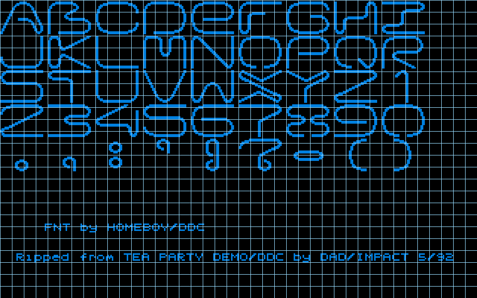
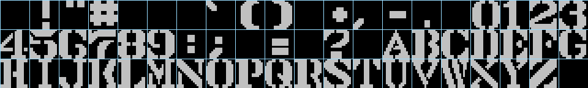
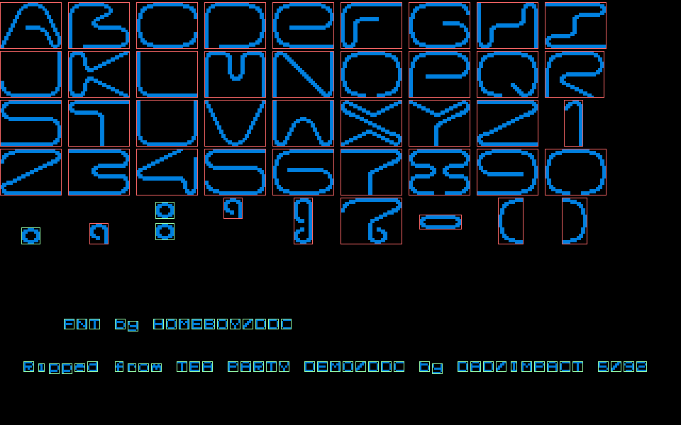
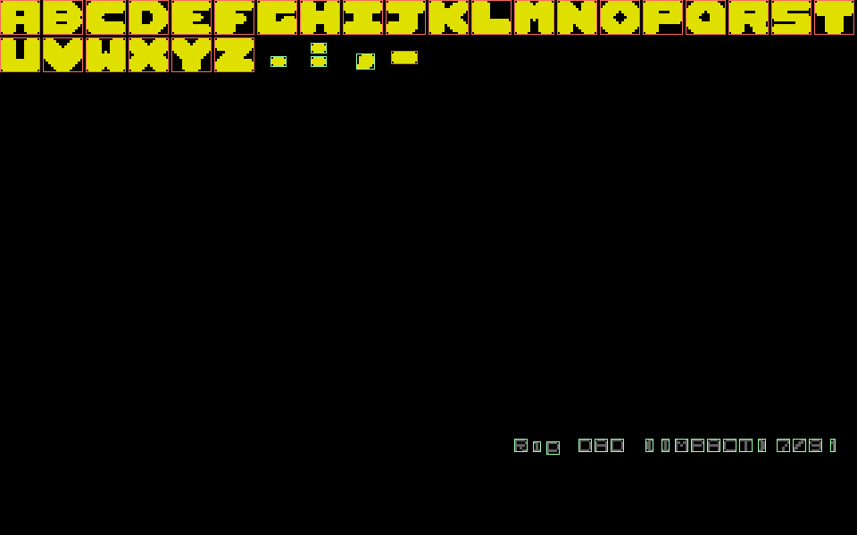
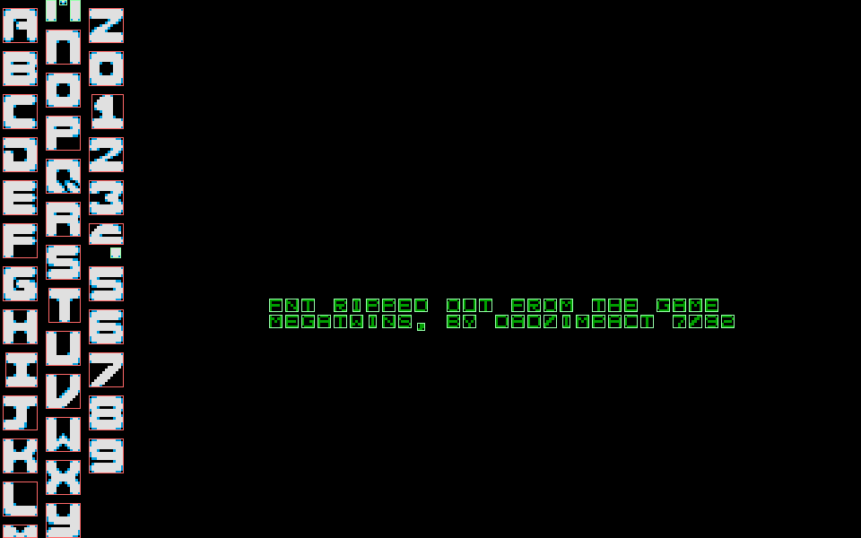
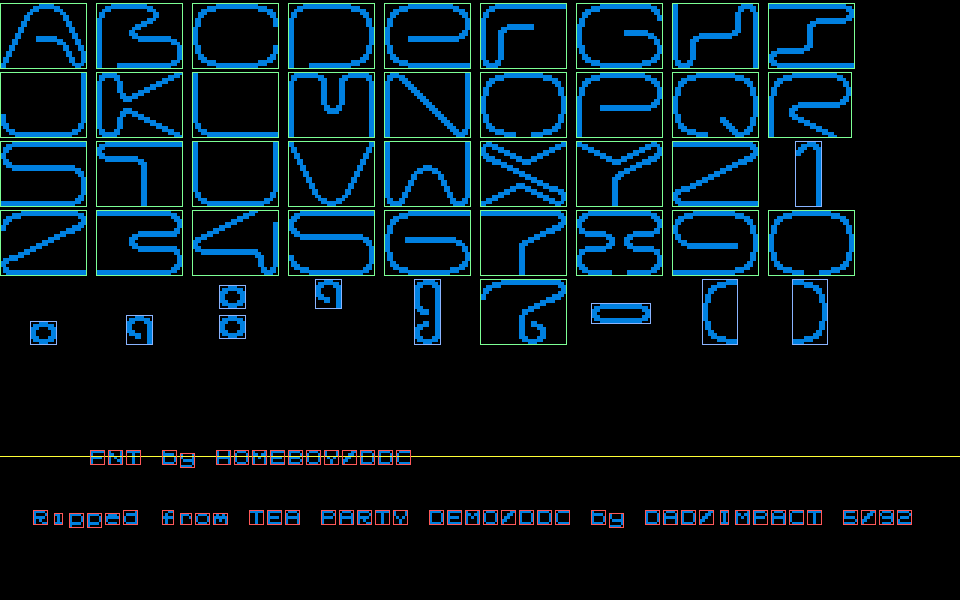
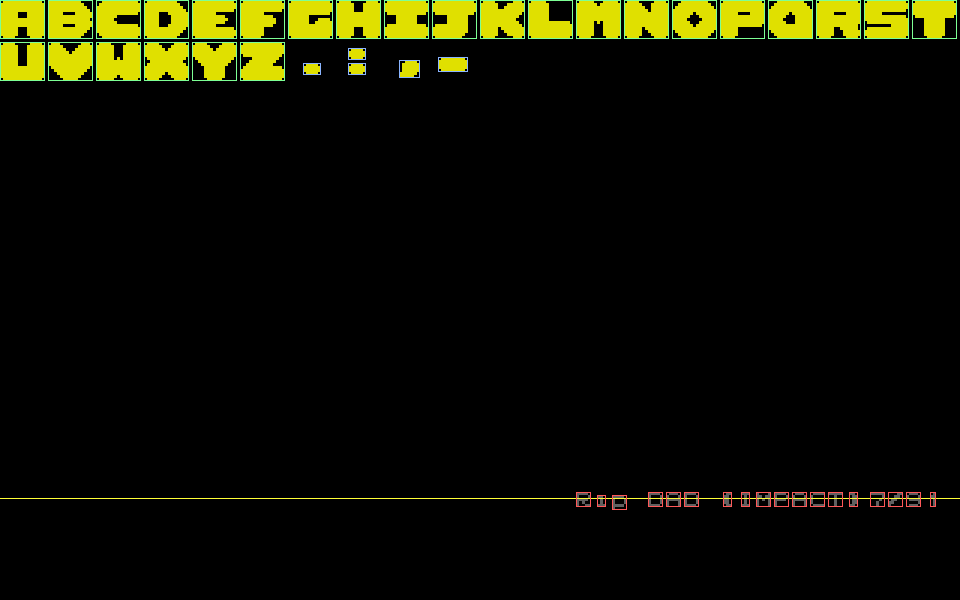
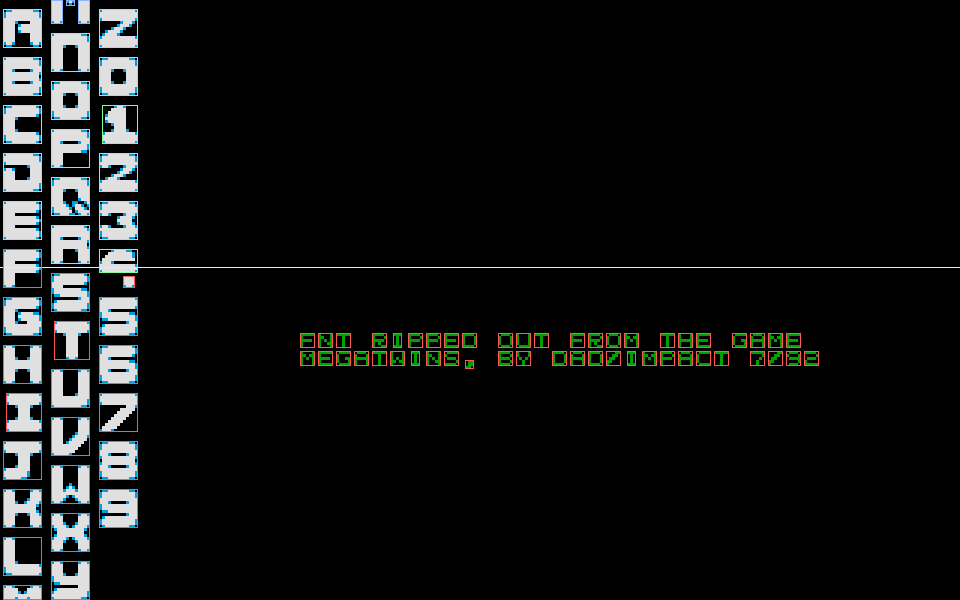
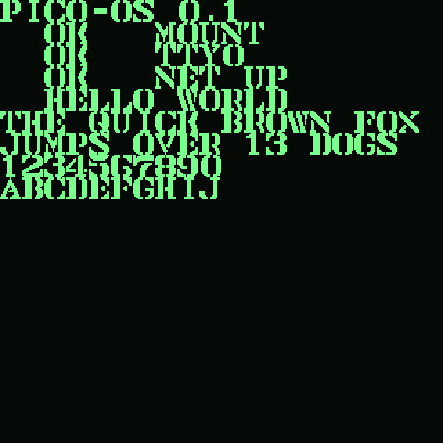
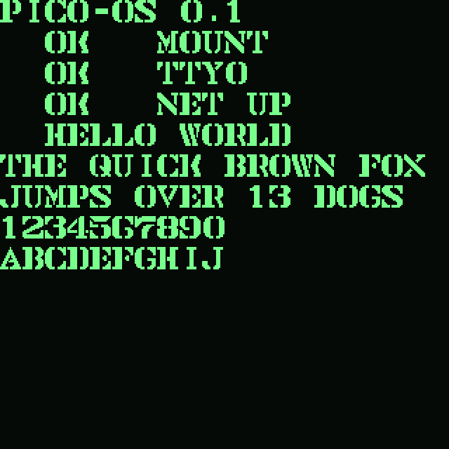

# Bitmap Font Slicing: From Uniform Grids to Per-Glyph Coordinates

This is a deep-dive technical analysis of a second-generation bitmap font slicer. The first generation assumed every glyph in a font sprite sheet sat on a single uniform grid. That assumption covers most of a collection of 817 retro bitmap fonts, but it breaks for the fonts that matter most: variable-width block fonts, sparse irregular grids, and sheets that pack two distinct typefaces into one image. The second generation replaces the uniform grid with a per-glyph coordinate model and recovers those coordinates automatically with connected-component analysis. It then labels each glyph by character using a technique that needs no optical character recognition and no machine-vision model: it renders text itself and compares the result to the source sheet, pixel for pixel.

The article explains why the uniform-grid model fails, how connected-component analysis recovers glyph structure, why credit-text bands must be separated before clustering, and how a self-rendering oracle labels glyphs without recognition. It covers the renderer's adjustable line height and letter spacing, the firmware-portability contract, and the visual design system for the editing tool. The reference implementation is the PicoCalc Bitmap Font Browser, a Go + React + Vite + Redux application whose rendering core is written to port directly to C firmware.

> [!summary]
> 1. A uniform `cellW × cellH` grid cannot represent variable-width or multi-region fonts; a per-glyph `(x, y, w, h)` coordinate list is the general model, and a uniform grid is its degenerate case.
> 2. Connected-component analysis with row/column clustering recovers glyph structure that projection-autocorrelation cannot, because it keys off where glyphs sit rather than the periodicity of ink density.
> 3. Credit and version text often dominate a sheet's component count; it must be classified into a separate band and dropped before clustering, or the detector invents roughly twice as many glyphs as exist.
> 4. Because these are bitmap fonts, the tool can render candidate text itself and compare it to the sheet. A correct character-set hypothesis reproduces the sheet exactly, so labeling reduces to a self-consistency check — no OCR, no vision model.

## Why this note exists

This note preserves the reusable engineering knowledge from redesigning a bitmap font slicer. The triggering project is a font-preview tool for a text-oriented operating system running on a PicoCalc handheld (a 320×320-pixel display). But the patterns generalize: any system that ingests inconsistently-structured raster sprite sheets, any system that must label glyphs at scale without OCR, and any renderer meant to be ported from a managed language to firmware will hit the same decisions. The note is written so a future reader can rebuild the system from the reasoning alone.

## The input: what a bitmap font sheet actually is

A bitmap font is not stored as outlines. It is stored as a raster image — a PNG — containing many glyphs arranged in a grid. The collection in question comes from the `ianhan/BitmapFonts` repository: 817 PNG sheets. Most are 320 pixels wide. Each pixel is either ink or paper after binarization, and the firmware stores each glyph as a packed one-bit-per-pixel bitmap. There is no outline, no hinting, no anti-aliasing in the stored representation. This simplicity is the whole reason a firmware text driver can use them: a glyph is a block of bits, and rendering is a bit-block transfer.

The dominant layout is a uniform grid. A sheet is divided into `cols × rows` identical cells of size `cellW × cellH`, filled row-major with glyphs in ASCII order starting at the space character (`0x20`). Unsupported characters are simply left blank. This is the layout of a classic BIOS codepage, and it is what the first-generation slicer assumed.

```text
16X16-F1.png  →  320 × 48 px,  cell 16×16  →  20 cols × 3 rows = 60 glyphs

         col0   col1   col2   col3  ...        col19
        +------+------+------+------+   ...   +------+
 row0   | 0x20 | 0x21 | 0x22 | 0x23 |   ...   | 0x33 |   space ! " # ... 3
 row1   | 0x34 | ...                                 |   4 5 6 7 8 9 : ; ...
 row2   | 0x48 | ...                                 |   H I J K ...

codepoint(col, row) = firstCodepoint + row*columns + col
```

## Where the uniform grid assumption breaks

The uniform-grid model works when three conditions hold simultaneously: every glyph occupies the same cell width, every glyph occupies the same cell height, and the cells tile the sheet on a single row-and-column pitch with no overlap. The first-generation heuristic guessed the cell size from the filename (a token like `16x16`) or from the largest common divisor of the image dimensions, and it covered roughly 85 percent of the collection. The remaining 15 percent need manual correction, which is tolerable. But three specific fonts cannot be represented by the model at all, no matter what cell size is chosen, because the three conditions do not hold.

The clearest failure is visible rather than statistical. When the heuristic's 8×8 grid is overlaid on `HOMEBOY`, the cells slice through the middle of large block letters:



The same heuristic applied to a clean uniform font lands every cell boundary exactly on a glyph boundary:



The difference between the two images is the entire motivation for a new model. `HOMEBOY` has variable-width glyphs with no inter-column gutter and with strokes that fragment into multiple disconnected blobs. `16X16-F1` has uniform glyphs on a clean grid. Any single cell size chosen for `HOMEBOY` either clips the wide letters or merges two adjacent letters into one cell. The problem is structural, not a matter of tuning the heuristic.

The measured component data confirms this across the three target fonts. All three are 320×200, 8-bit palette, black background. Connected-component analysis (eight-connectivity) on the binarized ink mask produces these counts:

| Font | Total components | Glyph-band components | Credit-band components | Glyph-band median size |
|------|-----------------:|----------------------:|-----------------------:|-----------------------:|
| HOMEBOY | 104 | 46 | 58 | 29×22 |
| LIGHT | 49 | 31 | 18 | 15×13 |
| M_TWINS | 89 | ~19 | ~70 | 13×13 |

Two facts jump out of this table, and each drives a part of the design. First, the total component count is not the glyph count: `HOMEBOY` has 104 components but roughly 40 glyphs. Second, the majority of components are not glyphs at all — they are credit text, addressed in the next section.

## The per-glyph coordinate model

The replacement for the uniform grid is a list of independent glyph records. Each record carries a bounding box in source-sheet pixels — `x, y, w, h` — plus the cropped one-bit bitmap for that box, plus the character label once it has been determined. There is no global cell size. A uniform grid is the special case in which every box shares the same width and height and is placed at `(col * (w + gap), row * (h + gap))`.

```typescript
interface Glyph {
  x: number; y: number; w: number; h: number;   // bounding box in sheet pixels
  bits: Uint8Array;                              // packed 1-bit bitmap, w*h bits, row-major
  char: string;                                  // label; "" until the oracle fills it
}

interface GlyphSet {
  name: string;
  glyphs: Glyph[];                               // variable count, variable sizes
  lineHeight: number;                            // render-time row pitch (source px)
  advance: number;                               // default horizontal advance (source px)
}
```

The choice to store a `bits` array per glyph rather than one concatenated atlas is forced by variable sizes. The first generation packed all glyphs into a single `Uint8Array` indexed by `index * cellW * cellH`, an index that only works when every glyph is the same size. Variable sizes break that index, so each glyph owns its own bits. The packing within a single glyph is unchanged from the first generation: one bit per pixel, row-major, byte `i >> 3`, bit `i & 7`. This matters because it keeps the firmware port mechanical — the asset baker emits one C struct plus one bitblob per glyph, the same layout as the BDF and PCF bitmap font formats.

This representation is deliberately a superset of the first generation's. It does not preserve a separate uniform-grid code path with a compatibility shim. A uniform grid is constructed by listing boxes at grid positions. Collapsing two old configuration concepts (a slicing config and an overrides file) into one layout document is a consequence of the same generality.

## Binarization: detecting ink without luminance thresholds

Every analysis stage operates on a binary ink mask. The binarization rule is reused unchanged from the first generation because it solved a real bug there, and the bug is instructive.

The obvious way to binarize a grayscale image is a luminance threshold: a pixel is ink if its perceived brightness is below some value. This fails on the collection because ink can be a saturated, low-luminance color. The font `08X08-F1` draws every glyph in pure red, `(240, 0, 0)`. The Rec. 601 luma of that color is approximately 72. A threshold of 128 classifies every red pixel as paper, and the entire font renders blank. The first-generation diary records this as the bug that forced a redesign of binarization.

The fix is to define ink by distance from the background rather than by absolute brightness. The background is the most common opaque color in the sheet. A pixel is ink when the maximum per-channel difference between it and the background exceeds a threshold. This single rule handles white-on-black, black-on-white, and colored ink uniformly:

```text
backgroundColor(img)  = the most common opaque RGB color in the sheet
inkDistance(img, x, y, bg) = max(|r - bg.r|, |g - bg.g|, |b - bg.b|)
isInk(x, y) = (inkDistance >= threshold) XOR invert
```

The `invert` flag XORs the result, which absorbs the polarity question (whether ink is darker or lighter than the background) into the same threshold. This is the foundation of every later stage; reverting to a luminance threshold would silently drop colored fonts.

## Finding glyphs with connected components

Connected-component analysis is the technique that answers the question "where are the letters?" without assuming a grid. It labels every maximal set of ink pixels reachable from one another by eight-neighbor moves. Each labeled component has a bounding box and a pixel count. The output is a set of independent blobs with no assumption about how they relate to one another.

The reason this is necessary, rather than the projection-autocorrelation detector the first generation tried, is that projection autocorrelation is dominated by intra-glyph structure. The first generation projected ink counts onto the X and Y axes and searched for the dominant period, expecting it to be the cell size. On `16X16-F1` the true cell height of 16 produced an autocorrelation score of roughly 0.03, while a spurious period of 4 — an artifact of horizontal stroke spacing within each letter — scored 0.53. The detector latched onto the harmonic and was unusable. The first-generation diary shipped it marked "beta only" for exactly this reason.

Connected components sidesteps the problem because it does not ask "what is the period of the ink signal." It asks "where are the blobs." The relationship between blobs is then recovered by a separate clustering step that keys off blob centers, which are robust to intra-glyph stroke structure.

The bounding boxes of the components on `HOMEBOY` make the structure of the problem visible:



`LIGHT`, by contrast, is close to a uniform grid and is largely recoverable by clustering:



`M_TWINS` is the hardest case: two distinct typeface styles packed into one sheet, occupying different column regions:



## One glyph is not one component

The `HOMEBOY` image above exposes a problem that component counting alone cannot solve. The font has roughly 40 glyphs but produces 104 components. A single block letter fragments into many eight-connected blobs: the enclosed counter of an `O` is a separate component from its outline, detached serifs are separate components, and dot-like punctuation marks are their own components. Naive component counting would report more than twice the real glyph count.

The solution is to cluster components into rows and columns and to treat the set of components in one row-column cell as one glyph. The clustering is one-dimensional along each axis. Each component has a center point. Components are sorted by their Y center and split into groups wherever the gap between consecutive centers exceeds a tolerance. The same is done along X. A glyph is then the union of the components whose centers fall in the same row group and the same column group.

```text
clusterByAxis(centers, tol):
    sort centers
    groups = [[centers[0]]]
    for each subsequent center c:
        if c - last(groups) <= tol: append c to last group
        else:                        start a new group with c
    return groups

detectRowsCols(components, rowTol, colTol):
    rows = clusterByAxis([c.centerY for c in components], rowTol)
    cols = clusterByAxis([c.centerX for c in components], colTol)
    glyphs = []
    for each (row, col):
        members = components whose center is in row and in col
        if members: emit boundingBox(union of members)
    return glyphs
```

This recovers a grid even when glyphs have no inter-cell gutter, because it keys off where glyphs sit rather than where gutters are. On `LIGHT` it recovers approximately 16 columns by 3 rows. On `HOMEBOY` it recovers 7 rows even though the columns have no gutter at all.

After clustering, a refinement stage cleans up the cells. Cells that are suspiciously wide relative to the row's median glyph width likely contain two glyphs whose centers fell in one column band, and are split at the local projection valley. Adjacent components within a row cell whose gap is small relative to the median glyph width are merged, reassembling the fragmented strokes of a block letter into one glyph. Components whose area is below a minimum are dropped as speckle unless they sit directly above a row, in which case they are diacritic dots assigned to the glyph below.

## Most components are not glyphs: the credit-text problem

A second structural fact about these sheets is easy to miss and corrupts the detector if ignored. Most sheets carry credit and version text that is not part of the glyph set: author names, font names, year strings, sometimes a one-line description. This text is small and dense and sits in a distinct band of the sheet. The measured data makes the scale of the problem precise.

For `HOMEBOY`, 58 of the 104 components are credit text. The credit components have a median size of 5×5 pixels; the glyph components have a median size of 29×22. The credit band sits below a 49-pixel vertical gap from the evenly-spaced glyph rows. For `LIGHT`, 18 of 49 components are credit text below a 146-pixel gap. For `M_TWINS`, roughly 70 of 89 components are credit text, though its multi-region layout makes a single horizontal cut insufficient.

A detector that does not separate the credit band before clustering will report roughly twice the real glyph count and will treat credit strings as if they were additional letter rows. The region-classification stage exists to prevent this. It uses two corroborating signals. The first is a row-spacing signature: glyph rows are approximately evenly spaced, so the credit band appears as one inter-row gap much larger than the median gap. The second is a size signature: credit components cluster well below the glyph band's median area. A component below the detected cut, or whose area is below 35 percent of the glyph median, is classified as credit and dropped before clustering.

```text
classifyRegions(components, rowClusters):
    gaps = adjacent row-cluster center differences
    medianGap = median(gaps)
    cut = the y just above the largest gap, if largestGap > 2 * medianGap
    glyphMedianArea = median area of components above the cut
    for each component c:
        if c.y0 >= cut:                      classify c as CREDIT
        elif c.area < 0.35 * glyphMedianArea: classify c as FRAGMENT  (keep, merge later)
        else:                                 classify c as GLYPH
    cluster only the GLYPH components
```

The band-separation diagnostic shows this working on `HOMEBOY` and `LIGHT`. Green boxes mark glyph-band components, red boxes mark the credit band, blue marks small fragments kept for merging, and a yellow line marks the detected cut:





The diagnostic is also where the single-cut approach honestly fails. On `M_TWINS`, the two typeface regions and the credit band interleave, so a horizontal cut lands inside the glyph region and misclassifies real glyphs as credit:



`M_TWINS` is the case that forces a more general region model. When column clustering yields two well-separated column groups with a large gap between them, the detector treats them as two sub-sheets and runs row and column detection within each. The single horizontal cut is the common-case fast path; column-region grouping is the fallback when the row-spacing and size signatures disagree.

## Labeling glyphs without recognition: the rendering oracle

Detecting glyph boxes solves only half the problem. The boxes are unlabeled. To render arbitrary text, each box must be associated with the character it depicts. The obvious approach is optical character recognition: read each glyph and identify the letter. The first generation tried the modern variant of this — a vision language model — and it failed in a specific, instructive way.

Asked to transcribe the glyphs of `16X16-F1` (a ground-truth sheet whose layout was already known by inspection), the vision model hallucinated a canonical codepage. It invented lowercase letters that do not exist in the font. On a high-resolution crop of the row containing `H I J K L M N O P Q R S T U V W X Y Z [`, it reported `A B C D E F G H I J K L M N O P Q R S T`, imposing the prior that capital letters start at `A` rather than reading the actual pixels. Open-ended transcription of bitmap glyphs is unreliable because the model pattern-matches to a canonical codepage instead of reading pixels.

The second generation replaces recognition with verification, and it needs no model at all. The key realization is that the tool can render text itself. The font is a bitmap font. Given a hypothesis about which characters the sheet contains and in what order, the tool can render that hypothesis string using the detected glyph boxes and compare the result to the source sheet, pixel for pixel. A correct hypothesis reproduces the sheet exactly, because the rendered output is built from the sheet's own bitmaps. Labeling reduces to a self-consistency check.

```text
oracleLabel(sheet, layout, hypothesisCharset):
    expected = renderHypothesis(layout, hypothesisCharset)   # same dimensions as sheet
    for each (box, i):
        glyphSource = crop(binized sheet, box)
        glyphHypothesis = crop(expected, hypothesisBox[i])
        score = IoU(glyphSource, glyphHypothesis)
        if score >= 0.85:  accept hypothesisCharset[i] as the label for box
        elif score >= 0.5: flag box as needs-review
        else:              reject the hypothesis at this box
```

The oracle never guesses a glyph. It only verifies that a hypothesis reproduces the pixels. A wrong hypothesis is rejected by pixel disagreement, not by a model's priors. This is strictly better than vision transcription, which hallucinates, and even better than vision comparison, which the first generation found reliable but which requires an external model and rate limits.

The hypothesis charset comes from a small ordered list of candidates. The first is standard ASCII starting at the space character, which is the majority case. The second is an alphabetic layout starting at `A`, which covers fonts like `DUKEFONT`. The third is interactive: the user types the characters in order over the editor, and each typed glyph is matched to a box by the same IoU comparison. When none of the hypotheses match, the boxes remain unlabeled and are addressed in the manual editor.

The match metric is intersection-over-union of the binarized glyph against the hypothesis, or equivalently the fraction of agreeing bits over the cell. A threshold of 0.85 IoU marks a confident label; 0.5 to 0.85 marks a box for review; below 0.5 rejects the hypothesis at that position. The golden test for the oracle is a known-correct layout on `16X16-F1` with the standard-ASCII hypothesis, which should produce per-glyph IoU above 0.95.

## The renderer: adjustable line height and letter spacing

Once glyphs are detected and labeled, rendering is a bit-block transfer. The renderer is the firmware-portable core of the project. It is integer-only, allocation-light, and uses a single platform-specific call — `setPixel` — to write to the framebuffer. In the browser the framebuffer is a canvas `ImageData` (RGBA, four bytes per pixel). On the device it is the LCD buffer (RGB565). The algorithm is identical between the two; only `setPixel` changes.

The renderer draws one glyph by walking its bitmap and writing each ink pixel scaled by an integer zoom factor. It lays out text by maintaining a pen position, advancing horizontally after each glyph and vertically after each line break or wrap. The extension over the first generation is that the horizontal advance is per-glyph — each glyph's own width plus a configurable letter spacing — and the vertical advance is a configurable line height. The first generation used a single global cell size for both, which is correct only for uniform fonts.

```text
renderText(glyphSet, text, canvas, lineHeight, letterSpacing, zoom, fg, bg):
    fill framebuffer with bg
    lineH = lineHeight * zoom          # source px scaled to device px
    gap   = letterSpacing * zoom
    penX = 0; penY = 0
    for each character ch in text:
        if ch == newline: penX = 0; penY += lineH; continue
        if wrap and penX + maxGlyphWidth*zoom > canvas.w: penX = 0; penY += lineH
        glyph = resolveGlyph(glyphSet, ch)
        if glyph:
            blitGlyph(framebuffer, glyph, penX, penY, zoom, fg, bg)
            penX += glyph.w * zoom + gap      # advance by THIS glyph's width
        else:
            penX += defaultAdvance * zoom + gap
```

The adjustable line height exists for block fonts. `HOMEBOY` glyphs are 22 pixels tall and, at the default line height equal to the cell height, the rows touch. Increasing the line height to the cell height plus a few pixels inserts a gap so the block letters do not collide. The same text rendered at two line heights shows the effect directly. At the default, the rows are packed tight:



At cell height plus six pixels, the rows separate:



Letter spacing does the same horizontally. Both are render-time overrides, not baked into the glyph boxes, because the boxes describe the source while spacing is a render concern. A terminal render of the same font wants tight spacing; a title render wants loose spacing. Keeping them separate lets one layout serve both. The firmware must honor the same integer metrics for the on-device render to match the browser preview.

## The firmware-portability contract

The renderer and the glyph representation are written so that a C port is mechanical, and the constraints that make that true are worth stating explicitly because they govern many small decisions.

A glyph is a C struct: signed integer coordinates and dimensions, a pointer to a packed one-bit bitmap, and a one-byte code. The bitmap packing within a glyph is one bit per pixel, row-major, byte `i >> 3`, bit `i & 7`, identical to the TypeScript representation. The asset baker emits one such struct and one bitblob per glyph per font.

The blit and the text layout use only integer arithmetic. There is no floating point, no anti-aliasing, no alpha blending. The only platform-specific operation is `setPixel`, which writes either RGBA to an `ImageData` in the browser or RGB565 to the LCD buffer on the device. The line height, letter spacing, and per-glyph width are plain integers.

The detection stage and the oracle are host-only tools. They run at build time to produce the layout JSON. They do not run on the device. The device consumes only the resulting coordinate layout. Keeping detection and oracle out of the firmware port is part of the contract: the device does a fixed blit from a known layout, nothing more.

The lock-step guarantee between the browser and the device is maintained by golden-image tests. The same glyph set, text, and spacing produce byte-identical framebuffers in both, after RGB565 conversion. Any divergence is a bug in one of the two.

## The editing tool's visual design system

The tool that an operator uses to correct detection failures and label glyphs has a deliberate visual identity, and the identity is itself a design decision worth recording because it governs the component architecture.

The interface is retro monochrome, modeled on classic Macintosh System 1, but stripped of all window chrome. There is no title bar, no menu bar, no window frame. The application fills its viewport as a flat, gridded work surface. The aesthetic is two one-bit colors — black ink on white paper — with structure expressed entirely by hairline borders and recessed wells rather than by shadows, gradients, or rounded corners. The grid is the structure; the strokes define the regions.

Color is reserved for meaning, never for decoration. The single non-monochrome hue in the chrome is one accent blue, used only for focus rings and the currently selected item. Semantic states — auto-detected, needs-review, error, region — are expressed as font color through a small set of tones (`ok`, `warn`, `info`, `crit`) applied to text and to twelve-pixel swatches beside the text. The rule is strict: if removing the color loses no information, the color is decoration and must be removed. Status is never conveyed by color alone; every colored badge carries a text label, so the interface remains legible if color is removed entirely.

The component architecture follows a strict atomic layering borrowed from design-system practice, enforced as a dependency rule. There are four layers: primitives, atoms, molecules, organisms. A component may import only from its own layer or a layer below it.

```text
ui/
  primitives/   tokens only — tokens.css, reset.css; no components
  atoms/        smallest units: Text, Label, Number, Rule, Field, IconButton, Swatch
  molecules/    2–4 atoms composed: Toolbar, SliderRow, Badge, SearchField, StatusLine
  organisms/    full regions: FontList, GlyphEditor, PreviewCanvas, Controls
```

The dependency rule is the backbone of the system. Changing a token changes the whole application. Changing an atom changes every molecule that uses it. No organism ever hardcodes a color or a spacing value, because it can only reach those through the layers below. This makes the monochrome field and the color-as-signal rules enforceable by construction rather than by convention. A component literally cannot introduce a decorative color because it has no access to raw color values.

The typographic discipline is Swiss: one grid, two typefaces, strong contrast through size and weight. A monospace face drives the interface labels and numbers. A sans-serif face is reserved for the content the user types into the preview, so the neutral interface never competes with the bitmap font being judged. Generous whitespace, a four-pixel base grid to which every dimension snaps, and sharp corners complete the system. The bitmap preview is the visual center of the tool; everything else is calibrated to recede.

## Common failure modes

Several failure modes recur across this kind of system, and naming them helps avoid them.

**Luminance-threshold binarization** silently drops colored fonts. The red-glyph case is the canonical example. The fix is distance-from-background binarization, and the regression test that encodes it should never be removed.

**Naive connected-component counting** over-reports glyphs for any font whose letters fragment. Block fonts with enclosed counters and detached strokes produce many components per letter. The fix is row-column clustering with a merge refinement, never raw component count.

**Ignoring the credit band** roughly doubles the reported glyph count and introduces spurious letter rows. The fix is region classification before clustering, using the row-spacing and size signatures. The single-cut fast path fails on multi-region sheets and must fall back to column-region grouping.

**Vision transcription for labeling** hallucinates a canonical codepage. This is not a tunable problem; it is a category error about what vision models do with unfamiliar pixel layouts. The fix is the rendering oracle, which verifies rather than recognizes.

**Baking spacing into glyph boxes** couples the source representation to one render context and prevents tight versus loose renders of the same font. The fix is render-time line height and letter spacing overrides.

**Mixing the detection or oracle into the firmware port** violates the portability contract and bloats the device binary. The fix is the strict boundary: detection and oracle are host build tools; the device consumes only the resulting layout.

## Working rules

The decisions above distill into a small set of rules that govern the system.

- Store glyphs as per-glyph coordinates. A uniform grid is the degenerate case. Never add a parallel uniform-grid code path with a compatibility shim.
- Detect structure with connected components plus row-column clustering, never with projection autocorrelation. Classify and drop the credit band before clustering.
- Label glyphs with the rendering oracle, never with OCR or vision transcription. Verify hypotheses; do not recognize pixels.
- Keep the renderer integer-only and single-`setPixel`. Line height and letter spacing are render-time overrides in source pixels, not properties of the boxes.
- Keep detection and the oracle off the device. The firmware consumes the layout; it does not compute it.
- Express the visual identity in tokens and enforce the atomic layering as a dependency rule. Reserve color for state; never convey state by color alone.

## Implementation references

The reference implementation is the PicoCalc Bitmap Font Browser. The active design lives in the repository's docmgr ticket, and the first-generation code is archived under `v1/` as provenance.

- Repository: `/home/manuel/code/wesen/2026-06-24--bitmap-font-browser`
- Active design guide: `ttmp/2026/06/25/BITMAP-FONT-SLICER-V2--*/design-doc/01-bitmap-font-slicer-v2-intern-design-implementation-guide.md`
- Investigation diary: `ttmp/2026/06/25/BITMAP-FONT-SLICER-V2--*/reference/01-investigation-diary.md`
- First-generation binarization and renderer (reused): `v1/web/src/core/fontLoader.ts`, `v1/web/src/core/renderer.ts`, `v1/web/src/core/bits.ts`
- First-generation detector (the approach replaced): `v1/web/src/core/detect.ts`
- Analysis scripts (connected components, clustering, band separation): `ttmp/2026/06/25/BITMAP-FONT-SLICER-V2--*/scripts/01-…` through `07-…`
- Diagnostic images: `ttmp/2026/06/25/BITMAP-FONT-SLICER-V2--*/various/`
- Font collection: `https://github.com/ianhan/BitmapFonts`

## Open questions

The design leaves several questions for implementation to resolve empirically.

- The merge and split tolerances in the clustering refinement are the highest-risk part of the detector. Over-merging joins two adjacent glyphs; under-merging leaves a glyph fragmented. The proposed gap threshold of 30 percent of the row's median glyph width needs validation on the hardest font, `HOMEBOY`.
- The multi-region detection rule for sheets like `M_TWINS` needs a confidence signal so it does not fire on legitimately wide single-style sheets.
- The oracle's hypothesis ordering covers the common cases but not every custom minority. The interactive typing fallback must be genuinely usable, since auto-labeling will miss the custom-layout fonts.
- The persistence model for curated layouts — whether they are committed as JSON files in the asset tree or stored separately — affects how curated work is shared across machines.

## Related notes

- [[PROJ - ZK Tool]] — another Go + tooling project in the vault; shares the "framework-free core, thin shell" pattern.
- [[ARTICLE - Playbook - Self-Contained Go Wasm and JavaScript Browser Applications]] — the Go-plus-browser frontend pattern this project's stack descends from.
