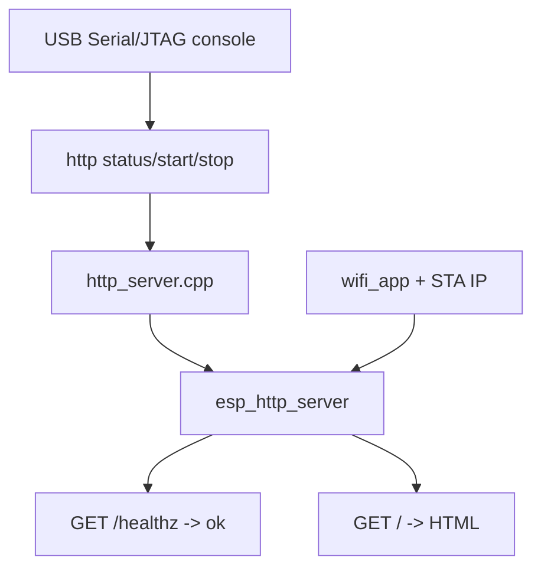
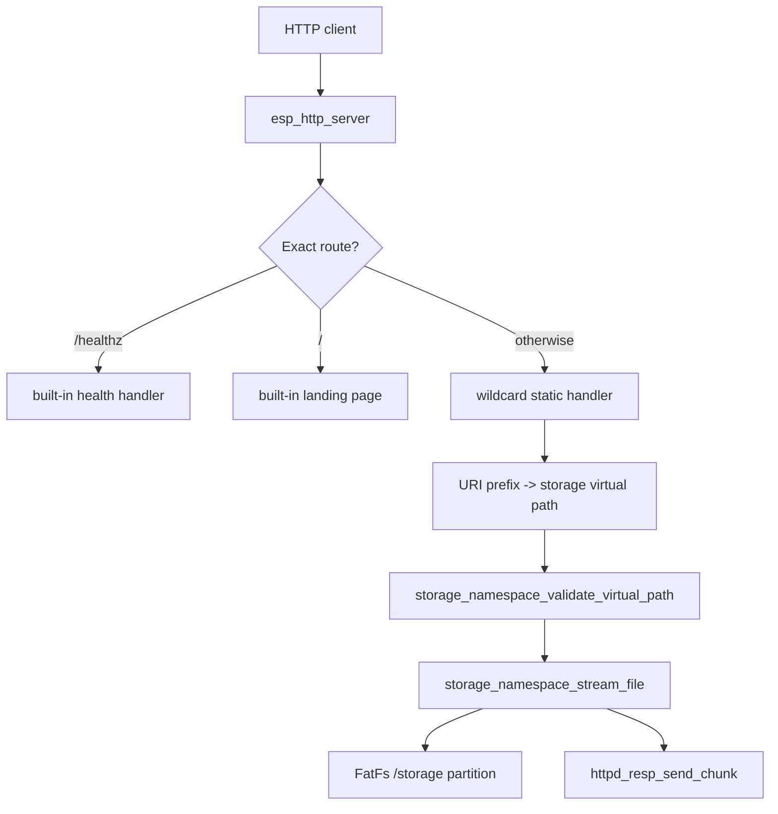
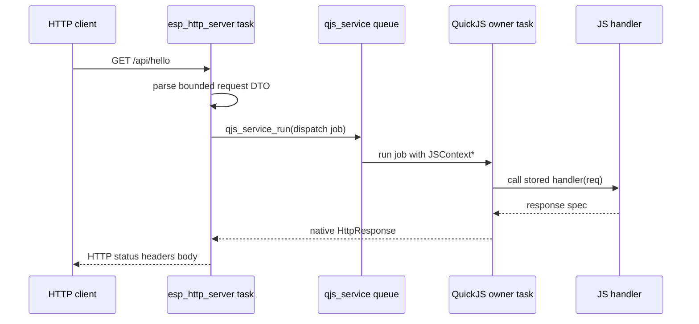
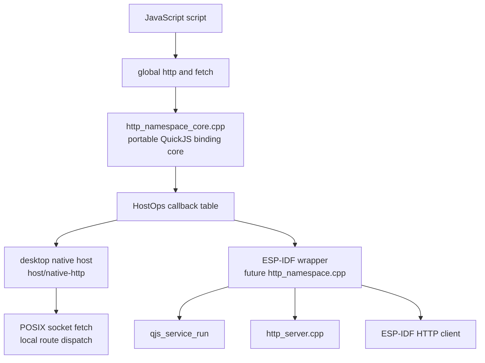

# ESP32-S3 QuickJS HTTP and Fetch: From Firmware Static Serving to Host-Testable APIs

This report is a follow-up to [[ARTICLE - QuickJS Native Modules on ESP32-S3 - Implementing Firmware JavaScript Namespaces]]. That earlier article explained how the AtomS3R M12 firmware exposes native QuickJS globals such as `system`, `storage`, and `wifi`: the owner task owns `JSRuntime*` and `JSContext*`, firmware modules install frozen global objects, and reset-safe namespaces are reinstalled after `js reset`. The work since then moves the firmware from local JavaScript evaluation into network-facing JavaScript infrastructure: host-owned HTTP serving, static file streaming from bounded storage, a design for a JavaScript `http` namespace, and a host-native QuickJS runner that can test the same binding core while the device is disconnected.

The important change is that HTTP makes the QuickJS integration bidirectional. Earlier modules were mostly request/status APIs: JavaScript asked firmware for metadata, storage reads, storage writes, or WiFi actions. HTTP dynamic routes invert part of that flow. A network request arrives from outside the runtime, the firmware HTTP server must decide whether the request maps to static storage or a JavaScript handler, and any JavaScript handler must run on the QuickJS owner task. The design has to preserve the same safety rules while adding an external event source.

> [!summary]
> - The firmware now has a host-owned `esp_http_server` wrapper with console lifecycle commands, `/healthz`, `/`, and storage-backed static serving.
> - Static serving deliberately streams from FatFs outside QuickJS. JavaScript does not read asset bytes into the 1 MiB QuickJS heap for ordinary static requests.
> - The storage layer now exposes a bounded streaming API and FatFs long filename support, because web assets require names such as `index.html`, `app.js`, and `data.json`.
> - A new ticket, `ATOMS3R-M12-QUICKJS-HOST-FETCH`, defines the next API layer: a shared QuickJS HTTP binding core, a desktop native host, dynamic `http.get()` routes, and a bounded `fetch()` API.
> - A first host-native implementation exists in the firmware repo: `http_namespace_core.{h,cpp}` plus `host/native-http`, with a passing smoke test for `http.get()` dispatch and `fetch('http://127.0.0.1:18080/healthz')`.

## Why this report exists

The previous native-modules article captured the module pattern: install a global object, attach C functions, lock its shape, and reinstall it after reset. That article was mostly about the boundary between JavaScript and firmware. The work described here adds a second boundary: the boundary between network traffic and JavaScript.

Network-facing JavaScript has different failure modes from console-driven JavaScript. A console user submits one expression at a time. An HTTP server can receive requests while WiFi events, storage operations, console commands, and `js reset` are also possible. The firmware must answer several questions before it exposes `http.get()` or `fetch()`:

- Which parts of HTTP serving should run outside QuickJS?
- Which parts need to enter QuickJS, and how do they get to the owner task?
- How are static files served without loading them through JavaScript?
- How does a route handler return a response without exposing raw server handles?
- What happens to stored JavaScript callbacks after `js reset`?
- How can this API be developed while the AtomS3R is disconnected?
- How much of browser `fetch()` is appropriate for a constrained firmware runtime?

The implementation sequence answers those questions incrementally. First, the firmware proves that WiFi and `esp_http_server` work with a built-in `/healthz` route. Second, it serves static assets from the existing bounded storage namespace. Third, it defines a host-testable QuickJS binding core before adding dynamic routes to firmware. That ordering is deliberate. It keeps each layer small enough to validate independently.

## Repository and artifact map

The source repository is:

```text
/home/manuel/workspaces/2025-12-21/echo-base-documentation/esp32-s3-m5
```

The primary firmware is:

```text
0103-atoms3r-m12-native-quickjs/
```

The files added or changed for the HTTP/static/host/fetch work are:

| Path | Role |
|---|---|
| `0103-atoms3r-m12-native-quickjs/main/http_server.h` | Public firmware HTTP server API: start, stop, static mount, clear static mounts, console registration. |
| `0103-atoms3r-m12-native-quickjs/main/http_server.cpp` | Host-owned `esp_http_server` lifecycle, `/healthz`, `/`, wildcard static route, MIME detection, URL-to-storage mapping, console commands. |
| `0103-atoms3r-m12-native-quickjs/main/storage_namespace.h` | Public bounded storage API, now including virtual-path validation and streaming. |
| `0103-atoms3r-m12-native-quickjs/main/storage_namespace.cpp` | FatFs mount, virtual roots, read/write/list/stat, and new chunked streaming helper for HTTP. |
| `0103-atoms3r-m12-native-quickjs/sdkconfig.defaults` | Enables heap-backed FatFs long filenames for web asset names. |
| `0103-atoms3r-m12-native-quickjs/main/http_namespace_core.h` | Portable QuickJS HTTP/fetch core interface, currently an implementation seed. |
| `0103-atoms3r-m12-native-quickjs/main/http_namespace_core.cpp` | Portable QuickJS HTTP/fetch core implementation, currently in progress and host-smoked. |
| `0103-atoms3r-m12-native-quickjs/host/native-http/` | Desktop QuickJS host for testing the same HTTP/fetch binding core without ESP-IDF or hardware. |

The relevant tickets are:

```text
ttmp/2026/06/25/ATOMS3R-M12-QUICKJS-HTTP--atoms3r-m12-quickjs-express-like-http-server/
ttmp/2026/06/25/ATOMS3R-M12-QUICKJS-HOST-FETCH--atoms3r-m12-quickjs-host-http-and-fetch-api/
```

The related commits in the firmware repository are:

| Commit | Meaning |
|---|---|
| `7757d75` | Added the host-owned HTTP health server. |
| `0c4cba3` | Recorded the HTTP health server diary milestone. |
| `3310933` | Added static HTTP serving from bounded storage. |
| `60c4aed` | Recorded the static serving diary milestone. |
| `acdb021` | Added the host/fetch docmgr ticket, design guide, diary, and task plan. |

At the time of writing this report, the host/fetch implementation files are present in the working tree but not yet committed in the firmware repository. The host smoke test passes locally.

## The state before HTTP

Before the HTTP work, the AtomS3R firmware already had a usable native QuickJS base. The important pieces were:

- `components/quickjs_native` compiled upstream QuickJS directly into ESP-IDF.
- `components/qjs_service` owned the runtime and serialized all access through a FreeRTOS queue.
- `system`, `storage`, and `wifi` were installed as reset-safe global objects.
- `storage` exposed bounded FatFs access through virtual roots: `/scripts`, `/data`, and `/tmp`.
- `wifi` exposed request/status operations without returning secrets.
- The USB Serial/JTAG console remained the recovery path.

This matters because HTTP builds on every one of those decisions. The server needs WiFi. Static assets need storage. Dynamic handlers need the owner task. Reset needs namespace reinstallation. Host testing needs the QuickJS binding core to be separated from ESP-IDF-specific services.

The most important inherited rule is still the owner-task rule:

```text
Only qjs_service's owner task may touch JSRuntime* or JSContext*.
```

An HTTP server task must not call a route handler directly with `JS_Call`. It must package request data into a plain native structure and enqueue a `qjs_service_run()` job. That job runs on the owner task and calls the JavaScript handler. This rule is the foundation for the dynamic route design.

## Phase 1: host-owned HTTP server

The first HTTP milestone added `http_server.{h,cpp}` to `0103-atoms3r-m12-native-quickjs/main`. It deliberately did not expose any JavaScript API. It created a small firmware-owned server with console lifecycle commands and built-in routes:

```text
http status
http start [port]
http stop
GET /healthz -> ok\n
GET /        -> small HTML landing page
```

The public header was intentionally small:

```cpp
esp_err_t http_server_start(uint16_t port);
esp_err_t http_server_stop(void);
void register_http_commands(void);
```

The first implementation used `esp_http_server` directly. `http_server_start()` prepared `HTTPD_DEFAULT_CONFIG()`, set the server port, derived a control port from it, raised the handler count slightly, enabled LRU purge, started the server, and registered `/healthz` and `/`. The console command wrapper parsed `http status`, `http start [port]`, and `http stop`.

The milestone was validated on the AtomS3R with WiFi credentials already provisioned in NVS. The observed device IP was:

```text
192.168.4.22
```

The successful external checks were:

```bash
curl http://192.168.4.22/healthz
# ok

curl http://192.168.4.22/
# small HTML landing page
```

The binary size with the initial HTTP server was reported as:

```text
0x14d5f0, 67% app partition free
```

This first layer answered one important question: the network path was sound. WiFi, `esp_http_server`, the console lifecycle, and external client access all worked without QuickJS in the request path.

## Why HTTP starts outside QuickJS

The server starts outside QuickJS because the server is infrastructure, not script state. JavaScript may later configure routes, but the server's socket lifecycle belongs to firmware. This avoids several classes of failures:

- A script cannot accidentally destroy the recovery path.
- `/healthz` can remain available even if JavaScript is reset or broken.
- Static files can be served without allocating JavaScript strings.
- The firmware can stop the server from the console even if a route script misbehaves.

This is the same design direction as the earlier `wifi` module. JavaScript requests actions and reads status. Native firmware owns the subsystem. For HTTP, the subsystem is an `esp_http_server` instance plus route tables and storage-backed static mounts.

The Phase 1 architecture looked like this:



No arrow enters QuickJS in this diagram. That absence is part of the design. Phase 1 proves the transport before dynamic JavaScript is introduced.

## Phase 2: static assets from bounded storage

The second HTTP milestone added static serving. This moved the firmware from a health endpoint to a small web-asset server:

```text
http static /static /data
http start 80
curl http://192.168.4.22/static/index.html
```

The static layer maps URL prefixes to storage virtual roots. A URL such as:

```text
/static/index.html
```

maps to:

```text
/data/index.html
```

The storage namespace then translates `/data/index.html` to the native FatFs path under `/storage`, but the HTTP server does not expose that native path to JavaScript or clients. The virtual-root boundary remains intact.

The key constants in `http_server.cpp` define the embedded budget:

```cpp
constexpr size_t kMaxStaticMounts = 4;
constexpr size_t kMaxUrlPrefixBytes = 31;
constexpr size_t kMaxVirtualRootBytes = 127;
constexpr size_t kMaxVirtualPathBytes = 160;
constexpr size_t kMaxStaticFileBytes = 128 * 1024;
```

The static handler does four things:

1. Convert the request URI into a storage virtual path.
2. Set a MIME type based on the virtual path extension.
3. Stream the file from storage in chunks.
4. Finish the chunked response.

The relevant control flow is:

```cpp
esp_err_t static_handler(httpd_req_t *req) {
  char virtual_path[kMaxVirtualPathBytes] = {};
  esp_err_t err = uri_to_virtual_path(req->uri, virtual_path, sizeof(virtual_path));
  if (err != ESP_OK) {
    send_error_for_storage(req, err);
    return ESP_OK;
  }

  httpd_resp_set_type(req, mime_for_path(virtual_path));
  SendCtx send_ctx = {.req = req, .sent = false};
  size_t sent_bytes = 0;
  err = storage_namespace_stream_file(
    virtual_path,
    kMaxStaticFileBytes,
    send_chunk_writer,
    &send_ctx,
    &sent_bytes
  );
  if (err != ESP_OK) { ... }
  return httpd_resp_send_chunk(req, nullptr, 0);
}
```

The storage layer gained a public streaming helper:

```cpp
typedef esp_err_t (*storage_stream_writer_t)(const void *data, size_t len, void *user);

esp_err_t storage_namespace_stream_file(
  const char *virtual_path,
  size_t max_bytes,
  storage_stream_writer_t writer,
  void *user,
  size_t *out_len
);
```

This API is the important part. It lets HTTP stream a file without reading the entire file into QuickJS and without exposing the native path translator. The storage namespace still validates the virtual path, checks mount state, checks file size, opens the native file, reads bounded chunks, calls the writer callback, and closes the file.

The static-serving architecture is:



Again, QuickJS is absent. Static serving does not need JavaScript. That is why it belongs before dynamic routes.

## The FatFs long filename failure

Static serving uncovered a storage configuration issue that was not visible when the storage namespace only wrote simple test names. A first validation attempt tried to write:

```text
storage write /data/index.html <html><body>static-ok</body></html>
```

The result was:

```text
write: ESP_FAIL
```

A control write succeeded:

```text
storage write /data/index.txt static-ok
storage read /data/index.txt
# static-ok
```

The storage mount was healthy. The failure was filename support. The generated `sdkconfig` had:

```text
CONFIG_FATFS_LFN_NONE=y
```

That configuration limits filenames to 8.3-style names. `index.txt` works. `index.html` does not, because `.html` is a four-character extension. Web assets routinely use names such as `index.html`, `app.js`, `data.json`, and `image.jpeg`. Long filenames are not optional for a web-serving feature.

The fix was added to `sdkconfig.defaults`:

```text
# Static web assets need names such as index.html, app.js, and data.json.
# Use heap-backed FatFs long filename buffers instead of owner-task stack buffers.
# CONFIG_FATFS_LFN_NONE is not set
CONFIG_FATFS_LFN_HEAP=y
CONFIG_FATFS_MAX_LFN=255
```

Heap-backed LFN buffers were chosen because the firmware already has constrained task stacks, and HTTP/static serving should not consume large stack buffers for filename processing. After rebuilding and flashing, the exact static validation succeeded:

```text
storage write /data/index.html static-html
# write: ESP_OK

storage read /data/index.html
# static-html

http static /static /data
# ESP_OK

http start 80
# ESP_OK
```

The external client result was:

```text
HTTP/1.1 200 OK
Content-Type: text/html; charset=utf-8
Transfer-Encoding: chunked

static-html
```

The binary size with static serving and FatFs LFN enabled was:

```text
0x14f470, 67% app partition free
```

The captured boot log still showed a healthy QuickJS startup:

```text
QuickJS runtime init elapsed: 12 ms
internal free after QuickJS: 76655 bytes
STA IP: 192.168.4.22
```

## Static serving design rules

Static serving produced several rules that should survive the initial implementation:

- Static files are served outside QuickJS. A static request should not allocate a JavaScript string containing the asset body.
- URL prefixes map only to storage virtual roots. The HTTP server should not expose `/storage` native paths.
- Storage validation belongs to the storage namespace. HTTP may normalize the URL prefix, but the storage namespace remains the authority for allowed roots.
- File size is bounded before streaming. The current cap is 128 KiB per static response.
- MIME detection is host-owned. The first set includes `html`, `js`, `css`, `json`, `txt`, `svg`, `png`, `jpg`, and `jpeg`.
- Long filename support is part of the feature. Without it, normal web filenames fail.

There is one implementation detail that needs future review: the current storage stream holds the storage mutex while sending chunks to the HTTP response. That is simple and correct for the small Phase 2 milestone, but it means a slow client can block other storage operations. A later version may need to open the file under lock, release the lock while sending, and protect only shared mount/path state. That change should be made carefully, because FatFs and VFS concurrency rules still matter.

## The new problem: dynamic routes

Static serving does not enter QuickJS. Dynamic routes must. A dynamic route API should let a script register a handler:

```javascript
http.get('/api/hello', (req) => ({
  status: 200,
  json: { ok: true, path: req.path },
}));
```

When an external client requests `/api/hello`, the firmware HTTP task receives the request. It cannot call the JavaScript function directly. The correct firmware flow is:



The route handler must return data, not native handles. The first design uses return-object handlers rather than Express-style mutable response objects:

```javascript
http.get('/api/hello', (req) => {
  return { json: { ok: true, path: req.path } };
});
```

The core converts that result into a native `HttpResponse`:

```cpp
struct HttpResponse {
  int status = 200;
  std::string content_type = "text/plain; charset=utf-8";
  std::string body;
  bool body_set = false;
};
```

This choice keeps the first dynamic route implementation small. It avoids a mutable `res` object whose lifetime might accidentally escape the handler. If later scripts need streaming or incremental writes, a response object can be added after the basic handler lifecycle is validated.

## Why host testing matters now

The AtomS3R was disconnected before the dynamic route work began. That changed the immediate implementation strategy. Firmware-only code would be slow to validate because the first real test would wait for hardware. The project already had a precedent for this situation: the 0102 PicoCalc visual REPL has a desktop native host under:

```text
0102-esp32-p4-visual-quickjs-repl/js/tools/native-host/
```

That host compiles upstream QuickJS directly and splits the code into two categories:

- portable QuickJS binding/runtime code, and
- host-only terminal/file-loading glue.

The 0103 HTTP/fetch design uses the same structure. The portable core is:

```text
0103-atoms3r-m12-native-quickjs/main/http_namespace_core.h
0103-atoms3r-m12-native-quickjs/main/http_namespace_core.cpp
```

The host-only tool is:

```text
0103-atoms3r-m12-native-quickjs/host/native-http/
```

The portable core includes `quickjs.h` and standard C++ headers. It does not include ESP-IDF headers. It exposes a `HostOps` table for native operations:

```cpp
struct HostOps {
  void *user = nullptr;
  int (*start)(void *user, uint16_t port) = nullptr;
  int (*stop)(void *user) = nullptr;
  int (*add_static_mount)(void *user, const char *url_prefix, const char *virtual_root) = nullptr;
  int (*clear_static_mounts)(void *user) = nullptr;
  int (*status)(void *user, HostStatus *out) = nullptr;
  int (*fetch)(void *user, const FetchRequest *req, FetchResult *out, std::string *error) = nullptr;
};
```

That table is the portability boundary. The shared core owns JavaScript argument parsing, global installation, route storage, response conversion, and fetch result objects. The firmware adapter will connect the table to `http_server_*`, storage, and ESP-IDF HTTP client code. The desktop adapter connects it to in-memory host state and POSIX sockets.

The architecture is:



The same `http_namespace_core.cpp` should compile in both host and firmware modes. That is the main engineering value of this split.

## The host-native implementation

A first host-native implementation has been written in the working tree. It currently consists of about 1,300 lines across the shared core and host tool:

```text
114  main/http_namespace_core.h
718  main/http_namespace_core.cpp
172  host/native-http/src/main.cpp
250  host/native-http/src/host_http_ops.cpp
49   host/native-http/tests/run-smoke.sh
```

The host Makefile mirrors the 0102 pattern. It compiles:

- `host/native-http/src/main.cpp`,
- `host/native-http/src/host_http_ops.cpp`,
- `main/http_namespace_core.cpp`,
- upstream QuickJS sources from `0100-esp32-p4-quickjs-wasm/wasm-src/quickjs`.

The host runner creates a QuickJS runtime directly:

```cpp
JSRuntime *rt = JS_NewRuntime();
JSContext *ctx = JS_NewContext(rt);
qjs_http_host::HostState host_state;
auto *http = new qjs_http::Runtime(ctx, qjs_http_host::make_host_ops(&host_state));
install_base_globals(ctx);
http->install_global();
eval_source(ctx, script, path);
```

The `http` runtime is allocated separately and deleted before the QuickJS context is freed. That order matters. The runtime stores duplicated `JSValue` handlers for dynamic routes. Those values must be released while the `JSContext*` is still valid. Deleting the HTTP runtime after `JS_FreeContext(ctx)` would make destructor cleanup unsafe.

The host installs three base globals for parity with firmware examples:

```text
print(...)
millis()
gc()
```

It then installs:

```text
http.status()
http.start(port)
http.stop()
http.static(prefix, virtualRoot)
http.clearStatic()
http.get(path, handler)
fetch(url, options)
```

The host can also directly dispatch a route without opening a real HTTP server socket:

```bash
qjs-http-host examples/server.js --dispatch /api/hello
```

That mode tests the part that matters most for QuickJS: route registration, callback storage, request object creation, handler invocation, response conversion, and cleanup.

## Dynamic route response conversion

The shared core accepts several handler return forms. A handler may return a string:

```javascript
http.get('/plain', () => 'hello');
```

or a response object:

```javascript
http.get('/created', () => ({ status: 201, text: 'created' }));
```

or JSON:

```javascript
http.get('/api/hello', (req) => ({
  json: { ok: true, path: req.path },
}));
```

The conversion logic checks the JavaScript value and produces a native `HttpResponse`. Primitive values become text. Objects may contain `status`, `contentType`, `text`, or `json`. JSON values are converted by calling `JSON.stringify` inside the same QuickJS context. If a handler returns an object with `json`, the response content type becomes:

```text
application/json; charset=utf-8
```

The host smoke uses this example:

```javascript
http.static('/static', '/data');
http.get('/api/hello', (req) => ({
  status: 200,
  json: {
    ok: true,
    method: req.method,
    path: req.path,
  },
}));
```

The direct dispatch output is:

```text
native-http example boot
routes=1 mounts=1
DISPATCH status=200 content-type=application/json; charset=utf-8
{"ok":true,"method":"GET","path":"/api/hello"}
```

This proves that route registration and response conversion work without the device. It does not yet prove firmware HTTP task dispatch. That will come after the firmware wrapper connects `http_server.cpp` to the shared core through `qjs_service_run()`.

## The bounded `fetch()` API

The new design also includes `fetch()`. The goal is not full browser Fetch. The goal is a bounded embedded subset that gives scripts a familiar way to make simple HTTP requests.

The first accepted form is:

```javascript
fetch('http://127.0.0.1:18080/healthz', { timeoutMs: 1000 })
  .then(async (r) => {
    print('fetch status=' + r.status + ' ok=' + r.ok);
    print('fetch body=' + (await r.text()));
  });
```

The core parses a `FetchRequest`:

```cpp
struct FetchRequest {
  std::string url;
  std::string method = "GET";
  std::vector<Header> headers;
  std::string body;
  uint32_t timeout_ms = 1000;
  size_t max_response_bytes = 16 * 1024;
};
```

The first limits are:

```text
methods: GET, POST
URL scheme: http:// only
header count: 16
header byte budget: 512 per name/value pair
request body: 4096 bytes
response body: 16 KiB
timeout: 1 ms to 5000 ms, default 1000 ms
```

The host adapter implements HTTP using POSIX sockets. It parses `http://host:port/path`, opens a TCP connection, writes an HTTP/1.0 request with `Connection: close`, reads the response up to the configured limit, splits headers from body, lowers header names, and fills a `FetchResult`:

```cpp
struct FetchResult {
  int status = 0;
  std::string status_text;
  std::string final_url;
  std::vector<Header> headers;
  std::string body;
};
```

The QuickJS response object exposes:

```text
ok
status
statusText
url
headers
text()
json()
```

Both `text()` and `json()` return Promises. In the current host implementation, `fetch()` itself calls the host adapter synchronously, builds a response object, and returns `Promise.resolve(response)`. That is suitable for host tests and may be acceptable for a very small firmware diagnostic first pass. For production-like firmware behavior, fetch should eventually run on a worker task and settle a Promise on the QuickJS owner task.

The local host fetch smoke starts a Python HTTP server on `127.0.0.1:18080` and runs the QuickJS host. The observed output is:

```text
fetch status=200 ok=true
fetch body=ok
PASS native-http host smoke
```

This proves the JavaScript shape and desktop adapter. It does not yet prove ESP-IDF HTTP client behavior or worker-backed Promise settlement.

## Promise jobs and the host runner

The host runner explicitly drains QuickJS pending Promise jobs after evaluating a script:

```cpp
bool drain_jobs(JSRuntime *rt, JSContext *ctx) {
  JSContext *job_ctx = nullptr;
  while (true) {
    int rc = JS_ExecutePendingJob(rt, &job_ctx);
    if (rc == 0) return true;
    if (rc < 0) { ... }
  }
}
```

This is necessary because `fetch()` returns a Promise, and the example uses `.then(async ...)`. On desktop, the host owns the event loop, so it must execute pending jobs explicitly after evaluation and after direct dispatch.

This raises a firmware question. `qjs_service_eval()` currently evaluates code and captures output, but the firmware path must be checked before examples rely on `await fetch(...)` or `.then(...)` from the console. If `qjs_service` does not drain pending jobs after eval, then Promise callbacks may not run when expected. The design ticket records this as a review item. It should be resolved before claiming full fetch support on firmware.

## Reset safety for dynamic routes

The native modules article emphasized that `js reset` destroys the runtime and context. Dynamic routes make reset safety more difficult because the HTTP namespace stores JavaScript callbacks:

```cpp
struct Route {
  std::string method;
  std::string path;
  JSValue handler = JS_UNDEFINED;
};
```

Each `handler` is a duplicated `JSValue`. It must be freed with the same context before that context is destroyed. The host implementation handles this by deleting the `qjs_http::Runtime` before freeing the context. Firmware needs an explicit equivalent.

The firmware reset path should become:

```cpp
int cmd_reset() {
  clear_http_namespace_state(g_svc);   // frees stored route JSValues on owner task
  esp_err_t err = qjs_service_reset(g_svc, kResetTimeoutMs);
  if (err == ESP_OK) {
    install_system_namespace(g_svc);
    install_storage_namespace(g_svc);
    install_wifi_namespace(g_svc);
    install_http_namespace(g_svc);
  }
}
```

If `qjs_service_reset()` cannot run a pre-reset cleanup hook, the HTTP wrapper must ensure that stale `JSValue`s are not freed after the context is gone. This is not optional. A route table that survives reset with old `JSValue` callbacks is a use-after-free risk.

## The host/fetch ticket

A new ticket captures the design and implementation plan:

```text
ATOMS3R-M12-QUICKJS-HOST-FETCH
```

Path:

```text
ttmp/2026/06/25/ATOMS3R-M12-QUICKJS-HOST-FETCH--atoms3r-m12-quickjs-host-http-and-fetch-api/
```

The ticket includes:

- an intern-facing analysis/design/implementation guide,
- an investigation diary,
- a phased task plan,
- file relationships to the 0102 native host, 0103 HTTP server, storage namespace, and `qjs_service` API,
- a reMarkable upload.

The reMarkable destination is:

```text
/ai/2026/06/25/ATOMS3R-M12-QUICKJS-HOST-FETCH
```

The guide's implementation phases are:

1. Shared host/firmware core.
2. Firmware `http` namespace.
3. Dynamic routes.
4. `fetch()`.
5. Script workflow with `js run <virtual-path>`.

The ticket exists because this layer is larger than a small extension to the earlier HTTP ticket. It introduces host parity, dynamic callbacks, Promise-shaped fetch results, and reset-sensitive route storage. Those deserve their own design record.

## Current implementation status

The code status at the time of writing is:

- HTTP Phase 1 is committed and documented.
- HTTP Phase 2 static serving is committed and documented.
- The host/fetch ticket is committed and uploaded.
- The first host/fetch implementation is present in the working tree but not yet committed.
- The host native smoke test passes.
- Firmware wrapper files for `install_http_namespace()` have not yet been added.
- Dynamic route dispatch from `esp_http_server` into `qjs_service_run()` has not yet been wired.
- Firmware `fetch()` has not yet been implemented.

The passing local command is:

```bash
0103-atoms3r-m12-native-quickjs/host/native-http/tests/run-smoke.sh
```

The output is:

```text
native-http example boot
routes=1 mounts=1
DISPATCH status=200 content-type=application/json; charset=utf-8
{"ok":true,"method":"GET","path":"/api/hello"}
fetch status=200 ok=true
fetch body=ok
PASS native-http host smoke
```

This is a meaningful checkpoint because it proves that the JavaScript API shape can be tested without the device. It is not the end of the firmware work. The next step is to commit this host/core layer, then add the ESP-IDF wrapper.

## What changed in the engineering model

The system now has three levels of host code:

| Level | Owns | Does not own |
|---|---|---|
| `http_server.cpp` | ESP-IDF HTTP server, built-in routes, static mounts, storage streaming. | JavaScript callbacks. |
| `http_namespace_core.cpp` | JavaScript API shape, route table, handler invocation, response conversion, fetch object construction. | ESP-IDF server handles, FatFs native paths, WiFi credentials. |
| host/native-http | Desktop script loading, direct dispatch, POSIX fetch adapter, smoke tests. | Firmware server lifecycle, device storage, WiFi. |

That separation is the main outcome of the recent work. The earlier module pattern was enough for `system`, `storage`, and `wifi`. HTTP needs an additional portable core because the same JavaScript binding logic must run in two environments.

The working rule is:

```text
Put JavaScript semantics in the shared core. Put platform I/O in adapters.
```

The shared core should decide how `http.get()` parses arguments, how a handler result becomes a response, how `fetch()` validates options, and what a Response object looks like. The firmware adapter should decide how to start `esp_http_server`, how to send response chunks, and how to call ESP-IDF HTTP client. The host adapter should decide how to load files and make POSIX socket requests. If a behavior is visible to JavaScript, it belongs in the shared core unless there is a hardware reason it cannot.

## Failure modes to keep in mind

### A route callback outlives its runtime

Stored `JSValue` callbacks are tied to a specific QuickJS context. If a route table survives `js reset`, its handlers become invalid. Clear routes before reset and reinstall after reset.

### An HTTP task calls QuickJS directly

The HTTP server runs on its own task. Calling `JS_Call` from that task violates the owner-task rule. Dynamic dispatch must go through `qjs_service_run()`.

### Static assets enter the JavaScript heap

Serving static files by calling `storage.readText()` from JavaScript and returning the text would consume the QuickJS heap and couple asset serving to script execution. Static assets should stream from FatFs in native code.

### Fetch blocks the owner task indefinitely

The host implementation uses synchronous POSIX sockets behind a Promise-shaped API. Firmware must enforce strict timeouts, and a worker-backed implementation may be needed if fetch becomes more than a diagnostic helper.

### Promise jobs are not drained

If firmware eval does not execute pending Promise jobs, `.then()` and `await` examples will not behave like the host. This must be checked before documenting console fetch examples as validated firmware behavior.

### Long filenames are disabled

Without FatFs LFN, `index.html` fails. The config belongs in `sdkconfig.defaults` so fresh builds preserve the behavior.

## Recommended next steps

The next implementation sequence should be:

1. Commit the passing host/core implementation as a focused Phase 1 commit.
2. Update the `ATOMS3R-M12-QUICKJS-HOST-FETCH` diary with the host smoke output.
3. Add `http_namespace.{h,cpp}` as the ESP-IDF wrapper around `http_namespace_core`.
4. Install `http` at boot after `wifi`, and reinstall it after `js reset`.
5. Add a dynamic route hook in `http_server.cpp` that dispatches through `qjs_service_run()`.
6. Build firmware without the device connected.
7. When the AtomS3R returns, validate static serving again, then validate `/api/hello` dynamic dispatch.
8. Decide whether firmware `fetch()` starts as bounded blocking HTTP client work or goes directly to a worker-backed Promise settlement model.
9. Add `js run <virtual-path>` so server scripts can live under `/scripts`.

The short-term target is not a full web framework. The target is a small, testable embedded API:

```javascript
http.static('/static', '/data');
http.get('/api/hello', (req) => ({ json: { ok: true, path: req.path } }));
http.start(80);
```

and:

```javascript
const r = await fetch('http://127.0.0.1:18080/healthz');
print(await r.text());
```

Those two examples define the next useful milestone. They cover static file configuration, dynamic route registration, request dispatch, response conversion, outbound HTTP, and Promise-shaped responses.

## Related notes

- [[ARTICLE - QuickJS Native Modules on ESP32-S3 - Implementing Firmware JavaScript Namespaces]] — the foundation for reset-safe QuickJS globals and owner-task module installation.
- [[ARTICLE - ESP32-P4 QuickJS Internals - Porting Runtime Ownership and Extension APIs]] — the earlier explanation of native QuickJS runtime ownership and extension APIs.
- [[ARTICLE - ESP32-P4 Visual QuickJS REPL - From Engine Bring-Up to PicoCalc Interface]] — the visual REPL work that established interactive native QuickJS usage.
- [[ARTICLE - PicoCalc QuickJS DSL - Native and Portable Runtime Deep Dive]] — related host/portable runtime thinking from the PicoCalc side.

The current work extends the same principle into networking: JavaScript should see a small, stable API; native code should own the constrained firmware resources; and host tests should exercise the same binding semantics before hardware validation.
