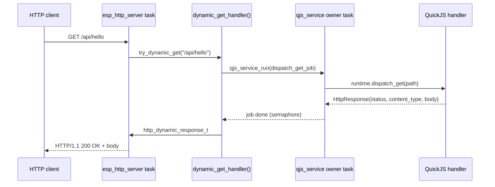

# ESP32-S3 QuickJS HTTP and Fetch: Owner Tasks, Promises, and Stored Scripts

This report closes out the ticket `ATOMS3R-M12-QUICKJS-HOST-FETCH`. It is the end-state companion to the earlier article [[ARTICLE - ESP32-S3 QuickJS HTTP and Fetch - From Firmware Static Serving to Host-Testable APIs]]. That earlier article ended with a host-native QuickJS HTTP binding core and a passing host smoke test, with the implementation files present in the working tree but not yet committed and not yet validated on hardware. This report covers everything that happened after that point: the firmware `http` namespace, dynamic route dispatch into the QuickJS owner task, a bounded firmware `fetch()` adapter, the Promise-draining bug that blocked console `fetch().then(...)`, explicit stored-script execution with `js run`, checked-in examples, and full hardware validation on the AtomS3R M12.

The central technical problem is serializing access to a single-threaded JavaScript runtime when an external event source arrives asynchronously. The HTTP server task receives network requests and must route some of them into JavaScript. The QuickJS runtime, however, belongs to one owner task, and only that task may touch `JSRuntime*` or `JSContext*`. The firmware solves this by never calling JavaScript from the server task. Every dynamic request becomes a plain-native job enqueued onto the owner task's queue, and the server task blocks on the job's completion semaphore. The same boundary governs `fetch()`: the JavaScript side calls a native operation that performs blocking network I/O on the owner task and returns a settled result. The report explains why each of these boundaries exists, where the implementation is subtle, and which invariants must hold for the system to remain reset-safe.

> [!summary]
> - The firmware now exposes a reset-safe global `http` namespace with `http.start()`, `http.stop()`, `http.static()`, `http.clearStatic()`, `http.status()`, and `http.get(path, handler)`.
> - Dynamic HTTP requests dispatch into JavaScript exclusively through `qjs_service_run()`; the `esp_http_server` task never calls `JS_Call` directly.
> - A bounded HTTP-only `fetch()` adapter built on `esp_http_client` works on the device, and console `fetch().then(...)` now resolves because `qjs_service_eval()` drains pending QuickJS Promise jobs after evaluation.
> - Stored scripts under the virtual storage roots run with `js run <virtual-path>`, with no boot-time autoload, preserving USB Serial/JTAG as the recovery path.
> - The ticket is closed: all 23 tasks complete, hardware-validated at `192.168.4.22`, final binary `0x16bd00` bytes, 64% app partition free.

## Why this report exists

The previous report established the design direction: a portable QuickJS HTTP binding core (`http_namespace_core.{h,cpp}`) shared between a desktop native host and the firmware, with platform I/O behind a `HostOps` callback table. At the time of that report, only the host path was demonstrated. Several questions were left explicitly open:

- Should firmware `fetch()` start as bounded blocking work, or be worker-backed from the beginning?
- Should `qjs_service_eval()` drain Promise jobs so `await fetch(...)` works in the console?
- Should the first dynamic route API use return-object handlers or a mutable Express-like response object?

This report answers each of those questions with the implemented, hardware-validated behavior. It also documents two defects found during hardware validation: a dynamic-response shape mismatch that produced silent `204 No Content` responses, and the missing Promise-job drain that left `fetch()` looking broken from the console. Both are worth recording because they are not obvious from reading the code, and they recur in any single-threaded-embedded-JavaScript system that exposes async APIs.

## Repository and artifact map

The source repository is:

```text
/home/manuel/workspaces/2025-12-21/echo-base-documentation/esp32-s3-m5
```

The primary firmware is `0103-atoms3r-m12-native-quickjs/`. The files that define the HTTP/fetch/stored-script work are:

| Path | Role |
|---|---|
| `main/http_namespace_core.h` | Portable QuickJS HTTP/fetch core interface: `HostOps`, `Runtime`, request/response DTOs. |
| `main/http_namespace_core.cpp` | JavaScript globals (`http`, `fetch`), route storage, handler duplication, response conversion, Promise wiring. |
| `main/http_namespace.h` | Firmware public install/clear API for the `http` namespace. |
| `main/http_namespace.cpp` | ESP-IDF adapter: `HostOps` callbacks into `http_server`, owner-task dynamic dispatch bridge, `esp_http_client` fetch. |
| `main/http_server.h` | Host-owned `esp_http_server` lifecycle, static mounts, dynamic GET handler contract. |
| `main/http_server.cpp` | Server lifecycle, `/healthz`, `/`, dynamic-first wildcard handler with static fallback, MIME detection, console commands. |
| `main/storage_namespace.h` / `.cpp` | Bounded virtual-rooted FatFs storage; now also exposes `storage_namespace_read_text_alloc` for `js run`. |
| `main/js_command.cpp` | Console commands; adds `js run <virtual-path>` and reset-time namespace reinstallation. |
| `main/CMakeLists.txt` | Adds `esp_http_client` component dependency for firmware fetch. |
| `host/native-http/` | Desktop QuickJS host that compiles the shared core against upstream QuickJS for off-device testing. |
| `host/native-http/tests/run-smoke.sh` | Host smoke test for `http.get()` dispatch and `fetch()`. |
| `examples/scripts/` | Checked-in source examples for static+routes and fetch. |
| `components/qjs_service/qjs_service.cpp` | Runtime owner task; now drains Promise jobs after eval. |

The ticket workspace is:

```text
ttmp/2026/06/25/ATOMS3R-M12-QUICKJS-HOST-FETCH--atoms3r-m12-quickjs-host-http-and-fetch-api/
```

The implementation commits, in order, are:

| Commit | Meaning |
|---|---|
| `3737dfd` | Shared QuickJS HTTP core plus desktop native host (host-tested). |
| `acae5fb` | Install firmware `http` namespace with reset-safe clear/reinstall. |
| `a0009cf` | Dispatch firmware dynamic GET routes through the owner task. |
| `faf621d` | Bounded firmware `fetch()` adapter using `esp_http_client`. |
| `05c8bc6` | Drain Promise jobs after eval so console `fetch().then()` resolves. |
| `e2afdf3` | `js run <virtual-path>` stored-script execution. |
| `02b13e0` | Checked-in example scripts and recovery/no-autoload documentation. |

## The two boundaries the design must respect

The firmware's QuickJS integration has two independent boundaries that must be respected at all times. Confusing them leads to the most common class of bug in embedded-JavaScript systems.

The first boundary is the **owner-task boundary**. The `components/qjs_service` service owns a single FreeRTOS task. That task creates the `JSRuntime`, creates the `JSContext`, installs globals, and runs every `JS_Eval` and every queued job. No other task in the system is allowed to call into QuickJS. The service enforces this with a FreeRTOS queue: callers from other tasks package their work into a `qjs_job_t`, enqueue it, and block on a binary semaphore until the owner task has executed the job. This is the same pattern that protects the runtime during `js eval` and `js reset`. The rule is absolute:

```text
Only the qjs_service owner task may touch JSRuntime* or JSContext*.
```

The second boundary is the **JavaScript-object-ownership boundary**. Every `JSValue` is reference-counted and bound to a specific runtime. A `JSValue` created in one `JSContext` is not valid after that context is freed. Route handlers registered with `http.get(path, handler)` are stored as duplicated `JSValue` references inside the shared core. If the runtime is reset without first releasing those references, the cleanup will free values that belong to a destroyed context, and the next allocation can corrupt the heap. Reset safety therefore has two mandatory steps: release all stored `JSValue` references before the context is destroyed, and reinstall a fresh namespace after the new context is created.

These two boundaries interact. HTTP requests arrive on the `esp_http_server` task, which is not the owner task. Dynamic route handlers are `JSValue`s, which are bound to the owner task's context. The design resolves the interaction by keeping all `JSValue` access inside the owner task and passing only plain-native data structures across the task boundary. A request becomes a `const char *path`. A response becomes a `qjs_http::HttpResponse` with `int status`, `std::string content_type`, and `std::string body`. Neither structure contains a `JSValue`.

## The shared binding core and the HostOps table

The portable core lives in `http_namespace_core.{h,cpp}`. It compiles without any ESP-IDF header. The firmware adapter and the desktop host both link it. The only thing that differs between the two is the set of native operations passed into the core, collected in the `HostOps` struct:

```cpp
struct HostOps {
    void *user = nullptr;
    int (*start)(void *user, uint16_t port) = nullptr;
    int (*stop)(void *user) = nullptr;
    int (*add_static_mount)(void *user, const char *url_prefix, const char *virtual_root) = nullptr;
    int (*clear_static_mounts)(void *user) = nullptr;
    int (*status)(void *user, HostStatus *out) = nullptr;
    int (*fetch)(void *user, const FetchRequest *req, FetchResult *out, std::string *error) = nullptr;
};
```

The core owns everything that is JavaScript-facing: the global `http` object, the `fetch` function, route storage, handler duplication, response conversion, and Promise construction. The `HostOps` callbacks own everything that is platform-facing: starting and stopping a server, registering a static mount, and performing an HTTP client request.

This split is deliberate. JavaScript API semantics should be defined exactly once. If the host and firmware each implemented their own `http.get()` binding, they would drift, and a host smoke test would no longer prove anything about firmware behavior. By forcing both adapters through the same core, a behavior change in the core is automatically a behavior change in both places. The host smoke test in `host/native-http/tests/run-smoke.sh` validates dispatch of an `http.get` route and a `fetch()` round-trip against an in-memory host server. Every firmware change in this ticket was checked against that smoke test before flashing.

The request and response DTOs that cross the `HostOps` boundary are plain C++ structures with `std::string` fields:

```cpp
struct FetchRequest {
    std::string url;
    std::string method = "GET";
    std::vector<Header> headers;
    std::string body;
    uint32_t timeout_ms = 1000;
    size_t max_response_bytes = 16 * 1024;
};
```

The core parses a JavaScript `fetch(url, options)` call into a `FetchRequest`, hands it to `ops.fetch`, and converts the returned `FetchResult` back into a JavaScript Response object with `text()` and `json()` methods that return Promises. The platform adapter never sees a `JSValue`. This is what makes the same core usable both on a desktop POSIX host and on an ESP32-S3.

## Phase map

The work proceeds in phases, each of which is independently validatable. The ordering is not accidental. Host testing comes before firmware validation, static serving comes before dynamic routes, and dynamic routes come before `fetch()`. Each phase adds exactly one new risk.

| Phase | Adds | Validated by | Commit |
|---|---|---|---|
| 0 | Host-owned `/healthz` server | `curl /healthz` on device | `7757d75` |
| 1 | Static serving from storage | `curl /static/index.html` on device | `3310933` |
| 2 | Shared core + desktop host | host smoke test | `3737dfd` |
| 3 | Firmware `http` namespace + reset safety | firmware build + host smoke | `acae5fb` |
| 4 | Dynamic GET dispatch via owner task | firmware build + host smoke | `a0009cf` |
| 5 | Bounded firmware `fetch()` adapter | firmware build + host smoke | `faf621d` |
| 6 | Promise job draining in `qjs_service_eval` | firmware build + hardware fetch | `05c8bc6` |
| 7 | `js run <virtual-path>` | hardware route registration | `e2afdf3` |
| 8 | Examples + recovery documentation | `node --check`, doctor | `02b13e0` |

Phases 0 and 1 were covered by the previous report. This report focuses on phases 3 through 8.

## The firmware HTTP namespace and reset safety

Phase 3 adds the firmware adapter `http_namespace.{h,cpp}`. Its job is to construct a `qjs_http::Runtime` with a firmware `HostOps` table and install the resulting global `http` object on the QuickJS owner task. Installation happens inside a `qjs_service_run()` job, because that is the only way to run code on the owner task:

```cpp
esp_err_t install_http_namespace(qjs_service_t *svc) {
    qjs_job_t job = {};
    job.fn = install_http_job;
    job.timeout_ms = 1000;
    return qjs_service_run(svc, &job);
}
```

The firmware `HostOps` table maps each callback to the corresponding `http_server_*` function:

```cpp
qjs_http::HostOps make_firmware_ops() {
    qjs_http::HostOps ops = {};
    ops.start = op_start;            // http_server_start(port)
    ops.stop = op_stop;              // http_server_stop()
    ops.add_static_mount = op_static;
    ops.clear_static_mounts = op_clear_static;
    ops.status = op_status;          // http_server_get_status(...)
    ops.fetch = op_fetch;            // esp_http_client adapter (Phase 5)
    return ops;
}
```

The important detail is that the runtime pointer is held in a file-scope static, `s_runtime`. That pointer must be cleared before the context is destroyed, or the stored route `JSValue`s will be freed against a dead context. The reset path therefore calls `clear_http_namespace_state()` before `qjs_service_reset()`, and reinstalls the namespace afterward. The sequence in `js_command.cpp` is:

```cpp
int cmd_reset() {
    clear_http_namespace_state(g_svc);     // delete Runtime, release JSValues
    esp_err_t err = qjs_service_reset(g_svc, kResetTimeoutMs);   // destroy + recreate context
    install_system_namespace(g_svc);
    install_storage_namespace(g_svc);
    install_wifi_namespace(g_svc);
    install_http_namespace(g_svc);         // fresh Runtime, fresh http global
    ...
}
```

The `clear_http_job` deletes the `qjs_http::Runtime`, which frees every stored route handler `JSValue` through the `Runtime` destructor, while the context is still valid. Only then does `qjs_service_reset()` destroy and recreate the context. The reinstallation creates a new `Runtime` bound to the new context, with an empty route table. Hardware validation confirmed this ordering: after `js reset`, `typeof http` is `"object"`, `/healthz` still works (because the native server is unaffected), and a previously registered dynamic `/api/hello` route returns `404` (because the new route table is empty).

## Dynamic route dispatch: the owner-task bridge

Phase 4 is the heart of the network-to-JavaScript bridge. The wildcard handler in `http_server.cpp` is registered with `httpd_uri_match_wildcard`, so every unmatched URI reaches `static_handler()`. That handler first tries a dynamic route, then falls back to static serving:

```cpp
esp_err_t static_handler(httpd_req_t *req) {
    if (try_dynamic_get(req)) {
        return ESP_OK;            // a dynamic route handled it
    }
    // ... otherwise map URL prefix to storage virtual root and stream the file
}
```

The `try_dynamic_get()` path does not call JavaScript. It calls a registered C function pointer of type `http_dynamic_get_handler_t`, passing only plain-native data:

```cpp
typedef esp_err_t (*http_dynamic_get_handler_t)(const char *path,
                                                http_dynamic_response_t *out,
                                                void *user);
```

The firmware registers this handler in `http_namespace.cpp` as `dynamic_get_handler()`. That function is the boundary crossing point. It packages the request path into a `DispatchGetJob`, enqueues it on the owner task via `qjs_service_run()`, and blocks until the owner task completes the job:

```cpp
esp_err_t dynamic_get_handler(const char *path, http_dynamic_response_t *out, void *user) {
    auto *svc = static_cast<qjs_service_t *>(user);
    DispatchGetJob dispatch = {};
    dispatch.path = path;
    qjs_job_t job = {};
    job.fn = dispatch_get_job;
    job.user = &dispatch;
    job.timeout_ms = 1000;
    esp_err_t err = qjs_service_run(svc, &job);   // blocks on owner task
    // ... convert dispatch.response into out
}
```

The job itself, `dispatch_get_job()`, runs on the owner task and is therefore allowed to call into the shared core:

```cpp
esp_err_t dispatch_get_job(JSContext *ctx, void *user) {
    auto *job = static_cast<DispatchGetJob *>(user);
    bool ok = s_runtime->dispatch_get(job->path, &job->response, &job->error);
    job->err = ok ? ESP_OK : ESP_ERR_NOT_FOUND;
    return ESP_OK;
}
```

The result is a clean separation of responsibilities. The HTTP server task owns the socket and the response writer. The owner task owns the JavaScript handler invocation. The only data that crosses between them is the request path and a plain-native response structure. The `esp_http_server` task blocks for the duration of the JavaScript handler, bounded by the job's 1000 ms timeout. This is acceptable for a first dynamic-route milestone because handlers are expected to be fast and synchronous. A later phase can move to a worker-backed design if long-running handlers become necessary.

The dispatch flow, showing which task owns each step:



No arrow in this diagram carries a `JSValue` across a task boundary. The `JSValue` handler exists only inside the owner task. This is the property that makes the design safe under concurrent HTTP traffic, WiFi events, and console interaction.

## The supported response shape

The shared core converts a handler's return value into an `HttpResponse`. The conversion rules are defined once in `convert_handler_result()` and matter because they determine what a handler must return to produce a non-empty body. The current rules are:

| Handler returns | Resulting response |
|---|---|
| A string | 200, body is the string, `text/plain; charset=utf-8` |
| `{ status: n, json: value }` | status `n`, body is `JSON.stringify(value)`, `application/json; charset=utf-8` |
| `{ status: n, text: s }` | status `n`, body is `s`, `text/plain; charset=utf-8` |
| `{ status: n, contentType: s, text: s }` | status `n`, body is `s`, content type `s` |
| An object with none of `json`/`text` | `204 No Content`, empty body |
| `undefined`/`null` | `204 No Content`, empty body |

The `204` fallback for an object without `json` or `text` is the source of a subtle failure mode. During hardware validation, a handler written as `{status: 200, headers: {...}, body: JSON.stringify(...)}` produced a silent `HTTP/1.1 204 No Content`. The request reached JavaScript, the handler ran, and the response was well-formed at the HTTP level, but the body was empty because the core did not recognize `headers`/`body` as a body-producing shape. The correct form for a JSON handler is `{json: {...}}`, which makes the core stringify the value and set the content type. This is documented in the firmware README and in the checked-in examples precisely because it is the first thing a developer writing a route handler will get wrong.

## Bounded firmware fetch

Phase 5 implements `ops.fetch` on firmware using the ESP-IDF `esp_http_client`. The host core already exposed a Promise-returning `fetch()`; the firmware needed an adapter that performs a real network request and returns a `FetchResult`.

The adapter is bounded on every axis the design identified as risky:

| Bound | Value |
|---|---|
| URL scheme | `http://` only |
| Methods | `GET`, `POST` |
| Request body | capped by the shared parser |
| Response body | `req->max_response_bytes` (16 KiB default) |
| Timeout | `req->timeout_ms` (1000 ms default, capped at 5000 ms by the parser) |
| I/O chunk | `kFetchChunkBytes` = 512 bytes |

The implementation follows the ESP-IDF open/write/fetch-headers/read/close lifecycle and must clean up the client handle on every error path. The read loop enforces the response cap twice: once against `Content-Length` when the header is present, and once incrementally while appending chunks, because a chunked transfer has no `Content-Length` and can exceed the cap only after headers are processed:

```cpp
char chunk[kFetchChunkBytes];
while (true) {
    int got = esp_http_client_read(client, chunk, sizeof(chunk));
    if (got == 0) break;
    if (got < 0) {
        if (got == -ESP_ERR_HTTP_EAGAIN) continue;   // tolerate transient timeout
        // ... cleanup and return error
    }
    if (out->body.size() + (size_t)got > req->max_response_bytes) {
        // ... cleanup and return ESP_ERR_INVALID_SIZE
    }
    out->body.append(chunk, (size_t)got);
}
```

The EAGAIN tolerance is a deliberate choice for a first milestone. `esp_http_client_read` can return `-ESP_ERR_HTTP_EAGAIN` when a read times out before data is ready. Retrying is correct for short transfers under the overall timeout, because the configured `timeout_ms` bounds the whole request. A production version should distinguish repeated EAGAIN from genuine progress, but the current loop is bounded by the job timeout and by the response size cap, so it cannot loop indefinitely.

The fetch adapter runs on the owner task because it is invoked from JavaScript. This means a `fetch()` call blocks the QuickJS owner task for the duration of the network request. For the first milestone this is acceptable: requests are small, timeouts are short, and the device is single-user. The design leaves open a move to a worker-backed Promise settlement path, in which the owner task would start the request, yield, and resume the Promise when the worker completes. The shared core would not need to change for that move, because the `ops.fetch` contract is synchronous at the adapter boundary and Promise-shaped only at the JavaScript boundary.

## The Promise-draining defect

Phase 6 fixes the defect that made firmware `fetch()` appear broken from the console. The host smoke test passed, the firmware built, the device was connected, and the following console input was run:

```text
js eval "fetch('http://192.168.4.22/healthz').then(function(r){ print('status='+r.status); return r.text(); }).then(function(t){ print('body='+t); })"
```

The console reported:

```text
[atoms3r-eval] ok=1 timed_out=0 elapsed=256ms
[object Promise]
```

The fetch adapter had succeeded, the network request had completed in 256 ms, but the two `print` statements never ran. The reason is structural. In QuickJS, `fetch()` returns a resolved Promise, but the `.then()` callbacks are not run immediately. They are scheduled as pending jobs on the runtime's job queue. A QuickJS host is responsible for executing that queue with `JS_ExecutePendingJob()`. The console's `qjs_service_eval()` called `JS_Eval()` and returned the resulting value, but it never drained the job queue. The Promise was resolved, the callbacks were queued, and nothing ever ran them.

The desktop host did not have this problem because its runner explicitly called `JS_ExecutePendingJob()` in a loop after evaluation. The firmware service had no equivalent loop. This is the kind of defect that is invisible on a host that happens to do the right thing, and only surfaces when the same binding core is moved to a runtime service with different draining behavior.

The fix adds a bounded drain to the `MSG_EVAL` path in `qjs_service.cpp`. After a successful `JS_Eval`, the service now calls `drain_pending_jobs()`:

```cpp
static bool drain_pending_jobs(Service* s, qjs_eval_result_t* out) {
    int jobs = 0;
    for (;;) {
        if (s->deadline_us != 0 && esp_timer_get_time() > s->deadline_us) {
            // timed out while draining
            return false;
        }
        JSContext* job_ctx = nullptr;
        int rc = JS_ExecutePendingJob(s->rt, &job_ctx);
        if (rc == 0) return true;          // no more pending jobs
        if (rc < 0) {                       // a job threw
            fill_exception_ctx(job_ctx ? job_ctx : s->ctx, out);
            return false;
        }
        if (++jobs >= kMaxPendingJobsPerEval) {   // 64-job cap
            return false;
        }
    }
}
```

The drain runs inside the same deadline window as the original eval, so a long Promise chain cannot exceed the eval timeout. It is capped at 64 jobs per eval to prevent an unbounded microtask loop from hanging the owner task. After this change, the same console input produced:

```text
[atoms3r-eval] ok=1 timed_out=0 elapsed=261ms
fetch status=200 ok=true
fetch body=ok

[object Promise]
```

The two `print` lines now appear because the `.then()` callbacks ran during the drain. This is the single most important correctness fix in the ticket, because without it `fetch()` is unusable from the console even though the adapter is correct.

The boundary chosen for draining is eval-only. `qjs_service_run()` jobs, such as the dynamic GET dispatch, do not drain pending jobs after the job returns. This is deliberate for the first milestone. The dynamic dispatch is synchronous from the server task's perspective: the handler returns a response object, the job converts it, and the server sends the response. There is no Promise crossing that boundary in the current dynamic-route path. If a future handler returns a Promise that the framework must await before sending the response, the drain boundary will need to move into the dispatch job. That is a known open question, recorded in the diary, not an oversight.

## Stored scripts with js run

Phase 7 makes the HTTP route workflow reusable. Pasting a long quoted JavaScript expression through `js eval` is fragile: shell quoting, console line editing, and the 2048-byte eval buffer all conspire against multiline route setup. The `js run <virtual-path>` command reads a script from the bounded storage namespace and evaluates it with the virtual path as the QuickJS filename:

```cpp
int cmd_run(const char *virtual_path) {
    char *source = nullptr;
    size_t len = 0;
    esp_err_t read_err = storage_namespace_read_text_alloc(
        virtual_path, kMaxRunBytes, &source, &len);   // 16 KiB cap
    // ...
    qjs_eval_result_t r = {};
    esp_err_t eval_err = qjs_service_eval(
        g_svc, source, len, kDefaultEvalTimeoutMs, virtual_path, &r);
    // ...
}
```

The command reuses the existing bounded storage read path, which already enforces virtual-root validation (`/scripts`, `/data`, `/tmp`), path normalization, mount checks, and the 16 KiB read cap. No new filesystem capability is exposed. The virtual path is passed as the QuickJS eval filename so that error messages reference the stored script rather than `<eval>`. Hardware validation confirmed the workflow:

```text
storage write /scripts/server.js http.get('/run/hello',function(req){return{json:{ok:true,path:req.path}};})
js run /scripts/server.js
```

```text
[/scripts/server.js] ok=1 timed_out=0 elapsed=3ms
[object Object]
```

```bash
curl http://192.168.4.22/run/hello
# {"ok":true,"path":"/run/hello"}
```

The script runs in the global scope, so `http.get(...)` registers a route on the existing global `http` object. The route persists across console commands until `js reset`, exactly like a route registered with `js eval`. This is the property that makes stored scripts a real alternative to pasted one-liners.

## The recovery-safe no-autoload policy

The firmware deliberately does not run scripts at boot. This is a design decision, not an omission. A stored script can register HTTP routes, start network-facing behavior, and run arbitrary JavaScript on every request. If such a script ran automatically at boot and contained an error, the device could become unreachable over the network, and the only recovery path would be USB Serial/JTAG. The firmware already depends on USB Serial/JTAG as the authoritative recovery path because the AtomS3R build has no display.

The recovery policy is therefore:

- Scripts are stored as files under `/scripts`, `/data`, or `/tmp`.
- Scripts run only when an operator types `js run <virtual-path>`.
- A bad dynamic route is recoverable with `js reset`, which clears all QuickJS-owned routes while leaving the native server running.
- The native `/healthz` endpoint survives `js reset` because it is owned by `http_server`, not by QuickJS.
- Boot-time autoload should not be added until there is a documented disable mechanism, such as a boot-time key check or a safe-mode flag.

This policy is documented in the firmware README and in `examples/scripts/README.md` so that future work does not quietly reintroduce autoload.

## Hardware validation evidence

The final build was flashed to the AtomS3R M12 over the by-id USB Serial/JTAG path:

```text
/dev/serial/by-id/usb-Espressif_USB_JTAG_serial_debug_unit_B4:3A:45:BE:16:80-if00
```

Boot confirmed ESP32-S3-PICO-1, 8 MB flash, 8 MB octal PSRAM at 80 MHz, and QuickJS runtime init in 9 ms. WiFi autoconnected from persisted NVS credentials and received IP `192.168.4.22`. The HTTP server was started with `http start 80`, a static mount was added with `http static /static /data`, and an asset was written with `storage write /data/index.html static-html`.

The external validation matrix:

| Check | Command | Result |
|---|---|---|
| Health | `curl http://192.168.4.22/healthz` | `200 OK`, body `ok` |
| Static | `curl http://192.168.4.22/static/index.html` | `200 OK`, `text/html`, body `static-html` |
| Dynamic | `curl http://192.168.4.22/api/hello` | `200 OK`, `application/json`, body `{"ok":true,"method":"GET","path":"/api/hello"}` |
| Firmware fetch | `js eval "fetch(.../healthz).then(...)"` | `fetch status=200 ok=true`, `fetch body=ok` |
| Stored script | `js run /scripts/server.js` then `curl /run/hello` | `200 OK`, body `{"ok":true,"path":"/run/hello"}` |
| Reset clears routes | `js reset` then `curl /api/hello` | `404 Not Found` |
| Reset keeps health | `js reset` then `curl /healthz` | `200 OK`, body `ok` |
| Reset reinstalls namespace | `js eval "typeof http"` | `object` |

The monitor log for the dynamic route and fetch confirmed the dispatch path end to end:

```text
I (90185) 0103_http: dynamic /api/hello status=200 bytes=46
I (47835) 0103_http: dynamic /run/hello status=200 bytes=31
```

The final binary size, after Promise draining and `js run`, is:

```text
0103-atoms3r-m12-native-quickjs.bin binary size 0x16bd00 bytes.
0x294300 bytes (64%) free in the 4 MiB app partition.
```

The memory posture at idle, with WiFi, QuickJS, and the HTTP server installed, is roughly 75 KiB of internal heap free and the full QuickJS heap (1 MiB cap) largely unused. The 64% free app partition means there is headroom for a future HTTPS/TLS step, though TLS will add measurable binary size and heap pressure that should be measured separately before committing to it.

## Tricky details and failure modes

Several details in this work are not obvious from the code and are worth recording explicitly.

**Dynamic response shape mismatch produces silent 204s.** A handler returning `{headers, body}` instead of `{json}` or `{text}` produces `204 No Content` with no error. The request reaches JavaScript and the handler runs, so the failure looks like a dispatch bug when it is actually a response-contract mismatch. The fix is documentation, not code: the README and examples show the supported shapes.

**Promise callbacks require host-side draining.** A resolved Promise is useless if the job queue is never executed. The host runner drained jobs; the firmware service did not, until the defect was found. Any single-threaded embedded JavaScript system that exposes a Promise-returning API must drain the job queue at the point where control returns to the host, or async APIs will appear broken.

**Route JSValues must be released before context destruction.** Reset safety depends on calling `clear_http_namespace_state()` before `qjs_service_reset()`. Reversing the order frees values against a destroyed context. The ordering is enforced by the reset command sequence, not by the runtime, so it is a latent risk if a future reset path bypasses the command.

**HTTP server tasks must not call JavaScript directly.** The dynamic dispatch bridge exists precisely to prevent this. Any future optimization that lets the server task call a handler directly would reintroduce a data race on the QuickJS runtime. The `qjs_service_run()` indirection is the load-bearing safety property.

**Response size must be enforced incrementally.** A chunked HTTP response has no `Content-Length`, so the fetch adapter cannot reject an oversized response from headers alone. The read loop checks the cap on every chunk. Removing that check would let a malicious or buggy server exhaust device memory.

**EAGAIN must not be treated as a fatal error in the read loop.** ESP-IDF's HTTP client returns `-ESP_ERR_HTTP_EAGAIN` on transient read timeouts. Treating it as fatal would make otherwise-successful fetches fail under minor network latency. The current loop retries, bounded by the overall timeout.

**Virtual path validation must not be bypassed.** `js run` accepts any storage virtual root (`/scripts`, `/data`, `/tmp`) because it reuses the storage validation. Adding a native-path shortcut would break the security boundary that keeps the FatFs mount point out of JavaScript.

## Working rules

The following rules are the durable output of this work. They generalize beyond the AtomS3R to any embedded JavaScript system that exposes network APIs on a single-threaded runtime.

- Keep all `JSValue` access on the owner task. Cross task boundaries with plain-native structures only.
- Define JavaScript API semantics once, in a portable core, and force every adapter through it.
- Make async APIs Promise-shaped at the JavaScript boundary and synchronous at the adapter boundary, so the core does not need to know how the platform performs I/O.
- Drain the Promise job queue wherever control returns to the host after an eval. A resolved Promise is not observable until its jobs run.
- Release all stored `JSValue` references before destroying a context, and reinstall namespaces after recreating one.
- Bound network I/O on every axis: scheme, method, request body, response body, timeout, and chunk size.
- Serve static assets outside the JavaScript heap. Do not read asset bytes into the runtime for ordinary requests.
- Keep an unauthenticated, non-JavaScript health endpoint available at all times, so a broken script does not make the device unreachable.
- Do not autoload scripts at boot until there is a documented disable or safe-mode mechanism.

## Open questions and near-term next steps

The ticket is closed, but the work leaves several questions open for follow-on tickets.

The first is whether dynamic dispatch should await Promises. Today, a route handler must return a plain response object synchronously. A handler that wants to do async work, such as calling `fetch()` from inside a route, has no way to defer the response. Moving the Promise-drain boundary into the dispatch job would allow `async` handlers, at the cost of a more complex server-task blocking model.

The second is whether `fetch()` should move to a worker-backed settlement path. The current adapter blocks the owner task for the full request duration. For a single-user device with short requests this is fine. For concurrent requests or longer transfers, a worker task that starts the request and resumes the Promise on completion would keep the owner task responsive.

The third is TLS. The current `fetch()` is `http://` only. HTTPS would require a certificate policy, measurable mbedtls binary growth, and heap budgeting that the current milestone deliberately defers.

The fourth is the upload workflow. The `storage write` console command accepts a single text argument, which is adequate for compact one-line scripts but awkward for multiline files. A host-side upload helper, or a base64-encoded upload command, would make the checked-in examples easier to deploy to a real device.

The fifth is script autoload with a disable mechanism. Once a safe-mode or boot-time key check exists, stored scripts could run at boot without sacrificing recoverability. Until then, explicit `js run` remains the correct default.

## Related notes

- [[ARTICLE - ESP32-S3 QuickJS HTTP and Fetch - From Firmware Static Serving to Host-Testable APIs]] — the earlier report covering the host-owned server, static serving, and the host-native binding core.
- [[ARTICLE - QuickJS Native Modules on ESP32-S3 - Implementing Firmware JavaScript Namespaces]] — the foundation report on the owner-task model and reset-safe namespaces.
- [[ARTICLE - QuickJS Native Modules on ESP32-S3 - HTTP Static Assets Host Tests and Fetch]] — the native-modules follow-up covering static assets and host fetch tests.
