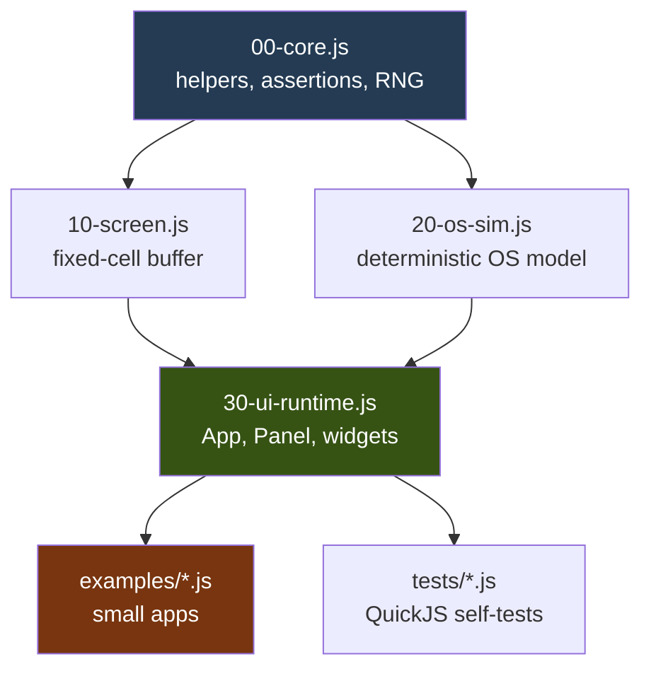

# PicoCalc QuickJS DSL: Native and Portable Runtime Deep Dive

This article explains the implementation of the PicoCalc QuickJS DSL developed under `0102-esp32-p4-visual-quickjs-repl/js/**`. The DSL exists to let small JavaScript programs describe a fixed-cell visual interface for the ESP32-P4 PicoCalc while remaining testable on a desktop. The implementation now has two forms: a portable JavaScript runtime that runs under `qjs`, and a C++ native host prototype that embeds QuickJS and implements the first API surface from the C++ side.

The main design question is where the DSL should live. The early runtime implements the API in JavaScript so examples and tests can move quickly. The native host then moves the same API direction into C++ bindings, which is the path that can later become firmware code. The JavaScript implementation proves the user-facing shape; the C++ implementation proves the ownership and embedding model.

> [!summary]
> - The DSL is a fluent JavaScript API for constructing fixed-cell PicoCalc interfaces: `OS.app()`, `app.layout()`, `app.panel()`, `panel.text()`, `panel.gauge()`, and related builders.
> - The portable runtime implements the DSL in JavaScript for desktop QuickJS testing, deterministic snapshots, example scripts, and bundle generation.
> - The native host implements the beginning of the same API in C++ using QuickJS C APIs, with a deliberate split between firmware-portable runtime code and host-only terminal input/rendering.
> - The current work is mergeable as desktop/JS/native-host groundwork, but the native C++ API is not yet a drop-in firmware component.

## Why this note exists

The PicoCalc visual REPL project needs a scripting surface that is smaller and more controlled than a browser application model. The firmware runtime provides QuickJS and a few host globals. The display is a fixed-cell screen. The keyboard produces semantic input events. The intended user experience is a visual JavaScript REPL where scripts can draw panels, update text, react to keys, and run simple loops without importing libraries or accessing host files.

The implementation had to satisfy three constraints at once. First, scripts must be portable enough to run on desktop QuickJS and later on the device. Second, the API must be expressive enough to describe useful visual programs on a 40-column display. Third, the long-term firmware direction should not require a large JavaScript framework to be evaluated on the device before user scripts can run. The result is a staged DSL implementation: prove the shape in JavaScript, then move the API ownership into native C++ bindings.

This note focuses on the DSL implementation. It does not document the whole ESP32-P4 firmware, LCD driver, keyboard driver, or UART console. Those systems define the eventual integration boundary, but the code discussed here is the DSL layer and the desktop infrastructure around it.

## Source layout

The relevant source tree is rooted at:

```text
/home/manuel/workspaces/2025-12-21/echo-base-documentation/esp32-s3-m5-js/0102-esp32-p4-visual-quickjs-repl/js
```

The implementation is split into portable JavaScript, examples, tests, host tools, and native C++ host code.

```text
js/
├── README.md
├── host-shim.js
├── lib/
│   ├── 00-core.js
│   ├── 10-screen.js
│   ├── 20-os-sim.js
│   └── 30-ui-runtime.js
├── examples/
│   ├── hello-api.js
│   ├── dashboard.js
│   ├── sysmon.js
│   ├── snake.js
│   └── calc.js
├── examples-native/
│   ├── hello-native.js
│   ├── dashboard-native.js
│   └── layout-native.js
├── tests/
│   ├── run-smoke.sh
│   ├── run-api-tests.sh
│   ├── run-examples.sh
│   ├── run-bundle-smoke.sh
│   ├── run-interactive.sh
│   ├── run-native-host.sh
│   └── run-native-smoke.sh
└── tools/
    ├── interactive-host.js
    └── native-host/
        ├── Makefile
        ├── README.md
        └── src/
            ├── main.cpp
            ├── pico_native_api.cpp
            └── pico_native_api.hpp
```

The important distinction is between `lib/` and `tools/native-host/src/`. The `lib/` directory implements the DSL as JavaScript. The native host implements the DSL as QuickJS C++ bindings. They currently overlap in API shape but not in implementation depth.

## The host contract

The portable script contract is intentionally small. Application scripts assume only three globals:

```js
print(...args)
millis()
gc()
```

`host-shim.js` installs these on desktop QuickJS. Firmware already exposes the same set through native QuickJS bindings. This shared contract is the reason scripts in `examples/` can run on a desktop and remain candidates for paste/embed testing on the device.

The forbidden APIs matter as much as the allowed APIs. Portable examples avoid `console.log`, `require`, `import`, Node modules, QuickJS `std`/`os`, browser DOM APIs, network APIs, and filesystem APIs. The interactive desktop host does use `qjs --std`, but that usage is deliberately confined to `tools/interactive-host.js`. The app/runtime code remains portable.

The test runner uses QuickJS include files to load the runtime before each test:

```bash
qjs \
  -I js/host-shim.js \
  -I js/lib/00-core.js \
  -I js/lib/10-screen.js \
  -I js/lib/20-os-sim.js \
  -I js/lib/30-ui-runtime.js \
  js/tests/ui-runtime-test.js
```

This is a deliberate file-loading discipline. It avoids modules while still making runtime pieces testable as separate files.

## DSL surface

The DSL describes a fixed-cell application. The top-level object is `OS`; it creates an `App`. The app owns state, layout, panels, timers, loops, key bindings, and a status bar. A panel owns widgets. Widgets draw into a screen buffer.

A minimal example shows the intended style:

```js
var rt = Pico.createRuntime({ cols: 40, rows: 30, seed: 1 });
var OS = rt.OS;
var app = OS.app("hello");
var st = app.state({ n: 0, last: "" });

var p = app.panel("main").frame("rounded").title(" hello ");
p.text("picoOS DSL").at("center", 2).bold().fg("cyan");
p.text(function () { return "ticks: " + st.n; }).at("center", 4);

app.on("tick", 1000, function () { st.n++; });
app.key("a", function () { st.last = "a"; });
app.statusbar("a working starter");
app.mount();

rt.runFrame(1000);
rt.sendKey("a");
print(rt.renderText());
```

The fluent API is not syntactic decoration. It encodes ownership. `OS.app()` creates the current application. `app.panel()` allocates a panel region. `panel.text()` registers a draw item. `app.mount()` marks the app as the one the runtime will frame. `rt.runFrame(dt)` advances timers and renders the draw list into the screen buffer.

The central rule is that values can be literals or functions. A text widget can store `"picoOS DSL"` or `function () { return "ticks: " + st.n; }`. The widget does not need to know whether the value is static or reactive. The runtime resolves the value during rendering.

## Architecture of the portable JavaScript runtime

The portable runtime has four files. Each file adds one level of responsibility and extends the same `Pico` namespace.

| File | Responsibility |
|---|---|
| `lib/00-core.js` | Assertions, test runner, numeric helpers, deterministic RNG, value resolution helpers. |
| `lib/10-screen.js` | Fixed-cell screen buffer, clipping, text writes, lines, boxes, and text snapshots. |
| `lib/20-os-sim.js` | Deterministic OS simulation: clock, metrics, process list, files, chat, music, calculator parser, snake state. |
| `lib/30-ui-runtime.js` | DSL runtime: apps, layout, panels, widgets, timers, loops, key dispatch, status bar, frame rendering. |

The direction of dependency is strict. Screen code does not know about OS simulation. OS simulation does not know about widgets. The UI runtime depends on the screen and OS layers. Tests load these files in order.



The implementation path is deliberately testable at every level. The screen buffer can be tested without an app. The OS simulator can be tested without rendering. The UI runtime can be tested with small apps that assert screen contents. The examples can be run as visual smoke tests.

## The screen buffer

The screen buffer is the lowest visual abstraction. It stores a rectangular grid of cells, each with a character and style metadata. The current text renderer emits plain snapshots; the style fields are preserved for future renderers and for alignment with the firmware model.

The screen API is small:

```js
var s = Pico.makeScreen(40, 30);
s.clear();
s.set(x, y, ch, style);
s.text(x, y, "hello", style);
s.hline(x, y, width, "─", style);
s.vline(x, y, height, "│", style);
s.box(x, y, width, height, "rounded", style);
print(s.toText());
```

The most important invariant is clipping. A write outside the screen is ignored. A string that crosses the right edge writes only the cells that fit. This property matters because the DSL is intended for a small display, and layout mistakes should not crash the runtime.

The screen buffer also defines the fixed-cell output contract for tests. `toLines(false)` returns exact-width rows, while `toText()` trims trailing spaces for readable terminal output. This lets tests assert hard geometry while humans can inspect compact snapshots.

## The app frame path

A frame is the unit of runtime progress. It receives elapsed milliseconds, updates state, clears the screen, and draws the current app. In the JavaScript implementation this logic lives in `App.prototype._frame` in `lib/30-ui-runtime.js`.

The essential control flow is:

```js
App.prototype._frame = function (dt) {
  for each timer:
    timer.acc += dt
    if timer.acc >= timer.ms:
      timer.acc = 0
      timer.fn(this)

  for each fixed-rate loop:
    loop.acc += dt
    while loop.acc >= 1000 / loop.fps:
      loop.acc -= 1000 / loop.fps
      loop.fn(this)

  for each compute callback:
    compute(this)

  screen.clear()
  draw registered panel/widget draw functions in z order
  draw statusbar if present
}
```

This is not a retained DOM. It is also not immediate terminal printing. The app owns registered draw functions. Each frame resolves current state and writes into a deterministic screen buffer. That model is close to the firmware target because firmware ultimately needs to draw fixed rows or dirty cells, not manipulate browser elements.

The key-routing path is similarly explicit:

```js
App.prototype._fireKey = function (tok) {
  if (this._keys[tok]) {
    this._keys[tok](this, tok)
    return
  }

  var f = this._focus()
  if (!f) return

  if (tok is arrow and f.move) f.move(tok)
  else if (tok is enter and f.activate) f.activate()
  else if (f.type) f.type(tok)
}
```

This gives the DSL two ways to react to input. Apps can bind keys directly with `app.key("a", fn)`, and focusable widgets can implement `move`, `activate`, or `type`. The first path is simple for examples. The second path is the right direction for menus, tables, editors, and forms.

## Layout and panel ownership

The layout implementation is single-axis at this checkpoint. An app can define rows or columns. Each segment has either a fixed size or `"*"`, and the final segment fills remaining space. The app reserves the final screen row for the status bar, so row layouts operate over `screen.rows - 1`.

The core algorithm is compact:

```js
fixed = sum(numeric segment sizes)
stars = count("*" segments)
starSize = floor((total - fixed) / stars)
pos = 0

for each segment:
  size = segment.size == "*" ? starSize : parseInt(segment.size)
  if last segment:
    size = total - pos
  regions[segment.id] = rect(axis, pos, size)
  pos += size
```

The panel system consumes those regions. If `app.panel("body")` has a matching layout region, the panel uses it. Otherwise it defaults to the full app area above the status bar. A panel with a frame has an inner content rectangle one cell smaller on each side. Widgets draw in that content coordinate system.

This sequence is important because it determines where responsibility lives:

- The app owns named regions.
- The panel owns frame/title/footer rendering.
- The widget owns local placement inside the panel content rectangle.
- The screen owns clipping.

Each responsibility is small enough to port to firmware without requiring JavaScript-side layout computation forever.

## OS simulation and deterministic examples

The OS simulator exists so examples can be meaningful before firmware bindings exist. It provides a controlled subset of device-like state: battery, metrics, clock, process list, files, chat, music, calculator evaluation, and snake state. The key design decision is determinism. Random-looking data comes from a seeded linear congruential generator, not from uncontrolled host randomness.

The calculator implementation is a useful example. The browser prototype used JavaScript evaluation for expressions. The portable runtime instead implements a small parser. It supports enough syntax for the example (`+`, `-`, `*`, `/`, `^`, `×`, `÷`, `√`, `π`, degree-based `sin/cos/tan`) without exposing arbitrary host execution.

This is the right direction for firmware. A calculator example should not require a second eval path inside the scripting environment. The user script is already running in QuickJS; a calculator helper should be a constrained expression function or a native binding, not unrestricted code generation.

## Example programs

The example set is intentionally small. Each example demonstrates one class of DSL behavior.

| Example | Demonstrates |
|---|---|
| `hello-api.js` | Minimal app, panel, text widgets, timer, direct key binding. |
| `dashboard.js` | Layout, title bars, battery gauge, menu selection, status bar. |
| `sysmon.js` | Gauges, sparkline, process table, live simulated metrics. |
| `snake.js` | Grid rendering, fixed-rate loop, semantic arrow keys. |
| `calc.js` | Computed state and the safe expression parser. |

The example runner prints snapshots for all examples:

```bash
0102-esp32-p4-visual-quickjs-repl/js/tests/run-examples.sh
```

The bundle runner creates a single paste/embed candidate:

```bash
0102-esp32-p4-visual-quickjs-repl/js/tests/bundle-example.sh hello-api > /tmp/hello-api.bundle.js
qjs -I 0102-esp32-p4-visual-quickjs-repl/js/host-shim.js /tmp/hello-api.bundle.js
```

The bundle deliberately excludes `host-shim.js`. The device already owns `print`, `millis`, and `gc`. Keeping the shim out of the bundle preserves the firmware contract.

## The interactive JavaScript host

The first interactive host is still a JavaScript host. It runs under desktop QuickJS with `--std` so it can read lines from stdin. It loads the portable runtime, loads an example, keeps the runtime state alive, and accepts commands such as:

```text
open snake
key down
frame 130
run 10 100
show
quit
```

This host is useful for development, but it is not the firmware direction. It uses QuickJS `std` and file loading. The value of this host is manual exploration of the portable JS runtime. It shows that the examples can react to state changes and key tokens over time rather than only printing one snapshot.

The implementation is intentionally isolated in `tools/interactive-host.js`. That file is allowed to be non-portable because it is a desktop tool. The runtime and examples remain portable.

## The native C++ host

The native host is the more important step for firmware. It embeds QuickJS directly and implements the first picoOS API surface as native C++ bindings. JavaScript sees an `OS` object and fluent builders; C++ owns the objects behind those builders.

The boundary is explicit:

| File | Intended portability |
|---|---|
| `tools/native-host/src/pico_native_api.hpp` | Public C++ runtime boundary. Candidate firmware-facing API shape. |
| `tools/native-host/src/pico_native_api.cpp` | Native QuickJS API implementation. Candidate firmware-portable core after cleanup and splitting. |
| `tools/native-host/src/main.cpp` | Desktop-only terminal program. Uses termios, ANSI redraw, host file loading. |

The native host currently implements a small subset:

```text
print, millis, gc
OS.app
OS.clock
OS.launch
App.state
App.layout
App.panel
App.on
App.key
App.statusbar
App.mount
App.exit
Layout.row
Layout.col
Panel.frame
Panel.title
Panel.titleRight
Panel.text
Panel.gauge
Text/Gauge fluent methods
```

A native example is therefore thin:

```js
const app = OS.app('layout')
app.layout(l => l.row(1, 'bar').row('*', 'body'))

app.panel('bar')
  .frame('rounded')
  .title(' native layout ')
  .titleRight(() => OS.clock('HH:mm'))

const body = app.panel('body').frame('rounded')
body.text('layout regions').at('center', 2).bold().fg('cyan')
body.gauge().at(4, 5).label('batt').value(() => OS.battery).width(18).showPct()

app.statusbar('layout native · q exits host')
app.mount()
```

The key point is that JavaScript no longer implements `App`, `Layout`, `Panel`, `Text`, or `Gauge`. It calls native constructors and methods. This matches the firmware direction: user scripts describe UI; firmware-owned code stores state, computes geometry, handles timers, and renders.

## Native host data flow

The native host has two loops. QuickJS evaluates the example once. The C++ event loop then repeatedly polls terminal input, sends semantic keys to the current app, advances timers, renders the native screen buffer, and writes an ANSI snapshot to the terminal.

```mermaid
flowchart TD
    JS[Native example JS]
    QJS[Embedded QuickJS]
    API[pico_native_api.cpp]
    State[Native App / Panel / Widget state]
    Input[main.cpp raw keyboard]
    Frame[runtime_run_frame(dt)]
    Screen[Native fixed-cell screen]
    ANSI[ANSI terminal redraw]

    JS --> QJS
    QJS --> API
    API --> State
    Input --> API
    API --> Frame
    Frame --> State
    State --> Screen
    Screen --> ANSI

    style API fill:#1e3a8a,color:#fff
    style State fill:#365314,color:#fff
    style Input fill:#7f1d1d,color:#fff
    style ANSI fill:#374151,color:#fff
```

This split matters for firmware reuse. `main.cpp` is not portable to ESP-IDF because it uses host terminal APIs. The runtime API file can be adapted because its responsibilities match firmware needs: own QuickJS-exposed objects, map methods to native state mutations, and render into a screen abstraction.

## QuickJS value ownership in the native API

QuickJS native bindings require careful value ownership. If C++ stores a JavaScript callback or literal, it must duplicate the value. If C++ no longer needs it, it must free the value before the context disappears. The first native host checkpoint intentionally leaked the runtime on exit. That was acceptable only as a proof of concept. The current implementation uses a move-only RAII wrapper named `StoredValue`.

The shape is:

```cpp
struct StoredValue {
  JSContext *ctx = nullptr;
  JSValue value = JS_UNDEFINED;

  StoredValue() = default;
  StoredValue(JSContext *c, JSValueConst v) : ctx(c), value(JS_DupValue(c, v)) {}
  StoredValue(const StoredValue &) = delete;
  StoredValue &operator=(const StoredValue &) = delete;
  StoredValue(StoredValue &&other) noexcept;
  StoredValue &operator=(StoredValue &&other) noexcept;
  ~StoredValue() { reset(); }

  void reset() {
    if (ctx && !JS_IsUndefined(value)) JS_FreeValue(ctx, value);
    ctx = nullptr;
    value = JS_UNDEFINED;
  }
};
```

This design prevents accidental shallow copies. Timers and widgets own `StoredValue` fields. The runtime destroys the native app before freeing the QuickJS context, which lets stored callbacks release their duplicated values while the context is still valid.

Callback return values also require explicit release. Fluent APIs often return objects from callbacks, even when C++ ignores the return value. For example, `app.layout(l => l.row(1, 'bar').row('*', 'body'))` returns the layout object from the arrow function. Native code must free that return value.

The corrected pattern is:

```cpp
JSValue ret = JS_Call(ctx, argv[0], JS_UNDEFINED, 1, &layout_obj);
JS_FreeValue(ctx, ret);
JS_FreeValue(ctx, layout_obj);
```

The same rule applies to timer and key callbacks. This is not optional in firmware. A desktop process can hide leaks for a short time; a device runtime cannot.

## Native layout binding

Native layout support is implemented in C++ through a short-lived `Layout` wrapper. `App.layout(fn)` creates a native `Layout`, passes a JS wrapper into the callback, and stores computed regions on the app. The layout object is intended for synchronous builder use only.

The recomputation algorithm mirrors the JavaScript runtime:

```cpp
fixed = sum(numeric segment sizes)
stars = count("*" segments)
star_size = stars ? max(1, (total - fixed) / stars) : 0
pos = 0

for each segment:
  sz = segment.size == "*" ? star_size : atoi(segment.size)
  if last segment:
    sz = total - pos
  app.regions[segment.id] = rect(axis, pos, sz)
  pos += sz
```

`App.panel(id)` then checks `app.regions`. If the region exists, the panel receives that rectangle. If it does not exist, the panel defaults to the full app area above the status bar. This gives the firmware path a clear ownership model: JavaScript names regions; native code computes and stores rectangles.

## Testing strategy

The test suite has four levels.

```text
run-smoke.sh           # minimal portable QuickJS contract
run-api-tests.sh       # core/screen/OS/UI runtime tests
run-bundle-smoke.sh    # generated bundle validation
run-native-smoke.sh    # C++ native host validation
```

The native smoke test is especially important. It runs the native host through piped key input and verifies output content. It also exercises teardown. The previous `JS_FreeRuntime` assertion was discovered through this kind of scripted run.

```bash
0102-esp32-p4-visual-quickjs-repl/js/tests/run-native-smoke.sh
```

Expected output:

```text
PASS native hello-native
PASS native dashboard-native
PASS native layout-native
```

This test is not a full UI test framework. It is a regression check for the host executable, native bindings, key dispatch, layout, and clean runtime exit.

## Current implementation status

The DSL work is ready to merge as desktop/JS/native-host groundwork. It is not ready to compile directly into firmware as a component. The distinction matters.

Ready now:

- Portable QuickJS examples and tests.
- Deterministic screen snapshots.
- Bundle generation for paste/embed candidates.
- Line-oriented interactive desktop host.
- Native C++ QuickJS host prototype.
- Native `OS`, `App`, `Layout`, `Panel`, `Text`, and `Gauge` bindings.
- Native smoke tests that validate key input, launch behavior, layout, and clean QuickJS teardown.

Not ready yet:

- ESP-IDF component structure for the native API.
- Firmware renderer adapter from native screen buffer to `visual_repl` or LCD blits.
- Firmware keyboard adapter from PicoCalc key events to DSL semantic tokens.
- Complete widget set.
- Native focus routing for menu/table/editor-style widgets.
- Callback exception reporting.
- Memory limit and interrupt/deadline integration in the native host.
- File split suitable for long-term maintenance.

## Firmware integration direction

The firmware path should not copy `tools/native-host/src/main.cpp`. That file exists to run on Linux. The code to evaluate and adapt is `pico_native_api.hpp/.cpp`.

A reasonable firmware component boundary would look like this:

```text
components/picojs_runtime/
├── include/picojs_runtime.h
├── picojs_runtime.cpp          # QuickJS classes, OS/App/Layout/Panel/Widget bindings
├── picojs_screen.cpp           # fixed-cell model or adapter to visual_repl
├── picojs_input.cpp            # semantic key dispatch
└── CMakeLists.txt
```

The firmware should own the same high-level sequence as the native host:

```text
initialize QuickJS runtime
install print/millis/gc
install OS native object
load/evaluate app script
on keyboard event: runtime_send_key(token)
on timer/frame: runtime_run_frame(dt)
on render: copy native screen rows into visual_repl/LCD path
```

The exact renderer boundary is still open. One option is to let the DSL runtime produce text rows and append them to `visual_repl`. Another option is to make the native screen buffer the primary model and render dirty cells or rows through the LCD component. The second option is likely better for interactive apps, but it needs a careful firmware design because it changes the role of the existing visual REPL history model.

## Failure modes and implementation rules

The important failure modes are now visible.

- Every `JSValue` returned from `JS_Call`, `JS_GetProperty*`, or object creation must have a clear owner and release path. Missing frees can survive short tests but assert at runtime teardown.
- Native wrapper objects should not own native state unless they also have correct finalizers. The current wrappers are non-owning views; the runtime owns apps, panels, and widgets.
- Stack-owned builder wrappers, such as the current native `Layout`, are safe only for synchronous builder callbacks. They must not be stored by user scripts.
- The host input loop must remain separate from the firmware-portable runtime. Termios and ANSI code belong in `main.cpp`, not in the native API layer.
- Text width is currently approximate for UTF-8. Box drawing works for the present examples, but a firmware renderer needs a stricter character-width policy.
- Single-axis layout is sufficient for current examples. Nested or mixed layouts require a more explicit region tree.

These rules should guide the next implementation phase. They are not cleanup preferences; they define whether the runtime can survive repeated evals, resets, and long-running device sessions.

## Recommended next implementation sequence

The next work should continue moving behavior from the JavaScript runtime into the native binding layer, while keeping the JavaScript implementation as a reference and test oracle.

1. Add native exception reporting for every callback invocation. A thrown JS error should be captured and surfaced in the host status line or stderr.
2. Add native menu and focus routing. This is the next important interactive feature because it exercises arrow keys, enter activation, focus selection, and callback ownership.
3. Split `pico_native_api.cpp` into smaller files before adding more widgets. The file is already over 500 lines.
4. Define a firmware component boundary and decide whether the native screen buffer or `visual_repl` history is the primary render model.
5. Add a firmware-facing input adapter that accepts semantic tokens rather than raw host keycodes.
6. Add memory limits and interrupt/deadline integration consistent with `qjs_service`.
7. Only then port the native API into an ESP-IDF component.

The main engineering principle is to keep the JS-facing API stable while replacing the implementation behind it. JavaScript should describe an app. Native code should own runtime state, screen geometry, rendering, input dispatch, and memory lifetime.

## Commands for review

From the repository root:

```bash
# Initialize/build QuickJS if needed
git submodule update --init 0100-esp32-p4-quickjs-wasm/wasm-src/quickjs
make -C 0100-esp32-p4-quickjs-wasm/wasm-src/quickjs qjs

# Portable runtime tests
0102-esp32-p4-visual-quickjs-repl/js/tests/run-smoke.sh
0102-esp32-p4-visual-quickjs-repl/js/tests/run-api-tests.sh
0102-esp32-p4-visual-quickjs-repl/js/tests/run-bundle-smoke.sh

# Example gallery and interactive host
0102-esp32-p4-visual-quickjs-repl/js/tests/run-examples.sh
0102-esp32-p4-visual-quickjs-repl/js/tests/run-interactive.sh hello-api

# Native C++ host
make -C 0102-esp32-p4-visual-quickjs-repl/js/tools/native-host all
0102-esp32-p4-visual-quickjs-repl/js/tests/run-native-host.sh hello-native
0102-esp32-p4-visual-quickjs-repl/js/tests/run-native-host.sh dashboard-native
0102-esp32-p4-visual-quickjs-repl/js/tests/run-native-host.sh layout-native
0102-esp32-p4-visual-quickjs-repl/js/tests/run-native-smoke.sh
```

## Key files

- `/home/manuel/workspaces/2025-12-21/echo-base-documentation/esp32-s3-m5-js/0102-esp32-p4-visual-quickjs-repl/js/lib/30-ui-runtime.js` — JavaScript implementation of the fluent DSL runtime.
- `/home/manuel/workspaces/2025-12-21/echo-base-documentation/esp32-s3-m5-js/0102-esp32-p4-visual-quickjs-repl/js/lib/20-os-sim.js` — deterministic OS simulation used by portable examples.
- `/home/manuel/workspaces/2025-12-21/echo-base-documentation/esp32-s3-m5-js/0102-esp32-p4-visual-quickjs-repl/js/tools/native-host/src/pico_native_api.cpp` — C++ QuickJS binding prototype for the native DSL implementation.
- `/home/manuel/workspaces/2025-12-21/echo-base-documentation/esp32-s3-m5-js/0102-esp32-p4-visual-quickjs-repl/js/tools/native-host/src/main.cpp` — host-only raw keyboard and ANSI terminal loop.
- `/home/manuel/workspaces/2025-12-21/echo-base-documentation/esp32-s3-m5-js/0102-esp32-p4-visual-quickjs-repl/js/tests/run-native-smoke.sh` — scripted native host validation.
- `/home/manuel/workspaces/2025-12-21/echo-base-documentation/esp32-s3-m5-js/0102-esp32-p4-visual-quickjs-repl/js/README.md` — current developer workflow and runtime contract.

## Closing technical position

The DSL implementation is now in the correct shape for continued work. The portable JavaScript runtime establishes the API and gives fast feedback. The native C++ host establishes the firmware-oriented direction: QuickJS runs user scripts, but native code owns the UI runtime. The next milestone is not to add more desktop features for their own sake. The next milestone is to make the native API robust enough that it can become an ESP-IDF component without changing the JavaScript surface.
