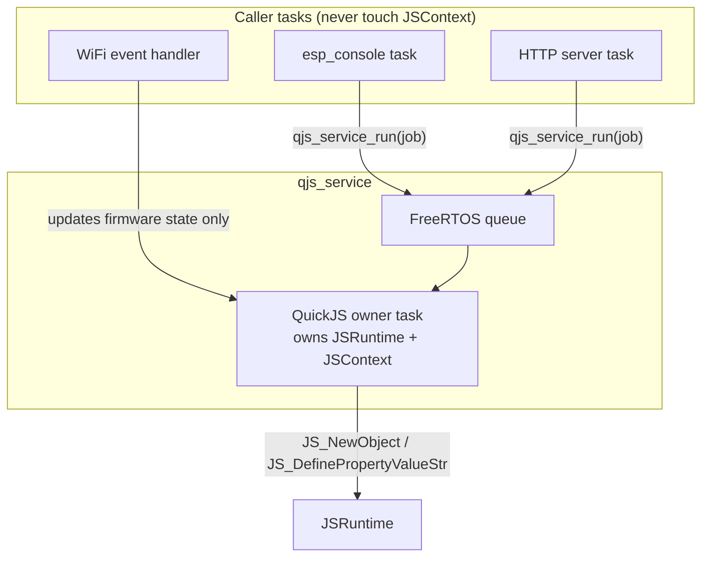

# QuickJS Native Modules on ESP32-S3: Implementing Firmware JavaScript Namespaces

This report is a technical deep dive into how JavaScript-facing modules are implemented in the AtomS3R M12 native QuickJS firmware (`0103-atoms3r-m12-native-quickjs`). It is written for an engineer who must add, review, or debug a new firmware API exposed to JavaScript. The report covers the binding model, the runtime ownership rule that shapes every module, the exact C sequence used to install a namespace, the value-ownership hazards that are easy to get wrong, and three worked modules — `system`, `storage`, and `wifi` — that progress from a read-only metadata object to a stateful network API.

The firmware does not use QuickJS's desktop module loader. It does not compile `quickjs-libc.c`, and it does not expose the `std` or `os` global objects. Instead, firmware code installs explicit, named global objects through a reusable owner-task service. A "module" in this firmware is a C/C++ translation unit that creates a JavaScript object, attaches native functions to it, freezes its shape, and binds it to a global name. This report explains why that pattern exists, how each part of it works, and how to repeat it safely for a new subsystem.

> [!summary]
> - A module is a global object installed on the QuickJS owner task through `qjs_service_run()`. The owner task is the only task permitted to touch `JSRuntime*` and `JSContext*`.
> - The install sequence is fixed: allocate an object, attach `JS_NewCFunction` values with `JS_DefinePropertyValueStr`, call `JS_PreventExtensions` to lock the object's shape, and bind the object to a global property.
> - `JS_DefinePropertyValueStr` consumes the value it is given on both success and failure paths. Mishandling this ownership rule causes double-frees or leaks.
> - `js reset` destroys and recreates the runtime, so every firmware module must be reinstalled immediately after a successful reset.
> - Firmware APIs never expose raw ESP-IDF handles, never call QuickJS from event callbacks, and never return secrets such as WiFi passwords.
> - The three implemented modules — `system`, `storage`, `wifi` — form a deliberate progression: read-only metadata, bounded persistent I/O, and asynchronous state with request/status semantics.

## Why this report exists

The earlier report [[ARTICLE - ESP32-P4 QuickJS Internals - Porting Runtime Ownership and Extension APIs]] established the engine port, the owner-task service, and the small default API (`print`, `millis`, `gc`). It ended by describing future APIs as a wishlist. Since then, the firmware has gained three real modules and a fourth subsystem (HTTP serving) that depends on them. This report turns the earlier proposal into a concrete, repeatable implementation discipline.

A maintainer will need to answer questions such as:

- What is a "module" in this firmware, and why is it not `require('something')`?
- Why must a new module run its installation code on the owner task instead of `app_main`?
- What is the exact C call sequence to add a JavaScript function that calls firmware code?
- How are QuickJS `JSValue` reference counts managed when an object is built incrementally?
- Why does `js reset` break firmware modules, and how is the break repaired?
- How should a stateful subsystem such as WiFi expose itself without violating runtime ownership?

The answers form a small set of working rules. The modules work because the rules are followed. A new module that violates them will compile, pass a quick smoke, and then crash under reset, under concurrent access, or under garbage collection pressure.

## Repository map

The source repository is:

```text
/home/manuel/workspaces/2025-12-21/echo-base-documentation/esp32-s3-m5
```

The files that define the module pattern are:

| Path | Role |
|---|---|
| `components/quickjs_native/quickjs/quickjs.h` | Public QuickJS C API used by every module. |
| `components/qjs_service/include/qjs_service.h` | Service API: `qjs_service_run`, `qjs_service_eval`, `qjs_service_reset`, `qjs_service_get_status`. |
| `components/qjs_service/qjs_service.cpp` | Owner task, queue protocol, native-job execution, globals installation, output capture. |
| `0103-atoms3r-m12-native-quickjs/main/system_namespace.{h,cpp}` | Read-only `system` metadata module. |
| `0103-atoms3r-m12-native-quickjs/main/storage_namespace.{h,cpp}` | Bounded FatFs `storage` module. |
| `0103-atoms3r-m12-native-quickjs/main/wifi_namespace.{h,cpp}` | Stateful `wifi` request/status module. |
| `0103-atoms3r-m12-native-quickjs/main/wifi_app.{h,c}` | Firmware-owned WiFi service consumed by `wifi_namespace`. |
| `0103-atoms3r-m12-native-quickjs/main/app_main.cpp` | Startup: mounts storage, starts WiFi, starts QuickJS, installs all modules. |
| `0103-atoms3r-m12-native-quickjs/main/js_command.cpp` | `js reset` path that reinstalls all modules. |

The companion ticket material is under:

```text
ttmp/2026/06/25/ATOMS3R-M12-NATIVE-QUICKJS--atoms3r-m12-native-quickjs-firmware-with-psram/
ttmp/2026/06/25/ATOMS3R-M12-QUICKJS-STORAGE--atoms3r-m12-quickjs-bounded-storage-namespace/
ttmp/2026/06/25/ATOMS3R-M12-QUICKJS-WIFI--atoms3r-m12-quickjs-persistent-wifi-namespace/
ttmp/2026/06/25/ATOMS3R-M12-QUICKJS-HTTP--atoms3r-m12-quickjs-express-like-http-server/
```

## What a module is in this firmware

QuickJS, like most embeddable engines, can expose C functions to JavaScript in two broad ways: as individual global functions, or as properties of an object. The firmware uses both. The primitive globals `print`, `millis`, and `gc` are individual functions installed directly on the global object. A module is the next step up: a single named object that groups related functions and, optionally, constant properties.

The firmware deliberately avoids the desktop module system. Upstream QuickJS ships `quickjs-libc.c`, which provides `std` and `os` objects and a `js_module_loader` that resolves `import` and `require` against the host filesystem. The firmware excludes `quickjs-libc.c` at the component level. The reasons are operational, not ideological. The desktop loader assumes a POSIX filesystem with arbitrary paths, process-spawning primitives, and unbounded file reads. None of those are safe or even meaningful on an ESP32-S3 with a 1 MiB JavaScript heap cap and a wear-levelled FatFs partition mounted at `/storage`. Exposing `std`/`os` would hand JavaScript the ability to open arbitrary native paths, fork work, and read files of unbounded size — exactly the behaviors the storage module was designed to forbid.

A module in this firmware is therefore a host-provided global object with a fixed, frozen shape. It is created by firmware C/C++ code, installed through the owner task, and restored after reset. JavaScript code reads its properties and calls its functions. It cannot replace the object, add new properties to it, or reach underneath it to obtain raw handles.

The naming convention is a lowercase global: `system`, `storage`, `wifi`. These are intentionally short, stable, and discoverable from the console prompt. A new subsystem should pick one noun and expose it as one object rather than scattering several global functions across the namespace.

## The owner-task rule

Every module is shaped by a single constraint: the QuickJS runtime is mutable engine state, and only one FreeRTOS task may touch it. That task is the owner task created by `qjs_service`. The service exposes a message queue. Other tasks — the console task, an HTTP server task, a WiFi event handler — never call `JS_Eval`, `JS_NewObject`, or `JS_GetGlobalObject` directly. They enqueue a job, and the owner task runs that job with exclusive access to the context.

The public API that makes this work is `qjs_service_run`:

```c
typedef esp_err_t (*qjs_job_fn_t)(JSContext* ctx, void* user);

typedef struct {
  qjs_job_fn_t fn;     // required
  void* user;
  uint32_t timeout_ms; // 0 => no JS interrupt deadline for the job
} qjs_job_t;

esp_err_t qjs_service_run(qjs_service_t* s, const qjs_job_t* job);
```

A module installer is a job. It receives a `JSContext*` and an opaque `user` pointer, performs its QuickJS mutations, and returns an `esp_err_t`. The caller blocks on a binary semaphore until the owner task finishes the job. This serialization is what makes it safe for the console task to ask the owner task to install a namespace while a WiFi event handler is simultaneously updating firmware-owned state on a different task.

The same mechanism is used for evaluation. `qjs_service_eval` enqueues a message of type `MSG_EVAL`; the owner task runs `JS_Eval`, captures `print()` output into a `std::string`, extracts any exception, and signals completion. A module installer enqueues a message of type `MSG_JOB`; the owner task calls the job function. The two paths share the same queue and the same owner task, so a module installation and a user evaluation can never run concurrently.



The diagram above shows the discipline: callers enqueue jobs; the owner task drains the queue. The WiFi event handler is drawn as updating firmware-owned state, not as a job enqueuer, because module installation is not what an event handler does. Event handlers update state under a mutex; JavaScript reads that state later through a job.

This rule has a direct consequence for how a module is structured. A module translation unit has two halves. The firmware half is plain C/C++ that owns state, does I/O, and can be called from any task. The JavaScript half is a set of `JSCFunction` callbacks that run on the owner task, build `JSValue` results from the firmware half, and return them. The installer that wires the two halves together is a job submitted through `qjs_service_run`.

## The module install sequence

Every module in the firmware follows the same installation sequence. The sequence is small enough to memorize, and deviating from it is the most common source of crashes. This section walks through it using the `system` module as the simplest example, then generalizes.

`system` is a read-only object that exposes firmware identity and hardware limits: `system.firmware`, `system.board`, `system.target`, `system.ticket`, `system.psramInitialized`, `system.psramBytes`, `system.flashBytes`, `system.quickjsMemoryLimitBytes`, and `system.quickjsStackLimitBytes`. It has no functions; it is pure data. That makes it the cleanest place to study object construction.

The installer is a job function:

```c
static esp_err_t install_system_namespace_job(JSContext *ctx, void *user) {
  (void)user;
  if (!ctx) return ESP_ERR_INVALID_ARG;

  JSValue system = JS_NewObject(ctx);
  if (JS_IsException(system)) return ESP_ERR_NO_MEM;

  bool ok = define_string(ctx, system, "firmware", kFirmwareName) &&
            define_string(ctx, system, "board", kBoardName) &&
            define_string(ctx, system, "target", kTargetName) &&
            define_string(ctx, system, "ticket", kTicketName) &&
            define_bool(ctx, system, "psramInitialized", esp_psram_is_initialized()) &&
            define_i64(ctx, system, "psramBytes", (int64_t)esp_psram_get_size()) &&
            define_i64(ctx, system, "flashBytes", (int64_t)flash_size) &&
            define_i64(ctx, system, "quickjsMemoryLimitBytes", kQuickJsMemoryLimitBytes) &&
            define_i64(ctx, system, "quickjsStackLimitBytes", kQuickJsStackLimitBytes);

  if (ok && JS_PreventExtensions(ctx, system) < 0) ok = false;

  JSValue global = JS_GetGlobalObject(ctx);
  if (JS_IsException(global)) { JS_FreeValue(ctx, system); return ESP_FAIL; }

  if (ok) {
    const int rc = JS_DefinePropertyValueStr(ctx, global, "system", system, JS_PROP_ENUMERABLE);
    system = JS_UNDEFINED;             // ownership transferred
    ok = rc >= 0;
  }
  JS_FreeValue(ctx, global);
  JS_FreeValue(ctx, system);           // safe: JS_UNDEFINED on success
  return ok ? ESP_OK : ESP_FAIL;
}
```

The public entry point wraps the job:

```c
esp_err_t install_system_namespace(qjs_service_t *svc) {
  if (!svc) return ESP_ERR_INVALID_ARG;
  qjs_job_t job = {};
  job.fn = install_system_namespace_job;
  job.timeout_ms = 1000;
  return qjs_service_run(svc, &job);
}
```

The sequence has six steps, and each exists for a specific reason.

**Step 1 — create the object.** `JS_NewObject(ctx)` allocates a new JavaScript object in the runtime and returns a `JSValue` that the caller owns. At this point the object is empty, extensible, and has no properties. If allocation fails the function returns an exception value, which the installer must check with `JS_IsException` before using the object.

**Step 2 — attach properties.** Each property is added with `JS_DefinePropertyValueStr(ctx, system, name, value, flags)`. The `value` argument is a `JSValue` produced by a constructor such as `JS_NewString`, `JS_NewInt64`, or `JS_NewBool`. The flags select the property attributes. The firmware uses `JS_PROP_ENUMERABLE` for data properties so that `JSON.stringify` and `for...in` see them, while leaving the property writable and configurable during construction. The helper functions `define_string`, `define_i64`, and `define_bool` hide the construction-and-attach pair behind a boolean return so the installer can short-circuit with `&&`.

**Step 3 — lock the shape.** `JS_PreventExtensions(ctx, system)` transitions the object so that no new properties can be added. After this call, JavaScript code that attempts `system.newField = 1` fails silently in sloppy mode and throws a `TypeError` in strict mode. This is what makes the module read-only in shape: the set of properties is fixed at install time.

**Step 4 — fetch the global object.** `JS_GetGlobalObject(ctx)` returns the context's global object. The returned `JSValue` is a reference the caller owns and must free. In this firmware the global object is never an exception, but the code checks defensively because the cost is one branch and the failure mode is a dangling pointer.

**Step 5 — bind the module to a global name.** `JS_DefinePropertyValueStr(ctx, global, "system", system, JS_PROP_ENUMERABLE)` installs the object as the global property `system`. This single call is where ownership transfers. The next subsection explains why this is the most dangerous line in any module.

**Step 6 — release local references.** The installer frees the global object reference and frees the local `system` variable. On the success path the local has been set to `JS_UNDEFINED` so the final free is a no-op. On the failure path the local still holds the object and the free releases it.

The sequence generalizes to every module. A module with functions adds a step between 2 and 3: attach `JS_NewCFunction` values to the object before freezing the shape. The `storage` and `wifi` modules both do this. The rest of the skeleton — create, attach, freeze, fetch global, bind, release — is identical across all three.

## Value ownership: the one rule that breaks modules

QuickJS uses reference counting for its values. Every `JSValue` returned by a constructor or `JS_Get*` call is owned by the caller. Ownership is released with `JS_FreeValue`. When a value is stored into a container — an object property, an array element, a global — the container takes ownership and the caller no longer needs to free that value.

The function that consumes values is `JS_DefinePropertyValueStr`. Its implementation in upstream QuickJS makes the ownership contract explicit:

```c
int JS_DefinePropertyValueStr(JSContext *ctx, JSValueConst this_obj,
                              const char *prop, JSValue val, int flags) {
  JSAtom atom = JS_NewAtom(ctx, prop);
  if (atom == JS_ATOM_NULL) {
    JS_FreeValue(ctx, val);     // consumed even on atom failure
    return -1;
  }
  int ret = JS_DefinePropertyValue(ctx, this_obj, atom, val, flags);
  JS_FreeAtom(ctx, atom);
  return ret;                  // val consumed by JS_DefinePropertyValue
}
```

The value passed as `val` is freed exactly once, on every path. If the atom cannot be allocated, the function frees `val` itself. If the atom is allocated, `JS_DefinePropertyValue` takes ownership and frees `val` on completion. There is no path on which the caller retains ownership of `val` after the call returns.

This contract has a direct implication for module installers. Consider the naive version of the final binding step:

```c
// WRONG: double free on the failure path
if (ok) {
  ok = JS_DefinePropertyValueStr(ctx, global, "system", system, JS_PROP_ENUMERABLE) >= 0;
}
JS_FreeValue(ctx, global);
JS_FreeValue(ctx, system);   // frees system again if the call failed
```

If `JS_DefinePropertyValueStr` succeeds, it has consumed `system`, and the trailing `JS_FreeValue(ctx, system)` frees memory that no longer belongs to the caller. In many cases the crash does not appear immediately, because the freed slot may still hold a valid-looking pointer until the next allocation reuses it. This is the kind of bug that passes a smoke test and crashes an hour later.

The firmware's pattern avoids the hazard by setting the local to `JS_UNDEFINED` immediately after the consuming call, so the trailing free is a no-op:

```c
// CORRECT: ownership transferred, local neutralized
if (ok) {
  const int rc = JS_DefinePropertyValueStr(ctx, global, "system", system, JS_PROP_ENUMERABLE);
  system = JS_UNDEFINED;     // no longer owned by us
  ok = rc >= 0;
}
JS_FreeValue(ctx, global);
JS_FreeValue(ctx, system);   // safe: JS_UNDEFINED frees nothing
```

This is not an optimization. It is the single most important correctness rule in a module installer. Every consuming call — `JS_DefinePropertyValueStr`, `JS_SetPropertyUint32`, `JS_SetPropertyStr` — must be followed by neutralizing the local reference, or by a control-flow path that never frees it again. The `storage` and `wifi` modules use the same `set_function` helper, which wraps the construction of a `JS_NewCFunction` value and its attachment in one call, precisely so that the consume point is localized and easy to audit:

```c
static bool set_function(JSContext *ctx, JSValueConst obj, const char *name,
                         JSCFunction *fn, int argc) {
  JSValue f = JS_NewCFunction(ctx, fn, name, argc);
  if (JS_IsException(f)) return false;
  return JS_DefinePropertyValueStr(ctx, obj, name, f, JS_PROP_ENUMERABLE) >= 0;
}
```

Here `JS_DefinePropertyValueStr` consumes `f` on both paths, and the helper never frees `f` itself. The local goes out of scope without a dangling free. This is the shape to copy when adding a function-bearing module.

A second ownership hazard appears in return values from `JSCFunction` callbacks. A callback that returns a `JSValue` produced by `JS_NewObject`, `JS_NewString`, or `JS_NewInt64` transfers ownership of that value to the engine; the engine frees it when it goes out of scope in JavaScript. A callback that returns `JS_EXCEPTION` signals that an exception has been thrown (usually via `JS_Throw*`), and the engine handles the exception value. The mistake to avoid is freeing a value that has been returned. Return values are owned by the engine from the moment of return.

## Installing a native function

The `system` module has no functions. Real firmware modules need them. This section follows the `storage` module to show how a native function is built, attached, and called.

A native JavaScript function in QuickJS is a `JSCFunction` — a C function with the signature `JSValue (*)(JSContext*, JSValueConst, int, JSValueConst*)`. The first argument is the context. The second is the `this` binding. The third is the argument count. The fourth is the argument array. The function returns a `JSValue`: a normal value, `JS_UNDEFINED` for no return, or `JS_EXCEPTION` to signal a thrown error.

The `storage.readText(path)` binding is a representative example:

```c
static JSValue js_storage_read_text(JSContext *ctx, JSValueConst this_val,
                                   int argc, JSValueConst *argv) {
  (void)this_val;
  if (argc < 1) return JS_ThrowTypeError(ctx, "storage.readText(path) requires a path");

  const char *path = JS_ToCString(ctx, argv[0]);
  if (!path) return JS_EXCEPTION;

  char *text = nullptr;
  size_t len = 0;
  const esp_err_t err = storage_read_text_alloc(path, kMaxReadBytes, &text, &len);
  JS_FreeCString(ctx, path);              // free the C string view

  if (err != ESP_OK) return throw_esp_error(ctx, "storage.readText", err);

  JSValue out = JS_NewStringLen(ctx, text, len);
  free(text);                              // free the firmware buffer
  return out;                             // engine owns `out`
}
```

The function does four things, and each maps to an ownership transfer.

First, it converts the JavaScript argument to a C string with `JS_ToCString`. That call returns a borrowed `const char*` view that the caller must release with `JS_FreeCString`. Holding the view beyond the release is a use-after-free. The firmware frees the view immediately after the firmware call that needs it.

Second, it calls the firmware half — `storage_read_text_alloc` — which is plain C that knows nothing about QuickJS. The firmware half allocates a `malloc`'d buffer and returns it through an out-parameter along with its length and an `esp_err_t` status. Keeping the firmware half free of `JSValue` is what lets it be unit-testable and reusable from the console path.

Third, on the error path it throws a JavaScript exception. The helper `throw_esp_error` calls `JS_ThrowInternalError` with the operation name and the `esp_err_to_name` string, then returns `JS_EXCEPTION`. The thrown exception value is owned by the engine; the function returns `JS_EXCEPTION` to signal it.

Fourth, on the success path it builds a `JSValue` string from the firmware buffer with `JS_NewStringLen`, frees the firmware buffer, and returns the `JSValue`. From the moment of return, the engine owns the returned value. The function does not free `out`.

The attach step uses the `set_function` helper shown earlier:

```c
bool ok = set_function(ctx, storage, "status", js_storage_status, 0) &&
          set_function(ctx, storage, "list", js_storage_list, 1) &&
          set_function(ctx, storage, "stat", js_storage_stat, 1) &&
          set_function(ctx, storage, "readText", js_storage_read_text, 1) &&
          set_function(ctx, storage, "writeText", js_storage_write_text, 2);
```

The integer argument to `set_function` is the declared argument count. QuickJS uses it for `Function.prototype.length` and does not enforce it as a call-time arity check; JavaScript may pass more or fewer arguments. The count is documentation, not a gate.

One subtle point about `JS_NewCFunction`: the returned function value is a callable object. It is consumed when attached to a property, exactly like a data value. The same neutralize-after-attach discipline applies. Because `set_function` performs the attach inline and never frees the function value itself, the hazard is contained in one place.

## Reset safety: why modules disappear and how to restore them

The `js reset` command calls `qjs_service_reset`, which destroys the current `JSRuntime` and `JSContext` and creates fresh ones. This is the cleanest way to reclaim leaked JavaScript memory and clear stray globals after a long interactive session. It also destroys every firmware module, because modules are JavaScript objects living in the context that was just destroyed.

After reset, the runtime is in the same state it would be at a fresh boot, minus the firmware modules. If the reset path did nothing else, the user would observe that `system`, `storage`, and `wifi` had vanished:

```text
0103> js reset
reset: ESP_OK
0103> js eval "system.board"
error: ReferenceError: 'system' is not defined
```

The repair is to reinstall every module immediately after a successful reset. The console command does this inline:

```c
int cmd_reset() {
  esp_err_t err = qjs_service_reset(g_svc, kResetTimeoutMs);
  if (err == ESP_OK) {
    if (install_system_namespace(g_svc) != ESP_OK) { /* report */ return 1; }
    if (install_storage_namespace(g_svc) != ESP_OK) { /* report */ return 1; }
    if (install_wifi_namespace(g_svc)   != ESP_OK) { /* report */ return 1; }
  }
  return err == ESP_OK ? 0 : 1;
}
```

Each `install_*` call enqueues a job on the owner task, which now holds the fresh context. The order matters only in that `system` and `storage` have no dependencies, while a future module that reads `system.board` at install time would need `system` first. Installing in a fixed order keeps the dependency graph linear and obvious.

There is a second, less obvious reset hazard that affects modules which hold `JSValue` references across calls. A dynamic HTTP route handler, for example, would store a `JSValue` callback so that an HTTP request later can call it. That `JSValue` belongs to a specific runtime. After `js reset`, the runtime is gone, the `JSValue` is dangling, and calling it would corrupt memory. The rule for such modules is that reset must clear the stored references, or the module must be unregistered on reset and re-registered by an explicit script run. The firmware's current modules do not hold cross-call `JSValue` references — `storage` and `wifi` keep only firmware-owned state — so they are reset-safe by construction. A future dynamic-route HTTP module will not be, and its design must account for it.

## A stateful module: the wifi namespace

The `wifi` module is the first module in the firmware that exposes state it does not own. WiFi state is owned by the native `wifi_app` service: the ESP-IDF WiFi driver, the netif, the event loop, and the NVS credentials. The JavaScript `wifi` object does not hold any of that. It offers functions that ask the firmware service to do something and functions that return a snapshot of the firmware service's current state.

This separation is what lets the module satisfy the owner-task rule. WiFi events arrive on the ESP-IDF event loop task, not the QuickJS owner task. An event handler that called `JS_Eval` to notify JavaScript would violate the rule and crash. Instead, the event handler updates `wifi_app`'s internal state under a mutex. When JavaScript calls `wifi.status()`, that call runs as a job on the owner task; the job calls `wifi_app_get_status`, which copies the state under the mutex into a plain C struct, and the job copies the struct's fields into a `JSValue` object. At no point does the event handler touch QuickJS.

The `wifi.status()` binding shows the pattern:

```c
static JSValue js_wifi_status(JSContext *ctx, JSValueConst this_val,
                              int argc, JSValueConst *argv) {
  (void)this_val; (void)argc; (void)argv;

  wifi_app_status_t st = {};
  esp_err_t err = wifi_app_get_status(&st);
  if (err != ESP_OK) return throw_esp_error(ctx, "wifi.status", err);

  char sta_ip[32] = {};
  ip_to_string(st.sta_ip4, sta_ip, sizeof(sta_ip));

  JSValue obj = JS_NewObject(ctx);
  JS_DefinePropertyValueStr(ctx, obj, "state", JS_NewString(ctx, state_to_js(st.state)), JS_PROP_ENUMERABLE);
  JS_DefinePropertyValueStr(ctx, obj, "ssid", JS_NewString(ctx, st.ssid), JS_PROP_ENUMERABLE);
  JS_DefinePropertyValueStr(ctx, obj, "hasSavedCredentials", JS_NewBool(ctx, st.has_saved_creds), JS_PROP_ENUMERABLE);
  JS_DefinePropertyValueStr(ctx, obj, "staIp", JS_NewString(ctx, sta_ip), JS_PROP_ENUMERABLE);
  JS_DefinePropertyValueStr(ctx, obj, "lastDisconnectReason", JS_NewInt32(ctx, st.last_disconnect_reason), JS_PROP_ENUMERABLE);
  return obj;
}
```

Each `JS_DefinePropertyValueStr` here consumes the value constructed inline. Because the constructed value is a temporary and is never stored in a named local, there is no double-free to guard against; the consume happens at the call site. This inline-construction style is safe and readable for short-lived values. The named-local style in `install_system_namespace_job` is required when the same value must be inspected after construction (for example, to check `JS_IsException`).

The request functions `wifi.connect()` and `wifi.disconnect()` follow a different sub-pattern. They do not return a snapshot; they return a small result object describing what was requested and the resulting state:

```c
static JSValue make_request_result(JSContext *ctx, const char *requested, esp_err_t err) {
  if (err != ESP_OK) return throw_esp_error(ctx, requested, err);
  wifi_app_status_t st = {};
  (void)wifi_app_get_status(&st);
  JSValue obj = JS_NewObject(ctx);
  JS_DefinePropertyValueStr(ctx, obj, "ok", JS_NewBool(ctx, true), JS_PROP_ENUMERABLE);
  JS_DefinePropertyValueStr(ctx, obj, "requested", JS_NewString(ctx, requested), JS_PROP_ENUMERABLE);
  JS_DefinePropertyValueStr(ctx, obj, "state", JS_NewString(ctx, state_to_js(st.state)), JS_PROP_ENUMERABLE);
  return obj;
}
```

This request/status split is the correct shape for any asynchronous or stateful firmware subsystem. JavaScript asks for an action and receives an immediate acknowledgement with the new state. The firmware performs the actual work on its own task and updates state through events. JavaScript polls `wifi.status()` to observe progress. There is no callback registration, no promise that resolves on the owner task, and no path by which an event handler calls into the runtime. The module is safe precisely because it refuses to be reactive from JavaScript's perspective.

The `wifi` module deliberately omits one function that the underlying service supports: credential configuration. `wifi_app_set_credentials` exists in firmware, and a `wifi.configure({ssid, password, save})` binding would be trivial to write. It is omitted because the purpose of a script stored in `/storage/scripts` is to be readable, and a script that contains a plaintext password is a credential leak waiting to happen. Provisioning is left to the console `wifi set` command, which runs in a session that is not persisted to flash. This is an API-design decision, not a technical limitation, and it is worth preserving when extending the module.

## Memory and limits

Every module must be designed against the runtime's memory cap. The AtomS3R firmware configures QuickJS with a 1 MiB heap limit and a 64 KiB stack limit. These are not generous. A module that returns an unbounded object — a directory listing of a thousand entries, or a file read of a megabyte — will hit the cap and throw `InternalError: out of memory` from inside QuickJS. That exception is recoverable at the JavaScript level if the script catches it, but it is a poor experience and a sign of a module that did not set its own limits.

The `storage` module declares its limits as compile-time constants and enforces them before allocating JavaScript values:

```c
constexpr size_t kMaxReadBytes    = 16 * 1024;
constexpr size_t kMaxWriteBytes   = 16 * 1024;
constexpr size_t kMaxListEntries  = 64;
constexpr size_t kMaxPathBytes    = 127;
```

`storage.readText` calls `stat` on the file before allocating a buffer, and rejects files larger than `kMaxReadBytes` with `ESP_ERR_INVALID_SIZE` before any JavaScript string is constructed. `storage.list` stops at `kMaxListEntries` entries. These limits are the difference between a module that survives arbitrary input and one that crashes on a large file. A new module should pick limits first, before writing the bindings, and enforce them in the firmware half rather than in the JavaScript half.

The heap cap also constrains how a module installs itself. The owner task has a stack of its own (configured to 32 KiB in this firmware), and a job that allocates large stack buffers will overflow it. The storage module uses `malloc` for its read buffer rather than a stack array precisely because a 16 KiB stack array would consume half the owner task's stack. Module jobs should allocate heap memory for anything larger than a few hundred bytes and free it before returning.

## The complete module template

This section collects the rules into a template that a new module can be built from. The template is the distillation of the three implemented modules. A new module that follows it will be owner-task-safe, reset-safe, and bounded.

The firmware half is plain C/C++ with no QuickJS includes. It owns state, does I/O under its own locks, and returns `esp_err_t` plus out-parameters:

```c
// mymodule_app.h
esp_err_t mymodule_app_get_state(mymodule_state_t *out);
esp_err_t mymodule_app_do_thing(void);
```

The JavaScript half is a translation unit that includes `quickjs.h` and `qjs_service.h`. It contains one `JSCFunction` per exposed function, one job function that builds and binds the object, and one public entry point:

```c
// mymodule_namespace.cpp
static JSValue js_mymodule_status(JSContext *ctx, JSValueConst this_val,
                                  int argc, JSValueConst *argv) {
  mymodule_state_t st = {};
  if (mymodule_app_get_state(&st) != ESP_OK)
    return JS_ThrowInternalError(ctx, "mymodule.status: unavailable");
  JSValue obj = JS_NewObject(ctx);
  JS_DefinePropertyValueStr(ctx, obj, "ready", JS_NewBool(ctx, st.ready), JS_PROP_ENUMERABLE);
  return obj;
}

static bool set_function(JSContext *ctx, JSValueConst obj, const char *name,
                         JSCFunction *fn, int argc) {
  JSValue f = JS_NewCFunction(ctx, fn, name, argc);
  if (JS_IsException(f)) return false;
  return JS_DefinePropertyValueStr(ctx, obj, name, f, JS_PROP_ENUMERABLE) >= 0;
}

static esp_err_t install_mymodule_job(JSContext *ctx, void *user) {
  (void)user;
  JSValue mod = JS_NewObject(ctx);
  if (JS_IsException(mod)) return ESP_ERR_NO_MEM;

  bool ok = set_function(ctx, mod, "status", js_mymodule_status, 0);
  if (ok && JS_PreventExtensions(ctx, mod) < 0) ok = false;

  JSValue global = JS_GetGlobalObject(ctx);
  if (ok) {
    const int rc = JS_DefinePropertyValueStr(ctx, global, "myModule", mod, JS_PROP_ENUMERABLE);
    mod = JS_UNDEFINED;
    ok = rc >= 0;
  }
  JS_FreeValue(ctx, global);
  JS_FreeValue(ctx, mod);
  return ok ? ESP_OK : ESP_FAIL;
}

esp_err_t install_mymodule_namespace(qjs_service_t *svc) {
  qjs_job_t job = { .fn = install_mymodule_job, .timeout_ms = 1000 };
  return qjs_service_run(svc, &job);
}
```

The startup and reset paths each call the public entry point:

```c
// app_main.cpp, after qjs_service_start
install_mymodule_namespace(svc);

// js_command.cpp, inside cmd_reset after qjs_service_reset succeeds
install_mymodule_namespace(g_svc);
```

The build adds the new sources and any component dependencies:

```cmake
# main/CMakeLists.txt
idf_component_register(
  SRCS "mymodule_app.cpp" "mymodule_namespace.cpp" ...
  REQUIRES qjs_service ...
)
```

That is the entire pattern. The shape is the same whether the module is read-only data, a set of bounded I/O functions, or a stateful request/status API. What changes between modules is the firmware half and the set of functions; the install skeleton does not change.

## How to add a new module, step by step

The following sequence is the recommended order for adding a module. The order exists to keep each step independently verifiable.

1. **Write the firmware half first.** Implement the C/C++ service that owns the state and does the work, with no QuickJS dependencies. Test it from the console before exposing it to JavaScript. A firmware half that is correct in C is almost always correct when wrapped; a firmware half that is buggy in C will be buggy and harder to debug through JavaScript.
2. **Pick limits before writing bindings.** Decide the maximum sizes, counts, and timeouts the module will enforce. Write them as `constexpr` constants at the top of the namespace translation unit. Enforce them in the firmware half.
3. **Write the `JSCFunction` callbacks.** Convert JavaScript arguments to C with `JS_ToCString`/`JS_ToInt32` and free the borrowed views immediately. Return `JSValue` results without freeing them. Throw exceptions with `JS_Throw*` and return `JS_EXCEPTION`.
4. **Write the job installer.** Use the template above. Use `set_function` to attach functions so the consume point is localized. Set the local to `JS_UNDEFINED` after the final `JS_DefinePropertyValueStr` on the global.
5. **Wire the public entry point.** Wrap the job in `install_*_namespace` and call it from `app_main` after `qjs_service_start`.
6. **Add reset reinstallation.** Call the same entry point from `cmd_reset` after `qjs_service_reset` succeeds, alongside the other modules.
7. **Update the build.** Add the sources and component dependencies to `main/CMakeLists.txt`.
8. **Smoke from the console.** Build, flash, and call the new functions through `js eval`. Then call `js reset` and confirm the module still exists.
9. **Record the limits and the secret-handling rules in the ticket.** If the module touches credentials, state explicitly that passwords are not returned, not logged, and not committed.

## Common failure modes

The following table collects the failure modes that have actually occurred or that the pattern is specifically designed to prevent. Each is paired with its cause and the rule that prevents it.

| Failure mode | Cause | Prevention |
|---|---|---|
| Crash after `js reset` that passes initial smoke | Module not reinstalled after reset; JavaScript references a destroyed global. | Call every `install_*` from `cmd_reset`. |
| Double-free or use-after-free in the installer | `JS_DefinePropertyValueStr` consumes the value; installer also frees it. | Set the local to `JS_UNDEFINED` after the consuming call; use `set_function` for functions. |
| Stale `JSValue` callback after reset | Module stored a `JSValue` across calls; reset destroyed its runtime. | Do not store cross-call `JSValue` references, or clear them on reset and require an explicit script rerun. |
| Owner task crash from concurrent access | A non-owner task called a QuickJS C function directly. | All mutations go through `qjs_service_run` jobs; event handlers update firmware state only. |
| `InternalError: out of memory` on large input | Module returned an unbounded object or read an unbounded file. | Enforce `constexpr` limits in the firmware half before constructing `JSValue`s. |
| Credential leak | Module returned or logged a password. | Never return secrets from status objects; provision through the console, not scripts. |
| Owner task stack overflow | Job allocated a large stack array. | Use `malloc` for buffers larger than a few hundred bytes; free before returning. |
| `JS_Throw*` value freed twice | Callback freed the exception it threw. | `JS_Throw*` returns the exception value to the engine; return `JS_EXCEPTION` and do not free it. |

## Anti-patterns

Several approaches that look reasonable are rejected by the firmware's design. Recording them helps a maintainer avoid reintroducing them.

**Exposing `std`/`os`.** Compiling `quickjs-libc.c` would give JavaScript file I/O, environment access, and a module loader for free. It would also give JavaScript the ability to open arbitrary native paths and read unbounded files, defeating the storage module's virtual-root and size-limit guarantees. The firmware's modules exist precisely to provide a safe subset of that capability.

**Calling QuickJS from an event handler.** A WiFi `IP_EVENT_STA_GOT_IP` handler that calls `JS_Eval` to run a "connected" script would seem convenient. It violates the owner-task rule and will crash under the event loop's task. The correct pattern is for the handler to update firmware state and for JavaScript to poll `wifi.status()`.

**Per-request `JSValue` storage without reset handling.** An HTTP module that stores a route's `JSValue` handler so the HTTP task can call it later must handle reset. Without reset handling, the stored `JSValue` becomes a dangling pointer to a destroyed runtime. The current modules avoid this by not storing `JSValue` references; a future dynamic-route module must not.

**Returning raw firmware handles.** A module that returns a `JS_NewInt64` encoding a pointer to a firmware struct invites JavaScript to pass it back to another function that dereferences it. This is unsound and unsafe. The firmware half should keep handles internal and identify work by integer IDs or virtual paths.

**Unbounded returns.** A `wifi.scan()` that returns the full scan list with no cap will, on a dense network, return hundreds of objects and approach the heap cap. The design document for the wifi module defers JavaScript scan entirely until a bounded, asynchronous worker exists, for this reason.

## Working rules

The discipline can be compressed into a short list. These are the rules a maintainer should hold in mind when writing or reviewing a module.

- One task owns the runtime. Every mutation of `JSContext*` is a `qjs_service_run` job.
- `JS_DefinePropertyValueStr` consumes its value. Neutralize the local after the call.
- A module is an object: create it, attach properties and functions, freeze it with `JS_PreventExtensions`, bind it to a global name.
- Reset destroys modules. Reinstall every module from `cmd_reset` after a successful `qjs_service_reset`.
- Enforce limits in the firmware half, before any `JSValue` is constructed.
- Never call QuickJS from event handlers. Update firmware state; let JavaScript poll.
- Never return secrets. Provision credentials through the console.
- Keep the firmware half free of `JSValue` so it is reusable from the console and unit-testable.
- Free borrowed C strings and `malloc`'d buffers before returning from a callback.
- Pick one noun, expose one object. Do not scatter globals.

## Related notes

- [[ARTICLE - ESP32-P4 QuickJS Internals - Porting Runtime Ownership and Extension APIs]] — the engine port and the owner-task service this report builds on.
- [[ARTICLE - Native QuickJS on ESP32-P4 - Removing Wasm from the Firmware Stack]] — why the firmware uses native QuickJS rather than QuickJS-through-WAMR.
- [[ARTICLE - ESP32-P4 Visual QuickJS REPL - From Engine Bring-Up to PicoCalc Interface]] — the visual REPL that consumes the same service.
- [[ARTICLE - goja Binding Mechanisms - The Cost of Exposing Go to JavaScript]] — a host-side counterpart on exposing native functions to a JS engine, useful for comparing embedded and desktop binding patterns.

The ticket material for the three modules is under `ttmp/2026/06/25/` in the firmware repository, with one design document and diary per module under `ATOMS3R-M12-QUICKJS-STORAGE`, `ATOMS3R-M12-QUICKJS-WIFI`, and `ATOMS3R-M12-QUICKJS-HTTP`.
