# Bitmap Font Browser

The Bitmap Font Browser is a web application for trying out pixel fonts on the screen geometry of a PicoCalc, a handheld with a fixed 320×320 pixel display. The motivating context is a text-oriented operating system for that device: the screen is a grid of character cells, and the choice of font directly sets how many columns and rows of text fit and how legible they are. The application loads a collection of 817 bitmap font sprite sheets, renders typed text and presets at the real screen size, and does so with a pixel-perfect integer blit written to be transliterated to C firmware later. What you see in the browser is, by construction, what the firmware text driver will draw.

> [!summary]
> After an exploration phase (a TypeScript core, a React UI, an in-browser JS port, and a v1 Go server), the project consolidated onto a **single Go path**:
> 1. **one core** — `internal/core` (binarize/detect/oracle/layout/render/heuristics), the firmware-portable reference.
> 2. **one CLI** — `bfb` (Glazed): `render`, `analyze`, `gallery`, `serve`.
> 3. **one server** — `bfb serve` (std-lib `net/http`) serves the generated gallery and the `/api/render` + `/api/detect` + `/api/state` + `/api/fonts` endpoints.
> 4. **one UI** — the standalone gallery (generated static HTML, vanilla JS, no build step), a thin Go-backend client.
>
> The TS core, the React app, the in-browser JS port, and the v1 `cmd/server` were retired once the three-way pixel parity (TS ↔ Go ↔ JS == 0 px) was established and the detector's over-merge was fixed.

## Why this project exists

A text-oriented OS makes one trade-off constantly: legibility against information density. A font with an 8×8 cell yields a 40×40 grid on a 320×320 screen; a 16×16 cell yields 20×20; a 6×8 cell yields 53×40. The only way to develop a feel for that trade-off is to see real text rendered in a candidate font, at the real screen size, in the real colors the OS will use. No existing tool does this for a directory of demoscene sprite-sheet fonts, and the rendering has to match the device rather than approximate it with a browser font, so the tool had to be built.

The deeper reason is that the rendering core is the reference for the firmware. Getting the glyph representation, the blit, and the slicing right in a fast iteration environment means the algorithm, not merely the visual result, can be copied onto the device. The browser is the development surface; the firmware is the target. The core is written to be transliterated to C: integer-only, allocation-light, framebuffer-oriented, with a single `SetPixel` as the only platform hook.

## Current project status

The repository holds one active generation.

- **v2 — the single Go path**, at the repository root. `internal/core` is the portable core (the reference). `cmd/bfb` is the Glazed CLI. `bfb serve` is the server. The gallery (`various/font-gallery/`, generated by `bfb gallery`) is the UI. `devctl up` runs the whole dev loop (build → prepare → validate → supervise `bfb serve` with an `/api/ping` health probe).
- **v1 is archived** under `v1/`. It implemented a fixed uniform-grid slicer, a React/Redux UI, and a vision-assisted analysis pipeline. v1's own measurements proved that a large minority of sheets are not uniform grids, which is the premise of v2's coordinate-based detector.

Repository: `/home/manuel/code/wesen/2026-06-24--bitmap-font-browser`. Shared assets: `assets/fonts/` (817 sheets + `manifest.json` + `overrides.json`).

## Architecture

The system separates a portable core, a Go server/CLI, and a thin browser client. The core imports nothing from `image/png` or `net/http`; the only image-library seam is `internal/pngx`, which bridges `image/png` ↔ `core.ImageData` so the core stays portable.

```mermaid
graph TD
  subgraph CLI["cmd/bfb (Glazed)"]
    Render["bfb render: sheet+layout+text → PNG"]
    Analyze["bfb analyze: batch detect+oracle → layouts/ + triage"]
    Gallery["bfb gallery: → various/font-gallery/ (static HTML)"]
    Serve["bfb serve: std-lib net/http"]
  end
  subgraph Core["internal/core — firmware-portable"]
    Binarize["binarize.go: ImageData → InkMask (distance-from-bg)"]
    Detect["detect.go: CC + cluster + refine → GlyphBox[]"]
    Layout["layout.go: FontLayout → GlyphSet (expand)"]
    RenderCore["render.go: integer blit + text layout"]
    Oracle["oracle.go: probe-render + classify"]
    Heur["heuristics.go: GuessLayout (grid)"]
  end
  subgraph Browser["gallery (vanilla JS, no build)"]
    UI["sidebar + marks/tags/presets/filters"]
    Slicing["slicing inspector: /api/detect overlay + param sliders"]
    Demo["demo: fetch /api/render PNG"]
  end
  Serve -->|"/api/render"| Demo
  Serve -->|"/api/detect"| Slicing
  Serve -->|"/api/fonts, /assets/fonts/"| UI
  Serve -->|static| UI
  Core --> Serve
  Core --> Analyze
  Core --> Gallery
  style Core fill:#1c2230,stroke:#5cf
  style CLI fill:#16201a,stroke:#5f5
  style Browser fill:#2a1c30,stroke:#c5f
```



`bfb serve` is the standard library `net/http` `*http.ServeMux` with Go 1.22 method-pattern routes. The gallery is a generated static HTML file served from disk (`os.DirFS`); there is no embedded SPA and no frontend build step. The browser client is deliberately thin: it fetches Go renders and detection JSON and draws them — it contains no copy of the core algorithm.

## Implementation details

### The glyph model and the firmware-portable blit

A font, after slicing, is a `GlyphSet`: a flat 1-bit-per-pixel array plus bookkeeping. The packing is chosen so the same bytes can be emitted as a C `const uint8_t[]` for the device. Pixel `(x, y)` of glyph `g` is bit `g·cellW·cellH + y·cellW + x`; the byte is that index shifted right by three, the bit is the low three bits.

The blit is integer-only. There is no floating point, no anti-aliasing, and no alpha blending, because those are the three things that would make a browser render diverge from a framebuffer driver. Scaling is an integer `zoom` loop that replicates each source pixel into a `zoom × zoom` block. The only platform-specific operation is `SetPixel`, which in the browser writes RGBA into an `ImageData` buffer and on the device will write RGB565 into the LCD buffer. A `color=source` mode paints the sheet's original ink colors instead of a flat foreground, for the "what does this font actually look like" view — additive, the 1-bit firmware path is untouched.

### Binarization: distance from background, not a luminance threshold

Binarizing a pixel by luminance (ink if `luma ≥ 128`) is wrong, and the failure is instructive. The sheet `08X08-F1` draws its glyphs in saturated red, `(240, 0, 0)`; Rec. 601 luma of pure red is about 72, so every ink pixel was classified as background. The fix detects the background as the most common opaque color in the sheet and treats a pixel as ink when it differs from that background by at least the threshold on any channel:

```
inkDistance(img, x, y, bg) = max(|r-bg.r|, |g-bg.g|, |b-bg.b|)   // transparent → 0
pixel is "on" when (inkDistance >= threshold) XOR invert
```

One rule handles white-on-black, black-on-white, and any saturated colored ink. The general lesson: "ink versus background" is a question about distance from the dominant color, not absolute brightness. (A red-ink regression test now guards this.)

### Slicing: from uniform grid to connected-component detection

v1 sliced a sheet into a `GlyphSet` by walking a grid of `cellW × cellH` cells. v2 replaces the uniform-grid assumption with a coordinate-based glyph model: glyphs are found as **connected components** of ink (8-connectivity, two-pass union-find), then **clustered** into rows/columns by center proximity, then **refined** (drop speckle, reassemble fragmented strokes, drop too-small cells). The `FontLayout` document (`{grid?, boxes?, labels, threshold, invert, charset, ...}`) is the editable, persistable per-font form; `ExpandLayout` turns it into a `GlyphSet`.

The detector returns boxes *unlabeled*; labels come from the oracle or the ASCII-from-space hypothesis. Region classification separates a font's character rows from a decorative/credit band by finding the large inter-row-cluster gap (`cutY`).

#### The over-merge bug (and fix)

The refine step's merge originally measured the gap against the **accumulated** box width (`mergeGapFrac * lastWidth`). Once two glyphs merged, the threshold grew and snowballed, swallowing a whole row: `16X16-F1` collapsed to a single 319×48 box; `08X08-F1` and `DUKEFONT` to three full-width boxes each. The fix measures both the gap and the resulting span against the **fixed** median glyph width (`medW`), gated by `splitWideFrac` so two full glyphs (span ~2×medW) can never collapse:

```
merge(last, c) iff
    gap(c, last) <= mergeGapFrac * medW          // close, relative to ONE glyph
    AND (c.x1 - last.x0 + 1) <= splitWideFrac * medW   // merged span still glyph-sized
```

This reassembles true fragments (small gap, glyph-sized result) but never joins two separate glyphs. `splitWideFrac` does double duty: the merge gate here, and the (still-reserved) split-over-wide threshold — a single "what is one glyph" reference. After the fix: `16X16-F1` 1→32 boxes (no wide boxes), `ANTORC` 9→36, `DUKEFONT` 3→30. (Remaining issue: `16X16-F1` gives 32 not 60 — the detector over-*splits* when `medW` is deflated by fragments; over-merge is solved, over-split is open.)

### Determining settings at scale: detection and vision verification

The hardest part is determining the settings for 817 fonts, 119 of which the cell-size heuristic cannot resolve. Two automated approaches were evaluated.

**Projection/autocorrelation cell detection is unreliable on real bitmap fonts** — intra-glyph stroke structure dominates the signal (for `16X16-F1` the true cell period scored ~0.03 vs a spurious ~0.53). Projection detection is shipped only as a square-biased starting guess the user verifies, never as a trusted source. The reliable automated cell guess remains the filename/divisor heuristic in the manifest.

**Vision transcription hallucinates layouts.** Asking a vision model to *transcribe* the glyphs ("read the character in each cell") is unreliable — it imposes a canonical codepage. The same model is reliable as a **comparator**: render every glyph in the assumed order, stack that under the original sheet, and ask a comparison-and-classification question with a structured JSON answer. On the sample, `16X16-F1` returned match at confidence 0.92 (verified); `08X08-F1` a non-match at 0.42 (correctly flagged for review). This turns "are the settings correct for 817 fonts" into a triage. (A general trap recorded: a verification render must bypass every display-time convenience like the lowercase-to-uppercase fallback, or the comparison is against a substituted render.)

> [!note] Oracle caveat
> The shipped `oracle` renders each box's own source glyph, so **Coverage == Yield** (it measures *layout alignment*, not charset proof). `Yield` (non-blank glyphs / total) is the honest metric. A real probe-render oracle (render a hypothesis character per box and compare to the sheet) is the intended design, not yet shipped.

## Current commands

```text
bfb render  --sheet <font.png> --text "..." --out out.png   # font+coords+text → PNG
bfb analyze --assets assets/fonts --out layouts              # batch detect+oracle → layouts/*.json + triage.md
bfb gallery --out various/font-gallery                       # regenerate the static gallery
bfb serve  --gallery various/font-gallery --addr :8765      # serve gallery + /api/render + /api/detect + /api/state

devctl up        # build bfb → regen gallery → validate → supervise bfb serve (health /api/ping)
devctl down      # stop
devctl gallery   # regen the gallery
devctl test-go   # go test ./...
make build / run / gallery / analyze / test / fmt
```

The gallery (`http://localhost:8765`) is keyboard-driven: `↑↓←→` browse, `l`/`b` like/bad, `c` color, `[`/`]` presets, `s` slicing inspector, `/` search, `t` tag. The slicing inspector overlays detected boxes + `cutY` on the sheet and exposes the detection parameters (threshold, invert, `mergeGapFrac`, `splitWideFrac`, row/col tol, min area/dim) as live sliders that re-run `/api/detect`.

## Important project docs

- **Go port + CLI + gallery + serve** — docmgr ticket `BITMAP-FONT-RENDER-GO` (`ttmp/2026/06/25/BITMAP-FONT-RENDER-GO--*`): 17-section intern design guide + investigation diary (Steps 1–11, covering the core port, the `bfb` CLI, the gallery, `serve`, the slicing inspector, devctl, and the Go-only consolidation).
- **v2 portable core (TS, now archived)** — ticket `BITMAP-FONT-SLICER-V2` (`ttmp/2026/06/25/BITMAP-FONT-SLICER-V2--*`): the coordinate-based detector design. The TS `web/src/core` that implemented it is removed; `internal/core` is the faithful Go transliteration (one TS file → one Go file, mirrored tests).
- v1 design + diary — `ttmp/2026/06/24/BITMAP-FONT-BROWSER--*`.
- Generated data: `assets/fonts/manifest.json`, `assets/fonts/overrides.json`.
- Companion article (vault): `ARTICLE - Bitmap Font Slicing - From Uniform Grids to Per-Glyph Coordinates.md`.

## Open questions

- **Over-split after the over-merge fix.** `16X16-F1` detection gives 32 boxes, not 60 — fragments deflate `medW`, which tightens the merge gate. Needs a more robust pitch estimate or a pre-fragment `medW`.
- **Real probe-render oracle.** The shipped oracle is tautological (Coverage == Yield). A per-box hypothesis-render-and-compare oracle is the intended but unshipped design.
- **Per-font detection overrides.** The gallery's detect params are global, not per-font; a tuned `mergeGapFrac` for one font disturbs others.
- **Per-font binarization threshold.** `08X08-F1` has dim `(64,0,0)` edge pixels the default threshold drops, thinning strokes slightly.

## Near-term next steps

- Investigate the `16X16-F1` over-split (fragment reassembly with a deflated `medW`).
- Implement the reserved `splitWideFrac` split-over-wide pass (split over-wide cells at projection valleys) as the complement to the merge gate.
- Port the one missing React-app feature — manual box editing (draw/move/resize boxes, assign labels) — into the gallery if hand-fixing individual fonts becomes necessary.
- SIGINT graceful-shutdown handler for `bfb serve`.

## Project working rule

Measure the assets before designing the algorithm, and verify rendering by looking at real output rather than trusting synthetic tests. Every important correction — the red-font binarization bug, the uppercase-only fallback, the vision transcription failure, the refineCells cascading over-merge — came from rendering a real sheet and comparing it to the source, not from the green unit-test suite. The unit tests prevent regressions; the eyes find the bugs. (The over-merge was invisible to the existing `TestDetectGlyphsUniformGrid` because its glyphs were 2px wide — wide-glyph regression tests are needed.)
