# Bitmap Font Browser

The Bitmap Font Browser is a web application for trying out pixel fonts on the screen geometry of a PicoCalc, a handheld with a fixed 320×320 pixel display. The motivating context is a text-oriented operating system for that device: the screen is a grid of character cells, and the choice of font directly sets how many columns and rows of text fit and how legible they are. The application loads a collection of 817 bitmap font sprite sheets, renders typed text and presets at any of several canvas sizes, and does so with a pixel-perfect integer blit written to be transliterated to C firmware later. What you see in the browser is, by construction, what the firmware text driver will draw.

> [!summary]
> The project has three identities:
> 1. a font preview tool that answers "how does this font feel as a terminal at 320×320, and how many columns and rows do I get?"
> 2. a reference implementation of a pixel-perfect, firmware-portable text blit and a 1-bit glyph model
> 3. a study of how to determine correct per-font settings (cell size, character layout) across a large, inconsistent collection — where the central finding is that a vision model is reliable as a comparator and unreliable as a transcriber

## Why this project exists

A text-oriented OS makes one trade-off constantly: legibility against information density. A font with an 8×8 cell yields a 40×40 grid on a 320×320 screen; a 16×16 cell yields 20×20; a 6×8 cell yields 53×40. The only way to develop a feel for that trade-off is to see real text rendered in a candidate font, at the real screen size, in the real colors the OS will use. No existing tool does this for a directory of demoscene sprite-sheet fonts, and the rendering has to match the device rather than approximate it with a browser font, so the tool had to be built.

The deeper reason is that the rendering core is the reference for the firmware. Getting the glyph representation, the blit, and the slicing right in a fast iteration environment — a browser with hot reload and tests — means the algorithm, not merely the visual result, can be copied onto the device. The browser is the development surface; the firmware is the target.

## Current project status

The repository holds two generations.

- **v1 — `BITMAP-FONT-BROWSER`** is complete and archived under `v1/`. It implements a fixed uniform-grid slicer, the portable blit, the React/Redux UI, an offline renderer, and a vision-assisted analysis pipeline. The deep technical content below describes v1, because v1 is the part that runs end-to-end and whose design is settled.
- **v2 — `BITMAP-FONT-SLICER-V2`** is the active direction at the repository root. It replaces the uniform-grid assumption with a coordinate-based glyph model: glyphs are found as connected components of ink rather than assumed to sit on a regular grid, with band-finding and region classification to separate a font's character rows from decorative elements. v2 exists because v1's own measurements proved that a large minority of sheets are not uniform grids (see "What did not work").

The remainder of this note is a technical analysis of v1, followed by why v2 follows from it.

Repository: `/home/manuel/code/wesen/2026-06-24--bitmap-font-browser`. v1 code: `v1/`. Shared assets: `assets/fonts/` (817 sheets + `manifest.json` + `overrides.json`).

## Architecture

The system separates a thin server, a framework-free rendering core, and a React/Redux interface. The separation is deliberate: the core must be portable to firmware, so it imports nothing from React or Redux and operates on plain typed arrays.

```mermaid
graph TD
  subgraph Browser
    UI["React UI: FontList, Controls, SlicerEditor, PreviewCanvas"]
    Store["Redux store: fonts, slicing, overrides, canvas, text, theme"]
    subgraph Core["core/ — framework-free, firmware-portable"]
      Loader["fontLoader.ts: ImageData → GlyphSet (slice + binarize)"]
      Renderer["renderer.ts: integer blit + text layout"]
      Heur["heuristics.ts / detect.ts: cell-size guess"]
    end
    UI --> Store --> Core
    Loader --> Renderer
  end
  subgraph Server["Go net/http, std lib only"]
    Fonts["GET /assets/fonts/*.png"]
    Manifest["GET /api/fonts → manifest.json"]
    Overrides["GET /assets/fonts/overrides.json"]
    SPA["GET / → embedded SPA (go:embed)"]
  end
  Store -->|fetch| Manifest
  Store -->|fetch| Overrides
  Renderer -->|loads sheet| Fonts
  style Core fill:#1c2230,stroke:#5cf
  style Server fill:#16201a,stroke:#5f5
```



The Go server is intentionally without behavior beyond serving files and the manifest. It is the standard library `net/http` `*ServeMux` with Go 1.22 method-pattern routes, and the built SPA is embedded with `go:embed` so a production build is a single binary. The interesting logic lives in `v1/web/src/core/`, and the preview is a pure function of store state, which is what makes the rendering deterministic and testable.

## Implementation details

### The glyph model and the firmware-portable blit

A font, after slicing, is a `GlyphSet`: a flat 1-bit-per-pixel array plus bookkeeping. The packing is chosen so the same bytes can be emitted as a C `const uint8_t[]` for the device. Pixel `(x, y)` of glyph `g` is bit `g·cellW·cellH + y·cellW + x`; the byte is that index shifted right by three, the bit is the low three bits.

```ts
interface GlyphSet {
  cellW: number; cellH: number;
  firstCodepoint: number;          // codepoint of cell 0
  count: number;
  bits: Uint8Array;                // packed 1bpp, 8 px/byte
  has: Uint8Array;                 // 1 if glyph index is non-blank
  rgb?: Uint8Array;                // optional original-color atlas (color mode)
  charset?: string;               // optional explicit cell→char map
}
```

The blit is integer-only. There is no floating point, no anti-aliasing, and no alpha blending, because those are the three things that would make a browser render diverge from a framebuffer driver. Scaling is an integer `zoom` loop that replicates each source pixel into a `zoom × zoom` block. The only platform-specific operation is `setPixel`, which in the browser writes RGBA into an `ImageData` buffer and on the device will write RGB565 into the LCD buffer.

```text
blitGlyph(fb, glyphs, index, destX, destY, zoom, fg, bg, drawBg):
  base = index · cellW · cellH
  for gy in 0..cellH-1, gx in 0..cellW-1:
    on = getBit(glyphs.bits, base + gy·cellW + gx)
    if not on and not drawBg: continue
    color = on ? fg : bg
    for sy in 0..zoom-1, sx in 0..zoom-1:
      px = destX + gx·zoom + sx ; py = destY + gy·zoom + sy
      if in-bounds(px, py): setPixel(fb, px, py, color)
```

Text layout sits on top of the blit. It walks the string, advances a column and row counter, honors explicit newlines, and wraps at the column boundary when asked. The column count comes from `floor(canvasWidth / (cellW · zoom))`, which is exactly the "how many columns do I get" question the tool exists to answer. The browser glue is small: allocate an `ImageData`, render into its backing array, call `putImageData`, and set the canvas CSS to `image-rendering: pixelated` so any display-time upscale stays sharp. The rule that keeps the preview honest is that all scaling happens inside the integer `zoom` loop; the browser is never allowed to interpolate.

### Slicing a sheet into glyphs

The assets are PNG sprite sheets, not font files. Slicing turns a sheet into a `GlyphSet` by walking a grid of `cellW × cellH` cells, reading each pixel, and deciding whether it is ink. The slicing parameters are a per-font, editable, persisted `SlicingConfig`: cell size, offsets, inter-cell gaps, column count, first codepoint, a binarization threshold, an invert flag, and an optional explicit charset.

The grounding for the whole design is measurement, not assumption. A script reads the PNG `IHDR` of all 817 sheets without decoding them and records width, height, bit depth, and a heuristic cell-size guess. The results shaped every later decision:

| Property | Measured across 817 sheets |
|----------|----------------------------|
| Width | 701 are exactly 320 px; the rest range up to ~6000 px |
| Bit depth | mixed 1-, 4-, and 8-bit |
| Cell size resolved by | filename token for 70, common divisor for 628, **unknown for 119** |
| Layout | mostly ASCII from 0x20, frequently uppercase-only |

The dominant layout is a row-major grid in ASCII order starting at the space character, with unsupported characters left as blank cells. That is the heuristic's default. But "mostly" is the operative word, and the exceptions drove the three corrections below.

### Binarization: distance from background, not a luminance threshold

The first version binarized a pixel by luminance: ink if `luma ≥ 128`. This was wrong, and the failure is instructive. The sheet `08X08-F1` draws its glyphs in saturated red, `(240, 0, 0)`. The Rec. 601 luma of pure red is about 72, well under 128, so every ink pixel was classified as background and the font rendered as an empty screen.

The fix is to detect the background as the most common opaque color in the sheet and treat a pixel as ink when it differs from that background by at least the threshold on any channel.

```ts
function inkDistance(img, x, y, bg): number {
  const i = (y*img.width + x)*4;
  if (img.data[i+3] === 0) return 0;          // transparent → background
  return Math.max(Math.abs(img.data[i]   - bg[0]),
                  Math.abs(img.data[i+1] - bg[1]),
                  Math.abs(img.data[i+2] - bg[2]));
}
// pixel is "on" when (inkDistance >= threshold) XOR invert
```

This handles white-on-black, black-on-white, and any saturated colored ink with one rule. The general lesson is that "ink versus background" is a question about distance from the dominant color, not about absolute brightness. The bug was found by rendering a real sheet and looking at the output; it would not have surfaced from the synthetic unit tests, all of which used white-on-black.

### Character mapping: first codepoint, explicit charset, and the lowercase fallback

Mapping a typed character to a glyph cell has two levels. The cheap level is `firstCodepoint`: the codepoint of cell 0, used as an offset. With the default `firstCodepoint = 32`, the character `A` (codepoint 65) maps to cell `65 − 32 = 33`. This is correct for the standard ASCII-from-space sheets, which are the majority.

It is not correct for every sheet. `DUKEFONT` begins at the letter `A` with no leading space and no digits, and several font-pack sheets reorder the set. A single offset cannot express that, so the model carries an optional `charset` string: the `i`-th character of the string is the character drawn in cell `i`. When present, a reverse lookup from character to cell index takes over and `firstCodepoint` is ignored. `firstCodepoint` answers "what is cell 0" for contiguous ASCII; `charset` answers it cell-by-cell for everything else.

A separate observation is that many of these fonts are uppercase-only — the standard sheets stop around cell 58, at `Z[`, and have no lowercase glyphs at all. Typing "Hello" against such a font produced four blanks. The renderer now falls back: when a lowercase letter `a`–`z` has no glyph (out of range, or present but blank in `has`), it renders the uppercase form instead. The fallback only triggers when the lowercase glyph is genuinely absent, so a font that does define distinct lowercase keeps it.

### Color-preserving rendering

By default the renderer recolors glyphs to a chosen foreground and background — the 1-bit firmware view, and the one the OS will use. But that view hides what a font actually looks like: that `08X08-F1` is red, that `DUKEFONT` is brown. The loader can therefore optionally capture an `rgb` atlas of the original source colors alongside the 1-bit mask, and a color-preserving blit copies those exact colors for ink pixels while leaving the background transparent over the canvas. This is additive: the 1-bit path that matters for firmware is untouched, and color is a second mode the UI defaults to on.

### Determining settings at scale: detection and vision verification

The hardest part of the project is not rendering a font whose settings are known; it is determining the settings for 817 fonts, 119 of which the cell-size heuristic cannot resolve and an unknown number of which use a non-standard character layout. Two automated approaches were evaluated.

The first is deterministic cell-size detection by projecting ink onto each axis and finding the dominant period with autocorrelation. It does not work on real fonts, and the failure is precise rather than vague. For `16X16-F1` the column projection scores 8, 16, and 32 almost equally (0.27, 0.28, 0.30) because the stencil glyphs have repeating sub-structure, and the row projection scores the true height of 16 at about 0.03 while period 4 scores 0.53. The intra-glyph structure dominates the signal. Projection detection is therefore shipped only as a square-biased starting guess the user verifies against a live grid overlay, never as a trusted source. The reliable automated cell guess remains the filename/divisor heuristic in the manifest.

The second approach is vision, and the result is the project's most transferable finding. Asking a vision model to *transcribe* the glyphs — "read the character in each cell" — is unreliable. On `16X16-F1`, whose layout was verified by eye, three prompt variants gave three wrong answers: one invented a full lowercase alphabet that is not present, one read the `H…[` row as `A…T`, and one reported a 16×6 grid of 32×32 cells where the truth is 20×3 of 16×16. The model pattern-matches to a canonical codepage rather than reading pixels.

The same model is reliable when used as a *comparator*. The pipeline renders every glyph in the assumed ASCII order, stacks that render under the original sheet, and asks the model a comparison-and-classification question with a structured JSON answer.

```mermaid
flowchart LR
  A["manifest cell hypothesis<br/>(filename/divisor)"] --> B["render @all<br/>(raw cell blit)"]
  S["original sheet"] --> C["stack: source / our render"]
  B --> C
  C --> D["pinocchio --images<br/>COMPARE + CLASSIFY → JSON"]
  D --> E{"match &amp; ascii-from-space<br/>&amp; confidence ≥ 0.7?"}
  E -->|yes| V["verified"]
  E -->|no| R["needs-review<br/>(triage in SlicerEditor)"]
  V --> O["overrides.json"]
  R --> O
  style D fill:#2a1c30,stroke:#c5f
  style O fill:#16201a,stroke:#5f5
```



On the sample, `16X16-F1` and `023_16` returned match with confidence 0.92 and were marked verified; `08X08-F1` returned a non-match at confidence 0.42 and was correctly flagged for review rather than silently trusted. The confidence is meaningful and separates the two outcomes. This turns "are the settings correct for 817 fonts" into a triage: auto-verify the confident majority, queue the rest for the editor. The verdicts are persisted to `overrides.json`, which the application merges under any user edit and over the heuristic.

One bug in the verifier is worth recording because it is a general trap. The first version rendered the comparison image through the normal text path, which applies the lowercase-to-uppercase fallback. For an uppercase-only font that substituted `A…O` glyphs into the blank `a…o` cells, so the comparison render did not match the source and the model — correctly — reported a mismatch. A verification render must reproduce the raw cells and bypass every display-time convenience. The fix was to re-blit cell `i` at position `i` directly, with no character mapping at all.

## Override precedence

Three sources can specify a font's slicing, and they compose in a fixed order. A user's edit in the SlicerEditor, persisted to `localStorage`, wins over everything. A shipped `overrides.json` entry — typically produced by the vision pipeline — is a partial config merged over the heuristic. The heuristic is the floor.

```text
effectiveSlicing(font) =
  userOverride[font]            // localStorage, full config, highest
  ?? { ...heuristic(font), ...fileOverride[font] }   // overrides.json merged over heuristic
```

The merge copies only `SlicingConfig` fields; the `status` and `note` metadata that the pipeline attaches travel with the override but do not enter the render path.

## What did not work

Two negative results are load-bearing, because they justify v2.

- **Projection/autocorrelation cell detection is unreliable on real bitmap fonts.** The signal is dominated by intra-glyph structure, as the `16X16-F1` numbers show. A uniform-grid detector cannot be made trustworthy on gutterless, varied sheets.
- **Vision transcription hallucinates layouts.** The model imposes a canonical codepage. Only comparison and classification, against a render the system itself produced, are reliable.

Together these say that the uniform-grid assumption is the wrong foundation for the hardest sheets. That is the premise of v2.

## Important project docs

- v1 design and implementation guide and the investigation diary live in the docmgr ticket `ttmp/2026/06/24/BITMAP-FONT-BROWSER--*` (design-doc and `reference/01-diary.md`). The diary records the binarization bug, the lowercase and color additions, the charset finding, and the vision evaluation with exact numbers.
- v2 design and diary live in `ttmp/2026/06/25/BITMAP-FONT-SLICER-V2--*`.
- Key v1 source: `v1/web/src/core/renderer.ts` (blit, layout, character mapping), `v1/web/src/core/fontLoader.ts` (slice + binarize), `v1/web/src/core/detect.ts` (the best-effort detector), `v1/web/tools/analyze-fonts.mts` (vision pipeline), `v1/cmd/server/main.go` (server).
- Generated data: `assets/fonts/manifest.json`, `assets/fonts/overrides.json`.

## Open questions

- How should a genuinely non-uniform sheet be sliced when there is no grid to detect? This is the question v2 answers with connected-component glyph finding.
- Should the binarization threshold be stored per font? `08X08-F1` has dim `(64, 0, 0)` edge pixels that the default threshold of 128 drops, thinning strokes slightly against the source; a per-font threshold would tighten the vision match.
- What is the right charset-recovery method for the custom minority once a sheet is sliced — template-matching against a reference outline font, or human labeling in the editor?

## Near-term next steps

- Continue v2: a coordinate-based glyph model where glyphs are connected components, with band-finding to isolate character rows and region classification to drop decorative bands. This directly addresses the gutterless and non-uniform sheets that defeat the v1 grid slicer.
- Batch-run the v1 vision verifier across all 817 sheets, commit the resulting `overrides.json`, and triage the needs-review queue in the editor.
- Carry the verified `firstCodepoint`/`charset` decisions forward into v2's model so the layout knowledge survives the slicing rewrite.

## Project working rule

Measure the assets before designing the algorithm, and verify rendering by looking at real output rather than trusting synthetic tests. Every important correction in v1 — the red-font binarization bug, the uppercase-only fallback, the custom-charset case, the vision transcription failure — came from rendering a real sheet and comparing it to the source, not from the green unit-test suite. The unit tests prevent regressions; the eyes find the bugs.
