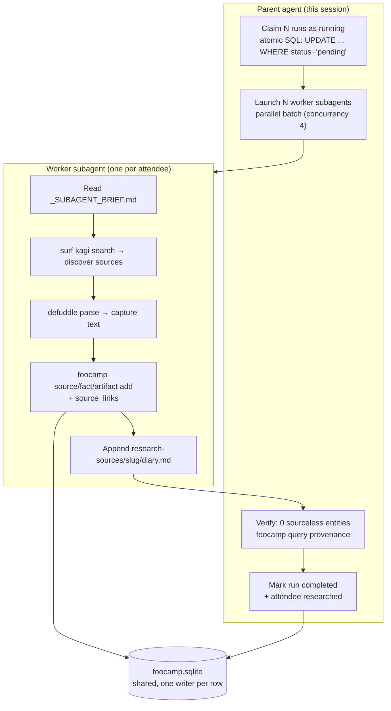

# Foo Camp 2026 Attendee Research

This project researches the ~180 attendees of Foo Camp 2026 and builds source-backed, meeting-prep-ready profiles in a shared SQLite database, almost entirely through orchestrated pi subagents. The interesting part is not the data — it is the orchestration: a *claim-then-research* pattern that lets multiple parallel worker agents safely fill one database, a single shared "brief" file that makes every worker behave consistently, and a follow-on *Kagi overhaul* pass that enriches early source-thin profiles. Along the way we hit and diagnosed a real pi-subagents async bug that is worth recording on its own.

> [!summary]
> The project has three identities worth keeping separate:
> 1. a **colleague-research dataset** — ~180 Foo Camp 2026 attendee profiles in SQLite, each with source-linked facts, artifacts, topics, glossary, questions, work history, and generated meeting-prep sections;
> 2. a **subagent orchestration methodology** — claim-then-research batching, a shared brief as the single source of truth, and an enrichment overhaul pass that reuses existing data instead of redoing it;
> 3. a **pi-subagents async infra finding** — foreground subagents work; async subagents crash on spawn because the detached runner cannot resolve the host `pi` package peer dependency, with a one-line symlink workaround.

## Why this project exists

Foo Camp brings together a large, diffuse group of people. Before the event you want to know who you might meet: what they work on, what they have built, what they think about, and what you could productively talk to them about. Doing that for ~180 people by hand is tedious; doing it well requires real web research (Wikipedia, personal sites, CVs, interview transcripts, talks, papers) and then structuring every claim against a cited source.

The project automates that with a Glazed-based Go CLI (`foocamp`) backed by SQLite, and fills the database with parallel pi subagent workers. Every entity — every fact, artifact, glossary term, question — is required to carry a `source_link` plus a `source_explanation`, so the whole dataset is auditable: `foocamp query provenance <slug>` reports sourceless counts per entity type and the target is always zero.

## Current project status

Active and mid-flight. The directory encodes the project start date (`2026-06-25--foocamp-research`).

Database state (as of the report):

- **Attendees:** 90 `researched`, 91 `seeded` (not yet researched).
- **Research runs:** 94 `completed`, 87 `pending`, 6 `running` (2 of those are live Kagi-overhaul runs; 4 are stale leftovers from crashed async launches).
- **Entity totals:** 647 sources, 1,385 facts, 665 artifacts, 571 attendee topics, 817 glossary terms, 714 questions, 374 work-history items, 685 related-people ideas, 325 generated sections, and 5,717 source links tying it all back to evidence.

What is done:

- The `foocamp` CLI (prebuilt binary at `./bin/foocamp`) with `attendee`, `run`, `source`, `fact`, `artifact`, `topic`, `glossary`, `question`, `work-history`, `related`, `generated`, `step`, and `query provenance` subcommands.
- Batches 1–5 (~attendee ids 2–82) researched by parallel subagent workers, all verified: 0 sourceless entities, per-attendee diaries present.
- A Kagi-driven **overhaul enrichment** pattern, validated on 4 attendees (esther-dyson, gene-kim, eliza-kosoy, eric-faurot) and running on 2 more.

What is still incomplete:

- ~91 attendees still `seeded` (need a first research pass).
- ~87 runs still `pending`.
- 4 stale `running` runs (ids 83–86) from crashed async launches need to be reset to `pending` or completed in the foreground.
- The async subagent path is only usable via the local symlink workaround (see [Implementation details](#implementation-details)).

## Project shape

There are four layers, each of which can be changed independently:

1. **The SQLite schema + `foocamp` CLI** — the substrate. One attendee per row; facts/artifacts/topics/glossary/questions/work-history/related/generated-sections all foreign-keyed to the attendee; a `source_links` join table connecting any entity to any source with an explanation string; `research_runs` and `research_steps` for bookkeeping.
2. **The shared brief** — `research-sources/_SUBAGENT_BRIEF.md`. The single source of truth every worker reads: a CLI cheat sheet, the per-entity workflow, a checklist, and an efficiency/time-budget section (section 8) that caps sources and facts to prevent timeouts.
3. **The worker subagents** — stateless `worker` agents, launched in parallel batches, each handed one attendee plus a disambiguation hint. They use the prebuilt binary (never `go run`), discover sources via `surf kagi search`, capture with `defuddle`, and write directly to the shared DB.
4. **The overhaul pass** — `research-sources/_OVERHAUL_PROMPT.md`. A second, optional pass for already-`researched` attendees that adds source *richness* (CVs, interview transcripts, talks, papers) without redoing the existing, correct-but-thin research.

## Architecture

The core loop is a deliberately safe parallel write into one shared database. The parent agent never researches itself; it only claims work, hands it to workers, and verifies.



The safety property comes from the **claim** step: before launching any worker, the parent atomically marks exactly N pending runs as `running` with a single `UPDATE ... WHERE status='pending' ... LIMIT N`. Because a teammate runs the same workflow concurrently, this prevents two agents claiming the same attendee. A worker that crashes leaves its run stuck at `running`, which is why stale `running` rows need periodic cleanup.

## Implementation details

### Claim-then-research: the atomic claim

The whole multi-agent safety story rests on one SQL statement the parent runs before each batch:

```sql
UPDATE research_runs SET status='running'
WHERE status='pending'
  AND attendee_id IN (
    SELECT a.id FROM attendees a
    JOIN research_runs r ON r.attendee_id = a.id
    WHERE a.status != 'researched' AND r.status = 'pending'
    ORDER BY a.id LIMIT N
  );
```

This is atomic from SQLite's perspective, so two concurrent parents cannot claim the same row. Workers are then told their run is *already* `running` and must only mark it `completed` at the end — they never mark `running` themselves, which removes a whole class of collision bugs.

The subtlety is the failure mode: a worker that dies mid-run leaves the run at `running` forever. There is no automatic reconciliation back to `pending`; the parent has to spot these (the status returns `running` but no live process exists) and either reset them or launch a focused "completion" worker that fills the gaps rather than redoing from scratch.

### The brief as the single source of truth

Every worker reads `research-sources/_SUBAGENT_BRIEF.md` in full before doing anything. This is what makes a fleet of stateless agents consistent. The brief hard-codes the CLI cheat sheet (including the exact `attendee update <slug> --status researched` positional-slug syntax that bit us early on), the per-entity add workflow with `--source` + `--source-explanation`, and — critically — a time-budget section that caps a pass at roughly 5 sources and 12 facts. That cap was added after the first batch timed out at 50 minutes; it turned a "research exhaustively" task into a "hit the checklist minimums and finish" task and eliminated timeouts from that point on.

### Foreground vs async subagent execution

pi-subagents can run a batch two ways, and the difference matters a lot:

- **Foreground parallel** (the `tasks:[...]` array, no `async`): runs *inline inside the host `pi` process*. Blocks the parent session, but reliable. A transient upstream model 502 only eats the worker's final summary — the worker has usually already written all its DB rows and marked its run `completed` before the 502, so the data survives.
- **Async** (`async: true`): spawns a **detached background OS process** so the parent is free. Fast and non-blocking — when it works.

The host-process detail is the whole story of the next section.

### The async subagent crash (root cause + fix)

This is the most reusable finding in the project and the reason async was unusable until patched.

**Symptom.** Every `async: true` batch failed in about one second with an opaque message:

```
Async runner process <pid> exited or disappeared before writing a result.
Marked run failed by stale-run reconciliation.
```

No child session was persisted, so `resume` was unavailable. Foreground runs of the *same* tasks always succeeded, which narrowed the problem to the async-detachment path.

**How async actually spawns.** The async path (`spawnRunner` in `src/runs/background/async-execution.ts`) does:

```js
const proc = spawn(nodeCommand, [jitiCliPath, runner, cfgPath], {
  cwd, detached: true, stdio: "ignore", windowsHide: true,
});
proc.unref();
```

That is a *fresh* `node` + jiti process running `src/runs/background/subagent-runner.ts`, which then spawns `pi` children per task. Because `stdio: "ignore"`, all of the detached process's stderr is discarded — which is exactly why the reconciler could only report "exited or disappeared" with no cause. To see the real error you have to reproduce the spawn manually with stdio visible:

```bash
node node_modules/jiti/lib/jiti-cli.mjs src/runs/background/subagent-runner.ts
# (no config arg → expect a usage error, but import-time errors surface instead)
```

**Root cause.** The runner crashes at import time:

```
Error: Cannot find module '@earendil-works/pi-coding-agent'
  at src/shared/utils.ts:8
  code: 'MODULE_NOT_FOUND'
```

The plugin declares `@earendil-works/pi-coding-agent` as a **peer dependency** but does not install it. The foreground path works because the plugin is loaded *by* the running `pi` process — and `pi` *is* that package, so the bare import resolves against the host's own `node_modules`. The detached async process is a brand-new node instance whose module resolution starts from the *plugin's* `node_modules`, where the peer dep is absent, so it dies at the first import. It is **not** a pi-version or rebase issue: `git diff HEAD..origin/main` for `async-execution.ts`, `pi-spawn.ts`, and `utils.ts` was empty, so rebasing the plugin on `main` changes nothing here. The host `pi` package even has a valid `exports` map for `.` — the detached process simply cannot find it.

**Workaround (applied, verified).** Symlink the host pi's package into the plugin's `node_modules` so the detached runner can resolve it:

```bash
ln -sfn /home/manuel/.nvm/versions/node/v22.22.1/lib/node_modules/@earendil-works/pi-coding-agent \
  .pi/git/github.com/nicobailon/pi-subagents/node_modules/@earendil-works/pi-coding-agent
```

After this, the detached runner imports cleanly (it then only fails on `JSON.parse` because of a missing config arg — expected) and **async batches run for real**: process stays alive, child sessions are created, workers stream their normal `umans` deprecation warnings and execute. This is the first async run that survived past the one-second crash window all session.

**Why it is only a workaround.** `npm install` or the next plugin rebase will wipe the symlink. The proper fix belongs upstream in pi-subagents: the spawn should resolve the host pi package (the `resolveInstalledPiPackageRoot()` helper already exists in `pi-spawn.ts`) and expose it to the detached process's resolution path — either by `NODE_PATH`, by a `createRequire` alias, or by bundling the peer dep. Until then, the symlink must be re-applied after every install.

### The Kagi overhaul: enrich, don't redo

Early research batches ran without working web search (the `kagi_web_search` tool is not exposed to subagents, and DuckDuckGo HTML returned empty). Those profiles were *correct* — all high-confidence, all source-linked — but *source-thin*: they captured a person's visible presence (Wikipedia, personal site, a couple of profiles) and missed depth (CVs, interview transcripts, talks, papers). The overhaul pass, `research-sources/_OVERHAUL_PROMPT.md`, goes back and adds that richness *without redoing* the existing research.

The prompt is structured as Step 0 → Step 5:

1. **Step 0 — read the existing state.** Query current sources/facts/entity-type counts so the worker never duplicates.
2. **Step 1 — Kagi discovery.** Multiple `surf kagi search` angles tuned to facets (CV, interview, talk, paper, press, social).
3. **Step 2 — capture net-new sources.** A priority table: CV → transcript → talk → paper → press → blog → LinkedIn.
4. **Step 3 — add net-new facts, linked to new sources.** De-duplicate against existing facts; if a new source only restates an existing fact, strengthen the existing fact instead.
5. **Step 4 — fill missing/thin entity types** (topics, glossary, questions, work history, related, generated sections).
6. **Step 5 — diary + completion.** Append an `Overhaul` section to the existing diary (never overwrite); mark the run `completed`; leave the attendee `researched`.

The quality bar: ≥7 sources with at least one primary deep source, ≥15 facts all source-linked, all entity types populated, 0 sourceless, diary with before/after counts.

### Does Kagi actually improve quality?

Measured on the DB, yes — but in a specific way. The Kagi-enabled cohort captured roughly 2.4× more source text and ~33% more distinct sources than the no-Kagi cohort. The difference is **source depth and diversity, not correctness**: both cohorts were already 100% high-confidence and 0 sourceless. The clearest single example is Gene Kim — the overhaul took him from 5 sources / 14 facts / 24 KB to 10 sources / 27 facts / 173 KB, almost entirely from one 69 KB podcast transcript and one keynote PDF that hub-crawling from Wikipedia could never have found. Kagi's value is most pronounced for people whose key material lives in the long tail (interviews, talks, CVs) rather than on their Wikipedia page.

## Current user-facing commands

The prebuilt binary is `./bin/foocamp`; `DB=foocamp.sqlite`. The most-used commands:

```bash
# attendee + run bookkeeping
./bin/foocamp attendee get <slug> --db $DB --output yaml
./bin/foocamp attendee update --db $DB <slug> --status researched   # slug is POSITIONAL
./bin/foocamp run add --db $DB --attendee <slug> --goal "..." --status running --model overhaul
./bin/foocamp run update --db $DB --id <run_id> --status completed

# entity add (every entity takes --source + --source-explanation)
./bin/foocamp source add --db $DB --attendee <slug> --kind transcript --title "..." --url "..." --full-text-file /tmp/src.md
./bin/foocamp fact add --db $DB --attendee <slug> --simple-claim "..." --expanded-explanation "..." --kind role --confidence high --source <id> --source-explanation "..."

# the audit query — target is 0 across all 8 entity types
./bin/foocamp query provenance --db $DB <slug>
```

Workers discover and capture sources with:

```bash
surf kagi search --query "..."          # the kagi_web_search pi tool is NOT available to subagents
defuddle parse <url> --md | fold -w 100 -s > /tmp/src.md
```

## Important project docs

- `research-sources/_SUBAGENT_BRIEF.md` — the shared worker brief (CLI cheat sheet, workflow, checklist, time budget).
- `research-sources/_OVERHAUL_PROMPT.md` — the Kagi-driven enrichment prompt (Step 0 → 5, source-type priority table, quality bar).
- `research-sources/<slug>/diary.md` — per-attendee investigation diary, one per researched person.
- `ttmp/2026/06/25/FOOCAMP-CLI--foo-camp-attendee-research-sqlite-glazed-cli/design-doc/02-improvement-plan-search-instructions-and-tooling.md` — the improvement design doc (22 findings P0–P2) written from the friction we hit.
- `.pi/git/github.com/nicobailon/pi-subagents/src/runs/background/async-execution.ts` — the `spawnRunner` function where the async bug lives.

## Open questions

- Should the overhaul pass be run across the whole no-Kagi cohort (ids ~30–74), or only for attendees whose captured text falls below a threshold? The 4 test cases all paid off, but the gain is person-dependent.
- Is foreground-parallel "good enough" as the default, given it survives transient 502s and only async has the peer-dep bug? Foreground blocks the parent, which limits how many batches you can fire.
- The 4 stale `running` runs (ids 83–86): reset to `pending`, or complete in the foreground? Two of them (jake-hofman, janet-vestal-kelly) already have solid partial data and only need entity-type completion.

## Near-term next steps

1. Re-apply the pi-subagents `node_modules` symlink if any `npm install`/rebase happens, or async breaks again.
2. Reset/complete the 4 stale `running` runs (ids 83–86).
3. Scale the Kagi overhaul across the rest of the no-Kagi cohort using async (now that it works), in batches of 8.
4. Push the async peer-dep fix upstream to pi-subagents so the symlink workaround is not needed.

## Project working rule

> When a detached background runner "exits before writing a result" while the same task works in the foreground, the foreground path is silently resolving a peer dependency that the detached process cannot see. Reproduce the detached spawn manually with stdio *visible* — the real `MODULE_NOT_FOUND` is otherwise swallowed by `stdio: "ignore"`. And when enriching existing research, never redo from scratch: read the existing state, add only net-new sources, and de-duplicate facts against what is already there.
