# Building Combined Discord, HTTP, and Loupedeck Sites with Goja

This article documents the engineering process of building a local operator site that combines a Discord bot, an HTTP dashboard, SQLite-backed JavaScript state, and Loupedeck hardware controls in a single Go process. The reference implementation is the Conference Attendee Index, a demo that lets an operator browse a conference directory from a physical deck, a web dashboard, and Discord slash commands, with all three surfaces mutating one shared state.

The article is written for engineers who need to build similar combined sites or who need to understand where the current `go-go-golems` framework stack supports this pattern and where it requires project-local workarounds.

> [!summary]
> - A combined Discord + HTTP + Loupedeck site needs one Go process that owns the runtime lifecycle for all three surfaces. The generated xgoja command path handles module selection and metadata well, but a project-local Go runner is the right place for HTTP listener ownership, Loupedeck environment initialization, and database module registration.
> - The `go-go-goja` Express module uses planned routes. The old `app.get(path, handler)` API was removed. New code must use `app.get(path).public().handle(handler)`.
> - Loupedeck JS modules require a runtime environment to be installed before they load. Bot metadata discovery loads scripts outside that environment, so scripts must use safe optional requires during discovery.
> - Serial device permissions can differ between an old tmux server and a fresh shell. Starting a fresh named tmux server (`tmux -L <name>`) is the reliable way to run hardware demos.
> - The `go-go-goja` database module provides SQLite access to JavaScript through `require("database")`. It should be the durable store layer for this class of site, replacing JSON file persistence.

## Why this site pattern exists

A Discord bot alone handles text interactions. An HTTP dashboard alone handles visual operator control. A Loupedeck alone handles tactile hardware control. None of these surfaces is sufficient for an operator who needs all three simultaneously: the bot provides remote access, the dashboard provides search and overview, and the deck provides fast physical actions without looking away from the room.

The problem with running these as separate processes is state synchronization. If the dashboard owns attendee state, the deck must poll or subscribe to the dashboard. If Discord owns state, the dashboard and deck must call Discord's API. Each integration point adds latency, failure modes, and complexity that distracts from the actual domain logic.

The combined site pattern solves this by running one Go process with one Goja runtime. JavaScript registers all three surfaces: Discord commands, HTTP routes, and Loupedeck handlers. Every action calls the same domain helper functions. State changes propagate immediately because all surfaces read from the same in-memory model and the same durable store.

## The four-repository stack

The implementation draws on four local repositories, each owning a different layer of the stack.

```mermaid
graph TD
    subgraph "discord-bot"
        DB_FRAMEWORK["pkg/framework<br/>Go bot embedding"]
        DB_JS["internal/jsdiscord<br/>require('discord')"]
        DB_XGOJA["pkg/xgoja/provider<br/>xgoja provider"]
    end
    subgraph "go-go-goja"
        GGG_ENGINE["pkg/engine<br/>Runtime factory"]
        GGG_HTTP["modules/express<br/>require('express')"]
        GGG_DB["modules/database<br/>require('database')"]
        GGG_FS["modules/fs<br/>require('fs')"]
        GGG_XGOJA["pkg/xgoja<br/>Provider framework"]
    end
    subgraph "loupedeck"
        LP_DEVICE["pkg/device<br/>USB serial connection"]
        LP_RUNTIME["runtime/js<br/>require('loupedeck/*')"]
        LP_XGOJA["pkg/xgoja/provider<br/>xgoja provider"]
    end
    subgraph "project"
        RUNNER["cmd/confdeck/main.go<br/>Local Go runner"]
        BOT["bots/attendee-index/index.js<br/>Application script"]
        DOC["pkg/doc<br/>Glazed help playbook"]
    end
    RUNNER --> DB_FRAMEWORK
    RUNNER --> GGG_ENGINE
    RUNNER --> GGG_HTTP
    RUNNER --> GGG_DB
    RUNNER --> GGG_FS
    RUNNER --> LP_RUNTIME
    BOT --> DB_JS
    BOT --> GGG_HTTP
    BOT --> GGG_DB
    BOT --> LP_RUNTIME
```



| Repository | Responsibility |
| --- | --- |
| `discord-bot` | Discord gateway/session lifecycle, JavaScript bot DSL, slash command sync, outbound Discord operations |
| `go-go-goja` | Goja runtime factory, native JavaScript modules (express, database, fs, timer), xgoja provider framework |
| `loupedeck` | Loupedeck USB serial connection, retained UI rendering, reactive state, hardware event dispatch |
| Project | Local Go runner, application JavaScript, dashboard, scripts, embedded docs |

The key architectural decision is that the project repository owns the runtime lifecycle. It does not push site-specific behavior into any of the three framework repositories. This keeps the frameworks generic and reusable while allowing the project to compose them into a coherent application.

## The runtime ownership problem

The generated xgoja binary is excellent at module selection and metadata discovery. Running `xgoja doctor` validates the spec, and the generated binary can list bots, show help, and evaluate JavaScript in a fresh runtime. This path works for static checks.

The problem appears when the application needs a long-running HTTP listener alongside a Discord bot session. The xgoja HTTP provider command (`serve`) owns an HTTP server, but it is designed for jsverb-backed sites, not for Discord bot scripts that register Express routes at the top level. The Discord bot provider's `bots run` command opens the Discord gateway and dispatches events, but it does not own a long-running HTTP listener for routes registered inside the bot script.

The solution is a project-local Go runner. The runner explicitly starts a `gojahttp.Host`, binds it to a TCP listener, creates a Loupedeck runtime environment, registers all native modules, and then runs the Discord framework with `framework.WithRuntimeModuleRegistrars(...)`. This gives the project precise control over initialization order, shutdown, and resource ownership.

```go
func main() {
    cfg := parseConfig()
    ctx, stop := signal.NotifyContext(context.Background(), os.Interrupt, syscall.SIGTERM)
    defer stop()

    httpHost := gojahttp.NewHost(gojahttp.HostOptions{Dev: true, RejectRawRoutes: false})
    server, err := startHTTP(ctx, cfg.HTTPListen, httpHost)
    // ...
    defer server.Shutdown(ctx)

    registrar := &runtimeRegistrar{httpHost: httpHost, deck: deckSettings{...}}
    bot, err := framework.New(
        framework.WithCredentials(...),
        framework.WithScript(cfg.ScriptPath),
        framework.WithSyncOnStart(cfg.SyncOnStart),
        framework.WithRuntimeModuleRegistrars(registrar),
    )
    bot.Run(ctx)
}
```

The runtime registrar registers all native modules in one pass:

```go
func (r *runtimeRegistrar) RegisterRuntimeModule(ctx *engine.RuntimeModuleRegistrationContext, reg *require.Registry) error {
    setupDeckEnvironment(ctx.Context, ctx.VM, r.deck)

    db := databasemod.New(databasemod.WithConfigureEnabled(true))
    reg.RegisterNativeModule("database", db.Loader)
    reg.RegisterNativeModule("db", db.Loader)
    reg.RegisterNativeModule("fs", fsmod.New(fsmod.WithBackend(fsmod.OSBackend{})).Loader)
    reg.RegisterNativeModule("express", express.NewLoader(r.httpHost))
    reg.RegisterNativeModule("loupedeck/state", module_state.Loader())
    reg.RegisterNativeModule("loupedeck/ui", module_ui.Loader())
    // ...
    return nil
}
```

This pattern keeps the composition point in the project directory. The `discord-bot` framework remains focused on Discord lifecycle. The `go-go-goja` modules remain self-contained. The `loupedeck` runtime remains hardware-centric. The project glues them together.

## The Express planned-route API

The `go-go-goja` Express module underwent a significant API change. The old form accepted a handler as the second argument to the route method:

```js
// Old API — removed
app.get("/api/state", (req, res) => res.json(snapshot()))
```

The current API uses planned routes. Every route must explicitly declare its access mode before attaching a handler:

```js
// Current API
app.get("/api/state").public().handle((_req, res) => res.json(snapshot()))
```

For authenticated routes, the pattern is:

```js
app.get("/api/admin").auth("oidc").allow("read:admin").handle(handler)
```

The planned-route API was introduced to support Go-backed authentication, CSRF protection, and resource-bound authorization at route registration time rather than at request time. The route plan is compiled and validated by Go before the server starts accepting traffic. This means misconfigured routes fail fast at startup, not at first request.

The practical consequence for site builders is that every example using the old two-argument form must be migrated. The error message is explicit:

```text
TypeError: app.get(pattern, handler) was removed; use app.get(pattern).public().handle(handler) or app.get(pattern).auth(...).allow(...).handle(handler)
```

## The Loupedeck runtime environment

Loupedeck JavaScript modules are not self-initializing. The `loupedeck/state` module calls `envpkg.Lookup(runtime)` when it loads, and if no environment has been stored for that Goja runtime, it panics with:

```text
state module requires environment services
```

The environment is a `LoupeDeckEnvironment` struct containing a reactive runtime, a UI instance, a host runtime for hardware attachment, an animation runtime, a presentation runtime, and a metrics collector. It is created by calling `env.Ensure(&env.LoupeDeckEnvironment{...})` and stored with `env.Store(vm, environment)`.

The xgoja provider handles this automatically through its `hardwareCapability.InitRuntimeFromSections` method. But the Discord bot provider's metadata discovery path loads the bot script in a runtime that does not have the Loupedeck environment installed, because discovery happens before the hardware capability initializer runs.

The workaround in the reference implementation is a safe optional require:

```js
function safeRequire(name, fallback) {
  try {
    return require(name)
  } catch (_err) {
    return fallback
  }
}

const deckState = safeRequire("loupedeck/state", createFallbackStateModule())
const deckUI = safeRequire("loupedeck/ui", createFallbackDeckUIModule())
```

The fallback modules provide no-op implementations that allow metadata discovery to succeed. When the real runtime starts with the custom Go runner, the Loupedeck environment is installed before the script loads, and the safe require succeeds with the real modules.

This is a framework gap. A cleaner solution would be a first-class "metadata discovery mode" where the runtime loads scripts with stub modules that record which modules were requested without failing. The framework could then report which modules the script depends on without requiring all runtime environments to be initialized.

## Hardware debugging: the tmux permission problem

The Loupedeck Live connects as a USB CDC ACM device at `/dev/ttyACM0`. The device file has group `dialout` with read-write permissions:

```text
crw-rw----+ 1 root dialout 166, 0 Jun 27 20:18 /dev/ttyACM0
```

The user is a member of `dialout`, so opening the device from a fresh shell works. The stock `loupedeck run` command succeeds. The local source `go run ./cmd/loupedeck run ...` also succeeds.

The failure appeared only when running inside an existing tmux server. The process reported:

```text
connect loupedeck /dev/ttyACM0: unable to open serial device "/dev/ttyACM0"
```

The root cause is that tmux servers are long-running processes. If the user was added to the `dialout` group after the tmux server started, or if udev ACLs changed since the server launched, the tmux server process retains the old supplementary groups. New panes created inside that server inherit the old group membership and cannot open the device.

The solution is to start a fresh tmux server with a separate socket name:

```bash
tmux -L confdeck new-session -d -s confdeck-demo -- bash -lc '...'
```

The `-L confdeck` flag creates a new tmux server under the socket name `confdeck`. This server inherits the current process's group membership and can open `/dev/ttyACM0`.

This is a general problem for hardware demos run inside tmux. The operator should either restart the default tmux server after group changes or use named sockets for hardware runs.

## SQLite as the durable store

The `go-go-goja` database module provides SQLite access to JavaScript through a simple SQL interface. The module is registered as `require("database")` or `require("db")` and exposes four functions:

| Function | Purpose |
| --- | --- |
| `database.configure(driver, dsn)` | Open a connection. Driver is `"sqlite3"`. DSN is a file path or `:memory:`. |
| `database.query(sql, ...args)` | Execute a SELECT and return an array of row objects. |
| `database.exec(sql, ...args)` | Execute a statement and return `{ success, rowsAffected, lastInsertId }`. |
| `database.begin()` | Start a transaction with `query`, `exec`, `commit`, and `rollback`. |

The Discord knowledge-base bot demonstrates a mature store pattern using this module. The store creates a schema on first run, seeds from JSON if the database is empty, and routes all reads and writes through SQL. This is the pattern the attendee index should adopt.

The migration path from JSON file persistence to SQLite is:

1. Keep `data/attendees.seed.json` as bootstrap input only.
2. On startup, call `database.configure("sqlite3", dbPath)`.
3. Create the schema if it does not exist.
4. If the `attendees` table is empty, import the seed JSON.
5. Replace in-memory `model.attendees` reads with SQL-backed `store.list()`, `store.search()`, `store.get()` functions.
6. Replace `saveModel()` with SQL `INSERT`/`UPDATE` statements.
7. Keep Loupedeck reactive signals only for currently focused, filter, and status state. The durable store is SQLite, not the signal graph.

## The dashboard visual language

The dashboard uses a monochrome visual language inspired by early Macintosh constraints, but without the cosmetic elements that make a UI look like a retro desktop simulation. The constraints are:

- No fake window chrome (title bars, close buttons, resize handles).
- No menu bar.
- No Chicago font or other period-specific bitmap fonts.
- Modern geometric typography: Typekit Avant Garde.
- Monochrome structure: white background, black rules, outline buttons.
- Accent colors only for text foreground, not fills.

The Avant Garde typeface is loaded via Typekit:

```html
<link rel="stylesheet" href="https://use.typekit.net/czv3hmi.css">
```

The CSS uses the type family with light (300) and bold (700) weights:

```css
:root {
  font-family: "itc-avant-garde-gothic-pro", sans-serif;
  font-weight: 300;
  color: var(--ink);
  background: var(--paper);
}
```

The layout uses a two-column grid: a main section for the focused attendee card and actions, and an aside for search results and a deck map. The grid collapses to a single column on narrow viewports.

## Validation sequence

A combined site should be validated in layers, from cheapest to most integrated. Starting with a live Discord guild and hardware is the most expensive test and should come last.

| Layer | Command | What it proves |
| --- | --- | --- |
| Go compilation | `GOWORK=$PWD/go.work go test ./...` | The runner and doc package compile. |
| xgoja spec validation | `make doctor` | The spec resolves local modules via go.work. |
| Generated binary | `make build` | The xgoja binary builds with all providers. |
| Module availability | `make eval` | `require()` succeeds for discord, express, fs, timer, loupedeck/state. |
| Bot discovery | `make bots-list` / `make bots-help` | The bot script is discovered and its commands are listed. |
| HTTP route registration | `make smoke-http` | Routes serve JSON and HTML with hardware disabled. |
| Live Discord + HTTP | `DECK_ENABLED=false ./scripts/run-with-discord-env.sh --sync-on-start=true` | Discord gateway connects and commands sync. |
| Full hardware | `DECK_ENABLED=true DECK_DEVICE=/dev/ttyACM0 ./scripts/run-with-discord-env.sh --sync-on-start=true` | The deck renders and hardware inputs mutate state. |

## Framework improvement opportunities

The implementation process exposed seven framework-level gaps that, if addressed, would make building combined sites smoother.

1. **xgoja example freshness.** Several examples in `discord-bot` and `loupedeck` use legacy xgoja specs with `runtimes:` and `commandProviders:` sections. Current xgoja rejects these. The examples should be migrated to `schema: xgoja/v2` with top-level `runtime.modules` and `commands`. CI should build all examples against current xgoja.

2. **xgoja and go.work interaction.** Running the xgoja CLI under `GOWORK=$PWD/go.work` fails because xgoja generates a temporary module outside the workspace. The workaround is to run the CLI with `GOWORK=off` while the spec points to the workspace file. This should be documented or xgoja should isolate generated builds from the caller's `GOWORK`.

3. **Bot metadata discovery and optional modules.** Scripts that `require("loupedeck/state")` at the top level fail during metadata discovery because the Loupedeck environment is not installed yet. The framework should provide a discovery-safe mode where module loads are recorded but do not fail, or where the discovery runtime has stub environments pre-installed.

4. **Express planned-route migration.** The old `app.get(path, handler)` API is removed, but examples and documentation should consistently show the new `.public().handle(...)` form. A migration guide or linter rule would help.

5. **First-class site host pattern.** The local Go runner works for one project, but a reusable `goja-site` package that handles HTTP listener, database, filesystem, Express, Loupedeck, and Discord composition would reduce boilerplate for future sites.

6. **Loupedeck serial retry.** The connection code retries websocket dial timeouts but does not retry `unable to open serial device` errors. A short retry on serial open failure would make hardware connections more reliable.

7. **SQLite store standardization.** The knowledge-base bot store pattern is good but not extracted into a reusable module. A `store-sqlite` helper that handles schema creation, seeding, and common query patterns would lower the barrier for new sites.

## Where to look for API details

The API surface for a combined site spans four repositories and five CLIs. The following commands are the first source for API questions because they reflect installed binaries:

```bash
xgoja help --all
goja-repl help --all
discord-bot help --all
loupedeck help --all
```

The following files are the second source for implementation details:

| Area | File |
| --- | --- |
| Discord framework | `/home/manuel/code/wesen/go-go-golems/discord-bot/pkg/framework/framework.go` |
| Discord JS API | `/home/manuel/code/wesen/go-go-golems/discord-bot/internal/jsdiscord/` |
| Express module | `/home/manuel/code/wesen/go-go-golems/go-go-goja/modules/express/` |
| Database module | `/home/manuel/code/wesen/go-go-golems/go-go-goja/modules/database/database.go` |
| Loupedeck provider | `/home/manuel/code/wesen/go-go-golems/loupedeck/runtime/js/provider/provider.go` |
| Loupedeck modules | `/home/manuel/code/wesen/go-go-golems/loupedeck/runtime/js/module_*/` |
| xgoja v2 examples | `/home/manuel/code/wesen/go-go-golems/go-go-goja/examples/xgoja/` |

## Related notes

- Reusable Glazed help playbook: `pkg/doc/playbooks/01-discord-http-loupedeck-site-playbook.md` in the project repository.
- Implementation diary: `ttmp/2026/06/27/DISCORD-LOUPEDECK-001--discord-bot-with-loupedeck-and-goja-http-control/reference/01-investigation-diary.md`.
- Loupedeck JS API fix commit: `b337fdd` in the Loupedeck repository.
