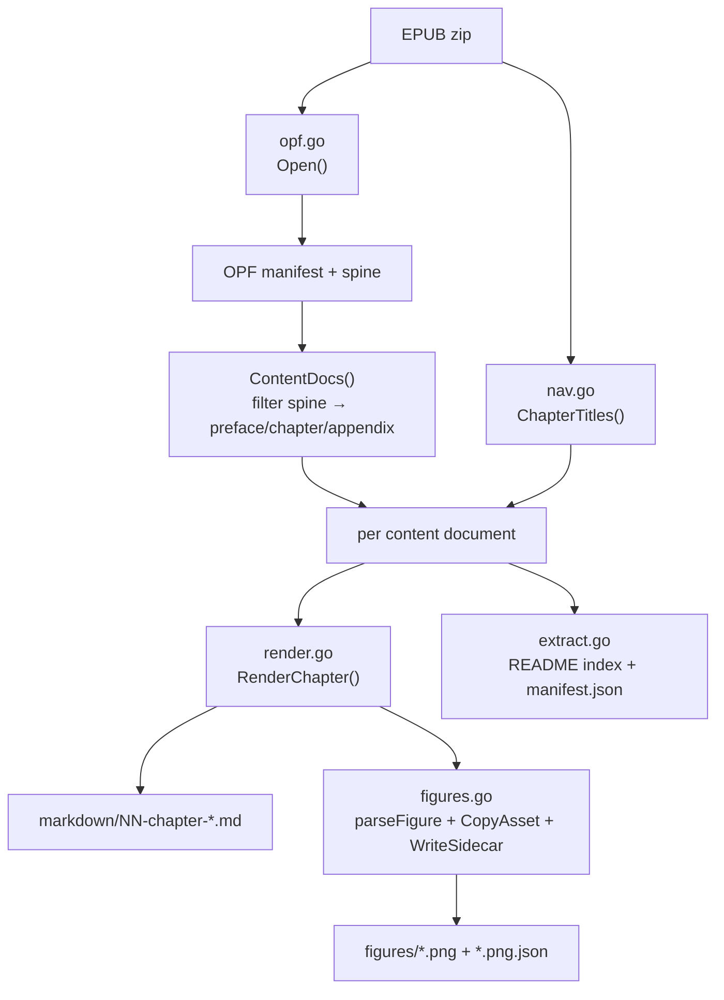

# EPUB to Markdown Extraction — Deep Dive Technical Report

This article documents the design and implementation of `epub-extract`, a Go command-line tool that converts a born-digital EPUB into clean Markdown — one file per chapter, with figures extracted as image files and described by JSON sidecars. It also documents the EPUB format itself, because understanding how the extractor works requires understanding what an EPUB contains and why it is structured the way it is. The motivating input is *AI Systems Performance Engineering* (Chris Fregly, O'Reilly, 2025), but the rendering rules live in code, so the same tool parses any O'Reilly-style EPUB consistently.

> [!summary]
> This report covers four things you should take away:
> 1. What an EPUB is: a zip of XHTML content documents plus an OPF manifest and spine, where the spine defines reading order and the XHTML already carries perfect structure.
> 2. Why no OCR is needed: born-digital EPUBs contain structured HTML, so extraction is a deterministic parse, not a model call. This is the inverse of the sibling scanned-PDF OCR project.
> 3. How `epub-extract` is built: a Go + Glazed command-line layer over a pure library layer that walks the XHTML block tree and renders Markdown chunks, with figure extraction and sidecar metadata.
> 4. The subtle failure modes: invisible index anchors, syntax-highlight spans inside code, blocks nested inside definition-list entries, and why a parallel review pass caught a data-loss bug that a plain diff missed.

## Why this note exists

There is a sibling project, `2026-05-20--book-ocr`, that transcribes *scanned* page images into Markdown using a vision-language model and a durable workflow runtime. That project is necessary because a scanned PDF has no extractable text. An EPUB is different: it is *born-digital*. Its text, headings, tables, code, and figures are present as real HTML elements inside a zip archive. Converting an EPUB to Markdown is therefore not an OCR problem. It is a parsing and rendering problem, and the correct solution is deterministic.

This article exists to preserve the full reasoning behind that distinction, the architecture that follows from it, and the specific rendering rules that make the output clean. It is written for an engineer who has never opened an EPUB and never used the Glazed command framework. Each concept is established before it is used.

## The EPUB format

An EPUB is a zip archive with a fixed internal layout. Renaming the file extension from `.epub` to `.zip` and unarchiving it reveals the structure:

```
mimetype                         application/epub+zip (20 bytes, stored uncompressed)
META-INF/container.xml          points to the OPF package file
OEBPS/content.opf                the OPF: manifest + spine + metadata
OEBPS/toc01.html                 the navigation document (human table of contents)
OEBPS/toc.ncx                    legacy NCX table of contents
OEBPS/preface01.html             a content document (XHTML)
OEBPS/ch01.html ... ch20.html    content documents, one per chapter
OEBPS/app01.html                 appendix
OEBPS/assets/aisp_0101.png       figure images
OEBPS/epub.css                   stylesheet
OEBPS/*.otf                      embedded fonts
```

The directory `OEBPS` (Open eBook Publication Structure) holds the publication content. The two files that govern extraction are `content.opf` and the navigation document. Everything else is a resource that those two files reference.

### The OPF manifest and spine

`content.opf` is an XML document. It contains three sections that matter to an extractor: `<metadata>`, `<manifest>`, and `<spine>`.

The `<metadata>` section carries Dublin Core facts about the book: title, creator, publisher, identifier (the ISBN), and date. These are surfaced in the generated index and are not involved in rendering decisions.

The `<manifest>` is the authoritative list of every file in the publication. Each `<item>` declares an `id`, an `href` (the file path, relative to the OPF), a `media-type`, and optional `properties`. The manifest answers one question: which files exist. It does not say what order to read them in.

The `<spine>` answers that question. It is an ordered list of `<itemref idref="...">` elements, each referencing a manifest item by id. The spine is the reading order. It is the difference between a flat directory of HTML files and a book. For extraction, the spine is the single most important structure in the EPUB: it defines which content documents to process and in what sequence.

```xml
<spine toc="toc.ncx">
  <itemref idref="cover"/>
  <itemref idref="preface-id690"/>
  <itemref idref="chapter-id4"/>     <!-- ch01.html -->
  <itemref idref="chapter-id372"/>   <!-- ch02.html -->
  ...
  <itemref idref="appendix-id702"/>  <!-- app01.html -->
  <itemref idref="index-id703"/>     <!-- ix01.html, skipped -->
</spine>
```

Not every spine entry becomes an output file. The extractor walks the spine and classifies each entry by its basename. Entries named `chNN.html` become chapters, `appNN.html` becomes an appendix, and `prefaceNN.html` becomes the preface. Cover, dedication, title page, copyright page, table of contents, colophon, and index are classified as non-content and skipped. This classification is how 29 spine entries become 22 output documents (1 preface, 20 chapters, 1 appendix).

### Content documents are XHTML

Each content document is an XHTML file. The structure that the renderer must understand looks like this:

```html
<section data-type="chapter" epub:type="chapter" data-pdf-bookmark="Chapter 1. ...">
  <div class="chapter" id="ch01_introduction_and_ai_system_overview_...">
    <h1><span class="label">Chapter 1. </span>Introduction and AI System Overview</h1>
    <p>Body prose with <em>emphasis</em>, <code>inline code</code>, and
       <a href="https://oreil.ly/ENITx">links</a>.
       <a contenteditable="false" data-type="indexterm" ...></a>
    </p>
    <section data-type="sect1"><div class="sect1" id="...">
      <h1>The AI Systems Performance Engineer</h1>
      <p>...</p>
      <div data-type="tip"><p>A callout.</p></div>
      <figure><div id="ch01_figure_1_..." class="figure">
        
        <h6><span class="label">Figure 1-1. </span>Caption text</h6>
      </div></figure>
      <pre data-type="programlisting" data-code-language="cpp"><code>...</code>...</pre>
      <table id="..."><caption>...</caption><thead>...</thead><tbody>...</tbody></table>
    </div></section>
  </div>
</section>
```

Several details in this structure drive specific rendering rules, and each is a place where a naive extractor produces wrong output:

- The chapter title lives in the first `<h1>`, prefixed by a `<span class="label">Chapter N. </span>`. Section headings at depth one also use `<h1>`, so the heading level cannot be inferred from the tag alone. It must be inferred from the enclosing section.
- **Index terms** are empty `<a data-type="indexterm">` anchors scattered through prose. They are invisible markers for the back-of-book index. They carry no text content. An extractor that concatenates all `<a>` text will corrupt the prose.
- **Callouts** are `<div data-type="tip">` or `<div data-type="note">` blocks. The data-type attribute distinguishes them from layout divs.
- **Figures** are `<figure>` elements wrapping an `` and an `<h6>` caption that begins with a `Figure N-M.` label.
- **Code** is `<pre data-type="programlisting" data-code-language="cpp">` whose children are many `<code class="...">` syntax-highlight spans. The raw code is the concatenation of the text of those spans; the span class names are presentation metadata, not content.
- **Cross-references** are `<a data-type="xref" href="#anchor">Chapter 1</a>`. They point at ids inside other chapter files.

## Why no OCR is needed

The decisive design choice is to parse the XHTML directly rather than to call a model. This choice follows from the input, not from a preference for parsing.

A scanned page is an image. The relationship between pixels and characters is not encoded anywhere; it must be inferred. That inference is what OCR does, and vision-language models do it better than classical OCR for complex layouts. The sibling `2026-05-20--book-ocr` project exists for exactly this case, and it pays the costs: non-deterministic output, per-page model calls, a durable workflow runtime to manage retries and progress, and constant vigilance against model hallucination (the project's central bug was the model copying adjacent-page content into the target page).

A born-digital EPUB has none of these properties. The text is already characters in an XML document. The headings are already `<h1>` elements. The tables are already `<table>` elements with rows and cells. The figures are already `` elements pointing at image files. There is nothing to infer. The correct operation is to read the structure and translate it, and the correct tool is an HTML parser, not a model.

| Property | Scanned PDF (book-ocr) | Born-digital EPUB (epub-extract) |
|---|---|---|
| Text representation | Pixels in an image | Characters in XHTML |
| Headings, tables, code | Must be inferred visually | Present as HTML elements |
| Source of truth | Model output (structured JSON) | The XHTML DOM |
| Determinism | Non-deterministic; requires vigilance | Deterministic; identical input → identical output |
| Cost | One model call per page | None |
| Infrastructure | Scraper workflow runtime, SQLite, retries | Plain Go, single pass |

This distinction is the foundation of the entire architecture. Because the input is structured, the output can be deterministic, and deterministic output needs no retry, no progress database, and no workflow runtime.

## Architecture

The code is split into two layers with a strict boundary. A thin command-line layer depends on the Glazed framework and cobra. A pure library layer depends only on the Go standard library and `golang.org/x/net/html`, and contains all parsing and rendering logic. The library reads bytes and writes bytes. It has no knowledge of command-line flags, output formats, or logging.



```
cmd/epub-extract/                  command-line layer (Glazed + cobra)
  main.go                          root command: logging + help + Register
  cmds/
    root.go                        Register() wires extract + inspect
    extract.go                     `extract` Glazed command
    inspect.go                     `inspect` Glazed command
internal/epub/                     library layer (plain Go, no Glazed)
  opf.go                           EPUB zip + OPF manifest/spine
  nav.go                           chapter-title extraction from the nav document
  html.go                          shared x/net/html helpers
  render.go                        block model + deterministic Markdown renderer
  figures.go                       figure extraction + sidecar JSON
  extract.go                       top-level driver + README index
```

The library does not know that a command line exists. The command line does not contain parsing logic. This separation makes the library testable in isolation and makes the command definitions short: each command decodes its flags into a settings struct, calls a library function, and emits rows.

### The command-line layer and Glazed

Glazed is a command framework that sits on top of cobra. It replaces hand-written flag parsing with a structured model: flags and positional arguments are declared as typed fields, grouped into sections, decoded into a settings struct, and the command emits rows that Glazed renders into whatever output format the user requested (table, JSON, YAML, CSV). The extractor gains structured output for free because it never prints output itself.

Every Glazed application initializes its root command the same way. The root owns three responsibilities: logging, the help system, and subcommand registration.

```go
rootCmd := &cobra.Command{
    Use: "epub-extract",
    PersistentPreRunE: func(cmd *cobra.Command, args []string) error {
        return logging.InitLoggerFromCobra(cmd)   // enables --log-level everywhere
    },
}
logging.AddLoggingSectionToRootCommand(rootCmd, "epub-extract")
helpSystem := help.NewHelpSystem()
help_cmd.SetupCobraRootCommand(helpSystem, rootCmd)   // enables `epub-extract help`
cmds.Register(rootCmd)                                 // registers extract + inspect
rootCmd.Execute()
```

A Glazed command is a struct that embeds `*cmds.CommandDescription` and implements `RunIntoGlazeProcessor`. The pattern is uniform: declare fields, build the description, decode into a settings struct, perform the work, emit rows. The decode step reads from `schema.DefaultSlug`, which is where Glazed places the command's own flag values.

```go
type ExtractCommand struct {
    *cmds.CommandDescription
}

type ExtractSettings struct {
    Epub    string `glazed:"epub"`     // binds the --epub flag
    Out     string `glazed:"out"`
    Verbose bool   `glazed:"verbose"`
}

func (c *ExtractCommand) RunIntoGlazeProcessor(ctx context.Context, vals *values.Values, gp middlewares.Processor) error {
    s := &ExtractSettings{}
    vals.DecodeSectionInto(schema.DefaultSlug, s)
    res, _ := epub.Extract(epub.ExtractOptions{EpubPath: s.Epub, OutRoot: s.Out})
    for _, r := range res.Manifest {
        gp.AddRow(ctx, types.NewRow(
            types.MRP("file", r.File),
            types.MRP("title", r.Title),
            types.MRP("figures", len(r.Figures)),
            // ...
        ))
    }
}
```

The `gp.AddRow` calls are what make `--output json` work without any extra code. Glazed's processor receives the rows and formats them. The command never calls `fmt.Println` to produce its structured output.

Two commands are exposed. `inspect` is read-only: it opens the EPUB and prints the book metadata plus the ordered content documents with their resolved titles. `extract` runs the full pipeline and writes the output tree. `inspect` exists so that an operator can verify the spine and titles before committing to a full extraction.

```text
$ ./bin/epub-extract inspect --epub book.epub
[inspect] 22 content docs, 22 titles
| kind     | order_kind | num | source        | title                                            |
| metadata |            |     |               | AI Systems Performance Engineering (Chris Fregly)|
| content  | preface    | 0   | preface01.html| Preface                                          |
| content  | chapter    | 1   | ch01.html     | 1. Introduction and AI System Overview           |
| content  | chapter    | 2   | ch02.html     | 2. AI System Hardware Overview                   |
...
| content  | appendix   | 1   | app01.html    | Appendix: AI Systems Performance Checklist       |
```

## The renderer

`internal/epub/render.go` is where every Markdown convention is enforced. This file is the heart of the system. Changing how the book reads means changing this file.

### The block model and the chunk invariant

The renderer walks the chapter's element tree in document order. For each block-level element it produces one or more chunks. A chunk is a complete Markdown block: one paragraph, one table, one list, one fenced code block, one figure. The chunks are then joined with a single blank line.

```go
md := joinChunks(chunks)   // strings.Join(non-empty, "\n\n"), then collapse 3+ newlines
```

This invariant is what keeps paragraphs separated. A naive extractor that appends one line per element and joins with newlines will merge consecutive paragraphs into a single run of text, which is invalid Markdown: a single newline between two lines of text renders as a soft line break within one paragraph, not as two paragraphs. The chunk model prevents this by guaranteeing that every paragraph is a discrete block separated from its neighbors by a blank line.

The block elements that the renderer dispatches on are a fixed set: `p`, `h1` through `h6`, `ul`, `ol`, `table`, `pre`, `figure`, `blockquote`, `dl`, `div`, and `section`. Each maps to a dedicated renderer. Unknown elements are skipped rather than corrupted; their content does not appear, but the surrounding structure stays intact.

### Heading levels

The chapter title is emitted once as a single level-one heading. The chapter's own first `<h1>` is skipped so the title is not duplicated. After that, headings map according to the tag of the element and its position in the section hierarchy:

```text
chapter title (emitted once)    → # Title            (one #)
sect1 <h1>                      → ## ...             (two #)
sect2 <h2>                      → ### ...            (three #)
... up to six #
```

The mapping is computed directly from the heading tag. A level-two heading tag produces three hash characters, a level-three tag produces four, and so on, capped at six. The chapter title occupies the single level-one heading; everything beneath it descends from there.

### Inline rendering

Inline content — the text inside a paragraph, a list item, or a table cell — is rendered by a recursive function that walks the children of an element and produces Markdown. The rules are precise:

- Text nodes pass through unchanged.
- `<em>` and `<i>` become single-asterisk emphasis; `<strong>` and `<b>` become double-asterisk strong emphasis.
- `<code>` becomes a backtick-delimited code span. The backtick inside the content is escaped, and non-breaking spaces are converted to regular spaces.
- `<sub>` and `<sup>` are preserved as raw HTML, because Markdown has no subscript or superscript syntax.
- `<a href="http...">` becomes a Markdown link. `<a href="#anchor">`, a cross-reference to an id inside another chapter file, becomes bold text. Cross-file anchor links are brittle because anchors are not preserved across files, so the semantic intent is kept while the link target is dropped.
- `<a data-type="indexterm">` is dropped entirely. It is an invisible anchor for the back-of-book index and carries no text.

The index-term rule is the one most likely to be implemented incorrectly. An extractor that uses a generic "get all text" operation will include the text of these anchors, but the anchors are empty, so the corruption is not extra text; it is the disruption of word boundaries when the empty anchor sits in the middle of a word. Dropping them requires recognizing the `data-type` attribute and returning an empty string for the whole element.

### Tables

Tables become GitHub-flavored Markdown tables. The header row comes from `<thead>`; if no `<thead>` is present, the first body row is promoted to the header. Each cell is the inline text of its `<th>` or `<td>`, with two transformations: pipe characters are escaped so they do not break the table structure, and newlines — including the soft line breaks produced by `<br>` elements — are collapsed to spaces so a cell never spans multiple Markdown lines.

```text
| Metric              | No overlap        | Overlap (DDP)     |
| -------------------- | ----------------- | ----------------- |
| Comm start time     | After backward    | During backward   |
| GPU idle during comm| Yes               | Minimal           |
```

### Code blocks

Code is stored in the EPUB as a single `<pre>` element whose children are many `<code>` spans, one per syntax-highlight token. The class of each span names the token type (`kw` for keyword, `str` for string, and so on), but those classes are presentation metadata. The recoverable content is the concatenation of the text of all the spans, preserving the literal spacing and newlines of the original source.

The renderer strips every tag and keeps the raw text. The `data-code-language` attribute on the `<pre>` selects the fence language through a fixed map: `cpp` to `cpp`, `python` to `python`, `shell` to `bash`, `json` to `json`. If the code itself contains a run of three backticks, the fence is extended to four backticks so the content does not prematurely close the block. This case does not occur in the target book, but the guard exists so the renderer never produces malformed Markdown when it does.

````markdown
```cpp
__global__ void myKernel(float* input, int N) {
    int idx = blockIdx.x * blockDim.x + threadIdx.x;
    if (idx < N) { input[idx] *= 2.0f; }
}
```
````

### Whitespace normalization

A single helper, `cleanSpace`, is applied to nearly every piece of text the renderer emits. It unescapes HTML entities (`&amp;` to `&`), converts non-breaking spaces (`\u00a0`) to regular spaces, collapses runs of spaces and tabs to a single space, and trims the ends. This normalization is what makes the output deterministic. The source XHTML contains inconsistent whitespace introduced by the production pipeline, and without normalization the same logical content would render with different spacing depending on how the HTML was formatted.

## Figures and sidecars

`internal/epub/figures.go` handles everything except the Markdown image link itself. For every `<figure>` element that contains an ``, the extractor does three things.

First, it copies the image asset out of the EPUB zip into the output `figures/` directory. The copy is deduplicated by filename: an image referenced by two chapters is written once.

Second, it writes a JSON sidecar next to the image. The sidecar records the original source path, the alt text, the caption, the owning chapter file and title, and the figure's id.

```json
{
  "src": "assets/aisp_0101.png",
  "filename": "aisp_0101.png",
  "alt": "A Venn diagram illustrating the intersection of hardware, software, and algorithms...",
  "caption": "Codesigning hardware, software, and algorithms",
  "chapter_file": "ch01.html",
  "chapter_title": "1. Introduction and AI System Overview",
  "figure_id": "ch01_figure_1_1757308026008407"
}
```

Third, it renders the Markdown image link with a relative path from the chapter file to the figures directory, followed by an italic caption with the `Figure N-M.` label stripped.

```markdown


*Figure: Codesigning hardware, software, and algorithms*
```

The sidecar exists to separate generic storage from domain metadata. The image file is a binary asset; any tool can store it. The meaning of the image — its caption, its alt text, the chapter it belongs to — is domain data that belongs in a structured record next to it. A downstream search index or image gallery can read the sidecars without re-parsing the EPUB. This separation mirrors the figure-sidecar design in the sibling `book-ocr` project, where the workflow runtime stored image artifacts and the OCR application wrote the crop metadata.

The `figures/` directory also receives a `manifest.json` listing every figure across the whole book, written once at the end of the run.

## The driver

`internal/epub/extract.go` wires the layers together. It opens the EPUB, asks for the ordered content documents, resolves their titles from the navigation document, and iterates. For each document it renders the Markdown and the figures, writes the chapter file, copies the figures, writes the sidecars, and accumulates a manifest record. After the loop it writes the figure manifest and a README index.

```go
func Extract(opts ExtractOptions) (*ExtractResult, error) {
    e, _ := Open(opts.EpubPath)
    defer e.Close()
    docs   := e.ContentDocs()
    titles := ChapterTitles(e)
    for _, item := range docs {
        title := titles[base(item.Href)]
        md, figs := RenderChapter(e, item, title, "../figures/")
        write markdown/<slug>.md
        for _, f := range figs {
            f.Filename = e.CopyAsset(f.Src, figDir)
            WriteSidecar(figDir, f)
        }
    }
    WriteFigureManifest(figDir, allFigs)
    writeReadme(mdDir, e, result)
}
```

The README index is a Markdown file that lists every output chapter with its figure count and byte size, plus the book-level metadata pulled from the OPF. It is the entry point for anyone browsing the extracted output.

## A bug that a plain diff missed

The most instructive event in the project was a data-loss bug that went undetected by the obvious verification method and was caught only by a targeted review.

The natural way to verify a new extractor against a reference implementation is to diff their outputs. A Python prototype existed and had established the expected Markdown conventions. When the Go implementation was complete, the outputs were diffed chapter by chapter. The diff showed small whitespace differences in roughly two-thirds of the chapters — trailing spaces and a few formatting choices — and the content appeared complete. The diff was treated as evidence that the Go implementation was correct.

It was not. Two facts were hidden by the diff.

First, the renderer's definition-list handler treated a `<dd>` element as inline text. It called a function that concatenates the text content of the element's subtree. A `<dd>` in this book frequently contains not only paragraphs but also `<pre>` code blocks, `<table>` elements, and `<figure>` elements. The inline handler dropped all of them. Six code blocks and five figures were silently lost across the chapters that used definition lists this way.

Second, the Python prototype had the same bug. It treated `<dd>` the same way and dropped the same content. Because both implementations dropped the same blocks, the diff between them showed no difference. The verification method compared two broken implementations against each other and concluded they were correct.

The bug was found when the intern guide — written to document the system — claimed a specific figure count and code-block count, and a parallel review pass checked those claims against the code. The reviewer noticed that the figure count advertised in the guide did not match the figure count the driver could produce, traced the discrepancy to the definition-list handler, and found that `<pre>` and `<figure>` elements inside `<dd>` were never rendered. The fix was to make the definition-list handler render each block child of a `<dd>` through the normal block dispatcher, with the first text paragraph receiving the definition prefix and subsequent blocks rendering as their own chunks.

After the fix, the verification changed character. The relevant question stopped being "does the Go output match the Python output" and became "does the Go output match the source". The source contained 231 `<pre programlisting>` elements; the renderer now produces 231 fenced code blocks. The source manifest contained 202 image items; the renderer now extracts 202 figures. A plain diff against the still-broken Python reference would have reported the original, wrong count as correct.

The lesson is general. When the reference implementation and the system under test share an assumption, a diff between them cannot detect errors caused by that assumption. Verification must compare against the source of truth, not against another consumer of it. For a parser, the source of truth is the input; the check is that every input construct appears in the output.

## Output and verification

The target book produces a fixed, checkable output.

```text
markdown/
  00-README.md                                 index (contents + book metadata)
  00-preface-preface.md
  01-chapter-introduction-and-ai-system-overview.md
  ...
  20-chapter-ai-assisted-performance-optimizations-....md
  01-appendix-ai-systems-performance-checklist-....md
figures/
  aisp_0101.png ... aisp_2008.png              202 images
  aisp_0101.png.json ...                       202 sidecars
  manifest.json                                one record per figure
```

The checkable counts are derived from the source, not assumed:

- 22 content documents (1 preface + 20 chapters + 1 appendix), matching the 22 content entries in the spine after classification.
- 202 figures extracted, matching the 202 image items in the OPF manifest that are referenced by an `` inside a `<figure>`.
- 231 fenced code blocks, matching the 231 `<pre programlisting>` elements in the source.
- 56 tables, 80 definition lists, 16 blockquotes, 477 tip callouts, 16 note callouts.
- Code languages present: 101 C++, 84 Python, 43 shell, 1 JSON.

The build is clean: `go build ./...`, `go vet ./...`, and `gofmt -l` all pass with no output.

## Common failure modes

Several failure modes are specific to EPUB extraction, and each maps to a rendering rule.

**Invisible index anchors.** The `<a data-type="indexterm">` elements are empty and must be dropped. An extractor that includes their text will not add content, because there is none, but it will disrupt word boundaries when the anchor splits a word. The fix is to recognize the attribute and return an empty string for the element.

**Syntax-highlight spans inside code.** A `<pre>` element contains many `<code>` spans, one per token. An extractor that treats `<code>` as an inline code span will wrap each token in backticks and destroy the code. The fix is to strip all tags inside `<pre>` and keep the raw text.

**Production comments.** The source XHTML contains HTML comments with production notes (`<!--PROD: ...-->`). A parser that extracts comment text — which some HTML libraries do by default — will leak editorial notes into the output. The Go `x/net/html` parser treats comments as a distinct node type and does not include them in text extraction, so the Go implementation drops them correctly where a Python library that flattens comments did not.

**Blocks nested in definition lists.** A `<dd>` may contain `<pre>`, `<table>`, and `<figure>` elements. An extractor that treats `<dd>` as inline text drops all of them. The fix is to render each block child of a `<dd>` through the block dispatcher.

**Cross-file anchors.** Cross-references point at ids inside other chapter files. Markdown links to `other.md#anchor` are brittle because the anchors are not preserved. The chosen behavior is to render cross-references as bold text, preserving the intent that the phrase is a reference without producing a link that may not resolve.

## Working rules

- Treat a born-digital EPUB as structured input. The text is already present as HTML elements; the correct operation is to parse and translate, not to infer.
- Verify against the source, not against another implementation. A shared assumption hides in a diff between two systems that both hold it.
- Render to discrete chunks and join them with blank lines. This is the only way to keep paragraphs separated deterministically.
- Keep the library pure and the command line thin. The parsing and rendering logic has no dependency on the framework, which makes it testable and reusable.
- Separate generic storage from domain metadata. An image is a binary asset; its caption, alt text, and provenance are a JSON record beside it.
- Make the output checkable. Every count the extractor produces should match a count derivable from the source.

## Related notes

- Sibling project report: `Projects/2026/05/24/ARTICLE - Extracting Book OCR from Scraper - Workflow Runtime and External OCR Pipelines.md` — the scanned-PDF OCR pipeline and the workflow-runtime boundary that this project deliberately does not need.
- VLM OCR pipeline: `Projects/2026/05/20` notes on the sibling scanned-PDF transcription — the model-based approach that born-digital extraction replaces.
- Source repository: `/home/manuel/code/wesen/2026-06-30--ai-systems-ocr`, ticket `EPUB-MD-EXTRACT-001`, with the intern guide, conventions brief, and investigation diary under `ttmp/`.
