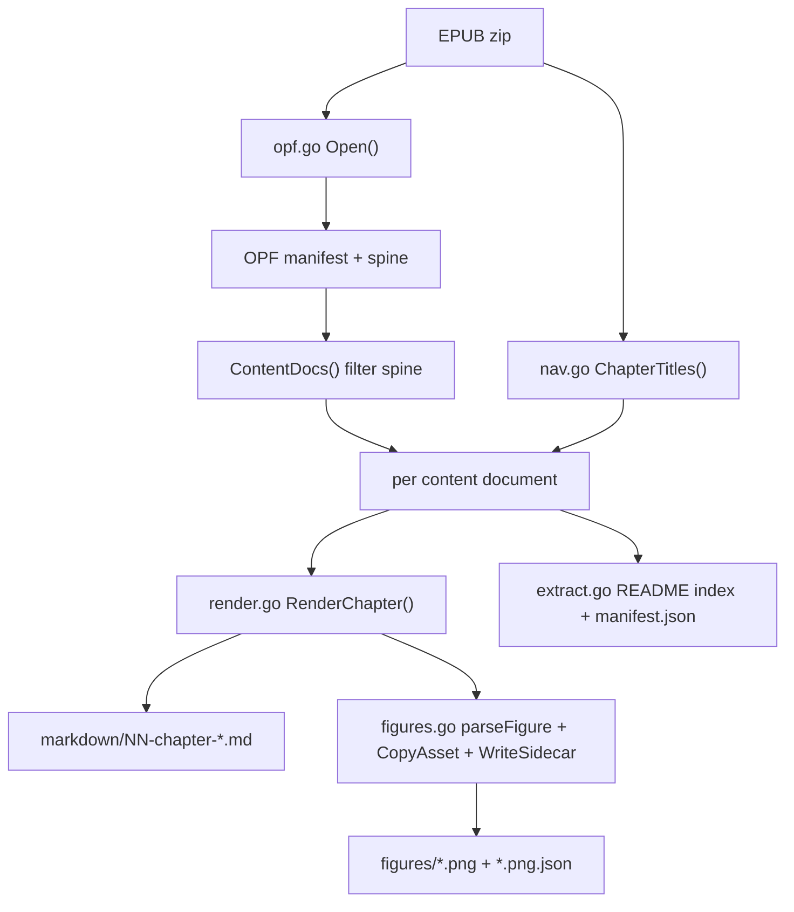

# epub-extract: A Born-Digital EPUB to Markdown Pipeline

This article documents the design and implementation of `epub-extract`, the tool built to prepare a born-digital EPUB for downstream research. The tool reads an EPUB and writes clean Markdown — one file per chapter — with figures extracted as image files and described by JSON sidecars. It is the front end of a research pipeline: before any GPU performance concept can be simulated or analyzed, the source book must exist as structured, searchable text. This article explains how that conversion works, why it requires no optical character recognition, and how the rendering rules that keep the output clean are encoded in code.

> [!summary]
> This report covers four things you should take away:
> 1. Why a born-digital EPUB is parsed, not OCRed: the XHTML inside the archive already carries perfect structure, so extraction is a deterministic translation rather than an inference.
> 2. How the EPUB container is structured: the zip archive, the OPF manifest and spine, and the XHTML content documents that hold the real content.
> 3. How `epub-extract` is built: a Go plus Glazed command layer over a pure library layer that walks the XHTML block tree and renders Markdown chunks, with figure extraction and sidecar metadata.
> 4. The subtle failure modes that a naive extractor gets wrong: invisible index anchors, syntax-highlight spans inside code blocks, blocks nested in definition lists, and production comments.

## Why this note exists

A later phase of the project studies chapters of *AI Systems Performance Engineering* (Chris Fregly, O'Reilly, 2025) by simulating their performance concepts. That study requires the book as text — chapter by chapter, with figures and captions intact, and with no rendering artifacts that would confuse a reader or a downstream tool. The book was supplied as an EPUB. The first task was therefore to build a reliable converter from that EPUB to clean Markdown.

This article exists to preserve the reasoning behind that converter. The decisive design choice — to parse the EPUB directly instead of running it through a vision model — follows from properties of the input, and the rendering rules that make the output clean each correspond to a specific feature of O'Reilly's XHTML markup. Both are worth recording so the tool can be maintained and extended without re-deriving the reasoning.

## The distinction that shapes the design

A scanned page is an image. The mapping from pixels to characters is not encoded in the file; it must be inferred. Optical character recognition performs that inference, and vision-language models perform it more accurately than classical OCR for complex layouts. That approach is necessary for scanned PDFs, and it carries costs: non-deterministic output, one model call per page, and constant vigilance against hallucination.

A born-digital EPUB is different. It is a zip archive whose contents include XHTML files. The text is stored as characters in those files. Headings are `h1` through `h6` elements. Tables are `table` elements with rows and cells. Code is `pre` elements. Figures are `img` elements that reference image files. Nothing needs to be inferred because the structure is already present as markup.

The correct operation for a born-digital EPUB is therefore parsing, not inference. Parsing is deterministic: the same input always produces the same output. It is also free, because it performs no model calls. The tool built here is an HTML parser coupled to a Markdown renderer. Its quality is bounded by the coverage of its rendering rules, not by the behavior of a model.

| Property | Scanned PDF | Born-digital EPUB |
|---|---|---|
| Text representation | Pixels in an image | Characters in XHTML |
| Headings, tables, code | Inferred by a model | Present as HTML elements |
| Determinism | Non-deterministic | Deterministic |
| Cost per page | One model call | None |
| Infrastructure | Retry, progress tracking, a workflow runtime | A single parsing pass |

## The EPUB container

An EPUB is a zip archive with a fixed internal layout. Unarchiving it reveals a structure centered on the Open eBook Publication Structure directory, conventionally named `OEBPS`.

```
mimetype                         application/epub+zip
META-INF/container.xml          points to the OPF package file
OEBPS/content.opf                the OPF: manifest, spine, and metadata
OEBPS/toc01.html                 the navigation document
OEBPS/preface01.html             a content document (XHTML)
OEBPS/ch01.html ... ch20.html    content documents, one per chapter
OEBPS/app01.html                 appendix
OEBPS/assets/aisp_0101.png       figure images
```

### The OPF manifest and spine

`content.opf` is an XML document with three sections that matter to an extractor: metadata, manifest, and spine.

The metadata section carries Dublin Core facts: title, creator, publisher, identifier, and date. These are surfaced in the generated index and do not affect rendering.

The manifest is the authoritative list of every file in the publication. Each item declares an id, a file path relative to the OPF, a media type, and optional properties. The manifest answers which files exist. It does not state an order.

The spine states the order. It is an ordered list of item references, each pointing at a manifest item by id. The spine is the reading order, and it is the structure that distinguishes a flat directory of HTML files from a book. For extraction, the spine defines which content documents to process and in what sequence. The extractor walks the spine and classifies each entry by its file name. Entries named `chNN.html` become chapters, `appNN.html` becomes an appendix, and `prefaceNN.html` becomes the preface. Cover, dedication, copyright, table of contents, colophon, and index are classified as non-content and skipped.

### Content documents are XHTML

Each content document is an XHTML file. The markup the renderer must understand looks like this:

```html
<section data-type="chapter">
  <div class="chapter" id="ch01_introduction_and_ai_system_overview_...">
    <h1><span class="label">Chapter 1. </span>Introduction and AI System Overview</h1>
    <p>Body prose with <em>emphasis</em> and
       <a contenteditable="false" data-type="indexterm" ...></a>
       <a href="https://oreil.ly/ENITx">links</a>.
    </p>
    <section data-type="sect1"><div class="sect1">
      <h1>The AI Systems Performance Engineer</h1>
      <div data-type="tip"><p>A callout.</p></div>
      <figure><div id="ch01_figure_1_..." class="figure">
        
        <h6><span class="label">Figure 1-1. </span>Caption text</h6>
      </div></figure>
      <pre data-type="programlisting" data-code-language="cpp"><code>...</code></pre>
    </div></section>
  </div>
</section>
```

Several details drive specific rendering rules, and each is a place where a naive extractor produces wrong output. Index terms are empty anchor elements with a `data-type` of `indexterm`; they are invisible markers for the back-of-book index and carry no text, so they must be dropped. Callouts are div elements with a `data-type` of `tip` or `note`. Code is a `pre` element whose children are many `code` spans, one per syntax-highlight token; the recoverable text is the concatenation of those spans, and the span class names are presentation metadata, not content. Cross-references are anchors pointing at ids inside other chapter files.

## Architecture

The code is split into two layers with a strict boundary. A command layer depends on the Glazed framework and cobra. A library layer depends only on the Go standard library and `golang.org/x/net/html`, and contains all parsing and rendering logic. The library reads bytes and writes bytes and has no knowledge of command-line flags or output formats. This separation makes the library testable in isolation and makes the command definitions short.



The library layer contains six files. `opf.go` opens the zip and parses the OPF manifest and spine. `nav.go` resolves human chapter titles from the navigation document. `render.go` walks the XHTML block tree and emits Markdown. `figures.go` extracts figures and writes sidecars. `extract.go` is the driver that wires the layers together. `html.go` holds shared helpers.

## The renderer

`render.go` is where every Markdown convention is enforced. The renderer walks a chapter's element tree in document order. For each block-level element it produces one or more chunks. A chunk is a complete Markdown block: one paragraph, one table, one list, one fenced code block, or one figure. The chunks are joined with a single blank line.

This chunk invariant is what keeps paragraphs separated. A naive extractor that appends one line per element and joins with newlines merges consecutive paragraphs into a single run of text, which is invalid Markdown. A single newline between two lines renders as a soft line break within one paragraph, not as two paragraphs. The chunk model prevents this by guaranteeing that every paragraph is a discrete block separated from its neighbors by a blank line.

The renderer dispatches on a fixed set of block elements: paragraphs, headings, lists, tables, code blocks, figures, callouts, definition lists, and sections. Each maps to a dedicated function. Unknown elements are skipped rather than corrupted; their content does not appear, but the surrounding structure stays intact.

Heading levels are derived from the heading tag and the section hierarchy. The chapter title is emitted once as a level-one heading, and the chapter's own first heading is skipped to avoid duplication. Section headings then descend: a section-one heading becomes two hash characters, a section-two heading becomes three, and so on, capped at six.

Inline content is rendered by a recursive function with precise rules. Emphasis becomes single-asterisk Markdown; strong emphasis becomes double-asterisk; inline code becomes backtick-delimited spans. Cross-references to same-file anchors become bold text, because cross-file anchor links are not preserved across files and would break. Index terms are dropped entirely. The index-term rule is the one most likely to be implemented incorrectly: an extractor that uses a generic text-extraction operation will include the anchors, and although the anchors carry no text, their presence disrupts word boundaries when they sit in the middle of a word.

## Figures and sidecars

For every figure element that contains an image, the extractor performs three actions. It copies the image asset out of the zip into the output directory, deduplicated by file name so an image referenced twice is written once. It writes a JSON sidecar next to the image recording the source path, the alt text, the caption, the owning chapter, and the figure id. It renders a Markdown image link with a relative path to the figure, followed by an italic caption with the figure-number label stripped.

```json
{
  "src": "assets/aisp_0101.png",
  "filename": "aisp_0101.png",
  "alt": "A Venn diagram illustrating the intersection of hardware, software, and algorithms...",
  "caption": "Codesigning hardware, software, and algorithms",
  "chapter_file": "ch01.html",
  "figure_title": "1. Introduction and AI System Overview",
  "figure_id": "ch01_figure_1_1757308026008407"
}
```

The sidecar exists to separate generic storage from domain metadata. The image file is a binary asset; any tool can store it. The meaning of the image — its caption, its alt text, the chapter it belongs to — is structured data that belongs in a record beside it. A downstream search index or image gallery can read the sidecars without re-parsing the EPUB.

## A data-loss bug that a plain diff missed

The most instructive event in the project was a bug that went undetected by the obvious verification method and was caught only by a targeted review.

The natural way to verify a new extractor against a reference implementation is to compare their outputs. A Python prototype existed and had established the expected Markdown conventions. When the Go implementation was complete, the outputs were compared chapter by chapter. The comparison showed small whitespace differences and the content appeared complete. The comparison was treated as evidence that the implementation was correct.

It was not. The renderer's definition-list handler treated a definition element as inline text. A definition element in this book frequently contains code blocks, tables, and figure elements in addition to paragraphs. The inline handler dropped all of them. Six code blocks and five figures were silently lost across the chapters that used definition lists this way. The Python prototype had the same bug and dropped the same content. Because both implementations dropped the same blocks, the comparison between them showed no difference. The verification method compared two broken implementations against each other and concluded they were correct.

The bug was found when a written guide claimed a specific figure count and a review pass checked that claim against the code. The reviewer traced the discrepancy to the definition-list handler and found that code and figure elements inside definitions were never rendered. The fix was to make the handler render each block child of a definition through the normal block dispatcher. After the fix, the source contained 231 code-pre elements and the renderer produced 231 fenced code blocks; the source manifest contained 202 image items and the renderer extracted 202 figures.

The lesson is general. When the reference implementation and the system under test share an assumption, a comparison between them cannot detect errors caused by that assumption. Verification must compare against the source of truth. For a parser, the source of truth is the input; the check is that every input construct appears in the output.

## Output and verification

The target book produces a fixed, checkable output. Twenty-two content documents — one preface, twenty chapters, and one appendix — become twenty-two Markdown files plus an index. Two hundred and two figures are extracted, each with a sidecar, plus a manifest listing every figure. The counts are derived from the source rather than assumed. The twenty-two documents match the twenty-two content entries in the spine after classification. The two hundred and two figures match the two hundred and two image items in the manifest that are referenced by an image element inside a figure. The two hundred and thirty-one code blocks match the two hundred and thirty-one pre elements in the source.

## Common failure modes

Several failure modes are specific to EPUB extraction, and each maps to a rendering rule. Invisible index anchors must be dropped. Syntax-highlight spans inside code must be stripped to raw text. Production comments in the source XHTML must not leak into the output; the Go HTML parser treats comments as a distinct node type and does not include them in text extraction, where a Python library that flattens comments did. Blocks nested inside definition lists must be rendered through the block dispatcher, not treated as inline text. Cross-file anchors must not become broken links.

## Working rules

Treat a born-digital EPUB as structured input and parse it rather than inferring its content. Verify a parser against the source, not against another implementation, because a shared assumption hides in a comparison between two systems that both hold it. Render to discrete chunks joined by blank lines to keep paragraphs separated deterministically. Keep the library pure and the command layer thin so parsing logic is testable without the framework. Separate generic storage from domain metadata by placing a JSON sidecar beside each extracted image. Make the output checkable by ensuring every count the extractor produces matches a count derivable from the source.

## Related notes

- The extracted Markdown feeds the chapter-simulation study documented in `Projects/2026/06/30/PROJECT REPORT - researchctl CPU GPU Codesign Experiment Runtime Deep Dive.md`.
- Source repository: `github.com/go-go-golems/epub-extract` (private), ticket `EPUB-MD-EXTRACT-001`.
- Sibling scanned-PDF OCR project report: `Projects/2026/05/24/ARTICLE - Extracting Book OCR from Scraper - Workflow Runtime and External OCR Pipelines.md` — the model-based approach that born-digital extraction replaces.
