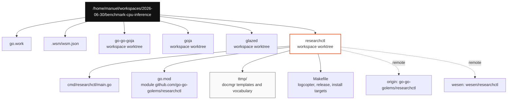

# benchmark-cpu-inference Workspace: researchctl Bootstrap Deep Dive

This is a concrete docmgr-backed project-bootstrap example in the [[docmgr]] project map; the researchctl architecture itself is mapped separately in [[researchctl]].

This report explains the initial project structure for the `benchmark-cpu-inference` workspace and the newly bootstrapped `researchctl` repository. The important outcome is not a completed benchmark suite yet. The important outcome is a clean multi-repository development environment where benchmark code can live in a dedicated CLI, compile against the local copies of `goja`, `go-go-goja`, and `glazed`, and preserve its design history through `docmgr` from the first commit.

The workspace lives at `/home/manuel/workspaces/2026-06-30/benchmark-cpu-inference`. The canonical `researchctl` checkout lives at `/home/manuel/code/wesen/go-go-golems/researchctl`, while the workspace worktree lives at `/home/manuel/workspaces/2026-06-30/benchmark-cpu-inference/researchctl`. The upstream repository is `github.com/go-go-golems/researchctl`; the personal fork is `github.com/wesen/researchctl`.

> [!summary]
> - `researchctl` is now a real Go module rooted at `github.com/go-go-golems/researchctl`, created from `go-go-golems/go-template` and stripped of the template `XXX` module identity.
> - The benchmark workspace now contains four coordinated worktrees: `go-go-goja`, `goja`, `glazed`, and `researchctl`, all on `task/benchmark-cpu-inference`.
> - The repository was initialized with `docmgr` under `ttmp/`, so future benchmark designs, raw results, scripts, and review notes have a structured place to live.
> - Validation currently passes with `GOWORK=off go test ./...` inside `researchctl`; workspace-level `go test` is blocked until `go.work` is regenerated with the newer module Go versions.

## Why this project exists

CPU inference benchmarking needs more than a one-off script. The benchmark runner will likely have to coordinate model inputs, runtime configuration, repeated measurements, result normalization, output formats, and reproducible reports. That kind of work benefits from a first-class CLI repository rather than a collection of temporary shell snippets. A dedicated repository gives the benchmark code a stable module path, its own release and CI wiring, and a place to accumulate reusable commands.

The workspace is also deliberately multi-repository. The benchmark target is expected to sit near the boundary between a Go CLI, a JavaScript runtime host, and low-level runtime behavior. `go-go-goja` provides the host-side runtime composition APIs and native-module system. `goja` provides the JavaScript interpreter. `glazed` provides the structured CLI substrate. `researchctl` is the new command surface that can depend on or inspect those systems without mixing benchmark-specific concerns into their main repositories.

The later research graph and codesign runtime are collected in the [[researchctl]] knowledge map.

The design starts with repository topology because topology controls how future work will be reviewed. If benchmark code is written directly inside `go-go-goja`, it risks becoming coupled to host internals too early. If it is written outside the workspace, it becomes harder to test against local runtime changes. The chosen structure keeps `researchctl` separate while still compiling it against local workspace modules when needed.

## Repository and workspace facts

The session produced three concrete repository changes and one workspace change.

| Component | Path or remote | Current role |
|---|---|---|
| Upstream repository | `git@github.com:go-go-golems/researchctl.git` | Canonical project repository, kept as `origin`. |
| Personal fork | `git@github.com:wesen/researchctl.git` | Push target for `main` and `task/benchmark-cpu-inference`. |
| Canonical local checkout | `/home/manuel/code/wesen/go-go-golems/researchctl` | Main local clone on `main`. |
| Workspace worktree | `/home/manuel/workspaces/2026-06-30/benchmark-cpu-inference/researchctl` | WSM-managed worktree on `task/benchmark-cpu-inference`. |
| Workspace metadata | `/home/manuel/workspaces/2026-06-30/benchmark-cpu-inference/.wsm/wsm.json` | Records the four-repository workspace. |
| Go workspace | `/home/manuel/workspaces/2026-06-30/benchmark-cpu-inference/go.work` | Connects local modules for development. |

The important commits in `researchctl` are:

```text
0d60eca Set repository root to researchctl
5263e75 Initialize docmgr workspace
8833cdc Initial commit
```

`8833cdc` came from the template repository. `5263e75` added `docmgr` infrastructure. `0d60eca` changed the generated template identity into the project identity.

## The initial architecture

At the end of the bootstrap, the workspace has this structure:



This diagram is intentionally simple because the project is still at the bootstrap stage. The `researchctl` command has an empty `main`, but the repository already has the surrounding infrastructure that determines how future code will be built, tested, documented, and released.

The `go.work` file currently lists the four local modules:

```go
// /home/manuel/workspaces/2026-06-30/benchmark-cpu-inference/go.work
go 1.25

use (
    ./go-go-goja
    ./goja
    ./glazed
    ./researchctl
)
```

The useful property of this file is that future `researchctl` code can import local workspace versions of `go-go-goja`, `goja`, or `glazed` without waiting for upstream tags. That matters for benchmark development because benchmark code often has to measure changes that are not released yet.

The current limitation is also visible in this file. Some modules in the workspace declare newer Go versions than the `go.work` header. Running `go test ./...` inside the workspace worktree currently reports:

```text
go: module ../go-go-goja listed in go.work file requires go >= 1.26.1, but go.work lists go 1.25; to update it:
    go work use
go: module ../glazed listed in go.work file requires go >= 1.25.0, but go.work lists go 1.25; to update it:
    go work use
go: module . listed in go.work file requires go >= 1.25.0, but go.work lists go 1.25; to update it:
    go work use
```

`researchctl` itself validates when tested outside the workspace resolver:

```bash
cd /home/manuel/workspaces/2026-06-30/benchmark-cpu-inference/researchctl
GOWORK=off go test ./...
```

The result is:

```text
?    github.com/go-go-golems/researchctl                  [no test files]
?    github.com/go-go-golems/researchctl/cmd/researchctl  [no test files]
?    github.com/go-go-golems/researchctl/pkg              [no test files]
```

That distinction is important. The repository is internally coherent; the workspace metadata needs a Go-version refresh before workspace-wide commands become reliable.

## What `researchctl` currently contains

The repository is intentionally minimal. It has the standard Go project infrastructure from `go-template`, plus a project-specific module path and command directory.

```text
researchctl/
├── AGENT.md
├── Makefile
├── README.md
├── cmd/
│   └── researchctl/
│       └── main.go
├── go.mod
├── go.sum
├── logcopter_generate.go
├── pkg/
│   ├── doc.go
│   └── logcopter.go
├── ttmp/
│   ├── _guidelines/
│   ├── _templates/
│   ├── .docmgrignore
│   └── vocabulary.yaml
└── .ttmp.yaml
```

The current command entry point is deliberately empty:

```go
package main

func main() {

}
```

The value of this commit is not behavior. The value is namespace correctness. The module path is now:

```go
module github.com/go-go-golems/researchctl
```

The `logcopter` area prefix and strip prefix were changed from template placeholders to project-specific values:

```go
//go:generate go tool logcopter-gen \
//  -area-prefix go-go-golems.researchctl \
//  -strip-prefix github.com/go-go-golems/researchctl \
//  ./pkg/...
```

The package logger uses the same prefix:

```go
var log = logcopter.Package("go-go-golems.researchctl.pkg")
```

These identifiers look small, but they matter because generated logging metadata and structured logs become hard to interpret when a repository keeps template names. Fixing them before feature work prevents future benchmark traces from mixing project data with template residue.

## Why the upstream/fork remote layout matters

The repository has two remotes:

```text
origin  git@github.com:go-go-golems/researchctl.git
wesen   git@github.com:wesen/researchctl.git
```

`origin` remains the upstream project repository. `wesen` is the personal fork and current push target. This layout separates project identity from contribution workflow. The module path and import path stay rooted at `github.com/go-go-golems/researchctl`, while implementation branches can be pushed to `wesen/researchctl` and proposed back through pull requests.

That distinction is especially useful for a benchmark project. Benchmark work often creates exploratory branches with generated reports, data files, and temporary instrumentation. Keeping a fork remote available allows those branches to be pushed for backup or review without redefining the canonical import path.

The current branch state is:

```text
main                         0d60eca  Set repository root to researchctl
task/benchmark-cpu-inference 0d60eca  Set repository root to researchctl
```

Both branches have been pushed to `wesen/researchctl`. The workspace worktree tracks `wesen/task/benchmark-cpu-inference`.

## What `docmgr` adds at project birth

`docmgr init --root ttmp --seed-vocabulary` created a documentation workspace inside `researchctl` before any benchmark code was added. That is the right time to add it. Once benchmark code starts producing results, there will be pressure to save raw output, write quick interpretations, and keep temporary scripts. If those artifacts do not have a home, they usually become untracked files, shell history, or stale README fragments.

The initial `docmgr` files are not project-specific reports yet. They are the infrastructure for future reports:

| File or directory | Purpose |
|---|---|
| `.ttmp.yaml` | Tells `docmgr` that `ttmp/` is the documentation root. |
| `ttmp/vocabulary.yaml` | Defines the seed vocabulary for topics, document types, and categories. |
| `ttmp/_templates/` | Provides document skeletons for design docs, references, scripts, task lists, tutorials, and working notes. |
| `ttmp/_guidelines/` | Describes how each document type should be written. |
| `ttmp/.docmgrignore` | Keeps generated or irrelevant files out of docmgr scans. |

For this project, the expected use is straightforward:

1. Create a ticket for each benchmark investigation.
2. Add a design or reference document describing the benchmark method.
3. Put raw scripts under the ticket's `scripts/` directory.
4. Store machine-readable benchmark results under a ticket-controlled artifact directory.
5. Write a diary entry for each phase that changes methodology, runtime configuration, or interpretation.
6. Relate benchmark code and result files back to the ticket.

A benchmark without a written method is difficult to reproduce. A benchmark without raw results is difficult to audit. `docmgr` provides the directory discipline needed for both.

## How this structure supports CPU inference benchmarking

The next technical step is to decide what the benchmark actually measures. The workspace name says `benchmark-cpu-inference`, but the repository currently only contains the scaffold. That is a good boundary: the bootstrap should not pretend that a measurement exists before the method exists.

A credible CPU inference benchmark runner needs at least five layers:

| Layer | Responsibility | Likely home |
|---|---|---|
| Workload definition | Names the model, prompt/input shape, batch size, iteration count, and warmup policy. | `researchctl` package or `ttmp` design doc first. |
| Runtime adapter | Runs one inference backend through a stable interface. | `researchctl/pkg/...` once chosen. |
| Measurement harness | Records wall time, CPU time where available, memory, allocation counts, and error state. | `researchctl/pkg/bench/...`. |
| Result schema | Converts measurements into rows that can be rendered as JSON, YAML, CSV, Markdown, or HTML. | Glazed output integration. |
| Report generation | Produces human-readable analysis with environment metadata and command provenance. | `docmgr` ticket plus optional generated report command. |

The project should begin by making the measurement contract explicit. The first implementation does not need to support every backend. It needs to make one backend reproducible and make its assumptions visible. Once the result schema is stable, adding adapters becomes a mechanical task instead of a redesign.

A minimal internal API could look like this:

```go
type Workload struct {
    Name       string
    InputPath  string
    Warmups    int
    Iterations int
    Backend    string
}

type Sample struct {
    Workload       string
    Backend        string
    Iteration      int
    StartedAt      time.Time
    Duration       time.Duration
    AllocBytes     uint64
    Error          string
}

type Backend interface {
    Prepare(ctx context.Context, w Workload) error
    Run(ctx context.Context, w Workload) error
    Close(ctx context.Context) error
}
```

The exact fields will change once the inference backend is selected. The invariant should not change: a benchmark command should emit structured rows where every row contains enough information to reproduce the measured run.

## The command shape that follows from the repository shape

`researchctl` should probably start as a Glazed CLI because benchmark data is tabular by nature. The first useful command is not a polished dashboard. It is a command that emits rows reliably.

A practical first command surface would be:

```text
researchctl bench cpu-inference run \
  --backend <backend-name> \
  --workload workload.yaml \
  --warmups 3 \
  --iterations 20 \
  --output json
```

The command should write one row per measured iteration and one metadata record per run. It should include enough environment information to make comparisons meaningful:

- repository commit hashes for `researchctl`, `go-go-goja`, `goja`, and `glazed`
- Go version and `GOOS/GOARCH`
- CPU model and core count when available
- backend name and version
- workload identity and input hash
- warmup count and iteration count
- whether the run used workspace replacements through `go.work`

The important design decision is to keep the benchmark runner and report interpretation separate. The runner should produce structured facts. Reports can aggregate, visualize, and explain those facts later. This separation prevents the first report format from becoming the storage format.

## Failure modes already visible

Even at bootstrap time, several future failure modes are visible.

### Workspace Go version drift

The workspace currently reports a Go-version mismatch when `go test` is run with the `go.work` resolver enabled. This is not a `researchctl` module failure; `GOWORK=off go test ./...` passes. It is a workspace coordination issue. The fix is to regenerate or update `go.work` so its `go` directive satisfies the modules listed under `use`.

The practical rule is:

```bash
cd /home/manuel/workspaces/2026-06-30/benchmark-cpu-inference
go work use ./go-go-goja ./goja ./glazed ./researchctl
```

After that, workspace-wide validation should be rerun. This should happen before benchmark implementation begins, because benchmark code that depends on local modules should be tested in the same resolver mode it will use during development.

### Template residue

The visible `XXX` placeholders were removed from the module path, command directory, Makefile install target, logcopter generation command, and package logger. Future cleanup should still inspect generated workflow files, release names, README content, and binary naming before the first real release. Template repositories often contain correct plumbing with placeholder semantics. The safe rule is to search before every first release:

```bash
rg -n "XXX|go-template|GO GO TEMPLATE" .
```

### Empty CLI behavior

`cmd/researchctl/main.go` currently exits successfully without doing anything. That is acceptable for the bootstrap commit, but it should not survive the first feature branch. Once benchmark design begins, the CLI should either expose a real root command or fail with useful help. Silent success is a poor default for a command-line tool because it hides incomplete wiring.

### Benchmark result ambiguity

CPU inference measurements are easy to invalidate through environment changes. The benchmark runner should not emit a duration without also emitting the conditions under which that duration was measured. The first result schema should therefore include environment metadata from the beginning, even if the first backend is simple.

## Current status

The project is in the initialized-but-not-implemented state.

What is complete:

- `github.com/go-go-golems/researchctl` exists and was created from `go-go-golems/go-template`.
- `/home/manuel/code/wesen/go-go-golems/researchctl` is cloned locally.
- `wsm discover .` was run inside the local clone.
- `docmgr init --root ttmp --seed-vocabulary` was run and committed.
- Template placeholders that affected the Go module identity were changed to `researchctl`.
- `wesen/researchctl` exists as a fork.
- `origin` points to `go-go-golems/researchctl`; `wesen` points to `wesen/researchctl`.
- `wsm add benchmark-cpu-inference researchctl` added the repository to the workspace after an empty partial target directory was removed.
- `main` and `task/benchmark-cpu-inference` were pushed to `wesen/researchctl`.

What is not complete:

- No CPU inference benchmark command exists yet.
- No workload schema exists yet.
- No backend adapter exists yet.
- No benchmark result schema exists yet.
- The workspace `go.work` Go directive needs to be refreshed before workspace-wide tests are reliable.
- The README still contains the template ASCII art and does not yet explain the project.

## Recommended next implementation sequence

The next work should proceed in small, reviewable steps.

1. Refresh the workspace `go.work` file and confirm workspace-level validation. The benchmark code should be developed under the resolver mode that includes local `go-go-goja`, `goja`, and `glazed`.
2. Replace the placeholder README with a short project statement, installation instructions, and the intended first command.
3. Add a Glazed/Cobra root command for `researchctl` with version output and structured logging flags.
4. Create a `docmgr` ticket for the first CPU inference benchmark design before writing the benchmark implementation.
5. Define the workload and result schema in a design doc, then encode those types in Go.
6. Implement one backend adapter and one `bench cpu-inference run` command that emits structured rows.
7. Add a report command only after raw result generation is stable.

The first benchmark should optimize for reproducibility rather than breadth. A small benchmark with exact provenance is more useful than a broad benchmark whose numbers cannot be traced back to a workload, commit set, and environment.

## Working rules for this project

The following rules should guide future work:

- Keep benchmark-specific code in `researchctl` unless a reusable runtime change belongs in `go-go-goja`, `goja`, or `glazed`.
- Treat raw benchmark output as data, not prose. Store it under a ticket or artifact path and generate prose from it later.
- Emit structured rows from commands. Do not make the first useful output a human-only table.
- Include repository hashes and environment metadata in every benchmark run.
- Record methodology changes in `docmgr` diaries, because benchmark interpretation depends on method history.
- Keep `origin` as upstream and push exploratory branches to `wesen`.

## Key paths and references

- Workspace: `/home/manuel/workspaces/2026-06-30/benchmark-cpu-inference`
- WSM metadata: `/home/manuel/workspaces/2026-06-30/benchmark-cpu-inference/.wsm/wsm.json`
- Go workspace: `/home/manuel/workspaces/2026-06-30/benchmark-cpu-inference/go.work`
- Workspace `researchctl` worktree: `/home/manuel/workspaces/2026-06-30/benchmark-cpu-inference/researchctl`
- Canonical local clone: `/home/manuel/code/wesen/go-go-golems/researchctl`
- Upstream remote: `git@github.com:go-go-golems/researchctl.git`
- Fork remote: `git@github.com:wesen/researchctl.git`
- Module file: `/home/manuel/workspaces/2026-06-30/benchmark-cpu-inference/researchctl/go.mod`
- Command entry point: `/home/manuel/workspaces/2026-06-30/benchmark-cpu-inference/researchctl/cmd/researchctl/main.go`
- Docmgr root: `/home/manuel/workspaces/2026-06-30/benchmark-cpu-inference/researchctl/ttmp`
