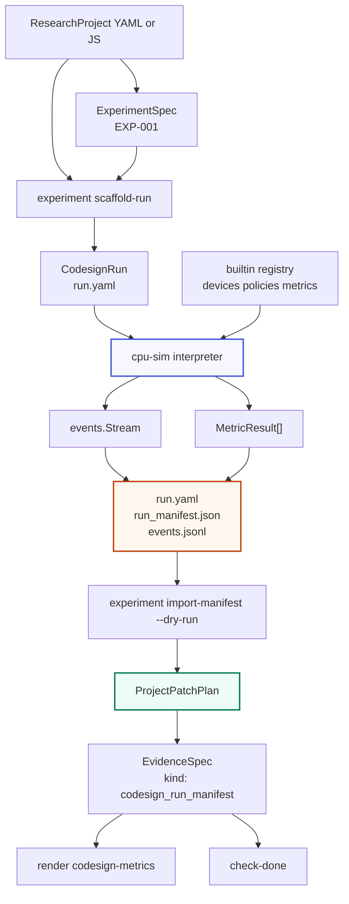

# researchctl CPU/GPU Codesign Experiment Runtime Deep Dive

This report explains the second major stage of `researchctl`: the implementation of a deterministic CPU/GPU codesign experiment runtime inside the Go repository. The first stage made `researchctl` a project-graph tool: it could load research projects, validate claims and evidence, generate filesystem plans, run completion checks, and render reports. This stage adds the missing execution path. A research project can now describe an experiment, scaffold a `CodesignRun` file, execute that run with a deterministic simulator, persist a manifest, and convert the manifest into reviewable evidence patches for the research graph.

The implementation lives in `/home/manuel/workspaces/2026-06-30/benchmark-cpu-inference/researchctl` on branch `task/benchmark-cpu-inference`. The main ticket is `RESEARCHCTL-002`, stored under `ttmp/2026/06/30/RESEARCHCTL-002--cpu-gpu-codesign-experiment-implementation-guide`. The relevant implementation commits are `fb6bdb2`, `628d6e8`, `932e6d1`, `a80435e`, `c5915cb`, `62fe51e`, `7c17a06`, and `cce02e1`.

> [!summary]
> - `researchctl` now has a separate `pkg/codesign/*` runtime for deterministic CPU/GPU offload experiments. The runtime has typed run specs, event streams, device/policy/metric registries, built-in simulators, durable artifacts, and golden tests.
> - The simulator is deliberately independent from the research graph. It emits events, metrics, and manifests; it does not mutate research project files.
> - The bridge from experiments back into research is a dry-run patch planner in `pkg/research/experimentrun`. It creates evidence and status-update proposals from a manifest without overwriting hand-authored project YAML.
> - The final loop is observable from the CLI: `researchctl experiment scaffold-run`, `researchctl experiment run`, `researchctl experiment import-manifest --dry-run`, `researchctl check-done`, and `researchctl render`.

## Why this implementation exists

The research graph built in the first stage could describe an experiment, but it could not execute one. That left an important gap. A `ResearchProject` could say that a hypothesis should be tested, that an experiment should produce artifacts, and that a report should include evidence. The project could not yet produce the evidence. The new codesign runtime fills that gap with a small, deterministic execution engine.

The experiment domain is about scheduling work across devices. A run spec describes devices, workload stages, scheduling policy, and metrics. A simulator turns that specification into a stream of events. Metrics reduce the event stream into values such as p95 latency and task counts by device. A manifest records the result in a compact durable format. The research graph then consumes the manifest as evidence.

The most important design constraint is separation. Loading a research project must not run experiments. Running an experiment must not rewrite the project graph. Importing a manifest must not silently change a hand-authored YAML file. Each step is explicit because each step has different side effects:

| Step | Command or package | Side effect |
|---|---|---|
| Load project | `pkg/research/projectio` | Executes trusted project grammar or reads YAML/JSON. |
| Scaffold run spec | `researchctl experiment scaffold-run` | Writes a starter `run.yaml`. |
| Execute run | `researchctl experiment run` | Writes artifacts under an output directory. |
| Import manifest | `researchctl experiment import-manifest --dry-run` | Prints graph patches; does not mutate the project. |
| Check completion | `researchctl check-done` | Evaluates rules against project state. |
| Render report | `researchctl render` | Produces Markdown. |

This explicit boundary is the reason the implementation can remain safe while becoming useful. The simulator may later gain hardware-specific backends, but the graph-loading path remains pure with respect to experiment execution.

## The architecture in one pass

The project now has two related but separate subsystems. `pkg/codesign/*` is the execution subsystem. It knows about run specs, events, devices, scheduling policies, metrics, manifests, and artifact directories. `pkg/research/*` is the research graph subsystem. It knows about hypotheses, experiments, evidence, decisions, reports, validation rules, and filesystem planning. The connection between them is the manifest bridge.



The diagram shows the central invariant: artifacts cross the boundary, not simulator state. The simulator can be replaced or extended without forcing the research graph to know how device scheduling works. The graph can change its evidence model without changing how the simulator estimates task duration.

## Phase A: the run specification and event vocabulary

The implementation starts with `pkg/codesign/spec` and `pkg/codesign/events`. These packages define the serializable input and observable output of the experiment runtime. Starting here was the right choice because every later package depends on these types.

The run specification is intentionally small:

```go
// pkg/codesign/spec/types.go
type RunSpec struct {
    SchemaVersion int          `json:"schemaVersion" yaml:"schemaVersion"`
    Kind          string       `json:"kind" yaml:"kind"`
    Name          string       `json:"name" yaml:"name"`
    ExperimentID  string       `json:"experimentId" yaml:"experimentId"`
    Backend       string       `json:"backend" yaml:"backend"`
    Topology      TopologySpec `json:"topology" yaml:"topology"`
    Workload      WorkloadSpec `json:"workload" yaml:"workload"`
    Policy        PolicySpec   `json:"policy" yaml:"policy"`
    Metrics       []MetricSpec `json:"metrics,omitempty" yaml:"metrics,omitempty"`
}
```

A `CodesignRun` document names the experiment it belongs to, declares a backend, lists devices, defines a workload, chooses a policy, and asks for metrics. It does not contain research conclusions. It also does not contain graph edges. This is a simulation input, not a research-project document.

The canonical fixture is `testdata/codesign/valid_two_device/run.yaml`:

```yaml
schemaVersion: 1
kind: CodesignRun
name: two-device break-even
experimentId: EXP-001
backend: cpu-sim
topology:
  devices:
    - id: cpu0
      type: simple_device
      config:
        speed: 1
    - id: accel0
      type: simple_device
      config:
        speed: 10
        setupNs: 500
workload:
  type: fixed
  count: 100
  interarrivalNs: 100
  stages:
    - id: infer
      computeUnits: 10000
      supportedDevices: [cpu0, accel0]
policy:
  id: min_finish_time
  type: min_finish_time
metrics:
  - id: latency_p95
    type: latency_p95
  - id: tasks_by_device
    type: tasks_by_device
```

The strict decoders are part of the contract. YAML uses `KnownFields(true)` and JSON uses `DisallowUnknownFields()`. This matters because experiment inputs should fail fast when a field name is wrong. A misspelled device key should not silently disappear into a map and change the interpretation of a run.

Validation is structural and side-effect free. `ValidateRun` checks schema version, kind, required root fields, topology, workload stages, policy type, duplicate device IDs, duplicate stage IDs, non-negative byte counts, and supported-device references. It does not repair the spec. That keeps validation predictable: calling it twice cannot change the object being validated.

The event package supplies the other side of the contract. The simulator emits events such as `run_started`, `request_submitted`, `scheduler_decision`, `task_started`, `task_completed`, `request_completed`, and `run_finished`. Metrics then use stream helpers such as `OfType`, `Where`, `Count`, `Mean`, `Percentile`, and `GroupBy` to reduce the stream. The event stream becomes the canonical execution trace. The manifest stores summary metrics, while the optional JSONL file stores the full trace.

## Phase B: runtime contracts and built-ins

`pkg/codesign/registry` defines the runtime interfaces. The implementation uses a registry because devices, policies, and metrics are extension points. The built-in simulator should not need a new switch statement every time a new device model or policy is added.

```go
// pkg/codesign/registry/types.go
type Device interface {
    ID() string
    Type() string
    CanRun(Task) bool
    Estimate(Task, State) Estimate
    Run(Task, *State) (TaskResult, error)
}

type Policy interface {
    ID() string
    Choose(Task, []Device, State) (Decision, error)
}

type Metric interface {
    ID() string
    Compute(events.Stream) (MetricResult, error)
}
```

The three interfaces separate three responsibilities:

- A device decides whether it can execute a task, estimates execution cost, and mutates runtime state only when it actually runs the task.
- A policy chooses a device from compatible candidates using estimates and current state.
- A metric reads the event stream and returns a typed result.

The split between `Estimate` and `Run` is a critical technical detail. Policies need to ask many devices what would happen if they were chosen. That query must not advance a device clock or increment counters. Only the selected device may mutate state. The `simple_device` implementation in `pkg/codesign/devices/devices.go` shows the pattern:

```go
func (d *simpleDevice) Estimate(task registry.Task, state registry.State) registry.Estimate {
    ds := state.DeviceStates[d.id]
    start := state.NowNS
    if ds != nil && ds.BusyUntilNS > start {
        start = ds.BusyUntilNS
    }
    duration := d.setupNS + int64(math.Ceil(task.ComputeUnits/d.speed))
    finish := start + duration
    return registry.Estimate{StartNS: start, DurationNS: duration, FinishNS: finish, Score: float64(finish)}
}

func (d *simpleDevice) Run(task registry.Task, state *registry.State) (registry.TaskResult, error) {
    estimate := d.Estimate(task, *state)
    ds := state.DeviceStates[d.id]
    ds.BusyUntilNS = estimate.FinishNS
    ds.TasksCompleted++
    return registry.TaskResult{TaskID: task.ID, DeviceID: d.id, StartNS: estimate.StartNS, FinishNS: estimate.FinishNS}, nil
}
```

The built-in devices are deliberately simple:

| Device type | File | Behavior |
|---|---|---|
| `simple_device` | `pkg/codesign/devices/devices.go` | Duration is setup cost plus compute units divided by speed. |
| `bandwidth_device` | `pkg/codesign/devices/devices.go` | Duration includes setup, transfer bytes divided by bandwidth, and compute units divided by speed. |

The built-in policies cover deterministic scheduling strategies:

| Policy type | Behavior |
|---|---|
| `first_available` | Selects the first compatible device. |
| `min_finish_time` | Selects the candidate with the smallest estimated finish timestamp, with ID as tie-breaker. |
| `round_robin` | Keeps a per-policy cursor and rotates through candidates. |
| `prefer_accel_unless_small` | Routes small tasks to CPU when possible and larger tasks to accelerator-like device IDs. |

The metric package keeps reductions independent from the simulator. `request_count`, `latency_p95`, and `tasks_by_device` all read events. That means the simulator only has to emit consistent events; it does not need metric-specific branches in its execution loop.

## Phase C: the deterministic CPU simulator

`pkg/codesign/simulator` is the executable core. Its `Interpreter.Run` method validates the run spec, creates devices from the registry, creates the policy, walks the workload, emits events, and computes metrics.

The main loop is concise enough to understand directly:

```go
// pkg/codesign/simulator/simulator.go
for requestIndex := 0; requestIndex < spec.Workload.Count; requestIndex++ {
    requestID := fmt.Sprintf("req-%d", requestIndex)
    requestStart := int64(requestIndex) * spec.Workload.InterarrivalNS
    requestNow := requestStart
    emitter.emit("request_submitted", requestStart, requestID, "", "", nil)

    for _, stage := range spec.Workload.Stages {
        task := registry.Task{ID: requestID + "." + stage.ID, RequestID: requestID, StageID: stage.ID, ComputeUnits: stage.ComputeUnits, BytesIn: stage.BytesIn, BytesOut: stage.BytesOut, SupportedDevices: stage.SupportedDevices}
        state.NowNS = requestNow
        candidates := compatibleDevices(task, devices)
        decision, err := policy.Choose(task, candidates, state)
        // ... choose device, emit decision, run task ...
        requestNow = result.FinishNS
    }

    emitter.emit("request_completed", requestNow, requestID, "", "", map[string]any{"latencyNs": requestNow - requestStart})
}
```

The simulator has three time concepts:

1. `requestStart` is derived from the request index and `interarrivalNs`.
2. `requestNow` tracks when the current request is ready for its next stage.
3. Each device has `BusyUntilNS`, which prevents two tasks from occupying the same simulated device lane at the same time.

Those three values are enough for the first deterministic model. A request can wait for a busy device. A policy can see the current time and estimate candidate finish times. A device can update its own busy timestamp only after being selected.

The simulator emits decisions before task execution:

```go
emitter.emit(
    "scheduler_decision",
    requestNow,
    requestID,
    task.ID,
    device.ID(),
    map[string]any{
        "chosenDevice": decision.ChosenDeviceID,
        "candidateScores": decision.CandidateScores,
        "reason": decision.Reason,
    },
)
```

This event matters because it preserves scheduler evidence. Without it, the final metrics could say that `accel0` handled 87 tasks, but the trace would not explain why each task was routed there. Candidate scores and decision reasons are essential for debugging policy behavior.

The golden result for the two-device fixture is stable:

```json
{
  "eventCount": 502,
  "metrics": [
    {"id": "latency_p95", "value": 115100, "unit": "ns"},
    {"id": "tasks_by_device", "value": {"accel0": 87, "cpu0": 13}, "unit": "tasks"}
  ]
}
```

The event count follows from the execution model. There is one `run_started` event, one `run_finished` event, and five request-level or task-level events for each of 100 one-stage requests: request submitted, scheduler decision, task started, task completed, request completed. That gives `1 + 100*5 + 1 = 502`.

## Phase D: manifests and durable artifacts

The simulator returns in-memory events and metrics. The artifact package turns that in-memory result into durable files. This is the first point where experiment execution becomes a filesystem product.

`pkg/codesign/artifacts/manifest.go` defines the manifest:

```go
type RunManifest struct {
    SchemaVersion int            `json:"schemaVersion" yaml:"schemaVersion"`
    RunID         string         `json:"runId" yaml:"runId"`
    ExperimentID  string         `json:"experimentId" yaml:"experimentId"`
    ProjectID     string         `json:"projectId,omitempty" yaml:"projectId,omitempty"`
    Backend       string         `json:"backend" yaml:"backend"`
    StartedAt     time.Time      `json:"startedAt" yaml:"startedAt"`
    EventCount    int            `json:"eventCount" yaml:"eventCount"`
    Metrics       []MetricResult `json:"metrics" yaml:"metrics"`
    Artifacts     []ArtifactRef  `json:"artifacts,omitempty" yaml:"artifacts,omitempty"`
    ConfigHash    string         `json:"configHash,omitempty" yaml:"configHash,omitempty"`
}
```

The manifest is intentionally compact. It records identity, provenance, backend, metric results, artifact paths, and a config hash. It does not inline every event. The full event stream is optional JSONL because it can be large and is mostly useful for detailed debugging.

`WriteRunArtifacts` creates a deterministic directory shape:

```text
<out>/
└── experiments/
    └── EXP-001/
        └── runs/
            └── run-test_cpu-sim/
                ├── run.yaml
                ├── run_manifest.json
                └── events.jsonl      # optional
```

The manifest golden file in `pkg/codesign/artifacts/testdata/offload_breakeven_manifest.golden.json` records the stable fixture output. Golden tests are useful here because the manifest is an external contract. If the JSON shape changes, the test shows the change directly.

The config hash is computed from the JSON encoding of the run spec:

```go
func ConfigHash(runSpec *codesignspec.RunSpec) (string, error) {
    b, err := json.Marshal(runSpec)
    if err != nil {
        return "", err
    }
    sum := sha256.Sum256(b)
    return hex.EncodeToString(sum[:]), nil
}
```

The hash does not make the simulator reproducible by itself. Its job is narrower: attach a stable fingerprint of the run configuration to the manifest so later review can detect that two manifests came from different inputs even if their names are similar.

## Phase E: the experiment CLI

The command group lives in `cmd/researchctl/cmds/experiment.go`. It exposes three commands:

```bash
researchctl experiment scaffold-run <project> <experiment-id> --out <dir>
researchctl experiment run <run-spec.yaml> --out <dir> --events --run-id <id>
researchctl experiment import-manifest <project> <manifest.json> --dry-run
```

`experiment run` reads and validates a `CodesignRun`, creates the built-in registry, executes the simulator, writes artifacts, and prints a structured write result.

```go
runSpec, err := codesignspec.ReadRun(args[0])
if result := codesignspec.ValidateRun(runSpec); !result.OK() {
    _ = writeOutput(cmd.OutOrStdout(), output, result)
    return fmt.Errorf("codesign run validation failed with %d issue(s)", len(result.Issues))
}
reg, err := builtin.NewRegistry()
runResult, err := simulator.New(reg, opts...).Run(cmd.Context(), runSpec)
writeResult, err := artifacts.WriteRunArtifacts(outDir, runSpec, runResult, artifacts.WriteOptions{WriteEvents: writeEvents})
return writeOutput(cmd.OutOrStdout(), output, writeResult)
```

The command validates before running and returns the validation result to the caller. That is important for operator ergonomics: invalid run specs produce structured issue output instead of failing later with a device or policy error that hides the real problem.

`experiment scaffold-run` goes in the other direction. It reads a research project, finds an experiment by ID, and writes a starter `CodesignRun`. If the experiment already names required metrics, those metric names are copied into the run spec. If not, the command defaults to `latency_p95` and `tasks_by_device`. The scaffold is not a final benchmark definition. It is a concrete starting point that puts the right IDs and file shape in place.

`experiment import-manifest` currently requires `--dry-run`. This is a deliberate limitation, not a missing flag. The current implementation can plan graph changes safely, but it does not yet have a comment-preserving or structure-preserving project writer for arbitrary hand-authored YAML. The CLI refuses non-dry-run import so callers cannot accidentally assume that persistence exists.

## Phase F: manifest import as patch planning

`pkg/research/experimentrun` is the bridge between execution artifacts and graph updates. Its central function is `PlanManifestImport`:

```go
func PlanManifestImport(project *researchspec.ResearchProjectSpec, manifest *artifacts.RunManifest, opts Options) (ProjectPatchPlan, error) {
    if res := validate.ValidateProject(project); !res.OK() {
        return ProjectPatchPlan{}, fmt.Errorf("project structural validation failed with %d issue(s)", len(res.Issues))
    }
    idx := graph.NewIndex(project)
    node, ok := idx.Find(researchspec.ID(manifest.ExperimentID))
    // ... require that the node is an ExperimentSpec ...
    evidence := researchspec.EvidenceSpec{
        ID:           StableEvidenceID(experiment.ID, manifest.RunID),
        Summary:      fmt.Sprintf("Codesign %s run %s for %s", manifest.Backend, manifest.RunID, experiment.Title),
        Kind:         "codesign_run_manifest",
        Status:       researchspec.EvidenceProcessed,
        Supports:     append([]researchspec.ID(nil), experiment.Hypotheses...),
        ArtifactRefs: []string{opts.ManifestPath},
        Metadata: researchspec.JsonObject{
            "backend":    manifest.Backend,
            "runId":      manifest.RunID,
            "eventCount": manifest.EventCount,
            "metrics":    manifest.Metrics,
        },
    }
    // ... append add-evidence and optional status-update patches ...
}
```

The bridge performs five checks or transformations:

1. It validates the research project structurally before planning changes.
2. It finds the experiment named by the manifest's `experimentId`.
3. It creates an evidence object with kind `codesign_run_manifest`.
4. It links that evidence to the experiment's hypotheses.
5. It proposes moving the experiment to `review` when all required experiment metrics are present in the manifest.

The golden patch plan shows the intended output:

```json
{
  "operation": "add-evidence",
  "path": "evidence",
  "reason": "codesign run manifest can be attached as processed evidence",
  "value": {
    "id": "EVD-EXP-001-run-test",
    "summary": "Codesign cpu-sim run run-test for Two-device break-even",
    "kind": "codesign_run_manifest",
    "status": "processed",
    "supports": ["H-001"],
    "artifactRefs": ["experiments/EXP-001/runs/run-test/run_manifest.json"]
  }
}
```

The stable evidence ID currently uses experiment ID and run ID:

```go
func StableEvidenceID(experimentID researchspec.ID, runID string) researchspec.ID {
    segment := strings.Trim(unsafeID.ReplaceAllString(runID, "-"), "-")
    if segment == "" {
        segment = "run"
    }
    return researchspec.ID("EVD-" + string(experimentID) + "-" + segment)
}
```

This ID scheme is readable and deterministic. A future version may include a short config-hash segment if repeated run IDs become common. The current choice is adequate for the deterministic fixture loop and keeps evidence IDs easy to inspect in reports.

## Phase G: completion rules and report rendering

The final phase connects manifest-backed evidence to the existing review and report features. This is where the execution subsystem becomes visible inside normal researchctl workflows.

The `done-experiment` rule now recognizes manifest-backed evidence and checks that attached manifest metrics cover required experiment metrics:

```go
if hasManifestEvidence(ctx.Project, e) && !manifestCoversRequiredMetrics(ctx.Project, e) {
    out = append(out, finding(
        rule,
        ctx.Entity,
        "manifest-backed evidence does not cover all required metrics",
        "Ensure the run manifest includes every metric marked required on the experiment.",
    ))
}
```

The rule does not require manifest-backed evidence for every experiment. It only enforces metric coverage when such evidence is present. That preserves compatibility with other experiment artifact types while giving the codesign path a stronger check.

The report renderer adds a `codesign-metrics` block. It scans selected evidence nodes, filters to `kind: codesign_run_manifest`, and renders metrics as a Markdown table:

```go
func (codesignMetricsBlock) RenderReportBlock(ctx plugin.ReportBlockContext) (string, error) {
    var b strings.Builder
    b.WriteString("## Codesign Metrics\n\n")
    b.WriteString("| Evidence | Backend | Metric | Value | Unit |\n")
    b.WriteString("| --- | --- | --- | --- | --- |\n")
    for _, n := range nodesFor(ctx, graph.KindEvidence) {
        e := n.Source.(*spec.EvidenceSpec)
        if e.Kind != "codesign_run_manifest" {
            continue
        }
        backend, _ := e.Metadata["backend"].(string)
        for _, metric := range metadataMetrics(e.Metadata["metrics"]) {
            b.WriteString(fmt.Sprintf("| %s | %s | %s | %s | %s |\n", e.ID, backend, metric.ID, formatMetricValue(metric.Value), metric.Unit))
        }
    }
    return b.String(), nil
}
```

One implementation detail surfaced during this phase. YAML-backed project metadata decodes nested objects as `spec.JsonObject`, not always as plain `map[string]any`. The first implementation only accepted `map[string]any`, so the report block saw evidence metadata but failed to extract metric rows. The fix was to support both types in `metadataMetrics` for rendering and rules. This is a small example of why weakly typed metadata needs dedicated helper functions rather than repeated inline type assertions.

The manifest-backed fixture project lives at `testdata/fixtures/codesign_manifest_evidence_project/project.yaml`. Its rendered report includes:

```markdown
## Codesign Metrics

| Evidence | Backend | Metric | Value | Unit |
| --- | --- | --- | --- | --- |
| EVD-EXP-001-run-test | cpu-sim | latency_p95 | 115100 | ns |
| EVD-EXP-001-run-test | cpu-sim | tasks_by_device | {"accel0":87,"cpu0":13} | tasks |
```

This closes the loop from run spec to report. The report is generated from research graph evidence, not directly from simulator output. That distinction is important because it keeps the report system aligned with the graph model.

## The complete operator workflow

The full workflow can be run with local paths. A typical session looks like this:

```bash
cd /home/manuel/workspaces/2026-06-30/benchmark-cpu-inference/researchctl

# 1. Start from a project experiment and create a run file.
GOWORK=off go run ./cmd/researchctl experiment scaffold-run \
  testdata/fixtures/codesign_manifest_project/project.yaml \
  EXP-001 \
  --out /tmp/researchctl-codesign

# 2. Execute the deterministic simulator and persist artifacts.
GOWORK=off go run ./cmd/researchctl experiment run \
  examples/codesign/runs/offload-breakeven.yaml \
  --out /tmp/researchctl-codesign \
  --events \
  --run-id smoke-001 \
  --output json

# 3. Plan research graph patches from the manifest.
GOWORK=off go run ./cmd/researchctl experiment import-manifest \
  testdata/fixtures/codesign_manifest_project/project.yaml \
  /tmp/researchctl-codesign/experiments/EXP-001/runs/smoke-001_cpu-sim/run_manifest.json \
  --dry-run \
  --output json

# 4. Check and render a project that already contains manifest-backed evidence.
GOWORK=off go run ./cmd/researchctl check-done \
  EXP-001 \
  --project testdata/fixtures/codesign_manifest_evidence_project/project.yaml \
  --output json

GOWORK=off go run ./cmd/researchctl render \
  RPT-CODESIGN \
  --project testdata/fixtures/codesign_manifest_evidence_project/project.yaml
```

The workflow uses `GOWORK=off` because the surrounding workspace has Go-version mismatch issues in `go.work`. The module itself validates in isolation with the current toolchain.

## Validation and test coverage

The implementation is test-heavy because each layer defines a contract used by the next layer.

| Area | Representative tests |
|---|---|
| Run specs | Strict decode, validation failures, YAML/JSON round trips. |
| Event streams | Filtering, grouping, counts, means, nearest-rank percentiles. |
| Registry | Duplicate registration, unknown factories, nil registry behavior. |
| Devices | Estimate does not mutate state; `Run` mutates only the selected device. |
| Policies | Choice behavior for all built-ins and no-candidate errors. |
| Metrics | Reducers over hand-built event streams. |
| Simulator | Event order, event count, p95 latency, task distribution, no-candidate failure. |
| Artifacts | Manifest round trip, JSONL round trip, deterministic artifact paths, golden manifest. |
| Bridge | Stable evidence IDs, missing experiment errors, golden patch plan. |
| CLI | Successful run, invalid spec, scaffolded run, import-manifest output. |
| Reports and rules | Manifest-backed completion and golden `codesign-metrics` Markdown. |

The final validation commands passed:

```bash
GOWORK=off go test ./... -count=1
make test
make logcopter-check
make lint
```

A full CLI smoke loop also passed. It executed the example run, verified the manifest and event files, planned import patches, checked completion, and rendered the codesign report.

One validation failure is worth recording because it captures a real project convention. `make lint` initially failed on `pkg/codesign/artifacts/manifest_test.go` because compact one-line `if` statements were not gofmt-formatted. Running `gofmt -w pkg/codesign/artifacts/manifest_test.go` fixed the failure. The lesson is straightforward: repository validation treats gofmt formatting as part of correctness, including tests.

## Design decisions that shaped the implementation

### The simulator is Go-first

The JavaScript reference implementation provided behavior, but the production runtime is Go. The run spec, event stream, registry, simulator, artifact writer, CLI, bridge, completion rules, and report block are all native Go packages. JavaScript remains relevant for trusted project grammar in the research graph layer, but experiment execution is not implemented as a JS program loaded at project-read time.

This choice gives the runtime static types, package tests, normal Go CLI integration, and straightforward future backend registration.

### Manifest import is plan-only

The bridge creates `ProjectPatchPlan` values instead of mutating project files. This is the correct first implementation because project YAML may be hand-authored and may contain formatting or comments that a generic writer would destroy. A dry-run patch plan gives the operator exact proposed changes while preserving safety.

The cost is that the loop still requires a human or future patch writer to apply the evidence. That is an acceptable cost for this phase because the system is new and patch semantics deserve their own design.

### Metrics reduce events rather than simulator internals

Metrics read `events.Stream`. They do not inspect device state directly. This makes metric computation reproducible from an event trace and keeps the simulator responsible for one thing: producing a coherent execution trace. It also means future backends can emit equivalent events and reuse the same metric reducers.

### Reports read research evidence, not simulator files

The `codesign-metrics` report block reads graph evidence metadata. It does not open manifests from disk. This keeps reports deterministic with respect to the loaded project. If a manifest should appear in a report, it must first be represented as evidence in the graph.

This design makes the research project the source of reporting truth. Artifact files remain provenance, not implicit report inputs.

## Current limitations

The implementation is complete for the deterministic first loop, but it is not a full hardware benchmark system yet.

- The only execution backend is `cpu-sim`. There is no MLX, CUDA, CUPTI, eBPF, or Blackwell-specific integration.
- `experiment import-manifest` is dry-run only. Safe application of patch plans is deferred.
- `simple_device` and `bandwidth_device` are cost models for deterministic scheduling experiments, not calibrated hardware models.
- Event JSONL writing is available, but there is no separate trace viewer command yet.
- Stable evidence IDs use experiment ID and run ID. Repeated use of the same run ID for different configs would collide unless the operator changes the run ID.
- Report formatting for structured metric values is inline JSON. That is compact and stable, but nested tables may be easier to read for larger metric families.

These limitations are useful boundaries. They keep the first shipped loop deterministic and reviewable while leaving the harder hardware-specific work for later phases.

## Where to read the code

Start with these files in order:

1. `/home/manuel/workspaces/2026-06-30/benchmark-cpu-inference/researchctl/pkg/codesign/spec/types.go` defines the `CodesignRun` contract.
2. `/home/manuel/workspaces/2026-06-30/benchmark-cpu-inference/researchctl/pkg/codesign/registry/types.go` defines runtime interfaces and factory registration.
3. `/home/manuel/workspaces/2026-06-30/benchmark-cpu-inference/researchctl/pkg/codesign/devices/devices.go` and `pkg/codesign/policies/policies.go` define built-in runtime behavior.
4. `/home/manuel/workspaces/2026-06-30/benchmark-cpu-inference/researchctl/pkg/codesign/simulator/simulator.go` is the execution path.
5. `/home/manuel/workspaces/2026-06-30/benchmark-cpu-inference/researchctl/pkg/codesign/artifacts/manifest.go` writes durable outputs.
6. `/home/manuel/workspaces/2026-06-30/benchmark-cpu-inference/researchctl/cmd/researchctl/cmds/experiment.go` exposes the workflow as CLI commands.
7. `/home/manuel/workspaces/2026-06-30/benchmark-cpu-inference/researchctl/pkg/research/experimentrun/bridge.go` plans graph patches from manifests.
8. `/home/manuel/workspaces/2026-06-30/benchmark-cpu-inference/researchctl/pkg/research/rules/rules.go` and `pkg/research/render/render.go` integrate manifest-backed evidence into completion checks and reports.

The main ticket documents are also worth reading:

- `ttmp/2026/06/30/RESEARCHCTL-002--cpu-gpu-codesign-experiment-implementation-guide/design-doc/01-cpu-gpu-codesign-experiment-implementation-guide.md`
- `ttmp/2026/06/30/RESEARCHCTL-002--cpu-gpu-codesign-experiment-implementation-guide/reference/01-investigation-diary.md`
- `ttmp/2026/06/30/RESEARCHCTL-002--cpu-gpu-codesign-experiment-implementation-guide/reference/04-glossary-for-implementation-language.md`

## Near-term next steps

The next useful improvements are clear:

1. Add a safe patch-application mode for manifest imports. The implementation should either preserve hand-authored YAML carefully or write generated graph fragments that can be included by project files.
2. Add a trace inspection command for `events.jsonl`. The event stream already has enough information to explain scheduling decisions, but operators need a readable view.
3. Include a config-hash segment in stable evidence IDs when repeated run IDs become likely.
4. Add calibrated backend prototypes only after the deterministic loop remains stable. The next backend should reuse the same event and manifest contracts rather than creating a parallel artifact shape.
5. Improve report formatting for structured metrics, especially device maps and future metric groups.

## Closing assessment

The important achievement is not that `researchctl` now has a simulator. The important achievement is that experiment execution, artifact provenance, graph evidence, completion checks, and report rendering now form one explicit pipeline. Each stage has a typed contract. Each side effect is behind an operator command. Each boundary is testable.

That structure is what makes future CPU/GPU work possible. Hardware-specific backends can be added later, but they already have a target interface: produce events, metrics, and manifests that the existing bridge and report system can understand. The research graph does not need to know how the backend measured or simulated execution. It only needs durable evidence with clear provenance.
