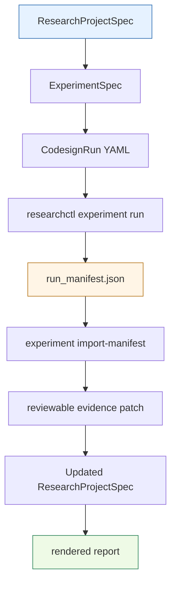

# Researchctl API: Implementation and Usage Deep Dive

The `researchctl` API models a research project as a typed graph of goals, questions, hypotheses, work packages, experiments, sources, evidence, decisions, reports, review rules, and views. The implementation gives this graph three authoring forms: YAML, JSON, and a trusted JavaScript grammar exposed through `require("researchctl")`. All three forms produce the same Go `ResearchProjectSpec`, pass through the same structural validator, and feed the same filesystem, completion-rule, and report-rendering subsystems.

> [!summary]
> - The core API is a typed graph model with stable IDs and validated references. The graph records why work exists, what claims are under test, what evidence was collected, and which decisions were made from that evidence.
> - The JavaScript API is a graph-construction grammar, not an execution runtime. It builds specs and validates them; it does not run experiments, write files directly, or expose `require("codesign")` during project loading.
> - The implementation separates authoring, validation, materialization, completion checks, and report rendering. That separation is what lets YAML, JSON, JavaScript, CLI commands, and xgoja-generated tools share the same project semantics.

The reference repository is `/home/manuel/workspaces/2026-06-30/benchmark-cpu-inference/researchctl`. The project spec lives in `pkg/research/spec`, graph indexing in `pkg/research/graph`, structural validation in `pkg/research/validate`, filesystem planning in `pkg/research/filesystem`, completion rules in `pkg/research/rules`, report rendering in `pkg/research/render`, project loading in `pkg/research/projectio`, and the JavaScript module in `pkg/gojamodules/researchctl`.

## Why this note exists

Research work often fails to stay reviewable because claims, experiments, evidence, and decisions are stored as separate documents without machine-checkable links. A hypothesis may be written in one note, an experiment run in a directory, a result in a manifest, and a decision in a meeting summary. The reader then has to reconstruct the relationship between those artifacts manually.

`researchctl` addresses that problem by making the relationships first-class. The project spec records IDs and references. The validator checks that references resolve. The filesystem writer turns the graph into deterministic project files. Completion rules check whether an entity is ready to be treated as done. Report blocks render selected graph entities into Markdown.

The JavaScript API was added for projects where YAML becomes repetitive. It lets authors define ordinary JavaScript functions for repeated entity fragments, but it still produces the same data model. JavaScript is used as an authoring language, not as a permission to perform arbitrary research operations while loading a project file.

## The core model: one project, many entity kinds

The root Go type is `ResearchProjectSpec` in `pkg/research/spec/types.go`:

```go
type ResearchProjectSpec struct {
    SchemaVersion int               `json:"schemaVersion" yaml:"schemaVersion"`
    Kind          string            `json:"kind" yaml:"kind"`
    Name          string            `json:"name" yaml:"name"`
    Description   string            `json:"description,omitempty" yaml:"description,omitempty"`
    Plugins       []PluginUseSpec   `json:"plugins,omitempty" yaml:"plugins,omitempty"`
    Goals         []GoalSpec        `json:"goals,omitempty" yaml:"goals,omitempty"`
    Questions     []QuestionSpec    `json:"questions,omitempty" yaml:"questions,omitempty"`
    Hypotheses    []HypothesisSpec  `json:"hypotheses,omitempty" yaml:"hypotheses,omitempty"`
    WorkPackages  []WorkPackageSpec `json:"workPackages,omitempty" yaml:"workPackages,omitempty"`
    Experiments   []ExperimentSpec  `json:"experiments,omitempty" yaml:"experiments,omitempty"`
    Sources       []SourceSpec      `json:"sources,omitempty" yaml:"sources,omitempty"`
    Evidence      []EvidenceSpec    `json:"evidence,omitempty" yaml:"evidence,omitempty"`
    Decisions     []DecisionSpec    `json:"decisions,omitempty" yaml:"decisions,omitempty"`
    Reports       []ReportSpec      `json:"reports,omitempty" yaml:"reports,omitempty"`
    ReviewRules   []ReviewRuleSpec  `json:"reviewRules,omitempty" yaml:"reviewRules,omitempty"`
    Views         []ViewSpec        `json:"views,omitempty" yaml:"views,omitempty"`
    Metadata      JsonObject        `json:"metadata,omitempty" yaml:"metadata,omitempty"`
}
```

Every entity type exists because a research project has more structure than a task list. A goal states what the project is trying to achieve. A question narrows the goal into something answerable. A hypothesis records a claim that can be supported, rejected, superseded, or left open. An experiment tests hypotheses. Evidence records artifacts and observations. A decision records the conclusion that follows from evidence. Reports select and render parts of the graph for a reader.

The entity kinds are not interchangeable. A work package is not a hypothesis. Evidence is not a decision. This type distinction keeps the project graph explicit and gives validation and rendering enough information to check and present it correctly.

## Entity responsibilities

The main entity kinds have these responsibilities:

| Entity | Primary field | Main references | Purpose |
| --- | --- | --- | --- |
| `GoalSpec` | `title` | `asks` | Records an outcome and the questions that must be answered. |
| `QuestionSpec` | `text` | `hypotheses`, `sourceRefs` | Records an answerable research question. |
| `HypothesisSpec` | `claim` | `testedBy`, `evidence`, `decisions` | Records a claim and the artifacts that test or resolve it. |
| `WorkPackageSpec` | `title` | `dependsOn`, `blocks`, `inputs`, `outputs` | Records implementation, analysis, or documentation work. |
| `ExperimentSpec` | `title` | `hypotheses`, `workPackages` | Records a planned or completed run, expected artifacts, metrics, and success criteria. |
| `SourceSpec` | `title` | `linkedHypotheses`, `linkedExperiments` | Records source material and extracted claims. |
| `EvidenceSpec` | `summary` | `supports`, `rejects`, `inconclusiveFor`, `sourceRefs` | Records raw, processed, reviewed, accepted, or rejected evidence. |
| `DecisionSpec` | `title` | `evidence`, `supersedes`, `followUps` | Records a proposed, accepted, rejected, or superseded conclusion. |
| `ReportSpec` | `title` | `includes`, `blocks.refs` | Records a renderable view of selected graph entities. |
| `ReviewRuleSpec` | `name` | `appliesTo` | Records completion gates and plugin-defined checks. |
| `ViewSpec` | `title` | `refs` | Records saved views for future board or status rendering. |

This model is intentionally ID-based. References store IDs, not embedded objects. That keeps each entity independently addressable, makes generated files stable, and lets validation detect broken links.

## The graph index

`pkg/research/graph/graph.go` constructs an `Index` over a `ResearchProjectSpec`. The index has four main collections:

```go
type Index struct {
    ByID       map[spec.ID]Node
    Nodes      []Node
    Refs       []Reference
    Duplicates []DuplicateID
}
```

The indexer walks every entity slice, adds a `Node`, and records every outgoing ID reference. It also records duplicate IDs instead of overwriting the first node. That choice is important: duplicate IDs are a validation error, but the validator needs both the first and second occurrence to produce a useful message.

The graph indexing pass is the basis for several subsystems:

- Structural validation uses `Nodes`, `Refs`, and `Duplicates`.
- Report rendering uses `Find`, `NodesByKind`, and report includes.
- Completion rules use the indexed entity and project-wide context.
- Future view rendering can reuse the same index.

The index is deliberately simple. It does not try to infer implied links or assign semantic meaning to every edge. It records what the spec says, and higher-level packages decide how to interpret that graph.

## Structural validation

Structural validation lives in `pkg/research/validate/structural.go`. `ValidateProject` runs the same validation path regardless of whether the project came from YAML, JSON, or JavaScript:

```go
func ValidateProject(project *spec.ResearchProjectSpec) Result {
    var result Result
    if project == nil {
        result.Error("nil_project", "$", "", "project is nil")
        return result
    }
    idx := graph.NewIndex(project)
    validateRoot(&result, project)
    validateUniqueIDs(&result, idx)
    validateRequiredFields(&result, project)
    validateEnums(&result, project)
    validateReferences(&result, idx)
    validateReviewRules(&result, project)
    validateWorkPackageCycles(&result, project)
    result.Sort()
    return result
}
```

The validator checks several classes of error:

| Validation area | Examples |
| --- | --- |
| Root shape | `schemaVersion` must be supported, `kind` must be `ResearchProject`, and `name` is required. |
| IDs | IDs are required for indexed entities, and IDs must be globally unique. |
| Required fields | Goals need titles, hypotheses need claims, sources need titles and kinds, reports need block types. |
| Enums | Status, priority, confidence, hypothesis status, evidence status, source status, and decision status must be known values. |
| References | Every referenced ID must exist, and empty references are errors. |
| Review rules | Unknown review rule types are warnings rather than errors. |
| Work package dependencies | `dependsOn` cycles are errors. |

Validation returns structured issues. It does not throw for ordinary graph problems. That allows CLI output, JSON output, tests, and JavaScript checks to present the same issue list.

```typescript
type ValidationResult = {
  issues: Array<{
    severity: string;
    code: string;
    path: string;
    entityId?: string;
    message: string;
  }>;
};
```

Treat errors as blocking. Treat warnings as review prompts. The most important warning class today is `unknown_review_rule_type`, because future plugin-backed rules should be allowed to appear in a project before the runtime has all plugin adapters installed.

## Authoring form 1: YAML and JSON

YAML and JSON project files are data-only authoring forms. They are best when the project is small, mostly hand-authored, or intended for review by someone who does not want executable project files.

A minimal YAML project looks like this:

```yaml
schemaVersion: 1
kind: ResearchProject
name: Example research sprint
hypotheses:
  - id: H-001
    claim: Simulation gives enough signal to choose the first backend.
    status: open
    priority: P1
    confidence: unknown
experiments:
  - id: EXP-001
    title: Run the first simulation
    status: planned
    priority: P1
    hypotheses: [H-001]
    successCriteria:
      - The output identifies one next decision.
```

YAML decoding uses `yaml.Decoder.KnownFields(true)`. JSON decoding uses `json.Decoder.DisallowUnknownFields()`. Unknown fields fail early. That is a deliberate API choice: misspelled fields should not silently disappear from a research graph.

## Authoring form 2: the JavaScript grammar

The JavaScript module is implemented in `pkg/gojamodules/researchctl`. It registers a native go-go-goja module named `researchctl` and exports three functions:

| Export | Purpose |
| --- | --- |
| `project(name)` | Creates a new project builder with the correct schema version and kind. |
| `fromSpec(spec)` | Wraps an existing plain project spec in a builder. |
| `validate(specOrBuilder)` | Validates a plain spec or a builder. |

The module entry point is small:

```go
func (module) Loader(vm *goja.Runtime, moduleObj *goja.Object) {
    rt := &moduleRuntime{vm: vm}
    exports := moduleObj.Get("exports").(*goja.Object)
    rt.mustSet(exports, "project", rt.project)
    rt.mustSet(exports, "fromSpec", rt.fromSpec)
    rt.mustSet(exports, "validate", rt.validate)
}
```

`project(name)` creates a `ResearchProjectSpec` and returns a builder object. The builder stores a pointer to that Go struct. Each fluent method mutates the struct and returns the same builder so calls can be chained.

```javascript
const { project } = require("researchctl");

module.exports = project("Accelerator offload investigation")
  .describe("Track claims, evidence, experiments, and decisions for an offload study.")
  .goal("Choose the first backend", g => g
    .id("GOAL-001")
    .status("active")
    .priority("P1")
    .asks("Q-001"))
  .question("Does the simulator predict the observed break-even point?", q => q
    .id("Q-001")
    .hypothesize("H-001"))
  .hypothesis("The CPU simulator is sufficient for first-order offload tradeoffs", h => h
    .id("H-001")
    .status("open")
    .confidence("unknown"))
  .experiment("Run the offload break-even sweep", e => e
    .id("EXP-001")
    .tests("H-001")
    .config("experiments/EXP-001/run.yaml")
    .expectsArtifact("codesign_manifest")
    .metric("latency_p95", { unit: "ns" }));
```

The builder is a graph construction API. It does not touch the filesystem. It does not run experiments. It does not expose the side-effectful `codesign` module while a project file is being loaded.

## Scoped entity builders

Every top-level entity method accepts a callback with an entity-specific builder. The top-level builder appends one entity to the project. The entity builder mutates that entity.

```go
set("goal", func(title string, cb ...goja.Value) (*goja.Object, error) {
    e := spec.GoalSpec{Title: title, Status: spec.StatusDraft, Priority: spec.PriorityP2}
    if err := m.applyEntityBuilder(m.goalBuilder(&e), cb...); err != nil {
        return nil, err
    }
    p.Goals = append(p.Goals, e)
    return obj, nil
})
```

This pattern gives each entity its own vocabulary. Goal builders expose `asks`. Question builders expose `hypothesize` and `sources`. Hypothesis builders expose `testedBy`, `evidence`, `decision`, `confidence`, and `reversalCondition`. Experiment builders expose `tests`, `implementedBy`, `config`, `runbook`, `expectsArtifact`, `metric`, and `success`.

The scoped builder design has two practical effects:

- It keeps authoring mistakes local. A method that only makes sense on evidence is not available on a goal builder.
- It makes fragments easy to write. A fragment is an ordinary function that receives one builder and calls its methods.

```javascript
const p1Active = b => b.priority("P1").status("active");
const codesignTags = b => b.tag("codesign", "simulation");

module.exports = project("Fragment example")
  .goal("Make the experiment reproducible", g => codesignTags(p1Active(g)).id("GOAL-REPRO"))
  .experiment("Run canonical sweep", e => codesignTags(p1Active(e))
    .id("EXP-SWEEP")
    .tests("H-SCHED")
    .expectsArtifact("codesign_manifest")
    .metric("latency_p95", { unit: "ns" }));
```

Use fragments to reduce repetition. Do not use them to hide important graph relationships. A future reader should still be able to see which hypotheses an experiment tests and which evidence supports a decision.

## Project loading and the safety boundary

Project loading is implemented in `pkg/research/projectio/load.go`. `LoadProject` dispatches by file extension:

| Extension | Loader |
| --- | --- |
| `.yaml`, `.yml`, `.json`, or empty | `spec.ReadProject` |
| `.js`, `.cjs` | `LoadProjectJS` |
| `.ts` | Rejected with an explicit error. |

The JavaScript loader creates a go-go-goja runtime with only the `researchctl` module exposed:

```go
factory, err := engine.NewRuntimeFactoryBuilder(
    engine.WithRequireOptions(require.WithGlobalFolders(filepath.Dir(abs))),
).
    UseModuleMiddleware(engine.MiddlewareOnly("researchctl")).
    Build()
```

That line is one of the most important implementation decisions in the repository. Project JavaScript files are trusted local code, but project loading should still be a graph-construction operation. It should not run simulations, write artifacts, call external systems, or depend on the `codesign` runtime. Explicit workbench contexts may expose more modules. Project loading does not.

The loader accepts a builder or a plain spec. If `module.exports` has a `toSpec()` method, the loader calls it before exporting the value into Go.

```go
v := vm.Get("__researchctlProject")
obj := v.ToObject(vm)
if fn, ok := goja.AssertFunction(obj.Get("toSpec")); ok {
    v2, callErr := fn(v)
    if callErr != nil {
        return nil, callErr
    }
    v = v2
}
if err := vm.ExportTo(v, &project); err != nil {
    return nil, err
}
```

This keeps JavaScript project files ergonomic while preserving a single Go spec type after loading.

## Filesystem materialization

The filesystem package turns a project graph into a deterministic set of generated files. `BuildPlan` in `pkg/research/filesystem/plan.go` creates a `Plan` rather than writing immediately.

A plan contains file paths, actions, generated status, reasons, and content:

```go
type FilePlan struct {
    Path      string `json:"path" yaml:"path"`
    Action    Action `json:"action" yaml:"action"`
    Generated bool   `json:"generated" yaml:"generated"`
    Reason    string `json:"reason,omitempty" yaml:"reason,omitempty"`
    Content   []byte `json:"-" yaml:"-"`
}
```

The actions are:

| Action | Meaning |
| --- | --- |
| `create` | The target file does not exist. |
| `update-generated` | The target exists and contains the generated marker. |
| `skip-existing` | The existing content already matches. |
| `conflict` | The target exists, differs, and is not marked as generated. |
| `update-forced` | `--force` allows overwriting a non-generated file. |

Generated files include the marker `Code generated by researchctl; DO NOT EDIT.`. The writer refuses to partially apply a plan with conflicts. `Execute` first scans for conflicts, then writes files. That order prevents the common failure mode where half of a generated tree is updated before a conflict stops the command.

The materialized layout includes:

```text
research/project.yaml
research/hypotheses.yaml
experiments/<experiment-id-title>/experiment.yaml
experiments/<experiment-id-title>/runbook.md
research/decisions/<decision-id-title>.md
research/sources/<source-id-title>.md
research/reports/<report-id-title>.md
research/views/<view-id-title>.md
```

This output is intentionally generated scaffolding. Hand-authored content should either live outside generated files or be protected by the conflict behavior.

## Completion rules

Completion checks live in `pkg/research/rules`. `CheckEntity` validates the whole project, indexes it, finds the target entity, then runs applicable review rules from the project spec.

Built-in review rules are:

| Rule type | Applies to | Checks |
| --- | --- | --- |
| `done-experiment` | Experiments | Experiment status is `done`, hypotheses are linked, success criteria exist, required artifact and metric names are present, and manifest evidence covers required metrics when manifest evidence exists. |
| `accepted-decision` | Decisions | Decision status is `accepted`, conclusion is present, and evidence is linked. |
| `resolved-hypothesis` | Hypotheses | Hypothesis status is `supported` or `rejected`, evidence is linked, and confidence is not `unknown`. |

A rule can target entity kinds, IDs, or all entities through `appliesTo`. Unknown rule implementations produce warnings in completion checks and validation warnings in structural validation. This makes the core compatible with plugin-defined rules without requiring the plugin runtime to be complete before projects can reference those rules.

A typical JavaScript rule declaration is:

```javascript
.reviewRule("Experiment requires reviewed evidence", rr => rr
  .id("RR-EXP-EVIDENCE")
  .type("done-experiment")
  .appliesTo("experiment")
  .targetState("review"))
```

Completion rules should not replace human review. They are mechanical gates. Their job is to catch missing links, incomplete status transitions, and required evidence gaps before a report claims that work is done.

## Report rendering

Report rendering lives in `pkg/research/render/render.go`. `RenderReport` validates the project, builds an index, finds the report by ID, and renders report blocks through a plugin registry.

```go
func RenderReport(project *spec.ResearchProjectSpec, reportID spec.ID, registry *plugin.Registry) (string, error) {
    if registry == nil {
        registry = DefaultRegistry()
    }
    if res := validate.ValidateProject(project); !res.OK() {
        return "", fmt.Errorf("project structural validation failed with %d issue(s)", len(res.Issues))
    }
    idx := graph.NewIndex(project)
    node, ok := idx.Find(reportID)
    // find report, then render blocks
}
```

The default report-block registry includes:

| Block type | Purpose |
| --- | --- |
| `summary` | Counts graph entities and includes project description. |
| `hypotheses` | Lists selected hypotheses with status and confidence. |
| `experiments` | Lists selected experiments and expected metrics. |
| `evidence` | Lists selected evidence. |
| `decisions` | Lists selected decisions and conclusions. |
| `source-cards` | Renders source location and extracted claims. |
| `codesign-metrics` | Renders metrics from evidence with kind `codesign_run_manifest`. |
| `risks` | Renders reversal conditions and blocked work packages. |

If a report has no blocks, rendering defaults to a summary block over `includes`. If a block has explicit refs, the block uses those refs. If it does not, it uses the report includes. If neither selects anything, the block may fall back to all matching nodes.

A report declaration looks like this:

```javascript
.report("Codesign status report", r => r
  .id("RPT-CODESIGN")
  .status("active")
  .description("Summarize hypotheses, experiments, evidence, and decisions.")
  .includes("GOAL-001", "H-001", "EXP-001", "E-001", "D-001")
  .block("summary")
  .block("hypotheses", "H-001")
  .block("experiments", "EXP-001")
  .block("evidence", "E-001")
  .block("decisions", "D-001")
  .block("risks"))
```

Reports are not separate source-of-truth documents. They are projections of the project graph. If a rendered report is missing an entity, fix the report includes or block refs rather than hand-editing generated output.

## CLI command flow

The CLI commands are small command adapters around the project packages. This is the correct layering: command code handles flags and output, while core packages own semantics.

The main command families are:

| Command | Core package path | Purpose |
| --- | --- | --- |
| `researchctl validate <project>` | `projectio`, `validate` | Load a project and print structural issues. |
| `researchctl export <project>` | `projectio`, `spec` | Normalize YAML/JSON/JS to YAML or JSON. |
| `researchctl status --project <project>` | `projectio`, `graph` | Count graph entities. |
| `researchctl apply <project>` | `projectio`, `filesystem` | Build and optionally execute a filesystem plan. |
| `researchctl check-done <id>` | `projectio`, `rules` | Run completion rules for one entity. |
| `researchctl render <report-id>` | `projectio`, `render` | Render a Markdown report. |
| `researchctl experiment ...` | `pkg/codesign`, `pkg/research/experimentrun` | Run codesign specs and import manifests into graph evidence. |

The same project loading path is used across commands. That means a JavaScript project file is handled consistently whether the user validates it, exports it, applies it, renders a report, or checks completion.

## The relationship to the codesign API

`researchctl` and `codesign` are related but not the same API.

`researchctl` records the research graph. A project may include an `ExperimentSpec` that points to a codesign run file, lists expected artifacts, and names required metrics. `codesign` executes a CPU/GPU simulation and writes a run manifest. `researchctl experiment import-manifest` can then turn that manifest into graph evidence.

The data flow is:



The important boundary is execution. A project graph can reference an experiment config. It should not execute that config while the project graph is merely being loaded. Execution belongs in `researchctl experiment run`, jsverbs, xgoja workbenches, or other explicit runtime commands.

## xgoja and generated hosts

`pkg/xgoja/providers/researchctl` exposes both `researchctl` and `codesign` as xgoja/v2 provider modules. The provider exists so generated binaries can opt into the same JavaScript APIs that the repository uses in tests and examples.

The example spec is `examples/xgoja/researchctl-jsverbs/xgoja.yaml`. It selects both modules because it is an explicit workbench binary:

```yaml
runtime:
  modules:
    - provider: researchctl
      name: researchctl
      as: researchctl
    - provider: researchctl
      name: codesign
      as: codesign
```

This does not change the project loader. The loader still uses `engine.MiddlewareOnly("researchctl")`. xgoja selection is an explicit host configuration decision. Project loading remains narrow.

## Practical usage sequence

Use this sequence when starting a new research project with the API.

### 1. Start with the claim structure

Write the goal, question, and hypothesis before writing the experiment. This ensures the experiment has a reason to exist.

```javascript
const { project } = require("researchctl");

module.exports = project("Scheduler policy study")
  .describe("Track claims, evidence, and decisions for scheduler policy selection.")
  .goal("Choose a baseline scheduler", g => g
    .id("GOAL-SCHED")
    .status("active")
    .priority("P1")
    .asks("Q-SCHED"))
  .question("Which scheduler policy gives the best p95 latency under the model?", q => q
    .id("Q-SCHED")
    .status("active")
    .priority("P1")
    .hypothesize("H-MIN-FINISH"))
  .hypothesis("Min-finish-time scheduling reduces p95 latency", h => h
    .id("H-MIN-FINISH")
    .status("open")
    .priority("P1")
    .confidence("unknown"));
```

### 2. Add the experiment and expected evidence

```javascript
.experiment("Compare scheduler policies", e => e
  .id("EXP-SCHED-SWEEP")
  .status("planned")
  .priority("P1")
  .tests("H-MIN-FINISH")
  .config("experiments/EXP-SCHED-SWEEP/run.yaml")
  .expectsArtifact("codesign_manifest", { required: true })
  .metric("latency_p95", { unit: "ns", required: true })
  .metric("tasks_by_device", { required: true })
  .success("A run manifest records latency_p95 for every policy case."))
```

### 3. Add a report while the project is still small

```javascript
.report("Scheduler policy report", r => r
  .id("RPT-SCHED")
  .status("active")
  .includes("GOAL-SCHED", "Q-SCHED", "H-MIN-FINISH", "EXP-SCHED-SWEEP")
  .block("summary")
  .block("hypotheses", "H-MIN-FINISH")
  .block("experiments", "EXP-SCHED-SWEEP")
  .block("codesign-metrics")
  .block("risks"))
```

### 4. Validate before applying generated files

```bash
researchctl validate project.js
researchctl apply project.js --out research-output --dry-run
```

The dry run matters. It tells you which files would be created, updated, skipped, or rejected as conflicts.

### 5. Render reports from the graph

```bash
researchctl render RPT-SCHED --project project.js > report.md
```

If the report omits a hypothesis, experiment, evidence item, or decision, update the report block refs or includes in the project graph.

### 6. Add evidence after execution

When an experiment produces artifacts, add evidence that links back to the relevant hypothesis:

```javascript
.evidence("Sweep manifest shows lower p95 for min-finish-time", e => e
  .id("E-SCHED-001")
  .kind("codesign_run_manifest")
  .status("reviewed")
  .supports("H-MIN-FINISH")
  .artifact("artifacts/experiments/EXP-SCHED-SWEEP/runs/run-001_cpu-sim/run_manifest.json"))
```

After evidence is reviewed, decisions can reference it.

## Common failure modes

### Loading untrusted JavaScript

Project JavaScript files are code. The project loader restricts available native modules, but the file is still executed. Use YAML or JSON for untrusted sources. Use JavaScript only for trusted local project definitions.

### Treating validation as optional

Builders can construct invalid graphs. They do not automatically know whether every referenced ID exists. Always run `researchctl validate` before applying generated output or rendering reports.

### Using unstable IDs

IDs are the graph contract. If a fragment generates a different ID on every run, references and generated file names become unstable. Generate IDs from stable project facts, not timestamps or random values.

### Hiding links in fragments

Fragments are useful for repeated fields such as status, priority, tags, metric expectations, or artifact expectations. Do not hide the main research relationships in deep helper functions. A reader should be able to find which hypothesis an experiment tests and which evidence supports a decision.

### Hand-editing generated files

Generated files contain `Code generated by researchctl; DO NOT EDIT.`. Edit the source project spec instead. If hand-authored material must live next to generated scaffolding, put it in a separate file that the plan will not overwrite.

### Expecting report rendering to invent scope

Report blocks render selected graph entities. If a report is missing content, update `includes` or block refs. The renderer should not infer project intent beyond the explicit graph.

### Exposing `codesign` during project loading

Do not change project loading to expose `codesign`. Experiment execution belongs in explicit commands and workbench runtimes. The safe loader boundary is part of the API design.

## Implementation file map

Start with these files when reviewing or extending the researchctl API:

| File | Why it matters |
| --- | --- |
| `pkg/research/spec/types.go` | Defines the project graph schema and YAML/JSON decoding. |
| `pkg/research/graph/graph.go` | Builds the ID index, reference list, and duplicate list. |
| `pkg/research/validate/structural.go` | Implements root, ID, required-field, enum, reference, review-rule, and dependency-cycle validation. |
| `pkg/research/projectio/load.go` | Loads YAML/JSON/JS projects and enforces the JavaScript module boundary. |
| `pkg/gojamodules/researchctl/module.go` | Defines `require("researchctl")` exports and TypeScript descriptors. |
| `pkg/gojamodules/researchctl/builders.go` | Implements the fluent project and entity builders. |
| `pkg/research/filesystem/plan.go` | Builds the deterministic write plan and classifies file actions. |
| `pkg/research/filesystem/templates.go` | Defines generated file templates and the generated marker. |
| `pkg/research/filesystem/write.go` | Executes plans after conflict preflight. |
| `pkg/research/rules/rules.go` | Implements built-in completion rules. |
| `pkg/research/render/render.go` | Implements report rendering and built-in report blocks. |
| `cmd/researchctl/cmds` | Wires CLI commands to core packages. |
| `examples/jsverbs/research.js` | Shows executable JavaScript examples for the graph API. |
| `cmd/researchctl/doc/researchctl-js-user-guide.md` | User-facing JavaScript guide. |
| `cmd/researchctl/doc/researchctl-js-api-reference.md` | User-facing JavaScript API reference. |

## What the implementation gets right

The strongest design decision is convergence on one Go spec. YAML, JSON, and JavaScript are inputs. After loading, the system operates on `ResearchProjectSpec`. That keeps validation, filesystem materialization, completion rules, and rendering consistent.

The second strong decision is the explicit JavaScript safety boundary. `require("researchctl")` is available during project loading; `require("codesign")` is not. This keeps graph construction distinct from experiment execution and file-writing workflows.

The third strong decision is the plan-before-write filesystem model. Generated output is deterministic, conflicts are detected before writing, and hand-authored files are protected unless `--force` is used.

The fourth strong decision is the report-block registry. Reports are generated from graph data through block renderers. This keeps reports reproducible and allows future plugin blocks without changing the project schema.

## Current limits

The implementation is intentionally focused. Important limits remain:

- TypeScript project files are rejected. Authors must compile TypeScript to JavaScript before loading.
- The JavaScript TypeScript descriptor for `researchctl` is broad and uses `any` for entity builders. It is useful for module discovery but not yet a complete type-safe authoring form.
- Executable project-local plugin runtimes are deferred. The core registry contracts exist, and unknown review-rule types are warnings, but dynamic plugin loading is not implemented in the core project loader.
- Views are schema-level entities and generated scaffolds, but there is not yet a full board/status view renderer.
- The filesystem writer generates scaffolding. It is not a general bidirectional document editor.
- Report blocks are intentionally simple. More advanced reports should be added as explicit block renderers rather than hidden inside generic rendering logic.

These limits are acceptable because the package boundaries leave room for extension. New validators, report blocks, completion rules, source importers, and view renderers can be added without changing the fundamental project graph.

## Recommended next implementation steps

The next improvements should preserve the existing layering:

1. Expand the TypeScript descriptor for `require("researchctl")` so entity builders are typed in generated xgoja declarations.
2. Add more report blocks for common research outputs: open questions, unresolved hypotheses, dependency status, experiment readiness, evidence freshness, and decision history.
3. Add a view renderer for `ViewSpec` so saved views become useful beyond generated scaffolds.
4. Add plugin runtime support behind explicit configuration rather than implicit project-load behavior.
5. Add importers that convert external artifacts into proposed evidence patches, following the current manifest-import pattern.
6. Keep JavaScript project loading deterministic and narrow; do not add side-effectful modules to the default loader.

## Working rules for using the researchctl API

- Use YAML or JSON for untrusted or mostly static project files.
- Use JavaScript for trusted projects that need fragments, generation, or repeated graph patterns.
- Set stable IDs on every entity that will be referenced.
- Validate before applying generated output, checking completion, or rendering reports.
- Keep graph relationships visible: goals ask questions, questions list hypotheses, experiments test hypotheses, evidence supports or rejects hypotheses, and decisions cite evidence.
- Use dry-run plans before writing generated files.
- Treat generated files as outputs. Edit the project spec when graph content needs to change.
- Keep `codesign` execution outside project loading.
- Add report definitions early so the graph is continuously reviewable.

## Closing

The `researchctl` API is a small but complete research graph system. Its value comes from the connection between typed entities, stable IDs, structural validation, deterministic materialization, completion rules, and report rendering. The JavaScript grammar adds reuse and generation while preserving the same Go data model used by YAML and JSON.

The design remains conservative about execution. Loading a project builds a graph. Running experiments, writing artifacts, importing manifests, and generating workbench binaries are explicit operations. That boundary keeps research project definitions reviewable, testable, and safe to materialize.
