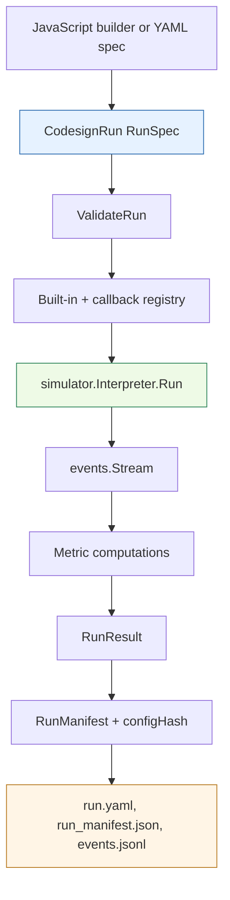

# Researchctl Codesign API: Implementation and Usage Deep Dive

The `codesign` API in `researchctl` is a deterministic experiment runtime for studying CPU/GPU placement, workload shape, scheduling policy, artifact provenance, and parameter sweeps. It is implemented as a Go simulation core with a JavaScript workbench layer exposed through `require("codesign")`. The Go layer owns the data model, validation, simulator, registries, metrics, artifacts, and CLI execution. The JavaScript layer gives researchers a compact grammar for constructing and running experiments without recompiling the binary.

> [!summary]
> - The codesign runtime models one experiment as `topology + workload + policy + metrics`, validates it as a `CodesignRun`, executes a deterministic event-producing simulator, and writes provenance-preserving artifacts.
> - The JavaScript API is a fluent workbench grammar over the Go model. Builders produce plain JSON-shaped specs, and service functions validate, run, summarize, sweep, compare, hash, and write artifacts.
> - `require("codesign")` is intentionally side-effectful and is only exposed in explicit runtimes such as jsverbs, REPLs, xgoja workbenches, and CLI-backed experiment workflows. Project loading remains restricted to `require("researchctl")`.

The reference repository is `/home/manuel/workspaces/2026-06-30/benchmark-cpu-inference/researchctl`. The core implementation lives under `pkg/codesign`, the JavaScript module lives under `pkg/gojamodules/codesign`, executable examples live in `examples/jsverbs/codesign.js`, and generated-host support lives in `pkg/xgoja/providers/researchctl` plus `examples/xgoja/researchctl-jsverbs`.

## Why this note exists

The codesign work added a second kind of runtime to `researchctl`. The original research graph API describes projects, goals, hypotheses, evidence, decisions, reports, and views. The codesign API executes experiments. That distinction matters because an experiment runtime is allowed to simulate, allocate run identifiers, compute metrics, and write files. A project loader should not do those things while reading a project description.

The implementation therefore separates two JavaScript modules:

| Module | Purpose | Where it is safe to expose |
| --- | --- | --- |
| `require("researchctl")` | Build and validate research project graphs. | Project loaders, renderers, CLI validation, explicit workbenches. |
| `require("codesign")` | Build, run, sweep, compare, and write CPU/GPU codesign experiments. | Explicit workbench runtimes, jsverbs, REPLs, xgoja-generated binaries, CLI experiment flows. |

This report explains the implementation of the `codesign` side. It focuses on how the API is structured, how the simulator executes a run, why the JavaScript grammar is shaped the way it is, how sweeps and artifacts work, and how a user should write experiments that remain reproducible.

## The shortest correct description of a codesign experiment

A codesign run has four required parts:

1. A **topology** defines devices. Devices have stable IDs, implementation types, and configuration objects.
2. A **workload** defines request arrivals and per-request stages. Each stage becomes a simulator task.
3. A **policy** chooses one compatible device for each task.
4. A **metric list** computes results over the event stream produced by the run.

The Go type that binds these parts is `RunSpec` in `pkg/codesign/spec/types.go`:

```go
type RunSpec struct {
    SchemaVersion int          `json:"schemaVersion" yaml:"schemaVersion"`
    Kind          string       `json:"kind" yaml:"kind"`
    Name          string       `json:"name" yaml:"name"`
    ExperimentID  string       `json:"experimentId" yaml:"experimentId"`
    Backend       string       `json:"backend" yaml:"backend"`
    Topology      TopologySpec `json:"topology" yaml:"topology"`
    Workload      WorkloadSpec `json:"workload" yaml:"workload"`
    Policy        PolicySpec   `json:"policy" yaml:"policy"`
    Metrics       []MetricSpec `json:"metrics,omitempty" yaml:"metrics,omitempty"`
}
```

The current built-in backend is `cpu-sim`. The backend name is still part of the spec because the experiment format should not change when future implementations add MLX, CUDA, eBPF, hardware traces, or remote execution backends. The current runtime is deterministic and CPU-side, but the data contract already leaves room for stronger implementations.

## Architecture overview

The implementation is divided into small packages. Each package has one responsibility, and most package boundaries correspond to a concept in the experiment model.

```text
pkg/codesign/spec          RunSpec, YAML/JSON decoding, validation
pkg/codesign/registry      Device/Policy/Metric/Workload interfaces and factories
pkg/codesign/devices       Built-in device cost models
pkg/codesign/devicefamilies Readable presets over device specs
pkg/codesign/workloads     Arrival generators
pkg/codesign/policies      Scheduling policies
pkg/codesign/metrics       Metric computations over event streams
pkg/codesign/simulator     Deterministic dispatch loop
pkg/codesign/sweeps        Cartesian axis expansion and multi-case execution
pkg/codesign/compare       Metric comparison over sweep results
pkg/codesign/artifacts     Manifests, config hashes, YAML/JSONL writing
pkg/gojamodules/codesign   go-go-goja module and fluent JavaScript API
```

The data flow for one run is:



This division keeps the JavaScript layer thin. JavaScript describes and invokes experiments. Go validates and executes them.

## Validation is part of the model, not an afterthought

`ValidateRun` in `pkg/codesign/spec/types.go` checks the structural invariants that must hold before execution starts. It does not create devices or metrics; that work belongs to the registry. It checks the experiment shape:

- `schemaVersion` must match the supported schema version.
- `kind` must be `CodesignRun`.
- `name`, `experimentId`, and `backend` are required.
- At least one topology device is required.
- Device IDs must be present and unique.
- A workload type is required.
- Non-trace workloads must have a positive count.
- Workload interarrival time cannot be negative.
- At least one workload stage is required.
- Stage IDs must be present and unique.
- Stage `computeUnits` must be positive.
- Stage byte counts cannot be negative.
- `supportedDevices` entries must refer to existing device IDs.
- Every metric must have an ID and type.

This validation layer catches errors before the simulator starts. It also keeps the simulator simpler: the simulator can assume that the topology and workload are structurally coherent and reserve its own errors for runtime conditions such as an unknown registry type or a policy selecting a missing device.

The JavaScript API exposes validation in two forms:

```javascript
const validation = run.validate();
const validation2 = codesign.validateRun(run.toSpec());
```

Use validation at the boundary where a human-written experiment spec enters the system. For generated specs, validate once before writing artifacts. For sweep-generated specs, the sweep executor validates each case before running it.

## The registry is the extension point

The registry package defines the four runtime interfaces:

```go
type Device interface {
    ID() string
    Type() string
    CanRun(Task) bool
    Estimate(Task, State) Estimate
    Run(Task, *State) (TaskResult, error)
}

type Policy interface {
    ID() string
    Choose(Task, []Device, State) (Decision, error)
}

type Metric interface {
    ID() string
    Compute(events.Stream) (MetricResult, error)
}

type Workload interface {
    NextRequest() (Request, error)
}
```

The simulator depends on these interfaces, not on concrete device or workload types. `builtin.NewRegistry()` wires the built-in implementations into a registry. The JavaScript module then augments that registry with runtime-local callback devices, policies, and metrics when a script registers them.

The extension contract is intentionally small:

- A workload produces requests in order.
- A device can estimate and run a task.
- A policy chooses among compatible devices.
- A metric computes a result from the emitted event stream.

That shape is what lets new cost formulas or scheduling experiments enter the system without changing the dispatch loop.

## The simulator loop

The execution core is `Interpreter.Run` in `pkg/codesign/simulator/simulator.go`. It receives a validated `RunSpec`, constructs devices, constructs a policy, constructs a workload, then repeatedly asks the workload for the next request.

The loop has this structure:

```text
validate run
create devices and device state
create policy
create workload
emit run_started

for each request from workload:
    emit request_submitted
    requestNow = arrival time

    for each stage in request.stages:
        task = stage converted to Task
        state.NowNS = requestNow
        candidates = devices where device.CanRun(task)
        decision = policy.Choose(task, candidates, state)
        device = deviceByID[decision.ChosenDeviceID]
        emit scheduler_decision
        result = device.Run(task, &state)
        emit task_started
        emit task_completed
        requestNow = result.FinishNS

    emit request_completed with latencyNs

emit run_finished
compute metrics over event stream
return RunResult
```

This loop establishes the current model semantics.

First, request stages are serial. The finish time of one stage becomes the start time for the next stage in the same request. Second, built-in devices are single-slot resources represented by `BusyUntilNS`. If a task reaches a device before that device is free, its start time is delayed. Third, devices can execute concurrently with each other because each device has its own state entry. Fourth, the event stream is canonical: metrics derive from events instead of from private simulator counters.

The emitted events have stable event types:

| Event type | Meaning |
| --- | --- |
| `run_started` | The run began. Metadata includes workload type. |
| `request_submitted` | A workload request arrived. |
| `scheduler_decision` | The policy chose a device for a task. Metadata includes candidate scores and reason. |
| `task_started` | A task started on a device. |
| `task_completed` | A task completed on a device. Metadata includes duration. |
| `request_completed` | All stages for one request completed. Metadata includes latency. |
| `run_finished` | The event stream is complete. |

The event stream is the central output of the simulator. Built-in metrics read it, callback metrics read it, optional artifact writing serializes it as JSONL, and future visualizations can render it as a trace.

## Device cost formulas

The built-in devices are deliberately simple. Their purpose is to make scheduling and placement experiments reproducible, not to claim hardware accuracy.

### `simple_device`

`simple_device` is defined in `pkg/codesign/devices/devices.go`. It uses `speed`, optional `setupNs`, and single-slot `BusyUntilNS` state.

```text
start    = max(state.NowNS, device.BusyUntilNS)
duration = setupNs + ceil(task.ComputeUnits / speed)
finish   = start + duration
score    = finish
```

The CPU family builder uses this device type by default. Use it when the experiment only needs a compute-rate model.

### `bandwidth_device`

`bandwidth_device` extends the cost formula with transfer time.

```text
start    = max(state.NowNS, device.BusyUntilNS)
transfer = ceil((task.BytesIn + task.BytesOut) / bandwidthBytesPerNs)
compute  = ceil(task.ComputeUnits / speed)
duration = setupNs + transfer + compute
finish   = start + duration
score    = finish
```

GPU-like builders use this type. The model can express offload break-even, setup overhead, transfer bandwidth sensitivity, and compute-rate sensitivity. It does not model occupancy, warp scheduling, cache effects, overlapping transfers, or true device-side concurrency. Those effects require a custom Go device implementation or a JavaScript callback device for exploratory modeling.

## Workloads define arrivals, stages define work

Workloads are request generators. Each request contains an arrival timestamp and a copy of the stage list from the spec. The implemented workload types are:

| Workload | Implementation | Use case |
| --- | --- | --- |
| `fixed` | Evenly spaced arrivals. | Deterministic baseline experiments. |
| `poisson` | Seeded exponential interarrival times. | Deterministic pseudo-random traffic. |
| `bursty` | Groups of arrivals separated by gaps. | Queueing under burst pressure. |
| `trace` | Explicit arrival timestamps from `config.arrivalsNs`. | Replaying a known arrival shape. |
| `open_loop` | Alias over fixed arrivals with explicit pacing. | Externally paced workloads. |
| `closed_loop` | Expands clients and requests into deterministic fixed arrivals with think time. | Client/request expansion without external traces. |

A stage is the per-request unit that becomes a `Task`. Important fields are:

| Field | Effect today |
| --- | --- |
| `computeUnits` | Required. Drives compute duration in built-in devices. |
| `bytesIn`, `bytesOut` | Drive transfer duration in `bandwidth_device`. |
| `supportedDevices` | Restricts compatible devices for the stage. Empty means all devices are compatible. |
| `accessPattern`, `stride`, `divergenceFactor`, `branchCount`, `mathCycles`, `memoryBytes` | Preserved as task config for richer metrics, callback devices, and future backends. |
| `config` | Free-form metadata for custom devices, policies, or metrics. |

The distinction between workload and stage is important. The workload decides when requests arrive. The stage list decides what each request must execute.

## Policies choose devices

Policies receive a `Task`, a list of compatible devices, and the current simulator state. They return a `Decision` with a chosen device ID, candidate scores, and a reason string.

The built-in policies are:

| Policy | Behavior |
| --- | --- |
| `first_available` | Selects the first compatible device. |
| `min_finish_time` | Calls `Estimate` on each compatible device and selects the smallest estimated finish time, with stable ID tie-breaking. |
| `round_robin` | Cycles through compatible devices. |
| `prefer_accel_unless_small` | Uses a threshold to route small tasks to CPU-like IDs and larger tasks to accelerator/GPU-like IDs. |

For most exploratory performance work, `min_finish_time` is the strongest default because it uses the same cost model as the devices. When the experiment is about policy behavior itself, use `round_robin`, `prefer_accel_unless_small`, or a JavaScript callback policy.

## Metrics are computations over events

Metrics do not inspect hidden simulator state. They compute from the event stream. That design keeps results reproducible and makes custom metrics straightforward.

Built-in metrics are:

| Metric | Event basis | Result unit |
| --- | --- | --- |
| `request_count` | Count `request_completed`. | `requests` |
| `latency_p95` | Percentile of `request_completed.metadata.latencyNs`. | `ns` |
| `tasks_by_device` | Count `task_completed` grouped by `deviceId`. | `tasks` |
| `task_time_by_device` | Sum `task_completed.metadata.durationNs` grouped by `deviceId`. | `ns` |
| `device_utilization` | `busy time / last task completion timestamp`, grouped by device. | `ratio` |

Because metrics read events, writing `events.jsonl` gives a durable audit trail. A future metric can be computed against the same event stream if the run artifacts preserved it.

## The JavaScript module boundary

The module entry point is `pkg/gojamodules/codesign/module.go`. It registers a go-go-goja native module named `codesign`:

```go
const ModuleName = "codesign"

func (module) Name() string { return ModuleName }
func (module) Doc() string  { return "CPU/GPU codesign run builder, simulation, and artifact API" }

func init() { modules.Register(&module{}) }
```

The loader creates a `moduleRuntime` for each JavaScript runtime. That runtime stores callback devices, callback policies, and callback metrics in maps keyed by callback ID. This state is runtime-local, which matters because callbacks are JavaScript functions and cannot be shared safely across unrelated VM instances.

The loader exports these functions:

```text
runSpec, sweepSpec, expandSweep, runSweep,
compareMetric, reduceValues,
validateRun, toSpec, run, manifest,
writeArtifacts, configHash, summarize
```

The design separates builder functions from service functions. Builders construct specs. Service functions execute or transform specs.

## The fluent builder grammar

The JavaScript builder is designed around scoped callbacks:

```javascript
const codesign = require("codesign");

const run = codesign.runSpec("two-device break-even")
  .experiment("EXP-001")
  .backend("cpu-sim")
  .topology(t => t
    .cpu("cpu0", { speed: 1 })
    .accelerator("accel0", { speed: 10, setupNs: 500 }))
  .workload(w => w
    .fixed({ count: 100, interarrivalNs: 100 })
    .stage("infer", {
      computeUnits: 10000,
      supportedDevices: ["cpu0", "accel0"],
    }))
  .policy("min_finish_time")
  .metrics(m => m
    .latencyP95()
    .tasksByDevice()
    .deviceUtilization());
```

The scoped callbacks keep vocabulary local. Topology methods such as `cpu`, `gpu`, and `jsDevice` only appear in the topology callback. Workload methods such as `fixed`, `poisson`, and `stage` only appear in the workload callback. Metric methods such as `latencyP95` and `deviceUtilization` only appear in the metrics callback.

The builder also supports fragments through `.use(fragment)`. A fragment is an ordinary JavaScript function that receives a builder and mutates it through the same fluent API.

```javascript
const twoDeviceTopology = t => t
  .cpu("cpu0", { speed: 1 })
  .accelerator("accel0", { speed: 10, setupNs: 500 });

const inferenceWorkload = ({ count, computeUnits }) => w => w
  .fixed({ count, interarrivalNs: 100 })
  .stage("infer", {
    computeUnits,
    supportedDevices: ["cpu0", "accel0"],
  });

const run = codesign.runSpec("fragment example")
  .experiment("EXP-FRAG")
  .backend("cpu-sim")
  .topology(t => t.use(twoDeviceTopology))
  .workload(w => w.use(inferenceWorkload({ count: 50, computeUnits: 5000 })))
  .policy("min_finish_time")
  .metrics(m => m.latencyP95().tasksByDevice());
```

Fragments are intentionally simpler than a plugin system. They give notebooks and workbench scripts reuse without creating a separate runtime extension protocol.

## JSON-shaped conversion is a deliberate implementation choice

The Go structs use JSON tags such as `runId`, `eventType`, and `startedAt`. Reflected Go values exposed directly to goja would present Go field names such as `RunID` or `EventType`. The implementation avoids that mismatch by serializing through JSON when values cross the Go/JavaScript boundary.

`pkg/gojamodules/codesign/convert.go` contains the conversion helpers:

```go
func (m *moduleRuntime) valueToRunSpec(v goja.Value) (*codesignspec.RunSpec, error) {
    v, err := m.callToSpec(v)
    if err != nil {
        return nil, err
    }
    payload, err := m.stringify(v)
    if err != nil {
        return nil, fmt.Errorf("decode CodesignRun: %w", err)
    }
    var run codesignspec.RunSpec
    if err := json.Unmarshal([]byte(payload), &run); err != nil {
        return nil, fmt.Errorf("decode CodesignRun: %w", err)
    }
    return &run, nil
}

func (m *moduleRuntime) toJS(v any) (goja.Value, error) {
    b, err := json.Marshal(v)
    if err != nil {
        return nil, err
    }
    return m.vm.RunString("(" + string(b) + ")")
}
```

This gives JavaScript users ordinary lowerCamel objects. It also means a builder, a plain spec object, or an object with `toSpec()` can all be accepted by service functions. The tradeoff is that values must be JSON-serializable. That is correct for run specs, results, manifests, and sweep definitions.

## Running one experiment

The builder has `.run(options)` and the module has `codesign.run(input, options)`. Both paths convert to a `RunSpec`, validate it, build a registry, create a simulator, and return a JSON-shaped `RunResult`.

```javascript
const result = run.run({ runId: "run-001" });

console.log(result.runId);
console.log(result.events.length);
console.log(codesign.summarize(result));
```

A `RunResult` has:

```typescript
interface RunResult {
  runId: string;
  events: Event[];
  metrics: MetricResult[];
}
```

In the canonical jsverbs example, the two-device run produces `502` events, `latency_p95=115100`, `87` accelerator tasks, and `13` CPU tasks. That example is implemented in `examples/jsverbs/codesign.js` and can be run through the generated xgoja host:

```bash
xgoja build -f examples/xgoja/researchctl-jsverbs/xgoja.yaml
./dist/researchctl-jsverbs verbs codesign run-canonical
```

## Writing artifacts

The artifact layer turns a workbench run into durable evidence. `writeArtifacts` writes:

```text
experiments/<experimentId>/runs/<runId>_<backend>/run.yaml
experiments/<experimentId>/runs/<runId>_<backend>/run_manifest.json
experiments/<experimentId>/runs/<runId>_<backend>/events.jsonl   # optional
```

The manifest includes the schema version, run ID, experiment ID, optional project ID, backend, workload type, device types, event count, metrics, artifact references, and config hash. The config hash is SHA-256 over the normalized run spec JSON.

```javascript
const result = codesign.run(run, { runId: "artifact-run" });
const written = codesign.writeArtifacts(run, result, {
  out: "artifacts",
  events: true,
  startedAt: "2026-07-01T12:00:00Z",
  projectId: "researchctl-codesign-study",
});

console.log(written.manifestPath);
console.log(written.manifest.configHash);
```

The artifact system is intentionally conservative. The run spec is written next to the manifest so a result can be traced back to the exact normalized input. The optional event stream is larger, but it is the most complete evidence for debugging metrics or visualizing a run.

## Sweeps turn one run into a parameter study

A sweep is a base run plus a list of axes. Each axis names a path in the run spec and a list of values. The sweep expander computes the Cartesian product of axis values, creates one case per combination, applies each value to a cloned run spec, then executes cases with stable IDs such as `case-001`.

```javascript
const sweep = codesign.sweepSpec("offload-speed-sweep")
  .base(base)
  .axis("gpuSpeed", "topology.devices.gpu0.config.speed", [10, 20, 40])
  .axis("computeUnits", "workload.stages.infer.computeUnits", [5000, 10000]);

const cases = sweep.expand();
const result = sweep.run({ out: "artifacts", events: false });
```

Supported path families are intentionally named rather than arbitrary JSONPath:

| Path family | Example |
| --- | --- |
| Backend | `backend` |
| Workload fields | `workload.count`, `workload.interarrivalNs`, `workload.config.seed` |
| Stage fields by ID | `workload.stages.infer.computeUnits`, `workload.stages.infer.bytesIn` |
| Policy config | `policy.threshold` or another key under policy config |
| Device config by ID | `topology.devices.gpu0.config.speed` |

Named device and stage IDs make sweeps stable. If a topology gains another device, `topology.devices.gpu0.config.speed` still targets the device named `gpu0`; an array-index path would be more fragile.

Sweep execution writes per-case artifacts and then annotates each manifest with `parentSweepId` and `sweptValues`. That makes each case understandable on its own while preserving the aggregate sweep context.

## Comparing sweep results

`compareMetric` reads one numeric metric across the cases in a sweep result. It records the baseline case, the metric value for every case, delta from baseline, ratio to baseline, improvement, and reductions over all values.

```javascript
const comparison = codesign.compareMetric(result, "latency_p95", {
  baselineCase: "case-001",
  lowerIsBetter: true,
});

for (const row of comparison.rows) {
  console.log(row.caseId, row.values, row.metricValue, row.improvement);
}

console.log(comparison.reductions.mean);
```

The `lowerIsBetter` option changes the improvement formula:

| `lowerIsBetter` | Improvement formula | Typical metrics |
| --- | --- | --- |
| `true` | `baselineValue / caseValue` | latency, duration, memory pressure |
| `false` | `caseValue / baselineValue` | throughput, score, completed work |

`reduceValues` currently returns `count`, `min`, `max`, and `mean`. These reductions are intentionally small. More advanced statistical treatment should be added as explicit metric or comparison code rather than hidden inside the default comparison API.

## JavaScript callbacks support experimental semantics

Callbacks allow workbench code to prototype behavior before it becomes a Go implementation. The module supports three callback extension points:

| Callback kind | Builder method | Registered type | Purpose |
| --- | --- | --- | --- |
| Device | `topology(t => t.jsDevice(...))` | `js_device` | Custom task estimate and execution timing. |
| Policy | `.policyCallback(...)` | `js_policy` | Custom device selection. |
| Metric | `metrics(m => m.callback(...))` | `js_metric` | Custom event-stream metric. |

A callback device receives `(phase, task, state, fallback)`. Today the phase is `"estimate"`. The fallback contains the built-in compute-rate estimate derived from callback device config. If the callback returns an invalid value, the fallback estimate is used.

```javascript
const run = codesign.runSpec("callback prototype")
  .experiment("EXP-CALLBACK")
  .backend("cpu-sim")
  .topology(t => t
    .cpu("cpu0")
    .jsDevice("js0", (phase, task, state, fallback) => ({
      startNs: fallback.startNs,
      durationNs: 1,
      finishNs: fallback.startNs + 1,
      score: fallback.startNs + 1,
    }), { speed: 100 }))
  .workload(w => w
    .fixed({ count: 2, interarrivalNs: 0 })
    .stage("infer", { computeUnits: 100, supportedDevices: ["cpu0", "js0"] }))
  .policyCallback("choose-js", () => "js0")
  .metrics(m => m.callback("completed", events => ({
    value: events.filter(e => e.eventType === "request_completed").length,
    unit: "requests",
  })));
```

Use callbacks for exploration. Move a callback into Go when the semantics become stable, when several experiments depend on it, or when it needs stronger tests and documentation. Go implementations are easier to validate from YAML and CLI-only workflows. JavaScript callbacks are runtime-local and only exist inside the VM that registered them.

## Device families improve readability without changing the core contract

The topology builder includes device-family methods:

```javascript
.topology(t => t
  .cpu("cpu0", { speed: 1 })
  .appleMSeries("m3", { speed: 12 })
  .nvidiaBlackwell("b200", { speed: 80, bandwidthBytesPerNs: 8192 })
  .disaggregatedMemory("mem0", { bandwidthBytesPerNs: 1024 }))
```

These methods produce ordinary `DeviceSpec` values. They are presets over `simple_device` or `bandwidth_device` with readable family metadata. The family names preserve intent in notebooks, manifests, and reports; they do not imply a hardware-accurate backend.

This design is useful because it keeps the current simulator honest. A run can say that it is studying an `nvidiaBlackwell`-style device, and the manifest can record that family metadata, while the backend remains `cpu-sim` and the cost formula remains visible in the device config.

## xgoja provider support makes the API available in generated binaries

The codesign module is available in three host styles:

1. Hand-written Go runtimes can import the module and use go-go-goja middleware.
2. The `researchctl` CLI can run YAML/JSON experiment specs directly.
3. xgoja-generated binaries can select the provider package and expose `codesign` explicitly.

The xgoja provider is `pkg/xgoja/providers/researchctl`. It exposes both `researchctl` and `codesign` as selectable runtime modules. The example spec is `examples/xgoja/researchctl-jsverbs/xgoja.yaml`.

```yaml
runtime:
  modules:
    - provider: researchctl
      name: researchctl
      as: researchctl
    - provider: researchctl
      name: codesign
      as: codesign
```

This is not a relaxation of the project-loading safety boundary. It is an explicit generated workbench. A generated binary may expose `codesign` because the user chose that module in `xgoja.yaml`.

## A practical usage sequence

For a new experiment, use this sequence.

### 1. Start with a single run

Write one run that has the smallest topology and workload capable of expressing the question.

```javascript
const run = codesign.runSpec("minimal offload run")
  .experiment("EXP-OFFLOAD-001")
  .backend("cpu-sim")
  .topology(t => t
    .cpu("cpu0", { speed: 1 })
    .gpu("gpu0", { speed: 20, bandwidthBytesPerNs: 4096, setupNs: 500 }))
  .workload(w => w
    .fixed({ count: 20, interarrivalNs: 100 })
    .stage("infer", {
      computeUnits: 10000,
      bytesIn: 4096,
      supportedDevices: ["cpu0", "gpu0"],
    }))
  .policy("min_finish_time")
  .metrics(m => m.latencyP95().tasksByDevice().deviceUtilization());
```

### 2. Validate before executing

```javascript
const validation = run.validate();
if (validation.issues.length) {
  throw new Error(JSON.stringify(validation.issues, null, 2));
}
```

### 3. Run with a stable run ID

```javascript
const result = run.run({ runId: "run-offload-001" });
console.log(codesign.summarize(result));
```

### 4. Write artifacts only after the run is meaningful

```javascript
codesign.writeArtifacts(run, result, {
  out: "artifacts/offload-study",
  events: true,
  startedAt: "2026-07-01T12:00:00Z",
  projectId: "researchctl-codesign-offload-study",
});
```

### 5. Convert the run into a sweep

```javascript
const sweep = codesign.sweepSpec("offload-ridge")
  .base(run)
  .axis("gpuSpeed", "topology.devices.gpu0.config.speed", [5, 10, 20, 40])
  .axis("bytesIn", "workload.stages.infer.bytesIn", [1024, 4096, 16384]);

const sweepResult = sweep.run({ out: "artifacts/offload-study", events: false });
const comparison = codesign.compareMetric(sweepResult, "latency_p95", {
  baselineCase: "case-001",
  lowerIsBetter: true,
});
```

### 6. Promote stable callback semantics into Go

If a callback device becomes the core of an experiment family, move it behind the `registry.Device` interface and add tests. Keep the JavaScript callback around as a sketch only if it still teaches the experiment idea.

## Common failure modes

### Exposing `codesign` during project load

`codesign` can run simulations and write files. Do not expose it while loading project `.js` files. Project loading uses the safe `researchctl` module only. If a project needs experiment results, write artifacts through an explicit experiment workflow, then import manifests or evidence into the research graph.

### Treating family names as hardware accuracy

`appleMSeries`, `nvidiaBlackwell`, and related helpers are readable presets. They produce `DeviceSpec` values for the current deterministic simulator. The current backend is not a hardware measurement backend. Keep conclusions phrased in terms of the model unless a future backend supplies hardware data.

### Sweeping by fragile array position

The implemented sweep paths use named devices and stages. Prefer `topology.devices.gpu0.config.speed` over any representation that depends on array order. Stable IDs are part of the experiment contract.

### Forgetting to preserve the event stream when debugging metrics

Manifests preserve summary metrics and config hashes. They do not preserve every event unless `events: true` is passed to `writeArtifacts`. If a metric is surprising, rerun with event writing enabled or preserve events in the first place for important runs.

### Hiding important behavior in callbacks

Callbacks are useful for exploration, but they can hide core semantics in a notebook. If a callback represents a reusable device, policy, or metric, implement it in Go and register it through the registry. Then it becomes available to YAML specs, CLI commands, tests, and generated binaries.

## Implementation file map

Start with these files when reviewing or extending the implementation:

| File | Why it matters |
| --- | --- |
| `pkg/codesign/spec/types.go` | Defines `RunSpec`, stage/device/policy/metric specs, YAML/JSON decoding, and validation. |
| `pkg/codesign/registry/types.go` | Defines the interfaces that the simulator depends on. |
| `pkg/codesign/simulator/simulator.go` | Contains the execution loop and event emission order. |
| `pkg/codesign/devices/devices.go` | Contains the built-in cost formulas. |
| `pkg/codesign/workloads/workloads.go` | Contains request arrival generators. |
| `pkg/codesign/policies/policies.go` | Contains built-in scheduling policies. |
| `pkg/codesign/metrics/metrics.go` | Contains event-stream metric implementations. |
| `pkg/codesign/sweeps/sweeps.go` | Contains sweep expansion, path setting, and multi-case execution. |
| `pkg/codesign/compare/compare.go` | Contains metric comparison and reductions. |
| `pkg/codesign/artifacts/manifest.go` | Contains manifest construction, config hashing, and artifact writing. |
| `pkg/gojamodules/codesign/module.go` | Defines the `require("codesign")` module exports. |
| `pkg/gojamodules/codesign/builders.go` | Implements the fluent builder grammar. |
| `pkg/gojamodules/codesign/api.go` | Implements validate/run/manifest/write/hash/summary service functions. |
| `pkg/gojamodules/codesign/convert.go` | Implements JSON-shaped Go/JavaScript conversion. |
| `pkg/gojamodules/codesign/callbacks.go` | Implements JavaScript callback devices, policies, and metrics. |
| `pkg/gojamodules/codesign/sweep.go` | Exposes sweep builders and execution to JavaScript. |
| `pkg/gojamodules/codesign/compare.go` | Exposes comparison helpers to JavaScript. |
| `examples/jsverbs/codesign.js` | Shows executable examples for the API surface. |
| `cmd/researchctl/doc/codesign-js-user-guide.md` | User-facing guide for Glazed help. |
| `cmd/researchctl/doc/codesign-js-api-reference.md` | User-facing API reference. |

## What the implementation gets right

The strongest part of the design is the separation between spec construction, execution, and artifact writing. A builder can produce a plain `RunSpec`. A plain `RunSpec` can be validated, serialized, run, hashed, or used as the base of a sweep. The simulator does not need to know whether a run came from YAML, JSON, a JavaScript builder, or a generated case.

The event-stream metric model is also important. Metrics are not wired into the simulator loop as special counters. They are computations over emitted events. That keeps the simulator focused on execution and makes later inspection possible.

The callback layer is useful during intermediate design work. It lets researchers test a new device estimate, policy, or metric before committing to a Go implementation. The registry boundary then provides a clean path for promotion into product code.

The safety boundary between `researchctl` and `codesign` is correct. It prevents project loading from becoming an execution environment while still allowing explicit workbench binaries and scripts to run experiments.

## Current limits

The current simulator is a deterministic abstract model. It is useful for understanding placement, scheduling, transfer sensitivity, setup overhead, queueing, and sweep behavior. It does not yet model all CPU/GPU performance effects.

Important limits:

- Built-in devices are single-slot. They track `BusyUntilNS` but not multi-lane occupancy.
- Request stages are serial. There is no built-in overlap between stages of the same request.
- `bandwidth_device` uses a simple transfer-plus-compute formula. It does not model cache hierarchy, memory coalescing, kernel occupancy, tensor-core utilization, command submission queues, or transfer/compute overlap.
- Device family builders are presets, not hardware backends.
- Callback devices can express richer timing, but callback semantics are runtime-local and should be promoted to Go when they become stable.
- Statistical analysis is intentionally minimal. Sweeps provide rows, ratios, improvements, and simple reductions, but deeper analysis should be explicit.

These limits are acceptable for the first implementation because they are visible in the code and in the documentation. The system is designed so that stronger device models, workloads, metrics, and backends can be added without replacing the API.

## Recommended next implementation steps

The next technical steps should preserve the current layering:

1. Add Go implementations for the most useful callback-prototyped device models. Start with multi-slot devices and transfer/compute overlap if experiments require them.
2. Add richer metrics as event-stream computations rather than simulator counters.
3. Add a hardware trace import path that produces `trace` workloads or event streams with clear provenance.
4. Add visualization over `events.jsonl` so users can inspect scheduling decisions and device utilization over time.
5. Add CI coverage for the xgoja `doctor` and `gen-dts` paths if the xgoja binary is available in the CI environment.
6. Keep project loading restricted to `researchctl`; expose `codesign` only in explicit execution contexts.

## Working rules for using the codesign API

- Validate every hand-authored run before executing it.
- Use stable `experimentId`, `runId`, device IDs, stage IDs, and sweep IDs.
- Prefer named sweep paths over any path that depends on list position.
- Write `events.jsonl` for important runs, surprising metrics, and any run that will be used as evidence.
- Treat device family names as provenance labels over the current model, not as measured hardware claims.
- Use JavaScript callbacks to explore. Use Go registry implementations to standardize.
- Keep `codesign` out of project-loading contexts.
- Store enough artifacts for a future reader to reconstruct the run: normalized `run.yaml`, `run_manifest.json`, config hash, and events when needed.

## Closing

The codesign API gives `researchctl` an executable experiment layer without weakening the research graph model. The Go runtime defines a deterministic simulation contract. The JavaScript runtime makes that contract concise to use in notebooks, jsverbs, REPLs, and generated binaries. The artifact layer turns experiments into evidence. The sweep and comparison layer turns individual runs into parameter studies.

The implementation is deliberately modest in the hardware effects it models today, but the architecture is not closed to extension. Devices, policies, workloads, and metrics are registry-backed interfaces. JavaScript callbacks provide a low-friction path for exploratory semantics. Go implementations provide the long-term path for tested, documented, reusable behavior. That division of responsibilities is the central value of the codesign API as implemented.
