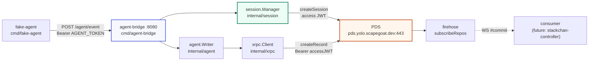
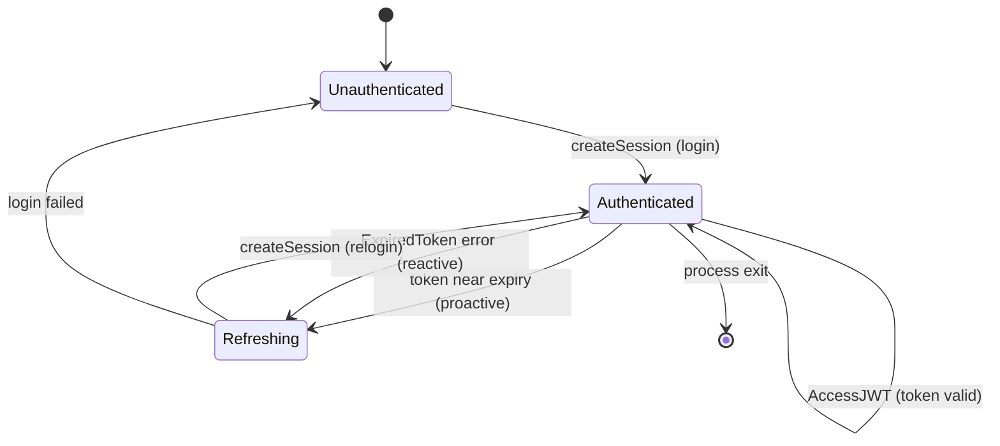

# ATProto Agent Activity Log System — Service Layer Deep Dive

This report explains the service layer built on top of the Bluesky Personal Data Server: how a coding agent's activity becomes a signed, replayable record on the PDS, how an HTTP service manages the authentication session that makes that possible, and how the pieces compose into a verifiable pipeline. The PDS deployment itself — its container, ingress, secrets, and the defects found there — is documented in the companion report `PROJECT REPORT - Bluesky PDS on K3s - Signed Agent Activity Log Deep Dive`. This report covers the Go code that sits in front of and around the PDS: the XRPC client, the session manager, the record types, the agent-bridge HTTP service, and the fake-agent that drives the full demo sequence.

The work lives in the `pds-lab` repository at `/home/manuel/code/wesen/2026-07-01--pds-lab`, ticket `HK3S-0031`, with cluster manifests in `/home/manuel/code/wesen/2026-03-27--hetzner-k3s`. The relevant commits are `0b57ae5` (initial XRPC, firehose, and CAR client), `20a014b` (atproto-skills submodule), `c43fbeb` (agent-bridge and session manager), and `b9dc4cf` (fake-agent). The system is verified live against the public PDS at `https://pds.yolo.scapegoat.dev`.

> [!summary]
> - A complete agent-activity pipeline now exists end to end. A fake coding agent emits a task lifecycle; an HTTP agent-bridge turns each step into a typed, signed record on the PDS; the records accumulate in the account's repository under three collections; and the firehose carries every mutation to any consumer. Eight records per demo run, each round-tripping through the bridge in roughly 210 milliseconds.
> - The session manager is the load-bearing component of the bridge. It caches the PDS access JWT, refreshes it proactively before expiry, and reacts to expired-token errors with a single retry. Its first implementation deadlocked silently — a re-entrant mutex lock that hung `WriteEvent` with no error. The fix, splitting lock-held cores from the public locking wrappers, is the kind of concurrency defect worth documenting because its symptom is indistinguishable from a network problem.
> - The repo now packages the atproto-skills knowledge base as a submodule, so the agent writing this code can load AT Protocol reference material on demand. This is the project's first use of skills as a development dependency rather than a runtime one.

## Why this layer exists

The PDS, deployed and verified, is a host for signed repositories. It does one thing well: it stores records and streams their mutations. It is not, by itself, an activity log for coding agents. Two gaps separate a working PDS from a working activity-log system, and this layer fills both.

The first gap is authentication. The PDS authenticates every mutation with a short-lived access JWT, issued by `createSession` against an account's credentials. A coding agent does not want to authenticate before every record it writes, and it does not want to manage token expiry. The agent-bridge owns one authenticated session — its own account on the PDS — and presents the access JWT on behalf of every agent that posts to it. Agents authenticate to the bridge with a shared token; the bridge authenticates to the PDS with its session. This separation means the PDS sees one writer (the bridge) while the records carry the identity of the originating agent.

The second gap is record shaping. An agent knows it ran a test and the test failed. It does not necessarily know the AT Protocol conventions: that a record needs a `$type` field matching its collection, a `createdAt` timestamp in RFC 3339, and a stable collection NSID. The bridge applies these conventions. The agent posts a small JSON object with the facts — agent identifier, repository, task identifier, kind, summary, risk — and the bridge constructs the full record and writes it to the correct collection.

The resulting division of responsibility is what makes the system tractable. The PDS handles storage, signing, and streaming. The bridge handles authentication and record shaping. The agent handles only the work it actually did. Each layer can change without forcing the others to change, because the boundaries are narrow and explicit.

## The system in one pass



The diagram shows the data path for one record. The fake-agent POSTs to the bridge. The bridge obtains a valid access JWT from the session manager (logging in or refreshing as needed), hands the record to the writer, which calls the XRPC client, which performs `createRecord` against the PDS. The PDS stores the record in the bridge account's signed repository and emits a `#commit` on the firehose. A consumer — the stackchan-controller, in the full design — reads that commit and acts. Every component in the path except the consumer is implemented and verified.

## The record model

Three record types carry the agent-activity vocabulary. Each maps to one collection NSID under the placeholder `com.example` namespace, which will be replaced with a controlled domain before any Lexicon is published. The types are defined in `internal/record/record.go` as plain structs with JSON tags, so a record serializes directly to the shape the PDS expects.

```text
com.example.agent.event            an agent action (test ran, file edited, task started)
com.example.agent.approvalRequest  the agent asks a human or robot to approve an action
com.example.agent.approvalResponse a human or robot decides on a request
```

The event record is the most common. Its fields describe what happened, where, and how risky it was:

```go
type Event struct {
    Type          string `json:"$type"`
    AgentID       string `json:"agentId"`
    Repo          string `json:"repo,omitempty"`
    TaskID        string `json:"taskId,omitempty"`
    Kind          string `json:"kind"`
    Summary       string `json:"summary"`
    Risk          string `json:"risk"`
    RequiresHuman bool   `json:"requiresHuman"`
    CreatedAt     string `json:"createdAt"`
}
```

The `$type` field is mandatory in the AT Protocol: it names the collection and tells a consumer how to parse the remaining fields. The `createdAt` field is an RFC 3339 UTC timestamp, applied by the bridge so agents do not have to. Constructor functions (`NewEvent`, `NewApprovalRequest`, `NewApprovalResponse`) stamp `$type` and `createdAt` so the caller cannot forget either.

The approval records form a pair. An approval request names the action and target the agent wants to touch, with a risk level and a reason. An approval response names the request it answers, the decision, and the actor (by DID) who decided. The response references the request by a shared `requestId` string rather than by an `at://` URI in this implementation, because the bridge writes both and the identifier is stable within a run. Wiring the response to the request by content-addressed URI is a future refinement that makes the link verifiable rather than merely conventional.

## The XRPC client

The XRPC client in `internal/xrpc/client.go` is the thinnest layer in the system. It implements three operations — `createSession`, `createRecord`, `listRecords` — as functions that build an HTTP request, set the content type and bearer header, perform the request, and unmarshal the response. There is no SDK and no abstraction beyond a shared `postJSON` helper. The reason for this thinness is pedagogical: the AT Protocol's HTTP surface is small, and hiding it behind a client library would make the protocol harder to inspect, not easier.

The error path is the one place the client does real work. The XRPC convention formats errors as JSON objects with `error` and `message` fields. When the PDS returns a non-2xx status, the client reads the body, truncates it to 300 bytes, and returns an error whose message includes the status code, the path, and the body. This format matters because the session manager's retry logic matches on it: an expired access JWT produces an error containing `ExpiredToken`, and that string is what triggers a refresh and retry rather than a failure.

## The session manager

The session manager in `internal/session/manager.go` is the component that makes the bridge practical. A naive bridge would call `createSession` before every `createRecord`, adding the cost of a full login round-trip to every write. The manager avoids this by caching the access JWT and reusing it across writes until it is about to expire.



The manager holds three pieces of state: the current session (the access and refresh JWTs plus the DID), the access JWT's expiry time, and a mutex that serializes access. The expiry is decoded from the JWT's `exp` claim without signature verification — the bridge trusts its own PDS, and verification is not its responsibility. The claim parsing lives in `jwt.go`, which splits the compact JWT on its dots and base64url-decodes the middle segment.

Two refresh paths exist. The proactive path refreshes when the token is within twenty percent of its time-to-live, so a write never blocks on a token that is about to expire. The reactive path handles the case the proactive path cannot prevent: a mutation returns `ExpiredToken`, meaning the token the manager believed was valid has been rejected. The reactive path forces a relogin and returns the new token so the caller can retry exactly once. The distinction matters because the proactive path runs inside `AccessJWT` before any write, while the reactive path runs after a write has already failed.

### The deadlock

The session manager's first implementation deadlocked. The defect, and the way it manifested, are worth describing precisely because they are a common Go concurrency pitfall and because the symptom obscured the cause.

`AccessJWT` took the manager's mutex, then called `refreshSkew` to decide whether the token was near expiry. `refreshSkew` also took the mutex. Go's `sync.Mutex` is not re-entrant: a goroutine that locks a mutex it already holds blocks forever. So a call to `AccessJWT` would acquire the lock, call `refreshSkew`, which would block on the lock, which would never be released because the goroutine holding it was blocked.

The symptom was a silent hang in `WriteEvent`. No error, no log line, no timeout — the call simply never returned. Because the bridge runs as an HTTP server, this manifested as requests that never completed, which looked exactly like a network problem or a slow PDS. Instrumentation was the only way to localize it. A test program that printed a timestamp after each step showed that `DID()` returned in 875 milliseconds but `WriteEvent` never printed its completion line. That pinned the hang to the write path. Adding logging inside `write` would have shown the goroutine stuck inside `AccessJWT`, but the simpler diagnostic — the gap between the last printed step and the missing one — was enough to point at the session layer.

The fix splits the manager's methods into public wrappers that take the lock and private cores that assume the lock is held. `AccessJWT` locks and calls `accessJWTLocked`. `accessJWTLocked` calls `refreshSkewLocked`, which reads the expiry without locking. `DID` and `OnExpired` follow the same pattern. The `_Locked` suffix is a Go convention for methods that require the caller to hold the lock; it makes the contract visible at the call site and prevents the same bug from being reintroduced by a future caller that does not realize the lock is already held.

```go
func (m *Manager) AccessJWT() (string, error) {
    m.mu.Lock()
    defer m.mu.Unlock()
    return m.accessJWTLocked()
}
func (m *Manager) accessJWTLocked() (string, error) {
    if m.current != nil && time.Now().Before(m.exp.Add(-m.refreshSkewLocked())) {
        return m.current.AccessJWT, nil
    }
    return m.reloginLocked()
}
func (m *Manager) refreshSkewLocked() time.Duration { /* reads exp, no lock */ }
```

This structure makes a single guarantee: every method takes the mutex at most once, at the top of the public wrapper. No `_Locked` method calls a public method, so no path can re-enter the lock.

## The agent writer

The writer in `internal/agent/writer.go` ties the session manager to the XRPC client. Its `write` method is the single place that decides how a record reaches the PDS, and it encodes the retry policy.

```go
func (w *Writer) write(collection string, rec any) (*Result, error) {
    did, _ := w.sessions.DID()
    body, _ := json.Marshal(rec)
    jwt1, _ := w.sessions.AccessJWT()
    resp, err := xrpc.CreateRecord(w.host, jwt1, did, collection, toMap(body))
    if err == nil {
        return &Result{URI: resp.URI, CID: resp.CID}, nil
    }
    if !isExpiredToken(err) {
        return nil, fmt.Errorf("createRecord(%s): %w", collection, err)
    }
    jwt2, _ := w.sessions.OnExpired()
    resp, err = xrpc.CreateRecord(w.host, jwt2, did, collection, toMap(body))
    return &Result{URI: resp.URI, CID: resp.CID}, err
}
```

The policy is deliberately narrow. Only an expired-token error triggers a retry, because that is the only error a refresh can fix. Any other error — a malformed record, a PDS outage, a network failure — propagates immediately. The retry happens exactly once, not in a loop, because an expired token that fails to refresh twice indicates a problem a retry will not solve. This bounded-retry design keeps the writer's behavior predictable under failure: a caller can assume that a successful return means one or two createRecord calls, and a failed return means the failure is real.

## The agent-bridge HTTP service

The bridge in `cmd/agent-bridge/main.go` is an HTTP server that exposes the three record types as endpoints. Each endpoint decodes a JSON body, applies the record conventions through a constructor, writes the record via the writer, and returns the resulting URI and CID. Authentication is a bearer token compared against an environment-configured shared secret — a simple scheme appropriate for an internal service that sits behind the cluster's other controls.

```text
POST /agent/event              -> com.example.agent.event
POST /agent/approval-request   -> com.example.agent.approvalRequest
POST /agent/approval-response  -> com.example.agent.approvalResponse
GET  /healthz
```

The handler for each endpoint performs the same five steps, which is why they share helper functions. `decode` enforces the POST method and parses the JSON. Input validation checks the required fields and fills defaults: an empty agent identifier becomes `unknown`, an empty risk becomes `low`. The constructor stamps `$type` and `createdAt`. The writer performs the createRecord call with its retry policy. `writeRecord` logs the URI and CID, then returns a 201 with the result JSON, or a 502 with the error if the write failed.

The bridge holds one writer, constructed at startup, which holds one session manager. The session manager authenticates once — at startup, the bridge calls `DID()` to force an initial login and to log the bridge's own DID — and reuses that session for every subsequent write. This is why the session manager's caching matters: without it, every request would pay the login cost, and the bridge would be unable to sustain even modest throughput.

A request logger wraps the mux so every request prints its method, path, and duration. The write path logs the URI and CID of each record it creates. These two log streams are enough to trace a request end to end: the request log shows when it arrived and how long it took; the write log shows what record it produced.

## The fake-agent

The fake-agent in `cmd/fake-agent/main.go` is the component that makes the system demonstrable. It walks a coding agent through a complete task lifecycle, posting each step to the bridge. The sequence is chosen to exercise every record type and to leave room for the approval round-trip that the stackchan-controller will eventually complete.

```text
task.started       begin work on failing auth integration test
plan.created       plan: reproduce, fix session expiry, re-run tests
file.edited        edited src/auth/session.ts to refresh token before expiry
test.failed        auth integration test failed: token expired mid-request
approvalRequest    modify src/auth/session.ts (high risk)
--- pause for a human or robot decision ---
test.passed        all auth integration tests passed after the fix
pr.created         opened PR #42: refresh session token before expiry
completed          task complete
```

The pause after the approval request is structural. In the full system, the stackchan-controller observes the request on the firehose, prompts via the robot, and posts an approval response when a human decides. The fake-agent does not block on that response; it pauses for three seconds to leave a window, then continues as if approved. This is the one place the fake-agent diverges from a real agent, and it is deliberate: the fake-agent exists to generate traffic and demonstrate the write path, not to model the approval gate, which belongs to the consumer.

The fake-agent posts each step with `curl`-equivalent logic: marshal a small JSON object, set the bearer token, POST to the bridge. The pace between steps is configurable through `PACE_MS`, defaulting to 800 milliseconds so the sequence is watchable. With `PACE_MS=150`, the eight-step sequence completes in roughly five seconds. The `-once` flag runs the sequence once and exits; without it, the agent loops with a fresh task identifier every five seconds, producing a continuous stream of records for a consumer to react to.

## The verified end-to-end pipeline

The pipeline was verified live against the public PDS. The bridge was started against `https://pds.yolo.scapegoat.dev` with the bridge account's credentials, and the fake-agent was pointed at it. The output, captured verbatim, shows the eight records created and their resulting URIs:

```text
fake-agent: bridge=http://127.0.0.1:18080 agent=codex-01 repo=payments-api task=fake-demo-001
  task.started       -> …fs/com.example.agent.event/3mpmvpjtxnk25
  plan.created       -> …fs/com.example.agent.event/3mpmvpk734k25
  file.edited        -> …fs/com.example.agent.event/3mpmvpkknac25
  test.failed        -> …fs/com.example.agent.event/3mpmvpkv56c25
  approval:modify-file -> …mple.agent.approvalRequest/3mpmvpl7uwc25
fake-agent: approval requested (approval-306668); pausing for a decision
  test.passed        -> …fs/com.example.agent.event/3mpmvpob2cc25
  pr.created         -> …fs/com.example.agent.event/3mpmvpolgdc25
  completed          -> …fs/com.example.agent.event/3mpmvpovz7225
```

Each URI ends in a TID record key that sorts chronologically within its collection, so the records can be listed in the order they were written. The records now persist on the PDS. A direct query of the three collections on the account's repository returns the accumulated state: 18 event records, 2 approval requests, 1 approval response. These counts include earlier test writes and the demo runs; the point is that the records are durable and queryable, not that the counts are a fixed target.

The bridge's request log shows the timing of each write. The first write takes longer because it includes the initial login; subsequent writes are pure createRecord round-trips.

```text
wrote uri=at://did:plc:.../com.example.agent.event/3mpmvmker2c25 cid=bafyreih6vxbkcpfjtozalptcsd62vruo7qmizfyri5cgqmudbylr23leie
POST /agent/event 214.522101ms
POST /agent/approval-request 208.841576ms
POST /agent/approval-response 231.043448ms
```

Each createRecord call completes in roughly 210 milliseconds. That is the cost of one HTTPS round-trip from the bridge host to the PDS, plus the PDS's work to validate the record, update the Merkle Search Tree, sign the commit, and append to the sequencer. The consistency of the timing across the three record types indicates the PDS's write path is uniform with respect to collection, as the protocol design intends.

## The skills dependency

The repository now carries the `atproto-skills` submodule under `.agents/skills/atproto-skills`, configured through `.pi/settings.json` to point the coding agent at its `skills/` directory. This is a development-time dependency, not a runtime one. The skills — covering repository structure, CID handling, Lexicon authoring, identity resolution, and OAuth — are reference material the agent loads on demand while writing or reviewing code that touches those topics.

The distinction matters because the skills influence how the code is written, not how it runs. A skill that triggers on "CAR v1" or "Merkle Search Tree" gives the agent the precise specification while it implements the CAR reader in `internal/car/car.go`. The skills are vendored as a submodule rather than installed globally so that anyone cloning the repository gets the same reference set, and so updates are explicit and version-pinned to a commit. The tradeoff is that cloning requires `--recurse-submodules`, and updates require a manual pull and commit of the submodule pointer.

## What remains

The consumer is the missing piece. The system can write records and stream them, but nothing yet reads the stream and acts. The stackchan-controller is the intended consumer: it subscribes to the firehose, persists its cursor so it can resume without replay, parses `#commit` events by `$type`, maps records to robot state, and drives the Stack-chan hardware. When it observes an `approvalRequest`, it prompts via the robot and, on a human decision, posts an `approvalResponse` through the bridge. That closes the loop the fake-agent currently leaves open.

The firehose consumer already exists in `internal/firehose/firehose.go`, verified in the companion report against the public PDS. What remains is the controller that wraps it: cursor persistence, record-to-state mapping, and the hardware integration. The firehose primitives — the two-decode frame parser, the CAR-slice record resolver, the cursor-based resumption — are done.

Two hardening items are tracked in the ticket. The consumer trusts the internal PDS and does not verify commit signatures or recompute MST hashes; the protocol's self-authenticating guarantee only holds when a consumer verifies, and that verification is a necessary step before the system is used to make decisions. The `com.example` namespace is a placeholder and must change to a controlled domain before any Lexicon is published, because Lexicons are referenced by NSID and become difficult to revise once other records point at them.

## Working rules

- A service that writes to the PDS over time owns one session and caches its access JWT, refreshing proactively before expiry and reactively on an expired-token error. Per-write login is both slow and unnecessary.
- Mutex-using types expose public methods that take the lock and private `_Locked` methods that assume it is held. No `_Locked` method calls a public method. This prevents re-entrant-lock deadlocks, whose symptom is a silent hang indistinguishable from a network problem.
- Record constructors stamp `$type` and `createdAt` so callers cannot forget either. The `$type` must equal the collection NSID; `createdAt` is RFC 3339 UTC.
- A writer retries only on an expired-token error, and only once. Any other error propagates immediately. Bounded retries keep failure behavior predictable.
- A fake agent that generates traffic should pause at the approval gate rather than block on it. The gate belongs to the consumer; the agent's job is to produce the request, not to model the response.

## Related notes and sources

- Companion report: `PROJECT REPORT - Bluesky PDS on K3s - Signed Agent Activity Log Deep Dive` (PDS deployment, ingress, secrets, the port and firehose-wire defects)
- Ticket and design doc: `/home/manuel/code/wesen/2026-03-27--hetzner-k3s/ttmp/2026/07/01/HK3S-0031--install-the-bluesky-pds-on-k3s-as-a-signed-agent-activity-log`
- Go service layer: `/home/manuel/code/wesen/2026-07-01--pds-lab`
- AT Protocol XRPC specification: `https://atproto.com/specs/xrpc`
- AT Protocol sync specification: `https://atproto.com/specs/sync`
- atproto-skills reference: `https://github.com/ngerakines/atproto-skills`
