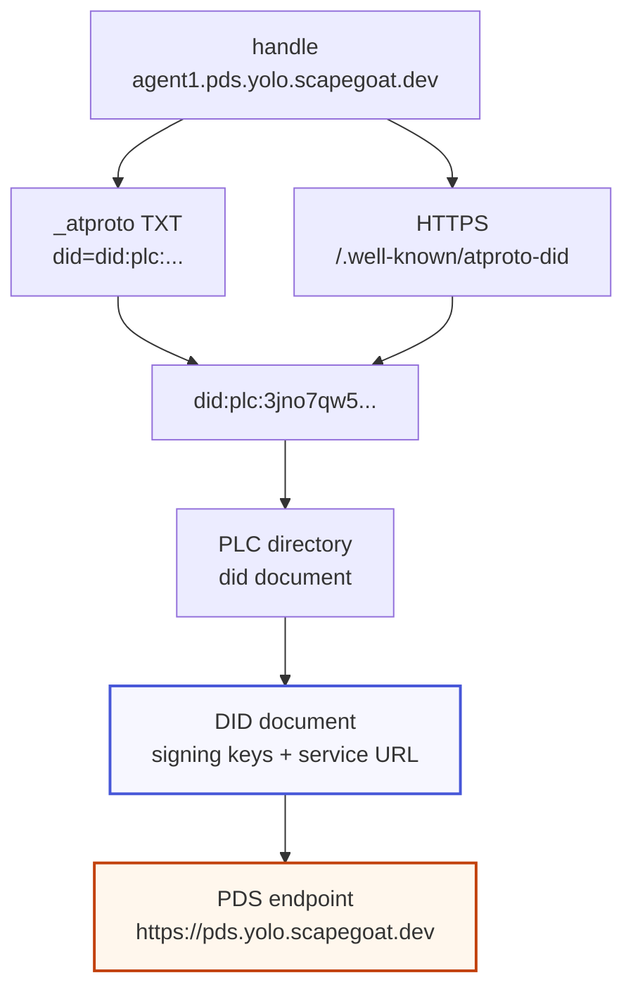
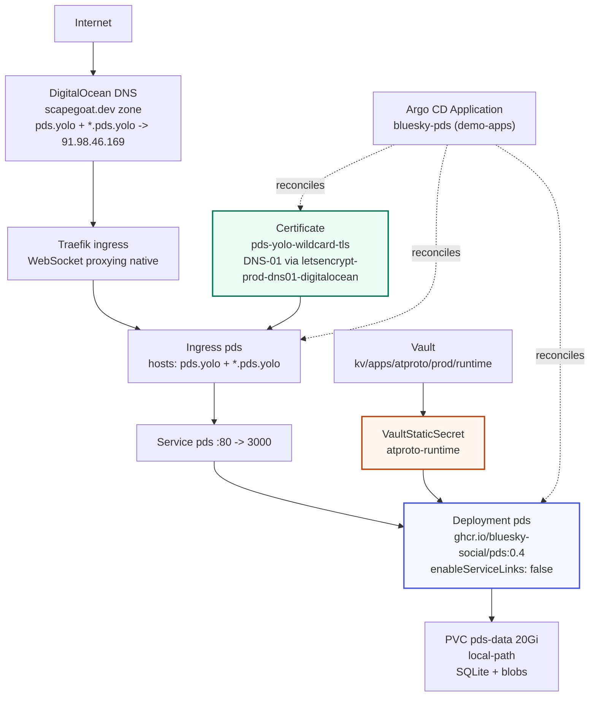
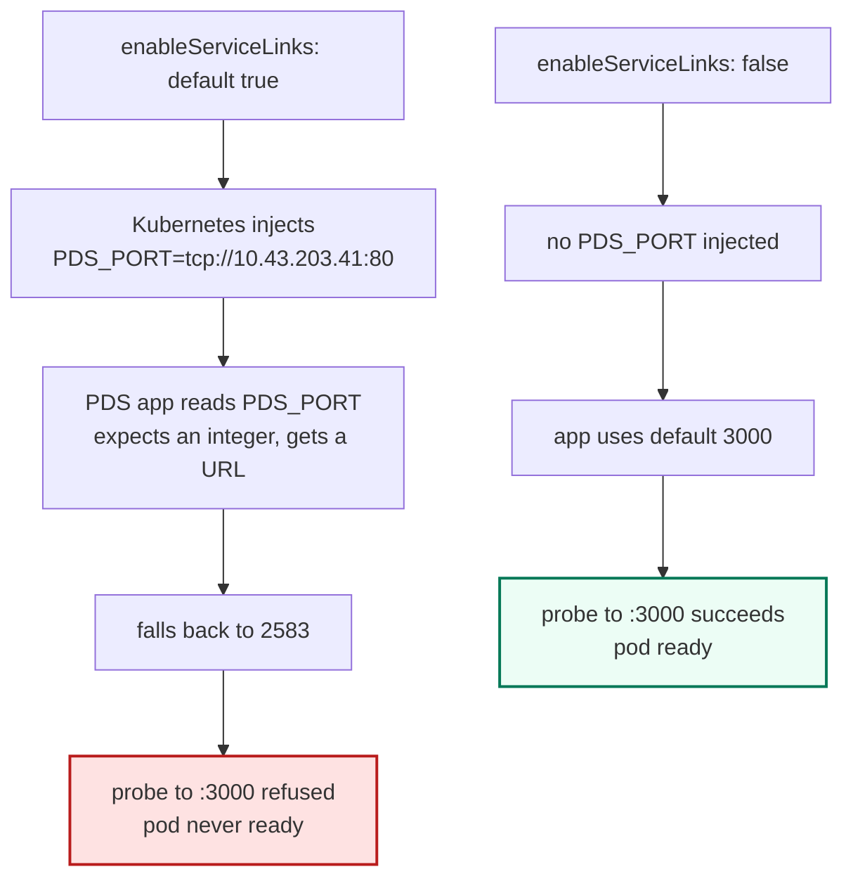

# Bluesky PDS on K3s — Signed Agent Activity Log Deep Dive

This report explains how the reference Bluesky Personal Data Server (PDS) was installed on the `yolo.scapegoat.dev` single-node K3s cluster and verified end to end, and how a small Go client was written around it to prove the full AT Protocol data loop. The work spans three repositories: the cluster GitOps repo, the DNS terraform repo, and a new Go repository that consumes the PDS directly. The goal of the report is not to record that a deployment happened, but to make the PDS's internal architecture legible — what a PDS is, how its identity and repository model behave, and where the deployment deviates from the reference setup and why.

The implementation lives across three repositories. The cluster manifests and ticket documentation are in `/home/manuel/code/wesen/2026-03-27--hetzner-k3s`, ticket `HK3S-0031`, under `ttmp/2026/07/01/HK3S-0031--install-the-bluesky-pds-on-k3s-as-a-signed-agent-activity-log`. The DNS records are in `/home/manuel/code/wesen/terraform` at `dns/zones/scapegoat-dev/envs/prod/main.tf`. The Go client is in `/home/manuel/code/wesen/2026-07-01--pds-lab`. The relevant commits are `2ee66b0` (GitOps package), `eeac9ca` (port and service-link fix), `76669e6` and `b8aa134` (diary and bookkeeping) in the cluster repo, `ce73041` in the terraform repo, and `0b57ae5` in the pds-lab repo.

> [!summary]
> - The reference Bluesky PDS (`ghcr.io/bluesky-social/pds:0.4`, runtime `0.4.5009`) runs on the cluster under Argo CD, on port `3000`, with secrets delivered by Vault Secrets Operator. The full AT Protocol write/read/firehose loop was verified in-cluster against a real account.
> - Two non-obvious defects were found and fixed by reading the live process, not the documentation. The PDS application listens on `3000`, but Kubernetes injects a malformed `PDS_PORT` environment variable (because the Service is named `pds`) that makes the application fall back to `2583`. The fix is `enableServiceLinks: false`. Separately, the firehose frame is two concatenated CBOR objects, not a CBOR array, which broke the first consumer implementation.
> - A new Go repository, `pds-lab`, implements the XRPC client, the firehose consumer, and a CARv1 reader by hand. Its `demo` command writes a record and observes the resulting `#commit` event on the firehose, closing the actor → record → PDS → stream → consumer loop.
> - One blocker remains: the cluster's shared DigitalOcean DNS API token is expired (HTTP 401), so the wildcard TLS certificate cannot yet issue. The PDS is fully functional in-cluster and over port-forward; only public HTTPS is pending token rotation.

## Why this implementation exists

A Personal Data Server is the component in the AT Protocol that hosts a user's signed data repository. The project reframes this capability for a different workload. Instead of social posts, the intended records are coding-agent activity: a test run, a file edit, an approval request, an approval response. Each record is written by an actor (an agent, a human, a robot) into that actor's own signed repository. The PDS then emits every repository mutation over a WebSocket event stream. A downstream consumer reads that stream and turns records into action.

The reason this is worth doing, rather than writing a conventional activity log, is the repository structure. AT Protocol repositories are self-authenticating. Every committed version is signed, and the entire repository state reduces to a single content-addressed root hash. A consumer can verify a record's authenticity against the actor's identity document without trusting the PDS host. The activity log that falls out of this design is signed, replayable, and independently auditable.

The constraint that shapes the whole design is that AT Protocol repositories are public and syncable by default. The reference PDS distribution announces itself to a network relay, which makes every record visible to the wider network. Agent activity logs are sensitive: they summarize actions on real codebases and can reveal architecture and intent. The implementation therefore runs in internal mode, with the relay announcement disabled, and stores only sanitized summaries.

## What a PDS is, stated precisely

A PDS is a host that performs five jobs for a set of accounts. It creates and manages accounts, each rooted in a permanent identifier. It issues authentication sessions. It stores each account's data as a signed repository of typed records. It stores binary media as blobs referenced by content hash. It serves a real-time event stream of repository changes. The PDS is not the Bluesky application server and it is not a timeline. It is the authoritative host for a set of account repositories.

```text
PDS responsibilities
  accounts         create/manage accounts; each has a DID and a signing key
  sessions         createSession returns an access JWT for authenticated requests
  repositories     signed Merkle trees of typed records, one per account
  blobs            binary media, referenced by CID, stored on disk
  mutation API     createRecord / putRecord / deleteRecord
  sync stream      WebSocket firehose of repository updates for all accounts
```

The reference distribution is a Docker image plus a compose file. The image runs a Node.js application. The compose file runs three containers: the PDS itself, a Caddy reverse proxy, and Watchtower for automatic updates. The Caddy proxy terminates TLS and routes traffic to the PDS. This bundling is what makes the reference install simple on a fresh virtual machine, and it is also what makes porting to another reverse proxy non-trivial. The cluster already runs Traefik, cert-manager, and Argo CD, so the implementation replaces Caddy with those existing components rather than running Caddy inside the cluster.

## Identity: DIDs, handles, and resolution

The AT Protocol separates identity into two layers. The permanent layer is the DID, the Decentralized Identifier. The human-friendly layer is the handle, a DNS-style name. Every record and every cross-reference in the protocol is keyed by DID, never by handle, because DIDs survive handle changes and host migrations.

Two DID methods are in use. The `did:plc` method resolves through the PLC directory service at `plc.directory`, which stores DID documents that can be updated and key-rotated independently of any domain. The `did:web` method derives a DID document from a `/.well-known/did.json` file on a domain the account controls, which removes the directory dependency but ties the identity to the domain. The reference PDS creates `did:plc` identifiers by default, and the implementation keeps that default.

A handle resolves to a DID through one of two mechanisms. The DNS method places a TXT record at `_atproto.<handle>` whose value is `did=<did>`. The HTTPS method serves `did:<did>` from `https://<handle>/.well-known/atproto-did`. The DID then resolves, through its method, to a DID document that contains the account's signing keys and the URL of the PDS that hosts the repository. Resolution therefore proceeds in two stages: handle to DID, then DID to hosting location.



The reason identity matters for the deployment is handle placement. Handles are subdomains of the PDS hostname. An account on a PDS with hostname `pds.yolo.scapegoat.dev` receives handles of the form `agent1.pds.yolo.scapegoat.dev`. The PDS determines which account a request addresses by inspecting the HTTP `Host` header. This is the structural reason the deployment requires a wildcard ingress: every account handle is a distinct hostname that must route to the PDS.

## Repositories, records, and the Merkle Search Tree

Each account owns one repository. A repository is a key-value mapping where keys are paths and values are records. Paths have a fixed two-segment structure: a collection name and a record key, for example `com.example.agent.event/3mpmfcjgxgs25`. The collection name is an NSID, a reverse-DNS-style namespace identifier. The record key is usually a TID, a timestamp identifier, so records within a collection sort chronologically.

The mapping is stored in a Merkle Search Tree. The MST is a deterministic, content-addressed, key-sorted tree. Every key is hashed with SHA-256, and the count of leading zero bits determines the key's depth in the tree. Because the structure depends only on the current contents and not on the history of insertions, two implementations that hold the same set of records produce the same tree and therefore the same root hash.

```text
Commit (signed)
  did            account DID
  version        3
  data           CID link to MST root
  rev            TID, monotonic per repository
  prev           null in version 3
  sig            signature over the unsigned commit bytes

MST
  nodes hold key/CID mappings and links to subtrees
  keys sorted left to right
  root hash commits the entire repository state
```

A published version of the repository is a commit object. The commit references the MST root by CID, carries a revision TID that must increase monotonically, and is signed with the account's current signing key. The CID of the commit itself is computed over the signed object. The single property that follows from this structure is that the repository is self-authenticating: any holder of the commit, the MST nodes, and the records can verify the signature against the DID document and recompute every hash. Verification does not require trusting or even contacting the PDS.

A record is a small JSON-compatible object. The `$type` field names the collection and tells a consumer how to parse the rest of the record. The PDS assigns the record key and returns an `at://` URI and a CID.

```json
{
  "$type": "com.example.agent.event",
  "agentId": "codex-01",
  "repo": "payments-api",
  "taskId": "task-001",
  "kind": "task.started",
  "summary": "Fix failing auth integration test",
  "risk": "low",
  "requiresHuman": false,
  "createdAt": "2026-07-01T20:48:39Z"
}
```

The `createRecord` response carries the URI, the CID, and the new commit revision:

```json
{
  "uri": "at://did:plc:3jno7qw5v2yrse5bhtde5tfs/com.example.agent.event/3mpmfcjgxgs25",
  "cid": "bafyreidznk4baofy5rfgs25nsyxr75qxrddsnup3pfp5cetefajdwme6o4",
  "commit": { "cid": "bafyreia2l3q4o57gillmpoinrqf5pyg6i3nr42dmiawu2sxlrgbopplyby", "rev": "3mpmfcjh7as25" }
}
```

The collections the project uses are grouped under a placeholder namespace, `com.example`, which will be replaced with a controlled domain before any Lexicon schemas are published. Lexicons are the protocol's schema language. They are difficult to change once other records reference them, so the implementation defers formal Lexicon authoring until the record shapes stabilize.

## XRPC: the HTTP API surface

XRPC is a path convention layered over HTTP. Every endpoint lives under `/xrpc/<nsid>`. A GET request is a query that takes parameters. A POST request is a procedure that takes a JSON body. Authentication is a bearer JWT in the `Authorization` header, except for explicitly public endpoints. The endpoints the implementation exercises are few:

```text
GET  /xrpc/_health                                   public health check
POST /xrpc/com.atproto.server.createSession          login, returns access and refresh JWTs
POST /xrpc/com.atproto.repo.createRecord             write a record
GET  /xrpc/com.atproto.repo.listRecords              read records by collection
GET  /xrpc/com.atproto.sync.getRepo                  full repository export as a CAR file
WS   /xrpc/com.atproto.sync.subscribeRepos           the firehose, resumable by cursor
```

`createSession` takes an identifier (handle or DID) and a password, and returns a JSON object whose most important fields are the account's DID, its handle, and the two JWTs. The access JWT is short-lived and authorizes mutation requests. The refresh JWT renews the session. Because the JWT carries the account DID in its `sub` claim, a client that caches the access JWT can address the account by DID without resolving the handle on every request.

## The sync firehose

The repository event stream is what makes a PDS more than a CRUD store. Every repository mutation is broadcast as an event over a WebSocket connection to `com.atproto.sync.subscribeRepos`. The stream is resumable: each event carries a monotonic sequence number, and a consumer reconnects with `?cursor=<last seq>` to continue without replay. The implementation uses this stream directly, so understanding its message shape is necessary.

Four event types exist. A `#commit` event carries a repository diff. An `#identity` event signals that an account's DID document or handle may have changed. An `#account` event signals a hosting status change such as creation, takedown, or deletion. A `#sync` event asserts repository state. Only `#commit` events are self-certifying: they carry the signed commit and the diff blocks, so a consumer can verify them without trusting the PDS. Identity and account events are advisory and require independent resolution.

A `#commit` event describes one repository commit. Its fields are:

```text
#commit
  seq      monotonic stream cursor (integer)
  repo     account DID (note: this field is 'repo', not 'did')
  rev      commit revision (TID)
  since    previous revision this diff is relative to
  commit   CID of the commit object, found inside blocks
  blocks   a CAR slice: commit object, changed MST nodes, created records
  ops      per-record operations
```

Each entry in `ops` has an action of `create`, `update`, or `delete`, the record path, and the CID of the new record (null on delete). The consumer's job is to decode the CAR slice in `blocks`, look up each op's CID, and recover the record bytes. Size limits bound the work: the `blocks` field is at most two million bytes, a single record block at most one million bytes, and a commit at most two hundred operations.

The repository export and the diff share a container format: CAR version 1, the Content Addressed aRchive. A CAR file begins with a small header that names one or more root CIDs, followed by a sequence of blocks. Each block is a length-prefixed section containing a CID and a data payload. In a firehose diff, the first root is the new commit CID, and the blocks are the commit object, the changed MST nodes, and the created records. The Go client in `pds-lab` includes a minimal CARv1 reader in `internal/car/car.go` whose only job is to iterate blocks and expose each block's CID and payload, so a caller can match an op's CID against the blocks and recover the record.

## The deployment architecture on K3s

The cluster is a single-node K3s virtual machine on Hetzner Cloud, serving `*.yolo.scapegoat.dev`. Traefik is the ingress controller. cert-manager issues certificates, with two cluster issuers: an HTTP-01 issuer for ordinary hostnames and a DNS-01 issuer backed by a DigitalOcean API token for wildcard hostnames. Argo CD reconciles a GitOps repository into the cluster. Vault and the Vault Secrets Operator deliver runtime secrets to workloads. Storage uses the `local-path` provisioner, which binds persistent volume claims to the single node.

The reference PDS distribution bundles Caddy to provide TLS termination and WebSocket proxying. Porting that Caddy configuration to another reverse proxy is the single most common source of self-hosting failures, because people get the WebSocket upgrade and the virtual host configuration wrong. The cluster avoids that class of problem entirely. Traefik proxies WebSocket upgrades with no special configuration, and cert-manager produces wildcard TLS certificates through DNS-01 validation. The implementation therefore removes Caddy from the design and substitutes the existing ingress and certificate infrastructure.



The GitOps package lives at `gitops/kustomize/bluesky-pds/` and contains nine resources wired through sync waves. The namespace and service account, the Vault connection, Vault auth, and the Vault static secret run at wave zero so that the runtime secret exists before the workload starts. The persistent volume claim and the wildcard certificate run at wave one. The deployment and service define the workload. The ingress runs at wave three, after the certificate is expected to be ready. An Argo CD Application in the `demo-apps` project reconciles the package with automated prune and self-heal.

The choice of hostname is a consequence of the handle placement rule. The cluster already holds a wildcard record for `*.yolo.scapegoat.dev`. That wildcard covers one level of subdomain only. A PDS hostname of `pds.yolo.scapegoat.dev` produces account handles two levels deep, `agent1.pds.yolo.scapegoat.dev`, which the existing wildcard does not cover. The deployment therefore adds two records to the `scapegoat.dev` zone: `pds.yolo` and `*.pds.yolo`. Both point at the cluster's public address `91.98.46.169`. The matching certificate requests both names so that the apex host and every account handle share one wildcard TLS secret.

## Secrets and the Vault delivery path

The PDS requires four generated values that must never be committed to Git. The JWT secret signs session tokens. The admin password authenticates administrative operations through the `goat` CLI. The PLC rotation key, a secp256k1 private key in hexadecimal, is the root of the PDS's identity: it is the key that can rotate the account signing keys recorded in the PLC directory. Losing the rotation key means losing the ability to migrate or recover accounts. The hostname is the fourth value, but it is not secret.

The implementation stores all of these values in Vault at `kv/apps/atproto/prod/runtime` and delivers them to the pod through the Vault Secrets Operator, following the same pattern the cluster already uses for other workloads. A bootstrap script at `ttmp/2026/07/01/HK3S-0031--…/scripts/01-bootstrap-atproto-pds-runtime-secrets.sh` generates the three secret values using the exact commands copied from the official installer, writes them to the Vault path, and creates a Vault policy and a Kubernetes authentication role.

```text
PDS_JWT_SECRET                          openssl rand --hex 16
PDS_ADMIN_PASSWORD                      openssl rand -base64 24
PDS_PLC_ROTATION_KEY_K256_PRIVATE_KEY_HEX
  openssl ecparam --name secp256k1 --genkey --noout --outform DER
    | tail --bytes=+8 | head --bytes=32 | xxd --plain --cols 32
```

The secp256k1 command pipeline is finicky and worth stating exactly, because an off-by-one in the byte slicing produces an invalid key. The DER encoding of a secp256k1 private key begins with a seven-byte header. The pipeline strips that header with `tail --bytes=+8`, takes the 32 key bytes with `head --bytes=32`, and emits them as a single 64-character hex string. The resulting value is what the PDS expects in `PDS_PLC_ROTATION_KEY_K256_PRIVATE_KEY_HEX`.

A VaultStaticSecret resource references the Vault path and materializes a Kubernetes Secret named `pds-env` in the `atproto` namespace. The deployment consumes that secret through `envFrom`. One value in the secret is operationally important: `PDS_CRAWLERS` is set to the empty string. The reference default populates this field with a relay URL, which causes the PDS to announce itself and become ingestible by the public network. The empty string keeps the PDS internal and non-federated, which is the correct posture for an agent activity log that must not leak into the public network.

## The port defect and the service-link collision

The first deployment attempt produced a pod that ran but never became ready. The readiness probe against `/xrpc/_health` on port `3000` was refused. The application log read `pds has started`, which indicated that the process had launched. Inspecting the running process with `netstat` inside the container showed the Node.js process listening on port `2583`, not `3000`.

This contradicted the reference Caddyfile, which proxies to `http://localhost:3000`, and it contradicted the community Helm chart, which sets `service.port: 3000`. It appeared to confirm a value in the original design brief that named `2583` as the port. Resolving the contradiction required reading the process environment.

Kubernetes injects environment variables for every Service in the namespace into each pod. For a Service named `pds`, it injects `PDS_PORT` set to the Service's URL, for example `tcp://10.43.203.41:80`. This is the standard Kubernetes service-link behavior, controlled by the `enableServiceLinks` pod field. The PDS application also reads `PDS_PORT` as one of its own configuration variables, where it expects a port number. Presented with a URL where it expected an integer, the application fell back to an internal default of `2583`.

The fix is to disable service-link injection. Setting `enableServiceLinks: false` on the pod spec prevents Kubernetes from injecting any `<SERVICE>_PORT` variables. With the collision removed, the application reads no `PDS_PORT` from the environment and starts on its true default of `3000`. The probes and the Service target port are then set to `3000`, and the pod becomes ready.



This defect is worth recording in full because it is invisible to anyone reading the documentation and it produces a misleading symptom. The brief's value of `2583` was not arbitrary; it was the fallback port that the malformed `PDS_PORT` produced. The correct port is `3000`, and `enableServiceLinks: false` is the load-bearing setting that lets the application use it. The two commits `2ee66b0` and `eeac9ca` capture the before and after.

## The firehose wire format

The Go consumer's first run failed on every frame with a CBOR decoding error. The cause was an incorrect assumption about the frame structure. The AT Protocol event stream specification describes the frame as a header and a body. The natural reading, and the one the first implementation took, is that the frame is a CBOR array of two elements: `[header, body]`. A hex dump of one frame showed that this reading is wrong.

The frame is two CBOR objects concatenated, not one CBOR array. The first bytes of a captured `#identity` frame were:

```text
a2 61 74 69 23 69 64 65 6e 74 69 74 79 62 6f 70 01
```

The leading byte `a2` is the CBOR major type for a map of two entries. The map decodes to `{"t": "#identity", "op": 1}`. Immediately after that map, with no array wrapper, a second CBOR object begins. For a `#commit`, the second object is the body map with the `seq`, `repo`, `rev`, `since`, `blocks`, and `ops` fields. The correct decoder therefore creates a CBOR decoder over the message bytes and calls `Decode` twice: once for the header, once for the body. The original implementation called `Unmarshal` once into an array, which failed because the message is not an array.

A second detail in the body matters for consumers. The `#commit` event names the account DID in a field called `repo`, not `did`. The other event types use `did`. This inconsistency is documented in the specification but is easy to miss. The implementation's `parseFrame` in `internal/firehose/firehose.go` handles both: it decodes the header, returns nil for any event that is not a `#commit`, and decodes the body with `repo` as the account field.

A third detail affected the end-to-end demo. The default cursor of zero replays the entire backlog from the sequencer's start. On a PDS with prior records, the consumer receives historical `#commit` events immediately. The first version of the demo declared success on the first event it saw, which was a stale historical record rather than the freshly written one. The fix is to match the exact record key. The `createRecord` response URI ends with the TID record key. The demo parses that key, stores it, and only declares success when an op's path equals `com.example.agent.event/<that key>`. This makes the round-trip proof precise rather than coincidental.

## The pds-lab Go client

The `pds-lab` repository at `/home/manuel/code/wesen/2026-07-01--pds-lab` is a deliberate, small client that implements the protocol primitives by hand. It avoids the official SDKs on purpose. Using raw HTTP for XRPC and raw WebSocket plus CBOR for the firehose makes the protocol contract visible. The repository has three internal packages and one command.

`internal/xrpc/client.go` is the HTTP layer. It implements `createSession`, `createRecord`, and `listRecords` as functions that build a request, set the content type and bearer header, post or get, and unmarshal the response. The XRPC error path is handled: a non-2xx response returns the status code and the response body, which the protocol formats as a JSON object with `error` and `message` fields.

`internal/firehose/firehose.go` is the consumer. It dials the PDS over WebSocket, reads messages in a loop, and parses each frame with the two-decode strategy described above. For each `#commit`, it exposes the sequence number, the account DID, the revision, and the list of operations. A `RecordFor` method takes an operation and resolves its record by iterating the CAR slice in `blocks` and returning the block whose CID matches the op's CID.

`internal/car/car.go` is the CARv1 reader. CARv1 is a sequence of length-prefixed sections. The reader skips the header, then exposes a `Next` method that returns each block's CID bytes and data payload. CID parsing distinguishes version zero CIDs, which are a fixed 34 bytes, from version one CIDs, whose length depends on the multihash digest length encoded inside the CID.

The command in `cmd/pds-lab/main.go` exposes five subcommands.

```text
pds-lab login            createSession, print DID and handle
pds-lab event            write a com.example.agent.event record
pds-lab list             listRecords for the agent event collection
pds-lab watch            stream #commit events from the firehose
pds-lab demo             write one record while watching, match by record key
```

The `demo` subcommand is the verification artifact. It starts a firehose watcher, waits briefly for the WebSocket to connect, writes a record, and waits for the watcher to observe a `#commit` whose operation path matches the written record key. It prints the caught event and the resolved record fields. A successful run proves the full loop: the actor authenticated, wrote a typed record, the PDS stored it in a signed commit, the PDS emitted the commit on the stream, and the consumer decoded the CAR slice and recovered the record.

## The verified end-to-end loop

The loop was verified against the live PDS in the cluster. The steps, with their real output, establish that every link in the chain works.

The first account was created through the `goat` administrative CLI that ships inside the image. The CLI command syntax changed in the shipped version, so the command differs from older documentation.

```bash
kubectl -n atproto exec deploy/pds -- \
  goat pds admin account create \
  --pds-host http://localhost:3000 \
  --handle agent1.pds.yolo.scapegoat.dev \
  --email agent1@example.com \
  --password agent-pass-001
```

The result assigns the account a permanent DID:

```text
DID: did:plc:3jno7qw5v2yrse5bhtde5tfs
Handle: agent1.pds.yolo.scapegoat.dev
```

A session was created over plain HTTP against the in-cluster service, returning an access JWT and confirming the same DID. A record was written into the `com.example.agent.event` collection, producing an `at://` URI, a content CID, and a commit revision. The record was read back through `listRecords` with its full typed content intact.

The firehose round-trip was verified through the `pds-lab demo` command, run against the service through a port-forward. The output, captured verbatim, shows the written record appearing on the stream:

```text
wrote at://did:plc:3jno7qw5v2yrse5bhtde5tfs/com.example.agent.event/3mpmfn5rnfc25
      (cid bafyreia5eiwskcdqunmruyeslc5yqppahxdwnjalpyf5a6xk44unvpb5ou, rkey 3mpmfn5rnfc25)

>>> FIREHOSE caught: seq=11 repo=did:plc:3jno7q…5tfs create com.example.agent.event/3mpmfn5rnfc25
    record: $type=com.example.agent.event kind=test.passed summary="pds-lab demo round-trip"

DEMO OK: record observed on the firehose.
```

The sequence number is monotonic. The record key in the caught event matches the record key in the write response. The consumer resolved the record from the CAR slice and read its `$type` and `kind`. This is the full loop the project set out to establish.

## Remaining work and open questions

The single remaining blocker is external to the implementation. The cluster's shared DigitalOcean DNS API token, stored in `Secret/cert-manager/digitalocean-dns` and used by the DNS-01 cluster issuer, is expired. A direct call to the DigitalOcean API returns HTTP 401. This blocks every wildcard DNS-01 certificate on the cluster, not only this one. The token cannot be regenerated through the API; it must be created in the DigitalOcean console. A rotation script at `ttmp/2026/07/01/HK3S-0031--…/scripts/02-rotate-digitalocean-dns-token.sh` updates the secret in all three places that hold it (the cert-manager secret, the terraform environment file, and the doctl configuration), restarts cert-manager, and re-triggers the certificate. Until the token is rotated, the PDS is reachable in-cluster and over port-forward, but not over public HTTPS with a valid certificate. The Argo CD sync operation is healthy in every resource except the certificate, whose health is gated on issuance.

The consumer currently trusts the internal PDS. It does not verify commit signatures against the DID document, and it does not recompute MST hashes. The protocol's self-authenticating guarantee only holds when a consumer performs this verification. For an internal deployment on a trusted cluster this is an acceptable starting posture, but verification is a necessary hardening step before the system is used to make decisions. The verification path is well defined: extract the commit object from the CAR slice, fetch the DID document for the event's account, read the signing key, and verify the commit signature. The `goat` CLI exposes `--verify-sig` and `--verify-mst` flags on its firehose command, which provide reference implementations to compare against.

The `com.example` namespace is a placeholder. Before any Lexicon schemas are published, the namespace must change to a domain under the project's control, because Lexicons are referenced by NSID and become difficult to revise once other records point at them. The decision between `did:plc` and `did:web` for the internal deployment remains open. The `did:plc` default depends on the external PLC directory for identity operations. A `did:web` deployment would derive identity from the PDS's own domain and remove that external dependency, which is attractive for a fully self-contained internal system.

## Working rules

- The PDS application port is `3000`, and `enableServiceLinks: false` on the pod is mandatory to prevent the Kubernetes-injected `PDS_PORT` from corrupting it. Both settings belong in every deployment manifest.
- Account handles are subdomains of the PDS hostname, so the deployment needs a wildcard DNS record and a wildcard ingress host, not a single host.
- The firehose frame is two concatenated CBOR objects, not a CBOR array. A consumer decodes the header and body with two sequential decode calls, and reads the account DID from the `repo` field on `#commit` events.
- The PLC rotation key is the root of the PDS identity. It must be generated with the exact secp256k1 byte-slicing pipeline and stored only in Vault, never in Git.
- An internal PDS sets `PDS_CRAWLERS` to the empty string. The reference default federates records into the public network, which is wrong for agent activity logs.

## Related notes and sources

- Ticket and design doc: `/home/manuel/code/wesen/2026-03-27--hetzner-k3s/ttmp/2026/07/01/HK3S-0031--install-the-bluesky-pds-on-k3s-as-a-signed-agent-activity-log`
- Go client: `/home/manuel/code/wesen/2026-07-01--pds-lab`
- DNS records: `/home/manuel/code/wesen/terraform/dns/zones/scapegoat-dev/envs/prod/main.tf`
- AT Protocol repository specification: `https://atproto.com/specs/repository`
- AT Protocol sync specification: `https://atproto.com/specs/sync`
- Reference PDS distribution: `https://github.com/bluesky-social/pds`
