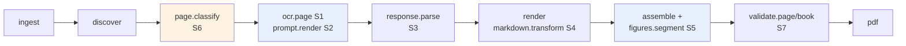
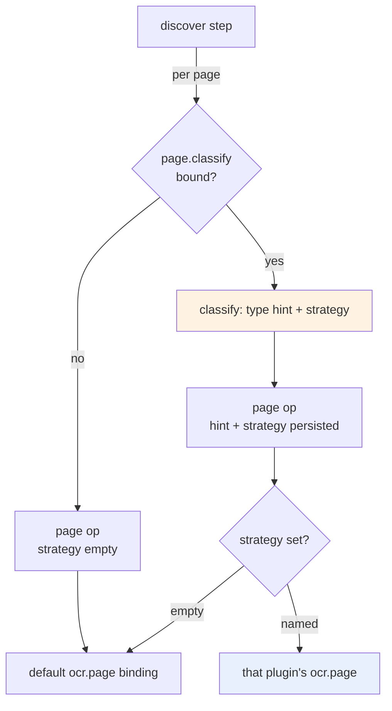

# Book OCR Productization: Plugin Seams, Profile Policy, and the Road to v0.1.0

This note records one day of work (2026-07-03) that took the book-ocr repository from a one-book pipeline that did not compile on a clean machine to a released v0.1.0 with a plugin architecture, profile-driven book policy, a PDF onboarding path, and a CI/release pipeline that runs green. It is written as a technical analysis rather than a changelog: the emphasis is on why each change took the shape it did, which invariants were preserved and how that preservation was proven, and which engineering rules generalize beyond this repository. Two earlier notes cover the May 2026 sprint that built the underlying system: [[ARTICLE - Structured Book OCR - Target Page Contracts Workflow Runtime and Production Hardening]] and [[ARTICLE - Book OCR Project Report - Structured Workflow Runtime and Manual PDF Repair]].

> [!summary]
> - book-ocr's architecture survived productization unchanged; the work was packaging, a configuration seam, and operational polish. The two May invariants — one target page image per model call, model returns structured JSON while Go renders deterministically — were preserved byte-for-byte through every refactor, and that preservation was proven with golden files rather than asserted.
> - Recompile-free OCR experimentation now works through seven NDJSON-stdio plugin seams that reuse devctl's protocol and host runtime verbatim. The governing rule: plugins replace strategies, never invariants.
> - Book policy (prompt lexicon, code-fence language, figure-suppression cues, plugin bindings) compiles from a YAML profile and is stamped into each workflow op's persisted input, so resumes and targeted reruns replay the original policy without re-resolving anything.
> - v0.1.0 shipped after converting the release pipeline from GoReleaser Pro (which required a missing license key) to a single-runner OSS build. The blocking dependency problem turned out to be already solved — the runtime had been published for weeks; nobody had checked.

## Why this note exists

The May sprint ended with a working system and an accurate README, but "working" meant working on one machine, for one book, driven by a developer who knew every flag. The July session answers a different question: what separates that state from a product, and how much of the gap is architectural versus mechanical? The answer — none of it was architectural — is the most transferable finding here, because it was established by evidence before any code changed, and because the method for establishing it (line-anchored findings, decision records, experiments in a ticket workspace) is reusable for any prototype-to-product assessment.

## The starting state, measured

The assessment began with three experiments rather than with reading. First, `go build ./...` on the repository as it stood. It failed: `go.mod` line 125 declared `replace github.com/go-go-golems/scraper => ../scraper`, a sibling path that existed only on the original development machine. Three of six internal packages could not compile. Second, the same build with module resolution corrected through a `go.work` override: everything compiled and all tests passed. Third, a three-page dry run of the full structured workflow with figure embedding and PDF rendering: every documented artifact appeared, and the validation report showed zero warnings.

These three results defined the problem precisely. The engine room was healthy; the packaging was broken. The rest of the assessment produced nine findings (F1 through F9 in the ticket's design document), of which four mattered most:

| Finding | Statement | Evidence anchor |
|---|---|---|
| F1 | The repository does not build from a clean clone | `go.mod:125` replace directive |
| F2 | Book policy lives in three independent code locations | `prompts.go:19-20`, `bookprofile.Report794()`, `ocrquality` defaults |
| F3 | The renderer assumes Common Lisp and Report-794 vocabulary | fence language at `renderer.go:121`, cue lists containing "ppscalc" |
| F4 | Page filenames are constructed as `page_%03d.png` in code that should look files up | `ocrquality/figures.go`, `vlmseparation/runner.go` |

The remaining findings covered the raw-SQL rerun operator (F5), the developer-grade CLI with live inference disabled by default (F6), byte-threshold validation (F7), the missing ingestion path (F8), and the absent release story (F9). None of the nine touched the workflow graph, the artifact model, or the OCR contract. The productization plan could therefore commit to a strong constraint: the two May invariants would survive every change, and the proof obligation for that survival would be explicit.

## The design phase: three documents before any code

Three docmgr tickets structured the work. The first (`BOOK-OCR-PRODUCT-001`) holds the productization analysis: a four-phase plan (buildable → profile-driven → onboarding → operational maturity) with decision records for the contested choices. The most consequential decision was product shape: a CLI-first product whose success criterion reads "a stranger with a directory of page scans and an API key produces a validated book PDF without editing Go code." A hosted service was explicitly rejected for this round because the system's strengths — durable local runs, complete artifact audit trails, targeted rerun — require no server, while a service adds tenancy, key custody, and billing problems orthogonal to every finding.

The second document designed the plugin architecture. The requirement, stated by the repository owner, was to experiment with different OCR methods for different kinds of books without recompiling. The design identified eight candidate seams (S1 through S8) by walking the pipeline and asking, at each stage, what an experimenter would want to replace:



Three seams were ranked highest. `ocr.page` replaces the entire page-OCR strategy: the plugin receives a page image path and returns the same `structured-ocr/v1` JSON the model returns today, so multi-pass strategies, classical-OCR-plus-LLM-cleanup hybrids, and ensembles become external scripts. `figures.segment` replaces the pixel-heuristic figure cropper, which matters because computer-vision iteration belongs in Python's ecosystem, and a Go recompile loop is the wrong medium for tuning contour detection. `prompt.render` makes per-book prompt phrasing an editable script rather than a Go constant.

Equally important is what received no seam. The workflow graph, the numbered per-page artifact sequence, and the assembler are the product's reliability guarantees; a plugin that could redefine them would turn every experiment into a potential audit-trail regression. The design states this as a rule — plugins replace strategies, never invariants — and the implementation enforces it structurally: the host keeps the single-image check, the schema validation and repair, the page-number gate, all artifact writes, and the retry classification regardless of what a plugin returns.

The transport decision required no invention. devctl, another repository in the same ecosystem, ships an NDJSON-over-stdio plugin protocol (version 2: a handshake frame advertising capabilities, request/response frames correlated by id, event frames for progress, a fixed error-code vocabulary). Its `pkg/protocol` and `pkg/runtime` packages are devctl-agnostic by construction — op names are opaque strings, and the host runtime knows nothing about devctl's own operations — so book-ocr imports them directly and writes only its own op schemas. A working prototype (a stdlib-only Go host driving a Python plugin against a real 480 KB page image) retired the transport risk before the design was committed.

The third ticket (`WORKFLOW-RUNTIME-HARDENING-001`) parked the changes that belong in the workflow runtime's own repository: a first-class step-requeue API to replace book-ocr's raw SQL rerun, lease heartbeats to prevent duplicate execution of slow steps, cooperative cancellation so canceling a run actually interrupts in-flight model calls, and an optional extraction of the runtime into its own module. These are documented with API sketches and test plans but not implemented here, because the runtime code is a separate repository consumed at a published version.

## Implementation

### The dependency that was already solved

F1's planned fix was a negotiation: ask the runtime's owner to tag a release, or extract the packages. The actual fix took five minutes, because `go list -m -versions` showed the scraper module had been published — four tags, v0.0.1 through v0.0.4 — and the local checkout sat exactly at v0.0.4. The replace directive had been hiding a solved problem since the externalization sprint; nobody had checked whether the sibling-checkout arrangement was still necessary. Dropping the replace and requiring v0.0.4 was API-neutral by construction.

One mechanical detail is worth recording: `go get module@latest` fails while a stale `v0.0.0` requirement is present, because module-graph resolution runs before the update and cannot resolve the phantom version. The working sequence is `go mod edit -require=module@v0.0.4` followed by `go mod tidy`.

The swap changed the risk model in a way that mattered later. While book-ocr built against the sibling working tree, any schema change in the runtime was visible immediately in the developer's editor. Against published versions, a schema change arrives silently inside a version bump. The rerun operator, which issues raw SQL against the engine's private tables, therefore gained a guard the same day: it reads the engine database's `schema_migrations` table and refuses to mutate anything if the applied migrations differ from the two it was written against. The guard was verified in both directions — a doctored migration row produces a refusal that names both migration lists; an unmodified work directory requeues and reassembles normally.

### Golden files before refactoring

Phase 2 required moving every book-specific string out of the prompt builder and the renderer. Prompt phrasing changes model behavior, and renderer changes alter the deterministic half of the pipeline, so the refactor needed a proof of non-change, not a review of plausibility. The proof took the form of golden files created *before* the refactor: twelve fixture pages covering every block type and heuristic (heading level clamping, 88-column wrapping, nested and bare-string lists, headered and ragged tables, code fencing, figure resolution versus suppression, the boxed-items fallback, footnotes, footers, blank pages, diagram text), plus one golden pinning the exact system-and-user prompt bytes for the Report-794 policy.

The discipline paid for itself twice. First, the prompt refactor — extracting the preserve-terms line, the code-language note, and the worked example into a `PromptSpec` structure whose default reproduces the original text — passed the byte-identity check on its first run; the only delicate point was reproducing the original's Oxford-comma term list from a slice. Second, the goldens pinned a behavior nobody had documented: the tolerant block decoder trims whitespace from `diagram_text` lines. A refactor that "fixed" that silently would now fail a test instead of shipping a diff nobody reviewed.

### The plugin host: adapters at existing interfaces

The plugin implementation is a thin package (`internal/plugin`) with three responsibilities: process management, op schemas, and adapters. Process management is delegated entirely to the imported devctl runtime — spawn with a process group, validate the handshake within a timeout, route responses to callers by request id under a write mutex, kill the process tree on shutdown. The manager adds seam binding on top: each configured plugin declares which seams it claims, the manager fail-fast-verifies every claim against the plugin's handshake capabilities at startup, and resolution is first-wins per seam. A plugin that claims `ocr.page` but does not advertise it stops the run before any model call, because silently falling back to a different strategy mid-book is worse than refusing to start.

The adapters implement existing Go interfaces, which is why the workflow package needed almost no changes:

```text
plugin.StructuredOCRClient   implements  ocrpipeline.StructuredOCRClient   (S1)
plugin.PromptRenderer        implements  ocrpipeline.PromptRenderer        (S2, new interface)
plugin.FigureSegmenter       implements  ocrquality.FigureSegmenter        (S5, extracted from the
                                                                            ink-band heuristic)
plugin.ResponseParser        implements  ocrpipeline.ResponseParser        (S3, new interface)
plugin.PageValidator/Book…   implements  ocrpipeline.{Page,Book}Validator  (S7, new interfaces)
plugin.PageClassifier        implements  ocrpipeline.PageClassifier        (S6, new interface)
```

Two host-side decisions preserve the audit trail on the plugin path. The per-page turn artifacts, which normally record the model conversation, instead record what the host handed the plugin: a system block naming the delegated plugin, the request payload, and the single target-page image — which keeps the exactly-one-image invariant mechanically checkable. And images travel by path rather than by base64 payload, because plugins are local processes that can open the file directly, and a 480 KB image inside a JSON frame buys nothing.

Prompt experiments get one additional protection. When a `prompt.render` plugin supplies the prompts, the host appends a non-negotiable contract section — the JSON-only instruction, the required root fields, and the target page identity — to whatever the plugin returned. A prompt experiment can change everything about phrasing; it cannot accidentally remove the instruction the parser and the page-number gate depend on.

### Profile policy stamped into persisted inputs

The configuration seam works by compilation and stamping rather than by threading live objects. A book profile is a YAML file; `PolicyFromProfile` compiles it into a `PromptSpec` and a `RenderOptions` value; the workflow's discover step performs this compilation once and writes the compiled policy into every page op's persisted input JSON. The consequence is the reason for the design: resume and targeted rerun read their inputs back from the engine database, so they replay the original policy without re-resolving the profile, and a profile edited between runs cannot silently change the behavior of a rerun that is supposed to reproduce an earlier result.

```text
structured-run --book-profile my-book.yaml
    discover step:
        profile   = Load(my-book.yaml)              # once per run
        prompt,
        render    = PolicyFromProfile(profile)
        for each page:
            emit op with input = { page, image_path,
                                   prompt: prompt,   # persisted in engine.db
                                   render: render,
                                   page_type_hint, strategy }   # from page.classify
```

The compilation rule is that the profile is authoritative: fields the profile leaves empty become generic behavior — plain code fences, no lexicon sentence, no figure-suppression cues — not the Report-794 defaults. The Report-794 values survive only in two places: as the in-code defaults for runs without a profile (a deliberate compatibility choice), and as `profiles/report-794.yaml`, which a test pins byte-equivalent to the in-code constructor so the two forms cannot drift. Equivalence tests close the loop in both directions: the compiled Report-794 profile reproduces the built-in prompt bytes and rendered Markdown exactly, and a generic profile produces output containing no trace of the original book's vocabulary.

The exit criterion for this phase was demonstrated rather than argued: a "second book" ran through the full workflow with the generic profile and a plugin OCR strategy, producing plain-fenced output, with zero Go changes.

### Onboarding and the page-naming defect

The onboarding path is three commands. `ingest` rasterizes a PDF through poppler's `pdftoppm`, renames the output to the pipeline's `page_NNNN.png` convention (four digits, because books beyond 999 pages exist), and writes a manifest recording the source hash, resolution, and page count. `init` composes ingest with page discovery and emits a drafted profile — glob, number regex, and expected page count filled in — followed by a review checklist and the exact next command to run. `report` aggregates the run's projection and turn store into page-status counts, warning codes, and the number of persisted model calls.

Ingest exposed finding F4 as a live defect rather than a theoretical one. The figure extractor constructed its source-image path as `fmt.Sprintf("page_%03d.png", pageNumber)`; ingest writes `page_0001.png`; the extraction would therefore fail on every ingested book the moment figure embedding was enabled. The fix inverted the direction of the computation: instead of constructing a filename from a page number, the extractor now indexes the image directory by globbing and parsing the final digit run of each filename — the same inference the discovery step has always used — and looks the page up. The marker-splitting regex, which accepted exactly three digits, now accepts any width. The regression test encodes the exact failing case: a directory containing `page_0001.png`, a markdown page marker, and a figure to extract.

The general rule: when one subsystem writes names and another reads them, the reader must resolve, not reconstruct. Reconstruction embeds formatting assumptions that the writer is free to change.

### Release engineering: the pipeline that never ran

The release configuration had been treated as future work on the assumption that it needed repair. It did not — the goreleaser file already pointed at the right binary; what had blocked releases was F1 itself, since a repository that cannot build on a clean machine cannot release from CI. After the tag was pushed, the actual failure surfaced in 32 seconds: the workflow used GoReleaser Pro's split/merge mode (separate Linux and macOS runners whose partial builds are merged in a third job), which requires a license key the repository does not have.

The conversion to a shippable pipeline was subtractive. One Ubuntu job running OSS goreleaser builds linux amd64 and arm64 (CGO with a cross-compiler, required by the SQLite driver), archives, deb and rpm packages, and checksums. The darwin build is disabled with an explanatory comment, because CGO cross-compilation to darwin needs either a macOS runner or the Pro pipeline; macOS users have `go install`. Signing, the Homebrew tap, and the package publisher — each requiring a secret the repository lacks — were removed rather than left as latent failures. v0.1.0 published cleanly in three and a half minutes with six assets.

Two observations generalize. A release pipeline inherited from a template encodes the template owner's licensing and secrets; the first tag push is an integration test of assumptions nobody has listed. And the diagnosis discipline from the start of the day applied here too: the config was presumed broken and was not; the dependency was presumed unpublished and was not. Checking the actual failure before designing the fix saved a repair in both cases.

### The second plugin round: parsing, validation, routing

The P2 seams complete the experimentation surface, and each encodes a policy about how plugins may extend the system.

`response.parse` may take over converting raw model text into structured JSON — the layer where every model generation exhibits its own failure signatures — but a plugin that does not recognize a format answers with the error code `E_DECLINED`, and the built-in layered parser (strict JSON, fence stripping, sanitization, regex repair) takes over. Deferral is a first-class protocol outcome, not an error, so a parser plugin handles exactly the formats it understands and nothing else degrades.

`validate.page` and `validate.book` are additive by construction: plugin warnings are tagged `[plugin/<id>]` and appended to the built-in validation output, in the per-page validation artifact and in the run's validation report respectively. A validator can add book-type-specific acceptance rules; it cannot suppress the built-in checks.

`page.classify` is the routing seam. It runs once per discovered page, before fan-out, and returns two values: a page-type hint, forwarded to whichever OCR client handles the page, and a strategy, which names a specific `ocr.page` plugin binding. Both persist in the op's input, so a rerun routes identically without re-running the classifier. Strategy names are validated at classify time — routing a page to an unbound strategy fails the run immediately rather than at OCR time.



The verification run for this round exercised everything at once: a profile declaring two plugins (a main plugin bound to `ocr.page`, `page.classify`, and both validators; an alternate plugin bound only to `ocr.page`) processed a three-page range. Page 2 was routed by the classifier to the alternate strategy and its output appears between default-binding pages 1 and 3 in the assembled Markdown; the book validator's tagged warning appears in the validation report with the correct count.

The final P2 item closed a gap from the first round. Plugin call failures had fallen through to the host's string-matching error classifier. They now carry an explicit verdict: an error whose protocol details include `retryable`, or whose code is a timeout or cancellation, wraps into a type implementing a `RetryHinter` interface, and the classifier honors that verdict in both directions before any string matching runs. A plugin author can state whether a failure is worth the engine's three-attempt retry policy instead of hoping the error message contains the right substring.

## Verification as a running theme

Every claim in this session's commits is backed by an executed check, and the checks fall into five reusable categories.

| Category | Instances |
|---|---|
| Byte-identity goldens | 12 renderer fixtures; prompt bytes; `profiles/report-794.yaml` pinned to the in-code profile |
| Equivalence proofs | compiled Report-794 profile ≡ built-in defaults; generic profile contains no Report-794 behavior |
| Adversarial fixtures | plugin with contaminated stdout; plugin claiming unadvertised seams; plugin returning the wrong page number; unknown routing strategy |
| End-to-end demonstrations | second book with zero Go changes; PDF → init → dry run; classify-routing smoke; rerun after schema-guard both accept and refuse |
| External probes | the scraper operator web UI served a book-ocr work directory's engine database through `scraper api serve --engine-db`, confirming the shared engine schema is a real integration surface |

The adversarial fixtures deserve a comment. The devctl repository ships misbehaving test plugins (no handshake, never responds, noisy stdout) as part of its own suite, and the same approach was ported here: the cheapest time to discover how a host reacts to a broken plugin is in a test that ships with the host. The wrong-page-number plugin exists because the first version of that test was vacuous — the test plugin echoed the requested page, so the gate it claimed to test could never fire. A test that cannot fail is a statement of hope; the fix was to teach the plugin to lie on demand.

## What the system now guarantees

- Primary OCR sees exactly one target page image per call, whether the call is served by a model through Geppetto or by a plugin; the invariant is checked on the recorded input turn in both paths.
- The model or plugin returns structured JSON; Go renders Markdown deterministically; twelve golden files pin the rendering.
- Every page produces the numbered artifact sequence (turn input, turn final, raw response, structured JSON, rendered Markdown, validation), regardless of which strategy produced it, with provenance identifying that strategy.
- Book policy is data. A run's policy is persisted with the run and replayed on resume and rerun.
- A clean clone builds, tests, and releases: CI runs build, vet, and tests; `v0.1.0` is a published GitHub release with linux amd64/arm64 archives and packages.
- Direct SQL against the engine database refuses to run against schema versions it has not been reviewed for.

## Open work

The plugin track has a third round (a post-render Markdown transform, an ingest preprocessing hook, and an author-facing cookbook). Phase 4 of the productization plan — a review web UI with a page grid, source-versus-render comparison, and a rerun button — remains the largest missing user-facing piece; the probe of scraper's operator UI showed that workflow-state inspection already exists, but the OCR review experience does not. Three runtime changes wait in the hardening ticket, and two of them change category if the product ever meters usage: lease expiry during a slow model call causes duplicate execution (duplicate spend), and cancellation does not interrupt in-flight calls (spend after the user said stop). A separate analysis sketched a credits-based hosted MVP; its two prerequisite findings were that per-call token usage is persisted but not aggregated, and that per-run spend caps do not exist anywhere in the stack.

## Working rules

- Measure the starting state with experiments before reading or planning. The build failure, the healthy test suite, and the passing dry run defined the entire scope in under an hour.
- Check whether the blocking dependency problem is already solved. The runtime had been published for weeks; the replace directive outlived its reason by a full sprint.
- Pin bytes before refactoring policy out of code. Golden files created before a refactor convert "we believe nothing changed" into a failing test when something does.
- Plugins replace strategies, never invariants. Decide what gets no extension point with the same care as what does.
- Persist compiled policy with the work items it governs. Reruns must replay decisions, not re-derive them.
- When one subsystem writes names and another reads them, the reader resolves; it does not reconstruct.
- Guard direct SQL against private schemas with an explicit version pin, and delete the SQL when a first-class API arrives.
- Give adversarial fixtures the ability to misbehave on demand; a test that cannot fail verifies nothing.

## Related notes

- [[ARTICLE - Structured Book OCR - Target Page Contracts Workflow Runtime and Production Hardening]]
- [[ARTICLE - Book OCR Project Report - Structured Workflow Runtime and Manual PDF Repair]]
- Ticket workspaces: `ttmp/2026/07/03/BOOK-OCR-PRODUCT-001--…` (productization analysis, plugin-seams design, investigation diary with 14 steps) and `ttmp/2026/07/03/WORKFLOW-RUNTIME-HARDENING-001--…` (runtime hardening guide) in the repository.
- Release: https://github.com/wesen/2026-05-20--book-ocr/releases/tag/v0.1.0
