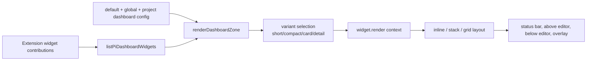

# Extensions and Dashboard - Overhaul Deep Dive

This report documents the current shape of the local Pi extensions repository after the shared extension framework and dashboard overhaul. The project is no longer just a directory of slash commands. It has become a small product platform for Pi: extensions declare metadata, actions, documentation, settings, widgets, palette entries, and legacy commands through a shared registry, while `/px`, the command palette, reusable modals, and dashboard zones turn those declarations into a coherent user experience.

> [!summary]
> The overhaul has three important identities:
> 1. **a contribution-based extension framework** — `registerPiExtension()` is the source of truth for discovery, actions, docs, settings, widgets, and palette entries
> 2. **a keyboard-first operations surface** — `/px`, action picker, docs viewer, settings view, command palette, and prompto picker provide modal TUI workflows instead of isolated commands
> 3. **a dashboard/status layer** — extensions can publish small widgets to status bar, editor-adjacent areas, and an overlay grid, making extension state visible without running commands

## Why this project exists

The repository exists because local Pi extensions grew past the point where slash commands alone were a sufficient interface. A slash command is good when the user already knows the command name and its arguments. It is poor at discovery, poor at showing related actions, and poor at carrying documentation or configuration. As the extension set expanded — compaction tools, docmgr, pinned skills, environment injection, response capture, prompt templating, session summary enforcement, image and web tools — the problem became product coherence rather than individual command implementation.

The design answer is a shared contribution model. Every extension still owns its behavior, but it now contributes structured declarations to a central registry. That registry is consumed by shared UI: the `/px` launcher can search and run extensions, the action picker can expose all verbs for one extension, the doc viewer can show registered docs, the settings view can render schema-driven configuration, and dashboard zones can display extension state continuously. The important shift is from "remember the command" to "open the extension surface and discover what is possible."

The dashboard part exists for a related reason. Some extension state is not an action; it is ambient context. Context remaining before compaction, pinned skill count, docmgr ticket status, and session-summary enforcement are better as status or dashboard widgets than as commands that the user repeatedly invokes. The shared dashboard system gives extensions a cheap way to publish those signals while letting project/global config decide where and whether to show them.

## Current project status

The repository is active and source-controlled at:

```text
/home/manuel/code/wesen/2026-04-21--pi-extensions
```

Recent work on `main` completed the core `EXTENSION-UX` implementation pass and its documentation. The most relevant commits since the prompto/framework baseline are:

| Commit | Area | What changed |
|---|---|---|
| `02ef4e5` | Prompto picker/templates | Improved the prompt template picker and added workflow templates under `.pi/prompts/` |
| `f564fe8` | Docs | Added the shared extension UX implementation guide |
| `df23e9e` | Launcher | Preserved `/px` selection/search state when returning from nested overlays and added wraparound list navigation |
| `6f542ae` | Launcher search | Replaced broad haystack matching with chunked fuzzy extension search |
| `c0e1461` | Launcher/docs layout | Added scrollable details pane and dynamic modal/doc-viewer height |
| `606f2c4` | Prompto shortcut | Added prompto paste insertion via `Ctrl+Alt+P`, action, and palette item |
| `2cbf930` | Prompto docs | Documented paste-template workflow |
| `fac8c11` | Diary/validation | Recorded final validation in the `EXTENSION-UX` diary |

The main implementation has passed the non-interactive load check (`timeout 20 pi --list-models`) and docmgr ticket validation. Manual interactive validation is still important for the exact keyboard/TUI paths, especially `/px` filtering, details scrolling via modified arrows or fallback keys, and prompto insertion via `Ctrl+Alt+P`.

There is one live caveat worth preserving: a user report says searching `/px` for `compaction` did not show the compaction extensions, even though the registrations include `tags: ["compaction", ...]` and direct `fuzzyMatch("compaction", "Compaction Meter")` checks succeed. That means the bug is likely in the live TUI path, extension reload state, search-mode entry, or a subtle rendering/filtering edge. It should be treated as the next diagnostic task, not as a reason to discard the chunked fuzzy-search design.

## Project shape

The repository has a deliberate monorepo shape:

```text
extensions/
  _shared/                    # shared registry, launcher/dashboard/UI framework
  launcher/                   # /px entry point into the shared framework
  prompto/                    # prompt template picker/forms/plugins/insertion workflows
  compaction-meter/           # context remaining dashboard/status widget
  compaction-title/           # compaction hook and session title generation
  pinned-skills/              # pinned skill prompt injection/status
  docmgr/                     # docmgr browsing/status inside Pi
  agent-env/, direnv-bash/    # environment injection/shell ergonomics
  response-capture/           # assistant-response capture into docmgr
  session-summary/            # mandatory <summary> enforcement/widget
  session-tagger/             # tag moments for later analysis/forking
  ...                         # tools, demos, viewers, and experiments

docs/
  pi-shared-extension-framework-guide.md
  pi-tui-ui-authoring-guide.md
  pi-testing-guide.md
  pi-compaction-textbook.md

ttmp/
  2026/07/03/EXTENSION-UX--improve-shared-extension-launcher-ux/
  2026/07/03/PROMPTO-PI-EXT--prompt-form-expansion-plugin-for-pi-prompto-inspired/
```

The top-level `README.md` now frames the repo as "a source-controlled collection of local Pi extensions, plus the shared framework and documentation we use to build them consistently." It also states the governing convention: every extension in this repo should call `registerPiExtension()` from `extensions/_shared/registry.ts`, and shared UI/framework code belongs under `extensions/_shared/`.

This matters because extension implementation is now a product discipline. A new extension is not complete just because it registers a command. It should also decide whether it needs actions, docs, settings, widgets, palette entries, and user-facing README material. Non-trivial work should have a docmgr ticket, task list, changelog, diary, and validation notes.

## Architecture

### One registry, many consumers

The core architecture is a fan-out from one registry to multiple UI surfaces:

```mermaid
flowchart TD
    EXT[Extension implementation] --> REG[registerPiExtension]
    REG --> STORE[Shared registry<br/>extensions/_shared/registry.ts]
    STORE --> PX[/px ExtensionLauncher]
    STORE --> ACT[ActionPicker]
    STORE --> DOC[DocViewer]
    STORE --> SET[GenericSettingsView]
    STORE --> DASH[Dashboard zones]
    STORE --> PAL[Command palette]
    EXT --> LEGACY[Direct slash command / shortcut]

    PX --> ACT
    PX --> DOC
    PX --> SET
    PX --> DASH
    PX --> PAL

    style REG fill:#d5e8f9
    style STORE fill:#d5f9d5
    style DASH fill:#fff2cc
```

The registry contract is explicit in `extensions/_shared/registry.ts`. `PiExtensionRegistration` includes `id`, `name`, `description`, `commands`, `tags`, `run`, `actions`, `docs`, `settings`, `widgets`, and `palette` (`registry.ts:189-202`). `registerPiExtension()` stores a registration in a process-global map (`registry.ts:208-220`), while `listPiExtensions()` returns a name-sorted array for discovery (`registry.ts:226-228`).

This contract is the main reason the framework scales. A feature like `/px` does not need to know prompto's internals or compaction-meter's internals. It only needs the declared metadata and handlers. Conversely, an extension author does not need to rebuild a picker, documentation browser, or settings editor each time; they contribute structured data to the registry.

### The `/px` launcher as orchestration layer

The launcher extension lives in `extensions/launcher/index.ts`. It registers itself as an extension named "Extension Launcher" with command `px`, actions for opening the launcher and dashboard, docs, and dashboard-layout settings (`launcher/index.ts:23-79`). It also registers the actual slash command:

```ts
pi.registerCommand("px", {
  description: "Open the shared Pi extension launcher",
  handler: async (args, ctx) => {
    if (args.trim() === "dashboard") {
      await openDashboard(ctx);
      return;
    }
    await openLauncher(ctx);
  },
});
```

The important part is that `/px` is no longer only a list. It is an orchestrator. `openLauncher()` mounts an `ExtensionLauncher` overlay, then `handleLauncherResult()` dispatches into one of several nested workflows: dashboard, palette, docs, settings, actions, or default action (`launcher/index.ts:100-135`). After docs, settings, and actions, it reopens the launcher with the saved state (`launcher/index.ts:126-135`), which is what makes the new UX feel like "back" instead of "start over."

The modal state model is explicit in `extensions/_shared/ui/extension-launcher.ts`. `ExtensionLauncherState` stores `query`, `searchActive`, `cursor`, `listScroll`, and `detailsScroll` (`extension-launcher.ts:4-10`). Result variants carry this state when leaving the overlay for docs/actions/settings/dashboard/palette (`extension-launcher.ts:12-19`). The component constructor accepts `initialState`, restoring those fields when the launcher is reopened (`extension-launcher.ts:62-72`).

In practical terms, this changed the user experience from:

```text
/px -> move to Prompto -> ? docs -> Esc -> /px opens at top again
```

to:

```text
/px -> search prompto -> ? docs -> Esc -> /px returns to prompto with same query/cursor
```

### Dashboard zones and layouts

The dashboard system is split into config, manager, and layout modules.

`extensions/_shared/dashboard/config.ts` defines the project/global JSON shape. A dashboard config has zones keyed by `PiDashboardZone`; each zone can be enabled/disabled, choose a layout (`inline`, `stack`, `grid`, `columns`), and list widget layout items with visibility, order, variant, and width/height hints (`config.ts:6-26`). Config is merged from defaults, `~/.pi/agent/dashboard.json`, and project `.pi/dashboard.json` (`config.ts:38-48`, `config.ts:57-74`). This gives a clean precedence model: repo defaults can exist, personal preferences can override globally, and project-local settings can specialize one workspace.

`extensions/_shared/dashboard/manager.ts` is the runtime integrator. `installDashboard()` installs status-bar and editor-adjacent widgets when a UI exists (`manager.ts:11-16`). `clearDashboard()` removes them at shutdown (`manager.ts:18-23`). `renderDashboardZone()` reads config, filters registered widgets, selects variants, calls each widget's `render()` handler, and returns rendered widget records (`manager.ts:71-94`). `renderDashboardOverlayLines()` renders the overlay grid or a useful empty-state message (`manager.ts:96-101`).

`extensions/_shared/dashboard/layout.ts` handles the final line formatting. Inline dashboards join small widget chunks with ` · ` (`layout.ts:20-32`), stack dashboards concatenate widget lines with blank separators (`layout.ts:35-42`), and grid dashboards render one or two columns of framed cards depending on terminal width (`layout.ts:44-59`). All paths truncate to width, which is important in a terminal UI where overflowing ANSI-decorated strings can corrupt layout.

The dashboard mental model is:



This is why compaction-meter can contribute a status bar line without knowing where the user will display it. Its widget declares `defaultZone: "statusBar"`, `defaultVariant: "short"`, and `priority: 10`, then returns a formatted status line (`compaction-meter/index.ts:63-72`). The manager decides whether it appears in the status bar, an editor zone, or the overlay based on dashboard config.

## Implementation details

### The contribution object is the extension's public product surface

A modern extension starts with a registration object. For example, prompto registers metadata, command compatibility, docs, actions, and palette entries:

```ts
registerPiExtension({
  id: "prompto",
  name: "Prompto",
  description: "Prompt template expansion with modal forms...",
  commands: ["prompto"],
  tags: ["prompts", "templates", "forms"],
  run: (ctx) => runPrompto(pi, store, "", ctx),
  docs: [...],
  actions: [...],
  palette: [...],
});
```

That declaration is richer than a slash command because it answers multiple questions at once:

- What is this extension called?
- How should it be searched?
- What is the default thing it does?
- What other actions does it support?
- What docs can the launcher open?
- Does it have palette items?
- Does it have widgets or settings?
- Which legacy slash commands should still be visible?

The registration is therefore an internal app-store listing plus a capability descriptor. It is not just TypeScript metadata; it is the input to all shared UX.

The same pattern is visible in compaction-meter. It registers a default run handler, actions, docs, palette entries, commands, tags, and a status widget (`compaction-meter/index.ts:40-74`). Compaction-title is lighter today: it registers metadata, commands, tags, and a palette toggle (`compaction-title/index.ts:120-140`). Those two examples show the intended gradient: extensions can contribute only what they need, but all contributions use the same vocabulary.

### Launcher filtering: chunked fuzzy search instead of one giant haystack

The current launcher search pipeline is in `extension-launcher.ts`. The component maintains `query` and `searchActive` (`extension-launcher.ts:54-55`). Pressing `/` enters search mode (`extension-launcher.ts:88-92`). While search is active, printable characters append to the query and reset cursor/list/details scroll (`extension-launcher.ts:94-123`).

Filtering is performed by `filtered()`:

```ts
private filtered(): ScoredExtension[] {
  const query = this.query.trim().toLowerCase();
  return this.extensions
    .map((extension) => ({ extension, score: scoreExtension(extension, query) }))
    .filter((item) => item.score >= 0);
}
```

`scoreExtension()` tokenizes the query on whitespace and `/`, then requires every token to fuzzy-match at least one search chunk (`extension-launcher.ts:457-472`). The chunks are not one concatenated blob. They are meaningful fields: id, name, description, commands, tags, action metadata, doc metadata, and palette metadata (`extension-launcher.ts:474-485`). This matters because fuzzy scoring tends to become noisy if every field is joined into one long string. Chunking preserves the idea that `compaction` matching a tag is a strong match, while still allowing fuzzy abbreviations across names, command names, and docs.

In pseudocode:

```ts
function scoreExtension(extension, query) {
  tokens = split(query, whitespaceOrSlash)
  if no tokens: return 0

  chunks = [
    extension.id,
    extension.name,
    extension.description,
    ...extension.commands,
    ...extension.tags,
    ...action fields,
    ...doc fields,
    ...palette fields,
  ]

  total = 0
  for token in tokens:
    best = best fuzzyMatch(token, chunk) across chunks
    if no best: return -1
    total += best.score
  return total
}
```

This is a good design for extension search because the query language stays simple: `prompto paste`, `compact status`, `doc ticket`, and `session summary` are all just token sets that must each find a home in the extension's declaration.

The live `compaction` report suggests an implementation/operational edge rather than a conceptual failure. Both compaction registrations declare searchable data: `compaction-meter` has id `compaction-meter`, name `Compaction Meter`, command `compact-meter`, and tag `compaction` (`compaction-meter/index.ts:40-46`); `compaction-title` has id `compaction-title`, name `Compaction Title`, commands including `compaction-title`, and tag `compaction` (`compaction-title/index.ts:120-125`). A robust follow-up would add a tiny non-interactive debug/test harness for `scoreExtension()` and consider including `primaryGroup(extension)` in search chunks as an additional safety net.

### Grouping is a readability layer, not the source of truth

The launcher groups visible extensions for scanning. `primaryGroup()` looks at id, tags, and commands, then maps tokens to labels such as `Compaction`, `Skills`, `Docs`, `Environment`, `Session`, `Demos`, `Launcher`, and `Other` (`extension-launcher.ts:440-450`). `groupExtensions()` groups and sorts by a fixed `GROUP_ORDER` (`extension-launcher.ts:427-438`).

This grouping is a UI aid, not a registry concept. The source of truth remains the extension registration. That is a good separation: the registry does not need to know about today's visual categories, and the launcher can evolve category heuristics without changing every extension. The open search issue is a reminder that if users mentally search by group labels, group labels should probably be searchable too.

### State restoration makes nested overlays feel modal instead of destructive

Before the state snapshot work, opening docs/actions/settings destroyed launcher state because the nested overlay resolved and `openLauncher(ctx)` created a fresh component. The new model gives each leaving action a state snapshot. The component's `snapshot()` method returns query, search-active flag, cursor, list scroll, and details scroll (`extension-launcher.ts:252-260`). The result union carries that state (`extension-launcher.ts:12-19`). The launcher command flow passes it back into the next `openLauncher(ctx, initialState)` (`launcher/index.ts:100-119`, `launcher/index.ts:126-135`).

The important design lesson is that nested terminal overlays need explicit continuity. Unlike a web app with a persistent route and component tree, Pi modals are often promise-returning interactions. When one resolves, its component instance is gone. If the user should experience "back" semantics, the parent workflow has to serialize enough state before leaving.

The implementation is small but high leverage:

```ts
// Component result
{ kind: "docs", extension, state: this.snapshot() }

// Orchestrator
if (result.kind === "docs") {
  await openDocs(ctx, result.extension)
  return openLauncher(ctx, result.state)
}

// New component instance
new ExtensionLauncher({ extensions, initialState })
```

This pattern should be reused for any future multi-step extension surface where nested overlays are common.

### Navigation and scroll behavior are now separate concerns

The launcher has two different scroll problems: the left list can overflow, and the right details pane can overflow. They should not share state. The component now keeps `scroll` for list rows and `detailsScroll` for right-pane content (`extension-launcher.ts:56-58`). List navigation uses wraparound: `move(delta)` computes `(cursor + delta + count) % count` and resets details scroll (`extension-launcher.ts:240-244`). That fixed the requested behavior where pressing `Up` at the top should wrap to the bottom.

Right-pane scrolling has its own input bindings. The launcher accepts `Shift+Up`, `Alt+Up`, or `[` to scroll details up, and `Shift+Down`, `Alt+Down`, or `]` to scroll down (`extension-launcher.ts:154-160`). It also accepts shifted/alt page up/down for larger jumps (`extension-launcher.ts:162-168`). The fallback bracket keys are important because modified arrow keys vary across terminals and multiplexers.

`renderDetails()` builds all detail lines, clamps `detailsScroll`, slices the visible range, and appends an overflow hint when content is longer than the pane (`extension-launcher.ts:354-365`). Details content itself is generated from registered actions, docs, settings, widgets, commands, tags, and id (`extension-launcher.ts:368-411`). This is why the right pane is now useful as a compact extension manifest rather than just a short description.

### Dynamic height works around the TUI component contract

Pi TUI components render with `render(width): string[]`; they do not receive an explicit height. The extension framework therefore uses a pragmatic terminal-row helper:

```ts
function terminalRows(fallback = 30): number {
  return typeof process.stdout.rows === "number" && process.stdout.rows > 0
    ? process.stdout.rows
    : fallback;
}
```

The launcher computes body rows with `launcherBodyRows()`, bounded between 16 and 30 and based on 90% of terminal rows minus chrome (`extension-launcher.ts:501-504`). The docs viewer uses the same idea with `docBodyRows()`, bounded between 18 and 40 (`doc-viewer.ts:63-70`).

This is intentionally not a perfect layout engine. It is a local improvement that respects the current component API. The value is practical: tall terminals now show more rows, docs are less cramped, and the launcher details pane has enough room to list commands, docs, widgets, and tags. The risk is tiny/narrow terminal behavior, which should remain part of manual smoke testing.

### Shared docs, settings, and action surfaces reduce bespoke UI

The action picker, docs viewer, and settings view are reusable product pieces.

The action picker (`extensions/_shared/ui/action-picker.ts`) renders actions for one extension with a search field, left list, and right details panel (`action-picker.ts:44-63`). It filters by id/title/description/tags (`action-picker.ts:67-71`) and returns the selected `PiExtensionAction`. This makes actions feel like a consistent extension-level command menu rather than bespoke command arguments.

The docs viewer (`extensions/_shared/ui/doc-viewer.ts`) renders Markdown-ish text in a framed scrollable overlay. It supports `Esc`, `Backspace`, or `Ctrl+C` to go back, arrows and page keys to scroll, and a footer with range information when content overflows (`doc-viewer.ts:15-38`). It is deliberately simple: headings and bullets are styled, lines are wrapped, and the component stays fast.

The settings view (`extensions/_shared/ui/settings-view.ts`) renders a schema contribution as a `SettingsList`. It keeps draft values, invokes `onChange` as fields change, validates on `Ctrl+S`, calls `onApply`, and supports `onCancel` on escape (`settings-view.ts:19-109`). The schema supports booleans, strings, numbers, selects, multiselects, and paths (`registry.ts:58-64`). This is enough for many extension settings without making every extension author build their own form.

Together these components are the practical benefit of the registry. Once extension contributions are declarative, shared UI can do useful work.

### Prompto is the richest current extension consumer

Prompto is a good case study because it uses several framework surfaces at once. In `extensions/prompto/index.ts`, it registers:

- command compatibility: `commands: ["prompto"]`
- tags for search: `prompts`, `templates`, `forms`
- default run behavior
- docs: authoring and plugin protocol
- actions: expand, paste, reload
- palette entries: expand and paste
- a direct shortcut: `Ctrl+Alt+P`
- the legacy `/prompto` command with autocompletion

The recent UX change added a distinction between replacement and insertion. `RunPromptoOptions` now allows output modes `replace-editor`, `paste-editor`, or `send` (`prompto/run.ts:14-16`). The default behavior remains compatible: templates with `submit: auto` send directly, otherwise prompto replaces editor text for review (`prompto/run.ts:55-64`). The new paste path calls `ctx.ui.pasteToEditor(prompt)` and notifies the user (`prompto/run.ts:58-60`). This is exposed through the launcher action "Pick and paste a prompt template," the command-palette item "Prompto: paste a template," and `Ctrl+Alt+P` (`prompto/index.ts:45-49`, `prompto/index.ts:67-72`, `prompto/index.ts:77-82`).

That distinction is important. `/prompto` remains predictable for existing users; the new shortcut solves a different problem: inserting a generated prompt at the cursor when the user is not at the beginning of a slash command.

The prompto picker was also upgraded into a better modal. It fuzzy-filters by chunks including template name, group, title, description, source, kind, submit mode, and field metadata (`prompto/ui/picker.ts:245-280`). It supports arrow navigation, page navigation, home/end, backspace, `Ctrl+U`, and `Alt+1-9` quick opening of visible rows (`prompto/ui/picker.ts:40-97`, `prompto/ui/picker.ts:216-221`). Its UI now has a border, count header, compact rows, and footer details (`prompto/ui/picker.ts:99-190`).

Prompto therefore demonstrates the intended future: a specialized extension can still have its own internal UI, but it plugs into shared discovery, docs, actions, shortcuts, and palette semantics.

## Source and documentation evidence

The most important source files for understanding the overhaul are:

- `/home/manuel/code/wesen/2026-04-21--pi-extensions/extensions/_shared/registry.ts` — contribution types and global registry
- `/home/manuel/code/wesen/2026-04-21--pi-extensions/extensions/launcher/index.ts` — `/px` command flow and nested overlay orchestration
- `/home/manuel/code/wesen/2026-04-21--pi-extensions/extensions/_shared/ui/extension-launcher.ts` — launcher state, search, grouping, details pane, navigation, rendering
- `/home/manuel/code/wesen/2026-04-21--pi-extensions/extensions/_shared/dashboard/config.ts` — dashboard config paths, defaults, merge model
- `/home/manuel/code/wesen/2026-04-21--pi-extensions/extensions/_shared/dashboard/manager.ts` — dashboard install/refresh/render runtime
- `/home/manuel/code/wesen/2026-04-21--pi-extensions/extensions/_shared/dashboard/layout.ts` — inline/stack/grid line rendering
- `/home/manuel/code/wesen/2026-04-21--pi-extensions/extensions/_shared/ui/action-picker.ts` — reusable extension action picker
- `/home/manuel/code/wesen/2026-04-21--pi-extensions/extensions/_shared/ui/doc-viewer.ts` — scrollable docs overlay
- `/home/manuel/code/wesen/2026-04-21--pi-extensions/extensions/_shared/ui/settings-view.ts` — schema-driven settings UI
- `/home/manuel/code/wesen/2026-04-21--pi-extensions/extensions/prompto/index.ts` — prompto framework integration, actions, docs, palette, shortcut
- `/home/manuel/code/wesen/2026-04-21--pi-extensions/extensions/prompto/run.ts` — prompt expansion output path
- `/home/manuel/code/wesen/2026-04-21--pi-extensions/extensions/prompto/ui/picker.ts` — specialized fuzzy template picker
- `/home/manuel/code/wesen/2026-04-21--pi-extensions/extensions/compaction-meter/index.ts` — status widget and compaction-search evidence
- `/home/manuel/code/wesen/2026-04-21--pi-extensions/extensions/compaction-title/index.ts` — compaction extension registration and palette contribution

The most important written docs are:

- `/home/manuel/code/wesen/2026-04-21--pi-extensions/README.md` — repository overview, extension list, installation, testing, and conventions
- `/home/manuel/code/wesen/2026-04-21--pi-extensions/docs/pi-shared-extension-framework-guide.md` — how to author extensions against the shared framework
- `/home/manuel/code/wesen/2026-04-21--pi-extensions/docs/pi-tui-ui-authoring-guide.md` — component contract and TUI authoring rules
- `/home/manuel/code/wesen/2026-04-21--pi-extensions/docs/pi-testing-guide.md` — load checks and tmux smoke testing
- `/home/manuel/code/wesen/2026-04-21--pi-extensions/ttmp/2026/07/03/EXTENSION-UX--improve-shared-extension-launcher-ux/design-doc/01-shared-extension-ux-improvement-guide.md` — intern-ready guide for the UX improvement pass
- `/home/manuel/code/wesen/2026-04-21--pi-extensions/ttmp/2026/07/03/EXTENSION-UX--improve-shared-extension-launcher-ux/reference/01-diary.md` — chronological implementation diary
- `/home/manuel/code/wesen/2026-04-21--pi-extensions/ttmp/2026/07/03/PROMPTO-PI-EXT--prompt-form-expansion-plugin-for-pi-prompto-inspired/design-doc/01-prompto-inspired-prompt-form-expansion-extension-for-pi-analysis-design-and-implementation-guide.md` — prompto design lineage and implementation guide

## Important implementation diary findings

The `EXTENSION-UX` diary is useful because it records not only what changed, but why the implementation took its current form. The key findings are:

1. The reported launcher issues shared a root cause: state was local to short-lived modal components, and nested overlay flows recreated fresh launchers after closing docs/actions/settings.
2. The standalone docs viewer already supported scroll input, but its fixed row count made it too small on tall terminals.
3. The top-level launcher details pane had no independent scroll state, so long extension metadata could not be inspected without leaving the launcher.
4. Pi's extension API already had `pasteToEditor()` and `registerShortcut()`, so prompto insertion did not need a new editor API.
5. The TUI component contract does not pass height; `process.stdout.rows` was chosen as a pragmatic local solution rather than a broader API change.
6. `Shift+Arrow` reliability is terminal-dependent, so fallback keys (`[` and `]`) were documented and implemented for details scrolling.

The diary also records the validation style: run the non-interactive Pi load check, validate docmgr frontmatter, update tasks/changelog, and commit focused code and docs changes separately. That working loop is part of the repo's quality system, not just a one-off note.

## Current user-facing workflows

### Discover and run an extension

```text
/px
  -> type / to enter search
  -> type query such as prompto, compaction, docmgr, session
  -> Enter runs default action
  -> a opens action picker
  -> ? opens docs
  -> s opens settings when available
  -> p opens command palette
  -> d opens dashboard overlay
```

Expected behavior after the UX pass:

- up/down wraps around the list
- search filters down using fuzzy chunk matching
- docs/actions/settings return to the same query and selection
- the right details pane scrolls independently
- taller terminals show taller launcher/doc overlays

### Use prompto without replacing draft text

```text
Ctrl+Alt+P
  -> picker opens
  -> type to fuzzy-filter templates
  -> fill template form if needed
  -> expanded prompt is pasted at the current editor cursor
```

Equivalent routes:

- `/px` → Prompto → actions → "Pick and paste a prompt template"
- `/px` → command palette → "Prompto: paste a template"

Legacy-compatible routes remain:

- `/prompto` opens picker and replaces editor text for normal editor templates
- `/prompto <template-name>` expands a specific template
- `/prompto reload` rescans project/global template directories

### Inspect dashboard status

```text
/px dashboard
# or /px then d
```

The dashboard overlay renders visible widgets as cards. Status-bar and editor-adjacent zones are installed on session start and refreshed when dashboard settings change. Example contributing widgets include compaction-meter's context status and other extensions that publish lightweight state.

## Design strengths

The strongest part of the overhaul is the boundary between extension-owned behavior and shared user experience. Extensions remain plain TypeScript modules. They can still register commands, shortcuts, tools, and event hooks directly. But their product-facing declaration is structured, and therefore reusable UI can make them discoverable.

The second strength is incremental adoption. An extension can start with only `id`, `name`, `description`, `commands`, and `run`. Later it can add actions, docs, settings, widgets, and palette items without changing the framework. This is important for a local extension fleet: experiments should not need full product ceremony on day one, but mature tools should have a path to better UX.

The third strength is that the framework is keyboard-first. The launcher, action picker, docs viewer, settings view, command palette, and prompto picker all treat the terminal as the primary interface. They provide search, wraparound or arrow navigation, escape/back behavior, and compact detail panes. That matches how Pi is used: fast in-session operations, often while the user is already editing a prompt.

The fourth strength is documentation discipline. The `EXTENSION-UX` and `PROMPTO-PI-EXT` tickets include design docs, diaries, tasks, changelogs, and related-file metadata. That means future work can resume from a documented architecture rather than reverse-engineering the intent from code alone.

## Risks and failure modes

### Search is UX-critical and under-tested

The `compaction` report is the main immediate risk. Fuzzy search is core to the `/px` mental model. If the user types a tag they know is present and sees no result, the whole launcher feels unreliable.

The likely fixes are small but should be grounded in a reproducible check:

- export or test `scoreExtension()` with real extension registrations
- include `primaryGroup(extension)` in `extensionSearchChunks()` so category names are searchable
- verify search-mode input handling in a live Pi session
- confirm the running Pi session was reloaded after extension changes
- add a debug action or temporary log that shows query, matched count, and visible names

This is a good place for a small non-interactive test harness because the search algorithm is pure enough to test outside the TUI.

### Terminal key decoding varies

Modified arrows, especially Shift+Arrow, are not uniformly encoded across terminals, shells, and multiplexers. The implementation already includes `Alt+Arrow` and bracket fallbacks. Documentation and hints should continue to treat fallback keys as first-class, not as hidden emergency options.

### Dashboard widgets must stay cheap

Dashboard render callbacks run in UI contexts and may refresh repeatedly. Widget authors should avoid expensive filesystem scans, network calls, or blocking operations in `render()`. If a widget needs expensive state, it should update cached state from events and render the cache. Compaction-meter follows this pattern by using snapshots and event hooks rather than performing a heavy operation in every render.

### The shared registry is process-global

The registry uses `Symbol.for("wesen.pi.extensions.registry.v1")` on `globalThis`. That makes it resilient across module reload boundaries in the local environment, but it also means stale registrations and reload semantics must be understood. If extension ids change or modules are reloaded unexpectedly, the registry can theoretically retain state unless extensions unregister or the process restarts. Stable ids and `/reload` testing remain important.

### Dynamic height is pragmatic, not principled

Using `process.stdout.rows` is the right local fix, but it is not as clean as a component API that receives available height. If Pi's TUI API eventually grows height-aware rendering, the launcher and docs viewer should migrate. Until then, the bounded helper approach is acceptable and easy to reason about.

## Near-term next steps

1. Reproduce and fix `/px` fuzzy search for `compaction`.
   - Start with `extensions/_shared/ui/extension-launcher.ts`.
   - Add `primaryGroup(extension)` to search chunks or add an equivalent category chunk.
   - Consider a small debug/test helper for scoring real registrations.
   - Validate in a fresh/reloaded Pi session.

2. Run an interactive smoke test matrix.
   - `/px` search for `prompto`, `compaction`, `docmgr`, `session`.
   - Open docs/settings/actions, return, confirm state restoration.
   - Verify wraparound at top/bottom.
   - Verify details scrolling with `Shift/Alt+↑↓` and `[`/`]`.
   - Verify `Ctrl+Alt+P` prompto insertion preserves existing editor text.

3. Continue turning mature extensions into first-class registry citizens.
   - Add useful docs/actions/settings where older extensions only expose commands.
   - Prefer widgets for ambient status.
   - Keep README/docs paths relative in registrations.

4. Add lightweight tests around pure framework logic.
   - search scoring
   - dashboard config merging
   - layout truncation/order
   - palette item collection

5. Keep the ticket-based workflow.
   - For substantial follow-ups, update the `EXTENSION-UX` diary/changelog or create a focused successor ticket.
   - Relate code files to docs with absolute paths.
   - Validate with `timeout 20 pi --list-models` before committing.

## Project working rules

- Every extension under `extensions/` should call `registerPiExtension()` from `extensions/_shared/registry.ts`.
- Direct slash commands are compatibility and power-user affordances; they should not be the only discovery path for mature extensions.
- Shared UI belongs under `extensions/_shared/ui/`; extension-specific UI belongs under that extension's directory.
- Dashboard widgets should be cheap to render and should declare sensible default zones/variants.
- Search should be tested with user vocabulary, not only implementation vocabulary. Tags, group labels, action names, docs titles, and command aliases are all legitimate search targets.
- Preserve prompto's `/prompto` replacement behavior while exposing paste insertion through shortcut/action/palette workflows.
- Use docmgr tickets, diaries, tasks, and changelogs for non-trivial changes.
- Validate extension loading with `timeout 20 pi --list-models` and use tmux/live smoke testing for interactive overlays.

## Related notes

- [[PROJ - Prompto Pi Extension - Prompt Form Expansion for Pi]] — deep dive into the prompto extension that now consumes the shared launcher/action/docs/palette surfaces

