# Prompto Pi Extension

Prompto is a TypeScript extension for the pi coding agent that turns prompt templates into interactive modal forms. Typing `/prompto docmgr/create-ticket` opens an overlay form generated from the template's typed field schema; submitting the form renders the template and places the expanded prompt in the editor for review, or sends it to the agent directly. The design descends from the legacy Go tool `prompto` (a multi-repository prompt-file manager), but deliberately carries over only its ideas — the directory-as-namespace convention, the typed parameter schema, and the static/dynamic prompt split — not its formats or its code.

> [!summary]
> The extension has three load-bearing capabilities:
> 1. **schema-generated forms** — a template's `fields:` frontmatter is rendered as a modal TUI form, so forms are declared, never hand-built
> 2. **LLM prefill** — a template can carry a prompt that asks the session model to propose field values (a ticket title derived from the goal) before the form opens
> 3. **JSONL plugins** — executables that announce their own templates over a two-verb stdio protocol, so dynamic prompts (computed choice lists, live git state) reuse the same form pipeline

## Why this project exists

Reusable prompts previously lived in two places, neither of which connected to pi. The legacy `prompto` CLI (`/home/manuel/workspaces/2026-07-03/pi-extension-prompto/prompto`) discovered prompt files in `prompto/` directories across configured git repositories and rendered them to stdout — plain files verbatim, executable scripts by running them, glazed TemplateCommand YAMLs by interpolating CLI flags into a Go template. Its parameters were typed and defaulted, but the only way to supply them was flag syntax, and the only way to use the output was copy-paste. The second place was muscle memory: prompts with stable skeletons and a handful of per-use variables, retyped imperfectly each session.

The motivating example is the docmgr ticket prompt. Its skeleton is constant — create a ticket, add a design doc and diary, follow the analysis methodology, optionally upload to reMarkable — and its variables are few: goal, title, topics, plan depth. The observation that drove the design is that legacy prompto's `parameters:` list already contained everything needed to *generate* an interactive form: name, type, help text, default. What the old tool lacked was a front end; pi's extension API supplies exactly that (modal overlay components, dialog primitives, and two typed paths for getting text into the conversation). The extension is the junction of those two halves.

## Current project status

All five implementation phases are complete and committed on branch `task/pi-extension-prompto`:

| Commit | Phase | Content |
|---|---|---|
| `0de1d21` | 1 | store, frontmatter parsing, renderer, `/prompto` command, dialog-fallback form |
| `0fe38f9` | 2 | schema-generated modal form component, template picker |
| `f061feb` | 3 | LLM prefill (`before-form` and `after-required` variants) |
| `9e34e55` | 4 | JSONL plugin subsystem, reference plugins, protocol docs |
| `38557c6` | 5 | launcher/palette integration, autocomplete ranking, per-project value memory |
| `d5741d8` | — | repo-root `package.json`; hand-rolled YAML-subset parser replaced by the `yaml` package |

The test suite is 58 bun tests across frontmatter parsing, template validation and rendering, prefill JSON handling, and plugin protocol contracts (the last against real fixture subprocesses). Every user-visible flow was verified in tmux-driven live pi sessions, including a live prefill run in which the model proposed `FROBNICATOR-REFACTOR-PLAN` as a ticket title from the stated goal.

## Project shape

The extension lives in `extensions/prompto/` inside the pi-extensions monorepo:

- `index.ts` — registration: `registerPiExtension` (launcher, palette, docs) plus `pi.registerCommand("prompto")` with name autocompletion
- `run.ts` — orchestration: resolve or pick a template, collect values (prefill + form), render, submit
- `store.ts` — two-layer discovery and per-session caching
- `frontmatter.ts`, `template.ts` — fence splitting, YAML parsing, field/prefill schema validation, the `{{…}}` renderer
- `ui/form.ts`, `ui/picker.ts` — the modal form component and the template chooser
- `prefill.ts`, `prefill-parse.ts` — the model call and its pure parsing half
- `plugin.ts`, `plugin-protocol.ts` — subprocess client and pure protocol parsing
- `state.ts` — per-project value memory
- `docs/authoring.md`, `docs/plugin-protocol.md` — user documentation, registered as `/px` doc contributions
- `examples/tickets.plugin.py`, `examples/git-diff.plugin.sh` — reference plugins
- `tests/` — the bun test suite

## Architecture

```mermaid
flowchart TD
    CMD["/prompto [name]"] --> STORE[store.ts<br/>two-layer scan + cache]
    STORE --> P1[".pi/prompts/** (project)"]
    STORE --> P2["~/.pi/agent/prompts/** (global)"]
    STORE -->|exec bit| DESC[plugin.ts --describe]
    STORE -->|.md| TPL[template.ts<br/>frontmatter → schema]
    TPL --> PRE{prefill:?}
    DESC --> PRE
    PRE -->|yes| LLM[prefill.ts<br/>complete&#40;&#41; + loader]
    PRE -->|no| FORM
    LLM --> FORM[ui/form.ts<br/>schema-generated modal]
    FORM -->|template| REN[renderTemplate]
    FORM -->|plugin| RVP[plugin.ts render<br/>stdin JSONL request]
    REN --> SUB{submit}
    RVP --> SUB
    SUB -->|editor| ED[ctx.ui.setEditorText<br/>review before send]
    SUB -->|auto| SEND[pi.sendUserMessage<br/>triggers a turn]
    style LLM fill:#e8d5f9
    style FORM fill:#d5e8f9
    style ED fill:#d5f9d5
```



Discovery is two-layered and project-wins: `<cwd>/.pi/prompts/**` shadows `~/.pi/agent/prompts/**` on name collision. A template's addressable name is its path relative to the layer root with the extension stripped (`docmgr/create-ticket.md` → `docmgr/create-ticket`), and the first path segment is its group. This naming convention is the one piece of legacy prompto preserved verbatim, because it makes the filesystem the registry: adding a prompt is creating a file.

Classification happens per file at scan time. An executable file is a JSONL plugin and is asked to describe itself; a Markdown file whose frontmatter declares `fields:` or `prefill:` is a template; everything else is a plain prompt whose selection pastes the file contents with no form. The scan runs once per session and on `/prompto reload` — plugin describe calls make rescans strictly more expensive than file reads, which is why the cache is per-session rather than per-invocation.

## Implementation details

### The template model

A template is Markdown with YAML frontmatter. The frontmatter declares metadata (`title`, `description`, `submit`), a typed field list, and optionally a prefill block:

```markdown
---
title: Create docmgr ticket + analysis plan
submit: editor
fields:
  - name: goal
    type: text
    required: true
  - name: planDepth
    type: choice
    choices: [full, light]
    default: full
prefill:
  fields: [ticketTitle]
  when: after-required
  prompt: |
    Propose a short SCREAMING-KEBAB ticket title for this goal: {{goal}}
---
Create a new docmgr ticket titled "{{ticketTitle}}"…
{{#if planDepth == "full"}}
Make the plan exhaustive…
{{/if}}
```

Six field types exist: `string`, `text` (multi-line), `boolean`, `choice`, `multichoice`, and `number`. Validation is strict at parse time — unknown types, choice defaults outside the choice list, duplicate field names, and prefill references to undeclared fields are all errors, surfaced as warnings during `/prompto reload` rather than at expansion time. The parse failure of one file never blocks the rest of the scan.

The rendering dialect is deliberately minimal: `{{name}}` substitution, flat `{{#if name}}…{{/if}}` truthiness blocks, and `{{#if name == "literal"}}` string comparison. There are no loops, no nesting, and no filters, and an unknown placeholder is an error rather than silent literal text. The reasoning is a boundary argument: a template dialect powerful enough to express logic invites logic into templates, where it cannot be tested, versioned, or debugged. Prompts that need computation have a designated home — plugins — and the dialect's poverty is what keeps that boundary legible. The renderer is a two-pass regex substitution, roughly:

```ts
body = body.replace(IF_BLOCK_RE, (all, name, op, literal, inner) => {
  if (!(name in values)) throw new TemplateError(...);
  return keep(values[name], op, literal) ? inner : "";
});
return body.replace(PLACEHOLDER_RE, (all, name) => {
  if (!(name in values)) throw new TemplateError(...);
  return formatValue(values[name]);   // string[] → "a, b"; boolean → "true"
});
```

### The form component

pi's TUI contract for overlay content is a line renderer: a `Component` implements `render(width): string[]`, optionally `handleInput(data: string)`, and `invalidate()`. `ctx.ui.custom<T>(factory, {overlay, overlayOptions})` mounts one and resolves its promise when the component calls `done(value)`. The form component (`ui/form.ts`, ~330 lines) is generated from the field list: one row per field plus a Submit/Cancel button row, a focus index over those rows, and a per-type input dispatch.

| Field type | Focused-row behavior |
|---|---|
| `string`, `number` | printable characters append, backspace deletes, `ctrl+u` clears; a cursor block renders at the end |
| `text` | Enter opens a nested `ctx.ui.editor` overlay; the edited value is written back into the row |
| `boolean` | space (or ←/→) toggles `[x]`/`[ ]` |
| `choice` | ←/→ cycles through the choice list, rendered `◂ full ▸` |
| `multichoice` | ←/→ moves an inner cursor across the choices; space toggles membership |

Validation runs on submit: required fields must be non-empty and `number` fields must parse, with the error rendered inside the frame rather than as a toast, so the user's context does not shift. Escape cancels from anywhere and resolves `undefined`, which the orchestrator treats as a no-op rather than an error.

Two facts about this component were established empirically rather than from documentation. First, nested overlays work: opening `ctx.ui.editor` while a `ctx.ui.custom` overlay is mounted stacks correctly, delivers keyboard input to the top overlay, and returns focus on close. This was the design's highest-ranked UX risk, and its resolution is what makes `text` fields pleasant — the form does not need to embed its own multi-line editor. Second, the component must ignore its own `handleInput` while the nested editor is open (an `editingText` flag), because the form remains mounted underneath; without the guard, keystrokes would double-apply.

### LLM prefill

Prefill exists because some field values are derivable rather than typed: a title from a goal, topics from a description. The mechanism is a single non-agent completion — `complete(model, {systemPrompt, messages}, {apiKey, headers, maxTokens, signal})` from the pi AI library, with credentials fetched through `ctx.modelRegistry.getApiKeyAndHeaders(ctx.model)` and the call rendered behind an abortable loader overlay. Routing the request through the agent loop instead would burn a conversation turn, pollute the session transcript, and grant tool access the task does not need.

The contract with the model is strict on the way in and defensive on the way out. The system prompt names the allowed keys with per-type constraints and instructs the model to reply with exactly one JSON object. The parser then tolerates everything the instruction forbids: it strips code fences, extracts the outermost `{…}` span from surrounding prose, rejects arrays and scalars, drops unknown keys, and type-checks every surviving value against its field (a `boolean` field discards `"maybe"`; a `choice` field discards values outside its list). The asymmetry is intentional — instructions raise the probability of clean output, parsing guarantees safety regardless.

Two sequencing variants exist. `before-form` runs the completion against field defaults and opens the form once. `after-required` first opens a reduced form containing only the required fields, merges those answers into the seed, renders the prefill prompt against the merged seed (which is what lets `{{goal}}` appear in the prefill prompt), runs the completion, and opens the full form. The value merge order is fixed and worth stating precisely, because every layer is overridable by the next:

```
defaults  →  remembered values (state.ts)  →  pass-1 answers  →  prefill proposals  →  user edits in the form
```

Every prefill failure path — no model, no key, abort, unparseable output — degrades to an unprefilled form plus one warning notification. Prefill is an accelerant, and an accelerant that can block the feature would be a net loss.

### The JSONL plugin protocol

Plugins cover what static templates cannot: choice lists computed from live state, prompt bodies assembled from a git diff, anything requiring file access (the prefill completion has no tools, so "look at the repository and propose X" is plugin territory). A plugin is an executable file in a prompts layer, spoken to over stdin/stdout in JSONL across two short-lived invocations. There is no daemon and no handshake.

```mermaid
sequenceDiagram
    participant S as store.ts (scan)
    participant P as plugin executable
    participant F as ui/form.ts
    participant R as plugin.ts (render)
    S->>P: spawn plugin --describe
    P-->>S: {"type":"template","name":"close-ticket","fields":[…]}
    P-->>S: {"type":"end"}
    Note over S: templates registered as group/name,<br/>indistinguishable from file templates
    F->>R: submitted values
    R->>P: spawn plugin; stdin: {"type":"render","template":…,"values":…,"cwd":…}
    P-->>R: {"type":"log","message":"querying docmgr…"}
    P-->>R: {"type":"prompt","text":"…"}
```

The describe verb is what distinguishes this from legacy prompto's raw executables. A raw executable (argv in, stdout out) carries no field schema, so it cannot participate in form generation; a self-describing plugin announces templates *with* schemas and thereby reuses the entire form, prefill, and submission pipeline unchanged. One plugin may announce many templates, and because describe runs at scan time, its choice lists can be computed — the reference plugin `examples/tickets.plugin.py` lists existing docmgr ticket ids as the choices of a `choice` field.

The robustness rules are the interesting part of the client (`plugin.ts`). Timeouts are 5 s for describe and 60 s for render, enforced with SIGKILL. Junk stdout lines and unknown frame types are skipped rather than fatal, and stderr is captured for error messages but never parsed — both rules exist because stdout protocol contamination (a stray `echo`, a debug print) is the dominant failure mode of stdio-protocol plugins. Stream handling is line-buffered with an explicit flush of the final unterminated line on process close, so a plugin that exits without a trailing newline still resolves. A `settled` flag serializes the three completion paths (data, close, timeout) that would otherwise race.

Trust is positional. Global-layer plugins always run: the user placed them. Project-layer plugins arrive via `git clone` and are skipped with a warning unless `allowProjectPlugins: true` is set in `~/.pi/agent/prompto.json`.

### Module resolution and the testability boundary

The extension runs under pi's loader (jiti), which resolves `@mariozechner/pi-*` imports by aliasing them onto the installed `@earendil-works` fork — a resolution that exists only inside pi. Bun, which runs the test suite, resolves bare imports by the standard node_modules walk-up and ignores `NODE_PATH`. The consequence is a hard boundary through the codebase: modules that unit tests import may use npm packages and node builtins but never pi packages. This is why `prefill.ts` (pi-coupled: `complete`, `BorderedLoader`) is split from `prefill-parse.ts` (pure), and `plugin.ts`/`plugin-protocol.ts` likewise.

The project initially paid for this boundary with a ~230-line hand-rolled YAML-subset parser, because the repo had no `package.json` and therefore no resolvable `yaml` package under bun. That constraint was later lifted deliberately: a repo-root `package.json` with `yaml ^2.6.0` makes the walk-up resolution succeed identically under both loaders, and `frontmatter.ts` collapsed to ~50 lines of fence splitting plus `parse()` delegation. Template frontmatter is full YAML as a result. The episode is a compact lesson in loader duality: the question is never "can this import resolve" but "can it resolve under every loader that will execute this file."

## Failure modes and tricky details

- The since-deleted hand-rolled parser contained a real bug caught in self-review: block-scalar bodies were located by searching for the key line's raw text, so two identical `prompt: |` lines in sibling list items would both read the first block. The fix (carrying a `rawIndex` per tokenized line) and its pinning test predate the parser's replacement, but the bug class — locating by content instead of position — generalizes.
- pi shows slash-command autocompletion as soon as `/prompto` is typed, and the popup swallows a same-burst Enter. Automated tmux drivers must send the command text and the Enter as separate key bursts with a pause between them.
- Interactive pi in this workspace clone crashes at startup with `Tool "tui_demo_card" conflicts` — the user's globally-registered extensions come from a *different clone* of the same monorepo, and both copies of `tui-showcase` register the same tool. This predates prompto (`pi --list-models` exits 0 either way); all end-to-end testing ran from a scratch project whose `.pi/settings.json` loads only the prompto extension.
- A plugin's announced schema can go stale between scan and render (the describe result is cached per session), so plugins must tolerate unknown or missing keys in render requests.
- Timeout enforcement is SIGKILL with no SIGTERM grace window. For prompt generators this is acceptable — they should not hold state worth cleaning up — but it is a documented sharp edge.

## Important project docs

- Ticket workspace: `2026-04-21--pi-extensions/ttmp/2026/07/03/PROMPTO-PI-EXT--prompt-form-expansion-plugin-for-pi-prompto-inspired/`
- Design and implementation guide (intern-oriented, with decision records D1–D7 and an API appendix): `design-doc/01-prompto-inspired-prompt-form-expansion-extension-for-pi-analysis-design-and-implementation-guide.md` in that workspace; also uploaded to reMarkable at `/ai/2026/07/03/PROMPTO-PI-EXT` (first revision)
- Implementation diary (11 steps, including every failure verbatim): `reference/01-investigation-diary.md` in the same workspace
- User-facing docs shipped with the extension: `extensions/prompto/docs/authoring.md` and `extensions/prompto/docs/plugin-protocol.md`

## Open questions

- Should project-layer templates be allowed to set `submit: auto`? A cloned repository that auto-sends prompts is a mild surprise vector; the current lean is to allow it with a one-time notification per template.
- Prefill uses the session's current model. A ~10 s round-trip was observed live; if that proves irritating, a per-template or global fast-model override is the likely answer.
- Value memory stores last-submitted values (including goal text) in `<cwd>/.pi/prompto-state.json`. Whether that file belongs in `.gitignore` is a per-repository decision that has not been made globally.

## Near-term next steps

- Run the real-world acceptance test: expand `docmgr/create-ticket` in a session against this repo's docmgr root and let the agent create an actual ticket (ticket task 40).
- Optionally upgrade the picker to a two-pane layout with a body preview (task 38); the current `SelectList` picker is adequate.
- Re-upload the revised design doc to reMarkable — the device copy predates the no-legacy/plugins/prefill revision.
- Resolve the global-vs-project extension clone conflict that breaks interactive pi in this workspace (outside this ticket's scope but worth doing).

## Project working rule

Modules that unit tests import must not import pi packages; pi-coupled code stays in thin runtime shells (`prefill.ts`, `plugin.ts` spawning aside, `run.ts`, `ui/*`) around pure, bun-testable cores. When a new capability arrives, decide first which side of that line each piece belongs on.
