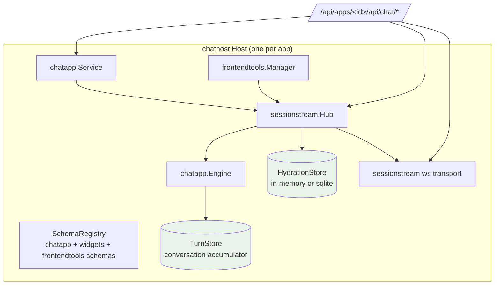

# wesen-os: the 2026-07 stocktake, consolidation, and chatapp migration

This is the current consolidation branch of the [[go-go-os]] project map.

This note is the technical record of a three-part effort executed on 2026-07-03: measuring how far the wesen-os system had drifted from its dependency ecosystem after a three-month pause, consolidating the scattered April work back onto `main`, and porting both of its chat backends from the deleted pinocchio `pkg/webchat` architecture onto the new `pkg/chatapp` + sessionstream stack. By the end of this note you should understand what wesen-os is, why the migration was structurally forced rather than optional, how the new chat host works internally, and which parts of the system remain to be ported. The full working record lives in the docmgr ticket `WESEN-OS-STOCKTAKE-2026-07` inside the repo's `ttmp/` tree; this note is the durable synthesis.

> [!summary]
> 1. Drift was bidirectional: the newest wesen-os code lived only on an unmerged workspace task branch (April 9), while the library mains (geppetto, pinocchio, go-go-goja, go-go-os-frontend) advanced through mid-June. Phase 0 merged the app side; Phase 1 caught up the library side.
> 2. pinocchio deleted `pkg/webchat` and `pkg/sem` — the exact packages both wesen-os chat surfaces were built on. The replacement is a per-app "chat host" (`wesen-os/pkg/chathost`) built on pinocchio `pkg/chatapp` + the new sessionstream hub, speaking the wire contract of the published `@go-go-golems/chat-provider` React package.
> 3. Frontend direction is decided but not yet executed: `@go-go-golems/chat-provider` + `chat-overlay` replace the os-chat transport (Decisions D6/D7), with browser-registered LLM tools (`useFrontendTool`) as the headline capability unlock.

## Why this work exists

wesen-os is a browser desktop: one Go binary (`cmd/wesen-os-launcher`) embeds a React shell (`apps/os-launcher`, served from `pkg/launcherui/dist` via `go:embed`) and hosts launchable apps — an LLM assistant, an inventory manager with its own chat, a SQLite browser, a GEPA prompt optimizer, CRM/todo/kanban apps, and JS/HyperCard REPLs. It deploys to https://wesen-os.yolo.scapegoat.dev on a single-node Hetzner k3s cluster through an Argo CD GitOps pipeline (`ghcr.io/wesen/wesen-os` images, bump PRs against `wesen/2026-03-27--hetzner-k3s`).

The repository is deliberately thin. Almost all functionality lives in sibling repos: geppetto (LLM inference engines, turns, events, engine profiles), pinocchio (the chat server layer above geppetto), go-go-goja (server-side JavaScript), go-go-os-backend (`pkg/backendhost`, the `AppBackendModule` contract), go-go-os-frontend (the `@go-go-golems/os-*` npm packages), and one repo per app. wesen-os composes them through Go module pins, git submodules under `workspace-links/`, and a pnpm workspace.

Development paused around 2026-04-09. Between then and mid-June the library repos changed enough that wesen-os could no longer be rebuilt against current dependencies: geppetto rewrote its event model, pinocchio deleted its chat server wholesale, go-go-goja renamed its engine API twice, and the frontend packages went from unpublished workspace links to real npm releases. The stocktake existed to measure that gap precisely before touching anything; the execution phases existed to close it.

## The stocktake: method and findings

The measurement phase ran four parallel read-only investigations (wesen-os architecture; geppetto/pinocchio API drift; go-go-goja + npm package drift; the k3s deployment), each anchored to file paths and, where possible, exported-symbol diffs between the April checkouts and the June mains. Two later follow-ups covered the react-chat repo and a line-count inventory of the os-chat npm package. Raw reports live in the ticket's `various/01` through `various/06` documents.

### Finding 1: drift was bidirectional

The workspace at `/home/manuel/workspaces/2026-03-02/os-openai-app-server` held the *newest* wesen-os (branch `task/sqlite-federation-runtime-fix`, last commit 2026-04-09: sqlite federation, containerization, widget-showcase work), while `~/code/wesen/wesen-os`'s local main sat at 2026-03-01. The library situation was inverted: the workspace pinned April versions while the mains in `~/code/wesen/go-go-golems` were at geppetto 2026-06-06, pinocchio 2026-06-07, go-go-goja 2026-06-17.

One assumption from the analysis did not survive execution: the remote `wesen/wesen-os` main was **not** stale. `git ls-remote` showed it at `13ce252` — exactly the commit the deployed image tag `sha-13ce252` was built from. Only the unsyncable local clone was old. Consolidation therefore reduced to landing roughly fifteen commits of delta rather than five weeks of divergence. The lesson is procedural: measure remotes, not clones, when judging staleness.

### Finding 2: the dependency breaks, by size

| Library | April pin | June target | Break surface |
|---|---|---|---|
| geppetto | v0.11.8 | v0.13.3 | `pkg/events` rewritten (canonical, correlation-based; 28 symbols removed); everything else consumed by wesen-os stable or additive |
| pinocchio | v0.10.13 pseudo | v0.11.5 | `pkg/webchat` (~60 files) and `pkg/sem` (protobuf timeline model) **deleted**; replaced by `pkg/chatapp` + new repo `sessionstream`; `pkg/cmds/helpers`, `pkg/ui/*` removed |
| go-go-goja | v0.4.6 | v0.9.6 (MVS) | engine moved `engine` → `pkg/engine`; `Factory`→`RuntimeFactory`, `ModuleSpec`→`RuntimeModuleRegistrar`, `runtimeowner.NewRunner`→`NewRuntimeOwner`; new xgoja v2 + express/gojahttp subsystems |
| glazed | v1.0.6 | v1.0.3x (MVS) | `help.SectionType` and constants moved to `help/model` |
| go-go-os-chat | v0.0.2 | dropped | still ships its own old webchat/sem architecture; removed from the dependency graph entirely |

The pinocchio deletion is the structural center of the whole effort. Both wesen-os chat surfaces — the assistant (`pkg/assistantbackendmodule`, via go-go-os-chat's `chatservice`/`profilechat`) and the inventory chat (via `go-go-app-inventory/pkg/pinoweb`) — were built on `webchat.NewServer` and the SEM timeline protos. There is no shim: the new architecture inverts ownership (the application owns the HTTP server; chatapp installs projections into a sessionstream hub), changes the wire protocol (REST session endpoints plus a sessionstream WebSocket instead of `/chat` + `/ws?conv_id=` + SEM frames), and changes the persistence model (a turn-store accumulator instead of webchat's conversation reader).

### Finding 3: the frontend already exists

`~/code/wesen/go-go-golems/react-chat` publishes `@go-go-golems/chat-provider` and `@go-go-golems/chat-overlay` (npm, 0.2.1). chat-provider is the runtime half: session client, Redux state on a private context (no collision with a host app's store), timeline decoding for the chatapp v1 event vocabulary, and — the notable capability — browser-side tool registration. A page calls `useFrontendTool({name, parameters: zodSchema, execute})`; the manifest posts to the session; when the model calls the tool, a `ChatFrontendToolCallRequested` event reaches the page, the provider validates input and runs `execute`, and the result posts back into the engine's tool loop. react-chat's `internal/webchat` is simultaneously the best reference implementation of the Go side, and its history explains the ecosystem: it was the incubator whose backend pieces were upstreamed into pinocchio `pkg/chatapp` (tickets CHATOVERLAY-001..015).

This finding also falsified an earlier plan. The original migration decision ("consume go-go-os-chat main, which is already ported") was wrong: go-go-os-chat main had only bumped dependency *versions*; its `pkg/webchat` and `pkg/sem` are its own copies of the deleted design. The corrected decision (D3) ports directly against pinocchio chatapp with react-chat as the reference, which is what was executed.

### Finding 4: os-chat should be replaced, not retrofitted

A LOC inventory of `@go-go-golems/os-chat` (7,640 LOC) showed roughly one third is transport that duplicates chat-provider — `wsManager` (451), the SEM decode stack (1,798, of which 1,245 generated protobuf), `conversationManager` + HTTP (≈230), and the transport-shaped Redux slices — while its presentational components duplicate chat-overlay. The genuinely unique remainder is small: the desktop `ChatConversationWindow`, a per-kind timeline renderer registry (extended by os-scripting/hypercard), two debug windows, and three leaf utilities (`SyntaxHighlight`, `toYaml`, `StructuredDataTree`). The retrofit option fails on a specific point: os-chat's public API *is* its wire model — consumers import `TimelineEntity`/`RenderEntity`, SEM-shaped types — so keeping the API means maintaining a permanent adapter to a protocol no backend emits. Decision D7: staged full replacement, gated on the backend stack stabilizing in production first.

## The plan

The design document (ticket `design-doc/01-…`) fixes seven decision records and six phases. Compressed:

| Decision | Content |
|---|---|
| D1 | Consolidate the workspace task branch into `wesen/wesen-os` main before any dependency work |
| D2 | Libraries at published tags via go.mod; submodules only for actively co-developed app repos |
| D3 | Assistant backend ports directly to pinocchio chatapp/sessionstream (react-chat `internal/webchat` as reference); not via go-go-os-chat |
| D4 | Frontend consumes published npm packages by default; workspace links become a dev mode |
| D5 | Deploy at behavior parity first; persistence (PVC) and API-key Secret are separate follow-ups |
| D6 | Assistant UI adopts `@go-go-golems/chat-provider`; chat-overlay as the first milestone |
| D7 | os-chat is fully replaced (staged), the package retired; hypercard/os-scripting re-targeting is the long pole |

Phases: **0** consolidate, **1** Go stack + both chat backends, **2** published npm packages + chat-provider UI + theming (macos1 alignment, no Chicago font), **3** ship through the existing GHCR → GitOps-PR → Argo pipeline, **4** complete os-chat replacement after a production bake, **5** improvements (PVC for `/app/data`, Vault-injected API key, desktop apps as assistant tools, observability).

## Phase 0 execution: consolidation

Phase 0 turned a dirty three-month-old workspace into a clean, merged main. The mechanical content is worth recording because most of it generalizes.

**Preserving uncommitted submodule work.** The `workspace-links/go-go-os-frontend` submodule was checked out at `c74347e` with 17 modified source files (SelectableDataTable primitives, desktop shell windowing, macos1 theme wiring, build tooling) plus 12 untracked build artifacts. The modified sources were committed on a new branch `task/2026-04-widget-showcase-wip` (commit `9a1e267`), pushed to `go-go-golems/go-go-os-frontend`, and the wesen-os submodule pointer was pinned to that pushed commit. This keeps the exact built-against state reproducible for anyone cloning with submodules while keeping the artifacts out of history.

**Sweeping stray branches.** `git branch --no-merged HEAD` surfaced two DEPLOY-001 documentation branches. Their code content already existed in newer form on HEAD; their unique content was ttmp documentation. Both were merged with `--no-ff`. Diary files conflicted because both sides appended chronological entries to the same file; the resolution was a union — strip the diff3 markers, keep both sides in order — while `tasks.md` and the CI workflow resolved with `--ours` after verifying HEAD was a strict superset.

**Landing and the immediate regression.** PR #12 merged the consolidated branch into main (`52a26d0`). CI failed in 24 seconds: `ERR_PNPM_OUTDATED_LOCKFILE`, because the preserved widget-showcase WIP added react dev-dependencies to `macos1-react/package.json` without a lockfile refresh. `pnpm install` regenerated exactly the expected lockfile block; PR #13 fixed main. The general rule: preserving uncommitted work can itself introduce regressions, because that work never passed CI.

## Phase 1 execution: the chatapp port

Phase 1 moved the entire Go surface to geppetto v0.13.3 / pinocchio v0.11.5 / sessionstream v0.1.0 / go-go-os-backend v0.0.7 (go 1.26.3), rewrote both chat backends, and removed the library submodules. Commits: wesen-os `ca9098e` + `232a960`, go-go-app-inventory `4397deb`, go-go-gepa `c01a8e1`, all on `task/2026-07-upgrade-stack` branches.

### The chathost architecture

The port's central artifact is `wesen-os/pkg/chathost` (three files: `host.go`, `handlers.go`, `runtime.go`). It exists because wesen-os runs *multiple* chat apps — the assistant and the inventory chat today, potentially more later — and each needs the same wiring with different profile universes, system prompts, and tool sets. One reusable host keeps them symmetric and gives the future chat-provider frontend a single contract.



Construction follows the react-chat reference exactly: build the schema registry and register the chatapp, widget, and frontend-tool schemas; open the hydration store (timeline snapshots) and turn store (conversation history), both in-memory by default and sqlite when file paths are configured; create the WebSocket transport with a snapshot provider; create the `chatapp.Engine` with the turn store and plugins; create the hub with the registry, hydration store, and the WebSocket transport as UI fanout; install the frontend-tool manager and the chatapp projections into the hub; wrap it all in a `chatapp.Service`.

The route surface is the chat-provider wire contract, mounted relative to the app namespace so that `backendhost.MountNamespacedRoutes` produces `/api/apps/<app>/api/chat/…`, matching a chat-provider configuration of `basePrefix: "/api/apps/<app>"`:

```
GET  /api/chat/health
POST /api/chat/sessions                          (body may carry {"profile": "<slug>"})
POST /api/chat/sessions/{id}/messages
GET  /api/chat/sessions/{id}                      (timeline snapshot)
POST /api/chat/sessions/{id}/stop
POST /api/chat/sessions/{id}/tools/manifest       (frontend tool registration)
POST /api/chat/sessions/{id}/tools/results        (frontend tool results)
GET  /api/chat/ws                                 (sessionstream subscribe/uiEvent frames)
```

### Per-prompt runtime composition

The most consequential design point is that the engine is built **per prompt**, not per server. Each submit resolves the session's engine profile, constructs a geppetto engine from the merged settings, assembles a tool registry, and hands chatapp a `PromptRequest` carrying a `ComposedRuntime`:

```go
func (h *Host) promptRequest(ctx, sid, prompt) (chatapp.PromptRequest, error) {
    slug    := h.sessionProfile(sid)                                  // per-session, set at create time
    profile := h.opts.Profiles.Registry.GetEngineProfile(ctx, h.opts.Profiles.RegistrySlug, slug)
    settings := gepprofiles.MergeInferenceSettings(h.opts.Profiles.BaseSettings, profile.InferenceSettings)
    engine  := factory.NewEngineFromSettings(settings)

    registry := geptools.NewInMemoryToolRegistry()
    h.opts.BackendTools(sid, registry)                                 // e.g. inventory CRUD tools
    h.frontendTools.RegisterManifestTools(sid, registry)               // browser-registered tools

    return chatapp.PromptRequest{
        Prompt:      prompt,
        InitialTurn: h.initialTurnIfFirstMessage(ctx, sid, prompt),    // system prompt seeding
        OnFinalTurn: h.persistFinalTurn(sid, string(slug)),
        Runtime: &infruntime.ComposedRuntime{
            Engine: engine, Registry: registry,
            ToolExecutor: frontendtools.NewBridgeExecutor(h.frontendTools, nil),
            RuntimeKey:   string(slug),
        },
        RuntimeContext: func(ctx, sid, messageID, pub) context.Context {
            return frontendtools.WithBridgeContext(ctx, frontendtools.BridgeContext{...})
        },
    }, nil
}
```

Why per prompt? Because the profile can differ per session, the frontend tool manifest can change between prompts (tools register and unregister as desktop windows mount and unmount), and engine construction from settings is cheap. Per-server engines would freeze both.

### The history model and system-prompt seeding

chatapp's conversation model is an accumulator: after each successful inference, the application persists the *entire final turn* (all blocks so far) into the turn store under phase `"final"`. On the next prompt, chatapp loads the latest final turn, clones it, and appends the new user block — the model sees the full conversation. This has one sharp consequence for system prompts. chathost seeds the system prompt through `InitialTurn` (a turn with a system block plus the first user block) — but only when `LoadLatestTurn(sid, "final")` returns nothing. Passing `InitialTurn` on a later prompt would *replace* the loaded history rather than extend it, silently dropping the conversation. `initialTurnIfFirstMessage` encodes exactly this rule.

The assistant's system prompt is dynamic: a base prompt plus an optional per-conversation addendum from the app-chat bootstrap flow ("chat about this app" attaches the target app's docs and reflection). The addendum store (`AppChatContextStore`) previously typed its values with go-go-os-chat's `ConversationContext`; the type is a two-field struct (`SystemPromptAddendum string; Metadata map[string]any`) and was moved into `pkg/assistantbackendmodule`, which severed the go-go-os-chat Go dependency entirely.

### The two apps on the host

The assistant module shrank to a thin adapter: manifest, lifecycle, the bootstrap endpoint, and `host.MountRoutes`. The inventory case is more interesting because its old module *was* its chat surface. `go-go-app-inventory/pkg/backendcomponent` used to construct a chatservice around an injected `*webchat.Server`; it now accepts host-injected `ChatRoutes func(*http.ServeMux) error` and a `ChatStop` hook, with the composition host (wesen-os `main.go`) owning the chat runtime. Inventory's LLM tools survived without modification: `pinocchio/pkg/inference/runtime.ToolRegistrar` (`func(geptools.ToolRegistry) error`) is unchanged across the refactor, so `inventorytools.InventoryToolFactories(store)` plugs directly into chathost's `BackendTools` hook.

What did **not** port: `pkg/pinoweb` — 2,662 LOC of hypercard SEM event extraction, middleware policy, and the old runtime composer. It has no mechanical mapping onto chatapp (its output vocabulary is the deleted SEM timeline protos). It was quarantined as `pkg/_pinoweb_legacy` — the underscore prefix makes the Go toolchain skip the directory entirely, preserving the code and history for the Phase 4 port without blocking builds or `go mod tidy`. The same technique quarantined wesen-os's 1,562-line legacy webchat integration test.

### API-drift corrections discovered only at compile time

The stocktake's symbol-level drift report was accurate for the big items and wrong in four smaller places; all four surfaced as compile or test failures within minutes:

| Report said | Reality in the June stack |
|---|---|
| `profilebootstrap.ResolveCLIProfileSelection` stable | Replaced by `ResolveCLIProfileRuntime(ctx, parsed)` returning `ProfileSettings` + a ready `ResolvedProfileRegistryChain` (from the new `geppetto/pkg/cli/bootstrap`) |
| glazed help API untouched | `help.SectionType` and section constants moved to `glazed/pkg/help/model` |
| geppetto sections provide cobra middlewares | `GetCobraCommandGeppettoMiddlewares` is gone; consumers use pinocchio `cmds.GetPinocchioCommandMiddlewares` |
| profile YAML: only the registry decoder tightened | The whole **app config format** went profile-first: top-level `profile-settings:`/`ai-chat:`/`openai-chat:` keys are hard errors (`configdoc.validateTopLevelKeys`); the format is `profile: {active, registries}` + `profiles.<slug>.inference_settings` |

The last row has a production consequence found by booting the new binary against the live k3s ConfigMap: `gitops/kustomize/wesen-os/config/profiles.runtime.yaml` still decodes (it is a registry file, and the single-registry layout survives), but its `runtime.step_settings_patch.ai-chat.ai-engine: gpt-4.1-mini` block is the *old webchat runtime patch mechanism* — dead configuration under chathost. Phase 3 must rewrite it to `profiles.default.inference_settings.chat: {api_type, engine}`. Deploying without that change would not crash (parity with today's keyless demo tier is maintained; engine errors surface as controlled timeline entities), but the configured model name would be silently ignored.

### Verification

The gate was behavioral, not just compilation. After `go build ./... && go test ./...` went green across wesen-os, inventory, gepa, sqlite, and arc-agi, the launcher was booted with a scratch single-registry profiles file and driven over HTTP:

```
POST /api/apps/assistant/api/chat/sessions            → {"sessionId":"3119e2d5-…"}
POST …/sessions/{id}/messages {"prompt":"hello"}      → {"accepted":true,"status":"running"}
GET  …/sessions/{id}                                  → snapshot, ordinal 3:
      ChatMessage chat-msg-1-user  {role:"user",   text:"hello", status:"accepted"}
      ChatMessage chat-msg-1       {role:"error",  content:"no API key for openai",
                                    correlation:{runId:"chat-msg-1", sessionId:…}, final:true}
```

The error entity is the point: with no API key configured, the full pipeline — session creation, hub command dispatch, per-prompt engine construction, run lifecycle, projection into hydration, snapshot encoding — executes and reports the failure as data with correlation, exactly as the canonical event model intends. The inventory host answered its own health endpoint on the same process.

### Environment constraints worth recording

Three non-code obstacles shaped the execution and will recur in this environment. First, `/home` is mounted read-only for this session except the workspace mounts, so canonical clones under `~/code` can be read but not synced; `~/code/wesen/wesen-os` remains on old main until a normal session pulls it (this vault, on a separate mount, is writable). Second, the global pnpm store pointed into another read-only workspace; `pnpm install --store-dir <scratchpad>` works around it. Third, `go mod tidy` ignores `go.work`: rewrites inside workspace submodules are invisible to it, so in-flight app repos need `replace` directives in wesen-os's go.mod (`./workspace-links/go-go-app-inventory`, `./workspace-links/go-go-gepa`) until they are tagged — which also keeps Docker/CI builds correct since the submodules are committed.

## Current status

Phases 0 and 1 are complete and pushed. `wesen/wesen-os` main is consolidated; `task/2026-07-upgrade-stack` carries the port (through `b3381ef`) and awaits the Phase 2 frontend work before merging, since shipping the new backend with the old SEM-speaking frontend would break the assistant window. The library submodules (geppetto, pinocchio, go-go-os-chat, go-go-os-backend) are removed; inventory, sqlite, gepa, and arc-agi remain as workspace links, two of them on pushed upgrade branches pending tags.

Remaining, in order: a Go contract test for chathost against a fake engine (needs a small engine-factory seam in `Options`); Phase 2 — publish os-scripting/os-ui-cards/os-confirm, switch `apps/os-launcher` to published semver ranges, mount `<ChatProvider basePrefix="/api/apps/assistant">` + chat-overlay, apply the theming bridge (`--color-mac-*` → `--hc-*` tokens, plain-CSS fallbacks for chat-overlay's Tailwind-utility message internals, the no-Chicago font stack `"Geneva", "Helvetica Neue", Helvetica, Arial, sans-serif` across os-core's three theme files and retro-mac.css); Phase 3 — migrate the prod profile ConfigMap and ship through the GitOps pipeline; Phase 4 — the os-chat replacement, whose hardest sub-task (re-targeting os-scripting/hypercard's artifact projections onto `defineTimelineAdapter`/`defineWidget`) now has a concrete code anchor in `_pinoweb_legacy`; Phase 5 — PVC, Vault secret, desktop-apps-as-assistant-tools.

## Working rules extracted from this effort

- Judge staleness against remotes, not local clones; an unsyncable clone cost the plan a wrong premise (D1's "stale main") that execution had to correct.
- "Dependency bumped" and "architecture migrated" are different facts. go-go-os-chat pinned geppetto v0.13.3 while still shipping the deleted webchat design; two investigation reports appeared to contradict each other until the distinction was drawn.
- Preserved-but-never-CI'd work is a regression vector: committing recovered WIP broke main's lockfile check within one push.
- Quarantine unportable code with underscore directories rather than deleting or build-tagging it: `go mod tidy` respects the former and ignores build tags.
- In an accumulator-based history model, seed system prompts exactly once; any later `InitialTurn` silently truncates the conversation.
- Symbol-diff drift reports are planning tools, not contracts; budget for the compiler to find the remainder, and treat every silent text replacement as unverified until a test re-runs.

## Important project docs

- Ticket workspace: `wesen-os/ttmp/2026/07/03/WESEN-OS-STOCKTAKE-2026-07--…/` — design doc (`design-doc/01-…`, decisions D1–D7, six-phase plan), investigation diary (Steps 1–10), per-phase `tasks.md`, raw evidence `various/01–06`.
- reMarkable: `/ai/2026/07/03/WESEN-OS-STOCKTAKE-2026-07` (v1 and v2 bundles).
- Reference implementations: `~/code/wesen/go-go-golems/react-chat/internal/webchat/` (Go host incl. frontend-tool bridge), `pinocchio/pkg/chatapp/{chat.go,service.go,serverkit/,runtime_inference.go}`, `pinocchio/cmd/web-chat/web` (chat-provider consumer).
- Deployment truth: `~/code/wesen/2026-03-27--hetzner-k3s/gitops/kustomize/wesen-os/`.

## Open questions

- Should chathost apply engine-profile `extensions` (the old `webchat_runtime@v1` middleware/tool policies) or should those concepts be redesigned as chatapp plugins? Today they decode but are not applied.
- Where does the per-session profile map live long-term? In-memory today; sessionstream's sqlite hydration is the natural home if profile switching mid-session becomes a feature.
- Does `defineTimelineAdapter` express hypercard's artifact-projection flow? This is the Phase 4 pre-flight check and the main schedule risk of the os-chat replacement.
