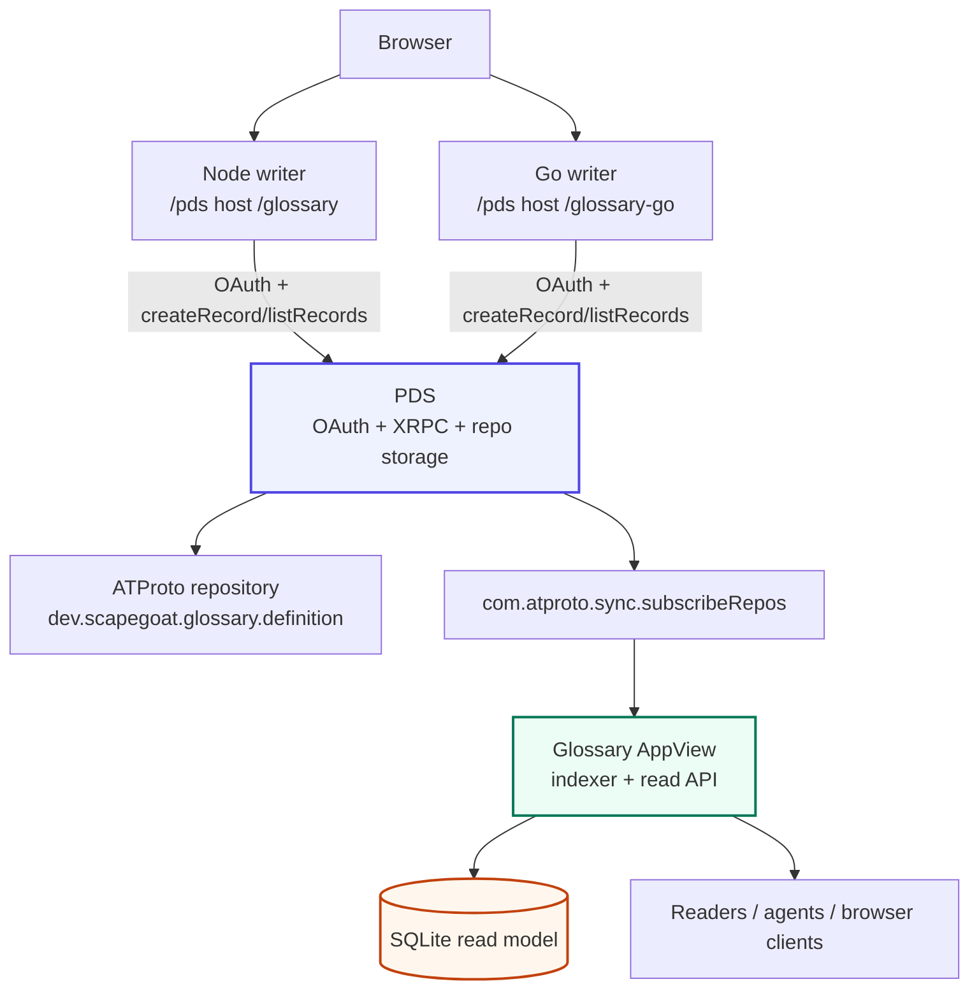
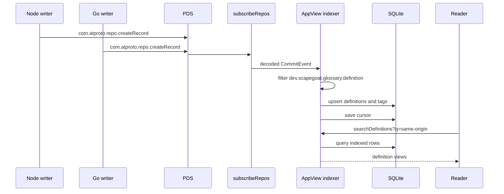
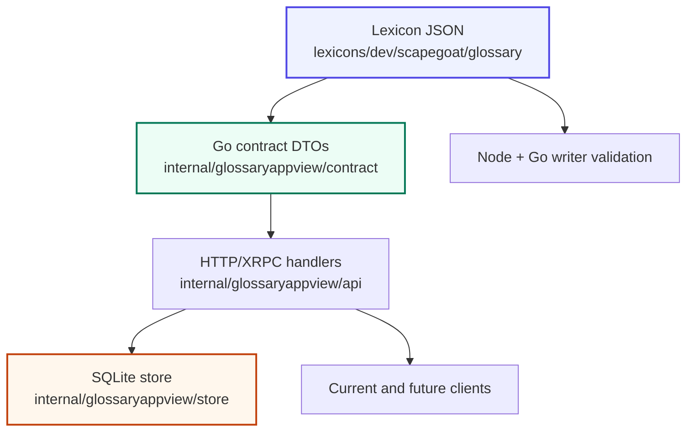

# ATProto Glossary AppView — Deep Dive

This report explains the ATProto glossary AppView that was designed, implemented, deployed, and then corrected after a root-page 404. It is a continuation of [[PROJECT REPORT - ATProto OAuth Glossary and Same-Origin Routing - Deep Dive|ATProto OAuth Glossary and Same-Origin Routing — Deep Dive]]. The earlier report explains how the Node and Go glossary clients became same-origin OAuth writer applications under `https://pds.yolo.scapegoat.dev`. This report explains the next component: a read-optimized Go AppView that consumes repository events, indexes glossary records, and exposes query APIs at `https://glossary-appview.yolo.scapegoat.dev`.

The important distinction is the role boundary. The glossary writer applications authenticate a user and write records into that user's PDS repository. The AppView does not authenticate users for writes and does not own repository state. It consumes the PDS firehose, builds a local projection of glossary records, and serves read APIs over that projection. The PDS remains the source of record truth. The AppView is a derived service optimized for application reads.

> [!summary]
> - The glossary system now has three deployed application roles: the PDS, two OAuth writer clients under the PDS origin, and a separate AppView at `https://glossary-appview.yolo.scapegoat.dev`.
> - The AppView is implemented in Go as `cmd/glossary-appview`. It consumes `com.atproto.sync.subscribeRepos`, filters `dev.scapegoat.glossary.definition`, validates records, stores them in SQLite, and exposes read-only XRPC-style endpoints.
> - The first deployment found two operational issues: private GHCR image pulls required Vault/VSO wiring, and quiet PDS firehose periods caused read timeouts. Both issues were fixed before the service was marked healthy.
> - The service now serves a root landing page, health/readiness endpoints, statistics, list/search/get APIs, and indexed results for the Node and Go same-origin smoke records.

## What changed since the same-origin glossary report

The same-origin glossary report ended with a clear architectural boundary: the Node and Go glossary applications are OAuth clients, not AppViews. They prove that a user can authorize an application and that two independent implementations can write and read the same custom ATProto collection:

```text
dev.scapegoat.glossary.definition
```

That was the correct first step because the protocol surface needed to be verified before building a derived read service. A writer application must know how to create a record. A reader application must know how to list records from a user's repository. An AppView is a different system. It watches repository changes, maintains a query-oriented database, and exposes application-specific APIs over that database.

The work described here moved from design to a deployed AppView MVP. The implementation now has these properties:

- It is a single Go process.
- It uses SQLite as the durable read model.
- It consumes the lab PDS firehose directly.
- It indexes only the glossary collection.
- It exposes read-only HTTP/XRPC-style endpoints.
- It runs in k3s behind Traefik and cert-manager.
- It uses Vault/VSO for the private GHCR image-pull secret.
- It reconnects after firehose quiet-period read timeouts.

The live service is:

```text
https://glossary-appview.yolo.scapegoat.dev
```

The canonical writer applications are still:

```text
https://pds.yolo.scapegoat.dev/glossary
https://pds.yolo.scapegoat.dev/glossary-go
```

The important result is that the glossary system now has both write-path validation and read-path indexing.

## System roles after the AppView deployment

The deployed system has four roles that should not be collapsed into one another.

| Role | Deployed component | Responsibility |
|---|---|---|
| PDS | `https://pds.yolo.scapegoat.dev` | Stores user repositories, serves XRPC APIs, emits repo events, and acts as OAuth authorization/resource server. |
| Node writer | `https://pds.yolo.scapegoat.dev/glossary` | Runs browser OAuth with the official Node SDK and writes glossary records. |
| Go writer | `https://pds.yolo.scapegoat.dev/glossary-go` | Runs browser OAuth with Indigo and writes glossary records. |
| AppView | `https://glossary-appview.yolo.scapegoat.dev` | Consumes repo events, indexes glossary records, and serves read APIs. |

The role separation matters because each service has a different authority model. The PDS owns repository state. The writer clients receive user-granted authority through OAuth and use that authority to call `com.atproto.repo.createRecord`. The AppView receives no write authority over user repositories. It only reads public repository events and stores derived rows.



This is the core architecture. The writer applications create canonical records. The PDS stores and signs those records. The firehose emits repository commits. The AppView projects the records into SQLite. The read API serves the projection.

## The record shape that everything depends on

The whole system is centered on one custom collection:

```text
dev.scapegoat.glossary.definition
```

The current record contains fields for the term, definition, optional context, aliases, tags, source URL, language, and timestamps. The Node and Go writers already agree on this shape. That agreement is the reason the AppView can be implementation-neutral: it does not care whether a record was written by the Node client or the Go client. It only cares that the record appears in the repository under the glossary collection and passes the AppView parser.

The AppView stores a derived row with additional indexing fields:

```text
uri              at://did:.../dev.scapegoat.glossary.definition/<rkey>
repo_did         writer DID
collection       dev.scapegoat.glossary.definition
rkey             record key
cid              content identifier, currently stored as hex
rev              repo revision
seq              firehose sequence
term             display term
normalized_term  lowercased/collapsed search term
definition       display definition
context          optional context
aliases_json     JSON array
tags_json        JSON array
language         display/filter language
indexed_at       AppView ingestion time
deleted_at       soft-delete marker
raw_record_json  original decoded record as JSON
```

The AppView also stores tags in a join table:

```text
glossary_definition_tag(uri, tag)
```

This join table is deliberately simple. It supports tag filtering without requiring JSON scans for the common query path.

## Implementation layout

The implementation lives in `/home/manuel/code/wesen/2026-07-01--pds-lab`.

The AppView-specific code is organized as follows:

```text
cmd/glossary-appview/main.go
internal/glossaryappview/config/config.go
internal/glossaryappview/model/definition.go
internal/glossaryappview/store/store.go
internal/glossaryappview/indexer/indexer.go
internal/glossaryappview/api/server.go
internal/glossaryappview/integration_test.go
glossary-appview/Dockerfile
```

Each package has a narrow responsibility.

| Package | Responsibility |
|---|---|
| `config` | Load runtime settings such as listen address, firehose URL, database path, collection, and bootstrap mode. |
| `model` | Parse generic decoded glossary records and convert them into typed AppView definitions. |
| `store` | Own SQLite migrations and query/write methods for definitions, tags, cursor, stats, and soft deletes. |
| `indexer` | Process decoded firehose commits, filter glossary operations, and write store updates. |
| `api` | Serve health/readiness, landing page, and read-only XRPC-style endpoints. |
| `cmd/glossary-appview` | Compose config, store, indexer, firehose consumer, HTTP server, and shutdown behavior. |

This structure is small enough for an MVP, but it already separates the important concerns. The parser can be tested without SQLite. The store can be tested without a firehose. The indexer can be tested with synthetic `CommitEvent` values. The API can be tested against an in-memory store. The command can remain mostly composition logic.

## The ingestion path

The ingestion path starts with ATProto repository events. The existing `internal/firehose` package consumes the PDS stream:

```text
wss://pds.yolo.scapegoat.dev/xrpc/com.atproto.sync.subscribeRepos
```

A `#commit` event contains:

- a sequence number;
- a repository DID;
- a repository revision;
- a CAR slice with changed blocks;
- a list of operations, each with an action, path, and CID.

The path is the first filter. The AppView only cares about paths under:

```text
dev.scapegoat.glossary.definition/<rkey>
```

The indexer logic is intentionally direct:

```go
for op in event.Ops {
    collection, rkey := ParsePath(op.Path)
    if collection != configuredCollection {
        continue
    }

    switch op.Action {
    case "delete":
        store.DeleteDefinition(repo, collection, rkey, rev, seq)
    case "create", "update":
        record := event.RecordFor(op)
        definition := ParseDefinitionRecord(repo, op.Path, rev, seq, op.CID, record)
        store.UpsertDefinition(definition)
    }
}

store.SaveCursor(source, event.Seq)
```

The real implementation returns a `Result` containing counts for seen, matched, upserted, deleted, rejected, and cursor sequence. Those counts appear in logs when the AppView indexes relevant records.

The parser accepts generic `map[string]any` records because records arrive from DAG-CBOR decoding rather than from a generated Go struct. This is why alias and tag fields accept `[]any` as well as `[]string`. The parser trims strings, requires `term` and `definition`, defaults missing language to `en`, validates `sourceUrl` as HTTP(S), and constructs a stable AT URI.

## The storage layer

The storage layer is implemented in `internal/glossaryappview/store/store.go` using `modernc.org/sqlite`. The database is stored on a PVC at:

```text
/var/lib/glossary-appview/appview.sqlite
```

The deployment uses one replica, which keeps SQLite write behavior straightforward. The store sets `MaxOpenConns(1)` and runs migrations on startup.

The key tables are:

```sql
create table glossary_definition (
  uri text primary key,
  repo_did text not null,
  collection text not null,
  rkey text not null,
  cid text,
  rev text not null,
  seq integer not null,
  term text not null,
  normalized_term text not null,
  definition text not null,
  context text,
  aliases_json text not null default '[]',
  tags_json text not null default '[]',
  source_url text,
  language text not null default 'en',
  record_created_at text,
  record_updated_at text,
  indexed_at text not null,
  deleted_at text,
  raw_record_json text not null,
  unique(repo_did, collection, rkey)
);
```

```sql
create table glossary_definition_tag (
  uri text not null references glossary_definition(uri) on delete cascade,
  tag text not null,
  primary key(uri, tag)
);
```

```sql
create table appview_cursor (
  source text primary key,
  cursor integer not null,
  updated_at text not null
);
```

The upsert path replaces tag rows in the same transaction as the definition row. This matters because stale tag rows would make old filters return records that no longer have that tag. A create or update also clears `deleted_at`, so a later update can make a previously deleted row visible again if the repository emits such a sequence.

The search layer is deliberately modest. It performs bounded substring search over normalized term, lowercased definition, and lowercased context, plus optional filters for author, tag, and language. It is not a ranked full-text search system yet. That is an explicit MVP boundary, not an accidental omission.

## The read API

The read API lives in `internal/glossaryappview/api/server.go`. It uses the Go standard library `http.ServeMux` and exposes XRPC-style paths.

```text
GET /healthz
GET /readyz
GET /
GET /xrpc/dev.scapegoat.glossary.searchDefinitions
GET /xrpc/dev.scapegoat.glossary.getDefinition
GET /xrpc/dev.scapegoat.glossary.listDefinitions
GET /xrpc/dev.scapegoat.glossary.getStats
```

The root page was added after deployment because the initial service returned 404 at the public hostname. The root handler now serves a small HTML page with links to the health endpoint, readiness endpoint, stats endpoint, and a sample search query. It explicitly preserves `404` for unknown paths, because the root pattern in `http.ServeMux` matches every otherwise-unmatched route.

The API response for a definition has this shape:

```json
{
  "uri": "at://did:plc:.../dev.scapegoat.glossary.definition/3mpr3iuxuw225",
  "cid": "01711220...",
  "authorDid": "did:plc:3jno7qw5v2yrse5bhtde5tfs",
  "term": "Same-origin Node smoke HK3S-0034",
  "definition": "A glossary definition written through the Node OAuth client while mounted below the PDS origin at /glossary.",
  "context": "Validates Traefik path routing, BASE_PATH-aware metadata, callback URLs, redirects, forms, and cookies.",
  "aliases": ["node same-origin", "base path"],
  "tags": ["hk3s-0034", "atproto", "node", "same-origin"],
  "sourceUrl": "https://pds.yolo.scapegoat.dev/glossary",
  "language": "en",
  "createdAt": "2026-07-03T17:36:34.310Z",
  "updatedAt": "2026-07-03T17:36:34.310Z",
  "indexedAt": "2026-07-03T18:24:04Z"
}
```

Error responses use an XRPC-compatible shape:

```json
{
  "error": "InvalidRequest",
  "message": "limit must be between 1 and 100"
}
```

The current API is hand-written. It is not yet backed by published Lexicons. That is acceptable for the lab deployment, but external consumers should not treat the API contract as stable until the Lexicons are formalized.

## The runtime process

The executable is `cmd/glossary-appview`. It composes five parts:

1. configuration loading;
2. SQLite store opening and migration;
3. HTTP API server;
4. firehose consumer;
5. indexer processor.

The runtime starts both the HTTP server and firehose consumer in goroutines. It exits on process signals or unrecoverable server errors. Firehose read errors are treated differently: the final deployed image reconnects with exponential backoff.

The relevant runtime pseudocode is:

```go
cfg := config.Load()
st := store.Open(cfg.DatabasePath)
processor := indexer.Processor{
    Store: st,
    Collection: cfg.Collection,
    Source: cfg.FirehoseURL,
}

startHTTP(api.New(st).Routes())

for {
    err := consumeFirehose(ctx, cfg, st, processor)
    if ctx canceled {
        return
    }
    log warning
    sleep backoff
    increase backoff up to 60 seconds
}
```

The deployed configuration is visible in the k3s deployment:

```yaml
- name: APPVIEW_PUBLIC_BASE_URL
  value: https://glossary-appview.yolo.scapegoat.dev
- name: APPVIEW_FIREHOSE_URL
  value: wss://pds.yolo.scapegoat.dev/xrpc/com.atproto.sync.subscribeRepos
- name: APPVIEW_DATABASE_PATH
  value: /var/lib/glossary-appview/appview.sqlite
- name: APPVIEW_COLLECTION
  value: dev.scapegoat.glossary.definition
- name: APPVIEW_BOOTSTRAP_MODE
  value: from-cursor
```

The `from-cursor` mode means the service reuses the stored cursor after the first replay. If no cursor exists, it starts from zero and indexes retained events from the PDS.

## Deployment on k3s

The GitOps repository is `/home/manuel/code/wesen/2026-03-27--hetzner-k3s`.

The AppView package is:

```text
gitops/kustomize/atproto-glossary-appview/
```

It contains:

```text
namespace.yaml
serviceaccount.yaml
pvc.yaml
deployment.yaml
service.yaml
ingress.yaml
vault-connection.yaml
vault-auth.yaml
vault-static-secret-image-pull.yaml
kustomization.yaml
```

The Argo Application is:

```text
gitops/applications/atproto-glossary-appview.yaml
```

The AppView is deployed in its own namespace:

```text
atproto-glossary-appview
```

The public hostname is served through Traefik and cert-manager:

```text
https://glossary-appview.yolo.scapegoat.dev
```

The active image after the root-page fix is:

```text
ghcr.io/wesen/pds-lab-glossary-appview:sha-031df74
```

The image is private on GHCR, so the namespace needs an image-pull secret. That is handled through Vault Secrets Operator:

```text
Vault policy: atproto-glossary-appview-prod
Vault role:   auth/kubernetes/role/atproto-glossary-appview
Vault path:   kv/apps/atproto-glossary-appview/prod/image-pull
K8s secret:   atproto-glossary-appview-ghcr-pull
```

The first rollout failed because this wiring did not exist yet. The pod reported:

```text
ImagePullBackOff
failed to fetch anonymous token ... ghcr.io ... 401 Unauthorized
```

That failure was useful because it confirmed the cluster does not have a global GHCR credential. Each private package deployment needs explicit image-pull wiring or a shared pull-secret pattern.

## Operational bugs found during deployment

Two bugs appeared only after the service was deployed.

### Private image pull failure

The first AppView deployment used the newly published image:

```text
ghcr.io/wesen/pds-lab-glossary-appview:sha-ef97221
```

The pod could not pull it anonymously. Existing Node and Go glossary deployments already had GHCR pull secrets, but the new namespace did not. The fix was to create a Vault policy, Vault Kubernetes role, Vault KV path, and VSO manifests for the AppView namespace. After the generated `kubernetes.io/dockerconfigjson` secret appeared, the pod could pull the image.

The lesson is direct: a new namespace is an authorization boundary for image pulls. Existing credentials in sibling namespaces do not apply.

### Firehose quiet-period timeout

The first runnable image successfully indexed retained glossary records, then exited after the PDS firehose stayed quiet long enough to hit the read deadline:

```text
firehose read: read tcp ... i/o timeout
```

The existing firehose package intentionally sets a read deadline so a dead connection does not block forever. That behavior is correct for a low-level consumer. A long-running AppView daemon must decide what to do when the read returns an error. The initial daemon treated the error as fatal. The fix changed the daemon to reconnect with backoff.

After the fix, the logs show the intended behavior:

```text
appview firehose disconnected; reconnecting ... i/o timeout ... backoff=5s
appview firehose starting ... cursor=57
firehose: connected to pds.yolo.scapegoat.dev/xrpc/com.atproto.sync.subscribeRepos
```

The stored cursor prevents the reconnect from reprocessing the full retained history after each quiet-period timeout.

### Root URL 404

The AppView API endpoints were healthy, but the public root URL returned:

```text
404 page not found
```

That was technically correct from the first API implementation because no root handler existed. It was incorrect for an exposed public service because the base URL looked broken. The fix added a landing page at `/` and kept explicit 404 behavior for unknown paths.

The final smoke is:

```text
https://glossary-appview.yolo.scapegoat.dev/ -> 200 text/html; charset=utf-8
https://glossary-appview.yolo.scapegoat.dev/healthz -> 200 text/plain; charset=utf-8
https://glossary-appview.yolo.scapegoat.dev/xrpc/dev.scapegoat.glossary.getStats -> 200 application/json
```

## Validation results

The final local validation in `pds-lab` was:

```bash
go test ./... -count=1
```

The AppView includes tests at several levels:

| Test area | What it validates |
|---|---|
| `config` | Defaults, env overrides, invalid bootstrap mode. |
| `model` | Path parsing, term normalization, record validation, alias/tag decoding. |
| `store` | Migrations, upsert, tag replacement, soft delete, stats, cursor persistence. |
| `indexer` | Create/update/delete event processing and cursor saving. |
| `api` | Landing page, health, readiness, search, get, list, stats, validation errors. |
| `integration_test.go` | Synthetic commit processed through indexer and returned through HTTP search API. |

The final cluster validation was:

```text
Argo: atproto-glossary-appview Synced Healthy
Pod:  atproto-glossary-appview 1/1 Running
Cert: atproto-glossary-appview-tls Ready=True
```

The public API reported indexed state:

```json
{"definitions":4,"authors":1,"lastSeq":57}
```

A public search for `same-origin` returned the records created during the same-origin migration:

```text
at://did:plc:3jno7qw5v2yrse5bhtde5tfs/dev.scapegoat.glossary.definition/3mpr3latv7c25
at://did:plc:3jno7qw5v2yrse5bhtde5tfs/dev.scapegoat.glossary.definition/3mpr3iuxuw225
```

Those records matter because they were written through two different OAuth clients and then observed through a third service. The data path is therefore not app-local. It crosses writer clients, the PDS repository, the firehose, the AppView indexer, SQLite, and the read API.



## Commit timeline

The main `pds-lab` commits for the AppView are:

| Commit | Meaning |
|---|---|
| `de2a81a` | Added AppView config, record model, SQLite store, and unit tests. |
| `62cd673` | Added the firehose commit processor for create/update/delete events. |
| `2f7706b` | Added read-only HTTP/XRPC API handlers. |
| `794dd9b` | Added the runnable `cmd/glossary-appview` daemon. |
| `756353b` | Added the local indexer-to-API integration test. |
| `ef97221` | Added the AppView Dockerfile. |
| `dd3f1d5` | Added firehose reconnect/backoff behavior. |
| `031df74` | Added the root landing page. |

The main k3s GitOps commits are:

| Commit | Meaning |
|---|---|
| `c474b2b` | Added the `atproto-glossary-appview` Argo Application and manifests. |
| `6a7cab4` | Added Vault/VSO GHCR image-pull secret wiring. |
| `1ec1ef7` | Updated the deployment to the firehose reconnect image. |
| `e8f9532` | Updated the deployment to the landing-page image. |

The AppView was tracked in ticket `HK3S-0036`, which now contains the design guide, implementation diary, deployment addendum, validation notes, and final reMarkable export.

## What the AppView is not yet

The AppView is live, but it is still an MVP. The boundaries are clear.

It is not a complete search product. Search is simple substring matching. There is no ranking, stemming, typo tolerance, or SQLite FTS table.

It is not a formal protocol surface yet. The endpoints use XRPC-style paths and error shapes, but the Lexicons are not published. A client can use the endpoints, but the contract should be considered lab-stage until the Lexicons are written.

It is not horizontally scalable. The deployment has one replica and a SQLite PVC. That is correct for this lab deployment. If read traffic or indexing volume grows, the next storage step is Postgres or a split indexer/API topology.

It does not expose a live streaming UI. The architecture can support one. The clean version would emit interpreted glossary index events from the indexer, then serve those events over Server-Sent Events to a `/live` page. The browser should receive application-level events such as `create`, `update`, and `delete`, not the raw PDS firehose.

It does not yet expose operational metrics. The service logs reconnects and indexed commits, but it does not publish Prometheus metrics for last sequence, reconnect count, ingestion lag, or rejected records.

## Update: Lexicon/API formalization and follow-up design tickets

After the initial AppView report, two follow-up tickets were created to turn the MVP into a more durable platform component.

`HK3S-0037` documented the design for a future streaming view. It did not implement live streaming yet. It produced an intern-facing guide for adding `GET /events` as a Server-Sent Events stream and `GET /live` as a browser page. The guide recommends streaming interpreted AppView events rather than raw PDS firehose frames. The important design seam is still `internal/glossaryappview/indexer/indexer.go`: after the indexer validates and stores a record, it can publish a compact live event containing the action, sequence, AT URI, repo DID, term, tags, and ingestion timestamp.

`HK3S-0038` then formalized and deployed the glossary AppView API contract. This changed the project from “hand-written XRPC-like endpoints with documented behavior” to “Lexicon-described endpoints with typed Go response contracts, explicit validation, and cursor pagination.” The deployed services now run the same implementation commit across AppView, Node writer, and Go writer:

```text
ghcr.io/wesen/pds-lab-glossary-appview:sha-0f6d800
ghcr.io/wesen/pds-lab-glossary-node:sha-0f6d800
ghcr.io/wesen/pds-lab-glossary-go:sha-0f6d800
```

The implementation commit is:

```text
/home/manuel/code/wesen/2026-07-01--pds-lab
0f6d800 HK3S-0038: formalize glossary AppView API contracts
```

The GitOps deployment commits are:

```text
/home/manuel/code/wesen/2026-03-27--hetzner-k3s
411bb12 Deploy glossary Lexicon API formalization images
0f64c2a HK3S-0038: record Lexicon API implementation
3b04037 HK3S-0038: record final reMarkable upload
```

The formal Lexicon set now lives at:

```text
/home/manuel/code/wesen/2026-07-01--pds-lab/lexicons/dev/scapegoat/glossary/README.md
/home/manuel/code/wesen/2026-07-01--pds-lab/lexicons/dev/scapegoat/glossary/definition.json
/home/manuel/code/wesen/2026-07-01--pds-lab/lexicons/dev/scapegoat/glossary/defs.json
/home/manuel/code/wesen/2026-07-01--pds-lab/lexicons/dev/scapegoat/glossary/searchDefinitions.json
/home/manuel/code/wesen/2026-07-01--pds-lab/lexicons/dev/scapegoat/glossary/getDefinition.json
/home/manuel/code/wesen/2026-07-01--pds-lab/lexicons/dev/scapegoat/glossary/listDefinitions.json
/home/manuel/code/wesen/2026-07-01--pds-lab/lexicons/dev/scapegoat/glossary/getStats.json
```

The record Lexicon describes the canonical repository record:

```text
dev.scapegoat.glossary.definition
```

It requires:

```text
term
definition
language
createdAt
updatedAt
```

and bounds the main fields so writers and parsers agree on the shape. The AppView parser remains tolerant of older records by defaulting a missing `language` to `en`, but the Node and Go writer apps now emit `language` as a required field and validate `sourceUrl` and size limits before creating records.

The shared AppView response schema is in `dev.scapegoat.glossary.defs`. Its most important object is `definitionView`, which is not the same thing as the repository record. A repository record is the canonical user-authored data. A `definitionView` is the AppView projection that adds fields needed by readers:

```text
uri
cid
authorDid
term
definition
context
aliases
tags
sourceUrl
language
createdAt
updatedAt
indexedAt
```

That separation is now explicit. It keeps the AppView free to return indexed metadata without pretending that the metadata is part of the user's repository record.

The API endpoints now have formal query Lexicons:

| Endpoint NSID | Purpose | Important output shape |
|---|---|---|
| `dev.scapegoat.glossary.searchDefinitions` | Search by text and optional filters | `{ cursor?, definitions: definitionView[] }` |
| `dev.scapegoat.glossary.getDefinition` | Fetch one definition by AT URI | `{ definition: definitionView }` |
| `dev.scapegoat.glossary.listDefinitions` | Traverse indexed definitions with filters | `{ cursor?, definitions: definitionView[] }` |
| `dev.scapegoat.glossary.getStats` | Return index statistics | `{ definitions, authors, lastSeq, lastIndexedAt? }` |

The Go API code now has typed DTOs in:

```text
/home/manuel/code/wesen/2026-07-01--pds-lab/internal/glossaryappview/contract/types.go
```

The HTTP handlers in `internal/glossaryappview/api/server.go` return those typed wrappers instead of anonymous maps. This matters because the code now has a concrete boundary between internal store models and public API contracts. A future generated client can target the Lexicon/DTO shape without reading the SQLite code.

The most important runtime behavior added by HK3S-0038 is cursor pagination. Before this update, `limit` bounded the result set, but clients could not traverse stable pages. The store now encodes a cursor as URL-safe base64 JSON:

```json
{"seq":57,"uri":"at://did:plc:.../dev.scapegoat.glossary.definition/3mpr3latv7c25"}
```

The SQL ordering is:

```sql
order by d.seq desc, d.uri desc
```

The next-page predicate matches that ordering:

```sql
and (d.seq < ? or (d.seq = ? and d.uri < ?))
```

This exact pairing is important. If the cursor predicate does not match the order clause, records can be skipped or duplicated between pages. The implemented shape fetches `limit + 1` rows, returns only `limit`, and emits a cursor only when there is another page.



Validation for this update included:

```bash
cd /home/manuel/code/wesen/2026-07-01--pds-lab
go test ./... -count=1
cd glossary-node
pnpm check
pnpm test
pnpm build
```

Public smoke tests confirmed the deployed behavior:

```text
https://glossary-appview.yolo.scapegoat.dev/healthz
https://pds.yolo.scapegoat.dev/glossary/healthz
https://pds.yolo.scapegoat.dev/glossary-go/healthz
https://glossary-appview.yolo.scapegoat.dev/xrpc/dev.scapegoat.glossary.getStats
```

A cursor smoke on `searchDefinitions?q=same-origin&limit=1` returned a cursor on the first page and the next matching definition on the second page. An invalid author smoke returned the formal XRPC-style error body:

```json
{"error":"InvalidRequest","message":"author must be a DID"}
```

The updated report bundle for HK3S-0038 was also uploaded to reMarkable at:

```text
/ai/2026/07/03/HK3S-0038/HK3S-0038 Glossary AppView Lexicon API Formalization Final
```

### What client generation would mean from here

The new Lexicon set makes client generation possible because the schema is now outside the server implementation. A generator would read the JSON files and emit typed client code. For Go, the generated surface would look like this:

```go
type SearchDefinitionsParams struct {
    Q        string
    Author   string
    Tag      string
    Language string
    Limit    int
    Cursor   string
}

type SearchDefinitionsOutput struct {
    Cursor      string
    Definitions []DefinitionView
}

func (c *Client) SearchDefinitions(ctx context.Context, p SearchDefinitionsParams) (*SearchDefinitionsOutput, error) {
    // GET /xrpc/dev.scapegoat.glossary.searchDefinitions?q=...&limit=...
}
```

For TypeScript, the generated surface would let a UI or automation script call the AppView without manually constructing query strings:

```ts
const out = await client.dev.scapegoat.glossary.searchDefinitions({
  q: 'same-origin',
  limit: 10,
})

for (const def of out.definitions) {
  console.log(def.term, def.uri)
}
```

The safe next step is to generate client types and client methods first. Server stubs are less urgent because the AppView server is small and already explicit. Generated clients would immediately help tests, examples, future UIs, and external consumers.

## Recommended next steps

The next steps have changed because API formalization and cursor pagination are now complete. The glossary AppView is no longer just an MVP with implicit endpoint shapes; it has a formal lab contract, typed Go responses, writer-side validation, deployed images, and cursor traversal.

The highest-value next step is now to decide how the Lexicons should be published or served. Today they are source-controlled contract artifacts. A client developer can read them in Git, but the AppView does not yet expose them as public documentation or machine-readable files over HTTP.

Second, generate client code from the Lexicons. Start with generated DTOs and typed clients rather than generated server stubs. The AppView server remains small; clients are where manual query construction and response decoding will duplicate fastest.

Third, improve search. SQLite FTS is still the smallest next step because the service already uses SQLite. The FTS table should index term, aliases, definition, context, and tags. Search results should include deterministic ordering and possibly a simple score.

Fourth, implement the HK3S-0037 streaming view if live activity matters. The preferred MVP remains:

```text
indexer.ProcessCommit
  -> publish interpreted glossary event after successful store write
  -> in-memory broadcaster
  -> GET /events server-sent events
  -> GET /live browser page
```

The streamed event should use the AppView's parsed model rather than raw firehose frames:

```json
{
  "seq": 57,
  "action": "create",
  "uri": "at://did:plc:.../dev.scapegoat.glossary.definition/3mpr3iuxuw225",
  "repo": "did:plc:3jno7qw5v2yrse5bhtde5tfs",
  "term": "Same-origin Node smoke HK3S-0034",
  "indexedAt": "2026-07-03T18:24:04Z"
}
```

Fifth, add metrics and alerts. At minimum, expose last indexed sequence, last indexed time, reconnect count, rejected record count, and store error count. Those metrics would make it possible to detect a stalled AppView before a human notices stale search results.

## Engineering rules preserved by this work

Several rules from this implementation should be reused in later ATProto work.

The PDS is the canonical record store. Derived services should preserve AT URIs, CIDs, repo DIDs, revisions, and firehose sequence numbers so every indexed row can be traced back to repository state.

Writer applications and AppViews have different authority models. A writer app needs OAuth authority to write records. An AppView needs durable ingestion, validation, and query APIs. Combining those responsibilities too early makes authorization and indexing harder to reason about.

Base-path support belongs in the application, not only in the proxy. OAuth metadata, callbacks, redirects, forms, links, and cookies must all agree with the browser-visible URL.

A long-running firehose consumer must treat quiet-stream timeouts as reconnect events, not fatal service exits. The lower-level read deadline is useful, but the application process must decide how to recover.

A public service hostname should have a useful root page. Even if the service is API-first, `/` should confirm what the service is and link to the main diagnostic endpoints.

## Related code and documents

Source repositories:

- `/home/manuel/code/wesen/2026-07-01--pds-lab`
- `/home/manuel/code/wesen/2026-03-27--hetzner-k3s`

Primary AppView files:

- `/home/manuel/code/wesen/2026-07-01--pds-lab/cmd/glossary-appview/main.go`
- `/home/manuel/code/wesen/2026-07-01--pds-lab/internal/glossaryappview/model/definition.go`
- `/home/manuel/code/wesen/2026-07-01--pds-lab/internal/glossaryappview/store/store.go`
- `/home/manuel/code/wesen/2026-07-01--pds-lab/internal/glossaryappview/indexer/indexer.go`
- `/home/manuel/code/wesen/2026-07-01--pds-lab/internal/glossaryappview/api/server.go`
- `/home/manuel/code/wesen/2026-07-01--pds-lab/internal/glossaryappview/api/validation.go`
- `/home/manuel/code/wesen/2026-07-01--pds-lab/internal/glossaryappview/contract/types.go`
- `/home/manuel/code/wesen/2026-07-01--pds-lab/internal/glossaryappview/contract/lexicon_test.go`
- `/home/manuel/code/wesen/2026-07-01--pds-lab/internal/glossaryappview/integration_test.go`
- `/home/manuel/code/wesen/2026-07-01--pds-lab/glossary-appview/Dockerfile`

Formal Lexicon files:

- `/home/manuel/code/wesen/2026-07-01--pds-lab/lexicons/dev/scapegoat/glossary/definition.json`
- `/home/manuel/code/wesen/2026-07-01--pds-lab/lexicons/dev/scapegoat/glossary/defs.json`
- `/home/manuel/code/wesen/2026-07-01--pds-lab/lexicons/dev/scapegoat/glossary/searchDefinitions.json`
- `/home/manuel/code/wesen/2026-07-01--pds-lab/lexicons/dev/scapegoat/glossary/getDefinition.json`
- `/home/manuel/code/wesen/2026-07-01--pds-lab/lexicons/dev/scapegoat/glossary/listDefinitions.json`
- `/home/manuel/code/wesen/2026-07-01--pds-lab/lexicons/dev/scapegoat/glossary/getStats.json`

Writer alignment files:

- `/home/manuel/code/wesen/2026-07-01--pds-lab/glossary-node/src/glossary/records.ts`
- `/home/manuel/code/wesen/2026-07-01--pds-lab/glossary-node/lexicons/dev/scapegoat/glossary/definition.json`
- `/home/manuel/code/wesen/2026-07-01--pds-lab/glossary-go/internal/glossary/record.go`

Primary GitOps files:

- `/home/manuel/code/wesen/2026-03-27--hetzner-k3s/gitops/applications/atproto-glossary-appview.yaml`
- `/home/manuel/code/wesen/2026-03-27--hetzner-k3s/gitops/kustomize/atproto-glossary-appview/deployment.yaml`
- `/home/manuel/code/wesen/2026-03-27--hetzner-k3s/gitops/kustomize/atproto-glossary-appview/ingress.yaml`
- `/home/manuel/code/wesen/2026-03-27--hetzner-k3s/gitops/kustomize/atproto-glossary-appview/vault-static-secret-image-pull.yaml`
- `/home/manuel/code/wesen/2026-03-27--hetzner-k3s/gitops/kustomize/atproto-glossary-node/deployment.yaml`
- `/home/manuel/code/wesen/2026-03-27--hetzner-k3s/gitops/kustomize/atproto-glossary-go/deployment.yaml`

Related vault note:

- [[PROJECT REPORT - ATProto OAuth Glossary and Same-Origin Routing - Deep Dive]]

Ticket source material:

- `HK3S-0034`: same-origin routing and OAuth writer cutover.
- `HK3S-0036`: AppView design, implementation, deployment, live smoke, and post-deploy root page fix.
- `HK3S-0037`: streaming/live view design guide for future SSE `/events` and browser `/live` work.
- `HK3S-0038`: Lexicon/API formalization design, implementation diary, validation record, and final reMarkable bundle.
