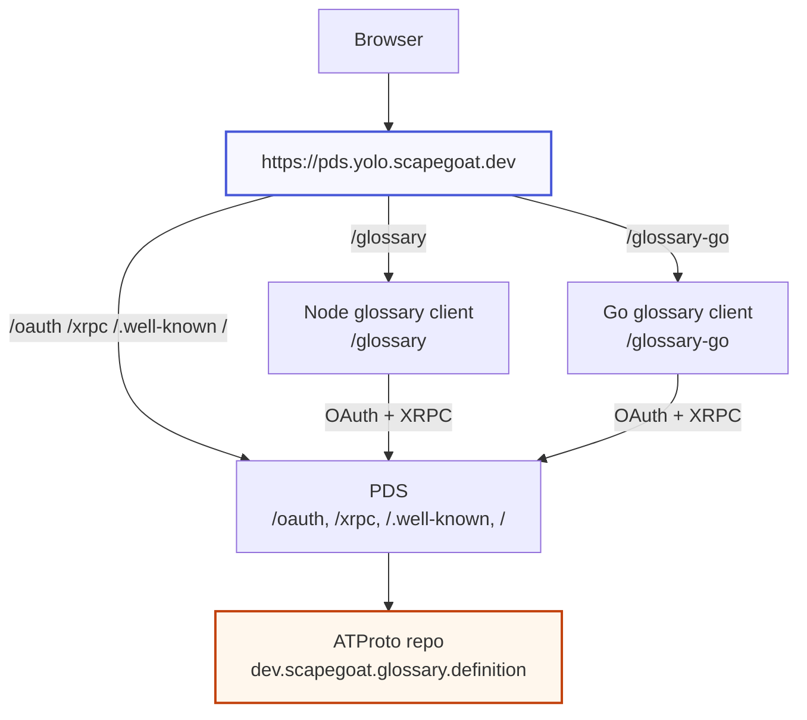
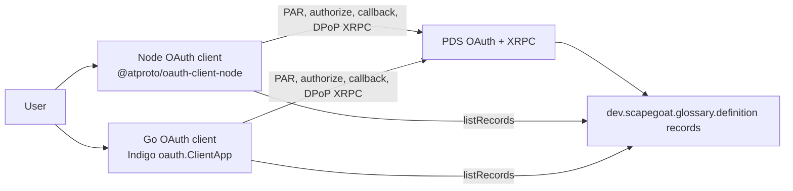
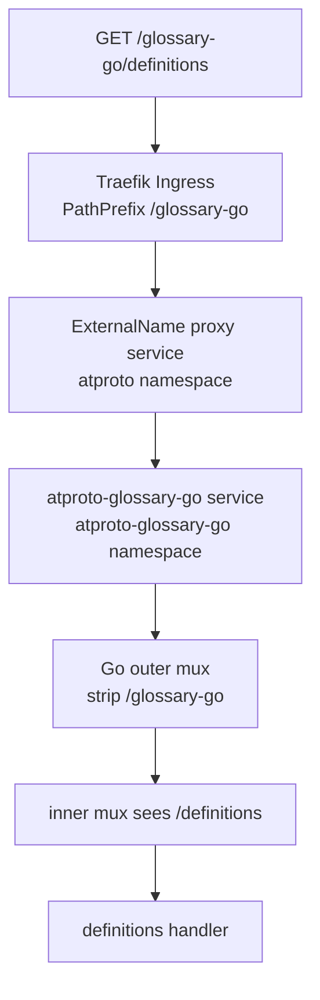
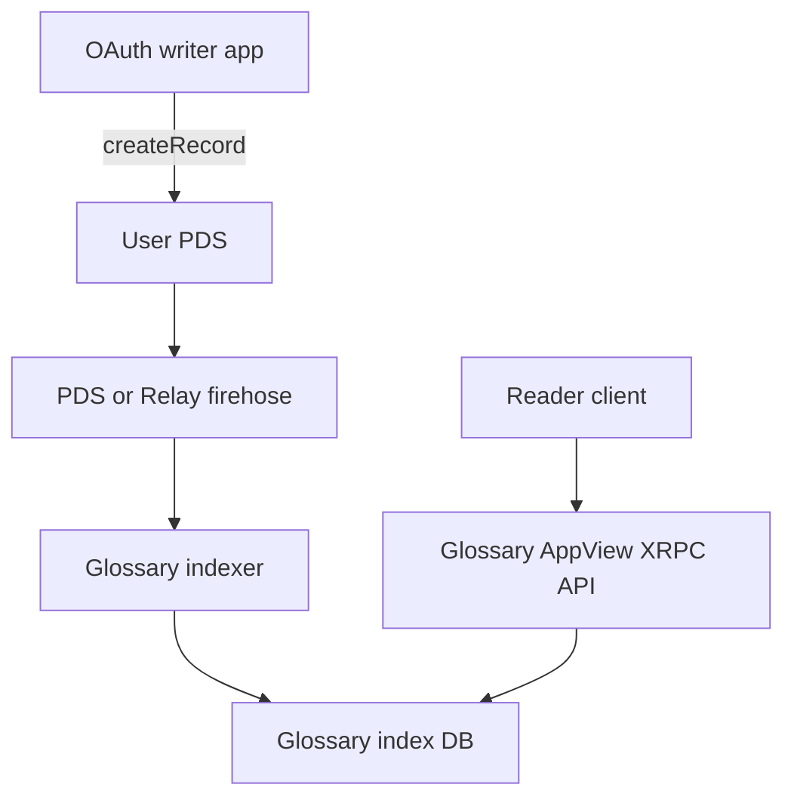

# ATProto OAuth Glossary and Same-Origin Routing — Deep Dive

This report explains the work completed after the July 1 Bluesky PDS deployment report. The earlier report established the PDS as a signed repository host on K3s and proved the first write → commit → firehose loop. The work described here turns that foundation into a small application platform: a Go service layer for agent and robot workflows, two production ATProto OAuth glossary clients, a same-origin routing design under the PDS host, and a source-level investigation of the reference PDS OAuth provider.

The main repositories are `/home/manuel/code/wesen/2026-07-01--pds-lab` for the service layer and glossary applications, and `/home/manuel/code/wesen/2026-03-27--hetzner-k3s` for cluster GitOps. The main tickets are `HK3S-0032` for the Node.js OAuth glossary MVP, `HK3S-0033` for the Go/Indigo OAuth glossary MVP, `HK3S-0034` for same-origin routing under the PDS host, and `HK3S-0035` for the PDS source and same-site Fetch Metadata investigation. The current PDS is still `https://pds.yolo.scapegoat.dev`, version `0.4.5009`, with account `agent1.pds.yolo.scapegoat.dev` and DID `did:plc:3jno7qw5v2yrse5bhtde5tfs`.

> [!summary]
> - The `pds-lab` repository now contains a real service layer: XRPC client code, firehose consumer, CAR decoding, session management, record writers, an agent bridge, a fake agent, a Stack-chan controller, robot WebSocket protocol support, and a devctl plugin for local orchestration.
> - Two independent ATProto OAuth clients were implemented and deployed: a Node.js app using `@atproto/oauth-client-node`, and a Go app using Indigo. Both write and list records in the custom collection `dev.scapegoat.glossary.definition`.
> - A browser security issue shaped the deployment. Sibling subdomains such as `glossary.yolo.scapegoat.dev` caused Chromium to send `Sec-Fetch-Site: same-site`, which the deployed PDS OAuth provider rejected. Cross-site `workshops.tokenmaxxing-rehab.com` hosts worked. The same-origin base-path design now routes `/glossary` and `/glossary-go` under `https://pds.yolo.scapegoat.dev`.
> - The PDS source investigation found that the deployed rejection comes from `@atproto/oauth-provider@0.19.5`, while current upstream `@atproto/oauth-provider@0.19.8` already allows `same-site`. The same-origin route is still useful because it avoids relying on a PDS upgrade and keeps the app surface under the PDS origin.

## What changed since the last report

The July 1 report ended with a working PDS and a minimal Go proof that could write a record and observe the resulting firehose commit. The work since then has three layers.

First, the proof became a service layer. The code stopped being only a command-line demo and grew into long-running processes with clear responsibilities. `agent-bridge` accepts agent activity over HTTP and writes ATProto records. `stackchan-controller` watches PDS records and exposes a small robot WebSocket protocol. `fake-agent` can emit a demonstration sequence. `pds-lab` remains the diagnostic CLI. A devctl plugin now starts and controls the local stack, which makes the multi-process demo reproducible.

Second, the project moved from password-session API experiments to ATProto OAuth web clients. This matters because OAuth is the intended authorization boundary for third-party ATProto applications. The Node client established the baseline with the official SDK. The Go client established that the same behavior can be implemented with Indigo, including persistent OAuth session storage and generic XRPC calls for custom records. Both clients write the same Lexicon-shaped records and can read records created by the other implementation.

Third, the cluster deployment was forced through a browser-origin problem. The PDS acts as both repository host and OAuth authorization server. When an OAuth client runs on a sibling subdomain, the browser does not classify the navigation as cross-site or same-origin. It classifies it as same-site. The deployed OAuth provider rejects that category on `/oauth/authorize`. The system therefore adopted exact same-origin path routing: the PDS, the Node client, and the Go client share the same scheme, host, and port, and differ only by path prefix.



## The service layer: from protocol proof to operating processes

The service layer is organized around the fact that PDS records are the durable coordination primitive. A producer writes a record. The PDS stores it in the account repository, signs a commit, and emits the commit on the firehose. A consumer watches commits, decodes records, and projects them into local behavior. This is the same mechanism the first report proved, but the later work gave it operational shape.

The main binaries are:

| Binary | Role |
|---|---|
| `cmd/agent-bridge` | HTTP service that receives agent activity and writes PDS records. |
| `cmd/fake-agent` | Test producer that emits a demo agent activity sequence through the bridge. |
| `cmd/stackchan-controller` | Firehose consumer and WebSocket server for a robot client. |
| `cmd/pds-lab` | Diagnostic CLI for PDS health, records, and low-level protocol tests. |

The important internal packages are:

| Package | Responsibility |
|---|---|
| `internal/xrpc` | Direct XRPC HTTP client behavior. |
| `internal/firehose` | WebSocket subscription and CBOR event parsing. |
| `internal/car` | CARv1 block reading and CID lookup for commit records. |
| `internal/session` | Session creation and refresh behavior for PDS access tokens. |
| `internal/record` | Record construction and writer behavior. |
| `internal/cursor` | Cursor persistence and recovery behavior. |
| `internal/robot` and `internal/robotws` | Small JSON robot protocol and WebSocket transport. |
| `internal/controller` | Pending approval projection and robot command orchestration. |

The service-layer hardening work resolved two classes of runtime problems. The first was lifecycle correctness. Watchers and controllers must shut down on context cancellation and must not leave goroutines blocked on long-running reads. The second was state recovery. A future cursor can happen when the local cursor is ahead of the PDS's retained history. The implemented recovery resets to replay so the process does not wedge permanently. This is not a perfect head-clamp, but it is an operationally safe first behavior.

The controller also gained a snapshot-before-live rule. When a robot connects, it receives the current pending approvals before it begins receiving live commands. This rule matters because a robot can disconnect and reconnect while approval requests remain unresolved. If the controller only streamed live changes, a reconnecting robot would miss pre-existing pending work.

```text
Robot connection sequence

1. Robot opens WebSocket to controller.
2. Controller sends current pending approval snapshot.
3. Controller subscribes the connection to live command updates.
4. Agent writes approval request record to PDS.
5. Firehose consumer observes commit and updates pending projection.
6. Controller sends robot command.
7. Robot sends approve/deny button event.
8. Controller writes confirmation record back to PDS.
```

The local orchestration changed as well. A devctl plugin now starts the multi-process stack and exposes commands such as `devctl up`, `devctl status`, `devctl logs`, `devctl pds-health`, `devctl records`, `devctl demo`, and `devctl down`. This is not only convenience. It reduces an entire class of mistakes where a human starts one process manually with stale environment variables or forgets to stop a watcher before rerunning a smoke test.

## Why the glossary application exists

The glossary application was deliberately small. It was not built as a product first. It was built as a controlled ATProto OAuth experiment that still writes real, reusable records. The record type is:

```text
dev.scapegoat.glossary.definition
```

A record contains a term, definition, optional context, aliases, tags, source URL, language, and timestamp. The collection name is not a Bluesky namespace. It is a custom application namespace under project control. That is the point: the PDS can host arbitrary Lexicon-shaped public records, and an OAuth client can request permission to write them.

The Node and Go implementations were intentionally both built. The Node implementation validates the official SDK path. The Go implementation validates the Indigo path. They share the same PDS account, the same custom collection, and the same record semantics. If one implementation writes a record and the other can list it, the record format and PDS API usage are not coupled to one SDK.



## The Node OAuth client

The Node glossary client lives in `glossary-node/`. It uses Express, TypeScript, the official `@atproto/oauth-client-node` package, and SQLite through Node 22's `node:sqlite` module. It exposes a minimal server-rendered UI and the OAuth metadata document required by ATProto public web clients.

The key routes are:

```text
GET  /client-metadata.json       OAuth client metadata
GET  /                          login page
POST /login                     start OAuth flow
GET  /oauth/callback            process authorization response
GET  /definitions               list glossary records
GET  /definitions/new           new record form
POST /definitions               create glossary record
POST /logout                    clear app session and revoke best-effort
```

In the standalone deployment, these routes lived at the root of `https://glossary.workshops.tokenmaxxing-rehab.com`. In the same-origin deployment, they are mounted under `/glossary`, and the browser-visible metadata becomes:

```json
{
  "client_id": "https://pds.yolo.scapegoat.dev/glossary/client-metadata.json",
  "redirect_uris": ["https://pds.yolo.scapegoat.dev/glossary/oauth/callback"],
  "scope": "atproto transition:generic",
  "application_type": "web",
  "token_endpoint_auth_method": "none",
  "dpop_bound_access_tokens": true
}
```

The Node persistence model uses SQLite for both OAuth stores and web sessions. The OAuth state store is used while a flow is in progress. The OAuth session store holds the persisted OAuth session material. The web session table maps an opaque browser cookie to an account DID. This separation keeps the browser cookie small and avoids putting access tokens in the browser.

The most important bug found in the Node path was not a protocol bug. Express request close handling was used as an abort signal during login. Browser navigation closes the original HTTP request as soon as the response redirects, so the abort signal could fire while the SDK was still resolving identity or starting the flow. The symptom was an `OAuthResolverError` during login. Removing the premature abort signal fixed the public OAuth flow.

## The Go OAuth client

The Go glossary client lives in `glossary-go/`. It uses the standard `net/http` server, templates, SQLite, and Indigo's `github.com/bluesky-social/indigo/atproto/auth/oauth` package. The Go implementation matters because it shows the OAuth flow can be implemented without the Node SDK and without a client-side JavaScript framework.

The Go server uses `oauth.NewPublicConfig` in production mode. That means the public client metadata URL and callback URL must be stable HTTPS URLs. The server stores OAuth request/session material in SQLite through a custom `ClientAuthStore`, and it stores a signed browser session cookie that references the persisted OAuth session. When a handler needs to call PDS, it resumes the Indigo OAuth session and uses the session's API client.

The custom record calls use generic XRPC rather than generated Lexicon bindings. This was a necessary detail. Indigo generated helpers are optimized for known generated Lexicon types, while this glossary collection is custom. The Go app therefore calls:

```text
com.atproto.repo.listRecords
com.atproto.repo.createRecord
```

with map/struct payloads. This keeps the MVP independent of generated code while preserving the record format.

The Go app required Go `1.26` because the current Indigo revision depends on a newer Go toolchain. That is now recorded in `go.mod`, and the Dockerfile builds with `golang:1.26-bookworm`.

## The first deployment problem: same-site is neither same-origin nor cross-site

The Node app was first deployed at:

```text
https://glossary.yolo.scapegoat.dev
```

The PDS was at:

```text
https://pds.yolo.scapegoat.dev
```

This looked natural because both hosts are under the same cluster domain. It failed in the browser. The PDS rendered a generic invalid-data page, and the logs contained the decisive error:

```text
Forbidden sec-fetch-site header "same-site" (expected same-origin,cross-site,none)
```

The relevant distinction is precise. Browser origin is scheme, host, and port. Browser site is based on the registrable domain. `glossary.yolo.scapegoat.dev` and `pds.yolo.scapegoat.dev` are different origins but the same site. Chromium therefore sent:

```text
Sec-Fetch-Site: same-site
```

The deployed PDS OAuth provider accepted `same-origin`, `cross-site`, and `none`, but not `same-site`. Moving the client to `workshops.tokenmaxxing-rehab.com` made the navigation cross-site, which the PDS accepted. This is why the first stable production URLs were:

```text
https://glossary.workshops.tokenmaxxing-rehab.com
https://glossary-go.workshops.tokenmaxxing-rehab.com
```

Those deployments proved the OAuth clients, but they were not the desired final shape. The desired final shape keeps the apps under the PDS host without patching the PDS.

## The PDS source investigation

The PDS source investigation separated three code layers:

| Layer | Location | Role |
|---|---|---|
| Self-host distribution | `/home/manuel/code/others/atproto/pds` | Dockerfile, installer, compose, small `service/index.ts` wrapper. |
| PDS implementation package | `@atproto/pds` from `bluesky-social/atproto/packages/pds` | Express app, XRPC routes, account management, OAuth provider wiring, repo storage. |
| OAuth provider package | `@atproto/oauth-provider` | OAuth authorization server, login/consent UI, Fetch Metadata validation. |

The self-host distribution is a wrapper. Its `service/index.ts` reads environment variables, builds config and secrets, calls `PDS.create(cfg, secrets)`, starts the app, and adds `/tls-check`. The actual PDS implementation comes from the npm package. This matters because the same-site policy was not in the distribution repository. It was in the transitive OAuth provider package.

The deployed package stack was:

```text
@atproto/pds@0.5.9
@atproto/oauth-provider@0.19.5
```

In that provider version, `/oauth/authorize` had this policy:

```ts
validateFetchSite(req, ['same-origin', 'cross-site', 'none'])
```

A sparse checkout of current upstream `bluesky-social/atproto` showed that this changed in `@atproto/oauth-provider@0.19.8`:

```ts
validateFetchSite(req, ['same-origin', 'same-site', 'cross-site', 'none'])
```

The changelog entry states: "Allow same-site OAuth authorization page requests." This means sibling-subdomain OAuth is not conceptually impossible. It is unsupported by the currently deployed PDS image. There are therefore three valid paths:

1. Upgrade the PDS distribution to a version that includes the newer OAuth provider.
2. Patch the deployed dependency stack locally.
3. Avoid the issue by using exact same-origin path routing.

The project chose the third path for now. It is operationally conservative. It does not require changing the PDS image, and it uses the deployed provider's existing `same-origin` allowlist.

## Same-origin routing and base-path support

Same-origin routing requires more than an Ingress rule. The apps must generate URLs that include their public base path. OAuth metadata, callback URLs, redirects, links, forms, and cookies all need to agree. If the backend serves `/oauth/callback` but the client metadata says `/glossary/oauth/callback`, the OAuth flow fails. If forms post to `/definitions` while the app is mounted at `/glossary`, the browser leaves the app prefix and hits the PDS catch-all instead.

Both apps now support this environment contract:

```text
PUBLIC_BASE_URL=https://pds.yolo.scapegoat.dev
BASE_PATH=/glossary       # Node
BASE_PATH=/glossary-go    # Go
```

Each app derives:

```text
appBaseUrl = PUBLIC_BASE_URL + BASE_PATH
route(path) = BASE_PATH + path
absoluteRoute(path) = PUBLIC_BASE_URL + route(path)
cookiePath = BASE_PATH or /
```

The Node implementation adds these fields to its config and mounts an Express router under `config.basePath`. It keeps an unprefixed `/healthz` route for Kubernetes probes. It scopes the browser session cookie to `/glossary`, which prevents the glossary cookie from being sent to PDS `/oauth` and `/xrpc` routes.

The Go implementation adds `BasePath`, `AppBaseURL`, `Route`, `AbsoluteRoute`, and `CookiePath` to config. Its `Handler` builds an inner `ServeMux` with root-relative routes, then mounts it under the base path with `http.StripPrefix`. Templates use a `route` function rather than hard-coded root-relative strings.



## The Kubernetes routing detail

The glossary workloads remain in their own namespaces:

```text
atproto-glossary-node
atproto-glossary-go
```

The PDS Ingress lives in the `atproto` namespace. Standard Kubernetes Ingress backends reference Services in the same namespace as the Ingress. The implemented bridge is a pair of same-namespace `ExternalName` services in `atproto`:

```text
atproto/atproto-glossary-node-proxy -> atproto-glossary-node.atproto-glossary-node.svc.cluster.local
atproto/atproto-glossary-go-proxy   -> atproto-glossary-go.atproto-glossary-go.svc.cluster.local
```

The PDS Ingress then routes:

```text
/glossary-go -> atproto-glossary-go-proxy
/glossary    -> atproto-glossary-node-proxy
/            -> pds
```

This initially produced 404s. The Ingress object contained the correct path rules, but Traefik ignored the `ExternalName` backends. The Traefik logs showed the exact reason:

```text
externalName services not allowed: atproto/atproto-glossary-go-proxy
externalName services not allowed: atproto/atproto-glossary-node-proxy
```

K3s manages Traefik through a `HelmChartConfig`, not by hand-editing the Deployment. The fix was to add:

```text
--providers.kubernetesingress.allowExternalNameServices=true
--providers.kubernetescrd.allowExternalNameServices=true
```

to `gitops/kustomize/traefik-observability/traefik-helmchartconfig.yaml`. After Argo synced the HelmChartConfig and K3s reinstalled Traefik, the prefix routes started resolving to the app services. Public metadata and health checks then passed:

```text
https://pds.yolo.scapegoat.dev/glossary/healthz                  -> ok
https://pds.yolo.scapegoat.dev/glossary/client-metadata.json     -> Node metadata under /glossary
https://pds.yolo.scapegoat.dev/glossary-go/healthz               -> ok
https://pds.yolo.scapegoat.dev/glossary-go/client-metadata.json  -> Go metadata under /glossary-go
```

Traefik access logs confirmed that the `/glossary` and `/glossary-go` routers were selected and that the upstream service URL was the target service DNS name, not the PDS pod.

## Deployment state

The relevant pds-lab commits are:

| Commit | Meaning |
|---|---|
| `047653e` | devctl plugin and local service orchestration. |
| `64e2121` | Phase A service-layer shutdown/session hardening. |
| `e99c9a9` | Phase B pending approval snapshot flow. |
| `8b4dee1` through `474202f` | Node OAuth glossary MVP, persistence, tests, containerization, login fix, public smoke. |
| `f32cc18` through `e8a96b0` | Go OAuth glossary MVP, Indigo wiring, containerization, public smoke. |
| `de2ad02` | Same-origin routing design ticket. |
| `d1fdee9` | Node and Go base-path implementation. |

The relevant k3s commits are:

| Commit | Meaning |
|---|---|
| `4375a57` through `9cd57f8` | Node glossary deployment and cross-site hostname migration. |
| `0d82877` | Go glossary deployment. |
| `5d2bde5` | PDS same-site source investigation and upstream checkout. |
| `0c7e510` | Route glossary apps under the PDS origin. |
| `87b423c` | Allow Traefik ExternalName backends. |

The current images are:

```text
ghcr.io/wesen/pds-lab-glossary-node:sha-d1fdee9
ghcr.io/wesen/pds-lab-glossary-go:sha-d1fdee9
```

The Argo applications reached `Synced/Healthy` after the rollout:

```text
bluesky-pds             Synced Healthy
atproto-glossary-node   Synced Healthy
atproto-glossary-go     Synced Healthy
traefik-observability   Synced Healthy
```

The public metadata smoke passed under the PDS host. A Node browser OAuth flow also reached the PDS sign-in page, succeeded through sign-in and consent, and returned to `https://pds.yolo.scapegoat.dev/glossary/definitions`. The browser session reset before the final form submission could be captured as a new record, so the remaining validation item is a complete record-creation smoke for both Node and Go under the PDS host. The earlier cross-site deployments already proved record creation for both SDKs, including one Node-created record and one Go-created record that each app could list.

## What these apps are, and what they are not

The glossary apps are OAuth clients. They are not AppViews.

An OAuth client authenticates a user, receives scoped authority, and calls the user's PDS. That is what the glossary apps do. They serve a small web UI, run an OAuth flow, and call `com.atproto.repo.createRecord` and `com.atproto.repo.listRecords` against the authenticated user's repository.

An AppView is a different ATProto role. It consumes repository data, indexes it into an application-specific database, and serves read APIs optimized for application queries. Bluesky's AppView indexes posts, follows, profiles, feeds, and notifications. A glossary AppView would index `dev.scapegoat.glossary.definition` records from many accounts and serve search/list/read APIs that do not require every reader to authenticate to every PDS.



A glossary AppView makes sense when there are multiple writers and a need for global search, deduplication, moderation, ranking, or unauthenticated public reads. It is not necessary for the current MVP. The current apps are still the right first step because they validate OAuth, custom records, and cross-SDK compatibility. The AppView should be built only after the record namespace and record shape are stable enough to index.

## Reuse boundaries in the PDS source

The PDS source investigation also answered a framework question. The self-host PDS repository can be used as a distribution reference, but the actual reusable code is in `@atproto/pds` inside the `bluesky-social/atproto` monorepo. The strongest supported reuse boundary is:

```ts
import { PDS, readEnv, envToCfg, envToSecrets } from '@atproto/pds'

const env = readEnv()
const cfg = envToCfg(env)
const secrets = envToSecrets(env)
const pds = await PDS.create(cfg, secrets)

pds.app.get('/internal/example', handler)
await pds.start()
```

This is an embedding boundary. It lets a custom process run the reference PDS and add routes or middleware around it. It is not the same as a fully modular PDS framework. The package root exports `PDS`, `AppContext`, config helpers, lexicons, `DiskBlobStore`, `Database`, repo preparation helpers, sequencer helpers, and scripts. Many route builders and manager internals exist in `dist/`, but the package `exports` field exposes only the root package and `package.json`. Depending on deep internal imports would be version-fragile.

The practical conclusion is straightforward. Use the reference PDS as a black-box service or as an embedded `PDS.create` server. Fork or upstream new public APIs if deep route-level customization is required. Do not treat the published package as a stable grab-bag of internal modules.

## Current validation evidence

The current validation evidence is split by layer.

At the application layer:

```text
cd glossary-node
pnpm check
pnpm test
pnpm build
```

passed with tests for base-path normalization, prefixed OAuth metadata, prefixed rendered links/forms, and SQLite session stores.

At the Go layer:

```text
go test ./... -count=1
```

passed with tests for base-path config helpers, prefixed metadata, prefixed login page output, cookie path, record construction, stores, firehose, and existing internal packages.

At the image layer:

```text
ghcr.io/wesen/pds-lab-glossary-node:sha-d1fdee9
ghcr.io/wesen/pds-lab-glossary-go:sha-d1fdee9
```

were built and pushed.

At the cluster layer:

```text
kubectl -n argocd get applications bluesky-pds atproto-glossary-node atproto-glossary-go traefik-observability
```

reported `Synced/Healthy`. Public smoke checks returned `ok` for both health endpoints and returned metadata with the expected same-origin client IDs and callback URLs.

## Technical lessons

The first lesson is that browser origin policy is part of OAuth architecture. Hostnames that look equivalent in DNS can produce different Fetch Metadata classifications in the browser. For this PDS version, `same-origin` and `cross-site` worked, while `same-site` did not. The correct deployment response was to make the public OAuth client URLs exact same-origin with the authorization server, not to assume every subdomain under the same registrable domain would behave the same.

The second lesson is that base-path support must be implemented as an application feature, not delegated entirely to the proxy. A proxy can route `/glossary` to a backend, but it cannot fix a metadata document that advertises `/oauth/callback`, a form that posts to `/definitions`, or a cookie scoped to `/`. The applications need a first-class `BASE_PATH` configuration and URL helpers used everywhere.

The third lesson is that standard Kubernetes Ingress namespace rules matter. An Ingress cannot directly backend to a Service in another namespace. `ExternalName` proxy Services solve that without moving workloads, but Traefik disables ExternalName backends by default. The cluster-level ingress controller setting is therefore part of the application deployment, not an unrelated platform detail.

The fourth lesson is that the PDS is both resource server and authorization server in the self-host deployment. The same host serves `/xrpc` repository APIs and `/oauth` login/consent/token endpoints. That unification is convenient for a small deployment, and it explains why same-origin path routing is viable: the authorization server and protected resource server already share the same public origin.

## Open work

The immediate remaining work is validation, not architecture:

- Complete a fresh Node record-creation browser smoke under `https://pds.yolo.scapegoat.dev/glossary`.
- Complete a fresh Go login and record-creation browser smoke under `https://pds.yolo.scapegoat.dev/glossary-go`.
- Verify PDS logs show no `Forbidden sec-fetch-site header "same-site"` entries for same-origin flows.
- Decide whether to keep the `workshops.tokenmaxxing-rehab.com` routes as compatibility paths or retire them after same-origin smokes pass.

The next architectural decision is whether to build a glossary AppView. The answer should depend on product requirements, not protocol enthusiasm. If the glossary remains a per-account OAuth writing demo, no AppView is necessary. If it becomes a shared searchable glossary across many accounts, an AppView is the right next component: subscribe to firehose events, index glossary records, and serve application-specific read APIs.

## References

Primary repositories:

- `/home/manuel/code/wesen/2026-07-01--pds-lab`
- `/home/manuel/code/wesen/2026-03-27--hetzner-k3s`
- `/home/manuel/code/others/atproto/pds`
- `/home/manuel/code/others/bluesky-social/atproto`

Primary ticket docs:

- `HK3S-0032`: `/home/manuel/code/wesen/2026-07-01--pds-lab/ttmp/2026/07/02/HK3S-0032--atproto-oauth-glossary-mvp-in-node-js-with-official-sdk`
- `HK3S-0033`: `/home/manuel/code/wesen/2026-07-01--pds-lab/ttmp/2026/07/02/HK3S-0033--atproto-oauth-glossary-mvp-in-go-with-indigo`
- `HK3S-0034`: `/home/manuel/code/wesen/2026-07-01--pds-lab/2026/07/03/HK3S-0034--same-origin-atproto-oauth-glossary-routing-under-pds-host`
- `HK3S-0035`: `/home/manuel/code/wesen/2026-03-27--hetzner-k3s/2026/07/03/HK3S-0035--pds-fetch-metadata-and-reuse-architecture-investigation`

Live endpoints:

- PDS: `https://pds.yolo.scapegoat.dev`
- Node same-origin glossary: `https://pds.yolo.scapegoat.dev/glossary`
- Go same-origin glossary: `https://pds.yolo.scapegoat.dev/glossary-go`
- Existing Node cross-site route: `https://glossary.workshops.tokenmaxxing-rehab.com`
- Existing Go cross-site route: `https://glossary-go.workshops.tokenmaxxing-rehab.com`
