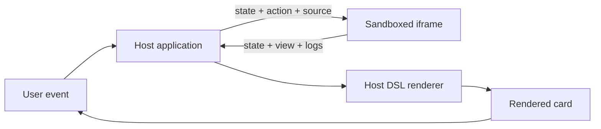
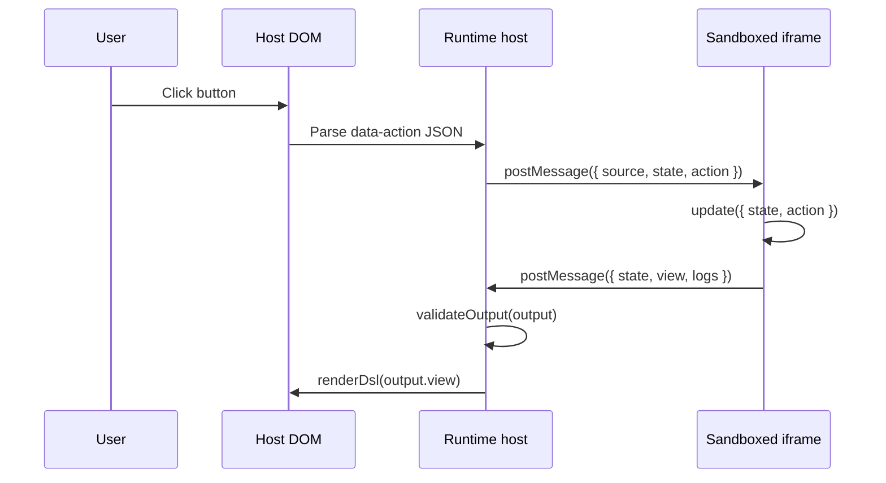
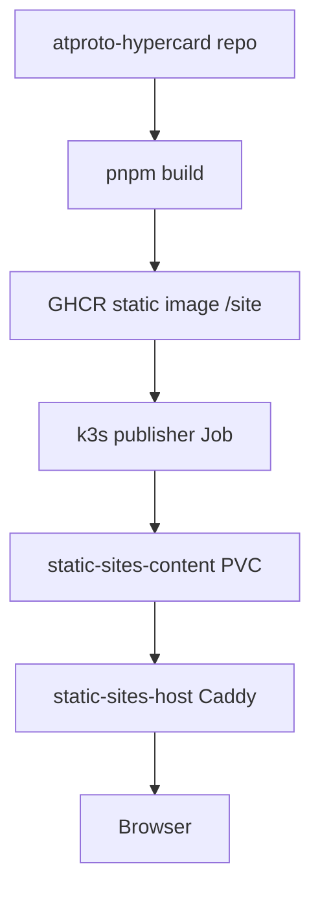

# ATProto HyperCard: Browser-Sandboxed FRP Runtime

This report explains the current ATProto HyperCard project as a technical system. The project began as a design ticket for an AT Protocol-hosted HyperCard-like application, then moved into a deployed static browser application that can execute interactive cards. The current implementation is not only an OAuth proof of concept. It includes a JavaScript runtime boundary, a rendering DSL, an action protocol, local stack editing, and deployment through the existing k3s static-site infrastructure.

The central design decision is to run stack code in a browser sandbox while keeping rendering under host control. A stack program receives state and an action, computes the next state, and returns a view tree. The host validates and renders that tree as card UI. User interactions create new actions, and those actions are sent back into the sandbox. This produces a deterministic interaction loop that can support HyperCard-style stacks without giving stack code direct access to the host document.

> [!summary]
> - The app is deployed at `https://atproto-hypercard.yolo.scapegoat.dev/` as a static Vite bundle served by the k3s `static-sites-host`.
> - The viewer executes stack JavaScript in a sandboxed iframe and exchanges `{ state, action }` inputs for `{ state, view, logs }` outputs.
> - The current sample stack includes a home card, counter card, form editor card, little table card, and poker card.
> - The ATProto layer is present for browser OAuth and future record persistence, but the core viewer can be tested without signing in.

## Why this note exists

The project changed shape quickly. The first design proposed a backend-for-frontend because that is the conservative way to manage OAuth sessions and PDS writes. The next design moved the app into a static browser application using `@atproto/oauth-client-browser`, DPoP, and direct PDS writes. The first deployed version then proved the OAuth and static hosting path, but did not yet execute cards. The current version implements the missing runtime: an interactive HyperCard viewer with JavaScript stack execution.

A future reader should understand four things after reading this note:

1. What has actually been built.
2. How the sandboxed FRP protocol works.
3. How the app is deployed as a static site.
4. What must be hardened before running untrusted public stacks by default.

The source repository is:

```text
/home/manuel/code/wesen/2026-07-02--atproto-hypercard
```

The deployment repository is:

```text
/home/manuel/code/wesen/2026-03-27--hetzner-k3s
```

The live app is:

```text
https://atproto-hypercard.yolo.scapegoat.dev/
```

## Current status

The project is in an active prototype phase. The deployed app can run a multi-card interactive sample stack. It can be tested without ATProto login by opening the live URL, selecting the `Viewer` tab, and clicking `Run / reset`. The `JS Source` tab exposes the source of the current stack program. The `Stacks` tab can select and clone local stacks. The `ATProto` tab still contains browser OAuth, CORS testing, and record publish/load hooks.

The latest relevant implementation commit in the app repository is:

```text
57a4bcd Fix sandbox CSP and expand sample hypercards
```

The latest relevant deployment commit in the k3s repository is:

```text
bd9dc19 Deploy expanded hypercard sample stack
```

The deployed artifact image is:

```text
ghcr.io/wesen/atproto-hypercard-static:sha-57a4bcdc6999
```

The current deployed bundle references:

```text
index-Bbc8uhf1.js
index-CpaCJKzq.css
```

The local and deployed smoke tests exercise this path:

```text
Run / reset
Home -> Counter -> +1
Home -> Form editor -> change Name to Manuel -> Add to table -> View table
Home -> Poker -> Deal hand
```

## Project shape

The codebase is small. The important files are concentrated in the static browser app:

```text
/home/manuel/code/wesen/2026-07-02--atproto-hypercard/
├── apps/pds-spa/
│   ├── index.html
│   ├── package.json
│   ├── public/oauth/client-metadata.json
│   ├── src/main.ts
│   ├── src/styles.css
│   ├── tsconfig.json
│   └── vite.config.ts
├── Dockerfile.static
├── package.json
├── pnpm-lock.yaml
├── pnpm-workspace.yaml
└── ttmp/2026/07/02/ATPROTO-HYPERCARD-HOSTED--at-protocol-hosted-hypercard/
    ├── design-doc/
    ├── reference/
    └── sources/
```

The static app is intentionally implemented in one TypeScript file for the current prototype. That makes the runtime path inspectable. The key symbols in `apps/pds-spa/src/main.ts` are:

| Symbol | Responsibility |
| --- | --- |
| `RenderNode` | Defines the rendering DSL returned by sandboxed stack programs. |
| `SandboxOutput` | Defines the output contract `{ state, view, logs }`. |
| `HyperStack` | Holds stack metadata, JavaScript source, initial state, current state, and last rendered view. |
| `sampleScript` | Provides the current multi-card executable sample stack. |
| `renderDsl` | Converts the rendering DSL into escaped host DOM HTML. |
| `ensureSandbox` | Creates the sandboxed iframe and installs the evaluation bridge. |
| `evalInSandbox` | Sends source, state, and action into the iframe and waits for a result. |
| `runStack` | Executes one FRP step and stores the returned state and view. |
| `publishActiveStack` | Writes an executable stack record and card record to the authenticated PDS. |

The deployment files live in the k3s GitOps repository:

```text
/home/manuel/code/wesen/2026-03-27--hetzner-k3s/gitops/kustomize/atproto-hypercard/
├── ingress.yaml
├── kustomization.yaml
├── publish-job.yaml
└── serviceaccount.yaml

/home/manuel/code/wesen/2026-03-27--hetzner-k3s/gitops/applications/atproto-hypercard.yaml
```

## The runtime model

The viewer is built around a functional update protocol. A stack program is JavaScript source text. The host does not allow that source to write into the host document. Instead, the stack program must define an `update(input)` function. The host calls `update` through a sandbox boundary. The stack returns data. The host renders that data.

The contract is small:

```ts
type SandboxInput = {
  state: unknown
  action: unknown
}

type SandboxOutput = {
  state: unknown
  view: RenderNode
  logs?: string[]
}
```

The `state` object is owned conceptually by the stack. The host stores it between evaluations, but it does not interpret its internal shape. The `action` object is created by the host when the user interacts with rendered controls. The `view` object is owned conceptually by the host. The stack decides what view tree to return, but the host decides how each node is escaped, styled, and connected to DOM events.

The important boundary is this:



The stack never receives a DOM node. The stack never receives the host `document`. The stack returns a `RenderNode` tree. The renderer escapes strings and emits HTML for the supported node types. That means the current implementation gives stack code a way to compute behavior without giving it direct authority over the host page.

## The rendering DSL

The current DSL is deliberately small. It is just large enough to build the sample application and prove the protocol.

```ts
type RenderNode =
  | { type: 'card'; id?: string; title?: string; background?: string; children: RenderNode[] }
  | { type: 'text'; id?: string; text: string; x: number; y: number; w: number; h: number; className?: string }
  | { type: 'button'; id?: string; text: string; x: number; y: number; w: number; h: number; action: unknown; className?: string }
  | { type: 'input'; id?: string; label?: string; value: string; x: number; y: number; w: number; h: number; action: unknown; className?: string }
  | { type: 'table'; id?: string; columns: string[]; rows: string[][]; x: number; y: number; w: number; h: number; className?: string }
  | { type: 'image'; id?: string; src: string; alt?: string; x: number; y: number; w: number; h: number }
```

Each visual node has absolute coordinates. This is not the only layout model the project could use, but it is a good first fit for HyperCard-style cards because each card is a fixed composition surface. The current card surface is `640px × 420px`, and each child node places itself within that space.

The host renderer is responsible for escaping all text fields:

```ts
function renderDsl(node: RenderNode): string {
  if (node.type === 'card') {
    return `<div class="hypercard" style="background:${escapeHtml(node.background ?? '#fff')}">${node.children.map(renderDsl).join('')}</div>`
  }
  const style = `left:${node.x}px;top:${node.y}px;width:${node.w}px;height:${node.h}px;`
  if (node.type === 'text') return `<div class="hc-part hc-field ${escapeHtml(node.className ?? '')}" style="${style}">${escapeHtml(node.text)}</div>`
  if (node.type === 'button') return `<button type="button" class="hc-part hc-button ${escapeHtml(node.className ?? '')}" style="${style}" data-action="${escapeHtml(JSON.stringify(node.action))}">${escapeHtml(node.text)}</button>`
  if (node.type === 'input') return `<label class="hc-part hc-input ${escapeHtml(node.className ?? '')}" style="${style}"><span>${escapeHtml(node.label ?? '')}</span><input value="${escapeHtml(node.value)}" data-input-action="${escapeHtml(JSON.stringify(node.action))}" /></label>`
  if (node.type === 'table') return `<div class="hc-part hc-table ${escapeHtml(node.className ?? '')}" style="${style}"><table><thead><tr>${node.columns.map((c) => `<th>${escapeHtml(c)}</th>`).join('')}</tr></thead><tbody>${node.rows.map((row) => `<tr>${row.map((cell) => `<td>${escapeHtml(cell)}</td>`).join('')}</tr>`).join('')}</tbody></table></div>`
  return ``
}
```

The implementation is still a prototype. It escapes text and attributes, but it does not yet perform full structural schema validation. A production-grade version should validate `RenderNode` output before rendering. It should reject unexpected node types, oversized trees, invalid coordinates, unsupported URL schemes, excessive string lengths, and action payloads that exceed size limits.

## The action path

Rendered controls carry action payloads. A button node stores an `action` object in a `data-action` attribute after JSON serialization and HTML escaping. When the user clicks the button, the host parses the action and calls `runStack(action, false)`.

```ts
document
  .querySelectorAll<HTMLButtonElement>('[data-action]')
  .forEach((button) =>
    button.addEventListener('click', () =>
      void runStack(JSON.parse(button.dataset.action ?? '{}'), false)
    )
  )
```

Input nodes use a related path. The host reads the action template from `data-input-action`, adds the current input value, and sends the resulting action to the sandbox.

```ts
document
  .querySelectorAll<HTMLInputElement>('[data-input-action]')
  .forEach((input) =>
    input.addEventListener('change', () => {
      const action = JSON.parse(input.dataset.inputAction ?? '{}') as Record<string, unknown>
      action.value = input.value
      void runStack(action, false)
    })
  )
```

This design keeps the stack program focused on state transitions. The host handles DOM events. The stack receives the event as data. The stack returns the next view as data. The host renders it.

The sequence for a button click is:



The host stores the returned `state` and `view` on the active `HyperStack` object:

```ts
async function runStack(action: unknown, reset: boolean): Promise<void> {
  await runBusy('Executing HyperCard sandbox…', async () => {
    const stack = activeStack()
    const inputState = reset
      ? structuredClone(stack.initialState)
      : (stack.currentState ?? structuredClone(stack.initialState))
    const output = await evalInSandbox(stack.script, inputState, action)
    validateOutput(output)
    stack.currentState = output.state
    stack.lastView = output.view
    stack.logs = output.logs ?? []
    state.detail = { input: { state: inputState, action }, output }
    return state.detail
  })
}
```

The `reset` flag decides whether the next evaluation starts from `initialState` or the last returned state. This is why `Run / reset` returns to the home card with the initial counter, form, table, and poker state, while clicking buttons evolves the stack state.

## The sandbox boundary

The sandbox runs in an iframe created by `ensureSandbox`. The iframe uses `sandbox="allow-scripts"` and does not use `allow-same-origin`. That matters because scripts can run, but the sandboxed document does not share the parent origin.

The iframe document is generated with `srcdoc`. Its CSP is currently:

```html
<meta http-equiv="Content-Security-Policy"
  content="default-src 'none'; script-src 'unsafe-inline' 'unsafe-eval'; connect-src 'none'; img-src data:; style-src 'unsafe-inline'">
```

The `unsafe-eval` entry is necessary in the current implementation because the sandbox evaluates stack source with `new Function(...)`. The project hit this failure directly:

```json
{
  "name": "EvalError",
  "message": "call to Function() blocked by CSP",
  "stack": "@about:srcdoc:9:20\n"
}
```

The fix was not to remove the sandbox. The fix was to scope `unsafe-eval` to the iframe document that already lacks same-origin access and network access. The parent application still owns the host DOM and the rendering process.

The iframe setup currently looks like this:

```ts
function ensureSandbox(): HTMLIFrameElement {
  if (sandbox) return sandbox
  sandbox = document.createElement('iframe')
  sandbox.sandbox.add('allow-scripts')
  sandbox.style.display = 'none'
  sandboxReady = new Promise((resolve) => {
    sandbox!.addEventListener('load', () => resolve(), { once: true })
  })
  sandbox.srcdoc = `<!doctype html>...`
  document.body.appendChild(sandbox)
  return sandbox
}
```

The readiness promise fixes another class of failure. Without waiting for the iframe `load` event, the host can send the first `postMessage` before the sandbox installs its `message` listener. That produces a first-call error or timeout. The current `evalInSandbox` path calls `ensureSandbox()` and then waits for `sandboxReady` before sending the message.

```ts
async function evalInSandbox(source: string, stateValue: unknown, action: unknown): Promise<SandboxOutput> {
  const frame = ensureSandbox()
  await sandboxReady
  const id = ++messageSeq
  ...
  frame.contentWindow?.postMessage({ type: 'hypercard:eval', id, source, state: stateValue, action }, '*')
}
```

The sandbox posts either a result or an error back to the parent:

```js
safePost({ type: 'hypercard:result', id: msg.id, output })
```

or:

```js
safePost({
  type: 'hypercard:error',
  id: msg.id,
  error: { name: error.name, message: error.message, stack: error.stack }
})
```

The host correlates messages with `messageSeq` ids and a `pending` map. Each request has a timeout. If the sandbox does not answer within the timeout, the host rejects the request.

## The sample stack

The deployed sample stack is intentionally more than a navigation demo. It covers state mutation, input handling, table rendering, and a small randomized game state.

The sample stack defines:

```js
function update(input) {
  const action = input.action || { type: 'init' }
  const state = input.state || initialState()

  if (!state.rows) Object.assign(state, initialState())

  if (action.type === 'go') state.card = action.card
  if (action.type === 'home') state.card = 'home'
  if (action.type === 'counter') state.card = 'counter'
  if (action.type === 'form') state.card = 'form'
  if (action.type === 'table') state.card = 'table'
  if (action.type === 'poker') state.card = 'poker'

  if (action.type === 'inc') state.count += 1
  if (action.type === 'dec') state.count -= 1
  if (action.type === 'setName') state.form.name = action.value
  if (action.type === 'setRole') state.form.role = action.value
  if (action.type === 'addRow') state.rows.push([String(state.rows.length + 1), state.form.name || 'Anon', state.form.role || 'Visitor'])
  if (action.type === 'clearRows') state.rows = [['1', 'Ada', 'Programmer'], ['2', 'Bill', 'Designer']]
  if (action.type === 'deal') state.hand = dealHand()
  if (action.type === 'bet') state.chips = Math.max(0, state.chips - 5); if (action.type === 'bet') state.hand = dealHand()

  return {
    state,
    logs: [
      'handled action: ' + action.type,
      'card=' + state.card,
      'count=' + state.count,
      'chips=' + state.chips
    ],
    view: render(state)
  }
}
```

There are five cards:

| Card | Purpose | State touched |
| --- | --- | --- |
| Home | Presents navigation into the sample stack. | `state.card` |
| Counter | Demonstrates repeated state mutation through button actions. | `state.count` |
| Form editor | Demonstrates input values flowing into action payloads. | `state.form.name`, `state.form.role` |
| Little table | Demonstrates structured view rendering from state. | `state.rows` |
| Poker | Demonstrates randomized state update and game-like feedback. | `state.hand`, `state.chips` |

The sample is a useful test because every card exercises a different part of the protocol. Counter only needs button actions. Form editor needs input actions. Table needs structured DSL output. Poker needs a nontrivial state update that changes rendered text.

## ATProto integration

The current application includes ATProto integration, but the viewer does not require authentication. This separation is important. A user can open the static app and execute the sample stack without signing in. Authentication is needed only for publishing or loading executable stack records from a PDS.

OAuth client metadata is served from:

```text
https://atproto-hypercard.yolo.scapegoat.dev/oauth/client-metadata.json
```

The file is:

```json
{
  "client_id": "https://atproto-hypercard.yolo.scapegoat.dev/oauth/client-metadata.json",
  "client_name": "ATProto HyperCard",
  "client_uri": "https://atproto-hypercard.yolo.scapegoat.dev/",
  "redirect_uris": ["https://atproto-hypercard.yolo.scapegoat.dev/callback"],
  "scope": "atproto transition:generic",
  "grant_types": ["authorization_code", "refresh_token"],
  "response_types": ["code"],
  "token_endpoint_auth_method": "none",
  "application_type": "web",
  "dpop_bound_access_tokens": true
}
```

The app uses:

```ts
import { Agent } from '@atproto/api'
import { BrowserOAuthClient } from '@atproto/oauth-client-browser'
```

The `createClient` function uses a loopback client for local development and the production client metadata URL for the deployed site:

```ts
async function createClient(): Promise<BrowserOAuthClient> {
  if (isLoopbackOrigin()) return new BrowserOAuthClient({ handleResolver: 'https://bsky.social' })
  return BrowserOAuthClient.load({ clientId: CLIENT_ID, handleResolver: 'https://bsky.social' })
}
```

The current publish path stores executable stack content across two collections:

```ts
const STACK_COLLECTION = 'dev.hypercard.app.stack'
const CARD_COLLECTION = 'dev.hypercard.app.card'
```

`publishActiveStack` writes a stack metadata record and a card record that contains the JavaScript source and initial state:

```ts
const stackRecord = {
  $type: STACK_COLLECTION,
  title: stack.title,
  description: stack.description,
  schemaVersion: 2,
  runtime: 'browser-js-frp-sandbox',
  createdAt: stack.createdAt,
  updatedAt: now
}

const cardRecord = {
  $type: CARD_COLLECTION,
  stack: stackResult.data.uri,
  name: 'Executable JS FRP stack',
  ordinal: 0,
  script: stack.script,
  initialState: stack.initialState,
  createdAt: now,
  updatedAt: now
}
```

This is still a prototype record shape. The final Lexicon should make the runtime explicit, validate source length, define the allowed initial-state representation, and separate executable source from visual card records if the application later supports non-JavaScript or precompiled runtimes.

## Static deployment

The app is a Vite static application. It is packaged as a Docker artifact image, not as a long-running web server. `Dockerfile.static` builds the app and copies the resulting `dist/` directory into `/site`:

```dockerfile
FROM node:22-alpine AS build
WORKDIR /work
RUN corepack enable
COPY package.json pnpm-lock.yaml* pnpm-workspace.yaml ./
COPY apps/pds-spa/package.json apps/pds-spa/package.json
RUN pnpm install --frozen-lockfile
COPY apps/pds-spa apps/pds-spa
RUN pnpm --filter @wesen/atproto-hypercard-pds-spa build

FROM alpine:3.20
WORKDIR /
COPY --from=build /work/apps/pds-spa/dist/ /site/
RUN find /site -type f | sort > /site-manifest.txt \
  && test -f /site/index.html \
  && test -f /site/oauth/client-metadata.json
```

The k3s static hosting pipeline reads `/site` from the artifact image. A one-shot Kubernetes Job copies those files to the shared static-sites PVC and repoints a `current` symlink for the hostname.



The current publisher release in `/home/manuel/code/wesen/2026-03-27--hetzner-k3s/gitops/kustomize/atproto-hypercard/publish-job.yaml` uses:

```text
ghcr.io/wesen/atproto-hypercard-static:sha-57a4bcdc6999
```

The Argo CD app is:

```text
atproto-hypercard
```

and the ingress host is:

```text
atproto-hypercard.yolo.scapegoat.dev
```

The important point is that the HyperCard app is static. The runtime, editor, OAuth client, and ATProto record writes all run in the browser. The only server-side behavior in the current deployment is static file serving.

## Testing and validation

The project now has a real browser smoke test, run manually through Playwright from the command line. It starts a local Vite dev server, launches Chromium, clicks through the sample stack, edits a form field, pushes a row into the table, opens the poker card, and fails if browser console errors are emitted.

The tested path is:

```text
Run / reset
Home -> Counter -> +1
Home -> Form editor -> change Name to Manuel
Add to table -> View table
Home -> Poker -> Deal hand
```

The deployed site was also tested with the same interaction path:

```text
https://atproto-hypercard.yolo.scapegoat.dev/
```

A minimal local test command is:

```bash
cd /home/manuel/code/wesen/2026-07-02--atproto-hypercard
pnpm install
pnpm --filter @wesen/atproto-hypercard-pds-spa dev -- --port 4177
```

Then open:

```text
http://127.0.0.1:4177/
```

For production validation, the deployed HTML should include the current artifact names:

```bash
curl -fsSL https://atproto-hypercard.yolo.scapegoat.dev/ \
  | rg 'index-Bbc8uhf1|index-CpaCJKzq'
```

The cluster state should show the Argo app and publisher Job as healthy or complete:

```bash
cd /home/manuel/code/wesen/2026-03-27--hetzner-k3s
export KUBECONFIG=$PWD/.cache/kubeconfig-tailnet.yaml
kubectl -n argocd get application atproto-hypercard
kubectl -n static-sites get job/publish-atproto-hypercard-sha-57a4bcdc6999
```

## Failure modes encountered

### CSP blocked stack evaluation

The first sandbox implementation failed with:

```json
{
  "name": "EvalError",
  "message": "call to Function() blocked by CSP",
  "stack": "@about:srcdoc:9:20\n"
}
```

The cause was direct. The sandbox used `new Function(...)` to evaluate stack source, but the iframe CSP did not permit dynamic evaluation. The fix was to add `unsafe-eval` to the iframe CSP. The parent page does not need that permission. It is scoped to the sandbox document.

This does not make the runtime production-safe by itself. It makes the current execution strategy work. A future runtime can reduce this requirement by compiling stack code ahead of time, using a different sandbox strategy, or implementing a non-JavaScript interpreter.

### The first call could race the iframe listener

The first execution could fail because the host posted a message immediately after assigning `srcdoc`. At that point the iframe document might not have executed its script and installed the `message` listener. The fix was to create a `sandboxReady` promise resolved by the iframe `load` event.

### Test selectors matched the debug pane

The UI shows the last protocol message as formatted JSON. That is useful when debugging, but it means a text like `Interactive JS HyperCard` can appear both in the rendered card and in the debug JSON. The Playwright test had to scope assertions to `.hypercard` rather than using global text matching.

### Static deployment initially used an old artifact

After pushing a new k3s release tag, the page still referenced the older bundle until the Argo application synced and the new publisher Job completed. The reliable validation is to check both Argo state and the asset filenames in the deployed HTML.

## Security analysis

The current sandbox is a meaningful boundary, but it is not a complete security model for arbitrary untrusted public stacks.

What the current implementation does:

- It runs stack JavaScript in an iframe with `sandbox="allow-scripts"` and without `allow-same-origin`.
- It denies network access inside the iframe through `connect-src 'none'`.
- It denies default resource loading through `default-src 'none'`.
- It communicates with the parent through `postMessage` and a small data protocol.
- It renders stack output through host code rather than letting stack code mutate the host DOM directly.
- It HTML-escapes strings when rendering the DSL.

What the current implementation does not yet do:

- It does not fully validate the DSL tree before rendering.
- It does not destroy and recreate the iframe after a timeout.
- It does not prevent a CPU-bound infinite loop from occupying the sandbox execution context until browser intervention.
- It does not enforce maximum source length, maximum tree size, maximum action size, or maximum state size.
- It does not yet distinguish trusted local stacks from untrusted remote stacks in the UI.

The next hardening pass should define a strict runtime contract. That contract should include limits for source size, evaluation time, state size, output tree size, string length, URL schemes, and permitted node types. The host should treat every remote stack as untrusted input, even if the stack is stored in an authenticated ATProto repository.

## Why this architecture fits ATProto

ATProto repositories are useful for storing and distributing application records. They should not be required for basic local execution. This project keeps those concerns separate. The viewer runs locally in the browser. The publish/load layer can later persist executable stacks into `dev.hypercard.app.*` records.

This separation matters because a static app can be loaded from any compatible host, while records remain associated with a user DID. The app does not need a central backend to execute a stack. It only needs a browser capable of loading the static bundle and running the sandbox. The PDS becomes the persistence layer for authored stacks, not the execution engine.

The likely final record model should make this explicit:

```text
dev.hypercard.app.stack
  title
  description
  schemaVersion
  runtime: browser-js-frp-sandbox
  rootExecutableCard

dev.hypercard.app.card
  stack
  name
  ordinal
  script
  initialState
  permissions
  createdAt
  updatedAt
```

A later version may split executable source into a separate record type. That would let one stack contain multiple executable cards, shared libraries, or compiled artifacts. The current two-record shape is enough to test the browser-to-PDS write path.

## Recommended next steps

The next engineering steps are clear:

1. **Add schema validation for `RenderNode`.** The host should validate the entire DSL output before rendering. Invalid output should produce an error card, not partial DOM.
2. **Add iframe recovery on timeout.** When a stack evaluation times out, the host should remove the iframe, reject all pending messages, create a fresh iframe, and mark the stack as halted.
3. **Add explicit trust states.** Local sample stacks, local edited stacks, and remote ATProto stacks should have distinct UI labels and execution prompts.
4. **Define the v1 executable-stack Lexicon.** The current `dev.hypercard.app.card` payload is a prototype. A real Lexicon should define runtime, source, initial state, and limits.
5. **Persist a stack and load it back through ATProto.** The publish/load functions are present. The next test should sign in, publish the current sample, reload it from records, and execute it as a remote stack.
6. **Add richer UI nodes.** The next DSL nodes should include multiline editable fields, shape primitives, images with safe source policies, audio triggers, and card transition events.
7. **Separate runtime modules.** `apps/pds-spa/src/main.ts` should be split into `runtime/`, `dsl/`, `atproto/`, and `ui/` modules once the protocol stabilizes.

## Working rules for the project

- The host owns rendering. Stack code returns data; it does not receive host DOM authority.
- The runtime protocol is `{ state, action } -> { state, view, logs }` until there is a strong reason to change it.
- The static app must remain usable without signing in. ATProto persistence is a publishing feature, not a prerequisite for viewing local stacks.
- Remote stacks are untrusted input. They should require validation, limits, and explicit user intent before execution.
- The deployment artifact is a static `/site` image. The k3s static-sites-host remains the first production-like delivery target.

## Related files

App repository:

- `/home/manuel/code/wesen/2026-07-02--atproto-hypercard/apps/pds-spa/src/main.ts`
- `/home/manuel/code/wesen/2026-07-02--atproto-hypercard/apps/pds-spa/src/styles.css`
- `/home/manuel/code/wesen/2026-07-02--atproto-hypercard/apps/pds-spa/public/oauth/client-metadata.json`
- `/home/manuel/code/wesen/2026-07-02--atproto-hypercard/Dockerfile.static`
- `/home/manuel/code/wesen/2026-07-02--atproto-hypercard/ttmp/2026/07/02/ATPROTO-HYPERCARD-HOSTED--at-protocol-hosted-hypercard/design-doc/02-at-protocol-hosted-hypercard-design-and-implementation-guide-v2-pds-hosted-browser-app.md`

Deployment repository:

- `/home/manuel/code/wesen/2026-03-27--hetzner-k3s/gitops/kustomize/atproto-hypercard/publish-job.yaml`
- `/home/manuel/code/wesen/2026-03-27--hetzner-k3s/gitops/kustomize/atproto-hypercard/ingress.yaml`
- `/home/manuel/code/wesen/2026-03-27--hetzner-k3s/gitops/applications/atproto-hypercard.yaml`

