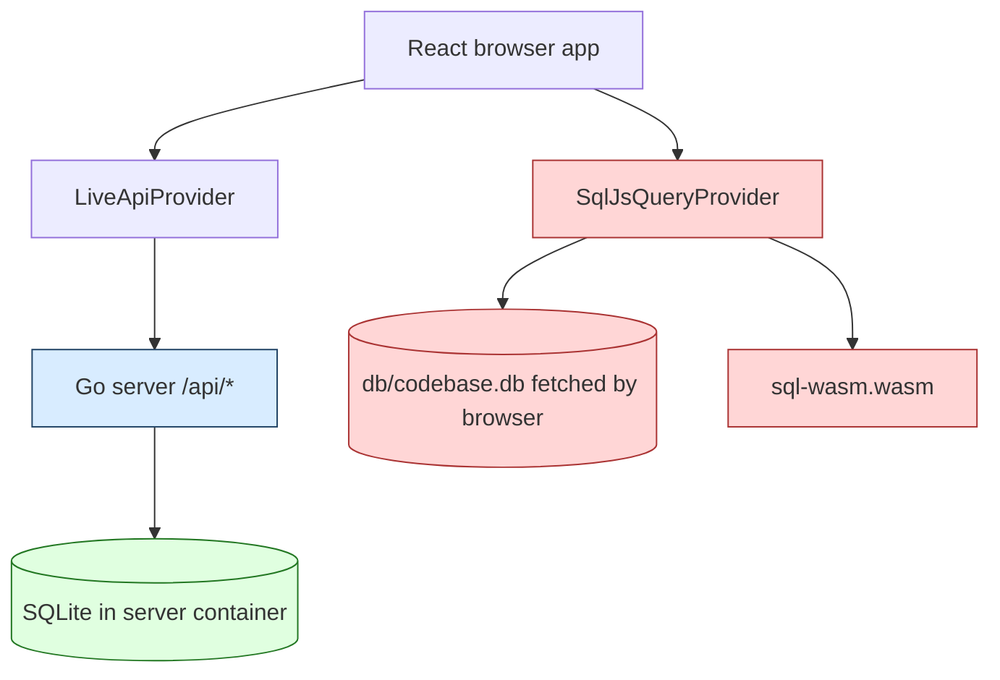
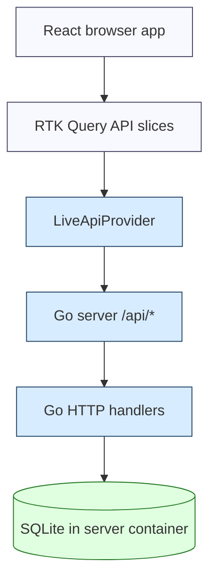
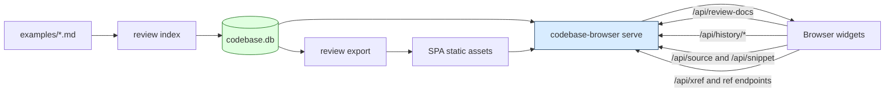

# Codebase Browser Live Demo: Removing Browser SQLite from a History-Rich Review UI

This report explains the GCB-017 recovery and hardening work for `codebase-browser`, with particular attention to the final architectural change: removing the frontend `sql.js` runtime and making the live Go API the only query runtime used by the browser. The project began as a recovery task for a broken live demo and ended with a sharper runtime boundary: React renders and requests data; Go owns SQLite; the browser no longer imports `sql.js`, downloads `sql-wasm.wasm`, or fetches `db/codebase.db` for interactive queries.

> [!summary]
> - `codebase-browser` now has a live `serve` path backed by a server-side SQLite database and a React UI that calls `/api/*` endpoints directly.
> - The former dual runtime, `LiveApiProvider` plus `SqlJsQueryProvider`, was removed because it duplicated query logic and allowed the browser to download the full review database.
> - The migration required adding backend endpoints for xrefs, snippet refs, source refs, file xrefs, symbol history, impact, source, snippets, review docs, and history diffs before deleting the frontend SQLite runtime.
> - The yolo deployment was rebuilt around the backend-only model and moved to image `ghcr.io/go-go-golems/codebase-browser:yolo-20260705-no-sqljs`.

The intended reader is an engineer who needs to understand the system enough to extend it. The report is not a changelog. It is a technical explanation of the design pressure, the runtime split that caused the problem, the backend API shape that replaced browser-side SQL, and the validation strategy that made the migration safe.

## Project context

The repository is `/home/manuel/code/wesen/2026-04-19--go-codebase-browser`. The relevant ticket workspace is `/home/manuel/code/wesen/2026-04-19--go-codebase-browser/ttmp/2026/07/02/GCB-017--project-archaeology-recover-working-demo-from-agent-transcripts`.

`codebase-browser` indexes a Go codebase into SQLite and renders a browser UI for exploring packages, files, symbols, references, commit history, symbol diffs, and review documents. The review documents are Markdown examples that hydrate into interactive widgets: symbol history tables, commit walks, source snippets, body diffs, impact graphs, and annotation blocks. The live demo is published at `https://codebase-browser.yolo.scapegoat.dev/`.

The recovery work had two phases. The first phase restored a working demo from implementation history, agent transcripts, and existing code. The second phase removed a risky runtime fallback that remained after the live demo worked: the React app could still fall back to a browser-side SQLite database through `sql.js`.

The important commits in the final cleanup sequence are:

| Commit | Purpose |
|---|---|
| `4a6b45e` | Documented the backend-only frontend runtime design and uploaded it to reMarkable. |
| `c0e7361` | Added live backend xref, snippet-ref, source-ref, and file-xref endpoints. |
| `3323f5f` | Recorded the backend xref endpoint work in the ticket diary. |
| `862cee2` | Removed the frontend `sql.js` data runtime, provider selection, runtime helpers, and dependencies. |
| `144fa86` | Recorded the frontend `sql.js` removal in the ticket diary. |
| `72a7449` | Removed the public `sql-wasm.wasm` artifact from the frontend public directory. |
| `edd12c9` | Updated the Hetzner K3s GitOps deployment to the no-sql.js image. |

The final image tag is:

```text
ghcr.io/go-go-golems/codebase-browser:yolo-20260705-no-sqljs
```

## The core architectural problem

The live deployment is a Go server with a SQLite database inside the container. In that deployment shape, SQLite is already available to the backend. The browser does not need to open the database. It needs stable, typed, cacheable HTTP endpoints.

Before the cleanup, the frontend had two data runtimes:



The existence of `SqlJsQueryProvider` changed the meaning of a frontend data request. A request did not simply mean "ask the backend for the answer." It meant "try the live API when available; otherwise initialize `sql.js`, fetch a static manifest, fetch the SQLite database, and run TypeScript-owned SQL in the browser." That fallback kept static export mode alive, but it also meant the live app could silently use a different query engine when the live API probe failed or when an endpoint was missing.

The old browser-side path had three concrete costs.

First, it duplicated query ownership. Go handlers and TypeScript provider methods encoded overlapping knowledge about the SQLite schema. Schema changes therefore had to be reflected in two languages and two execution environments.

Second, it increased the public data surface. The static export still contained `db/codebase.db`, and the frontend knew how to request it. In a live review deployment, users should not have to download the full database to render widgets.

Third, it made failures harder to reason about. A widget could work in static mode while failing in live mode, or work in live mode while hiding the fact that the fallback path still existed. That made regression testing less precise.

The target architecture removes that ambiguity:



In the target architecture, the SQLite database is still central. The difference is where it is allowed to execute. SQLite execution belongs to the Go server. React does not contain SQL query implementations and does not ship a SQLite virtual machine.

## How the live server is structured

The live server is implemented under `internal/server`. Its route registration is in `internal/server/server.go`. The API surface now includes health, index, review docs, symbols, search, source, snippets, history, impact, diffs, and xrefs.

The route set is the important contract:

```go
mux.HandleFunc("GET /api/health", s.handleHealth)
mux.HandleFunc("GET /api/index", s.handleIndex)
mux.HandleFunc("GET /api/review-docs", s.handleReviewDocList)
mux.HandleFunc("GET /api/review-docs/{slug}", s.handleReviewDoc)
mux.HandleFunc("GET /api/symbol", s.handleSymbol)
mux.HandleFunc("GET /api/search", s.handleSearch)
mux.HandleFunc("GET /api/source", s.handleSource)
mux.HandleFunc("GET /api/snippet", s.handleSnippet)
mux.HandleFunc("GET /api/xref", s.handleXref)
mux.HandleFunc("GET /api/snippet-refs", s.handleSnippetRefs)
mux.HandleFunc("GET /api/source-refs", s.handleSourceRefs)
mux.HandleFunc("GET /api/file-xref", s.handleFileXref)
mux.HandleFunc("GET /api/history/commits", s.handleHistoryCommits)
mux.HandleFunc("GET /api/history/symbol", s.handleSymbolHistory)
mux.HandleFunc("GET /api/history/impact", s.handleImpact)
mux.HandleFunc("GET /api/history/diff", s.handleHistoryDiff)
mux.HandleFunc("GET /api/history/symbol-body-diff", s.handleSymbolBodyDiff)
```

The handlers divide into four conceptual groups:

| Handler file | Responsibility |
|---|---|
| `internal/server/api.go` | Health, index, symbol lookup, search, source, and snippet retrieval. |
| `internal/server/api_review.go` | Rendered review document metadata and document payloads. |
| `internal/server/api_history.go` | Commit lists, symbol history, file diffs, symbol body diffs, and impact traversal. |
| `internal/server/api_xref.go` | Symbol xrefs, snippet refs, source refs, and file-level xref summaries. |

This split matters because the frontend no longer has a second implementation of these responsibilities. A widget that needs xrefs calls `/api/xref`. A review page that needs impact calls `/api/history/impact`. A snippet with a commit parameter calls `/api/snippet?symbol=...&kind=...&commit=...`. The live API is no longer an optimization over a static fallback; it is the data contract.

## The missing endpoints that blocked deletion

The final design document identified the endpoints that were still sql.js-only. These were the blockers that had to be implemented before deleting the frontend provider:

| Feature | Former frontend dependency | New backend endpoint |
|---|---|---|
| Symbol xrefs | `getSqlJsProvider().getXref(id)` | `GET /api/xref?id=<symbol>` |
| Snippet refs | `sqlProvider().getSnippetRefs(sym)` | `GET /api/snippet-refs?symbol=<symbol>` |
| Source refs | `sqlProvider().getSourceRefs(path)` | `GET /api/source-refs?path=<path>` |
| File xref summary | `sqlProvider().getFileXref(path)` | `GET /api/file-xref?path=<path>` |
| Impact graph | sql.js fallback in `historyApi` | `GET /api/history/impact` |
| Commit-scoped snippets | direct/static snippet path | `GET /api/snippet?...&commit=<ref>` |
| Commit-scoped source | direct/static source path | `GET /api/source?...&commit=<ref>` |

The implementation sequence was therefore constrained. Deleting `SqlJsQueryProvider` first would have broken symbol pages and source pages. The server had to gain equivalent query coverage first.

## Xref endpoint design

The xref endpoints are the clearest example of the migration. They move SQL that previously lived in `ui/src/api/sqlJsQueryProvider.ts` into `internal/server/api_xref.go`, while preserving the response shapes consumed by React.

The central response type is a reference record:

```go
type refRecord struct {
    FromSymbolID string   `json:"fromSymbolId"`
    ToSymbolID   string   `json:"toSymbolId"`
    Kind         string   `json:"kind"`
    FileID       string   `json:"fileId"`
    Range        refRange `json:"range"`
}
```

A symbol xref response has two different structures because the UI asks two different questions:

```go
type xrefResponse struct {
    ID     string          `json:"id"`
    UsedBy []refRecord     `json:"usedBy"`
    Uses   []xrefUseTarget `json:"uses"`
}
```

`usedBy` remains a flat list of references from other symbols to the current symbol. `uses` is grouped by target symbol and reference kind because the UI wants to show each outbound target with a count and occurrence list.

The handler does three things:

```go
func (s *Server) handleXref(w http.ResponseWriter, r *http.Request) {
    id := r.URL.Query().Get("id")
    commit, err := s.resolveCommit(r.URL.Query().Get("commit"))

    usedBy, err := queryRefRecordsTo(r.Context(), db, commit, id)
    usesFlat, err := queryRefRecordsFrom(r.Context(), db, commit, id)

    writeJSON(w, xrefResponse{
        ID: id,
        UsedBy: usedBy,
        Uses: groupRefUses(usesFlat),
    })
}
```

The important detail is not the HTTP wrapper. The important detail is the preservation of frontend semantics. The UI already knows how to render `usedBy` and grouped `uses`. The migration therefore keeps the TypeScript contract stable and changes only the execution location.

The grouping function is deliberately small:

```go
func groupRefUses(refs []refRecord) []xrefUseTarget {
    byKey := map[string]int{}
    out := []xrefUseTarget{}
    for _, ref := range refs {
        key := ref.ToSymbolID + "\x00" + ref.Kind
        idx, ok := byKey[key]
        if !ok {
            idx = len(out)
            byKey[key] = idx
            out = append(out, xrefUseTarget{
                ToSymbolID: ref.ToSymbolID,
                Kind: ref.Kind,
                Occurrences: []refRecord{},
            })
        }
        out[idx].Count++
        out[idx].Occurrences = append(out[idx].Occurrences, ref)
    }
    return out
}
```

This is the kind of logic that should live next to the database query. It depends on the schema, the query ordering, and the response shape. Keeping it in Go makes the server API testable without loading the browser.

## Source refs and snippet refs

Source references and snippet references use the same underlying `snapshot_refs` table, but they report offsets in different coordinate systems.

A source reference is file-relative. If a reference starts at byte offset 1047 in a file, the UI should receive offset 1047.

```go
out = append(out, sourceRefView{
    ToSymbolID: ref.ToSymbolID,
    Kind:       ref.Kind,
    Offset:     ref.Range.StartOffset,
    Length:     maxInt(0, ref.Range.EndOffset-ref.Range.StartOffset),
})
```

A snippet reference is snippet-relative. The snippet itself is a slice of a file, usually the declaration or body range of a symbol. If the symbol starts at byte offset 1000 and a reference starts at byte offset 1047, the UI should receive offset 47.

```go
out = append(out, snippetRefView{
    ToSymbolID:      ref.ToSymbolID,
    Kind:            ref.Kind,
    OffsetInSnippet: maxInt(0, ref.Range.StartOffset-meta.StartOffset),
    Length:          maxInt(0, ref.Range.EndOffset-ref.Range.StartOffset),
})
```

This distinction is easy to lose during a mechanical port. The endpoint tests in `internal/server/server_test.go` cover it with a fixture reference where the snippet-relative offset differs from the file-relative offset.

The general algorithm is:

```text
snippet refs:
  resolve commit
  resolve symbol body metadata
  query refs in the same file where start/end offsets are inside the symbol range
  subtract symbol start offset from each reference start offset
  return SnippetRefView[]

source refs:
  resolve commit
  resolve file metadata by path
  query refs in the file
  return file-relative offsets
```

The difference is small in code and large in UI behavior. A snippet highlighter using file-relative offsets will highlight the wrong text. A source highlighter using snippet-relative offsets will highlight near the top of the file regardless of the actual reference location.

## File-level xrefs

File-level xrefs require a boundary test. The endpoint must distinguish references internal to the file from references crossing the file boundary.

The inbound query joins `snapshot_refs` to the target symbol and left-joins the source symbol:

```sql
SELECT r.from_symbol_id,
       r.to_symbol_id,
       r.kind,
       r.file_id,
       r.start_line,
       r.start_col,
       r.end_line,
       r.end_col,
       r.start_offset,
       r.end_offset
FROM snapshot_refs r
JOIN snapshot_symbols target
  ON target.commit_hash = r.commit_hash
 AND target.id = r.to_symbol_id
LEFT JOIN snapshot_symbols source
  ON source.commit_hash = r.commit_hash
 AND source.id = r.from_symbol_id
WHERE r.commit_hash = ?
  AND target.file_id = ?
  AND COALESCE(source.file_id, '') != ?
ORDER BY r.from_symbol_id, r.kind
```

The outbound query uses the same idea with source and target reversed. The condition is not merely `snapshot_refs.file_id = ?`. That would identify where the textual occurrence appears, not whether the reference crosses a file boundary. The endpoint needs symbol ownership on both sides of the reference.

The result is a file-level summary:

```go
type fileXrefResponse struct {
    Path   string          `json:"path"`
    UsedBy []refRecord     `json:"usedBy"`
    Uses   []xrefUseTarget `json:"uses"`
}
```

This mirrors the symbol xref response closely enough that UI rendering code can use the same conceptual model: inbound references as occurrences, outbound references grouped by target.

## The React provider after the cleanup

Before the cleanup, `ui/src/api/codebaseProvider.ts` exported fallback helpers:

```ts
liveOrSql(liveFn, sqlFn)
liveWithSqlFallback(liveFn, sqlFn)
liveProvider()
sqlProvider()
```

After the cleanup, it is intentionally small:

```ts
import { getLiveApiProvider, isLiveApiAvailable } from './liveApiProvider';

export { isLiveApiAvailable };

export function apiProvider() {
  return getLiveApiProvider();
}

export function liveProvider() {
  return getLiveApiProvider();
}
```

The remaining `liveProvider()` alias exists only to avoid unnecessary churn. The important removal is `sqlProvider()`. There is no longer a frontend function that can instantiate the SQLite runtime.

The API slices now call `apiProvider()` directly. For example, `sourceApi` now routes source, snippets, snippet refs, source refs, and file xrefs through the live provider:

```ts
getSource: b.query<string, string | { path: string; commit?: string }>({
  queryFn: (arg) => {
    const path = typeof arg === 'string' ? arg : arg.path;
    const commit = typeof arg === 'string' ? undefined : arg.commit;
    return providerResult(() => apiProvider().getSource(path, commit));
  },
}),
getSnippet: b.query<string, { sym: string; kind?: SnippetKind; commit?: string }>({
  queryFn: ({ sym, kind = 'declaration', commit }) =>
    providerResult(() => apiProvider().getSnippet(sym, kind, commit)),
}),
getSnippetRefs: b.query<SnippetRefView[], string>({
  queryFn: (sym) => providerResult(() => apiProvider().getSnippetRefs(sym)),
}),
getSourceRefs: b.query<SourceRefView[], string>({
  queryFn: (path) => providerResult(() => apiProvider().getSourceRefs(path)),
}),
getFileXref: b.query<FileXrefResponse, string>({
  queryFn: (path) => providerResult(() => apiProvider().getFileXref(path)),
}),
```

The live provider implements these methods as plain HTTP calls:

```ts
async getSnippetRefs(symbolId: string, commit?: string): Promise<SnippetRefView[]> {
  const params = new URLSearchParams({ symbol: symbolId });
  if (commit) params.set('commit', commit);
  return fetchJSON(`/api/snippet-refs?${params}`);
}

async getXref(symbolId: string, commit?: string): Promise<XrefResponse> {
  const params = new URLSearchParams({ id: symbolId });
  if (commit) params.set('commit', commit);
  return fetchJSON(`/api/xref?${params}`);
}
```

The frontend data layer now has one failure mode: the backend request succeeds or fails. It does not change execution engines behind the caller.

## Review document hydration

The review documents were a major source of pressure on the runtime boundary. They are not just static pages. They contain widgets that hydrate against history and source APIs.

The fixed demo examples use stable commit ranges so they remain reproducible:

| Demo scope | Stable ref |
|---|---|
| Canonical demo range | `025e4c6..79af1b0` |
| Broad review range | `b91c6a3 → 79af1b0` |
| `staticapp.Export` focused diff | `b91c6a3 → 83dbe40` |
| `history.newScanCmd` focused diff | `05f3ffe → 7c095d0` |

This mattered because the original review pages contained moving refs such as `HEAD~5`, which failed once the database did not contain the expected commit window. Stable refs make the review pages data artifacts rather than branch-position artifacts.

The review pipeline now looks like this:



The browser still loads static assets. The difference is that widget data comes from the live API. Even when the export contains `db/codebase.db` as a server-side artifact, the React runtime does not request it.

## Packaging and deployment

The Docker image is intentionally simple. It copies the compiled binary and the exported static demo into a distroless image:

```dockerfile
FROM gcr.io/distroless/base-debian12:nonroot
WORKDIR /app
COPY --chown=nonroot:nonroot bin/codebase-browser /app/codebase-browser
COPY --chown=nonroot:nonroot bin/static /app/static
USER nonroot:nonroot
ENTRYPOINT ["/app/codebase-browser"]
CMD ["serve", "--addr", ":8080", "--db", "/app/static/db/codebase.db", "--static-dir", "/app/static"]
```

This keeps the yolo deployment operational without introducing an init container, PVC, or artifact download step. The cost is image size: the SQLite database remains embedded in the image. That is acceptable for the current demo, but it remains a deployment tradeoff. If the database grows or release cadence increases, the next design should separate the application image from the database artifact.

The Kubernetes deployment is managed through the Hetzner K3s GitOps repository at `/home/manuel/code/wesen/2026-03-27--hetzner-k3s`. The final deployment commit is:

```text
edd12c9 Deploy codebase-browser no-sqljs frontend
```

At the time of the final check, ArgoCD had synced to that revision and was still progressing toward full health:

```text
Synced Progressing edd12c9c7d0b2344fe7b4ce257669709017864a8
```

The public health endpoint responded successfully:

```json
{"ok":true,"mode":"live-go","staticDir":"/app/static"}
```

## Validation strategy

The validation strategy had to prove three different properties.

First, the Go API had to answer the newly migrated queries. This was covered by focused server tests:

```bash
go test ./internal/server -count=1
```

The broader focused validation used during the cleanup was:

```bash
go test ./internal/server ./internal/docs ./internal/staticapp -count=1
```

Second, the frontend had to typecheck without the sql.js provider and dependency types:

```bash
pnpm -C ui run typecheck
```

Third, the repository had to contain no production references to the old runtime path:

```bash
rg -n "liveOrSql|liveWithSqlFallback|sqlProvider|getSqlJsProvider|SqlJsQueryProvider|sqlJs|sqljs|sql\.js|sql-wasm|db/codebase" ui/src ui/package.json ui/pnpm-lock.yaml
```

After the cleanup this check returned no matches for the production frontend source and package files. The public `ui/public/sql-wasm.wasm` artifact was also removed, then the demo was rebuilt so the exported SPA no longer copied that artifact into the served directory.

The demo build and smoke commands were:

```bash
make demo-solid
make demo-smoke
```

`make demo-solid` rebuilt the rich demo over `025e4c6..79af1b0`, produced 118 commits, rendered four review docs, and reported zero rendered review errors. `make demo-smoke` verified the live API had at least 100 commits, that the `main` symbol history returned at least 100 rows, and that rendered review docs contained zero error rows.

A browser network check was also used locally against the live server. The key assertion was that review and symbol pages did not request any of the removed frontend SQLite artifacts:

```text
forbidden request patterns:
  /db/codebase.db
  sql-wasm
  sql.js
```

This is the right class of test for this migration. TypeScript can prove imports are gone. Grep can prove obvious strings are gone. Only a browser-level test proves the built bundle does not request the forbidden runtime artifacts during page hydration.

## What changed semantically

The main semantic change is that the live UI no longer has static fallback semantics. If the backend is unavailable, data queries fail. That is the correct behavior for the current deployment because the live backend is the data authority.

The old behavior supported an implicit static mode. The new behavior requires an explicit design if static interactivity is needed again. That future design should not reintroduce browser SQLite by default. It should start from the actual data needs of static review pages and define smaller, precomputed JSON payloads if offline interactivity is required.

The migration also changes where correctness is tested. Before, some query correctness lived in TypeScript tests around `SqlJsQueryProvider`. Those tests were deleted with the provider. Equivalent behavior now belongs in Go handler tests and API-level browser smoke tests.

## Failure modes discovered during the project

Several failures from the larger recovery are worth preserving because they explain why the final architecture is stricter.

### Moving commit refs broke review pages

Review pages used refs such as `HEAD~5`, but the demo database covered a specific historical range. A moving ref only resolves if the indexed history window matches the current repository position. The fix was to hardcode stable commits in the examples.

### Package-local symbols needed package-aware resolution

Review docs referenced symbols such as `staticapp.Export`. The renderer initially failed to resolve those references because the database symbol IDs used full import paths. The fix allowed package-local symbol references by package name or import suffix, while still treating ambiguity as an error.

### Review widgets had unsupported step kinds

The commit walk widget encountered step kinds such as `overview`, `note`, and `symbol` that were not supported by the hydrated UI. The fix was to implement those kinds instead of changing the docs to avoid them. That kept the review format expressive.

### Impact and snippets still triggered browser SQLite

Even after the live Go API existed, some review widgets still used fallback paths. The impact widget and commit-scoped snippet hydration were migrated to backend endpoints before the final sql.js deletion.

### Public assets can preserve removed runtimes

Removing the import and package dependency was not enough. `ui/public/sql-wasm.wasm` was a static asset copied by Vite into `dist` and then into the export. It had to be removed explicitly, and the export had to be rebuilt after deletion.

## Engineering rules from this project

The project produced several rules that are worth applying elsewhere.

- A live frontend should have exactly one authoritative data runtime. If there is a fallback runtime, it must be a product decision with explicit tests, not an incidental compatibility path.
- Removing a runtime requires closing endpoint gaps first. Delete work should start by listing every consumer and every query that still depends on the old runtime.
- Preserve response shapes when changing execution location. That keeps the UI migration small and makes tests easier to write.
- Stable demos need stable refs. Review documents that teach history should identify exact commits, not moving positions like `HEAD~N`.
- Grep checks are necessary but not sufficient. A static asset in `public/` can survive dependency deletion and still be copied into a built bundle.
- Browser network tests should assert absence, not just presence. For this project, the strongest regression check is: no request URL may contain `db/codebase.db`, `sql-wasm`, or `sql.js` during live page hydration.

## Current status

The repo now has a backend-only frontend data layer. The last local code validation passed, the no-sql.js image was built and pushed, and the GitOps deployment was updated to that image. The yolo public health endpoint responds as a live Go server.

Two operational details remain worth tracking:

1. ArgoCD had synced to the new GitOps revision but was still `Progressing` at the final observed check. It should be checked again until it reports `Synced Healthy`.
2. The image still embeds the SQLite database. That is acceptable for this review demo but should be revisited if the database or deployment cadence grows.

## Source map for future readers

| Path | Why it matters |
|---|---|
| `/home/manuel/code/wesen/2026-04-19--go-codebase-browser/internal/server/server.go` | Registers the live API routes and static handler. |
| `/home/manuel/code/wesen/2026-04-19--go-codebase-browser/internal/server/api.go` | Implements health, index, symbol, search, source, and snippet endpoints. |
| `/home/manuel/code/wesen/2026-04-19--go-codebase-browser/internal/server/api_history.go` | Implements history, diff, body diff, and impact endpoints. |
| `/home/manuel/code/wesen/2026-04-19--go-codebase-browser/internal/server/api_xref.go` | Implements xref, snippet-ref, source-ref, and file-xref endpoints. |
| `/home/manuel/code/wesen/2026-04-19--go-codebase-browser/ui/src/api/liveApiProvider.ts` | Defines the frontend HTTP provider. |
| `/home/manuel/code/wesen/2026-04-19--go-codebase-browser/ui/src/api/codebaseProvider.ts` | Contains the simplified backend-only provider helper. |
| `/home/manuel/code/wesen/2026-04-19--go-codebase-browser/ui/src/api/sourceApi.ts` | Shows source/snippet/ref RTK Query endpoints after migration. |
| `/home/manuel/code/wesen/2026-04-19--go-codebase-browser/ui/src/api/xrefApi.ts` | Shows symbol xrefs after migration to backend calls. |
| `/home/manuel/code/wesen/2026-04-19--go-codebase-browser/examples/` | Contains stable review docs used by the demo. |
| `/home/manuel/code/wesen/2026-04-19--go-codebase-browser/ttmp/2026/07/02/GCB-017--project-archaeology-recover-working-demo-from-agent-transcripts/design-doc/01-remove-frontend-sql-js-runtime-design.md` | Design document for the sql.js removal. |
| `/home/manuel/code/wesen/2026-04-19--go-codebase-browser/ttmp/2026/07/02/GCB-017--project-archaeology-recover-working-demo-from-agent-transcripts/reference/01-diary.md` | Chronological implementation diary. |
| `/home/manuel/code/wesen/2026-03-27--hetzner-k3s/gitops/kustomize/codebase-browser/deployment.yaml` | GitOps deployment manifest for yolo. |

## Closing

The final architecture is simpler because query ownership is no longer split. The browser is responsible for rendering, route state, and component hydration. The Go server is responsible for resolving commits, reading SQLite, grouping references, computing history views, and returning stable JSON/text responses. That boundary is now expressed in code, package dependencies, deployment artifacts, and validation commands.

The next improvement should not be another fallback path. If static interactivity becomes a requirement again, it should be designed as a separate static-data product surface with explicit payloads and explicit tests. The live demo should remain backend-only: no browser SQLite runtime, no wasm database engine, and no full database download during page hydration.
