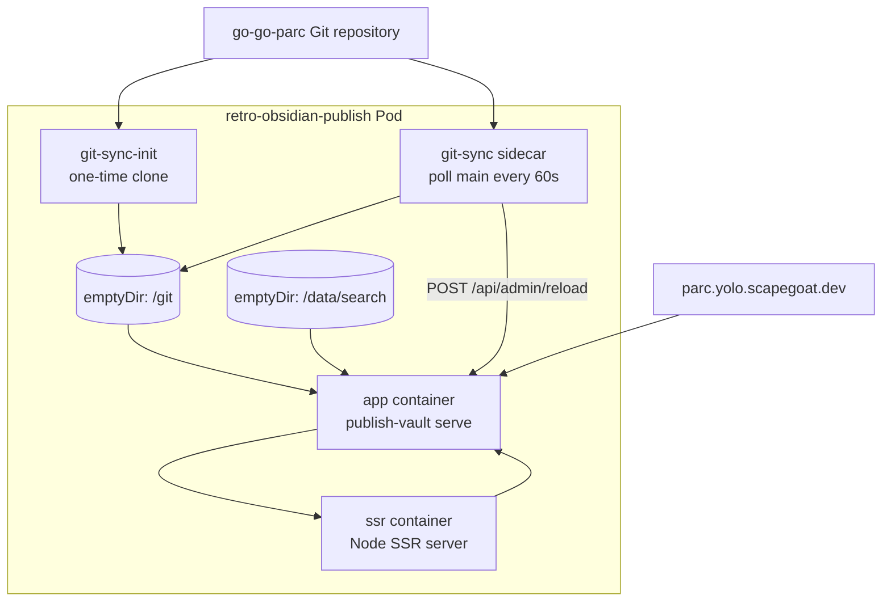
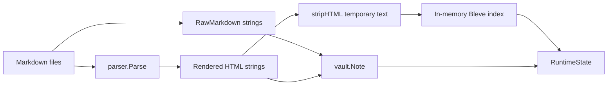
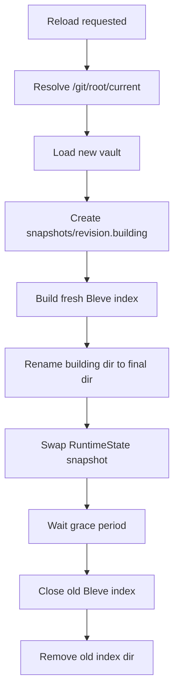

# Publish Vault Memory Architecture: Reload-Safe Persistent Search Indexes

This note records the technical deep dive behind the `retro-obsidian-publish` memory refactor. The triggering incident was direct: the production pod for `parc.yolo.scapegoat.dev` was repeatedly OOMKilled at a `1536Mi` memory limit. The fix was not to add a database, not to scale the cluster, and not to remove the git-push reload workflow. The fix was to identify which in-process representations were expensive, separate their responsibilities, and move the full-text search index out of the Go heap without breaking reload snapshot consistency.

> [!summary]
> - The original app held note content in several forms at once: rendered HTML, raw markdown, and an in-memory Bleve index.
> - The dangerous path was reload: the app built a complete second vault and search index before swapping it into service.
> - The refactor removed raw markdown from the hot note model, made search index markdown-derived rather than HTML-derived, and added per-snapshot persistent Bleve indexes.
> - Production now runs `ghcr.io/go-go-golems/publish-vault:sha-f434b60` with `--search-index-path /data/search`; the new pod is `3/3 Running`, zero restarts, and measured around `183Mi` for the whole pod shortly after rollout.

## Why this note exists

A production OOM is a useful debugging signal only if the team turns it into a precise account of system behavior. The important question is not simply “why did the process use memory?” Every useful program uses memory. The important question is which representations were live at the same time, which of those representations were necessary for requests, and which operations forced multiple complete snapshots to coexist.

The previous implementation was straightforward and correct for small vaults. It loaded every Markdown file, parsed it into rendered HTML, retained the original source in each `Note`, built backlinks and wiki-link indexes, and built a Bleve full-text index in memory. That design is easy to understand and easy to test. It is also a design where memory grows with the whole vault, and where reload briefly duplicates the whole vault and search index.

The production vault had grown large enough for that simple design to fail under a `1536Mi` container limit. The cluster itself was not full. The node had free memory. The failure was local to the `app` container. The app exceeded its own cgroup limit and the kernel killed it with exit code `137`.

## The production system

The deployed service has three runtime responsibilities:

1. It serves a JSON API for vault notes, search, tags, tree data, assets, and health.
2. It serves or proxies the web UI, including an SSR sidecar for page HTML.
3. It reloads the published vault when a `git-sync` sidecar pulls a new commit.

The Kubernetes pod has three long-running containers and one init container:



The `git-sync` design matters because the app is not restarted for each content update. `git-sync` checks out a new worktree, atomically changes `/git/root/current`, and then calls:

```text
POST http://127.0.0.1:8080/api/admin/reload
```

The app then builds a new runtime snapshot from the new symlink target. If the build succeeds, it swaps the new snapshot into service. If the build fails, the old snapshot remains active.

That snapshot behavior is a good property. It means readers do not observe a half-loaded vault. The memory problem came from the cost of building the next snapshot while the current snapshot was still live.

## The failure mode

The production symptom was a pod stuck in `CrashLoopBackOff`. The relevant container state was:

```text
app ready=false restartCount=236 lastState.terminated.reason=OOMKilled exitCode=137
ssr ready=true restartCount=0
git-sync ready=true
```

The app logs did not show an application panic. They showed normal startup:

```text
Loading vault from /git/root/current
Loaded 887 notes from /git/root/.worktrees/<sha>
File watcher disabled; expecting explicit reloads
SSR sidecar proxy enabled: http://127.0.0.1:8089
Server listening on http://localhost:8080
```

Then the container died. That is consistent with a cgroup OOM kill: the Go process does not get to log an error because it is killed externally.

The cluster was not the limiting factor. The node had spare memory. The problem was the app container’s own `1536Mi` limit. The old process crossed that limit during startup or reload. Local measurements later showed why: an in-memory Bleve index was the dominant heap consumer, and reload doubled the live state while it built the new snapshot.

## The original memory model

The original `vault.Note` type carried both API data and storage data. It included rendered HTML and raw markdown:

```go
type Note struct {
    Slug        string
    Title       string
    Path        string
    Frontmatter map[string]interface{}
    Tags        []string
    Excerpt     string
    HTML        string
    RawMarkdown string
    WikiLinks   []WikiLinkRef
    Backlinks   []string
    ModTime     time.Time
}
```

That structure forced two full content representations to remain live for every note:

- `HTML` was needed by `GET /api/notes/{slug}` and by the UI.
- `RawMarkdown` was used for the copy/download markdown actions.

Search added another representation. The old search path indexed text derived from rendered HTML:

```go
doc := noteDoc{
    Title:   note.Title,
    Body:    stripHTML(note.HTML),
    Tags:    tags,
    Excerpt: note.Excerpt,
}
return si.idx.Index(note.Slug, doc)
```

The original `search.New` used `bleve.NewMemOnly`, so the search index itself lived in the Go process heap:

```go
idx, err := bleve.NewMemOnly(buildMapping())
```

The steady-state representation was therefore:



This design is clear, but it has three concrete costs:

- Raw markdown is retained even when no user asks for raw markdown.
- Search depends on rendered HTML, even though search needs plain text.
- Bleve stores its index in the Go heap, and reload temporarily builds a second full index.

## Reload and snapshot duplication

Reload was already designed around atomic replacement. The important function was `RuntimeState.Reload`: build a complete new vault and search index, then swap pointers under a lock. That behavior protects correctness. It also means old and new states coexist while the new one is being built.

Before the refactor, the reload memory shape was:

```text
Before reload:
    Vault_A + InMemoryBleve_A

During reload:
    Vault_A + InMemoryBleve_A + Vault_B + InMemoryBleve_B

After successful swap:
    Vault_B + InMemoryBleve_B
```

The failing production case was not just about steady-state memory. It was also about transient peak memory. A process can have a safe idle footprint and still be killed while constructing the next state.

## The revised design

The refactor proceeded in phases. The phases were deliberately ordered so that the system became observable before the storage model changed, then the content model was simplified before persistent search was introduced.

### Phase B: measure memory phases

The first code change added memory instrumentation. The app now logs heap statistics at load and reload boundaries:

```text
memory phase=load_start ...
memory phase=load_resolved_root ...
memory phase=load_vault_done ...
memory phase=load_search_done ...
memory phase=load_done ...
memory phase=reload_start ...
memory phase=reload_swapped ...
```

`/api/healthz` now includes Go heap fields:

```json
{
  "ok": true,
  "notes": 890,
  "vaultRoot": "/git/root/.worktrees/90fc846e4a2100d7efde763948ed9f17a5775692",
  "configuredRoot": "/git/root/current",
  "heapAllocBytes": 53557040,
  "heapSysBytes": 506003456,
  "heapInuseBytes": 74301440,
  "nextGCBytes": 73687290,
  "numGC": 22721
}
```

The distinction between `heapAllocBytes` and `heapSysBytes` matters. `heapAllocBytes` is the live heap reported by the Go runtime. `heapSysBytes` is memory obtained from the OS for heap arenas. The runtime may keep heap arenas reserved after live objects are freed. For before/after comparisons of the live data model, `heapAllocBytes` is the more useful signal. For Kubernetes cgroup pressure, process RSS from `kubectl top` is the more operationally relevant number.

### Phase C: remove raw markdown from the hot model

Raw markdown does not need to be present in every `Note` all the time. The app only needs raw markdown when a user clicks Copy as Markdown, View Raw, or Download Markdown. The refactor removed `RawMarkdown` from `vault.Note` and added a safe on-demand reader:

```go
func (v *Vault) ReadRaw(relPath string) ([]byte, error) {
    cleaned := cleanVaultRelativePath(relPath)
    if cleaned == "" || !strings.EqualFold(filepath.Ext(cleaned), ".md") {
        return nil, os.ErrNotExist
    }

    root, err := os.OpenRoot(v.root)
    if err != nil {
        return nil, err
    }
    defer root.Close()

    file, err := root.Open(filepath.FromSlash(cleaned))
    if err != nil {
        return nil, err
    }
    defer file.Close()

    return io.ReadAll(file)
}
```

The frontend was changed at the same time. There was no backwards-compatibility requirement, only the requirement that the app work. The `Note` JSON no longer carries `rawMarkdown`. The Copy as Markdown button fetches raw source on demand:

```ts
const response = await fetch(`/api/notes/${encodeURIComponent(note.slug)}/raw`);
const rawMarkdown = await response.text();
await navigator.clipboard.writeText(rawMarkdown);
```

This phase removed one whole-vault content copy from steady-state heap.

### Phase D: search documents, not rendered HTML

Search should not depend on UI HTML. The refactor added a markdown-derived search document:

```go
type SearchDocument struct {
    Slug    string
    Title   string
    Body    string
    Tags    []string
    Excerpt string
}
```

The parser now exposes `PlainText(src []byte)`, reusing the existing frontmatter and markdown-stripping logic. The vault builds search documents on demand from raw source:

```go
func (v *Vault) SearchDocument(note *Note) (SearchDocument, error) {
    raw, err := v.ReadRaw(note.Path)
    if err != nil {
        return SearchDocument{}, err
    }
    return SearchDocument{
        Slug:    note.Slug,
        Title:   note.Title,
        Body:    parser.PlainText(raw),
        Tags:    append([]string(nil), note.Tags...),
        Excerpt: note.Excerpt,
    }, nil
}
```

Search indexing now consumes `vault.SearchDocument` instead of `*vault.Note`. That removes the `stripHTML(note.HTML)` path from indexing and makes search independent from rendered content.

This is an important design correction. A `Note` is no longer forced to be the storage model, API model, render cache, and search document all at once. The system now has separate representations for separate jobs.

### Phase E: persistent per-snapshot Bleve indexes

Moving Bleve to disk was necessary, but it had to preserve reload consistency. A naive persistent index can introduce stale search results or expose a search index that does not match the active vault snapshot. The refactor therefore did not reuse one mutable directory such as `/data/search/index`.

Instead, each runtime snapshot has its own index directory:

```text
/data/search/snapshots/<revision>/index
```

The new snapshot structure is:

```go
type Snapshot struct {
    Revision     string
    ResolvedRoot string
    Vault        *vault.Vault
    Search       *search.Index
    IndexDir     string
    BuiltAt      time.Time
}
```

The reload path now builds a full snapshot:



The key rule is that the runtime swaps a vault and its matching search index together. A request that sees `Vault_A` also sees `Search_A`. A request after reload sees `Vault_B` and `Search_B`. The search index is no longer an independently mutable shared object.

`search.Index` now has an explicit close method:

```go
func (si *Index) Close() error {
    si.mu.Lock()
    defer si.mu.Unlock()
    if si.idx == nil {
        return nil
    }
    err := si.idx.Close()
    si.idx = nil
    return err
}
```

The previous persistent function was also changed to rebuild cleanly. It removes the target index directory before building. This prevents deleted notes from remaining searchable after reload.

## Measurements

Measurements were taken against the real vault at:

```text
/home/manuel/code/wesen/go-go-golems/go-go-parc
```

The checkout used for testing had `890` notes as reported by the app.

### Local built-binary measurements

The built binary was measured without `go run` compilation overhead.

| Scenario | Search mode | Peak process RSS | Go heap at search done | Notes |
|---|---:|---:|---:|---:|
| Startup, old in-memory search path | in-memory Bleve | not captured as RSS in the same run | `311,186,216` bytes heap alloc | 890 |
| Startup, new persistent search path | persistent Bleve | `496,912 KB` ≈ `485 MB` | `73,133,448` bytes heap alloc in the built-binary run | 890 |
| Startup plus one reload, new persistent search path | persistent Bleve | `565,180 KB` ≈ `552 MB` | `150,324,360` bytes heap alloc at reload search done | 890 |

The live heap reduction is the important result. The old in-memory search path ended search build at roughly `311 MB` heap allocation. The persistent path ended startup search build around `73–80 MB` heap allocation. Reload still has a transient because the app builds a second vault and index before swapping, but the measured reload peak was around `150 MB` heap allocation, far below the old in-memory search heap.

### Production measurements after deployment

The deployed images are:

```text
app = ghcr.io/go-go-golems/publish-vault:sha-f434b60
ssr = ghcr.io/go-go-golems/publish-vault-ssr:sha-f434b60
```

The deployment now passes:

```text
--search-index-path /data/search
```

and mounts an `emptyDir` volume at `/data/search`.

After rollout, Kubernetes reported:

```text
retro-obsidian-publish-74968f989-vscxs   3/3 Running   RESTARTS=0
kubectl top pod: 183Mi
```

`/api/healthz` reported:

```json
{
  "ok": true,
  "notes": 890,
  "vaultRoot": "/git/root/.worktrees/90fc846e4a2100d7efde763948ed9f17a5775692",
  "configuredRoot": "/git/root/current",
  "heapAllocBytes": 53557040,
  "heapSysBytes": 506003456,
  "heapInuseBytes": 74301440,
  "nextGCBytes": 73687290,
  "numGC": 22721
}
```

The production pod was therefore running far below the old `1536Mi` limit shortly after deployment.

## Deployment details

The source implementation lives in:

```text
/home/manuel/workspaces/2026-07-05/memory-publish-vault/publish-vault
```

Important commits:

```text
596286c RETRO-MEMORY-012: document memory refactor plan
de5db66 RETRO-MEMORY-012: add memory instrumentation
499c6f7 RETRO-MEMORY-012: lazy-load raw markdown
67f4856 RETRO-MEMORY-012: decouple search from rendered HTML
a134538 RETRO-MEMORY-012: add persistent snapshot search indexes
f434b60 RETRO-MEMORY-012: record persistent index phase
68064eb RETRO-MEMORY-012: record production deployment
```

The GitOps repo is:

```text
/home/manuel/code/wesen/2026-03-27--hetzner-k3s
```

The deployment commits were:

```text
0ebec8b Deploy publish-vault memory optimized image
a996fae retro-obsidian-publish: pull public GHCR images anonymously
```

The second commit matters. The new GHCR packages were public, but the deployment still referenced a stale or insufficient image pull secret. The kubelet tried to use that secret and received `403 Forbidden` from GHCR. Removing the pod-level `imagePullSecrets` allowed anonymous pulls of public packages.

That operational detail is easy to miss: a public GHCR package can still fail to pull if Kubernetes is forced to use a bad credential. Public images should not need a private pull secret. If a deployment includes one anyway, the pull can fail before anonymous access is attempted.

## Correctness properties preserved

The refactor preserved the most important runtime correctness property: reload swaps complete snapshots.

A request must not observe a vault from one revision and a search index from another revision. The implementation enforces that by storing vault and search together in `Snapshot`, then replacing the active snapshot as a unit.

The tests cover the critical cases:

- Closing `search.Index` is idempotent.
- Rebuilding a persistent index does not retain deleted-note search results.
- A persistent reload drops search results for notes that no longer exist.
- Old persistent index directories are cleaned after reload.
- The raw markdown endpoint reads from disk and returns `404` if the source file is gone.
- The full note JSON intentionally omits `rawMarkdown`.

The important invariant is:

```text
For any request R:
    R sees exactly one Snapshot S.
    All note lookup and search work for R uses S.Vault and S.Search.
```

That invariant makes the reload behavior comprehensible and testable.

## Why this did not become a database project

The initial question included whether the vault should be indexed into a database. That question was reasonable because the old design held too much in memory. The final design did not introduce Postgres or SQLite because the problem did not require relational storage.

The application has these properties:

- The source of truth is a Git checkout of Markdown files.
- The app can rebuild derived state from the checkout.
- Search is full-text search, not relational query execution.
- There is one production replica.
- Reload already works as a complete snapshot replacement.

A database would add migrations, backup semantics, operational state, and another failure surface. Persistent Bleve keeps the same derivation model: the vault files remain the source of truth, and the search index remains derived state. The difference is that the derived search structure now lives on disk rather than in the Go heap.

This is the central design decision:

```text
Persist the derived search index, not the source-of-truth vault model.
```

That decision keeps the operational model simple. If the pod restarts, it can rebuild the index from the checked-out vault. If an index directory is corrupt or incomplete, it can be discarded. No user-authored content is stored only in the index.

## Implementation sequence as a reusable pattern

This incident produced a sequence that applies to similar memory refactors:

1. **Instrument first.** Add phase-level memory logs before changing storage. Without measurements, it is easy to optimize the wrong representation.
2. **Separate storage and API models.** A single struct used for storage, API JSON, search input, and rendering will accumulate fields that are only needed by one consumer.
3. **Remove unused steady-state content.** Raw source can often be read on demand from the source of truth.
4. **Decouple search input from UI output.** Search should index a search document, not rendered HTML.
5. **Move large derived indexes out of heap.** Do this only after lifecycle and snapshot consistency are explicit.
6. **Deploy with observability.** The new binary should expose memory statistics, and Kubernetes RSS should be checked after rollout and after reload.

The sequence matters. If persistent Bleve had been added first as a direct `NewPersistent` replacement, it would have created stale document risk and index lifecycle risk. Splitting representations first made the persistent step safer.

## Operational state after the fix

At the time this note was written, the production app was healthy:

```text
ArgoCD: Synced / Healthy
Pod:    3/3 Running, 0 restarts
Images: sha-f434b60 for app and SSR
Memory: 183Mi for the full pod shortly after rollout
```

The app still has a `1536Mi` memory limit. Based on the measured RSS, that limit is now conservative. It should not be reduced immediately. The next useful step is to observe the pod across several git-sync reload cycles, then decide whether to add `GOMEMLIMIT` or lower the Kubernetes memory limit.

A safe follow-up might be:

```yaml
env:
  - name: GOMEMLIMIT
    value: "1024MiB"
```

That should only be added after observing production behavior with the persistent index path enabled. The current data shows the OOM is resolved without it.

## Files worth reading

Implementation files in `publish-vault`:

```text
internal/server/runtime.go      Snapshot lifecycle, reload, persistent index dirs
internal/search/search.go       Bleve index wrapper, Close, clean persistent rebuild
internal/vault/vault.go         Note model, ReadRaw, SearchDocument generation
internal/parser/parser.go       PlainText extraction for search bodies
internal/api/api.go             /api/notes, /api/notes/{slug}/raw, /api/healthz
internal/watcher/watcher.go     Incremental re-index path for watched local changes
cmd/.../serve/serve.go          --search-index-path CLI flag
```

Deployment files in `hetzner-k3s`:

```text
gitops/kustomize/retro-obsidian-publish/deployment.yaml
gitops/applications/retro-obsidian-publish.yaml
```

Ticket documentation:

```text
ttmp/2026/07/05/RETRO-MEMORY-012--fix-retro-obsidian-publish-prod-oom-and-harden-memory-git-push-reload-path/design/01-prod-oom-memory-and-reload-architecture-guide.md
ttmp/2026/07/05/RETRO-MEMORY-012--fix-retro-obsidian-publish-prod-oom-and-harden-memory-git-push-reload-path/design/02-project-and-design-review-memory-index-search.md
ttmp/2026/07/05/RETRO-MEMORY-012--fix-retro-obsidian-publish-prod-oom-and-harden-memory-git-push-reload-path/reference/01-investigation-diary.md
```

## Working rules

- Do not put large derived structures in the Go heap unless they are small, bounded, and measured.
- Do not let the API response type dictate the storage type.
- Do not let rendered UI content become the source for search indexing.
- Do not mutate a shared persistent search index in place while old snapshots may still serve requests.
- Do not assume public GHCR images will pull if the pod is configured with a stale private pull secret.
- Keep reload as an atomic snapshot swap. That design is worth preserving.

## Closing

The final system is still simple: source files are Markdown in Git, the app derives a vault snapshot, search is derived from markdown text, and reload replaces one complete snapshot with another. The difference is that the expensive derived search structure no longer occupies the Go heap, and raw markdown is no longer retained for every note just to support an occasional user action.

The production result confirms the design direction. The app moved from repeated OOMKills at a `1536Mi` limit to a healthy pod using around `183Mi` shortly after deployment, with `/api/healthz` exposing live heap data for future verification. The architectural lesson is narrow and practical: split representations by responsibility, keep derived state rebuildable, and preserve snapshot consistency when moving data out of memory.
