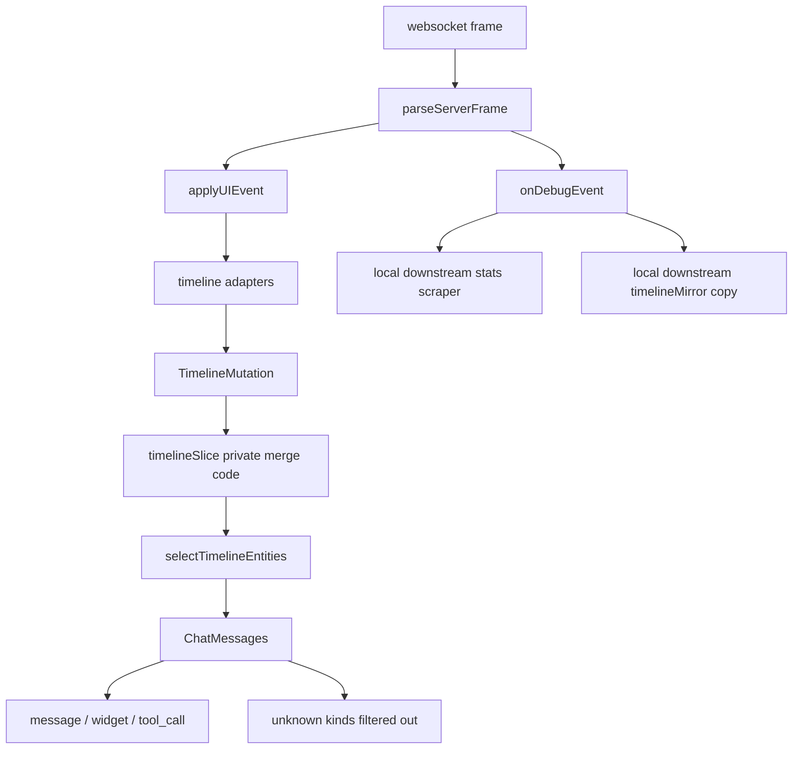
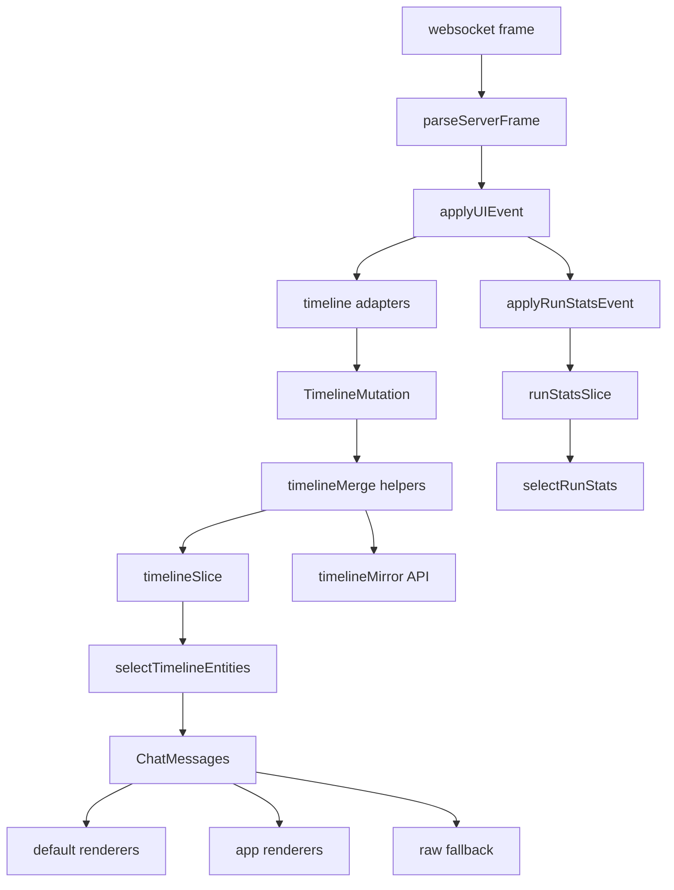

# React Chat Upstreaming: Provider-Owned Timeline, Run Stats, and Renderers

This report explains the July 2026 `react-chat` upstreaming pass that moved timeline merge semantics, run statistics, and timeline rendering extension points out of downstream Wesen OS applications and into the reusable `@go-go-golems/chat-provider` and `@go-go-golems/chat-overlay` packages. The work started as a cleanup of duplicated launcher and inventory chat code, but the important technical result is stronger ownership: the package that defines the chat protocol now also owns the state transitions and UI extension points that consumers need in order to render and inspect that protocol safely.

The target reader is an engineer who needs to understand how the chat provider turns websocket frames into UI state, why detached debug windows need a provider-owned timeline mirror, how token/model statistics now flow through selectors, and how downstream applications can customize message rendering without replacing the whole timeline component.

> [!summary]
> - `chat-provider` now owns the timeline merge algorithm through pure helpers and a reusable timeline mirror API.
> - `chat-provider` now exposes run statistics, including usage totals and model/provider labels, through Redux selectors instead of requiring downstream debug-event scraping.
> - `chat-overlay` now exposes an extensible `ChatMessages` component with per-kind renderers and a fallback for unknown timeline entity kinds.
> - `wesen-os` and `go-go-app-inventory` now consume those upstream primitives and delete their local timeline mirrors and stats scraper code.

## Why this note exists

The immediate problem was duplicated chat infrastructure. The launcher app and the inventory app both needed richer chat behavior than the published `react-chat` packages exposed. They needed markdown message rendering, thinking traces, generated-card block stripping, timeline debug windows, event viewers, and footer statistics. Some of those features are domain-specific and should stay downstream. Others are protocol-level behavior and should live in `react-chat`.

The duplicated pieces revealed three generic gaps:

- Detached debug windows needed to reconstruct a chat timeline outside the original `ChatProvider` tree. They copied the provider's private merge logic into local `timelineMirror.ts` files.
- Footer statistics needed provider-call usage data. Downstream code scraped `ChatProviderCallMetadataUpdated` and `ChatProviderCallFinished` from debug events because the provider store ignored them.
- Message rendering needed a per-kind extension point. Downstream code replaced `ChatMessages` because the upstream implementation only rendered `message`, `widget`, and `tool_call` and filtered out every other timeline entity.

The resulting design is simple: protocol semantics move up, app-specific presentation remains down. `react-chat` should know how timeline mutations merge, how run statistics derive from chat events, and how timeline entities are dispatched to renderers. It should not know what a HyperCard block is, how inventory generated cards work, or how Wesen OS opens desktop windows.

## Repositories and commits

The work spans three repositories or workspace components.

| Area | Repository path | Important commits |
|---|---|---|
| Upstream chat packages | `/home/manuel/code/wesen/go-go-golems/react-chat` | `0c934ee`, `87e1601`, `42e0517`, `18fe179`, `4bd968b` |
| Wesen OS launcher downstream | `/home/manuel/workspaces/2026-03-02/os-openai-app-server/wesen-os` | `72c0de5`, `ddaa65b` |
| Inventory downstream | `/home/manuel/workspaces/2026-03-02/os-openai-app-server/wesen-os/workspace-links/go-go-app-inventory` | `94d53d0`, `fdb8008`, `4578668`, `d5c1e5b` |

The implementation was guided by the `react-chat` ticket:

- `/home/manuel/code/wesen/go-go-golems/react-chat/ttmp/2026/07/05/REACT-CHAT-TIMELINE-STATS-RENDERERS-2026-07--timeline-mirror-run-stats-and-extensible-message-renderers/design-doc/01-timeline-mirror-run-stats-and-renderer-extension-intern-guide.md`

The downstream motivation connects to the existing project note:

- [[PROJ - wesen-os - Assistant Chat Parity and Generated HyperCard Apps]]

## The architecture before the change

Before this upstreaming pass, `react-chat` already had a coherent provider architecture. `WsManager` parsed websocket frames, timeline adapters converted protocol frames into `TimelineMutation` objects, and `timelineSlice` merged those mutations into a Redux timeline. `ChatMessages` read the ordered timeline entities and rendered the known entity kinds.

The problem was that important behavior was private or hardcoded. The provider's merge algorithm lived inside `timelineSlice.ts`; a detached debug window could not call it. The provider saw provider-call usage events, but did not project them into state. The overlay had a `ChatMessages` component, but it did not let an application render custom timeline entity kinds.

The pre-change data flow looked like this:



Two downstream copies attempted to preserve provider semantics. This is where correctness risk entered the system. If the provider changed how streaming patches worked, or how widget prop patches appended array fields, each local `timelineMirror.ts` would need to change at exactly the same time. That is not a stable package boundary. It makes downstream debug tooling depend on private provider behavior without having a public API for that behavior.

## The design after the change

The post-change architecture makes three responsibilities explicit.



The provider owns state transitions. The overlay owns generic timeline rendering dispatch. Applications supply domain-specific renderers and footer formatting.

The important distinction is that downstream code still has responsibilities. The launcher still strips HyperCard blocks from assistant message text. Inventory still renders inventory-specific card widgets. Both apps still open their own debug windows. What changed is that neither app has to reproduce the provider's timeline merge algorithm or scrape debug events for stats.

## Timeline merging: extracting protocol semantics from the reducer

The timeline merge algorithm is the core state transition for chat UI. It accepts a `TimelineMutation` and updates a timeline state shaped as `byId` plus `order`. The state transition has a few important cases:

- `upsert` creates a new entity if it does not exist and merges into it if it does.
- `upsertIfExists` updates an existing entity and ignores missing entities.
- `deleteId` removes an entity from both `byId` and `order`.
- `contentPatch` appends or replaces streamed message content depending on patch mode.
- `propsPatch` updates widget props and can append array fields when `patchPaths` asks for append semantics.

The new `timelineMerge.ts` gives this behavior a home outside the reducer:

```ts
export function applyTimelineMutationToTimelineState(state: TimelineState, mutation: TimelineMutation): void {
  if (mutation.deleteId) {
    const id = mutation.deleteId;
    delete state.byId[id];
    state.order = state.order.filter((entry) => entry !== id);
  }
  if (mutation.upsert) {
    mergeTimelineEntityIntoState(state, mutation.upsert, true);
  }
  if (mutation.upsertIfExists) {
    mergeTimelineEntityIntoState(state, mutation.upsertIfExists, false);
  }
}
```

The reducer now calls these helpers. The mirror API calls the same helpers. That is the critical property: Redux state and detached mirror state no longer have separate implementations of the same state transition.

The timeline mirror API is small:

```ts
export function createEmptyTimelineMirror(): TimelineMirrorState {
  return { byId: {}, order: [] };
}

export function applyTimelineMutationToMirror(
  mirror: TimelineMirrorState,
  mutation: TimelineMutation,
  options: { immutable?: boolean } = {},
): TimelineMirrorState {
  const target = options.immutable ? cloneTimelineState(mirror) : mirror;
  applyTimelineMutationToTimelineState(target, mutation);
  return target;
}
```

The API supports both mutable and immutable use. The downstream debug windows use the immutable mode because they want referential changes only when a mutation actually applies. That lets React memoization stay simple: if no new mutation applied, the mirror reference remains stable; if a mutation applied, a new state object is produced.

The tests compare the mirror to the Redux reducer. This is the right invariant to test. The important claim is not that the mirror has its own expected behavior; the claim is that the mirror and reducer have the same behavior for the same mutation sequence.

## Run statistics: moving usage accounting into provider state

The downstream stats footer originally parsed debug events. It listened to `onDebugEvent`, looked for `parsed-frame` events, checked whether the frame was a `ui-event`, and then interpreted event names such as `ChatRunStarted`, `ChatTextPatch`, `ChatProviderCallMetadataUpdated`, and `ChatProviderCallFinished`.

That worked, but it used the wrong channel. Debug events are an observation interface. The run statistics footer is product UI. Product UI should consume store selectors, not a debug event stream.

The new implementation adds a `runStatsSlice` to `chat-provider`. The public snapshot is `ChatRunStats`:

```ts
export interface ChatRunStats {
  isStreaming: boolean;
  streamStartTime: number | null;
  streamOutputTokens: number;
  model: string | null;
  provider: string | null;
  lastRun: ChatUsageTotals | null;
  lastRunDurationMs: number | null;
  lastRunStopReason: string | null;
  totals: ChatUsageTotals;
  completedRuns: number;
}
```

There are two kinds of fields in the slice:

- Public fields that the UI reads, such as `isStreaming`, `streamOutputTokens`, `model`, `provider`, `lastRun`, and `totals`.
- Per-run scratch fields used to accumulate the current run, such as `streamChars`, `usageOutputSoFar`, `runUsage`, `runDurationMs`, `runModel`, and `runProvider`.

This separation matters because provider calls and chat runs are not identical. A single chat run can contain multiple provider calls. The slice accumulates provider-call usage during the run and commits the final run totals only when it receives a terminal run event.

The event ingestion path is direct:

```ts
export function applyRunStatsEvent(frame: CanonicalFrame, dispatch: AppDispatch, nowMs = Date.now()): void {
  if (asString(frame.type) !== 'ui-event') return;
  const name = asString(frame.name);
  const payload = asRecord(frame.payload);

  switch (name) {
    case 'ChatRunStarted':
      dispatch(runStatsSlice.actions.runStarted(nowMs));
      return;
    case 'ChatTextPatch': {
      const text = asString(payload.text) || asString(payload.content);
      dispatch(runStatsSlice.actions.textPatchObserved({ chars: text.length }));
      return;
    }
    case 'ChatProviderCallStarted': {
      const { model, provider } = providerCallInfoFromPayload(payload);
      dispatch(runStatsSlice.actions.providerCallStarted({ model, provider }));
      return;
    }
    case 'ChatProviderCallMetadataUpdated':
      dispatch(runStatsSlice.actions.providerCallMetadataUpdated(providerCallInfoFromPayload(payload)));
      return;
    case 'ChatProviderCallFinished':
      dispatch(runStatsSlice.actions.providerCallFinished({
        ...providerCallInfoFromPayload(payload),
        durationMs: toNumber(payload.durationMs),
        stopReason: asString(payload.stopReason) || null,
      }));
      return;
  }
}
```

The model/provider extraction is intentionally permissive. The frontend is receiving metadata from a backend event stream, not a closed TypeScript API. `providerCallInfoFromPayload` checks several common locations: direct payload fields, `meta`, `metadata`, `extra`, and provider-call correlation IDs. This lets the footer show a raw provider/model label when the event stream contains one, and fall back to the selected profile label when it does not.

The selector had one subtle runtime issue. The first implementation returned a new object each time `selectRunStats` ran. React Redux warns about selectors that return a different reference for the same input because they cause unnecessary renders. The fix was to memoize `selectRunStats` with `createSelector`. This is a small change, but it is the difference between a correct state shape and a good React selector.

## Renderer extension: making `ChatMessages` responsible for iteration, not application policy

The old downstream `ChatTimeline` existed because upstream `ChatMessages` did too much and too little at the same time. It did too much by hardcoding the render branches for every known kind. It did too little by dropping unknown kinds before any app code could handle them.

The new `ChatMessages` API separates generic timeline iteration from application-specific rendering:

```ts
export interface ChatMessagesProps {
  bottomRef?: RefObject<HTMLDivElement | null>;
  renderMode?: ChatMessageRenderMode;
  renderers?: Record<string, TimelineEntityRenderer | undefined>;
  fallbackRenderer?: TimelineEntityRenderer;
  visibleKinds?: string[] | ((entity: TimelineEntity) => boolean);
  empty?: ReactNode;
}
```

The component still has built-in renderers for the generic entity kinds:

- `message`
- `widget`
- `tool_call`

But applications can override or extend the renderer map. Unknown kinds now render through `RawTimelineEntityFallback` unless the caller supplies a different fallback. This changes the failure mode. Previously, a new timeline entity could disappear from the UI. Now it appears as a collapsed raw entry. That is a better default for an extensible protocol because visibility is preserved even when presentation has not been specialized yet.

The downstream launcher adapter became smaller. It no longer iterates timeline entities itself. It only provides the message renderer that knows how to render launcher-specific message content:

```tsx
return (
  <ChatMessages
    bottomRef={bottomRef}
    renderMode={renderMode as ChatMessageRenderMode}
    renderers={messageRenderers}
    fallbackRenderer={toChatMessagesRenderer(resolved.default, renderMode)}
  />
);
```

This keeps HyperCard block stripping downstream. That is the correct boundary. `react-chat` should know that messages have renderers; it should not know that Wesen OS encodes generated cards as `<hypercard:*>` text blocks.

## Downstreaming into Wesen OS and Inventory

After the upstream package changes landed, the downstream migration removed the duplicated infrastructure.

In the launcher app, the migration removed:

- `apps/os-launcher/src/chat/chatStatsStore.ts`
- `apps/os-launcher/src/chat/timelineMirror.ts`

`assistantModule.tsx` stopped feeding debug events into a stats store. It still feeds debug events into the debug store for event viewer support, but stats now come from the provider store.

`StatsFooter.tsx` changed from an external-store subscriber to a provider selector consumer:

```ts
const stats = useChatSelector(selectRunStats);
const effectiveLabel = runLabel({ label, model: stats.model, provider: stats.provider });
```

The footer now shows the most precise label available:

1. `provider/model` when provider-call metadata includes both fields.
2. `model` when only model is available.
3. The selected profile display name when raw model metadata is not available.

Inventory received the same treatment. Its local `timelineMirror.ts` was deleted, `InventoryDebugWindows.tsx` now folds mutations through `applyTimelineMutationToMirror`, and `InventoryChatMessages.tsx` now wraps upstream `ChatMessages` with a message renderer override.

Inventory also gained footer stats. The footer starts with the selected profile label, for example:

```text
Inventory · Streaming via sessionstream
```

During a run it can advance to a live token-rate display:

```text
openai_responses/gpt-5-nano-low · streaming: 43 tok · 18.7 tok/s
```

After a completed run with provider usage, it can show usage and throughput:

```text
openai_responses/gpt-5-nano-low · In:1,240 Out:312 · 4.8s · 65 tok/s
```

The exact model/provider string depends on the event metadata emitted by the backend. The frontend now has fields to display it when available.

## The local testing setup

Because the new `react-chat` changes were not yet published to npm, Wesen OS was configured to consume the local repository through a workspace link:

```text
workspace-links/react-chat -> /home/manuel/code/wesen/go-go-golems/react-chat
```

The launcher and inventory dependencies were changed from published versions to workspace dependencies:

```json
"@go-go-golems/chat-overlay": "workspace:*",
"@go-go-golems/chat-provider": "workspace:*"
```

This gave Vite access to the source packages with the new exports. The first browser run hit a stale optimized dependency cache:

```text
Uncaught SyntaxError: The requested module ... @go-go-golems_chat-provider.js ... doesn't provide an export named: 'createEmptyTimelineMirror'
```

The error was accurate for the stale prebundle. Vite had optimized the previous published package, which did not export `createEmptyTimelineMirror`. The fix was to remove the Vite dependency cache and restart the Vite dev service:

```bash
rm -rf apps/os-launcher/node_modules/.vite
devctl restart vite
```

After restart, the launcher loaded and the Assistant and Inventory Chat windows opened. The remaining browser console messages were unrelated 404s for `/api/os/federation-registry` and `/favicon.ico`.

## Validation commands

The validation covered upstream package correctness, downstream TypeScript compatibility, and production builds.

For `react-chat`:

```bash
pnpm --filter @go-go-golems/chat-provider test
pnpm --filter @go-go-golems/chat-provider typecheck
pnpm --filter @go-go-golems/chat-overlay typecheck
pnpm --filter @go-go-golems/chat-overlay test
pnpm test
pnpm typecheck
```

For downstream Wesen OS and Inventory:

```bash
pnpm --filter @go-go-golems/os-launcher typecheck:linked
pnpm --filter @go-go-golems/inventory typecheck:published
pnpm --filter @go-go-golems/os-launcher build:linked
pnpm --filter @go-go-golems/inventory build:federation
```

One full launcher test command still failed for pre-existing module-resolution issues around published/workspace `os-*` packages. The relevant typecheck and build paths passed.

## Important technical decisions

### Export behavior, not downstream copies

The main timeline decision was to export behavior in the form of mutation application and mirror helpers. The downstream debug window still owns snapshot fetching and local presentation. It no longer owns the merge algorithm.

That is the right package boundary. Snapshot fetching is host-specific because REST endpoints vary. Mutation folding semantics are provider-specific because they define how chat protocol events become timeline state.

### Keep HyperCard parsing downstream

`ChatMessages` now accepts renderer maps, but it does not parse HyperCard blocks. The launcher and inventory apps still strip generated-card blocks from assistant text and render “building card” placeholders. That behavior depends on Wesen OS artifact syntax and should not become a default `react-chat` rule.

### Treat debug events as debug events

The stats migration moved production footer state from `onDebugEvent` scraping to `selectRunStats`. Debug event stores still exist for Event Viewer and Timeline Debug. They are no longer required for footer usage accounting.

This makes the product path more stable. The debug stream can evolve for observability without silently breaking the stats footer.

### Prefer provider model over profile label when available

The profile label is useful before a run starts because it explains what the user selected. The provider/model fields are more precise once provider-call metadata arrives. The footer therefore computes the effective label in this order:

```ts
function runLabel({ label, model, provider }) {
  if (model && provider) return `${provider}/${model}`;
  if (model) return model;
  return label ?? null;
}
```

This avoids inventing model names. If the backend provides model/provider metadata, the UI displays it. If it does not, the UI displays the selected profile.

## Failure modes and fixes

### Stale Vite prebundles can hide new workspace exports

The browser error about `createEmptyTimelineMirror` was not a TypeScript problem. Typecheck and build already proved that the workspace package exported the symbol. The browser was loading an old optimized dependency from `apps/os-launcher/node_modules/.vite/deps`.

The practical rule is direct:

```bash
rm -rf apps/os-launcher/node_modules/.vite
devctl restart vite
```

Use this whenever a workspace dependency changes its export surface and Vite continues to report missing exports from `node_modules/.vite/deps`.

### Selectors that allocate objects should be memoized

`selectRunStats` originally returned `toChatRunStats(s.runStats)` directly. That creates a fresh object for every selector call. React Redux detected this and warned that the selector returned different references for identical input.

The fix was to wrap the projection with `createSelector`:

```ts
export const selectRunStats = createSelector(
  (s: RootState) => s.runStats,
  (runStats) => toChatRunStats(runStats),
);
```

The rule is that selectors returning derived object values should be memoized unless callers explicitly want reference churn.

### Published-package tests can fail for reasons unrelated to this migration

The launcher full test suite still reported module resolution failures involving published `os-core`, `os-shell`, `os-kanban`, and `os-scripting` paths. The relevant linked typecheck and build commands passed. The failure should not be ignored indefinitely, but it is not evidence that the timeline/stats/renderers migration failed.

## Current status

The upstream implementation is complete for the selected Tier 1 scope:

- Timeline merge helpers and mirror API are implemented and tested.
- Run stats state, usage parsing, model/provider extraction, and memoized selectors are implemented and tested.
- `ChatMessages` supports app renderers and unknown-kind fallback.
- Wesen OS launcher consumes the upstream APIs.
- Inventory consumes the upstream APIs.
- Local Vite testing works through `workspace-links/react-chat`.

The system is not yet in its final release shape. The downstream repos currently depend on a local workspace link to the unpublished `react-chat` package changes. The durable next step is to publish the package versions and replace local workspace dependencies with published semver ranges.

## Near-term next steps

1. Publish `@go-go-golems/chat-provider` and `@go-go-golems/chat-overlay` with the new exports.
2. Change `wesen-os` and inventory dependencies from `workspace:*` back to published versions after release.
3. Add DOM or Storybook coverage for `ChatMessages` custom renderer and fallback behavior.
4. Continue with the chrome/devtools upstreaming ticket so `ChatWindowChrome`, Event Viewer, Timeline Debug, and structured debug display helpers can move into reusable package exports.
5. Decide whether `mergePropsWithPatches` and `mergeTimelineEntityIntoState` are stable public exports or should be treated as internal helpers while `applyTimelineMutationToMirror` remains the stable public operation.

## Key points

- Timeline state transitions are protocol semantics. They belong in `chat-provider`, not in downstream debug windows.
- Run statistics are product state. They should be selected from the provider store, not scraped from debug events.
- Timeline rendering needs an extension point. A reusable chat overlay should dispatch entities to renderers and provide a fallback for unknown kinds.
- Domain-specific message rendering remains downstream. Markdown choices, HyperCard block stripping, inventory widgets, and desktop window routing are application behavior.
- Workspace-linked frontend packages require Vite cache discipline when export surfaces change.

The result is a smaller downstream surface and a stronger upstream package. The launcher and inventory apps still decide how their chat windows look and which domain artifacts they render. The shared package now owns the timeline mechanics, run accounting, and renderer dispatch that every consumer needs to be correct.
