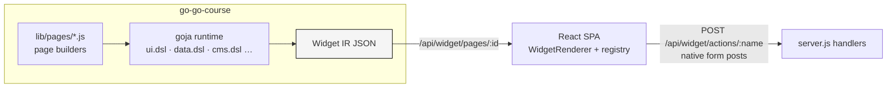
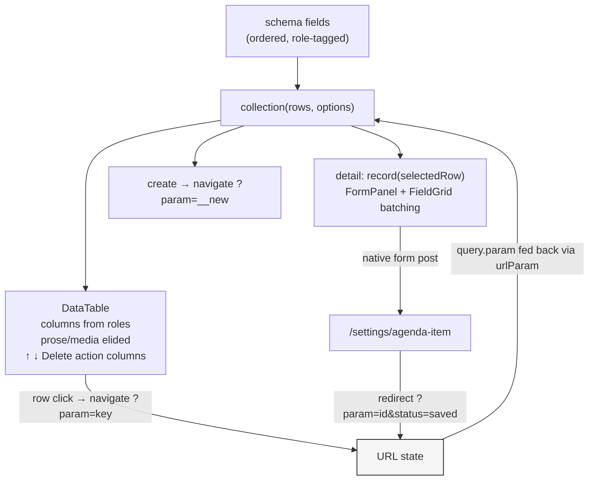

1
# Widget DSL Grammar: Designing an Intent-Level UI Authoring Layer for a Widget IR System

This article documents the design and implementation of a grammar layer for a family of JavaScript UI DSLs embedded in a Go runtime. The work went from a measured audit of a degraded admin page, through a diagnosis of why component-catalog DSLs produce that degradation, to a working implementation: field roles, an order-preserving schema constructor, `record` and `collection` verbs that compile to existing widget IR, a flat sectioning primitive, and a module reorganization that avoided adding a sixth DSL module. The reference system is `rag-evaluation-system` (the widget package and its Go DSL) and `go-go-course` (the consuming application). The full research record lives in the repo tickets `RAGEVAL-CMS-WIDGETS` and `RAGEVAL-UI-GRAMMAR` under `ttmp/2026/07/`.

> [!summary]
> - A DSL that exposes only component factories forces page authors to hand-unroll every collection into repeated boxes; the resulting pages degrade in proportion to collection size, and the failure is grammatical, not stylistic.
> - The fix is a small set of intent-level verbs — `schema`/`f.*`, `record`, `collection`, `section` — that compile to the existing IR, placed inside the existing modules (`data.dsl`, `ui.dsl`) rather than in a new module.
> - The first consumer page went from 5,611 px / 21 nested panels to 3,496 px / 5 panels / zero nesting, with an eight-item editor collapsing into a summary table plus one schema-derived form.

## Why this note exists

Two connected engineering problems recur whenever a team builds a server-driven UI system: what vocabulary the page-authoring layer should expose, and what happens to page quality as content grows. This project produced concrete, measured answers for one such system, plus a reusable design method: audit with DOM metrics, attribute each visual defect to the authoring construct that produced it, and fix the vocabulary rather than the pages. The implementation also surfaced several failure modes — property-order loss across a Go/JS boundary, URL-encoding leaking into human-facing text — that generalize beyond this codebase.

## The system under study

The widget system has three layers. A React package (`@go-go-golems/rag-evaluation-site`) contains a design-system component library and a `WidgetRenderer` that renders a JSON tree called Widget IR. The IR has three node kinds — `text`, `element`, and `component` — where component nodes name a registered widget type and carry serializable props, including declarative `ActionSpec` objects (`navigate`, `server`, `download`, `event`, `copy`, each with an optional `confirm` prompt). A Go package (`pkg/widgetdsl`) exposes five JavaScript modules to a goja runtime: `ui.dsl`, `data.dsl`, `context_window.dsl`, `course.dsl`, and `cms.dsl`. Applications such as go-go-course run page-builder scripts in that runtime; the scripts return IR from `/api/widget/pages/:id`, and a small embedded SPA renders whatever arrives.



Two properties of this architecture matter for everything that follows. First, application state lives in the URL and mutations flow through server actions or native form posts; widgets hold almost no client state. Second, each DSL module was, before this work, a flat map from camelCase helper names to component types — `panel` produces a `Panel` node, `formRow` a `FormRow` node, and so on, roughly seventy helpers across the five modules. The only exceptions were ten `recipes.*` functions (for example `data.recipes.masterDetailTable` and `cms.recipes.mediaLibrary`) that expanded an options object into a multi-widget composition.

The distinction between an API and a DSL is useful here and worth stating precisely. Each module is mechanically a separate `require()`-able JS module, but linguistically the system contains one language: Widget IR, whose semantics are defined by the renderer and the action dispatcher. The five modules are vocabulary namespaces of that language. Before this project, the language had nouns (component factories) and ten frozen sentences (recipes), but no productive grammar — no way to say "edit this collection" and let the system decide what that looks like.

## The evidence: measuring a degraded page

The trigger was the go-go-course admin CMS page, a composition of forms, tables, upload areas, and a media library. It worked — every flow had passed an end-to-end test — but it read badly. Rather than restyle it, the project began by measuring it. A single DOM inspection collects everything needed:

```js
const panels = [...document.querySelectorAll('main [data-rag-layout="Panel"]')];
const top = panels.filter(p => !p.parentElement.closest('[data-rag-layout="Panel"]'));
// per top-level panel: getBoundingClientRect().height, descendant counts for
// FormRow / textarea / input / table / button, and nesting depth via closest()
```

The numbers for the admin page, and for the rest of the application's pages measured the same way:

| Page | Height | Panels (top/total/depth) | Form rows | Reads well? |
|---|---|---|---|---|
| admin-course-cms | 5,611 px | 8 / 21 / 2 | 57 | no |
| admin-course-material | 1,567 px | 5 / 8 / 1 | 0 | no |
| sessions | 800 px | 2 / 2 / 0 | 0 | yes — one recipe |
| handouts (document view) | 5,043 px | 0 | 0 | yes — flat document |
| course landing | 1,048 px | 0 | 0 | yes — domain shell |
| upload, settings | ≤ 800 px | 1–2 / depth 0 | ≤ 5 | yes — single job |

The worst section was the agenda editor: 2,158 px for eight records, rendered as eight nearly identical bordered boxes with a black title bar each ("AGENDA ITEM 1" … "AGENDA ITEM 8 · NEW"), forty form rows in total, and roughly forty percent of the area consumed by empty textareas reserved for potential input. The agenda is a schedule — time, duration, title per row — but nothing on the page displayed it as one.

The correlation in the table is exact, and it is the empirical core of the whole project. Every page that reads well is either a single recipe or shell (intent expressed once, layout owned by the system) or a flat document. Every page that degrades is hand-assembled panels around collections. Length itself is innocent: the 5,043 px handout document with zero panels reads fine. Boxed repetition without summarization is the defect.

## Diagnosis: components without intent

Attributing each defect to the construct that produced it yields a short list, and none of the items are component bugs:

1. **One sectioning device.** The bordered `Panel` served as page section, item card, tool container, and prose frame simultaneously. Border weight was identical at every nesting level, so nesting communicated nothing. A lighter `SectionBlock` existed in the component library but had no policy attached, so authors reached for `panel` every time.
2. **No collection primitive.** Every "N of the same record" was `array.map(handRolledBox)`. Because the system never learned that something was a collection, it could not summarize, elide, paginate, or reorder it. The forty-line `agendaEditorRow` function existed because nothing else did.
3. **Forms always fully expanded.** The record editor was a stack of `formRow` calls; there was no notion of which fields are short and which are prose, so every field consumed a full row and every textarea rendered at full height regardless of content.
4. **Recipes as the proof.** The ten recipes each encoded one intent ("browse rows and inspect one", "manage a media collection") and expanded to a correct, readable composition. The pages built from them were exactly the pages that read well. Recipes were the grammar the system needed, in frozen, non-composable form: one Go function per sentence.

There is also a pre-existing counterexample inside the system that shaped the design. The context-window module already factors its rendering the way a grammar would: a normalized snapshot (data), a hand-written group-by aggregation (transform), a `paletteStyleSet` mapping seventeen semantic style keys to visual encodings (scale), and several interchangeable visualizations — budget bar, stack, strip, treemap — all consuming the same `{snapshot, styleSet}` pair (marks). That factoring exists only inside `context_window.dsl`; no other module has a scale concept, and the snapshot is a bespoke shape rather than a schema'd collection. The design goal was to make that factoring the system's general case.

## Design: a grammar, not a module

The design borrows the layering of the grammar of graphics: a chart is not a monolithic widget but a sentence composed from orthogonal layers — data, transforms, scales, marks, facets. Applied to page authoring:

| Grammar-of-graphics layer | UI grammar layer | Concrete form |
|---|---|---|
| data | data | record objects, record arrays |
| aesthetics/scales | schema | fields with roles: `key`, `primary`, `short`, `prose`, `status`, … |
| statistical transform | shaping | sort, filter, page, group (largely future work) |
| mark | arrangement | table, master-detail, tiles, form, field-grid |
| facet | composition | section, sub-page, dialog |
| — | verbs and bindings | show / edit / pick / manage, bound to ActionSpecs and form posts |

The first design question was where this layer lives. A new `grammar.dsl` module was rejected, for a reason that only became obvious when sketching real pages: a grammar sentence for the media library needs domain vocabulary (`cms` asset schemas and tile marks), data verbs, and structural composition in one expression. Splitting those across a sixth module would give authors two ways to do everything and no pressure to converge. Instead, the grammar's two halves went into the modules whose stated jobs they are. `data.dsl` — previously almost empty, containing only `dataTable` and the `cell.*` helpers — received the data grammar. `ui.dsl` received the structure grammar. The domain modules (`cms`, `course`, `context_window`) shrink, over time, to schemas and marks.

The same decision drove a vocabulary cleanup. Generic primitives had accumulated in domain modules because the tickets that created them were domain tickets: `tag`, `meterBar`, `pagination`, `searchField`, `emptyState`, `tileGrid`, and `breadcrumbs` lived in `cms.dsl`; a generic file-drop widget lived in `context_window.dsl`; the markdown/article renderers lived in `course.dsl`. All were promoted to `ui.dsl`. Because each module's exports come from an independent helper map, promotion is a one-line addition per name, and the old module-local names survive automatically as deprecated aliases — no compatibility shim code exists at all.

## Implementation

### Compile targets

The grammar compiles to plain Widget IR built from components the renderer already registers, which means the React side needed almost nothing. Two additions were made because they were cheap and carry the visible payoff. `SectionBlock` — the existing unboxed section — gained heading levels 1–3 (mapped to the type system's heading/label/metadata font roles), an optional 1 px rule under the label, an actions slot on the label row, an anchor id, and a `flush` density. A new `FieldGrid` layout renders an n-column grid of label/control pairs (`repeat(var(--rag-field-columns), minmax(0, 1fr))`) and collapses to one column under 720 px. Everything else — `DataTable`, `FormPanel`, `FormRow`, `MetadataGrid`, `Stack`, `Button` — was already there.

### Field roles and the schema constructor

A schema names each field's **role**, and the role — not the value's type — decides three things: the summary renderer, the editor control, and the elision rule. `number` ("14h30") and `duration` ("15 min") are both strings; what distinguishes them from a `description` is how they behave in a table row versus an editor.

```js
const agendaSchema = data.schema({
  id:          data.f.key({ hint: "Stable internal anchor." }),
  number:      data.f.short({ label: "Time", width: "8ch", placeholder: "14h30" }),
  duration:    data.f.short({ width: "8ch" }),
  title:       data.f.primary({ required: true, maxLength: 160 }),
  description: data.f.prose({ rows: 4, maxLength: 800 }),
});
```

The twelve roles are `key`, `primary`, `short`, `prose`, `count`, `size`, `measure`, `date`, `status`, `tags`, `media`, and `href`. Their rendering contracts: `prose` and `media` are elided from summary tables entirely; `key` renders as a muted caption cell and defaults to read-only in editors; `status` renders through the design system's `StatusText`; the numeric roles use number cells. In editors, `prose` becomes a stacked textarea and everything else a text input.

The schema constructor contains the single most instructive implementation detail in the project. goja preserves JavaScript property insertion order through `Object.Keys()` on a `*goja.Object`, but exporting an object to Go's `map[string]any` destroys that order — and field order determines column order and form layout. The constructor therefore iterates keys before export and stores fields as an ordered array:

```go
obj := call.Arguments[0].ToObject(r.vm)
fields := []any{}
for _, key := range obj.Keys() {          // insertion order preserved here
    spec := exportObject(obj.Get(key))    // order would be lost after this point
    spec["name"] = key
    fields = append(fields, spec)
}
return r.vm.ToValue(map[string]any{"__ragSchema": true, "fields": fields})
```

Any embedded DSL whose API semantics depend on object-literal order has this problem; capture order at the boundary or lose it.

### The record verb

`data.record(values, {schema, verb, submit, …})` compiles one record. With `verb: "show"` it produces a `MetadataGrid`. With `verb: "edit"` it produces a `FormPanel` whose rows derive from the schema, using a batching pass that gives short fields grid density without configuration:

```
rows = []; grid = []
for field in schema.fields:
    row = FormRow(label, control(field), orientation)
    if field.role is gridable (key/short/count/size/measure/date/status/href):
        grid.append(row)
    else:
        flush grid into FieldGrid(columns = 2, or 3 when ≥ 3) → rows
        rows.append(row)          # primary and prose get full width
flush remaining grid
```

`submit: data.formPost("/settings/agenda-item")` sets the panel's native form action and method. Because `FormPanel` renders a real `<form>` and every control forwards its `name`, saving is an ordinary form post with a redirect — no client mutation machinery.

### The collection verb

`data.collection(rows, options)` is the workhorse. Its summary table derives columns from the schema (applying the elision rules above), appends action columns, and wires selection:

```js
data.collection(agenda, {
  schema: agendaSchema,
  verb: "edit",                       // show | edit | pick | manage
  arrange: "master-detail",           // or "table"
  select: data.urlParam("agenda", query.agenda),
  submit: data.formPost("/settings/agenda-item"),
  reorder: ui.action.server("admin-reorder-course-agenda"),
  remove: { kind: "server", name: "admin-delete-agenda-item",
            confirm: "Delete agenda item “${row.title}”? This cannot be undone." },
  create: { label: "New agenda item" },
})
```

Selection deserves a precise explanation because it is where the no-client-state rule bites. The Go DSL never sees the HTTP request, so it cannot read the current query string. `data.urlParam(name, value)` therefore takes both the parameter name and its current value; the page builder feeds `query.agenda` through. Compilation then goes both directions: the table gets `selectedKey: value` and `onRowSelect: navigate("?agenda=${row.id}")` — a relative query-only target that the renderer resolves against the current path via `history.pushState` — and the detail side looks up the row whose key matches the value. The sentinel value `__new` selects an empty editor, which is also how the create button works: it is nothing but `navigate("?agenda=__new")`.



Reorder and remove bindings become table columns. The reorder action is dispatched with `payload.direction` merged in and the full row available in the action context; the server resolves the row's index by id at handling time. The remove action carries its `confirm` prompt through untouched — the confirm gate is part of the ActionSpec contract and is handled centrally by the renderer's dispatcher.

### The server side of per-record editing

The grammar changed the save granularity from "post the whole list as indexed fields" to "post one record." The consuming application needed three small service functions — `upsertAgendaItem`, `deleteAgendaItem`, `reorderAgendaItemById` — with one subtlety: the agenda's storage is a JSON override file that may not exist, because defaults come from code. The functions therefore take the *effective* list (defaults merged with overrides) as input rather than reading the store, so the first-ever save works. Upsert matches by slugified id and appends when unmatched, which makes `__new` creation fall out with no special case.

## Results

The rebuilt admin page, measured with the same DOM snippet as the audit:

| Metric | Before | After |
|---|---|---|
| Document height | 5,611 px | 3,496 px |
| Panels (total) | 21 | 5 |
| Panel nesting depth | 2 | 0 |
| Agenda section | 2,158 px, 8 item boxes, 40 form rows | ~250 px table + one editor |
| Sectioning | panel borders at every level | six flat ruled sections with anchors |

The five remaining panels are all interactive tools — two form panels, upload drop zones, and the selected-asset card — which is the stated policy: document structure uses sections, tools use boxes. The full flow was verified in the running binary with a browser: row selection through the URL, edit and save round-trip, up/down reorder, creation through `__new` with a generated id, and deletion behind a confirm dialog, including the cancel path.

The end-to-end test also caught a real bug that unit tests had no way to see. The delete confirmation read `Delete agenda item “Smoke%20item”?`. The action-context interpolation function had been written for navigate targets and URL-encoded every substitution; the earlier consumer only interpolated filenames, which cannot contain spaces, so the defect was invisible until a value with a space flowed through. The fix gives interpolation an `encode` option, on by default, disabled only for human-facing confirm text. The general lesson: a template function serving both URL construction and human-visible text will eventually apply the wrong escaping to one of them; make the destination explicit at the call site.

## Working rules

- Audit before redesigning: collect heights, counts, and nesting depths per section, and attribute each defect to the authoring construct that produced it. Restyling a page whose vocabulary is wrong reproduces the problem on the next page.
- When recipes accumulate in a DSL, read them as evidence: each one is a sentence the vocabulary could not express. Generalize the sentences into verbs instead of adding an eleventh recipe.
- Put grammar verbs in existing modules whose job they refine; a new module for the "good way" institutionalizes two ways.
- Compile intent to the existing IR first and add structural widgets second. The grammar shipped without touching the renderer, which made the first consumer page a two-build exercise.
- Capture JS object property order with `Object.Keys()` before exporting to Go maps whenever an embedded API's semantics depend on declaration order.
- Keep selection in the URL and pass its current value into the DSL explicitly; the authoring layer should never grow a hidden dependency on the request.
- Escape at the destination, not in the template engine: URL targets encode, human-facing text does not, and the call site must say which it is.
- Promote misplaced helpers by adding names to the correct module's map and leaving the old names as aliases; deleting them buys nothing and breaks existing pages.

## What remains

The marks contract is the unvalidated half of the design: `arrange:` currently accepts only the two built-in table shapes, and the claim that domain modules reduce to "schemas + marks" is only proven once the bespoke media-library panel is expressible as `data.collection(assets, {arrange: cms.marks.assetTiles, …})` with the existing recipe becoming a one-line wrapper. After that: promoting the context-window `styleSet` mechanism into shared `data.scale.*` encodings consumed by `f.status` and `f.measure`; a declarative `group:` shaping option to replace the hand-written snapshot aggregation; and the sub-page split (`ui.subpages`) so the admin area becomes several screen-sized pages instead of one 3,500 px scroll. The research record — audit data, design docs 01/02, and a step-by-step diary including everything that failed — lives in `rag-evaluation-system/ttmp/2026/07/04/RAGEVAL-UI-GRAMMAR--…/`, with the implementation in commits `51aca3c`, `4a70c56`, `9c91539` (rag-evaluation-system) and `319c545` (go-go-course).

## Related notes

- Source tickets: `RAGEVAL-CMS-WIDGETS` (the CMS widget set and cms.dsl that produced the audited page) and `RAGEVAL-UI-GRAMMAR` (audit, design, implementation) under the repo's `ttmp/` tree.
- Key implementation files: `pkg/widgetdsl/grammar.go` and `grammar_test.go`, `pkg/widgetdsl/module.go` (module specs and helper maps), `packages/rag-evaluation-site/src/components/layout/{SectionBlock,FieldGrid}/`, and `go-go-course/cmd/go-go-course/lib/pages/admin-course-cms.js` (the first grammar consumer).
