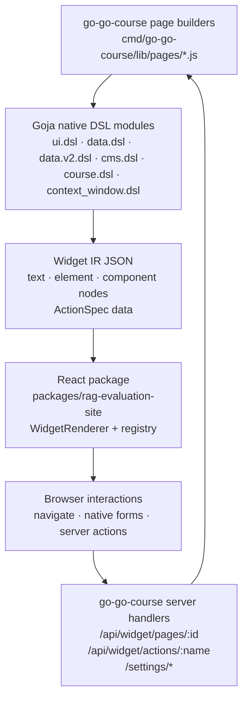
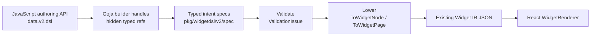
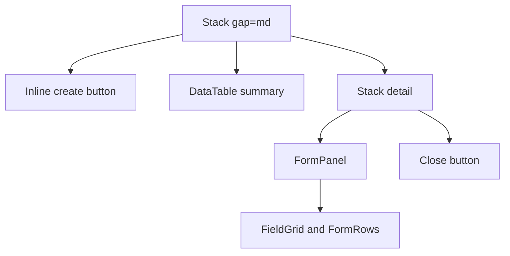
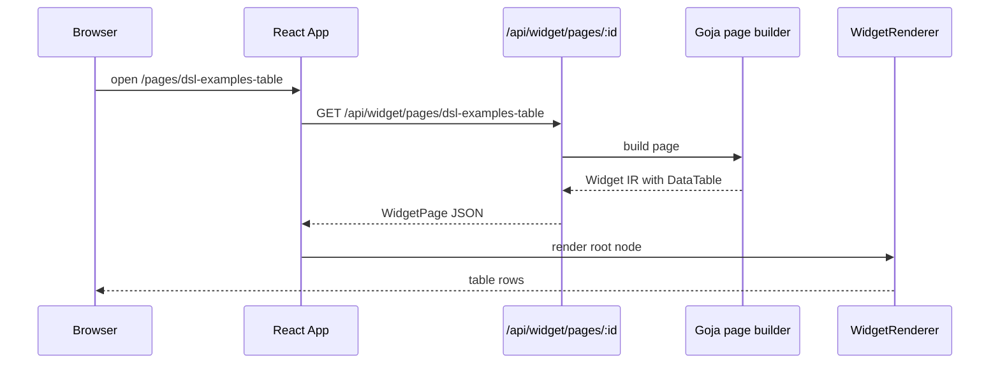
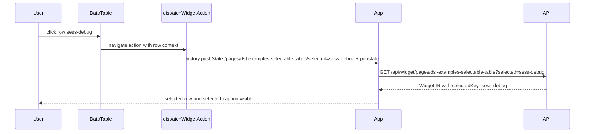
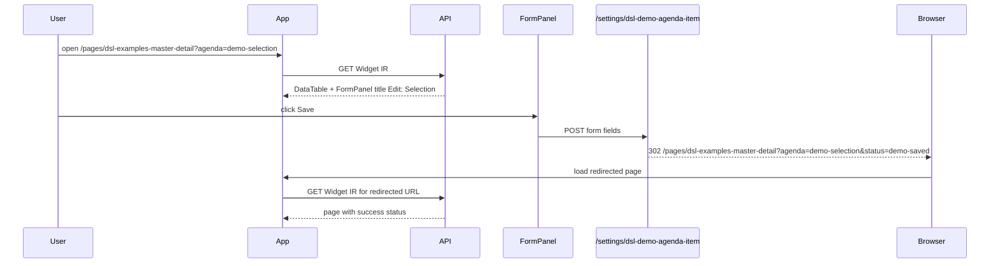
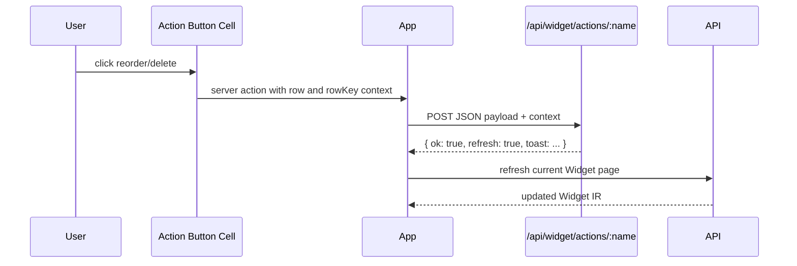

# Widget DSL V2 Cutover: Typed Fluent Builders for Server-Driven Widget IR

This is the typed-builder migration branch of the [[widget-dsl]] project map.

This article is a technical report on the Widget DSL v2 cutover work in `rag-evaluation-system` and `go-go-course`. It explains why the current Widget DSL grammar was useful but insufficient, how the v2 typed/fluent builder layer is being introduced, what has been implemented so far, how the live examples behave, and what remains before the old option-bag public API can be removed.

The report is written as a deep dive rather than as a changelog. The implementation spans Go structs, Goja native modules, React Widget IR rendering, TypeScript action types, generated xgoja packages, embedded SPA assets, live demo pages, documentation cleanup, browser validation, and ticket bookkeeping. The central design decision is that v2 treats the old grammar as evidence, not as a contract. The new authoring layer builds typed intent specs first, validates them, and lowers them to the existing Widget IR renderer.

> [!summary]
> - The original `data.dsl` grammar improved page authoring but still exposed raw option bags and marker maps. V2 replaces that authoring substrate with typed specs and fluent builders.
> - The implemented v2 path is `data.v2.dsl`: schemas, fields, collections, URL selection, master-detail editors, row actions, validation, and lowering to current Widget IR are working.
> - Live `go-go-course` demo pages now cover simple tables, selectable tables, master-detail editors, and row/server actions. They have been browser-tested with screenshots and API checks.
> - The remaining work is mainly hardening: action/browser tests, precise TypeScript declarations, export parity, porting real pages, and finally deleting v1 public exports from the v2 surface.

## Why this note exists

The Widget DSL work reached a point where a design report alone was no longer enough. The project now has executable code, demo pages, generated runtime wiring, visual evidence, and a task tracker. A future reader needs to understand both the design direction and the implementation state: what has already landed, what is still provisional, which files define the behavior, and which remaining tasks are risky.

The earlier article [[ARTICLE - Widget DSL Grammar - Designing an Intent-Level UI Authoring Layer for a Widget IR System]] documented the first grammar layer. That work introduced `schema`, field roles, `record`, `collection`, and `ui.section` as an intent-level authoring layer over Widget IR. It was a productive first step. It made a real admin page more readable and showed that the system needed verbs such as “show this collection as a table” and “edit this collection as master-detail.”

The current work answers the next question: how should that grammar be implemented when the system grows? The answer is not “more option bags.” V2 moves the grammar into typed intent specs, builder handles, validation terminals, precise action data, and examples that can be tested by small models and humans.

## The system being changed

The runtime has four major layers.



The React renderer is data-driven. It receives a `WidgetPage` JSON object, looks up component adapters by `type`, renders registered React components, and dispatches serialized actions. The Goja page builders are responsible for producing the page JSON. That boundary is important: the browser does not receive JavaScript closures from the Goja runtime. It receives JSON nodes and JSON action descriptors.

The old `data.dsl` grammar already used this renderer. Its `data.collection(rows, options)` helper compiled an option map into a `DataTable`, optional create button, optional detail `FormPanel`, reorder/delete action columns, and URL-backed selection. The improvement was real, but the public API remained weakly typed:

```js
data.collection(agenda, {
  schema: agendaSchema,
  verb: "edit",
  arrange: "master-detail",
  select: data.urlParam("agenda", query.agenda),
  submit: data.formPost("/settings/agenda-item"),
  reorder: ui.action.server("admin-reorder-course-agenda"),
  remove: { kind: "server", name: "admin-delete-agenda-item", confirm: "Delete ${row.title}?" },
})
```

This form has several known failure modes:

- A typo in `arrange` or `verb` is just a string error unless every option is decoded strictly.
- A wrong marker object can travel through the system until a later runtime panic or malformed IR.
- Field roles combine several concepts — storage type, semantic role, editor control, summary cell, layout, and validation — into one string.
- TypeScript declarations cannot describe the allowed object shapes precisely when everything is `Props = Record<string, any>`.
- Small models can imitate the option-bag shape easily, but they also imitate its mistakes easily.

V2 keeps the useful vocabulary and replaces the authoring substrate.

## The hard-cutover rule

The ticket decision is a hard cutover. V1 is evidence, not compatibility law. That matters because compatibility facades preserve the exact shapes the redesign is trying to remove. The v2 implementation should not keep `data.collection(rows, { ... })` alive as a recommended public API. It should not expose raw schema marker maps. It should not accept raw action maps as the blessed action-authoring form. If raw Widget IR remains available, it should live under an explicit unsafe namespace and be treated as a sign that the DSL is missing a concept.

The practical consequence is that v2 is implemented as a new module during development:

```js
const data = require("data.v2.dsl")
```

This name is intentionally explicit while the implementation is still experimental. It allows v2 examples and demos to coexist with existing `data.dsl` production pages. Later, the team can decide whether `data.v2.dsl` replaces `data.dsl`, whether `data.dsl` becomes the v2 surface, or whether both are kept temporarily with clear public documentation.

## The v2 implementation model

V2 has three layers inside `pkg/widgetdsl`.



The key files are:

| File | Role |
|---|---|
| `pkg/widgetdsl/v2/spec/types.go` | Defines typed specs: pages, nodes, schemas, fields, collections, actions, templates, validation issues. |
| `pkg/widgetdsl/v2/spec/validate.go` | Validates spec invariants before lowering. |
| `pkg/widgetdsl/v2/spec/lower.go` | Converts typed specs to current Widget IR maps. |
| `pkg/widgetdsl/v2/spec/lower_test.go` | Tests simple table, selectable table, master-detail, invalid arrangement, and new-item editability behavior. |
| `pkg/widgetdsl/v2_builders.go` | Exposes `data.v2.dsl` Goja builders with hidden typed refs. |
| `pkg/widgetdsl/v2_builders_test.go` | Runs JavaScript through Goja and asserts emitted IR. |
| `pkg/xgoja/providers/widgetsite/provider.go` | Advertises `data.v2.dsl` to generated xgoja runtimes. |
| `packages/rag-evaluation-site/src/widgets/actions.ts` | Hydrates v2 payload templates and centralizes action dispatch behavior. |
| `packages/rag-evaluation-site/src/widgets/ir.ts` | Adds TypeScript action/template/payload shapes. |
| `go-go-course/cmd/go-go-course/lib/pages/dsl-examples.js` | Live v2 demo pages. |

The model is deliberately incremental. The renderer is not rewritten first. Instead, typed specs lower to the current IR components: `DataTable`, `FormPanel`, `FormRow`, `FieldGrid`, `Stack`, `Inline`, `Button`, `Caption`, and `SectionBlock`. This keeps the hard part localized: replacing the authoring substrate while preserving the proven runtime renderer.

## Typed specs: the authoring substrate

The v2 typed spec package defines the intent objects that builder methods produce. The important types are `SchemaSpec`, `FieldSpec`, `CollectionSpec`, `SelectionSpec`, `ActionSpec`, `TemplateSpec`, and `ValidationIssue`.

A simplified version of the collection model is:

```go
type CollectionSpec struct {
    Name        string
    Rows        []JSONObject
    Schema      SchemaSpec
    Mode        CollectionMode
    Selection   *SelectionSpec
    Arrangement ArrangementSpec
    Actions     CollectionActions
    Empty       string
}

type CollectionActions struct {
    Open    *ActionSpec
    Create  *CreateActionSpec
    Submit  *SubmitSpec
    Reorder *ActionSpec
    Remove  *ActionSpec
}
```

This structure separates concepts that were previously compressed into option keys. `Mode` says whether the collection is shown or edited. `Arrangement` says whether it is a table or master-detail editor. `Selection` says where selected state lives. `Actions` names the operations available from rows or forms. The compiler does not need to infer all of that from a loose map.

Validation runs before lowering. It checks, among other things:

- page IDs are present;
- node kinds are known;
- section levels are in range;
- schemas have fields;
- field names are unique;
- at most one key field is present;
- collection modes and arrangement kinds are known;
- URL selection has a parameter name;
- server actions have names;
- navigate/download actions have targets;
- payload template fields have names;
- template paths are present.

The validation surface turns common v1 failure modes into concrete diagnostics. A typo such as `mast-detail` becomes `collection.arrangement.invalid`, not a renderer surprise.

## Lowering: typed intent to existing Widget IR

Lowering is the conversion from typed specs to JSON-compatible Widget IR. The current lowering path intentionally emits component trees the existing React package already knows how to render.

A simple collection lowers to:

```js
{
  kind: "component",
  type: "Stack",
  props: { gap: "md" },
  children: [
    {
      kind: "component",
      type: "DataTable",
      props: {
        rows,
        getRowKey: "sessionId",
        columns: [/* derived from schema */]
      }
    }
  ]
}
```

A master-detail collection lowers to a composed tree:



The v2 lowering code preserves the current interaction model:

- URL-backed selection sets `selectedKey` and row-click navigation.
- `__new` opens a blank form.
- Existing key fields are read-only by default.
- New-item key fields are editable unless explicitly marked read-only.
- Native form submit is still a normal `<form action="..." method="post">`.
- Reorder/delete are server actions with row context.

The `__new` behavior required a correction during validation. The first version opened a blank form but kept the key field read-only because key fields are read-only for existing rows. That made “New demo agenda item” look inert. The lowering path now treats `__new` as an editable-key context. Existing rows remain protected; blank rows can accept an ID.

## Goja builders: the public v2 API

The current implemented public surface is `data.v2.dsl`. It exposes builder handles rather than option bags.

### Simple table

```js
const data = require("data.v2.dsl")

const sessionSchema = data.schema("Session")
  .field("sessionId", data.f.key().label("ID").width("14ch"))
  .field("title", data.f.primary().label("Title").required().maxLength(120))
  .field("turnCount", data.f.count().label("Turns"))
  .field("status", data.f.status().label("Status"))
  .field("body", data.f.prose().label("Body").rows(3))
  .build()

return data.collection("sessions", sessions)
  .schema(sessionSchema)
  .table()
  .toIR()
```

### Selectable table

```js
data.collection("sessions", sessions)
  .schema(sessionSchema)
  .select(s => s.urlParam("selected", query.selected))
  .table(t => t.rowSelect(
    data.action.navigate("/pages/dsl-examples-selectable-table?selected=${row.sessionId}")
  ))
  .toIR()
```

Selection and row activation are separate concepts. Selection controls which row is highlighted. Row activation controls what happens when the row is clicked. If a selection exists and no explicit row action is supplied, lowering can derive a default query-string navigation action. If an explicit row action is supplied, it wins.

### Master-detail editor

```js
data.collection("agenda", agenda)
  .schema(agendaSchema)
  .edit(e => e
    .selectUrl("agenda", query.agenda)
    .submitPost("/settings/dsl-demo-agenda-item")
    .create({ label: "New demo agenda item" }))
  .masterDetail()
  .toIR()
```

This produces a summary table, a detail form when `?agenda=<id>` is present, and a blank form when `?agenda=__new` is present. The demo route intentionally redirects without persistent mutation.

### Row actions

```js
data.collection("agenda", agenda)
  .schema(agendaSchema)
  .edit(e => e
    .selectUrl("agenda", query.agenda)
    .submitPost("/settings/dsl-demo-agenda-item")
    .create({ label: "New demo agenda item" })
    .actions(a => a
      .reorder(data.action.server("dsl-demo-reorder-agenda"))
      .remove(data.action.server("dsl-demo-delete-agenda")
        .confirm("Delete demo agenda item “${row.title}”?"))))
  .masterDetail()
  .toIR()
```

This currently lowers confirm templates to the existing string interpolation format. The frontend now also has typed template and payload-template types, so later builder APIs can move toward fully structured templates without changing the high-level action concept.

## Hidden typed refs in Goja

Goja values cross the Go/JavaScript boundary as `goja.Value`. If a JavaScript builder returns a normal object, Go needs a way to recover the typed Go object behind that handle. The current implementation attaches a non-enumerable internal property to builder objects:

```go
const v2RefProperty = "__widgetdsl_v2_ref"

type v2Ref struct {
    kind       string
    field      *v2spec.FieldSpec
    schema     *v2spec.SchemaSpec
    collection *v2spec.CollectionSpec
    action     *v2spec.ActionSpec
    selection  *v2spec.SelectionSpec
}
```

The internal property is not part of the authoring API. It is an implementation detail that lets Go distinguish a field handle from a schema handle from an action handle. This is not a security boundary. It is a runtime type-carrying mechanism for a single embedded JavaScript VM.

The builder layer rejects present non-function callbacks. This rule matters because optional lambdas should be pleasant while invalid lambdas should be precise errors. If a callback is omitted, defaults apply. If a callback argument is present and not a function, the builder reports an error.

```go
fn, ok := goja.AssertFunction(args[0])
if !ok {
    panic(r.vm.NewGoError(fmt.Errorf(
        "data.v2.dsl collection.table(callback) requires a function when an argument is present",
    )))
}
```

This preserves the useful part of optional lambda configurators without repeating the silent-ignore behavior that made v1 option bags fragile.

## Frontend Action IR changes

The frontend work added enough Action IR v2 support to make row/server actions reliable.

The TypeScript IR now has typed template and payload-template shapes:

```ts
export interface TemplateSpec {
  kind?: "template";
  parts: TemplatePartSpec[];
}

export type TemplatePartSpec = TemplateTextPart | TemplatePathPart | TemplateLiteralPart;

export interface PayloadTemplateSpec {
  kind: "payloadTemplate";
  fields: Record<string, TemplatePartSpec | JsonValue>;
}
```

The action dispatcher can hydrate payload templates from context:

```ts
resolveActionPayload(action.payload, context)
```

It also renders typed confirm templates and keeps string confirm prompts working. Server actions posted from `App.tsx` now send hydrated payloads. Direct navigation actions from `AppNav` and `CourseStudioShell` go through `dispatchWidgetAction`, so confirmation handling is not bypassed.

The DataTable action-cell context bug was also fixed. Previously an action button cell computed `rowKey` with `rowKey(row, "file")`, which worked for file tables but was wrong for agenda/session rows. The DataTable adapter now passes the table's own `getRowKey` into `renderCell`, and action cells use that spec.

```tsx
renderCell(
  column.cell,
  row,
  ctx.renderNode,
  (action, context) => ctx.dispatchAction(action, context),
  props.getRowKey,
)
```

That change is small but important: server actions now receive row identity that matches the table, not a hard-coded field from another domain.

## Live demo pages

The live demo pages live in `go-go-course/cmd/go-go-course/lib/pages/dsl-examples.js`.

| URL | Purpose |
|---|---|
| `/pages/dsl-examples-table` | Simplest v2 collection table. No row click, no mutation. |
| `/pages/dsl-examples-selectable-table` | URL-backed selected row. Row click changes `?selected=...` and refetches Widget IR. |
| `/pages/dsl-examples-master-detail` | Master-detail editor with native form submit and non-persistent demo route. |
| `/pages/dsl-examples-actions` | Row/server actions with reorder/delete columns and refresh/toast responses. |

The demos are intentionally small. They use in-memory arrays and safe server routes. The master-detail save route redirects to a status URL without modifying course metadata. The action demo handlers return `refresh` and `toast` without persistent mutation.

The current user-facing clarification for “New demo agenda item” is:

> New-item mode opens a blank, editable form. This demo route does not persist a new row; Save only redirects back with a success status.

That sentence matters because the demo is not yet a data-store example. It is an interaction example. It verifies that the v2 grammar can produce the correct Widget IR and that the browser/server flow works.

## Event timelines

The event behavior is documented in detail in `design-doc/06-widget-dsl-event-timelines-and-cutover-task-plan.md`. The most important timelines are below.

### Simple table



There is no row-click action. Clicking a row should not send a request.

### Selectable table



Selection is URL state. That keeps selected pages bookmarkable and allows the backend to build detail panes from query params.

### Master-detail native form



Native form submit remains useful. It is understandable, accessible, and easy to connect to redirect-based status handling.

### Row/server action



The row action path is the reason the DataTable row-key fix matters. If the table says the key is `id`, the action context should say the row key is `row.id`.

## Browser validation

The demos have been tested beyond unit tests.

The local runtime was built and served with:

```bash
cd /home/manuel/workspaces/2026-07-03/improve-rag-evaluation-system/go-go-course
make build

cd cmd/go-go-course
go run ./hotreload-host -listen 127.0.0.1:8787
```

The first build attempt failed because `server.js` imported `data.v2.dsl`, but the generated package did not select that module:

```text
Error: server.js imports unknown bare specifier "data.v2.dsl"
```

The fix was to expose the module in `pkg/xgoja/providers/widgetsite/provider.go` and select it in `go-go-course/cmd/go-go-course/xgoja.package.yaml`. This is an important rule for generated xgoja binaries: registering a module in the low-level DSL package is not enough. The provider must advertise it, and the consuming generated runtime must select it.

API checks verified the core behavior:

```bash
curl -fsS http://127.0.0.1:8787/api/widget/pages/dsl-examples-table | jq '.id'
# dsl-examples-table

curl -fsS 'http://127.0.0.1:8787/api/widget/pages/dsl-examples-selectable-table?selected=sess-debug' \
  | jq '.. | objects | select(.type?=="DataTable") | .props.selectedKey'
# sess-debug

curl -fsS 'http://127.0.0.1:8787/api/widget/pages/dsl-examples-master-detail?agenda=demo-selection' \
  | jq '.. | objects | select(.type?=="FormPanel") | .props.title'
# Edit: Selection
```

The demo server action path was checked with a JSON POST:

```bash
curl -fsS -X POST http://127.0.0.1:8787/api/widget/actions/dsl-demo-reorder-agenda \
  -H 'Content-Type: application/json' \
  --data '{"payload":{"direction":"up"},"context":{"row":{"id":"demo-actions","title":"Actions"},"rowKey":"demo-actions","componentType":"DataTableCell"}}'
```

Expected result:

```json
{
  "ok": true,
  "refresh": true,
  "toast": "Demo reorder demo-actions up",
  "data": { "rowId": "demo-actions", "direction": "up" }
}
```

Screenshots were captured with Playwright CLI and stored under the ticket:

```text
rag-evaluation-system/ttmp/2026/07/05/GOJA-DSL-PLAYBOOK--goja-fluent-builder-dsl-playbook-base-research-and-resource-catalogue/artifacts/dsl-demo-screenshots/
├── table.png
├── selectable.png
├── master-detail.png
├── master-detail-new.png
└── actions.png
```

A later visual pass found a real defect: form submit buttons appeared as small black squares. The root cause was not only CSS. The `FormPanel` component had a default parameter `submitLabel = "Save"`, but the widget adapter passed `null` for an absent renderable label. React default parameters apply to `undefined`, not to `null`. The fix is an internal nullish fallback:

```tsx
const resolvedSubmitLabel = submitLabel ?? "Save";
```

Button CSS also now gives normal and compact buttons minimum sizes and inline-flex centering. The updated screenshots show visible `Save` and `Close` labels.

## Public documentation cleanup

The public provider docs were updated so new readers do not learn the v1 option-bag grammar as the primary path.

Updated files:

- `pkg/xgoja/providers/widgetsite/doc/01-widget-dsl-getting-started.md`
- `pkg/xgoja/providers/widgetsite/doc/02-widget-dsl-js-api-reference.md`

The docs now:

- list `data.v2.dsl` in the module table;
- show v2 table/selectable/master-detail/action examples first;
- label the old `data.dsl` `schema`/`record`/`collection` grammar as legacy/current-runtime behavior;
- link the live demo pages;
- keep direct `data.dsl.dataTable` examples where they are still useful for existing low-level Widget IR usage.

Historical ticket docs under `ttmp/2026/07/04/RAGEVAL-UI-GRAMMAR...` were not rewritten. They are evidence of the v1 design process. The point of cleanup is not to erase history; it is to make current public examples point in the right direction.

## Task status

At the time of writing, the `GOJA-DSL-PLAYBOOK` ticket has completed most of the implementation scaffolding and demo work.

| Phase | Status | Notes |
|---|---:|---|
| P0 baseline/planning | complete | Companion event-timeline document, task tracker, demo inventory, baseline commands. |
| P1 typed specs | complete | Types, validation, lowering, tests. |
| P2 Goja builders | complete | Hidden refs, schema/field builders, collections, selectable tables, master-detail, runtime tests. |
| P3 Action IR foundations | partial | Template/payload types, hydration, confirm centralization, DataTable row key fix complete. Formal action tests remain. |
| P4 demos/docs cleanup | complete | Four live demo pages, public docs cleanup, screenshot evidence. |
| P5 TypeScript declarations | not started | Precise v2 declarations and parity tests remain. |
| P6 real page rewrite | not started | Admin agenda, media library, and session browse still need v2 rewrites. |
| P7 CI/handoff | not started | Lint checks, final validation, final docs. |

The remaining task list is:

- P3.4: add action tests for navigate, reorder, delete, confirm cancel, and refresh.
- P5.1: generate precise v2 TypeScript declarations.
- P5.2: add runtime export parity and TypeScript positive/negative fixtures.
- P6.1: rewrite admin agenda editor to v2 master-detail API.
- P6.2: rewrite media library and session browse examples to v2 APIs.
- P6.3: delete old public v1 exports from v2 modules.
- P7.1: add CI/lint checks rejecting v1 public option-bag APIs in v2 modules.
- P7.2: run full validation, update docs/diary, and prepare final handoff bundle.

The next engineering decision is whether to add a frontend test harness first or to use Playwright as the action test substrate. Since the frontend package currently has no Vitest/Jest setup, Playwright is the most direct route for P3.4 because it can test the actual browser behavior: URL navigation, confirm cancel, JSON POST, refresh, and visible status.

## Current failure modes and open decisions

### The v2 module name is provisional

`data.v2.dsl` is useful during development because it prevents accidental compatibility. It also makes examples explicit. Long-term, there are two viable outcomes:

1. `data.v2.dsl` becomes the new `data.dsl` in a hard cutover.
2. `data.v2.dsl` remains as a migration-stage module until all real pages are ported.

The hard-cutover principle argues for the first outcome once P6 is complete.

### TypeScript is not yet precise enough

The runtime builders are typed in Go, but the public `.d.ts` story is still behind. The old `TypeScriptModule` generator emits broad helper signatures and `Props = Record<string, any>` for high-level APIs. V2 needs declaration surfaces that express builder handles and reject removed v1 shapes.

A useful negative fixture should fail:

```ts
// @ts-expect-error v1 option-bag collection is gone in v2
data.collection(rows, { schema, arrange: "master-detail" })

// @ts-expect-error callback must be a function
data.collection("sessions", rows).table({ not: "a function" })
```

This is not documentation polish. It is part of the DSL contract. Agents and humans both use declarations as the executable memory of the API.

### Public docs are cleaned up; real pages are not yet ported

The provider docs now point new authors at v2, but `go-go-course` still has existing v1 consumers. The admin Course CMS page still uses `dataDsl.collection(..., { verb: "edit", arrange: "master-detail" })`. That is acceptable only because P6 is explicitly open. The v1 page is a runtime fixture until it is rewritten.

### The demo create path is non-persistent

“New demo agenda item” opens a blank form and submits to a safe redirect route. It does not insert a row into the in-memory demo array. That is intentional for now, and the UI says so. A persistent demo would require either session memory or a small server-side demo store. That can be added later if the demos need to teach persistence rather than form behavior.

## Working rules extracted from this work

The project produced several reusable rules for embedded DSL work.

- Build typed intent specs before exposing fluent builders. Builders without a typed target become method-shaped maps.
- Treat optional lambdas as configurators, not callbacks that cross the browser boundary. The browser receives data.
- Reject present non-function callbacks. Missing callback means defaults; wrong callback type means error.
- Keep URL selection as data for table/detail pages. It supports reload, bookmarks, and backend-built detail panes.
- Keep native form posts for simple record saves when redirect semantics are acceptable. They are simpler than inventing a client mutation protocol for every form.
- Generate or test TypeScript declarations as part of the API. Broad declarations allow bad examples to compile.
- Public examples are part of the API surface. Deprecated examples must be labelled or removed, not left beside current examples as equal choices.
- Validate demos in the generated runtime, not only in package tests. A Goja module must be registered, advertised by the provider, selected by the generated app, and imported by the page script before it exists in the real runtime.

## Near-term next steps

The next implementation sequence should be:

1. Commit the current form-control and new-item fixes in both repos.
2. Add Playwright-based browser smoke tests for the four demo pages and the action flows.
3. Generate precise v2 TypeScript declarations.
4. Add runtime export parity tests for `data.v2.dsl`.
5. Rewrite the admin agenda editor from v1 `dataDsl.collection(..., options)` to v2 `dataV2.collection(...).edit(...).masterDetail().toIR()`.
6. Rewrite the session browse and media-library examples to v2 or explicitly classify the remaining low-level calls.
7. Add a lint/CI check that public v2 examples do not use v1 option-bag shapes.
8. Decide the final module naming and delete old public exports from the v2 surface.

The system is now past the sketch stage. The v2 path has typed specs, validation, lowering, Goja builders, runtime tests, live pages, generated runtime wiring, public docs, and screenshots. The remaining work is to harden it until it can replace the v1 public grammar without ambiguity.
