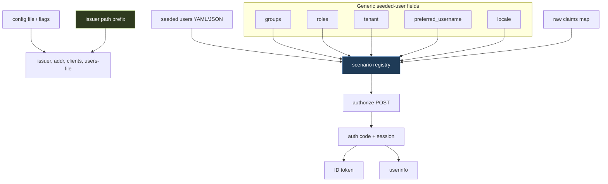

# tinyidp: From Mock OIDC Provider to Reusable Auth Test Fixture

This report explains the July 2026 follow-up work that moved `tinyidp` from a capable mock OpenID Connect provider into a more reusable test fixture for generated applications, especially the `go-go-goja` personal knowledge inbox examples. The earlier reports covered the foundation: the authorization-code flow, the scenario registry, the Glazed configuration layer, sessions, refresh tokens, multiple clients, JWKS failure modes, and the first proof that `tinyidp` could replace a Keycloak container for an xgoja browser-login smoke. This report covers the next layer: provider-neutral seeded-user ergonomics, optional fixture passwords, path-based issuer support, portable config files, and validated xgoja smoke usage.

The work is collected in PR [wesen/2026-06-22--mock-oidc-idp#1](https://github.com/wesen/2026-06-22--mock-oidc-idp/pull/1). It spans the tinyidp repo and one adjacent xgoja helper change. The tinyidp branch is `task/goja-express-auth`; the adjacent xgoja branch is `task/api-auth-device-login`, where commit `eccfa5b` teaches the Step 06 smoke helper to submit the new fixture password.

> [!summary]
> - `tinyidp` now supports provider-neutral seeded-user claim shortcuts: `groups`, `roles`, `tenant`, `preferred_username`, and `locale`. These are expanded into ordinary top-level token and userinfo claims, while raw `claims` remains available for unusual shapes.
> - Seeded users can now define optional fixture passwords. A configured password is validated during authorize POST; an omitted password preserves the original permissive local-test behavior.
> - Path-based issuers are supported as URL-shape compatibility. The same OIDC routes are mounted at the root and at the issuer path prefix, while claims stay generic and provider-neutral.
> - Checked-in config examples and users files make the root-issuer, path-issuer, public-SPA, confidential-web-app, and personal-inbox use cases copy/pasteable and testable with `print-config`.
> - The work was validated through unit tests, server-flow tests, full repository tests, discovery checks, and xgoja Step 06 smokes for both root and path issuers.

## Why this follow-up exists

The first version of `tinyidp` proved that a small Go binary can replace Keycloak for many relying-party tests. It implemented the protocol surface a relying party needs: discovery, JWKS, authorize, token, userinfo, sessions, refresh tokens, logout, and scenario-driven failure modes. That foundation made the provider technically sufficient, but not yet convenient enough to reuse across examples.

The friction showed up in three places.

First, seeded users were powerful but verbose. A user file could already express arbitrary nested claims through `claims`, but common authorization tests repeatedly needed the same simple top-level claims: groups, roles, tenant, preferred username, and locale. Requiring every fixture author to write those under a generic map made the most common case look like the advanced case.

Second, the login form had a password input that was always ignored. That was correct for the original design, where any login name was a scenario selector. It became awkward once the personal-inbox examples wanted realistic Alice and Bob credentials. A generated browser smoke that sees `alice-password` on the page should be able to submit it, and a negative test should be able to prove that a wrong password does not create a session.

Third, replacing a Keycloak tutorial involves more than the protocol flow. Existing examples often expect an issuer URL with a path component, and people need copy/pasteable configuration that gets `issuer`, `addr`, `client-id`, `redirect-uris`, and `users-file` right at the same time. The earlier proof showed the flow worked with a root issuer. The follow-up made both root and path-issuer usage explicit and validated.

## The architectural boundary: generic OIDC, not provider emulation

The most important design correction in this work was the decision to keep claim presets generic. The initial follow-up ticket was written as “Keycloak-compatible claim presets,” with possible fields for realm roles and client roles. That direction was rejected. The system should remain a generic local OIDC provider, not a partial Keycloak model.

That decision produces a clean boundary:

| Capability | Included | Reason |
|---|---:|---|
| Path-based issuer URLs | Yes | Some relying parties are configured with issuer paths, and OIDC discovery can advertise endpoints under that path without changing claim semantics. |
| Generic top-level claims | Yes | `groups`, `roles`, `tenant`, `preferred_username`, and `locale` are common relying-party authorization inputs. |
| Raw arbitrary claims | Yes | Tests still need an escape hatch for unusual or provider-specific structures. |
| Keycloak realm/client role schema | No | That would promote one provider's authorization vocabulary into tinyidp's first-class model. |
| Keycloak admin API or realm import | No | The provider is a protocol test fixture, not a Keycloak emulator. |

This boundary matters because it keeps the provider small. Path-based issuers are about endpoint routing. Claim presets are about fixture ergonomics. They do not have to imply each other.

The corrected mental model is:



The scenario registry remains the central behavior model. The new fields only make it easier to construct scenarios from user files.

## Seeded users became the fixture boundary

The implementation extends `internal/scenario/seeded_users.go`. Seeded users are still converted into normal scenarios. That is the correct boundary because the HTTP layer already knows how to carry a scenario through authorize, token, and userinfo. There is no new user database, no alternate account model, and no endpoint-specific claims code.

The resulting seeded-user schema is compact:

```go
type SeededUser struct {
    Login    string `json:"login" yaml:"login"`
    Sub      string `json:"sub" yaml:"sub"`
    Email    string `json:"email" yaml:"email"`
    Name     string `json:"name" yaml:"name"`
    Password string `json:"password" yaml:"password"`

    EmailVerified      *bool `json:"email_verified" yaml:"email_verified"`
    EmailVerifiedKebab *bool `json:"email-verified" yaml:"email-verified"`

    Groups            []string `json:"groups" yaml:"groups"`
    Roles             []string `json:"roles" yaml:"roles"`
    Tenant            string   `json:"tenant" yaml:"tenant"`
    PreferredUsername string   `json:"preferred_username" yaml:"preferred_username"`
    Locale            string   `json:"locale" yaml:"locale"`

    Claims     map[string]any `json:"claims" yaml:"claims"`
    OmitClaims []string       `json:"omit_claims" yaml:"omit_claims"`
    Category   string         `json:"category" yaml:"category"`
}
```

The conversion step makes the design concrete. It derives the base user from the normalized login, applies explicit identity overrides, expands generic claim presets, overlays raw `claims`, applies `email_verified`, and finally returns a scenario.

```go
func seededUserToScenario(su SeededUser) (Scenario, error) {
    login := user.Normalize(su.Login)
    if login == "" {
        return Scenario{}, fmt.Errorf("login is required")
    }

    u := user.FromLogin(login)
    if strings.TrimSpace(su.Sub) != "" {
        u.Sub = strings.TrimSpace(su.Sub)
    }
    if strings.TrimSpace(su.Email) != "" {
        u.Email = strings.TrimSpace(su.Email)
    }
    if strings.TrimSpace(su.Name) != "" {
        u.Name = strings.TrimSpace(su.Name)
    }

    extra := genericClaimPresets(su)
    for k, v := range su.Claims {
        extra[k] = v
    }
    if ev := firstBool(su.EmailVerified, su.EmailVerifiedKebab); ev != nil {
        extra["email_verified"] = *ev
    }

    return Scenario{
        Name:        login,
        Description: "seeded user from users file",
        Category:    category,
        User:        u,
        Password:    strings.TrimSpace(su.Password),
        ExtraClaims: extra,
        OmitClaims:  append([]string(nil), su.OmitClaims...),
    }, nil
}
```

Two details are worth preserving for future work.

The raw `claims` map is applied after the generic fields. This makes the convenience fields exactly that: conveniences. A fixture author who needs an unusual `roles` shape can write it explicitly under `claims`, and that value wins.

Configured passwords are trimmed during conversion, but submitted passwords are not trimmed during login. That choice is useful for fixture files, where accidental YAML whitespace should not become part of a password. It also keeps request-time validation exact: the submitted value must match the fixture value as stored on the scenario.

## Claim presets are ordinary claims

The generic preset expansion is intentionally small:

```go
func genericClaimPresets(su SeededUser) map[string]any {
    extra := map[string]any{}
    if groups := cleanStringList(su.Groups); len(groups) > 0 {
        extra["groups"] = groups
    }
    if roles := cleanStringList(su.Roles); len(roles) > 0 {
        extra["roles"] = roles
    }
    if tenant := cleanString(su.Tenant); tenant != "" {
        extra["tenant"] = tenant
    }
    if preferredUsername := cleanString(su.PreferredUsername); preferredUsername != "" {
        extra["preferred_username"] = preferredUsername
    }
    if locale := cleanString(su.Locale); locale != "" {
        extra["locale"] = locale
    }
    return extra
}
```

The helper trims string values and drops empty entries from string lists while preserving author order. It does not sort or deduplicate. That is a deliberately conservative normalization policy. Sorting can break tests that snapshot ordered claims. Deduplication can hide fixture mistakes. Dropping empty entries is different: empty strings are almost always an artifact of editing YAML lists, not meaningful authorization data.

Once the extra claims are on the scenario, the existing token and userinfo paths handle them. This is the main architectural benefit of putting the feature in `internal/scenario`: no token endpoint special case was required. The token path already merges `Scenario.ExtraClaims` into the ID token, and userinfo already mirrors those user-facing claims.

The practical fixture now looks like this:

```yaml
users:
  - login: alice
    password: alice-password
    sub: user-alice-fixed
    email: alice@example.test
    name: Alice Inbox
    email_verified: true
    groups: [inbox-users]
    roles: [writer]
    tenant: personal
    preferred_username: alice
    locale: en-US
```

That YAML is provider-neutral. A relying party can still interpret `groups` and `roles` however it wants, but tinyidp does not encode a provider-specific role hierarchy into the fixture language.

## Fixture passwords changed the authorize path

The original provider accepted any typed login and ignored the password input. The new behavior is conditional: scenarios with no password remain permissive; scenarios with a password require an exact submitted value.

The authorize POST change is deliberately placed after login normalization and scenario lookup, but before auth-error redirects and before session/code creation:

```go
login := user.Normalize(r.PostForm.Get("login"))
if login == "" {
    http.Error(w, "login is required", http.StatusBadRequest)
    return
}
sc, _ := s.registry.Lookup(login)
if !passwordAccepted(sc, r.PostForm.Get("password")) {
    http.Error(w, "invalid login or password", http.StatusUnauthorized)
    return
}

if sc.AuthError != "" {
    redirectOAuthError(w, r, ar.RedirectURI, ar.State, sc.AuthError, "simulated "+sc.AuthError)
    return
}

sess := newSession(login, sc.User, &sc)
s.setSessionCookie(w, sess)
s.issueCodeAndRedirect(w, r, ar, sc.User, &sc, sess.AuthTime)
```

The helper encodes the full policy:

```go
func passwordAccepted(sc scenario.Scenario, submitted string) bool {
    return sc.Password == "" || submitted == sc.Password
}
```

This policy has three useful properties.

- Built-in scenarios remain unchanged because their `Password` field is empty.
- Fallback users remain unchanged because fallback scenarios have no password.
- Seeded users opt into password checks by defining `password` in the users file.

The server-flow test verifies not only the HTTP status but also the state invariant. A wrong or missing password returns `401 Unauthorized` and creates neither a session nor an authorization code. This matters because a failed login that leaves a code behind is still a security bug in a test provider: a relying party could exchange that code and create a session despite the visible login failure.

The login page copy now states the behavior accurately:

```html
<p class="hint">Enter any login. Password is optional unless the selected seeded user fixture defines one.</p>
<input id="password" name="password" type="password" placeholder="optional fixture password">
```

The wording is precise. It does not imply production authentication. It says exactly what the field means in this provider: an optional fixture password.

## Path-based issuers are endpoint routing, not claim semantics

The earlier xgoja proof identified a compatibility gap: the personal-inbox Keycloak example used an issuer shaped like `/realms/personal-inbox`, while the first tinyidp proof used a root issuer. OIDC discovery derives endpoint URLs from the issuer. If the issuer has a path, discovery advertises endpoints under that path. The server therefore has to serve those endpoints under the same prefix.

The route registration now does that while preserving the root workflow:

```go
func (s *Server) RegisterRoutes(mux *http.ServeMux) {
    s.registerRoutesAt(mux, "")
    if prefix := s.issuerPathPrefix(); prefix != "" {
        s.registerRoutesAt(mux, prefix)
    }
}

func (s *Server) registerRoutesAt(mux *http.ServeMux, prefix string) {
    mux.HandleFunc(prefix+"/.well-known/openid-configuration", s.discovery)
    mux.HandleFunc(prefix+"/jwks", s.jwks)
    mux.HandleFunc(prefix+"/authorize", s.authorize)
    mux.HandleFunc(prefix+"/token", s.token)
    mux.HandleFunc(prefix+"/userinfo", s.userinfo)
    mux.HandleFunc(prefix+"/end-session", s.endSession)
    mux.HandleFunc(prefix+"/healthz", func(w http.ResponseWriter, r *http.Request) {
        _, _ = w.Write([]byte("ok\n"))
    })
    s.debugRoutesAt(mux, prefix)
}
```

The issuer path prefix is parsed from the configured issuer URL:

```go
func (s *Server) issuerPathPrefix() string {
    u, err := url.Parse(s.issuer)
    if err != nil {
        return ""
    }
    prefix := strings.TrimRight(u.EscapedPath(), "/")
    if prefix == "/" {
        return ""
    }
    return prefix
}
```

This gives a relying party two valid choices:

```text
http://127.0.0.1:19087
http://127.0.0.1:19087/realms/personal-inbox
```

Both can work, provided the discovery request, authorize endpoint, token endpoint, and configured issuer agree. The path form is not a Keycloak compatibility mode in the claim model. It is a URL-shape compatibility feature in the HTTP routing layer.

## Portable configuration became an artifact, not only a pattern

The config follow-up adds five checked-in example files under `examples/configs/`:

| File | Purpose |
|---|---|
| `dev-root.yaml` | Basic root-issuer local development on `localhost:5556`. |
| `personal-inbox-root.yaml` | xgoja personal-inbox root issuer on `127.0.0.1:19087`. |
| `personal-inbox-realm.yaml` | xgoja personal-inbox path issuer under `/realms/personal-inbox`. |
| `public-spa-pkce.yaml` | Builtin `public-spa` client while preserving PKCE-required behavior. |
| `confidential-web-app.yaml` | Builtin `web-app` client with local `dev-secret`. |

The personal-inbox root config is intentionally short:

```yaml
oidc:
  issuer: http://127.0.0.1:19087
  addr: 127.0.0.1:19087
  client-id: personal-inbox-local
  redirect-uris:
    - http://127.0.0.1:19794/auth/callback
  users-file: examples/users/personal-inbox-users.yaml
```

The path-based version changes the issuer and nothing else:

```yaml
oidc:
  issuer: http://127.0.0.1:19087/realms/personal-inbox
  addr: 127.0.0.1:19087
  client-id: personal-inbox-local
  redirect-uris:
    - http://127.0.0.1:19794/auth/callback
  users-file: examples/users/personal-inbox-users.yaml
```

The difference between `issuer` and `addr` is the main point. `addr` is where the server listens. `issuer` is what discovery advertises and what the relying party validates inside tokens. When the issuer has a path, the listen address remains host-and-port only; the path is mounted by route registration.

One sharp edge remains: `oidc.users-file` is currently resolved relative to the process working directory, not relative to the config file. The docs now state the safe rule: run from the tinyidp repository root or pass an absolute users-file path. This rule is simple enough to document, and it avoids inventing config-file-relative path behavior before the Glazed config source path is available as an explicit input.

## Validation exposed the real integration edges

The validation sequence did more than confirm success. It revealed two failure modes worth remembering.

The first failure came from stale processes. During discovery validation, root and path issuer servers were started with `go run`. A stale path-issuer server remained listening on `127.0.0.1:19087`. The next root xgoja smoke asked for issuer `http://127.0.0.1:19087`, but discovery returned `http://127.0.0.1:19087/realms/personal-inbox` from the stale server. The generated OIDC client rejected the mismatch:

```text
Error: keycloakauth: discover provider: oidc: issuer URL provided to client ("http://127.0.0.1:19087") did not match the issuer URL returned by provider ("http://127.0.0.1:19087/realms/personal-inbox")
make: *** [Makefile:104: tinyidp-smoke] Error 1
```

This is a correct client failure. OIDC clients must reject a provider whose discovery `issuer` does not match the configured issuer. The problem was not protocol behavior; the problem was a stale local process. The lesson is operational: config validation scripts that start servers need reliable cleanup, and issuer mismatch errors should trigger a port/process check before code changes are suspected.

The second failure came from the new password semantics. The xgoja smoke helper parsed the login form and submitted `login=alice`, but it did not submit `password=alice-password`. Once `examples/users/personal-inbox-users.yaml` became password-protected, the authorize POST correctly returned `401 Unauthorized`:

```text
urllib.error.HTTPError: HTTP Error 401: Unauthorized
make: *** [Makefile:104: tinyidp-smoke] Error 1
```

The fix was in the adjacent go-go-goja repo. The helper now accepts a `--password` argument and submits it with the form:

```python
parser.add_argument("--password", default="alice-password", help="tinyidp fixture password for password-protected seeded users")
...
form = dict(form_parser.inputs)
form["login"] = args.login
form["password"] = args.password
```

That helper change is commit `eccfa5b` in `/home/manuel/workspaces/2026-06-12/goja-express-auth/go-go-goja`. It is not part of the tinyidp PR, but it is part of the validated integration story.

## What was validated

The validation covered three layers: tinyidp's own behavior, the config examples, and the xgoja integration.

The repository-level commands passed:

```text
go test ./internal/scenario -count=1
ok  	github.com/manuel/tinyidp/internal/scenario	0.003s

go test ./internal/server -count=1
ok  	github.com/manuel/tinyidp/internal/server	9.577s

GOWORK=off go test ./... -count=1
?   	github.com/manuel/tinyidp/cmd/tinyidp	[no test files]
?   	github.com/manuel/tinyidp/cmd/tinyidp/doc	[no test files]
ok  	github.com/manuel/tinyidp/internal/client	0.013s
ok  	github.com/manuel/tinyidp/internal/cmds	0.049s
ok  	github.com/manuel/tinyidp/internal/scenario	0.019s
ok  	github.com/manuel/tinyidp/internal/sections/oidc	0.023s
ok  	github.com/manuel/tinyidp/internal/server	13.885s
ok  	github.com/manuel/tinyidp/internal/user	0.038s

GOWORK=off go build ./cmd/tinyidp
```

All five config files resolved through `print-config`. The important personal-inbox outputs were:

```text
# personal-inbox root
addr: 127.0.0.1:19087
client_id: personal-inbox-local
client_secret: ""
issuer: http://127.0.0.1:19087
redirect_uris:
    - http://127.0.0.1:19794/auth/callback
users_file: examples/users/personal-inbox-users.yaml

# personal-inbox path issuer
addr: 127.0.0.1:19087
client_id: personal-inbox-local
client_secret: ""
issuer: http://127.0.0.1:19087/realms/personal-inbox
redirect_uris:
    - http://127.0.0.1:19794/auth/callback
users_file: examples/users/personal-inbox-users.yaml
```

Discovery was checked for both URL shapes:

```text
ok root discovery http://localhost:5556
ok path discovery http://127.0.0.1:19087/realms/personal-inbox
```

The xgoja Step 06 smoke passed with the root issuer:

```text
TINYIDP_ROOT=/home/manuel/workspaces/2026-06-12/goja-express-auth/2026-06-22--mock-oidc-idp \
TINYIDP_USERS_FILE=/home/manuel/workspaces/2026-06-12/goja-express-auth/2026-06-22--mock-oidc-idp/examples/users/personal-inbox-users.yaml \
make tinyidp-smoke
...
ok tinyidp login smoke; session email=alice@example.test
ok tinyidp replacement smoke
```

The same Step 06 smoke passed with a path-based issuer. The exact invocation used Make command-line variables because the Makefile defines `TINYIDP_ISSUER := ...` internally, so shell environment assignment is not sufficient for that variable:

```text
make tinyidp-smoke \
  TINYIDP_ROOT=/home/manuel/workspaces/2026-06-12/goja-express-auth/2026-06-22--mock-oidc-idp \
  TINYIDP_USERS_FILE=/home/manuel/workspaces/2026-06-12/goja-express-auth/2026-06-22--mock-oidc-idp/examples/users/personal-inbox-users.yaml \
  TINYIDP_ISSUER=http://127.0.0.1:19087/realms/personal-inbox
...
ok tinyidp login smoke; session email=alice@example.test
ok tinyidp replacement smoke
```

Step 07 and Step 08 were then revalidated with the same password-protected users fixture. Step 07 proves Alice/Bob inbox isolation. Step 08 proves device-token capture isolation while keeping device authorization owned by the generated xgoja host. Both passed for root issuer and path-based issuer:

```text
# Step 07 root issuer
ok tinyidp alice/bob inbox isolation
ok tinyidp isolation smoke

# Step 07 path issuer
ok tinyidp alice/bob inbox isolation
ok tinyidp isolation smoke

# Step 08 root issuer
ok tinyidp device capture isolation
ok tinyidp device authorization smoke

# Step 08 path issuer
ok tinyidp device capture isolation
ok tinyidp device authorization smoke
```

The docmgr tickets also passed doctor and were closed:

```text
TINYIDP-CONFIG-001      complete
TINYIDP-PASSWORDS-001   complete
TINYIDP-CLAIMS-001      complete
```

## The PR shape

The PR contains 46 changed files and about 3,900 insertions, including ticket documentation. The implementation commits are easier to understand by theme:

```text
64a6165 feat: support path-based issuer routes
4f432d5 feat: add configurable seeded users
e49ddf6 feat: add generic seeded user claim presets
aa7e0f9 feat: add seeded user password metadata
698ca36 feat: validate seeded user passwords
0e9bc25 docs: add portable tinyidp config examples
```

The surrounding documentation commits matter because this work was intentionally ticket-driven. Each feature has a docmgr ticket with a design guide, diary, task list, changelog, related file links, and final doctor pass:

```text
ttmp/2026/07/05/TINYIDP-CONFIG-001--portable-tinyidp-configs-and-xgoja-smoke-ergonomics
ttmp/2026/07/05/TINYIDP-PASSWORDS-001--seeded-user-password-semantics-for-tinyidp
ttmp/2026/07/05/TINYIDP-CLAIMS-001--keycloak-compatible-claim-presets-for-tinyidp
```

The third ticket path still contains the historical “keycloak” wording because it was created before the scope correction. The content and implementation are generic.

## What changed in tinyidp's role

After this work, `tinyidp` is no longer only a small OIDC server that can be configured with flags. It is a reusable test fixture with checked-in examples that define complete test identities and complete provider configurations.

Before this work, a developer had to assemble a working setup from several facts:

- which port the IdP should listen on;
- which issuer URL the relying party should validate;
- which client ID the generated app uses;
- which redirect URI the generated app expects;
- how to write Alice and Bob as deterministic seeded users;
- whether a path issuer would work;
- how to diagnose issuer mismatch and users-file path errors.

After this work, those facts are encoded in files:

```text
examples/configs/personal-inbox-root.yaml
examples/configs/personal-inbox-realm.yaml
examples/users/personal-inbox-users.yaml
```

That shift matters for reuse. A config file can be reviewed, copied, passed to `print-config`, and used in CI. A users file can be shared between root and path issuer tests. A fixture password can be submitted by a smoke helper and rejected in negative tests. The provider becomes less dependent on an engineer remembering the correct command line.

## Remaining work

The immediate xgoja validation gap is now closed for Steps 06, 07, and 08, each with root and path issuer shapes. The next technical step is to decide whether the documented smoke overrides should become official Make targets. The current commands work, but a target such as `tinyidp-smoke-realm` would reduce the chance of a developer using shell environment assignment for a Make variable that is defined with `:=` inside the Makefile.

The second step is to decide whether `users-file` should remain working-directory-relative or become config-file-relative. The current behavior is documented and acceptable. Config-file-relative paths would be more portable, but only if the configuration layer can expose the source file path without a fragile workaround.

The third step is to keep the provider-neutral boundary intact. It is still possible to write provider-specific claims under `claims`. That is the correct escape hatch. New first-class fields should be added only when they describe generic relying-party concepts, not one provider's internal authorization model.

## Key points

- `tinyidp` is now a stronger replacement for Keycloak-in-Docker in local relying-party tests because it has deterministic identities, optional fixture passwords, portable configs, and path issuer support.
- The scenario registry remains the correct abstraction boundary. Seeded users compile into scenarios; scenarios carry claims, password metadata, and behavior through the OIDC flow.
- Passwords are fixture selectors, not an account system. They exist to make browser smokes and negative tests realistic while preserving permissive built-in scenarios.
- Path issuers are an HTTP routing feature. They should not pull provider-specific claim semantics into the fixture language.
- The validated xgoja Step 06 smokes prove the integration path: root issuer works, path issuer works, and password-backed users work when the smoke helper submits the configured password.

## Related implementation material

- PR: https://github.com/wesen/2026-06-22--mock-oidc-idp/pull/1
- tinyidp repo: `/home/manuel/workspaces/2026-06-12/goja-express-auth/2026-06-22--mock-oidc-idp`
- xgoja repo: `/home/manuel/workspaces/2026-06-12/goja-express-auth/go-go-goja`
- Path issuer implementation: `internal/server/server.go`
- Seeded-user schema and claim presets: `internal/scenario/seeded_users.go`
- Password validation: `internal/server/authorize.go`
- Server-flow tests: `internal/server/server_test.go`
- Portable configs: `examples/configs/`
- Personal-inbox users fixture: `examples/users/personal-inbox-users.yaml`
- xgoja Step 06 helper change: `examples/xgoja/23-personal-knowledge-inbox/06-browser-login-keycloak/scripts/tinyidp_login_smoke.py` in `go-go-goja`, commit `eccfa5b`
- xgoja Step 07/08 helper changes: `tinyidp_inbox_isolation_smoke.py` and `tinyidp_device_capture_isolation_smoke.py` in `go-go-goja`, commit `873c015`
