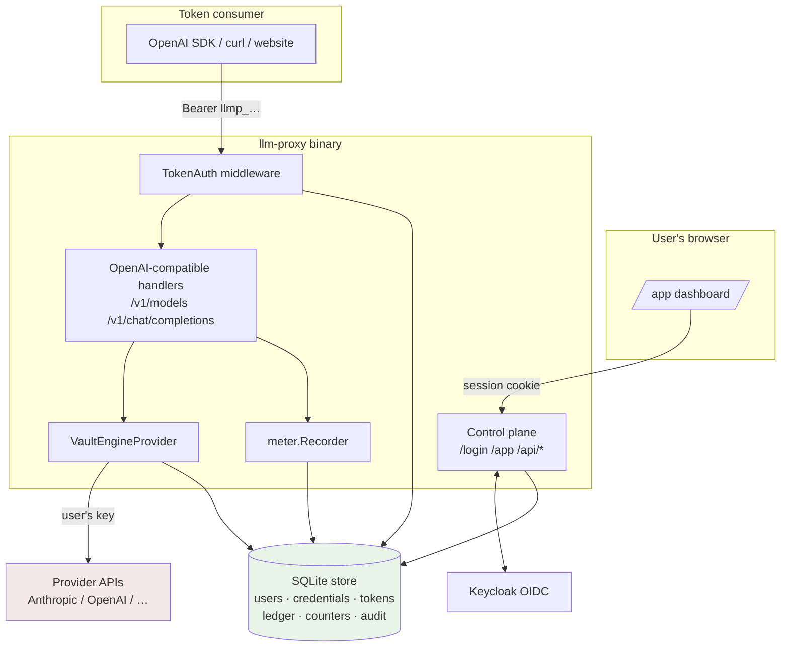

# LLM-Proxy BYOK: Credential Vault, Token Minting, and Metered Proxy Enforcement

This report documents one day of work (2026-07-05) that took llm-proxy — an OpenAI-compatible proxy backed by Geppetto with no authentication at all — to a working Bring-Your-Own-Key system: users store their own provider API keys in an encrypted vault, mint bearer tokens carrying explicit restrictions (model allowlists, token budgets, rate limits, expiry), and hand those tokens to scripts, teammates, or websites. The proxy validates every request against the token, meters usage into a ledger, and runs the upstream inference with the owner's stored key, which never leaves the server. The work landed as eight commits on branch `task/llm-proxy-byok`, each verified by tests, lint, and live smoke runs.

> [!summary]
> - **What was built:** a two-plane system inside one binary — a data plane (`/v1/*` behind token middleware, per-request credential injection, usage metering) and a control plane (OIDC login, credential vault, token-minting webapp and JSON API) sharing one SQLite store.
> - **Where the design came from:** three doc-first tickets in the 2026-04-17 `byok-host` workspace (delegated-broker threat model, web UI flows, Keycloak + pluggable storage), merged with llm-proxy's existing Geppetto profile architecture.
> - **The one-sentence architecture:** BYOK is implemented by making the API-key entry of a resolved Geppetto profile per-user and per-request instead of static YAML — everything downstream (engines, providers, streaming) is untouched.

## Why this project exists

The prior state of llm-proxy was a pure translation layer: an OpenAI request arrives, the `model` field is resolved as a Geppetto profile slug against a static `--profiles` YAML file, an engine is created, inference runs, the result is mapped back. Provider API keys lived in the YAML or the server's environment. Anyone who could reach the listener could use every configured profile — and therefore spend against every server-side API key. There was no authentication, no per-caller scoping, and no accounting.

The alternative to fixing this at the proxy — asking each user to paste provider keys into every application that wants inference — fails for a structural reason: the browser sandbox protects the operating system from the page, but it does not protect secrets from JavaScript running in the same origin. Any XSS, compromised dependency, or over-privileged extension can read `localStorage` and exfiltrate a long-lived, account-wide provider key. The delegated-broker model changes what the consuming application holds: a short-lived, narrowly scoped, revocable token whose blast radius is a budget, not an account.

The 2026-04-17 `byok-host` workspace had already worked out this argument in three docmgr tickets (BYOK-BROKER, BYOK-BROKER-WEB-UI, BYOK-KEYCLOAK-STORAGE) with runnable prototypes — but the prototypes forwarded to a fake provider, stored keys in plaintext, and implemented no metering. This project merged that design work with a real inference path.

## Current project status

Phases 0–3 of the plan are implemented, tested, and committed. The delegated third-party-website OAuth flow (consent screens, PKCE, per-site grants — Phase 4) is deliberately deferred until a real third-party integration exists.

| Commit | Content |
|---|---|
| `044368f` | Ticket docs: architecture proposal + intern guide (`ttmp/2026/07/05/LLM-PROXY-BYOK--…`) |
| `ba0fb4c` | Phase 0: store layer (SQLite + memory), conformance-tested |
| `e6b3b1f` | Phase 1: token enforcement middleware, scoped model listing, CLI minting |
| `388cb6d` | Phase 2: AES-GCM vault, per-request key injection, usage metering |
| `1327bef` | CLI rewritten on Glazed (flags ⇔ `LLM_PROXY_*` env), empty-DSN guard |
| `ff91e0b` | glazed-lint + logcopter-check enforced in pre-commit |
| `6b71c01` | Phase 3: control-plane webapp (OIDC, vault UI, minting, usage dashboard) |
| `eaa719a` | Diary steps 1–5 |

Verification at each phase: unit and conformance tests, an in-process end-to-end test that drives real HTTP handlers through the full enforcement chain, live `curl` smoke runs against a tmux-hosted server, and a Playwright pass confirming the dashboard renders and populates in a real browser.

## Project shape

```
llm-proxy/
  cmd/llm-proxy-server/
    main.go                 serve command; mounts both planes
    cmds/byok/              Glazed CLI group: user, token, credential, keygen
  pkg/byok/
    store/                  Store interface; sqlite/ and memory/ backends
    tokens/                 llmp_ minting and SHA-256 hashing
    vault/                  AES-256-GCM encryption of provider keys
    policy/                 pure decision helpers (allowlists, budgets)
    apierr/                 OpenAI-shaped errors carrying HTTP status
    authmw/                 bearer middleware, rate limiter, scoped model lister
    engines/                VaultEngineProvider (per-request key injection)
    meter/                  UsageRecorder → ledger writer
    web/                    control plane: OIDC, sessions, JSON API, dashboard
    integration_test.go     full-stack in-process end-to-end test
  deploy/                   Keycloak docker-compose + realm auto-import
```

## Architecture

The system is one binary serving two planes on one `http.ServeMux`, backed by one SQLite database. The control plane authenticates browsers with a session cookie; the data plane authenticates API callers with minted bearer tokens. Both consult the same store on every request, which is the reason they share a process: token validation and budget accounting are DB reads on the hot path, and SQLite penalizes cross-process sharing.



The load-bearing insight is where BYOK attaches to the existing code. Geppetto resolves a profile slug into a `ResolvedProfileRuntime` whose `Settings.API.APIKeys` map (keys named `<api_type>-api-key`, e.g. `claude-api-key`) is read by the engine factory at engine-creation time. llm-proxy's runtime services already accepted an injectable `EngineProvider`. BYOK therefore required no changes to request mapping, streaming, or provider code: a wrapping `EngineProvider` swaps the key map before the factory runs.

## Implementation details

### The data model

Six tables. Two decisions matter more than the rest.

First, minted tokens are stored only as SHA-256 hashes (`token_hash TEXT UNIQUE`). Validation hashes the presented bearer and performs an indexed lookup, so a leaked database yields no usable tokens, and no code path ever compares secret bytes directly — which also eliminates the timing-unsafe `==` comparison the byok-host smoke prototype used. The plaintext (`llmp_` + base64url of 32 random bytes) exists exactly once, in the mint response.

Second, usage accounting is split between an append-only `usage_ledger` (one row per inference call: prompt/completion/cached token counts, streamed flag, status) and a denormalized `token_counters` row per token. Budget checks run on every request; `SUM()` over a growing ledger would degrade, so the counter row is updated in the same transaction as the ledger insert and the two cannot diverge:

```sql
INSERT INTO usage_ledger (…) VALUES (…);
INSERT INTO token_counters (token_id, total_tokens, total_requests) VALUES (?, ?, 1)
ON CONFLICT(token_id) DO UPDATE SET
  total_tokens   = total_tokens + excluded.total_tokens,
  total_requests = total_requests + 1;
```

Rows with `status='rejected'` (policy refusals) are ledgered for auditability but excluded from the counter update, so being refused never consumes budget. Credentials store only ciphertext (`secret_cipher BLOB`) plus a display suffix (`secret_last4`); deleting a credential revokes, in the same transaction, every token whose only binding was that credential, while tokens bound to several credentials survive.

### Request-time enforcement

A `/v1/*` request passes through an ordered chain. The order is deliberate.

```
1  hash bearer, indexed lookup            → 401 invalid_api_key
2  revocation / expiry check              → 401 token_revoked | token_expired
3  in-memory fixed-window rate limiter    → 429 rate_limit_exceeded
4  counter read, budget pre-check         → 429 budget_exhausted
5  touch last_used_at, attach token to request context
6  handler decodes the OpenAI request
7  VaultEngineProvider: allowlist check   → 403 model_not_allowed
   credential selection by api_type      → 403 no_credential_for_model
   vault decrypt, settings clone, key swap
8  Geppetto engine runs the upstream call
9  meter.Recorder writes ledger + counters from result.Usage
```

Validity precedes the rate limiter so that unauthenticated scanners cannot consume another token's window; the rate limiter precedes the budget read because it is an in-memory check and the budget requires a DB read; `last_used_at` is touched only for accepted requests so that a rejected-request loop cannot make a dead token look alive.

Steps 1–5 live in HTTP middleware (`pkg/byok/authmw`), which wraps the existing handler at a single call site in `main.go`. Step 7 lives in the engine provider rather than the middleware because the model name is not known until the body is decoded, and placing it at engine creation makes the check hold for every path that can reach inference — defense in depth if a future route bypasses the mux.

Errors surface in OpenAI's wire shape (`{"error":{message,type,param,code}}`) with correct HTTP statuses, so unmodified OpenAI SDKs retry and report sensibly. The mechanism is a structural interface in `pkg/server/errors.go`: any wrapped error exposing `HTTPStatus() int` plus the OpenAI fields overrides the response, without `pkg/server` importing any byok package. This keeps the dependency graph acyclic: `server` knows nothing about BYOK; BYOK errors satisfy the interface.

### Credential injection and the scrubbing rule

`VaultEngineProvider.EngineForProfile` is the only place plaintext provider keys exist, briefly, per request:

```go
settings := profile.Settings.Clone()             // resolver output may be shared
settings.API.APIKeys = map[string]string{        // REPLACE, never merge
    apiType + "-api-key": string(decryptedKey),
}
```

The replacement (rather than overwrite-one-entry) semantics implement the scrubbing rule: a profile YAML that still contains `${OPENAI_API_KEY}` must never subsidize a BYOK caller whose token resolves an OpenAI profile through a glob. The integration test pins `len(keys) == 1` after injection. The provider also fails closed — no token in the request context means no engine, never a fallback to server-side keys.

Vault cryptography is AES-256-GCM with a fresh 12-byte nonce per secret and the owning credential ID as additional authenticated data. The AAD binding means a ciphertext blob copied onto another credential row fails authentication on decrypt. Blobs carry a leading version byte for future key rotation. The 32-byte master key arrives via flag or `LLM_PROXY_BYOK_MASTER_KEY` and is never stored.

### Metering where usage is born

Streaming responses carry no usage object on the wire — the proxy's SSE chunks have no `usage` field, and `stream_options.include_usage` is unimplemented. The authoritative numbers exist only in the `InferenceResult` returned by `geppettoengine.RunInferenceWithResult`, including inside the streaming goroutine after the stream completes. The runtime services therefore gained one optional field:

```go
type UsageRecorder interface {
    RecordInference(ctx context.Context, model string,
        usage *turns.InferenceUsage, streamed bool, inferenceErr error)
}
```

called at all four completion sites (complete/stream × chat/completions). The BYOK implementation reads the token from the request context and writes the ledger row using `context.WithoutCancel(ctx)`: when a client disconnects mid-stream, the request context is already canceled, but the upstream spend happened and must be recorded. Budgets are consequently enforced post-hoc — a single request can overshoot the remaining budget by at most one request's worth, and the next request is rejected. This is a documented property, not a bug: exact pre-charging would require knowing completion length in advance.

### The control plane

The control plane is an OIDC relying party (go-oidc v3 against Keycloak; `deploy/` contains a compose file that auto-imports a realm with client `llm-proxy-web` and test user alice) plus a session layer and a JSON API. The session cookie is not a JWT: it is a JSON claims payload signed with HMAC-SHA256 (`base64url(payload).base64url(sig)`), verified with `hmac.Equal`, SameSite=Lax, HttpOnly. The OIDC callback checks proceed strictly in order — state cookie match, code exchange, ID-token signature verification, nonce match — then auto-provision the user by `sub` and set the session.

The API surface, all session-authenticated and ownership-scoped:

| Method | Path | Behavior |
|---|---|---|
| GET/POST | `/api/credentials` | list (never the secret) / create (secret write-only, encrypted before storage) |
| DELETE | `/api/credentials/{id}` | delete + cascade-revoke solely-bound tokens |
| GET/POST | `/api/tokens` | list with live counters / mint (plaintext appears only here) |
| POST | `/api/tokens/{id}/revoke` | immediate revocation |
| GET | `/api/usage?token_id=` | ledger rows, ownership-checked |

Mutations additionally pass a same-origin check on the `Origin` header (requests without one — curl, SDKs, tests — pass; browsers cannot forge an absent Origin). A `--byok-dev-user` flag mounts a passwordless `/dev-login` for local development, loudly logged, so browser-level verification does not require Docker on every loop. The dashboard itself is a server-embedded Bootstrap page with a small fetch layer — credentials table, mint form fed by the live credential list, usage progress bars, revoke buttons.

Route composition uses Go 1.22 mux precedence: the control plane registers specific patterns (`GET /app`, `POST /api/tokens`, …) on an outer mux whose `/` entry is the token-guarded data plane, so no path-prefix router was needed.

### The Glazed CLI

Management is also scriptable without the webapp: `llm-proxy-server byok user|credential|token|keygen`, written as Glazed commands. List commands are `GlazeCommand`s and inherit structured output (`--output json|table|yaml`) for free; mutations are `WriterCommand`s. Every flag doubles as an environment variable through Glazed's built-in env source — `--byok-master-key` ⇔ `LLM_PROXY_BYOK_MASTER_KEY` — and the credential secret is passed via `LLM_PROXY_BYOK_SECRET` so it never appears in argv or shell history.

## Failure modes discovered along the way

Four integration bugs cost real debugging time and are worth preserving because each will recur.

**Glazed's env prefix keeps hyphens.** With `AppName: "llm-proxy"`, Glazed computes the env prefix as `strings.ToUpper(AppName)` — literally `LLM-PROXY` — and then looks for `LLM-PROXY_BYOK_SECRET`, a name most shells cannot export. Only the field name is hyphen-normalized, not the prefix (`glazed/pkg/cmds/sources/update.go:156-160`). The fix is `AppName: "llm_proxy"`. Verified by injecting the hyphenated variable with `env 'LLM-PROXY_…=x'`, which loaded.

**Glazed's `DecodeInto` silently skips embedded structs.** Settings structs that embedded a shared `commonSettings{DB string}` decoded to an empty DB path with no error, because `FieldValues.DecodeInto` iterates only top-level fields carrying a `glazed:` tag (`initialize-struct.go:146-150`). The empty path then triggered the third bug.

**mattn/go-sqlite3 treats an empty filename plus query string as a filename.** `sql.Open("sqlite3", ""+"?_foreign_keys=on&_busy_timeout=5000")` created a database file literally named `?_foreign_keys=on&_busy_timeout=5000` in the working directory. Each CLI process wrote to it happily, which made the smoke test *appear* to work while no real database existed at either the configured or the default path. The store now rejects empty paths at `Open`. The diagnostic lesson: with layered config frameworks, verify the effective value (`--print-parsed-fields`), not the observable side effects.

**Geppetto's SSRF guard has no escape hatch.** Every provider path validates outbound URLs with `AllowHTTP: false` hard-coded (`geppetto/pkg/security/outbound_url.go`), so the planned end-to-end smoke against a local plain-HTTP fake provider failed with `http scheme is not allowed`. The replacement — an in-process integration test whose fake engine implements Geppetto's `EngineWithResult` and reports fixed usage — turned out strictly better: it exercises the full HTTP → middleware → service → engine → metering chain deterministically in CI, including the budget-crossing 429 and instant revocation.

A fifth, smaller trap: cobra's `cmd.Printf` writes to stderr by default (`OutOrStderr`), which silently emptied a `$(… 2>/dev/null)` key capture during smoke testing.

## Verification

The definition of done from the design doc was executed end to end. The in-process integration test (`pkg/byok/integration_test.go`) asserts: the engine receives the user's decrypted key and exactly one key (scrubbing); the wire response carries the provider usage; a disallowed model returns 403 with `param:"model"`; the second call crosses a 30-token budget and the third receives 429 `budget_exhausted`; counters read 38 tokens / 2 requests with the rejected row excluded; revocation takes effect on the next request. Live verification covered the same flow over real sockets (tmux server + curl), and a Playwright session confirmed the dashboard renders the logged-in state, the credential table, the token with its 0/5000 usage bar, and a populated mint form. Every commit passed the pre-commit gauntlet: `golangci-lint`, `glazed-lint`, `logcopter-check`, and the full test suite.

## Important project docs

- Ticket workspace: `llm-proxy/ttmp/2026/07/05/LLM-PROXY-BYOK--bring-your-own-key-oauth-webapp-for-credential-management-and-scoped-token-minting-enforced-by-llm-proxy/`
- `design-doc/01` — prior-art analysis and architecture decision record (byok-host inventory, alternatives considered).
- `design-doc/02` — the intern guide: threat model, llm-proxy internals with file/line anchors, full DDL, pseudocode, phased plan. Uploaded to reMarkable as `LLM-PROXY-BYOK Intern Design Guide.pdf`.
- `reference/01-investigation-diary.md` — five strict-format diary steps recording what worked, what failed verbatim, and review instructions per phase.
- Prior art: `/home/manuel/workspaces/2026-07-05/llm-proxy-byok/2026-04-17--byok-host/ttmp/2026/04/17/` (three BYOK tickets with design docs and prototypes).

## Open questions

- Should the data plane refuse to start (503 circuit breaker) if ledger writes fail persistently? Today `meter.Recorder` logs and continues, which means budgets stop advancing under storage failure.
- Server-side session invalidation does not exist; revoking a compromised browser session requires rotating `--byok-session-secret`. Is that acceptable until a session store is warranted?
- Two Glazed issues worth filing upstream: the hyphenated env prefix and the silent embedded-struct skip in `DecodeInto`.
- `stream_options.include_usage` support, so streaming clients can observe usage on the wire; the plumbing point is the final SSE frame.

## Near-term next steps

- Drive the OIDC path against live Keycloak via `deploy/docker-compose.yaml` (the code is ported from a working byok-host demo and unit-tested, but has not been exercised against a real IdP in this repo).
- Phase 4 when a real third-party site appears: port the broker-as-authorization-server layer (PKCE consent flow, grants) from byok-host; grants mint ordinary scoped tokens internally, so the entire enforcement path is reused unchanged.
- `byok rekey` command (the vault blob version byte already anticipates it), rate-limiter window pruning, cost-in-dollars budgets on top of token counts.

## Project working rule

Enforcement fails closed and secrets flow one way: no token in context means no engine; server-side YAML keys are scrubbed, not merged; token plaintext appears exactly once at mint time; ledger writes record what actually happened upstream, even for canceled requests and rejected calls.
