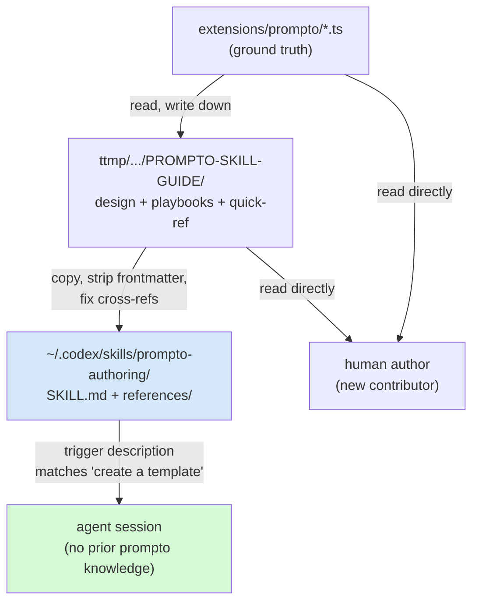

# Prompto Pi Extension — From Extension to Authoring Skill

This note records the second arc of the prompto project: what happened after the extension itself was built, and how a working TypeScript extension became a reusable, installable agent skill. It is a dated follow-up to [[PROJ - Prompto Pi Extension - Prompt Form Expansion for Pi|the 2026-07-03 project note]], which covered the design ticket `PROMPTO-PI-EXT` and the five-phase build. The earlier note is left intact; this one picks up at the pull-request review and carries the story through the UX feedback loop, the intern guide ticket, and the global skill install on 2026-07-05.

The thread connecting every step is that documentation is a ladder with distinct rungs, and each rung serves a different reader. The source code serves the maintainer. The in-extension docs (`docs/authoring.md`, `docs/plugin-protocol.md`) serve the user who has already opened the picker. The ticket design doc serves an engineer who must rebuild or deeply refactor the system. The skill serves an agent that has never seen the project and must produce a correct artifact on demand. Prompto now has all four, and the work of producing the higher rungs fed back corrections into the lower ones.

> [!summary]
> This note covers four developments after the 2026-07-03 build:
> 1. **Pull-request review fixes** (`d3a532b`) — value memory moved out of the worktree into `~/.pi/agent/prompto-state/`, and frontmatter fences learned to accept CRLF. The test suite reached its current 65 tests.
> 2. **The UX feedback loop** — a separate `EXTENSION-UX` ticket fed two prompto improvements back into the extension: a fuzzy-filtered picker (`02ef4e5`) and a paste-at-cursor shortcut (`606f2c4`, `2cbf930`).
> 3. **The intern guide ticket** (`PROMPTO-SKILL-GUIDE`, 2026-07-05) — a 1,899-line analysis, design, and implementation guide plus authoring playbooks, written to be the canonical reference a new engineer can rebuild the extension from.
> 4. **The global authoring skill** (`~/.codex/skills/prompto-authoring/`) — a concise trigger `SKILL.md` backed by four self-contained references, committed to the `wesen/skills` repository and installable by any agent that speaks the skill format.

## Why this project exists

The 2026-07-03 note answered this question for the extension: prompts were drifting in muscle memory and in a legacy Go tool, and the extension made them declared, form-driven artifacts. The question this note answers is narrower and different. Once the extension existed and worked, two new problems appeared.

The first problem is that a working extension is not yet a teachable system. The extension's behavior was documented across a ticket design doc (implementation-facing, 14 sections), a diary (11 steps including every failure), and two short in-extension docs. None of these is the right artifact for a new contributor who wants to author a template or a plugin without first understanding the whole extension. The gap is not missing documentation; it is missing documentation at the right altitude and addressed to the right reader.

The second problem is that an agent asked to "create a prompto template" has no stable entry point. Without a skill, the agent must rediscover the template format, the field schema, the rendering dialect, and the plugin protocol each session, by reading source. A skill changes that economics: a trigger description causes the format reference to be loaded on demand, and the agent produces a correct artifact without reading the extension source at all. The skill is what makes prompto authoring a repeatable operation rather than tribal knowledge.

The work of this arc was therefore to produce documentation at the altitudes that were missing, and to package the result so that an agent could find and use it.

## Current project status

The extension is complete and on `main`. The authoring skill is complete, committed, and pushed. The full commit timeline across the two days is the clearest status record:

| Commit | Date | Phase | What changed |
|---|---|---|---|
| `0de1d21` | 2026-07-03 | 1 | store, frontmatter parsing, renderer, `/prompto` command, dialog-fallback form |
| `0fe38f9` | 2026-07-03 | 2 | schema-generated modal form component, template picker |
| `f061feb` | 2026-07-03 | 3 | LLM prefill (`before-form` and `after-required`) |
| `9e34e55` | 2026-07-03 | 4 | JSONL plugin subsystem, reference plugins, protocol docs |
| `38557c6` | 2026-07-03 | 5 | launcher/palette integration, autocomplete ranking, value memory |
| `d5741d8` | 2026-07-03 | — | repo-root `package.json`; hand-rolled parser replaced by the `yaml` package |
| `d3a532b` | 2026-07-03 | — | PR review: value memory moved out of the worktree; CRLF frontmatter fences |
| `02ef4e5` | 2026-07-03 | — | fuzzy-filtered template picker; real workflow templates added |
| `606f2c4` | 2026-07-03 | — | `Ctrl+Alt+P` paste-at-cursor shortcut |
| `2cbf930` | 2026-07-03 | — | paste workflow documented in `docs/authoring.md` |
| `2c03cf3` | 2026-07-05 | — | intern guide ticket `PROMPTO-SKILL-GUIDE` committed |
| `9858211` | 2026-07-05 | — | ticket closed |
| `1b2bc05` | 2026-07-05 | — | `prompto-authoring` skill committed to `wesen/skills` |

The test suite is 65 `bun:test` tests across five files, all passing. The extension's user-facing flows were verified in tmux-driven live pi sessions at each phase; the skill was verified by reading it back and confirming the frontmatter trigger description covers the operations an agent would be asked to perform.

## Project shape

The deliverables of this arc live in three places, each addressed to a different reader.

The extension source is in `extensions/prompto/` inside the pi-extensions monorepo at `/home/manuel/code/wesen/2026-04-21--pi-extensions`. It is unchanged in structure from the 2026-07-03 note; the files touched in this arc are `state.ts` (out-of-worktree move), `frontmatter.ts` (CRLF), `index.ts` and `run.ts` (paste shortcut and output modes), and `ui/picker.ts` (fuzzy filter). The intern guide ticket is `ttmp/2026/07/05/PROMPTO-SKILL-GUIDE--prompto-extension-intern-guide-and-skill-for-authoring-prompts-scripts/` inside the same monorepo, with four content documents: a design guide, two playbooks, and a quick-reference card. The skill is in `~/.codex/skills/prompto-authoring/`, which is a checkout of the `wesen/skills` repository; it contains a `SKILL.md` and a `references/` directory with self-contained copies of the four ticket documents.

The relationship between these three is unidirectional and lossy in a controlled way. The extension source is the ground truth. The ticket guide is derived from the source by reading it and writing it down. The skill references are derived from the ticket guide by copying the content, stripping the docmgr frontmatter, and fixing cross-reference filenames. Each derivation step drops information that the lower rung needed but the higher rung does not: the ticket guide drops the diary's step-by-step failures; the skill drops the docmgr frontmatter and the absolute paths that only make sense inside the pi-extensions repo.

## Architecture

The architecture of the extension itself is unchanged from the 2026-07-03 note and is not redrawn here. What is new is the architecture of the documentation and skill packaging, which is itself a small system worth drawing.



The skill is the only rung that is actively loaded by an agent at runtime; the other three are passive artifacts that a human reads. The arrow from the skill to the agent is the one that justifies the whole arc: without it, every agent session that needed to author a prompto artifact would have to re-derive the format from source.

## Implementation details

### The pull-request review: state out of the worktree

The extension's value memory — the last-submitted field values for each template, which seed the next form — originally lived at `<cwd>/.pi/prompto-state.json`. The 2026-07-03 project note listed the gitignore question as an open question. The pull-request review resolved it by deciding that gitignoring was the wrong fix, because a gitignore entry only protects one repository, and the file's contents are arbitrary user prompt text that may include sensitive material.

The fix moved the state out of the worktree entirely. State now lives at `~/.pi/agent/prompto-state/<sha256(cwd) first 16 hex>.json`, with the project directory recorded inside the file for debuggability. The filename is a hash so that the project's path never leaks through the filesystem layer, and so that path lookups are a single deterministic string operation rather than a directory scan. The design is captured in the current `state.ts`:

```ts
export function statePath(cwd: string, stateDir: string = defaultStateDir()): string {
  const key = createHash("sha256").update(cwd).digest("hex").slice(0, 16);
  return join(stateDir, `${key}.json`);
}
```

The state file keeps the same shape it had before, with one `values` map keyed by template name:

```json
{
  "cwd": "/home/manuel/code/wesen/2026-04-21--pi-extensions",
  "values": {
    "demo/greeting": { "name": "foobar", "language": "English" },
    "obsidian/deep-dive-project-report": { "..." : "..." }
  }
}
```

Two properties are preserved on load and on save: the values are filtered to the fields the template still declares, so removing a field from a template drops its stale remembered value on the next load; and a corrupt state file is treated as empty rather than fatal, because value memory is best-effort and must never block an expansion. The `stateDir` parameter was made injectable so the module is fully testable without touching `homedir()`, which is what let the state test suite cover roundtrip, schema-narrowing, missing-file, and cross-project isolation cases.

The one deliberate non-migration: any `.pi/prompto-state.json` left by the previous scheme is silently orphaned, not migrated. Given the feature shipped hours before the fix, migration was judged not worth the code. The lesson is narrow but real: when a security fix changes a storage location, the orphaned data is the user's responsibility to delete, and the release notes should say so.

### The pull-request review: CRLF frontmatter fences

The second review finding was a silent degradation. `splitFrontmatter` had required an opening fence of exactly `---\n`, so a template authored on Windows (or saved by an editor that inserts CRLF) failed to match the opening fence and fell through to plain-prompt handling: no form opened, and the raw YAML was pasted into the editor as if it were prompt text. The failure was silent because a plain prompt is a legitimate kind, so the extension had no reason to warn.

The fix widened both fences. The opening fence is now `/^---\r?\n/` and the closing fence is `/^---[ \t]*\r?$/m`, so a line consisting of `---` followed by optional spaces and either newline terminator is accepted. The `yaml` package handles CRLF inside the frontmatter body natively, so no content-side change was needed. Two new tests pin the behavior: one for a fully CRLF document, and one for a mixed document with an LF opening fence and a CRLF closing fence. The mixed case matters because it is the failure mode that actually occurs when a file is edited piecemeal across systems.

### The UX feedback loop and the paste shortcut

The `EXTENSION-UX` ticket was opened to improve the shared launcher and command palette, and two of its findings fed back into prompto. The first was that the picker, which had been a simple `SelectList`, did not filter as the user typed. The second was that prompto's only insertion behavior was to replace the editor's contents, which destroyed any draft the user had already typed.

The picker became a fuzzy filter. The query is split on whitespace and path separators; each token must fuzzy-match at least one searchable chunk of a template, and the chunks include the name, group, title, description, source, kind, submit mode, and every field's name, label, help, and placeholder. Scores sum across tokens, ties break alphabetically. The chunk list is deliberately broad: typing `docmgr ticket` finds `docmgr/create-ticket` even when the template's title is "Create docmgr ticket + analysis plan", because the match is against the field set and the group, not only the visible label.

The paste shortcut was the more interesting design, because it exposed a distinction that had been implicit. Prompto's output had always been able to go to one of two places: the editor text (via `ctx.ui.setEditorText`), or directly to the agent as a user message (via `pi.sendUserMessage`, used by `submit: auto` templates). The paste request added a third target: the editor cursor, without replacing the existing draft (via `ctx.ui.pasteToEditor`).

The output decision is now a three-way dispatch in `runPrompto`:

```ts
const output = options.output ?? (template.submit === "auto" ? "send" : "replace-editor");
if (output === "send") {
  pi.sendUserMessage(prompt, ctx.isIdle() ? undefined : { deliverAs: "followUp" });
} else if (output === "paste-editor") {
  ctx.ui.pasteToEditor(prompt);
} else {
  ctx.ui.setEditorText(prompt);
}
```

The three modes exist because the three insertion points are genuinely different operations, not variations of one. `setEditorText` is for the common case where the expanded prompt is the whole of what the user wants to send. `pasteToEditor` is for composing: the user has a draft and wants to insert a prompt fragment at a specific position, the way a snippet expander works. `send` is for `submit: auto` templates that are meant to fire immediately, and its `deliverAs: "followUp"` option is used when the agent is mid-task so the prompt lands as a follow-up rather than a new turn.

The shortcut itself is `Ctrl+Alt+P`, registered through `pi.registerShortcut`. The `EXTENSION-UX` diary established the key design constraint: slash commands only work naturally from the editor command position, but pi extension shortcuts are dispatched independently of slash command parsing. The paste workflow therefore uses `registerShortcut` for invocation and `pasteToEditor` for insertion, leaving the existing `/prompto` replacement behavior untouched. The same paste path is exposed through the launcher action "Pick and paste a prompt template" and a command-palette item, so a user who does not know the shortcut can still reach it.

The picker and paste work were documented in `docs/authoring.md` in commit `2cbf930`, closing the loop: the UX change produced a user-visible behavior, and the in-extension doc was updated to describe it.

### The intern guide ticket

The `PROMPTO-SKILL-GUIDE` ticket was opened to produce the documentation rung between the source and the skill. Its remit was to explain every part of the system to a new intern, with prose, bullet lists, pseudocode, diagrams, API references, and file references, and to be technical and clear.

The deliverable is four documents in the ticket workspace. The main one is `design/01-prompto-intern-guide.md`, 1,899 lines, structured in five parts: orientation (executive summary, problem statement, five design principles, the mental model), system architecture (a deep dive on every subsystem: the discovery pipeline, template parsing, the rendering dialect, the JSONL plugin protocol, LLM prefill, value memory, configuration, the runtime orchestrator, and the UI layer), authoring (how to write a plain prompt, a template, and a plugin), testing and operations, and a reference part with a full API table, a file map, a glossary, an intern onboarding checklist, and seven decision records.

The decision records are the part of the guide that does work the source cannot. A decision record states a choice, the context that produced it, and the consequence, in a form that survives the code being refactored. The guide's seven records cover the deliberate limits of the templating dialect (no loops, no nesting, no filters), the soft-fail contract for prefill and value memory, the decision to store state outside the worktree, the stateless two-phase plugin model, the parsed-but-not-propagated `submit` override in the prompt frame, the stricter regex for field names versus the looser one for plugin template names, and the global-before-project scan order. Each of these is a choice a refactorer might undo without realizing it was a choice; the record is what prevents that.

The two playbooks (`playbooks/01-author-a-template.md`, `playbooks/02-author-a-plugin.md`) are step-by-step checklists meant to be open while typing. The quick-reference card (`reference/02-quick-reference-card.md`) condenses the dialect, the field schema, the prefill schema, the protocol frames, the commands, and the diagnostics onto one page. The card is the rung a returning author reaches for; the playbooks are the rung a first-time author reaches for; the guide is the rung a maintainer reaches for.

The ticket was validated with `docmgr doctor` (all checks passed after three new vocabulary topics — `prompto`, `pi-extension`, `skill-authoring` — were added), the four documents were related to ten source files with notes, and the bundle was uploaded to reMarkable at `/ai/2026/07/05/PROMPTO-SKILL-GUIDE`.

### The authoring skill

The skill is the final rung. It lives at `~/.codex/skills/prompto-authoring/`, which is a checkout of the `wesen/skills` repository, committed at `1b2bc05`. Its structure is a `SKILL.md` plus a `references/` directory:

```
prompto-authoring/
├── SKILL.md                      # trigger + workflow, 244 lines
└── references/
    ├── intern-guide.md           # the 1,899-line guide, frontmatter stripped
    ├── author-a-template.md     # the template playbook
    ├── author-a-plugin.md        # the plugin playbook
    └── quick-reference.md        # the cheat sheet
```

The `SKILL.md` is the only file an agent loads by default; the references are loaded on demand when the skill's text says "Load `references/intern-guide.md` for the full picture." This two-level structure is the same one used by the `remarkable-upload`, `devctl-plugin-authoring`, and `glazed-command-authoring` skills in the same repository, and it exists because a skill that loads its entire reference set on every trigger wastes context, while a skill that cannot load its reference set is too thin to be useful.

The skill's frontmatter is the part that determines whether it is ever loaded at all:

```yaml
---
name: prompto-authoring
description: "Author, edit, and debug prompto prompts, templates, and plugins
for the pi coding agent. Use when the user asks to create/add/write a prompto
template or plugin, fill in a prompto form, fix a 'unknown placeholder' /
'prefill skipped' / 'project-layer plugin skipped' error, choose between
plain vs template vs plugin, or understand the prompto rendering dialect
({{name}}, {{#if}}) or the JSONL plugin protocol."
```

The description is written to match the operations an agent would be asked to perform and the exact error strings the extension emits. The error strings matter: when a user pastes `prompto: prefill skipped: no API key for the current model` into a session, the description's verbatim inclusion of `prefill skipped` is what causes the skill to be selected. A description that says only "author prompto templates" would miss the debugging cases, which are the cases where a skill is most valuable, because they are the cases where the user is stuck.

The `SKILL.md` body is self-contained enough to author a template or a plugin without loading any reference. It contains the frontmatter schema, the field-type table, the rendering dialect, the JSONL protocol summary with a minimal python plugin, a diagnostics table mapping symptoms to fixes, and the config and commands. The references hold the depth: the full subsystem deep dives, the decision records, the step-by-step checklists. The split is deliberate — an agent that needs to write a template should not have to read 1,899 lines to do it, but an agent that needs to understand why the dialect has no nesting should be able to find the decision record that explains it.

The reference files are copies, not symlinks, because the skills repository is independent of the pi-extensions repository and should not depend on the latter being checked out. When the references were copied, the docmgr frontmatter was stripped (it referenced a ticket and absolute paths that only make sense inside the pi-extensions repo) and the cross-references between playbooks were repointed from `design/01-prompto-intern-guide.md` to `references/intern-guide.md`. The content is otherwise identical to the ticket documents, which keeps the two derivable from each other by diff.

### The documentation ladder

The four rungs can now be stated as a pattern, because the prompto project is a worked example of it.

The source is the ground truth and the only artifact that can be executed. The in-extension docs are derived from the source and addressed to the user who has the picker open; they are short and operational. The ticket design doc is derived from the source and addressed to the engineer who must rebuild or refactor; it is long and explanatory, and it carries the decision records that the source cannot. The skill is derived from the ticket doc and addressed to the agent; it is concise at the top and deep in its references, and its trigger description is written to match the operations and errors an agent will actually encounter.

The derivations are lossy in a controlled direction. Each rung drops information the lower rung needed: the ticket drops the diary's step-by-step failures; the skill drops the docmgr frontmatter and the absolute paths. The information dropped is exactly the information that is meaningless at the higher rung's altitude. The information kept is the information that generalizes: the schema, the dialect, the protocol, the diagnostics, the decision records.

The pattern's value is that each rung can be produced independently and consumed independently. An agent that loads the skill does not need the ticket; a maintainer who reads the ticket does not need the diary; a user who reads the in-extension docs does not need the ticket. The cost is that the four rungs can drift, and a change to the source must be propagated up the ladder. The propagation discipline is the project working rule below.

## Failure modes and tricky details

- The CRLF fence bug was silent because a plain prompt is a legitimate kind. Any classification rule that silently degrades one kind into another will hide authoring errors; the fix is to make the degradation loud (a warning) or to make the classification robust to the input variants that occur in practice (CRLF, BOM, trailing whitespace). Prompto now does the second for fences and the first for everything else.
- The value-memory move left orphaned `.pi/prompto-state.json` files in any project where the pre-fix build ran. The decision not to migrate was deliberate but means the release notes are the only thing that tells a user to delete the old file. A security fix that changes a storage location should name the orphaned data explicitly.
- The skill's trigger description includes verbatim error strings (`prefill skipped`, `project-layer plugin skipped`). If the extension's `notify` text changes, the skill's description drifts and the skill stops matching the debugging cases. The description is a contract with the source's user-visible strings, and it must be updated when they change.
- The reference files in the skill are copies. When the ticket documents are updated, the skill references are stale until they are re-copied. There is no automation for this; the propagation is manual and depends on someone noticing.
- The `EXTENSION-UX` diary's key finding — that pi extension shortcuts are dispatched independently of slash command parsing — is the fact that makes the paste shortcut possible, and it is not documented in the prompto extension itself. It lives in a different ticket. A fact that enables a feature but lives in another ticket's diary is at risk of being lost when that ticket is closed.

## Important project docs

- Earlier project note: [[PROJ - Prompto Pi Extension - Prompt Form Expansion for Pi]] (2026-07-03, the extension design and five-phase build)
- Intern guide ticket workspace: `2026-04-21--pi-extensions/ttmp/2026/07/05/PROMPTO-SKILL-GUIDE--prompto-extension-intern-guide-and-skill-for-authoring-prompts-scripts/`
- Intern guide (the canonical reference): `design/01-prompto-intern-guide.md` in that workspace; also on reMarkable at `/ai/2026/07/05/PROMPTO-SKILL-GUIDE`
- Authoring playbooks and quick-reference card: `playbooks/01-author-a-template.md`, `playbooks/02-author-a-plugin.md`, `reference/02-quick-reference-card.md` in the same workspace
- Skill repository: `~/.codex/skills/prompto-authoring/` (origin `git@github.com:wesen/skills.git`)
- Original design ticket and diary: `2026-04-21--pi-extensions/ttmp/2026/07/03/PROMPTO-PI-EXT--prompt-form-expansion-plugin-for-pi-prompto-inspired/`
- Extension source: `extensions/prompto/` in the pi-extensions monorepo

## Open questions

- The skill's reference files are manual copies. Whether to automate the copy (a script that syncs the ticket docs into the skill references and strips frontmatter) is an open question; the cost of automation is low, but the trigger for running it is unclear without a CI hook on the pi-extensions repo.
- The `prompt` frame's optional `submit` field is parsed by `parseRenderLine` but not propagated to the output-mode decision in `run.ts`. A plugin cannot currently override the submit mode per render. Decision record DR-5 in the intern guide names this as a known gap; whether to wire it through depends on whether a use case for per-render submit overrides emerges.
- The extension's interactive startup crashes in the workspace clone with `Tool "tui_demo_card" conflicts`, because the user's globally-registered extensions come from a different clone of the same monorepo. This predates prompto and is outside its scope, but it is the reason all end-to-end testing runs from a scratch project. It is still unresolved.

## Near-term next steps

- Run the real-world acceptance test that was deferred from the 2026-07-03 note: expand `docmgr/create-ticket` in a session against this repo's docmgr root and let the agent create an actual ticket.
- Add a sync script or a CI check that detects drift between the ticket documents and the skill references, so that a source change surfaces as a stale-reference warning rather than as a silent skill regression.
- Optionally port the in-repo `.claude/skills/prompto-template-authoring` project skill (an earlier, repo-local attempt) to redirect to the global `prompto-authoring` skill, or delete it, so that there is one canonical skill location.

## Project working rule

A change to the extension's user-visible behavior or error strings must be propagated up the documentation ladder: update the in-extension doc for operational changes, update the ticket guide for structural changes, and re-copy the affected reference into the skill (stripping frontmatter, fixing cross-references) for any change an author would notice. The skill's trigger description is a contract with the extension's `notify` text; when the text changes, the description changes in the same commit.
