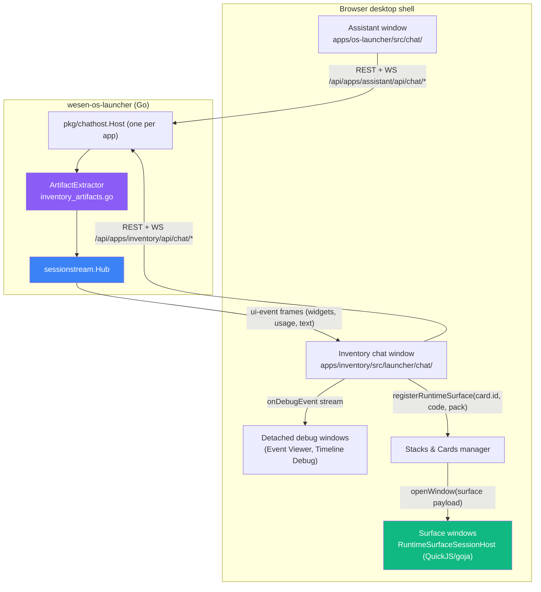
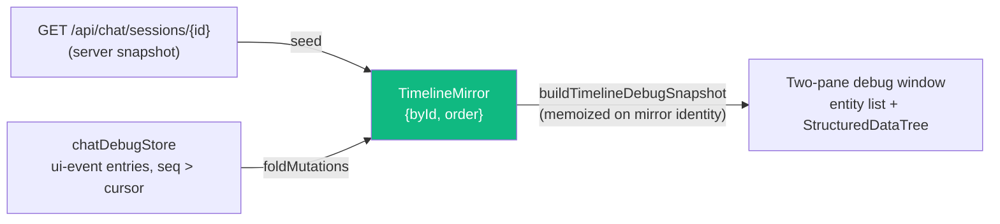
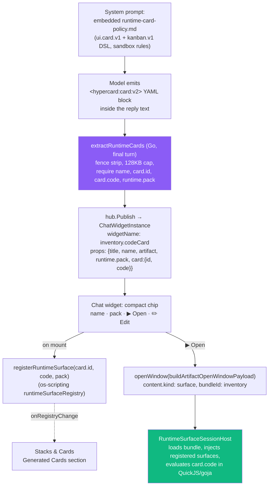

# wesen-os — Assistant Chat Parity and Generated HyperCard Apps

This report analyzes the 2026-07-04 implementation pass that brought the wesen-os chat system back to feature parity with its predecessor after a transport migration, and restored the system's most distinctive capability: language-model-generated JavaScript applications that execute as live, interactive desktop windows. The work spans two repositories (wesen-os and go-go-app-inventory), one Go backend package, and roughly twenty new or rewritten frontend modules. It continues the migration documented in [[PROJ - wesen-os - 2026-07 Stocktake, Consolidation, and Chatapp Migration]].

> [!summary]
> - A chat UI migration (os-chat/SEM → chat-provider/sessionstream) had silently dropped four capabilities: rich debug tooling, a token-usage stats footer, a pluggable timeline renderer registry, and generated executable JS cards. All four were rebuilt on the new transport.
> - The central technical device is the **debug event stream as a general-purpose data source**: token usage, detached-window timelines, and event inspection are all derived from `onDebugEvent` frames rather than from new backend endpoints.
> - Generated JS apps work end-to-end again: a system-prompt policy teaches the model a card DSL, a backend extractor turns tagged blocks into widgets, a projection bridge registers the code into a runtime-surface registry, and a QuickJS/goja host executes it. The failure chain that blocked the kanban variant (stale policy → missing prelude → declared/installed package mismatch) is documented as a reusable diagnosis map.

## Why this project exists

wesen-os is a browser desktop environment: a Go binary (`wesen-os-launcher`) serves a React shell that hosts windowed applications — an assistant chat, an inventory manager, REPLs, a kanban VM, and others. Two of those applications are chat windows backed by a language model.

The chat system had two complete architectures in its history. The old stack (`@go-go-golems/os-chat` on the frontend, pinocchio `pkg/webchat` + a protobuf timeline protocol called SEM on the backend) was feature-complete: it had a profile selector, starter suggestions, a stats footer with live token counts, detached debugging windows with substantial performance engineering, a renderer registry keyed by timeline-entity kind, and — most importantly — the ability to render model-generated JavaScript cards as live interactive surfaces. The new stack (`@go-go-golems/chat-provider` + `chat-overlay` on the frontend, pinocchio `pkg/chatapp` + `pkg/sessionstream` on the backend, wrapped by a wesen-os package called `pkg/chathost`) replaced the transport entirely. The migration restored basic streaming chat and then stopped. Everything listed above was gone.

The purpose of this pass was to close that gap — not by reviving the old protocol, but by rebuilding each capability on the new transport, keeping the old stack's performance techniques where they were good and fixing its known gaps where they were not.

## Current project status

All five implementation phases of ticket `WESEN-OS-ASSISTANT-PARITY-2026-07` are complete and verified against a live stack with real inference (gpt-5-nano):

| Phase | Deliverable | State |
|---|---|---|
| 1 | Assistant window chrome parity (profiles, suggestions, debug actions) | done, verified live |
| 2 | Stats footer with real token usage and live tok/s | done, verified live |
| 3 | Timeline renderer registry + `ChatTimeline` | done, verified live |
| 4 | Debug windows: original look (filter pills, two-pane timeline) + perf techniques | done, both apps |
| 5 | Generated JS HyperCard apps (ui.card.v1 and kanban.v1), Stacks & Cards integration | done, verified live |
| 6 | Upstream generic components into react-chat; retire os-chat | future work |

A follow-up polish round added markdown message rendering, collapsible thinking traces, suppression of raw card code in chat (replaced by a streaming "building card" placeholder and a compact action chip), and an Edit action that opens generated code in the CodeMirror editor.

## Architecture

Three structural facts shaped every design decision in this pass. They are worth stating before any implementation detail, because each one forecloses an otherwise obvious approach.

**First: the transport is one-directional for application data.** The chat-provider frontend speaks a fixed wire contract to the chathost backend — REST under `<basePrefix>/api/chat/*` plus a websocket carrying `snapshot` and `ui-event` frames. The provider's Redux store consumes only three entity kinds (`message`, `widget`, `tool_call`) and exposes only a small overlay slice (`sessionId`, `runStatus`, `wsStatus`, `isOpen`, `error`). Anything else on the wire is invisible to the provider's public API — but not to its **debug channel**: the `onDebugEvent` callback receives every frame, fully decoded. This asymmetry is the foundation of Phases 2 and 4.

**Second: the two chat windows cannot share code.** The launcher's own architecture test (`apps/os-launcher/src/__tests__/launcherHost.test.tsx`) forbids launcher modules from importing `@go-go-golems/inventory` internals; the inventory app is a federated boundary, and react-chat is consumed as published npm. A shared component would need a react-chat release. The consequence: generic chat components live launcher-local in `apps/os-launcher/src/chat/`, the inventory app carries adapted copies, and deduplication is deferred to the react-chat upstreaming phase. This is deliberate, documented duplication rather than an accident.

**Third: the JS execution engine never went away.** The QuickJS/goja runtime host (`RuntimeSurfaceSessionHost`), both DSL packs (`ui.card.v1`, `kanban.v1`), the surface-window adapter, and the injection registry (`runtimeSurfaceRegistry`) all remained live in the inventory app, serving its built-in folder surfaces. Only two links were severed by the migration: the backend no longer produced code-card blocks, and nothing bridged chat events into the registry. Restoring generated apps was therefore a bridging problem, not a runtime rebuild.



## Implementation details

### Verification before implementation

The implementation was preceded by an adversarial review of its own design document. Three parallel verification agents re-checked every load-bearing claim in the intern guide against the code. The reference layer — file paths, constants, line numbers — held up verbatim. Three architectural conclusions did not, and each correction changed the plan:

1. **Token usage was already on the wire.** The guide proposed possibly extending the backend to publish usage. In fact, pinocchio's `chatapp` runtime sink already translates geppetto's `EventProviderCallMetadataUpdated` and `EventProviderCallFinished` into transient websocket UI events carrying a full `UsageInfo` (input, output, cached, cache-creation, cache-read tokens). The gap was purely that chat-provider ignores these frames. Phase 2 became frontend-only.
2. **The artifact extractor is final-turn-only.** chathost's `ArtifactExtractor func(assistantText string) []WidgetArtifact` runs once, in `OnFinalTurn`, after inference completes. The guide's streaming widget-status design was unimplementable as written. Generated cards ship final-only; a streaming variant remains possible through chatapp's `WrapSink` hook but is not wired.
3. **`ChatMessages` silently drops unknown entity kinds.** The chat-overlay message list is a hardcoded switch over three kinds with no override prop. A renderer registry cannot extend it; it must replace it.

The pattern worth preserving from this step: agent-written design documents tend to have a **verified reference layer and an unverified inference layer**. The file:line facts were all correct while three conclusions drawn from them were wrong. A verification pass that specifically attacks the inferences is cheap relative to the misimplementation it prevents.

### The debug event stream as a data source

chat-provider's `onDebugEvent` callback fires for every websocket frame, in five typed variants (`ws-lifecycle`, `raw-ws`, `parsed-frame`, `snapshot`, `ui-event`). The `parsed-frame` variant carries the complete decoded frame, including payloads the provider's store never consumes. This makes the debug channel a legitimate read path for application features, not merely a logging hook, and three subsystems were built on it.

The chat window feeds every debug event into a per-conversation external store:

```ts
// chatDebugStore.push — one entry per frame, classification at ingest
const entry = {
  id: `evt-${++seq}`,          // monotonic, stable React key
  seq,                          // fold cursor for the timeline mirror
  at: Date.now(),
  summary: summarize(event),    // one-line summary, computed once
  family: classify(event),      // llm | tool | widget | timeline | ws | raw | other
  eventType, eventId,
  event,                        // the full ChatDebugEvent
};
buffer = buffer.concat(entry).slice(-1000);   // bounded ring, new identity per push
```

Two properties matter. Classification happens at ingest, once per event, so rendering five hundred rows never re-derives a summary or a family — this reproduces the old os-chat event bus technique of precomputing display data at emit time. And the buffer is bounded at 1,000 entries with front-trimming, so a long streaming conversation (which produces thousands of `ChatTextPatch` frames) cannot grow memory without bound.

Detached windows read this store through `useSyncExternalStore`. This solves a problem specific to the new architecture: `ChatProvider` mounts a private Redux store per chat window, using an isolated React context (`ChatReduxContext`), so a detached Event Viewer window has no access to the chat window's timeline state. The external store is the only shared surface between them.

The isolated context has a second, load-bearing consequence: because chat-provider's `Provider` binds to its own context, a plain `useDispatch()` inside a chat widget component resolves against the *desktop* store. Chat widgets can therefore open desktop windows directly. Both the generated-card Open action and the Edit action depend on this.

### The stats footer

The old stack's stats footer read token usage from metadata attached to `llm.*` protocol envelopes. The new stack's equivalent data rides two transient UI events, and the footer derives everything from them:

| Event | Fires | Carries |
|---|---|---|
| `ChatProviderCallMetadataUpdated` | during a provider call, provider-dependent | `usage` (partial), `stopReason` |
| `ChatProviderCallFinished` | at the end of each provider call | `usage`, `durationMs`, `stopReason`, `finishClass` |
| `ChatTextPatch` | per streamed text delta | `text` (the delta) |

A `chatStatsStore` ingests the `parsed-frame` debug events and maintains per-conversation state: streaming status, a live output-token counter, last-run usage, and conversation totals. The live counter uses the same strategy the old stack used: accumulate streamed character count and estimate tokens as `chars / 4`, then overwrite the estimate whenever a real `usage.outputTokens` arrives in a metadata event. A single prompt may involve several provider calls (tool loops), so per-call usage accumulates into a run total, and the run total commits into conversation totals when a `ChatRunFinished`/`Stopped`/`Failed` event closes the run.

One detail is a permanent constraint rather than an implementation choice: **the provider-call events carry no model name.** The footer labels its numbers with the selected engine profile's display name instead, which is the closest honest label available. Fabricating a model string from configuration would report the configured model even when the backend resolved a different one.

The rendered result, from the live system: `Assistant · In:33 Out:725 · 4.9s · 147.8 tok/s`, extending to `· Σ In:194 Out:880` once a conversation has more than one completed run.

### The timeline mirror

The detached Timeline Debug window needs the conversation's timeline — the ordered set of entities the chat window renders — but has no provider store to read it from. The solution reconstructs the timeline from two sources it does have: the chathost REST snapshot endpoint (authoritative server state) and the debug stream's `ui-event` entries, which carry the provider's `TimelineMutation` objects verbatim (`{upsert?, upsertIfExists?, deleteId?}` with full entities).



The fold must apply mutations with exactly the semantics the provider store uses, or the mirror diverges from what the chat window shows. The merge logic was ported line-for-line from chat-provider's `timelineSlice`: streaming text arrives as `contentPatch` fragments appended to (or, in snapshot mode, replacing) the entity's `content`; widget updates arrive as `propsPatch` with optional `patchPaths` under which array values append rather than replace. A naive shallow merge would leave message entities holding only their final delta.

Two properties keep the mirror cheap. `foldMutations` returns the **same object reference** when no new mutations applied, so the downstream `useMemo` that builds the display snapshot only recomputes on real change — this is the old stack's memoized-projection technique translated to the new data source. And the fold cursor is the ingest sequence number captured **when the REST response arrives**, so mutations observed after the seed apply on top of it while mutations already reflected in the server snapshot are skipped. There is a small acknowledged race: a mutation in flight during the fetch could be both included in the snapshot and re-applied by the fold, duplicating appended text. For a debug view with a Refresh button, this was accepted and documented rather than solved.

### Debug windows: the old look, the old techniques, two fixed gaps

The rebuilt Event Viewer reproduces the original os-chat window: colored family filter pills (LLM blue, Tool amber, Widget purple, Timeline green, WS red, plus a Raw pill that defaults off because raw frames duplicate every parsed frame), timestamped rows with per-family colored event types, Pause/Clear/Hold/Follow Stream controls, YAML export, and expandable per-row payloads with syntax highlighting.

The performance techniques were ported deliberately, because each one addresses a measurable failure mode of a window that ingests thousands of events during a streaming turn:

- **Ref-gated ingestion.** The subscription callback reads pause state through a ref (`pausedRef.current`) and drops events *before* calling `setState`. Pausing therefore stops all render work during a burst, and the subscription itself never re-subscribes when pause toggles — its only dependency is the conversation id.
- **A rendered-row cap (500) on top of the store cap (1,000).** Filtering runs over the full buffer; rendering slices the tail.
- **Extracted pure filter functions memoized on `(entries, filters, options)`.** Focus-driven re-renders reuse the previous projection.
- **Auto-scroll keyed on row count, not array identity,** with a 32-pixel near-bottom threshold, so scrolling up to read history disables tailing and window-focus re-renders do not fight the user's scroll position.

Two gaps in the *original* implementation were fixed rather than ported. The old window serialized every visible row's payload to YAML on every render, gating only the syntax-highlighted display behind expansion; the rebuild computes YAML inside the expanded-row component only, so five hundred collapsed rows cost five hundred `<div>`s and nothing else. And the old timeline model eagerly deep-cloned (sanitized) every entity on any timeline change; the rebuild keeps raw references in the snapshot and sanitizes lazily — per selected entity, and at copy/export boundaries.

The launcher and inventory versions of these windows differ in one respect worth noting: the inventory app imports `SyntaxHighlight`, `StructuredDataTree`, `toYaml`, and the debug-snapshot model directly from `@go-go-golems/os-chat` (a workspace dependency that still exports them), while the launcher — which consumes os-chat as published npm — carries local ports. The retired package's pure display components turned out to be its most durable artifacts.

### The renderer registry and ChatTimeline

chat-overlay's `ChatMessages` renders `message`, `widget`, and `tool_call` entities and silently discards everything else. For a system whose backend can project arbitrary entity kinds into the timeline, silent discard is the wrong default: a new kind should degrade to an inspectable raw view, not disappear.

`ChatTimeline` replaces it. Entities route through a registry keyed by kind — module-level registration with a version counter consumed via `useSyncExternalStore`, mirroring the old os-chat `rendererRegistry` API — with built-in renderers reproducing `ChatMessages`' output for the three known kinds (the widget and tool renderers delegate to chat-provider's own `WidgetOutlet`/`ToolCallOutlet`), a guaranteed `default` renderer that shows a collapsed `[kind]` row expandable to raw props, and a render context carrying `renderMode: 'normal' | 'debug'`. In debug mode every entity is prefixed with its kind, id, and version. A renderer that throws falls back to the default renderer rather than taking the window down.

### The generated-app pipeline

The restored capability, end to end:



Several decisions in this pipeline deserve explanation.

**Tag semantics were restored, not invented.** The interim migration had reused the `<hypercard:card:v2>` tag for static JSON display cards. The legacy system used that tag for executable YAML cards and a separate `<hypercard:widget:v1>` tag for static widgets. The rebuild restored the original split: static cards moved to `widget:v1` (JSON body, rendered by a display-only widget), and `card:v2` reverted to its original meaning (YAML body, `card.code` is JavaScript source). Reusing a tag with changed semantics would have made every archived conversation ambiguous.

**Extraction is final-only, by verified constraint.** The extractor runs over the completed assistant text, validates the legacy required-field set (a display name, `card.id`, `card.code`, `runtime.pack`), enforces the legacy 128 KB cap, and skips malformed blocks rather than failing the turn. Streaming extraction — the legacy system's debounced YAML controller — maps onto chatapp's `WrapSink` hook and the widget plugin's `Patched`/`Completed` lifecycle, but the proposal-card user experience does not need it.

**The chat widget is a proposal, not an executor.** It renders a compact chip and never executes code inline; execution happens in a separate surface window on demand. This matches the legacy renderer's behavior and keeps untrusted generated code out of the chat window's React tree. The widget's real work happens in a mount effect: `registerRuntimeSurface(card.id, code, pack)` publishes the code into the injection registry. Because widgets re-mount from hydrated snapshots, reopening a conversation re-registers its cards — the registry is in-memory, and this is the mechanism that repopulates it.

**The Stacks & Cards manager lists generated cards live.** The manager's built-in registry section already displayed registered surfaces (it subscribes to `onRegistryChange`) but offered only an Edit action. Since the manager component ships in published npm, a launcher-side wrapper section adds the listing with an Open button per card; it appeared, live, the moment a chat widget registered a surface in another window. The Edit action — both in the manager and on the chat chip — calls `openCodeEditor(dispatch, {ownerAppId, surfaceId}, code, packId)`, which stashes the code and opens a CodeMirror editor window.

### The kanban failure chain

The `ui.card.v1` path worked on the first live attempt. The `kanban.v1` path failed three times, each failure in a different layer, and the sequence is more instructive than the fixes:

| Round | Error | Layer | Root cause |
|---|---|---|---|
| 1 | `root.kind must be 'kanban.page'` | pack validator | The embedded policy prompt taught the *legacy* kanban contract (`widgets.kanban.board(...)` as root). os-kanban 0.1.4 requires `kanban.page(taxonomy, board)`. The model followed the prompt faithfully; the prompt was wrong. |
| 2 | `cannot read property 'kanban' of undefined` | VM session | The inventory bundle declared `packageIds: ['ui']`; the kanban prelude was never installed into the session, so `widgets` had no `kanban` member. |
| 3 | `Runtime bundle packageIds mismatch. Declared: ui; installed: kanban, ui` | host validation | The bundle's package list exists in **two places** — the TypeScript bundle definition and the VM prelude source — and the runtime host enforces agreement. Only one had been updated. |

Round four rendered a complete board. Two durable lessons follow. First, a system-prompt policy that teaches a DSL is a **contract with a versioned validator**, and nothing detects drift between them until a model-authored artifact fails at runtime; the fix was rewriting the policy's kanban sections against the shipped validator, and the open follow-up is generating the policy from pack metadata so it cannot go stale. Second, when configuration is duplicated across representations (here, a TS constant and embedded VM source), the enforcement error message — which names both sides — is the fastest path to the second location.

### The presentation layer

The final round removed the last major seam between the raw protocol and what the user sees. Three changes, all at the rendering layer:

**Markdown.** Both chat windows render message content through micromark with the GFM extension. micromark escapes raw HTML by default, so model output cannot inject markup — a property worth choosing a renderer for. Thinking traces need no protocol support: geppetto emits reasoning as text segments whose `role` field is `thinking`, the role flows through `ChatTextPatch` into message entities, and the renderer presents those entities as a collapsible block that auto-opens while streaming.

**Block suppression.** The raw `<hypercard:card:v2>` YAML visible in chat was not the widget — it was the *message text itself*, which legitimately contains the block. Stripping happens at render: completed blocks are removed (their widgets render separately), a trailing unclosed block switches the message into a "building card" state with an animated placeholder, and a prefix-matching regex hides even a partially streamed opening tag (`<hyperca`) so no tag fragment ever flashes between deltas. The timeline and turn store keep the full text; only presentation changes.

**The chip.** The code-card widget shows name, pack, Open, and Edit — no code. Code is one click away in the editor, where it belongs.

## Failure modes worth remembering

- **In-memory registries lose state on reload.** Generated cards vanish from Stacks & Cards after a page reload until a chat window containing their widget remounts and re-registers them. The legacy system had the same property. A durable artifact store is the correct fix and is queued for the upstreaming phase.
- **Prompt-taught DSLs drift.** See the kanban chain above. Any embedded policy describing a validator-enforced format needs either generation from the source of truth or a contract test that renders the policy's own examples through the validator.
- **Debug channels can carry production features, with care.** Deriving the stats footer and the timeline mirror from `onDebugEvent` avoided backend changes entirely, but it couples those features to a channel whose stability guarantees are weaker than the store API. The mitigation here is that the fold and the scraper are small, isolated, and covered by the eventual upstreaming plan (a first-class `statsSlice` in chat-provider).
- **Duplicated configuration with runtime enforcement.** The `packageIds` duality produced the clearest error of the three kanban failures precisely because the host validates the duplication. Where duplication cannot be removed, validation that names both sides is the next best thing.

## Important project docs

- Ticket: `ttmp/2026/07/04/WESEN-OS-ASSISTANT-PARITY-2026-07--assistant-chat-feature-parity-with-the-previous-os-chat-implementation/` in the wesen-os repo — intern guide (`design/01`), tasks, changelog.
- Implementation diary: `reference/01-implementation-diary.md` in the same ticket — seven steps including the verification review pass, per-phase prompt context, and the full kanban failure log.
- Prior report: [[PROJ - wesen-os - 2026-07 Stocktake, Consolidation, and Chatapp Migration]] — the migration this pass completes.
- Key code: `apps/os-launcher/src/chat/` (generic chat layer), `cmd/wesen-os-launcher/inventory_artifacts.go` + `prompts/runtime-card-policy.md` (extraction and policy), `apps/inventory/src/launcher/chat/` in go-go-app-inventory (inventory chat, code-card widget, debug windows).

## Open questions

- Should generated cards persist server-side (an artifact store keyed by `artifact.id`) so they survive reloads and appear in Stacks & Cards without a mounted conversation? The current in-memory registry matches legacy behavior but is the weakest link in the generated-app experience.
- Should the runtime-card policy be generated from pack metadata rather than hand-maintained? The kanban drift argues yes; the cost is a build step over the pack validators.
- Where exactly does the react-chat upstreaming boundary sit — chrome, stats, renderer registry, and debug windows all generalize, but the hypercard block stripping is arguably wesen-os-specific.

## Near-term next steps

- Phase 6: promote `ChatWindowChrome`, `StatsFooter`, the renderer registry, and the debug windows into react-chat; switch both apps to the published package and delete the duplicated copies.
- Add an Open action to os-scripting's own registry section and delete the launcher-side Stacks & Cards wrapper.
- Ship the pending deploy phases from the stocktake ticket (image build, GitOps config, API-key secret) so the parity work reaches the hosted instance.

## Project working rule

When a capability is lost in a migration, rebuild it on the new transport rather than bridging the old protocol — but before writing code, adversarially verify the design document's *inferences* (its file-level *references* are usually fine), and when the old implementation had real performance engineering, port the techniques deliberately and fix the known gaps in the same pass.
