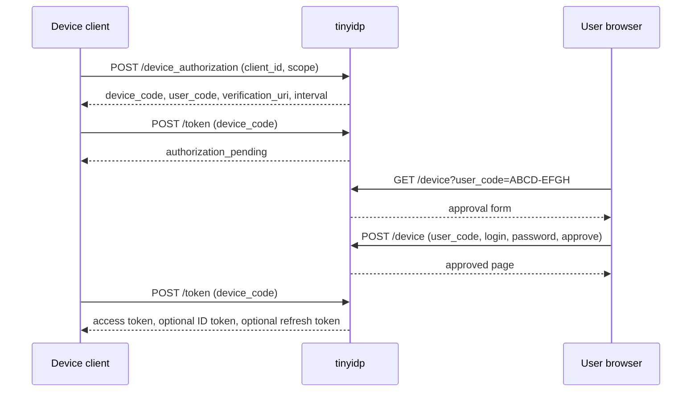
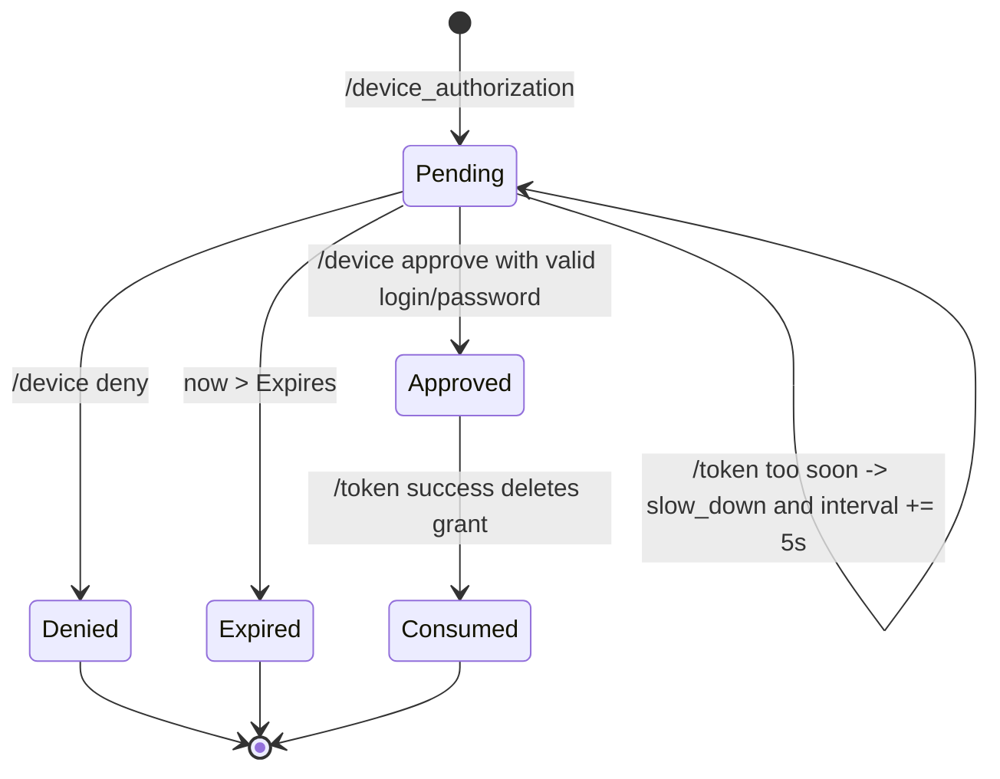

# tinyidp: Native OAuth Device Authorization Grant Implementation

This report explains the native OAuth 2.0 Device Authorization Grant implementation added to `tinyidp` in July 2026. The work turns `tinyidp` from a browser-login-only local OpenID Connect provider into a small OAuth authorization server that can also own device-code flows directly. The feature is intentionally scoped for local development and integration testing: state is in memory, approval uses the existing scenario registry, fixture passwords remain plain test data, and the implementation is designed to be readable and deterministic rather than production-hardened.

The work is collected in PR [wesen/2026-06-22--mock-oidc-idp#2](https://github.com/wesen/2026-06-22--mock-oidc-idp/pull/2), under ticket `TINYIDP-DEVICE-001`. The important implementation files are `internal/server/device.go`, `internal/server/token.go`, `internal/server/server.go`, `internal/server/jwt.go`, `internal/server/debug.go`, `internal/server/static/device.html`, and `internal/server/device_test.go`.

> [!summary]
> - `tinyidp` now implements the native OAuth Device Authorization Grant with `POST /device_authorization`, `GET/POST /device`, and `/token` support for `urn:ietf:params:oauth:grant-type:device_code`.
> - Device grants are stored beside the existing in-memory authorization-code, session, access-token, and refresh-token state. The design deliberately follows tinyidp's current runtime model instead of introducing persistence or a separate account system.
> - Approval uses the scenario registry and fixture password semantics already used by browser login. That keeps seeded users, generic claims, and negative auth scenarios consistent across browser and device flows.
> - The token polling path returns the expected OAuth device-flow errors: `authorization_pending`, `slow_down`, `expired_token`, `access_denied`, and `invalid_grant`.
> - Review feedback tightened the implementation: confidential clients authenticate at `/device_authorization`, blank approval logins are rejected, and `slow_down` now persists the RFC backoff interval increase.

## Why this implementation exists

Before this work, `tinyidp` could replace a Keycloak container for browser-based OIDC login tests. It provided discovery, JWKS, authorization-code login, token exchange, userinfo, refresh tokens, logout, scenarios, seeded users, fixture passwords, path-based issuer routes, and debug endpoints. That was enough for xgoja Step 06 browser login and Step 07 user-scoped inbox isolation.

The remaining gap was the OAuth Device Authorization Grant. The existing xgoja Step 08 example already had a device-like flow, but that flow was owned by the generated xgoja host. In that arrangement, `tinyidp` still supplied browser OIDC login, while the generated app implemented `/auth/device/start`, `/auth/device/approve`, and `/auth/device/token`. That proved a useful application-level design, but it did not make `tinyidp` itself an OAuth device authorization server.

Native device authorization answers a different question: can a client talk directly to the IdP using the standard device-code grant? The answer now is yes. A client can call `/device_authorization`, display the returned user code, poll `/token`, and receive tokens after the user approves in tinyidp's `/device` page.

The distinction matters because the owner of the device grant determines which component tests what:

| Flow | Device endpoints are owned by | What the flow tests |
|---|---|---|
| xgoja Step 08 app flow | Generated xgoja host | Application-specific device-token capture and ownership rules. |
| tinyidp native device flow | tinyidp | OAuth Device Authorization Grant semantics at the identity provider. |

The implementation keeps both models valid. The xgoja tutorial still states that Step 08 uses app-owned endpoints. The new tinyidp tutorial explains how to use `/device_authorization` when the IdP itself should own the device grant.

## The protocol shape

A device authorization flow separates token request polling from user approval. The client cannot complete a normal browser redirect flow, so it asks the authorization server for two codes:

- `device_code` is an opaque secret used by the device client when polling `/token`.
- `user_code` is a short human-entered code shown to the user.

The user opens a browser page, enters or confirms the user code, authenticates, and approves or denies. The device client polls the token endpoint until the grant is approved, denied, expired, or slowed down.

The resulting sequence is:



The implementation follows this shape directly. It does not route approval through `/authorize`, and it does not create an IdP browser session as a side effect. Approval authenticates and authorizes the device grant. Browser session reuse can be added later if a future test needs that exact behavior.

## Server state: one more grant map

The new feature fits into tinyidp's existing state model. `Server` already owns mutable in-memory maps for authorization codes, sessions, access tokens, refresh tokens, and device grants. Device authorization adds a new map rather than a new subsystem.

The relevant type is in `internal/server/device.go`:

```go
type deviceGrant struct {
    DeviceCode string
    UserCode   string

    ClientID string
    Scope    string
    Expires  time.Time
    Interval time.Duration

    Status deviceGrantStatus

    User     user.User
    Scenario *scenario.Scenario
    AuthTime time.Time

    LastPoll      time.Time
    SlowDownCount int
}
```

This struct contains the whole state machine. Before approval, `Status` is `devicePending` and there is no user. After approval, the grant records the same identity material that an authorization code carries into `/token`: `User`, `Scenario`, `ClientID`, `Scope`, and `AuthTime`. That is the key design choice. The token endpoint does not re-run login, does not re-resolve claims, and does not infer a user from the device code. It consumes a previously approved grant.

The state transitions are compact:



The one-time-use rule is implemented by deleting the approved grant during successful token exchange. A second poll with the same `device_code` returns `invalid_grant`.

## Starting a device flow

The start endpoint is `POST /device_authorization`. It parses the request, authenticates the client, validates scope, generates codes, stores a pending grant, and returns the RFC fields.

The implementation begins with normal method and form validation:

```go
func (s *Server) deviceAuthorization(w http.ResponseWriter, r *http.Request) {
    if r.Method != http.MethodPost {
        tokenError(w, http.StatusMethodNotAllowed, "invalid_request", "method not allowed")
        return
    }
    if err := r.ParseForm(); err != nil {
        tokenError(w, http.StatusBadRequest, "invalid_request", "invalid form")
        return
    }

    clientID, c, ok := s.authenticateOAuthClient(w, r)
    if !ok {
        return
    }

    scope := strings.TrimSpace(r.Form.Get("scope"))
    if scope == "" {
        scope = "openid profile email"
    }
    if !hasScope(scope, "openid") || !c.AllowsScope(scope) {
        tokenError(w, http.StatusBadRequest, "invalid_scope", "scope not allowed")
        return
    }

    grant := s.newDeviceGrant(clientID, scope, time.Now())
    // store under s.mu
}
```

The `authenticateOAuthClient` call was added after review feedback. The first implementation looked up only `client_id`, which was sufficient for public clients but incomplete for confidential clients. RFC 8628 applies normal OAuth client authentication requirements to the device authorization endpoint. The corrected endpoint therefore reuses the same client authentication path as `/token`: public clients can omit a secret, while confidential clients must use `client_secret_post` or `client_secret_basic`.

The response contains both the plain verification URI and a prefilled URI:

```json
{
  "device_code": "opaque-secret",
  "user_code": "ABCD-EFGH",
  "verification_uri": "http://127.0.0.1:5556/device",
  "verification_uri_complete": "http://127.0.0.1:5556/device?user_code=ABCD-EFGH",
  "expires_in": 600,
  "interval": 5
}
```

The response uses `Cache-Control: no-store` and `Pragma: no-cache`, matching token endpoint behavior. The `device_code` is a bearer secret while it remains valid, so it should not be cached.

## User-code generation and normalization

The user code is designed for manual entry. It uses an alphabet that avoids visually ambiguous characters:

```go
const userCodeAlphabet = "ABCDEFGHJKLMNPQRSTUVWXYZ23456789"
```

The display format is eight characters split into two groups:

```go
func generateUserCode() string {
    b := make([]byte, 8)
    for i := range b {
        b[i] = userCodeAlphabet[int(randomB64Byte())%len(userCodeAlphabet)]
    }
    return string(b[:4]) + "-" + string(b[4:])
}
```

Approval uses normalized comparison:

```go
func normalizeUserCode(value string) string {
    value = strings.ToUpper(value)
    value = strings.ReplaceAll(value, "-", "")
    value = strings.ReplaceAll(value, " ", "")
    return value
}
```

The server does not maintain a second user-code index. It scans `deviceGrants` under the mutex and compares normalized user codes. For a local test IdP this is the right tradeoff. It avoids another map that must be kept consistent across creation, approval, denial, expiry, debug reset, and successful token exchange. If tinyidp ever needs to support very large numbers of concurrent device grants, a secondary index can be added with tests that prove the two maps stay synchronized.

## Approval uses the scenario registry

The approval page is intentionally simple. `GET /device` renders an embedded HTML template. If `user_code` is present in the query string, the form pre-fills it. `POST /device` then validates the user code, action, login, and fixture password.

The approval path is the most important integration point with the rest of tinyidp:

```go
login := user.Normalize(r.PostForm.Get("login"))
if login == "" {
    s.renderDeviceMessage(w, r, "login is required")
    return
}
sc, _ := s.registry.Lookup(login)
if !passwordAccepted(sc, r.PostForm.Get("password")) {
    s.renderDeviceMessage(w, r, "invalid login or password")
    return
}
if sc.AuthError != "" {
    s.renderDeviceMessage(w, r, fmt.Sprintf("login scenario cannot approve device request: %s", sc.AuthError))
    return
}

s.mu.Lock()
grant.Status = deviceApproved
grant.User = sc.User
grant.Scenario = &sc
grant.AuthTime = now
s.deviceGrants[deviceCode] = grant
s.mu.Unlock()
```

This gives device approval the same identity semantics as browser login:

- Built-in users work.
- Fallback synthetic users work.
- Seeded users work.
- Fixture passwords are enforced when configured.
- Seeded-user claims flow into ID tokens and userinfo through the scenario.
- Auth-error scenarios can block approval.

The blank-login check was added after review feedback. Without it, `Registry.Lookup("")` would derive a fallback synthetic user and an empty scenario password would be accepted. Browser authorization already rejects empty logins, so device approval should follow the same rule.

## Polling and token exchange

The token endpoint dispatch now includes the device-code grant type:

```go
switch r.Form.Get("grant_type") {
case "authorization_code":
    s.tokenAuthorizationCode(w, r, clientID, c)
case "refresh_token":
    s.tokenRefresh(w, r, clientID, c)
case deviceGrantType:
    s.tokenDeviceCode(w, r, clientID)
default:
    tokenError(w, http.StatusBadRequest, "unsupported_grant_type", "only authorization_code, refresh_token, and device_code are supported")
}
```

`tokenDeviceCode` first validates terminal conditions that should not be hidden by polling-rate behavior: unknown code, expired code, and client mismatch. Only after those checks does it apply the polling interval.

The slow-down branch was tightened after review feedback:

```go
if !grant.LastPoll.IsZero() && now.Sub(grant.LastPoll) < grant.Interval {
    grant.SlowDownCount++
    grant.Interval += 5 * time.Second
    grant.LastPoll = now
    s.deviceGrants[deviceCode] = grant
    s.mu.Unlock()
    tokenError(w, http.StatusBadRequest, "slow_down", "polling too quickly")
    return
}
```

The important detail is `grant.Interval += 5 * time.Second`. RFC 8628 specifies that `slow_down` increases the polling interval by five seconds for subsequent requests. The first implementation counted slow-down events but left the interval unchanged. The corrected implementation persists the larger interval in grant state, which makes aggressive clients back off before they can poll successfully again.

Once a grant is approved, token issuance follows the same helper path as authorization-code exchange:

```go
access := s.issueAccessToken(grant.User, grant.Scenario, now, proof.JKT)
resp := map[string]any{
    "access_token": access,
    "token_type":   tokenTypeForJKT(proof.JKT),
    "expires_in":   3600,
    "scope":        grant.Scope,
}
if hasScope(grant.Scope, "openid") {
    idToken, err := s.issueIDToken(grant.User, grant.Scenario, grant.ClientID, "", grant.AuthTime, now)
    // ...
    resp["id_token"] = idToken
}
if hasScope(grant.Scope, "offline_access") {
    resp["refresh_token"] = s.issueRefreshToken(grant.User, grant.Scenario, grant.ClientID, grant.Scope, now, proof.JKT)
}
```

This snippet reflects the later DPoP work as well: the token helpers now accept a DPoP JWK thumbprint. For the device authorization feature itself, the important property is helper reuse. Device-code tokens and authorization-code tokens should not diverge in claim construction, expiry, refresh-token behavior, or later cross-cutting features.

## Discovery, route prefixes, and debug visibility

Discovery now advertises two device-related facts:

```go
"device_authorization_endpoint": s.issuer + "/device_authorization",
"grant_types_supported": []string{
    "authorization_code",
    "refresh_token",
    deviceGrantType,
},
```

Route registration uses the same root-and-prefix pattern as every other endpoint:

```go
func (s *Server) registerRoutesAt(mux *http.ServeMux, prefix string) {
    mux.HandleFunc(prefix+"/.well-known/openid-configuration", s.discovery)
    mux.HandleFunc(prefix+"/jwks", s.jwks)
    mux.HandleFunc(prefix+"/authorize", s.authorize)
    mux.HandleFunc(prefix+"/device_authorization", s.deviceAuthorization)
    mux.HandleFunc(prefix+"/device", s.device)
    mux.HandleFunc(prefix+"/token", s.token)
    mux.HandleFunc(prefix+"/userinfo", s.userinfo)
    mux.HandleFunc(prefix+"/end-session", s.endSession)
    // ...
}
```

This preserves path-based issuer compatibility. If the issuer is `http://127.0.0.1:5556/realms/personal-inbox`, discovery under that issuer advertises `/realms/personal-inbox/device_authorization`, `/realms/personal-inbox/device`, and `/realms/personal-inbox/token`. Root routes remain available for simple local testing.

The debug endpoint `/debug/device-grants` lists grant state without exposing full device codes. It includes a redacted device-code prefix, user code, client ID, scope, status, subject, scenario, last poll, expiry, and slow-down count. This endpoint matters because device flows are asynchronous: one actor is polling while another actor approves. Debug visibility makes tests and manual investigation much easier.

## Validation strategy

The tests in `internal/server/device_test.go` cover both helper behavior and full HTTP flows.

The helper tests prove user-code shape and normalization:

- generated user codes are `XXXX-XXXX`;
- generated characters come from the non-ambiguous alphabet;
- lower case, spaces, and hyphens normalize correctly.

The endpoint tests prove the state machine:

- discovery advertises `device_authorization_endpoint` and the device-code grant type;
- unknown clients are rejected;
- confidential clients must authenticate;
- disallowed or non-OpenID scopes are rejected;
- successful start responses include all required fields;
- pending token polls return `authorization_pending`;
- aggressive polling returns `slow_down` and increases the interval;
- blank approval logins fail;
- wrong fixture passwords leave the grant pending;
- approval as seeded Alice returns fixed subject and claims;
- denial returns `access_denied`;
- expiry returns `expired_token`;
- client mismatch returns `invalid_grant`;
- successful token exchange is one-time use;
- path-based issuer routes expose device endpoints.

The final validation commands were:

```text
go test ./internal/server -run 'TestDevice' -count=1
go test ./internal/server -count=1
GOWORK=off go test ./... -count=1
GOWORK=off go build ./cmd/tinyidp
go run ./cmd/tinyidp help tutorial-device-authorization
```

A manual curl smoke also ran the full HTTP path: start tinyidp, create a device authorization request, approve Alice with her fixture password, and exchange the device code for access, ID, and refresh tokens.

## Review feedback and corrections

The automated PR review identified three issues that were worth fixing immediately.

### Confidential-client authentication at `/device_authorization`

The first implementation accepted `client_id` at `/device_authorization` without enforcing secrets for confidential clients. The token endpoint already enforced confidential-client authentication, but RFC 8628 applies the same expectation to the device authorization endpoint. The fix was to extract and reuse `authenticateOAuthClient` so `web-app` and other confidential clients must present the correct secret before a pending grant is created.

This is a good example of avoiding protocol drift between endpoints. If two endpoints both authenticate OAuth clients, they should share the same helper.

### Blank logins during approval

The approval handler now rejects `login == ""` before calling the scenario registry. This aligns device approval with browser authorize POST. It also prevents an empty fallback synthetic user from approving a grant.

The regression test submits a blank login and expects `login is required` while the grant remains pending.

### Persisted `slow_down` interval

The slow-down branch now increases `grant.Interval` by five seconds. The test asserts that the interval changes from five seconds to ten seconds after the first too-fast poll. Subsequent tests age `LastPoll` by eleven seconds rather than sleeping, which keeps the suite fast and deterministic.

## Important design decisions

### Direct approval form first

The first implementation uses a direct `/device` login/password approval form rather than reusing browser sessions or redirecting through `/authorize`. That choice keeps the behavior deterministic and easy to test. It also avoids coupling the device grant to browser session state before there is a concrete test that needs session reuse.

A future enhancement can add session-aware approval. The current design does not block it; it simply leaves the first implementation smaller.

### Server-side scan for user-code lookup

User-code lookup scans the `deviceGrants` map under the server mutex. This is simple and correct for local test loads. A secondary index would improve lookup complexity but add synchronization complexity across creation, denial, approval, expiry, reset, and consumption.

The current implementation optimizes for correctness and readability. If scale becomes relevant, the tests already define the behavior a secondary index must preserve.

### Shared token issuance helpers

Device-code exchange reuses token issuance helpers rather than duplicating ID-token claim construction. This decision became more valuable immediately when DPoP support was added afterward. Because both authorization-code and device-code token responses call the same helpers, DPoP binding could be added once and used by both grant types.

The rule is: grant handlers decide whether a token may be issued; issuance helpers decide how a token is represented.

## What a future contributor should know

The native device authorization implementation is complete enough for local OAuth device-flow tests, but it is still a tinyidp feature, not a production IdP subsystem.

The important boundaries are:

- State is in memory and cleared on restart.
- User approval is scenario-based, not account-system-based.
- Fixture passwords are plain local test values.
- Device grants are not garbage-collected beyond reset and successful consumption.
- Denied and expired grants remain inspectable until reset.
- Path-based issuer routes are URL-shape compatibility only.
- xgoja Step 08's current app-owned flow remains separate.

The implementation is deliberately explicit. Each endpoint owns one part of the flow, each state transition is visible in `deviceGrant`, and tests assert protocol errors rather than only happy-path token issuance. That makes the feature suitable as a test fixture: it is small enough to read, strict enough to catch client mistakes, and integrated enough to share seeded users, claims, passwords, DPoP binding, and refresh-token behavior with the rest of tinyidp.

## References

- Repo: `/home/manuel/workspaces/2026-06-12/goja-express-auth/2026-06-22--mock-oidc-idp`
- PR: https://github.com/wesen/2026-06-22--mock-oidc-idp/pull/2
- Ticket: `/home/manuel/workspaces/2026-06-12/goja-express-auth/2026-06-22--mock-oidc-idp/ttmp/2026/07/06/TINYIDP-DEVICE-001--oauth-device-authorization-grant-for-tinyidp`
- RFC 8628: OAuth 2.0 Device Authorization Grant
- Main implementation files:
  - `internal/server/device.go`
  - `internal/server/token.go`
  - `internal/server/device_test.go`
  - `internal/server/static/device.html`
  - `internal/server/debug.go`
  - `internal/server/jwt.go`
