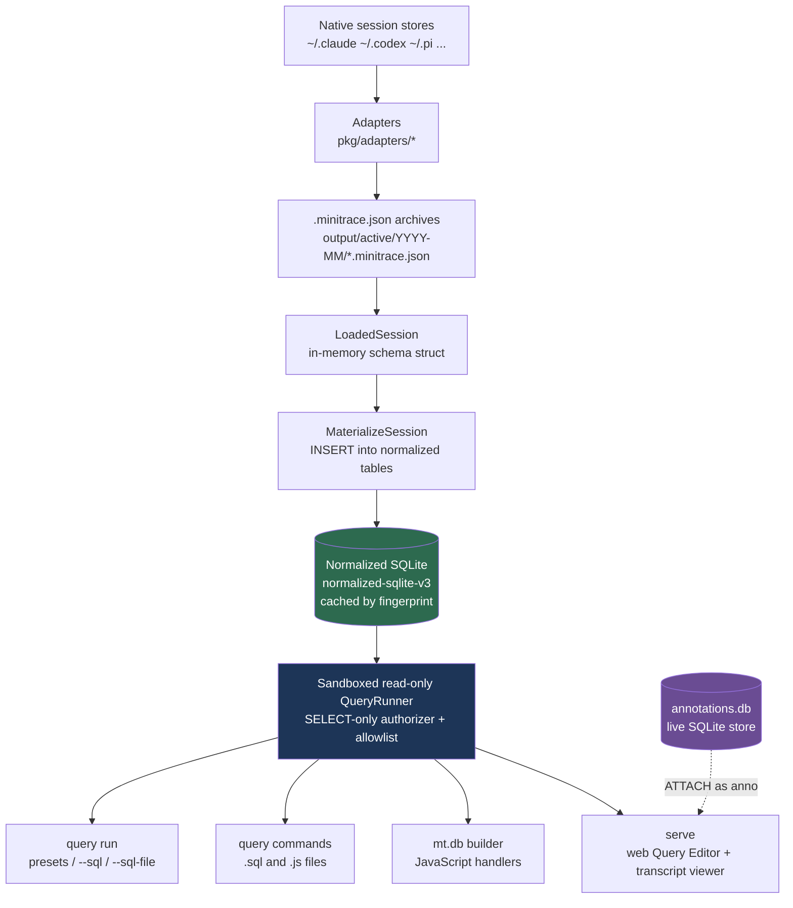

# go-minitrace — The Normalized SQLite Query Engine

go-minitrace converts AI coding-agent transcripts — from Claude Code, Codex, Pi, GitHub Copilot CLI, claude.ai, ChatGPT, and Geppetto/Pinocchio — into a single archive format called minitrace, and then lets an analyst query thousands of those archives with SQL, reusable structured commands, JavaScript handlers, or a web UI. This note is a deep-dive into the part of the system that changed most recently and most fundamentally: the query engine. The engine used to be DuckDB reading JSON blobs. It is now a normalized SQLite database built on demand from the archives, wrapped in a sandboxed read-only runner shared by every query surface. This report explains what that architecture is, why each piece exists, and what would break if any of it were removed.

This is the current architecture entry in the [[go-minitrace]] map; use the migration guide for historical DuckDB-to-SQLite rewrites.

> [!summary]
> - The query engine is a single normalized SQLite database (`normalized-sqlite-v3`) with one table per minitrace entity, built from `.minitrace.json` archives on demand and cached by content fingerprint.
> - One sandboxed read-only query runner — a SQLite authorizer that permits only `SELECT` over an allowlist of tables plus a `sessions_base` compatibility view — backs all four surfaces: `query run`, `query commands`, the `mt.db()` JavaScript builder, and `serve`.
> - Old DuckDB-era SQL keeps working through the `sessions_base` view, so the migration did not strand saved queries.

## Why this project exists

When something breaks in a codebase that an agent has worked on for months, the useful question is rarely "what changed in the last commit?" It is "what did this look like when it worked, and which sessions show the transition?" Answering that means reducing hundreds of verbose JSONL transcripts down to the four sessions that carry signal, and then extracting only the tool calls, file touches, and errors that matter. go-minitrace exists to make that reduction a query problem rather than a reading problem.

The conversion step is where the different native formats are reconciled. Each agent framework records sessions differently — Claude Code writes one JSONL file per session with tool-use and tool-result blocks, Codex splits session logs from `codex exec` logs, Pi uses workspace-slugged directories of JSONL, and turnsdb stores full conversation snapshots that must be diffed back into turns. The adapters flatten all of this into one schema so that a single query can compare a Pi session against a Codex session without special-casing either.

## The migration this report documents

The engine described here replaced a DuckDB backend. Understanding why the replacement happened explains most of the current design.

DuckDB loaded each archive as a row in a table called `sessions_base`. That table had five scalar columns (`id`, `title`, `summary`, `classification`, `profile`) and the rest of the session — environment, timing, metrics, and the arrays of turns, tool calls, annotations, and events — lived as JSON blob columns. To ask a question about tool calls, an analyst had to write `UNNEST(tool_calls) AS t(tc)` and then dig fields out with `tc->>'tool_name'`, casting strings to numbers by hand and remembering that DuckDB lists are 1-based. The JSON-arrow operators had low parser precedence, so predicates needed defensive parentheses. Every recipe in the documentation carried this ceremony.

The replacement inverts the storage. Instead of keeping the session as a nested JSON document and unnesting at query time, the engine flattens the document into relational tables at build time. A tool call is a row in `tool_calls`. A turn is a row in `turns`. The fields an analyst actually filters and groups on — `tool_name`, `operation_type`, `success`, `exit_code`, `duration_ms`, `agent_framework`, `quality`, `started_at` — are real typed columns. The consequence is that the common query is now plain relational SQL with no JSON extraction and no casting:

```sql
SELECT s.agent_framework, tc.tool_name, tc.operation_type, tc.success
FROM tool_calls tc
JOIN sessions s USING (session_id)
WHERE tc.success = 0;
```

## Architecture

The engine is a pipeline from native session files to query results. Nothing is a long-lived server-side database; the SQLite database is a materialized cache derived from the archives and rebuilt when the archives change.



The important structural fact is that the box labelled "Sandboxed read-only QueryRunner" is one implementation, constructed the same way for all four surfaces. `query run`, the SQL rendered by a structured `query commands` file, the `db.query()` call inside a JavaScript handler, and the web Query Editor in `serve` all execute through `minitracedb.NewQueryRunner(db, AllowedObjectNames(), opts)`. There is no second query path with different rules. A query that is rejected on the command line is rejected identically in the browser.

## Implementation details

### The normalized schema

The schema is defined in `pkg/minitracedb/schema.go` as a set of `TableDescriptor` values, each carrying both a column list (used for introspection and the JavaScript `db.schema()` call) and the `CREATE TABLE` statement. There are ten tables:

| Table | One row per | Notable columns |
|---|---|---|
| `sessions` | session | `agent_framework`, `model`, `working_directory`, `git_branch`, `quality`, `started_at`, `duration_seconds`, `turn_count`, `tool_call_count` |
| `turns` | conversational turn | `turn_index`, `role`, `content`, `thinking`, token columns |
| `tool_calls` | tool invocation | `tool_name`, `operation_type`, `file_path`, `command`, `success`, `error`, `exit_code`, `duration_ms` |
| `turn_tool_calls` | turn↔tool-call link | `ordinal` |
| `files` | file path touched | `path`, `operation_type`, `success` |
| `annotations` | annotation | `scope_type`, `target_id`, `category`, taxonomy JSON columns |
| `handovers` | handover document | `direction`, `document` |
| `metrics` | session (wide) | token totals, `read_ratio`, `idle_ratio`, `subagent_count`, `session_cost` |
| `attachments` | artifact reference | `kind`, `media_type`, `path` |
| `events` | timeline event | `kind`, `title`, `summary` |

Every table also carries a `raw_json` column holding the original record, and `turns`, `tool_calls`, `attachments`, and `events` carry a `framework_metadata_json` column. This is the escape hatch. The schema promotes the fields worth indexing and filtering into typed columns, but the long tail of adapter-specific detail is never discarded — it stays reachable through SQLite's `json_extract`:

```sql
SELECT session_id,
       json_extract(framework_metadata_json, '$.stop_reason') AS stop_reason
FROM turns
WHERE role = 'assistant';
```

The design decision here is which fields graduate into columns. A field graduates when queries filter or group on it. `exit_code` is a column because analysts look for nonzero exits; `tool_use_result` (Claude Code's structured result payload) stays in `framework_metadata_json` because it is inspected occasionally but never grouped on. Promoting everything would make the schema unwieldy and the materialization slow; promoting nothing would reproduce the DuckDB JSON-digging problem. The column set is the answer to the question "what does an analyst type after `WHERE`?"

### The sessions_base compatibility view

The migration could have stranded every saved DuckDB query. It did not, because the schema also creates a view that reconstructs the old shape:

```sql
CREATE VIEW IF NOT EXISTS sessions_base AS
SELECT
    session_id AS id, title, summary, classification, profile,
    json_extract(raw_json, '$.provenance') AS provenance,
    json_extract(raw_json, '$.environment') AS environment,
    json_extract(raw_json, '$.timing') AS timing,
    json_extract(raw_json, '$.turns') AS turns,
    json_extract(raw_json, '$.tool_calls') AS tool_calls,
    -- flags, operational_context, annotations, metrics ...
FROM sessions;
```

Session-level SQL written for DuckDB — `SELECT environment->>'model' FROM sessions_base` — runs unchanged, because SQLite 3.38 and later support the `->` and `->>` JSON operators on text columns. What does not survive is per-tool-call and per-turn SQL that relied on `UNNEST`, because SQLite has no `UNNEST`. That SQL must move to the `tool_calls` and `turns` tables. The view is deliberately a partial bridge: it preserves the queries that are cheap to preserve and forces a rewrite only where the relational model is genuinely better. Structured `.sql` command files reference this view through the `{{TABLE_NAME}}` placeholder, which now substitutes to `sessions_base`.

### The sandboxed read-only query runner

The runner is the security boundary. Archives can contain arbitrary text from real sessions, and structured command files and JavaScript handlers can come from external repositories, so the SQL that reaches the database is not always trusted. The runner installs a SQLite authorizer callback — a function SQLite invokes for every operation it is about to perform during statement preparation. The callback in `pkg/minitracedb/query.go` reduces to a small decision table:

```
authorizer(op, object, ...):
    SELECT, FUNCTION           -> OK
    READ:
        object in allowlist    -> OK
        otherwise              -> DENY, remember object
    INSERT/UPDATE/DELETE/PRAGMA/ATTACH/DETACH/
    CREATE_*/DROP_*/ALTER/REINDEX/...   -> DENY
    default                    -> DENY
```

The allowlist is `AllowedObjectNames()`: the ten tables plus `sessions_base`. Any read of a table outside that set — most importantly `sqlite_master`, the schema catalog — is denied. When a denial fires on a `sqlite_`-prefixed object, the error is specific and actionable:

```
query references disallowed table/view "sqlite_master";
use db.schema() or db.tables() from JS to introspect the schema
```

This is why introspection is a first-class API rather than a raw-SQL trick. An analyst cannot `SELECT * FROM sqlite_master` to discover columns; they call `db.schema()`, which returns the `TableDescriptor` set the runner already trusts. The authorizer also denies every mutating operation, which is what makes it safe to point the same runner at untrusted command files. A malicious `.sql` file cannot `DROP TABLE`, cannot `ATTACH` another database, and cannot `PRAGMA` its way out of the sandbox — the authorizer rejects all of those during preparation, before any row is touched.

### Build once, cache by fingerprint

Materializing thousands of archives into SQLite on every query would be slow. The engine avoids that by treating the database as a pure function of its inputs and caching on a content hash. `pkg/minitracedb/cache.go` fingerprints each source file by SHA-256 of its bytes, combines those fingerprints with the schema, importer, and converter version strings, and hashes the whole thing into a cache key:

```
FingerprintFile(path)      -> {sha256, size, "file:sha256:<hex>"}
ComputeCacheKey(sources, options):
    stable = sort(sources by path)
    key = "mtdb-" + sha256(json({schema_version, importer_version,
                                  converter_version, backend, storage,
                                  stable_sources}))
```

Because the key folds in `SchemaVersion` (`normalized-sqlite-v3`), a change to the schema definition invalidates every cached database automatically — there is no separate cache-busting step to remember. Because it folds in the per-file SHA-256, editing one archive invalidates only caches that include that file. The first query over a glob pays the materialization cost; subsequent queries over the same glob reuse the cached database and are fast. This is the mechanism behind the documentation's claim that "the build is cached by archive fingerprint" — it is a genuine content-addressed cache, not a timestamp heuristic.

### Live annotations via ATTACH

Annotations create a tension. The archive files are the source of truth for querying, but annotations are edited constantly through the `annotate` CLI and the web UI, and they live in a separate SQLite working store, `annotations.db`. If querying only ever read the archives, the web UI would show stale labels until an explicit `annotate sync` rewrote the JSON files.

`serve` resolves this by attaching the live store. During startup it opens the normalized database and issues `ATTACH DATABASE '<annotations.db path>' AS "anno"` (see `pkg/minitracedb/open.go` and `serve.go`). SQL run in the web Query Editor can then read `anno.annotations` and see edits immediately:

```sql
SELECT s.session_id, s.agent_framework, a.category, a.title
FROM anno.annotations a
JOIN sessions s ON s.session_id = a.session_id;
```

The subtlety is how this coexists with the sandbox, which denies `ATTACH`. The attach is performed by the host during connection setup, not by user SQL — the authorizer only governs the SQL an analyst submits, not the connection the host constructs. The SQLite authorizer reports attached-database objects by their bare name, so `anno.annotations` is authorized under the same `annotations` allowlist entry as the archive-backed table; only the store's `sync_state` table needed an explicit addition to the allowlist. On the command line there is no attach, so `query run` sees only archive-synced annotations and the workflow rule is "`annotate sync` first, then query."

### Three query surfaces, one engine

The four entry points differ only in where the SQL comes from and what they do with the rows.

| Surface | SQL source | Post-processing | Runner construction |
|---|---|---|---|
| `query run` | preset, `--sql`, or `--sql-file` | Glazed output formatting | `NewArchiveQueryTarget` → `NewQueryRunner` |
| `query commands` (`.sql`) | rendered template with `{{TABLE_NAME}}` | Glazed output formatting | shared runner over materialized archives |
| `mt.db()` (`.js`) | strings built in JavaScript | arbitrary JS (scoring, joins, reshaping) | `mt.db().RuntimeArchives()...Build()` |
| `serve` | web Query Editor / structured forms | JSON to the browser | shared runner + `anno` ATTACH |

The JavaScript surface is the one that grew a proper API. The builder is the canonical path: `mt.db()` returns a builder, and calls like `.RuntimeArchives()` (use the `--archive-glob` the command was invoked with), `.QueryCommandDefaults()`, `.MaxRows(n)`, and `.Timeout(ms)` compose configuration before `.Build()` returns a handle. The handle exposes `query`, `queryOne`, `queryResult`, `schema`, `tables`, and `close`:

```js
const mt = require("minitrace");
const db = mt.db().RuntimeArchives().QueryCommandDefaults().Build();
try {
  const rows = db.query(
    "SELECT session_id, title FROM sessions ORDER BY started_at DESC LIMIT 10"
  );
  // db.queryResult(sql) -> { columns, rows, count, truncated, error }
  // db.schema() / db.tables() -> introspect (sqlite_master is blocked)
} finally {
  db.close();
}
```

Two things about this API reflect the migration. First, `mt.query()` no longer executes SQL — it builds named query-recipe objects — and the old ambient fields `mt.runtime.tableName` and `mt.runtime.dbPath` are vestigial echoes of removed flags, meaningful only for backward compatibility. A handler that reaches for them is following the dead DuckDB API. Second, JavaScript failures render as a compact one-line message plus a `file:line` location, and under `--output json` the process emits a parseable envelope `{"error": ..., "location": ..., "command": ...}` on stdout, so automation that consumes JSON always receives something to parse instead of an empty stream on failure.

### Adapter fidelity: native, derived, scraped, absent

The flat schema hides a real hazard: a column like `duration_ms` looks uniform, but different adapters populate it by very different means, and some cannot populate it at all. A recent pass through the adapters made this honest and documented it as a fidelity matrix. The distinctions matter because a query that averages `duration_ms` across frameworks is averaging a derived quantity for Pi and Claude Code against a scraped quantity for Codex, and silently omitting Copilot entirely.

- **Native** — copied from an explicit field in the source. Codex exit codes come from `exec_command` events; Claude Code token usage comes from message usage metadata.
- **Derived** — computed by the adapter. Pi and Claude Code produce `duration_ms` by subtracting a tool-use timestamp from its tool-result timestamp. claude.ai derives it from block timestamps.
- **Scraped** — parsed out of free-form strings. Claude Code exit codes are read from the result string `"Error: Exit code N"`; Codex durations are parsed from `"Wall time:"` lines in exec output.
- **Absent** — Pi records no exit codes and no git branch; Codex records no git branch and no cache-creation tokens; Copilot records no per-tool durations.

Truncation is uniform and deliberately honest: tool results longer than 10 KiB are cut with a `[truncated]` marker, but `full_bytes` and `full_hash` always describe the full pre-truncation payload — its true byte length and SHA-256 — so a query can detect and deduplicate truncated outputs without being misled about their size.

## Reading a real trace

The following is real output from a database built over two converted Pi sessions. The `session-list` preset renders one row per session with the fields an analyst scans first:

```
| id            | framework | model               | turns | tools | duration_s | read_ratio |
|---------------|-----------|---------------------|-------|-------|------------|------------|
| 019ddfae-...  | pi        | gpt-5.3-codex-spark |   24  |   22  |    165.5   |    0.09    |
| 019e2309-...  | pi        | glm-5.1             |   31  |   31  |    322.0   |    0.19    |
```

Every value here is a column read, not a JSON extraction. `turns` is `sessions.turn_count`, `duration_s` is `ROUND(sessions.duration_seconds, 1)`, `read_ratio` is `metrics.read_ratio`. Under the DuckDB engine the same preset had to cast `metrics->>'turn_count'` to an integer and `timing->>'duration_seconds'` to a double inside the query text. The relational schema moved that work from every query to the one-time materialization.

Asking a per-tool-call question is now a join rather than an `UNNEST`. The slowest tool calls, where `duration_ms` is populated:

```sql
SELECT session_id, tool_name,
       substr(COALESCE(file_path, command, ''), 1, 80) AS target,
       duration_ms
FROM tool_calls
WHERE duration_ms IS NOT NULL
ORDER BY duration_ms DESC
LIMIT 5;
```

Against the fixture this returns five `bash` calls with durations from 37,858 ms down to 2,256 ms — derived, for these Pi sessions, from the emit-to-result timestamp difference.

## The documentation and skill refresh

A migration of this size makes the surrounding prose wrong all at once. Every help page that said "loads into DuckDB", every recipe that used `UNNEST`, every claim that events and attachments were "queryable with the same UNNEST pattern" became false the moment the engine changed. The refresh that accompanied this report rewrote the embedded glazed help tree in `pkg/doc/` to match the code rather than the removed engine.

The refresh followed one rule that is worth preserving as a working practice: every SQL snippet placed in any document was executed against a real fixture archive before being trusted. A small fixture was built by converting two real Pi sessions with `convert pi --source-session`, and each snippet was run through `query run --sql`. A short Python harness extracted every fenced ` ```sql ` block from each markdown file and ran it, reporting pass, fail, or skip-because-fragment. Roughly seventy snippets were verified this way, which caught the difference between documentation that reads plausibly and documentation that runs. The stub pages for the removed engine (`writing-duckdb-queries.md`, `duckdb-query-recipes.md`) were kept as short pointers to their replacements (`writing-queries.md`, `query-recipes.md`) rather than deleted, because external links and saved help slugs still reference them.

## Tricky details and failure modes

- **The `sessions_base` view is a partial bridge, not a full one.** Session-level `->>` SQL survives; anything using `UNNEST` does not, because SQLite lacks it. The failure surfaces as `no such function: UNNEST`, and the fix is to query the child tables. Presenting the view as a complete DuckDB emulation would set a false expectation.
- **`sqlite_master` is denied, and this is load-bearing.** Introspection must go through `db.schema()` / `db.tables()`. A handler that queries the catalog directly fails with a pointed error rather than leaking the sandbox.
- **The cache key folds in `SchemaVersion`.** Editing the schema without bumping the version would serve a stale materialized database. The version bump to `normalized-sqlite-v3` is what makes schema changes safe against the cache.
- **`--db-path`, `--table-name`, and `--persist-loaded` are deprecated, not removed.** SQL commands ignore them and print a warning; JS commands still see them on `mt.runtime` for compatibility. Silently dropping the flags would have broken scripts that still pass them; keeping them inert with a warning is the migration-friendly middle path.
- **Manifest maintenance is read-merge-write.** Each conversion rescans the output tree and merges with the existing manifest, so converting a targeted subset with `--source-session` into a directory that already holds other sessions no longer truncates the manifest to the last invocation. This fixed a real drift bug that earlier tooling worked around by advising analysts to distrust manifests.
- **Averaging `duration_ms` or `exit_code` across frameworks mixes native, derived, scraped, and absent values.** The fidelity matrix in the adapter reference exists precisely so that cross-framework aggregates are read with the right caveats.

## Open questions

- Should more of `framework_metadata_json` graduate into typed columns as query patterns stabilize, or does the JSON escape hatch remain the right home for the long tail?
- The disk cache keys on file SHA-256; is there value in a coarser project-level cache for very large archive sets where fingerprinting every file dominates the first query?
- Copilot fidelity is the thinnest of the adapters (no per-tool durations, no exit codes). Is that a source-format limitation or an adapter gap worth closing?

## Near-term next steps

- Continue verifying that every embedded SQL snippet runs as the schema evolves; the extract-and-run harness should become a test rather than a manual pass.
- Apply the user-level transcript-analysis skill refresh (builder API, `discover --cwd-contains/--since`, `--source-session`/`--source-list`, removal of the obsolete grep-staging scripts) once the skill directory is writable.
- Consider promoting the fidelity matrix into a machine-readable form the adapters assert against, so documentation and code cannot drift apart.

## Project working rule

Treat the archives as the source of truth and the SQLite database as a derived, disposable cache. Never add a query path that bypasses the shared sandboxed runner, and never document a SQL snippet without running it against a real archive first. The relational schema earns its complexity only if every surface reads through the same trusted engine and every published query is known to execute.
