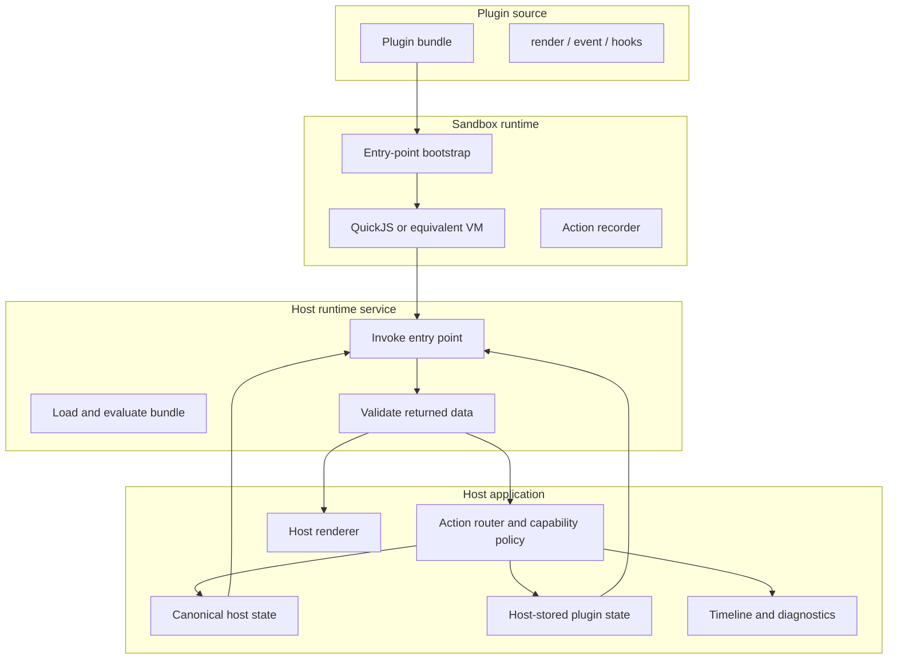

# Browser Sandboxed Plugin Runtime: The Data-Only Extension Pattern

This note extracts the reusable engineering pattern from the Browser Plugin VM project. The source project implements a browser application that executes plugin JavaScript inside in-browser QuickJS sessions, accepts only data-shaped outputs from plugins, validates those outputs in the host, and routes accepted actions through host-owned reducers and renderers. The pattern generalizes beyond the social-feed demo: it is a way to let extension code compute behavior without giving that code authority over the host page.

> [!summary]
> - Treat plugin code as a producer of data, not as a holder of host authority. The plugin returns UI descriptions, actions, state patches, and hook results; the host validates and applies them.
> - Store plugin-local state in the host while preserving plugin ownership of its schema. This gives React, Redux, tests, and audit tools a stable representation without exposing mutable host objects to the plugin.
> - Separate canonical domain facts from plugin-derived views. The base application owns facts; active plugins derive projections and request state changes through an audited action path.
> - Prefer explicit entry points over ambient capabilities. A plugin should implement named surfaces and hooks, and every entry point should have a small input and output contract.

## Why this note exists

The project report explains one concrete implementation: a QuickJS browser plugin runtime with a stateful feed middleware demo. This article explains the reusable design behind that implementation. A future project may not have a social feed. It may not use the same UI components. It may not use Redux. The useful pattern is still the same: run extension code behind a strict boundary, exchange data only, and keep host authority in host code.

The pattern is useful whenever a browser application needs user-extensible behavior but cannot let extension code receive raw access to the DOM, host stores, network clients, privileged APIs, or live object references. The goal is not to make plugin code powerless. The goal is to give plugin code a narrow, inspectable set of ways to participate in the application.

The source incident is `/home/manuel/code/wesen/2026-07-07--browser-js-inject-vm`. The most important files are:

| File | What it illustrates |
| --- | --- |
| `src/runtime/plugin-runtime/contracts.ts` | Runtime action kinds, plugin-state actions, feed hook input/output contracts. |
| `src/runtime/plugin-runtime/stack-bootstrap.vm.js` | VM-side registration, dispatch recording, render/event entry points, feed hook entry points. |
| `src/runtime/plugin-runtime/runtimeService.ts` | QuickJS session setup, plugin evaluation, host-side entry-point invocation, runtime validation. |
| `src/runtime/features/runtimeSessions/runtimeSessionsSlice.ts` | Host-stored plugin state, state versioning, runtime action timeline. |
| `src/host/usePluginRuntime.ts` | React render/event loop for plugin panels. |
| `src/features/feed/feedSlice.ts` | Canonical domain state stripped down to facts and events. |
| `src/features/feed/useFeedPluginPipeline.ts` | Runtime-aware middleware runner over active plugin sessions. |
| `src/components/SocialFeed.tsx` | Composition of canonical feed, plugin panels, simulator, hook chain, trace UI. |
| `src/components/SourceViewer.tsx` | User-visible source transparency for evaluated plugin bundles. |

## When to use this pattern

Use this pattern when all of the following are true:

- The host application wants plugin-authored behavior, but the host must remain responsible for rendering, storage, domain mutation, and privileged effects.
- Plugin code can run synchronously against bounded inputs and return bounded outputs.
- The host can define a finite set of extension points, such as `render`, `handleEvent`, `applyMiddleware`, or `onIncomingMessage`.
- The plugin does not need live references to host objects. It can receive snapshots and return requested changes.
- The application benefits from auditability: the host should know which plugin requested which action, whether it was accepted, and what state changed.

Do not use this pattern unchanged when plugins require long-running asynchronous work, streaming I/O, direct DOM integration, arbitrary package imports, or persistent storage that cannot be represented as JSON-like state. Those features can be added, but each one needs its own explicit contract and authority boundary.

## Core model

The pattern has four entities.

| Entity | Responsibility |
| --- | --- |
| Host | Owns canonical state, rendering, reducers, effect execution, validation, capability policy, and audit logs. |
| Sandbox | Executes plugin code with memory/deadline controls and without host object references. |
| Plugin | Implements named entry points that consume JSON-like input and return JSON-like output. |
| Contract | Defines the shape of inputs, outputs, actions, state patches, metadata, and errors. |

The simplest execution path is:

```text
host snapshot -> sandbox entry point -> data result -> host validation -> host-owned application
```

The important design rule is that the plugin never performs privileged host work directly. It describes a desired result. The host validates the result and decides whether to apply it.

This rule applies to rendering, state changes, domain mutations, and hook processing:

| Plugin wants to... | Plugin returns... | Host does... |
| --- | --- | --- |
| Render UI | A UI tree data structure. | Validates the tree and renders React components. |
| React to a click | Runtime actions. | Classifies, audits, capability-checks, and applies actions. |
| Update private plugin state | `plugin/state.*` action or `statePatch`. | Stores the new plugin state in host state and increments a version. |
| Derive a visible list | Filtered IDs/posts and annotations. | Builds the displayed view without changing canonical facts. |
| Drop an incoming item | `{ drop: true, reason }`. | Records a drop event and avoids canonical append. |

The host-side action path is what makes the pattern maintainable. There should be no hidden mutation path for plugin behavior. If a plugin changes anything visible, the host should be able to record the request and its outcome.

## Architecture shape

A minimal implementation has these layers:



The implementation can use QuickJS, Web Workers, iframes, a server-side VM, or another execution boundary. The boundary is an implementation detail. The reusable pattern is the contract: snapshots in, data out, host validation and application.

## Entry points should be explicit

A plugin should not receive a general host object. It should implement explicit entry points. Each entry point should have a separate input and output type.

The Browser Plugin VM project uses these entry-point classes:

| Entry point | Purpose |
| --- | --- |
| `renderRuntimeSurface(surfaceId, state)` | Produce a host-rendered UI tree for one plugin surface. |
| `eventRuntimeSurface(surfaceId, handlerName, args, state)` | Handle a user event from a rendered UI tree and return runtime actions. |
| `applyFeedMiddleware(input)` | Derive a visible feed from canonical posts and plugin state. |
| `incomingFeedMessage(input)` | Accept, modify, or drop a new incoming feed message before canonical append. |

The important part is not the names. The important part is that each entry point has a bounded job. Rendering returns UI data. Event handling returns actions. Middleware returns projection data. Incoming-message hooks return a message decision. This makes each contract testable.

A generic plugin API should avoid entry points like this:

```ts
plugin.run(hostApi);
```

A better shape is:

```ts
plugin.render(input): UiTree;
plugin.handleEvent(input): RuntimeAction[];
plugin.applyDomainProjection(input): ProjectionResult;
plugin.handleIncomingItem(input): IncomingDecision;
```

The second shape is easier to validate, easier to test, and easier to explain to plugin authors.

## Plugin-local state should be host-stored

A plugin may own the meaning of its state without storing that state inside the VM as the only copy. This distinction is central.

In the source project, a plugin declares:

```js
initialPluginState: {
  query: '',
  matchCount: 0
}
```

The host stores this under the runtime session:

```ts
pluginState: Record<string, unknown>;
pluginStateVersion: number;
```

The plugin updates it by returning data:

```js
dispatchPluginAction('state.merge', { query: 'quickjs' });
```

or:

```js
return {
  posts: filteredPosts,
  statePatch: { matchCount: filteredPosts.length }
};
```

The host applies this through an audited action:

```ts
{ type: 'plugin/state.merge', payload: { matchCount: 1 } }
```

This representation has practical advantages:

- React can subscribe to plugin state and rerun derived computations when it changes.
- Tests can assert plugin state without inspecting VM internals.
- The timeline can show every plugin-state mutation.
- Plugin removal is simple because the host can drop the plugin session and its state.
- The VM can be recreated from host state if lifecycle code becomes robust enough.

The plugin still owns the schema. The host should not need to know that `query`, `matchCount`, `mutedAuthors`, or `droppedCount` have specific domain meanings. The host only knows how to store and version a JSON-like object.

## Separate canonical facts from plugin-derived views

The feed middleware version of the project became cleaner when the base feed reducer stopped storing plugin concepts. The final feed state is:

```ts
interface FeedState {
  posts: FeedPost[];
  events: FeedEvent[];
  nextSimulatedId: number;
}
```

The reducer no longer owns search query, favourites, flagged posts, muted authors, or topic filters. Those values are plugin state. The visible feed is derived by active plugin hooks.

The reusable rule is:

```text
Canonical domain state should contain facts the base application owns.
Plugin state should contain preferences, counters, and configuration the plugin owns.
Derived views should be recomputed from canonical state plus active plugin state.
```

This rule prevents plugins from leaving hard-to-remove edits in canonical state. If a search plugin filters posts, removing the plugin should restore the unfiltered feed. If a spam plugin drops an incoming message before append, that drop is a canonical event because the message never became a post. If a mute plugin hides an existing post, that hidden status is derived behavior because the post still exists.

A useful distinction is:

| Case | Representation |
| --- | --- |
| A plugin hides an existing canonical item. | Derived view output; do not edit canonical item. |
| A plugin annotates an existing item for display. | Derived annotations keyed by item ID. |
| A plugin changes its own settings. | Host-stored plugin state. |
| A plugin rejects a new item before append. | Canonical event recording the drop decision. |
| A plugin modifies a new item before append. | Canonical append of the modified item plus optional modification event. |

## The action router is the authority boundary

Plugins should not call reducers directly. They should emit runtime actions. The host classifies and routes them.

A small classification scheme is enough for many applications:

```ts
type RuntimeActionKind =
  | 'draft'
  | 'filters'
  | 'plugin'
  | 'domain'
  | 'system'
  | 'unknown';
```

The Browser Plugin VM implementation recognizes `plugin/*` before generic `domain/action` strings:

```ts
if (actionType.startsWith('draft.')) return 'draft';
if (actionType.startsWith('filters.')) return 'filters';
if (actionType.startsWith('plugin/')) return 'plugin';
if (SYSTEM_ACTION_TYPES.has(actionType)) return 'system';
if (actionType.indexOf('/') > 0) return 'domain';
return 'unknown';
```

This ordering is not incidental. If `plugin/state.merge` were classified by the slash rule first, it would look like a domain action for a domain named `plugin`. Explicit plugin-state actions need a first-class category because they have different authority rules from domain mutations.

The router should record every action, even rejected actions. A useful timeline entry contains:

```ts
interface RuntimeTimelineEntry {
  id: string;
  timestamp: string;
  sessionId: string;
  surfaceId: string;
  kind: RuntimeActionKind;
  actionType: string;
  payload?: unknown;
  outcome: 'applied' | 'ignored' | 'denied' | 'failed';
  reason: string | null;
}
```

This timeline makes plugin behavior reviewable. It is also the fastest way to debug plugin authoring mistakes.

## Validation belongs at the boundary

TypeScript interfaces document the intended shape of values, but plugin output is runtime data. The host must validate it when it crosses the sandbox boundary.

Validation should happen for:

- plugin metadata,
- UI trees,
- event handler action arrays,
- plugin-state patches,
- feed middleware results,
- incoming-message results,
- domain actions,
- system actions.

A boundary validator should reject or normalize invalid values before host code depends on them. For example, a feed middleware result may allow `posts`, `hiddenPostIds`, `annotations`, `statePatch`, `actions`, and `debug`. The host should verify that `posts` is an array of valid post objects, that `statePatch` is an object, and that `actions` are valid runtime actions.

The host should not accept a value merely because it came from a plugin that loaded successfully. Loading proves that the source evaluated. It does not prove that every entry point returns valid data for every input.

## Pseudocode implementation sequence

A small implementation can be built in this order.

### 1. Define the runtime contracts

Start with data types, not UI. Define the smallest inputs and outputs needed for the first plugin.

```ts
interface PluginMeta {
  id: string;
  name: string;
  surfaces?: Record<string, SurfaceMeta>;
  hooks?: Record<string, boolean>;
  initialPluginState?: Record<string, unknown>;
  capabilities: CapabilityPolicy;
}

interface RuntimeAction {
  type: string;
  payload?: unknown;
}
```

Do not add a general-purpose host API object. Add explicit action types and entry-point result types instead.

### 2. Install a VM bootstrap

The bootstrap should define registration functions and host-callable entry points.

```js
let bundle = null;
let recordedActions = [];

globalThis.defineRuntimeBundle = function(factory) {
  bundle = factory({ ui });
};

function dispatch(action) {
  recordedActions.push(action);
}

function dispatchPluginAction(name, payload) {
  dispatch({ type: 'plugin/' + name, payload });
}

globalThis.__runtimeBundleHost = {
  getMeta() {
    return bundle.meta;
  },

  renderRuntimeSurface(surfaceId, state) {
    return bundle.surfaces[surfaceId].render({ state, dispatch, dispatchPluginAction });
  },

  eventRuntimeSurface(surfaceId, handlerName, args, state) {
    recordedActions = [];
    bundle.surfaces[surfaceId].handlers[handlerName]({ args, state, dispatch, dispatchPluginAction });
    return recordedActions;
  }
};
```

The concrete source project has a richer version in `src/runtime/plugin-runtime/stack-bootstrap.vm.js`, including feed hooks.

### 3. Implement a host runtime service

The service owns VM lifecycle and validation.

```ts
class RuntimeService {
  async loadBundle(source: string): Promise<SessionHandle> {
    const vm = await createVm();
    vm.eval(bootstrapSource);
    vm.eval(runtimePackageSource);
    vm.eval(source);

    const meta = vm.call('__runtimeBundleHost.getMeta');
    validateMeta(meta);

    return new SessionHandle(vm, meta);
  }
}
```

The session handle should expose narrow methods:

```ts
handle.renderSurface(surfaceId, state): UiTree;
handle.eventSurface(surfaceId, handler, args, state): RuntimeAction[];
handle.applyFeedMiddleware(input): FeedMiddlewareResult;
handle.incomingFeedMessage(input): IncomingFeedMessageResult;
```

Each method should validate returned data before giving it to the host application.

### 4. Add host-stored plugin state

Store plugin state by session. Version it.

```ts
interface RuntimeSessionRecord {
  bundleId: string;
  status: 'loading' | 'ready' | 'error';
  pluginState: Record<string, unknown>;
  pluginStateVersion: number;
  capabilities: CapabilityPolicy;
}
```

Apply plugin-state actions through the reducer:

```ts
function applyPluginAction(session, action) {
  switch (action.type) {
    case 'plugin/state.merge':
      if (!isPlainObject(action.payload)) return;
      const next = { ...session.pluginState, ...action.payload };
      if (!shallowEqual(next, session.pluginState)) {
        session.pluginState = next;
        session.pluginStateVersion++;
      }
      return;
  }
}
```

Do not mutate plugin state from arbitrary host code. Keep the action path intact.

### 5. Route and audit every action

Centralize action routing.

```ts
function dispatchRuntimeAction(action, context) {
  const kind = classify(action.type);
  const decision = authorize(kind, action, context.sessionCapabilities);

  recordTimeline({ action, kind, decision, context });

  if (!decision.allowed) return;

  switch (kind) {
    case 'plugin':
      store.dispatch(runtimeSessionsActions.applyPluginAction({ sessionId, action }));
      break;
    case 'domain':
      routeDomainAction(action, context);
      break;
    case 'system':
      routeSystemAction(action, context);
      break;
  }
}
```

The caller should not decide how to apply a plugin action. The router should.

### 6. Build domain-specific hooks last

After render/event/plugin-state works, add domain hooks. A hook should look like a pure function over explicit input.

```ts
interface FeedMiddlewareInput {
  posts: FeedPost[];
  allPosts: FeedPost[];
  pluginState: unknown;
  context: { now: string; reason: string; pluginId: string; sessionId: string };
}

interface FeedMiddlewareResult {
  posts?: FeedPost[];
  annotations?: Record<string, Record<string, unknown>>;
  statePatch?: Record<string, unknown>;
  actions?: RuntimeAction[];
  debug?: Record<string, unknown>;
}
```

Run active hooks in an explicit order:

```ts
let visible = canonicalPosts;
let annotations = {};
let effects = [];

for (const plugin of activePlugins) {
  const result = plugin.handle.applyFeedMiddleware({
    posts: visible,
    allPosts: canonicalPosts,
    pluginState: plugin.state,
    context: buildContext(plugin),
  });

  visible = normalizePosts(result.posts ?? visible);
  mergeAnnotations(annotations, result.annotations);
  effects.push(...actionsFromResult(result));
}

for (const effect of effects) {
  dispatchRuntimeAction(effect.action, effect.context);
}
```

This keeps hook output derived. Canonical state changes only through explicit reducer actions.

## Common failure modes

### Unstable React dependencies can loop hook runners

A runtime hook runner usually depends on arrays of active sessions, plugin state versions, and canonical domain values. If one dependency is reconstructed on every render, a `useEffect` that sets state can create an update loop.

The concrete failure in the source project was an `activeSessions` array built inline in `SocialFeed.tsx`. The pipeline hook used it as an effect dependency. The effect set output state. That caused a render, which created a new array, which reran the effect.

The fix was to memoize the derived array:

```ts
const activeSessions = useMemo(
  () => active.map((entry) => ({ id: entry.id, sessionId: entry.sessionId })),
  [active],
);
```

The rule is specific: any array or object used as an effect dependency should have stable identity unless its semantic contents changed.

### Values crossing the VM boundary should not be compared by reference

QuickJS output is cloned into host JavaScript values. A returned object can have identical fields but a different identity. The source project initially recorded a false `message.modified` event because it compared message objects with `!==`.

The short-term fix was:

```ts
function messagesDiffer(left, right) {
  return JSON.stringify(left) !== JSON.stringify(right);
}
```

A production implementation should use a field-aware comparator. The invariant is the same: compare by semantic content, not by object identity.

### Too much domain authority in plugins makes removal hard

If a search plugin writes `post.hidden = true` into canonical state, removing the plugin does not restore the original feed. The host must either remember the old values or perform cleanup. This is the wrong representation for derived behavior.

Keep plugin-owned behavior in plugin state and derived hook output. Reserve canonical domain mutations for facts that should remain true without the plugin.

### A general host API becomes difficult to secure

An API like `host.setState`, `host.dispatch`, `host.fetch`, or `host.dom` is attractive during prototyping because it makes plugin authoring easy. It also makes authority hard to reason about. Every general method becomes a policy surface.

Prefer narrow entry points and narrow returned data. If plugins need a new capability, add a specific action type or hook result field and route it through validation and audit.

### Validation gaps become host bugs

If the host assumes that `result.posts` is valid because the plugin TypeScript type says it should be, a plugin can crash the host by returning malformed data. Validation must run on returned values.

A practical rule is: every `context.dump` or equivalent sandbox-output operation should be followed by a validator before application code uses the value.

## Anti-patterns

Avoid these designs unless there is a deliberate reason and a compensating boundary.

| Anti-pattern | Why it is risky | Better approach |
| --- | --- | --- |
| Passing the Redux store into the plugin. | The plugin receives broad write authority and live host references. | Let plugins emit runtime actions; route them through the host. |
| Passing DOM nodes into the plugin. | The plugin bypasses the host renderer and can mutate UI outside validation. | Let plugins return UI tree data; render through host components. |
| Storing derived visibility in canonical reducers. | Plugin removal leaves stale domain mutations. | Store canonical facts and recompute derived views from active plugins. |
| Keeping plugin state only in VM closures. | React, tests, audit logs, and restart logic cannot observe state. | Store plugin state in host state and pass snapshots into plugin calls. |
| Using one generic `run()` entry point. | Input/output semantics become unclear and validation becomes broad. | Define entry points per operation: render, event, middleware, incoming item. |
| Treating source inspection as the security model. | Users may not inspect source, and source can be complex. | Use source inspection as transparency, not as the authority boundary. |

## Working rules

The following rules are the stable lesson from the Browser Plugin VM project.

1. Define contracts before authoring plugins. Plugin examples should exercise existing contracts, not invent new implicit host privileges.
2. Keep all plugin-to-host communication data-shaped. Avoid live references, callbacks with broad authority, and ambient host objects.
3. Store plugin-local state in the host, version it, and expose it back to the plugin as an input snapshot.
4. Route plugin-requested changes through a central action router. Record accepted, denied, ignored, and failed actions.
5. Keep canonical domain reducers narrow. Derived plugin behavior should not become canonical state unless it represents a real domain fact.
6. Validate every value that crosses the sandbox boundary. Type declarations are not runtime validation.
7. Make execution order visible. If active plugins run in sidebar order, show that order and use the same order in traces.
8. Prefer synchronous bounded hooks first. Add async hooks only with explicit cancellation, timeout, and authority semantics.
9. Expose source for transparency, but do not depend on source visibility for safety.
10. Test VM boundary behavior with real sandbox execution, and test React-level behavior in a browser for effect/dependency bugs.

## Minimal plugin authoring shape

A plugin author should be able to understand the model from a small example. This example uses the same concepts as the Browser Plugin VM project but strips away project-specific names.

```js
defineRuntimeBundle(({ ui }) => ({
  meta: {
    id: 'example-filter',
    name: 'Example Filter',
    initialPluginState: { query: '', matchCount: 0 },
    capabilities: { domain: ['items'], system: [] },
    hooks: { itemProjection: true },
  },

  surfaces: {
    panel: {
      render({ state }) {
        return ui.panel({ title: 'Example Filter' }, [
          ui.input({
            label: 'Query',
            value: state.plugin.query || '',
            onInput: 'setQuery',
          }),
          ui.text('Matches: ' + Number(state.plugin.matchCount || 0)),
        ]);
      },

      handlers: {
        setQuery({ args, dispatchPluginAction }) {
          dispatchPluginAction('state.merge', { query: String(args.value || '') });
        },
      },
    },
  },

  hooks: {
    itemProjection: {
      apply({ items, pluginState }) {
        const query = String(pluginState.query || '').trim().toLowerCase();
        const visible = query
          ? items.filter((item) => item.title.toLowerCase().includes(query))
          : items;

        return {
          items: visible,
          statePatch: { matchCount: visible.length },
          debug: { query },
        };
      },
    },
  },
}));
```

This plugin has no direct reducer access. It does not receive DOM APIs. It does not mutate canonical items. It returns UI and data. The host owns application.

## Related notes

- [[PROJECT REPORT - Browser Plugin VM - Stateful Feed Middleware Runtime Deep Dive]]
- [[ARTICLE - ATProto HyperCard - Browser Sandboxed FRP Runtime]]
- `ttmp/2026/07/07/BROWSER-VM-PLUGINS--browser-plugin-vm-select-and-run-sandboxed-js-apps/design-doc/02-stateful-feed-middleware-plugin-api-analysis-design-implementation-guide.md` in `/home/manuel/code/wesen/2026-07-07--browser-js-inject-vm`

## Key points

The pattern is not specific to QuickJS, React, Redux, or a social feed. Those are implementation choices. The reusable architecture is the boundary discipline: plugins consume snapshots, return data, and request changes through audited actions. The host validates everything and remains responsible for authority.

The most important implementation detail is plugin-local state. If state is private only inside the sandbox, the host loses observability. If state is canonical domain state, plugin removal becomes difficult. Host-stored plugin state resolves that tension: plugins own the schema, the host owns the representation and action path.

A successful implementation should make extension behavior visible at three levels: source code, runtime actions, and derived output. Source inspection tells the reader what the plugin intends to do. The action timeline tells the host what the plugin requested. The derived output shows what the host accepted and rendered.
