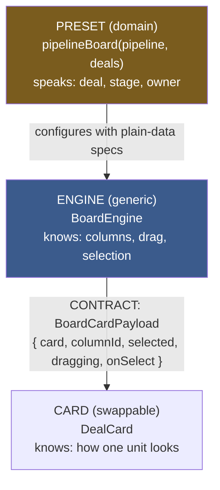
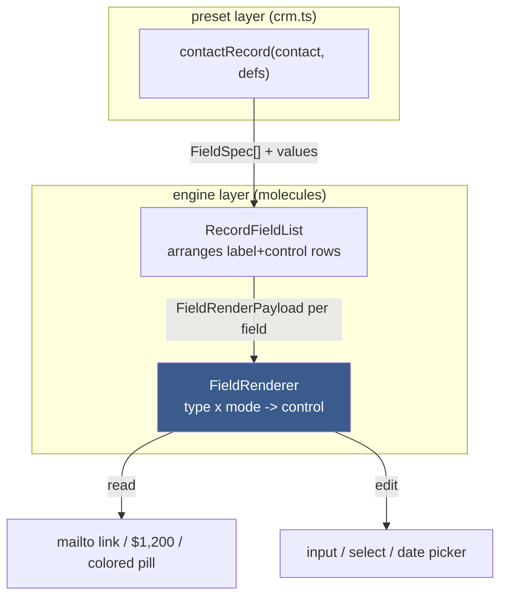
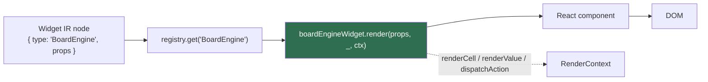

# CRM Widget Kit: Engine, Contract, and Preset over a Widget IR

This project adds a CRM widget kit — a pipeline board, typed record pages, an activity timeline, a dashboard, and a task inbox — to the `rag-evaluation-site` component library. The feature set is deliberately conventional; a CRM is a well-understood product, and the point of building one here is not the product but the method. Every widget in the kit is constructed the same way: a generic **engine** owns arrangement and interaction, a fixed data **contract** connects the engine to the units it displays, and a domain **preset** configures the engine with CRM vocabulary. The kit is the second application of this method in the repository. The first, the scheduling widgets, proved the pattern on a Doodle-style poll; this one applies it to the harder case of a CRM, where the same five arrangement patterns must serve many object types and a field set that customers extend at runtime. The work lives in `packages/rag-evaluation-site/` inside the `rag-evaluation-system` repository, under ticket `RAGEVAL-CRM-WIDGETS`.

> [!summary]
> - Every widget is an **engine + contract + preset**: `BoardEngine` lays out draggable columns and has never heard the word "deal"; `pipelineBoard(pipeline, deals)` is the one function that supplies the domain vocabulary.
> - The field system is the center of gravity. A CRM value is a typed field with a read mode and an edit mode; a single `FieldRenderer` interprets a `FieldSpec` — the CRM analogue of the existing `CellSpec` — so contacts, companies, deals, and any custom object render for free.
> - The kit invents no new registry. The generic engines register under the existing `data.dsl` module, exactly as the scheduling engines do, and all CRM knowledge lives in `src/crm/` and `widgets/presets/crm.ts`. Following what the codebase already did was a correction applied mid-build, not the first instinct.

## Why this project exists

The `rag-evaluation-site` package is a strict design system that already renders declarative UI two ways: React components an engineer writes, and a **Widget IR** — plain JSON trees of the form `{ kind: "component", type, props, children }` — that a server can produce and the browser can render without shipping React. The scheduling kit demonstrated that a whole product surface can be built on a few generic engines driven through that IR. What the scheduling kit did not test is the property that makes a CRM structurally different from a poll: a CRM is a handful of arrangement patterns — a board, a record page, a timeline, a table, a list — reused across many object types, over a field set that is data rather than code. If the arrangement patterns are engines, then supporting a new object type, even one a customer invents, is writing a preset, not a screen. The CRM kit exists to prove that claim in running code, and to produce the base engines the rest of a CRM would compose.

The project also exists to answer a design-system question directly: what is the smallest set of primitives from which the four core CRM screens fall out as arrangements? The answer, validated here, is five — a board, a typed-field renderer, a field-list layout, a timeline, and a metric tile — plus the record-page shell that composes them. Everything visible in the verified screenshots is one of those five engines in a different configuration.

## Current project status

The kit is implemented and verified. It typechecks (`tsc --noEmit`), and every commit passed the repository's `lefthook` gate, which reruns the typecheck and `biome` lint and format on staged files. The widgets were rendered and driven in a real browser: Storybook was booted on port 6007 and driven with Playwright, and the four core screens were screenshotted and inspected. The pipeline board renders stage columns with colored accent bars and draggable cards; the contact record page renders `mailto:`/`tel:` links, owner and company chips, a colored select pill, a percent, tag pills, and a day-grouped activity timeline with per-kind glyphs; the dashboard renders metric tiles with trend arrows and bars over a stage-colored funnel; and the field-type table renders every `FieldType` in both read and edit modes. The screenshots are stored in the ticket at `ttmp/2026/07/07/RAGEVAL-CRM-WIDGETS--.../various/screenshots/`.

What exists:

- the domain module `src/crm/` — `types.ts`, `palettes.ts`, `fixtures.ts`
- six molecules — `FieldRenderer`, `RecordFieldList`, `BoardEngine`, `DealCard`, `ActivityFeed`, `StatTile`
- one organism — `RecordShell`
- the field-system and engine IR — `FieldSpec` and the `*WidgetProps` interfaces in `src/widgets/ir/engines.ts`
- the presets — `src/widgets/presets/crm.ts` (`pipelineBoard`, `contactRecord`, `crmDashboard`, `tasksInbox`, and the `FieldDef`→`FieldSpec` helpers)
- extensive stories — a `*.stories.tsx` for every component plus a `WidgetRenderer.crm.stories.tsx` that renders the screens from serialized IR

What is deliberately not built:

- server-side action handlers; the widgets emit `ActionSpec`s (`deal.move`, `field.update`, `task.complete`) but nothing receives them yet
- a Go DSL `crm` module; the presets are TypeScript, and the Go side is left as the reconciliation question below
- custom-object generality; `RecordShell` is generic over its slots, but only contact and deal presets exist

## Project shape

The kit has three layers, and each maps to a directory.

1. **Domain.** `src/crm/` holds pure-data DTOs with no React and no IR: `Contact`, `Company`, `Deal`, `Pipeline`, `Stage`, `Activity`, `Task`, and the field schema `FieldDef`. It also holds the `ContextStyleSet` palettes for stages, activity kinds, and tags, and a set of fixtures. Many widgets share one definition of what a `Deal` is because the definition lives here and nowhere else.
2. **Engines.** `src/components/molecules/` and one organism hold the generic components. Each is blind to which object it displays; each owns arrangement and interaction only.
3. **Presets.** `src/widgets/presets/crm.ts` holds the domain configuration. A preset is a function that takes CRM data and returns Widget IR — a configured engine node. The words "deal" and "stage" appear here and are absent from every engine.

## Architecture

Three diagrams capture the kit. The first is the pattern every widget follows. The second is the field-system layering, which is the same pattern applied one level down. The third is the path a preset's output takes to the screen.







Key code locations:

- `src/crm/types.ts` — the domain DTOs, `FieldType`, `FieldValue`, `FieldDef`
- `src/components/molecules/FieldRenderer/FieldRenderer.tsx` — the field-system engine and the `FieldRenderPayload` contract
- `src/components/molecules/BoardEngine/BoardEngine.tsx` — the kanban engine and the `BoardCardPayload` contract
- `src/components/molecules/ActivityFeed/ActivityFeed.tsx` — the timeline engine
- `src/components/organisms/RecordShell/RecordShell.tsx` — the record-page shell
- `src/widgets/ir/engines.ts` — `FieldSpec` and the engine `*WidgetProps` interfaces
- `src/widgets/presets/crm.ts` — the CRM presets that emit configured IR
- `src/widgets/defaultRegistry.ts` — where the engines register under `data.dsl`

## Implementation details

### The pattern: engine, contract, preset

A component that shows domain data tends to fuse three separable jobs: arranging things in space (layout, selection, drag, keyboard), knowing what a thing means (a deal, a contact, a stage), and wiring the two together. When these stay fused, every new screen re-implements the arranging. The kit separates them. The expensive, reusable interaction is written once as an engine. The domain configuration is a thin preset. A fixed data shape — the contract — connects the two so the engine can place a unit it knows nothing about.

`BoardEngine` is the clearest instance. Its props declare columns, cards, and three accessors, and nothing about deals:

```ts
interface BoardEngineProps<Card> {
  columns: BoardColumnSpec[];
  cards: Card[];
  columnOf: (card: Card) => string;      // which column a card is in
  getCardId: (card: Card) => string;
  renderCard: (p: BoardCardPayload<Card>) => ReactNode;  // the swappable unit
  onMove?: (m: { cardId: string; from: string; to: string; beforeId?: string }) => void;
  onCardSelect?: (cardId: string) => void;
}
```

The engine is generic over `Card`. It never reads a field of `Card` directly; it calls `columnOf` and `getCardId` to place a card and `renderCard` to draw it. The `pipelineBoard` preset is where `Card` becomes `Deal`: it supplies `columnOf = deal => deal.stageId`, builds one column per stage, and passes a `renderCard` that returns a `DealCard`. A different preset could reuse the identical engine for a lead-status board by supplying a different `columnOf` and card. The engine is written once because the arranging is the same regardless of what sits in the columns.

### Props must be plain data, so rendering becomes a spec

The Widget IR imposes a constraint that shapes the whole design: a widget's props must be JSON, because a UI description has to survive being sent over a network or produced by a server-side script. Functions cannot be serialized, so "how do I render this cell" and "what happens when I click this" cannot be callbacks. The IR answers with **defunctionalization**: instead of a function, the props carry a small tagged data object describing the intent, and one interpreter on the other side carries it out. A click becomes an `ActionSpec` such as `{ kind: "server", name: "deal.move" }`. A grid cell's rendering becomes a `CellSpec` such as `{ kind: "status", field: "stage" }`.

The field system is the CRM's contribution to that family. A field's rendering is described by a `FieldSpec`, and one `FieldRenderer` interprets it. The spec is data:

```ts
interface FieldSpec {
  key: string;                 // which key in record.fields
  type: FieldType;             // "text" | "email" | "currency" | "select" | "relation" | ...
  label?: RenderableValue;
  options?: FieldOption[];     // for select / multiselect
  relatedObject?: string;      // for relation / user
  unit?: string;               // "USD" for currency
  styleSet?: ContextStyleSet;  // colors for select/tag values
}
```

Placing `FieldSpec` beside `CellSpec` and `ActionSpec` in `src/widgets/ir/engines.ts` is the point. It is not a bespoke mechanism; it is the fourth member of an existing family, and it inherits the family's properties: a field's appearance is serializable, a server can emit it, and there is exactly one interpreter to maintain.

### The field system: one renderer, type times mode

Everything in a CRM is ultimately a typed field shown in one of two modes. An email is a `mailto:` link when read and a validated input when edited. A stage is a colored pill when read and a dropdown when edited. A currency amount is a right-aligned formatted number when read and a number input when edited. Get this one abstraction right and every object renders for free; get it wrong and fields are special-cased forever. `FieldRenderer` is the engine that owns it. It receives a `FieldRenderPayload` — the contract, and the exact analogue of the grid's `MatrixCellPayload`:

```ts
interface FieldRenderPayload {
  fieldKey: string;
  type: FieldType;
  value: FieldValue;
  mode: "read" | "edit";
  options?: FieldOption[];
  styleSet?: ContextStyleSet;
  onChange?: (next: FieldValue) => void;   // edit reports changes back
  onCommit?: () => void;                     // blur / enter
  resolveRef?: (id: string) => FieldRef | undefined;  // relation/user display
}
```

The component is a switch on `type × mode`. Read mode maps a `currency` value to formatted text and an `email` to an anchor with a `mailto:` href; edit mode maps the same `currency` to a number input with a currency prefix and the same `email` to a validated text input. The read/edit appearance of every type is the design deliverable, and it is now concrete — the `FieldRenderer` story renders the whole table side by side:

| `FieldType` | Read | Edit |
| --- | --- | --- |
| `email` / `phone` / `url` | link (`mailto:` / `tel:` / new tab) | typed input |
| `currency` | right-aligned `$8,000` | number input + `$` prefix |
| `percent` | `62%` | number input + `%` suffix |
| `date` / `datetime` | `Jul 31, 2026` | native date / datetime picker |
| `select` | colored pill via `styleSet` | dropdown of options |
| `multiselect` / `tags` | row of pills | value entry |
| `relation` / `user` | avatar + name chip (via `resolveRef`) | picker input |

Two reuse decisions fall out of the contract. Select and tag colors go through the same `ContextStyleSet` palette that the context diagrams and scheduling widgets use, so one coloring mechanism serves the whole product. And a relation or user value is an id; the renderer does not fetch the referenced record, it calls `resolveRef(id)` to turn the id into a display label and avatar. The preset builds that map once with `buildRefs(users, companies)` and hands it in, which keeps the renderer synchronous and free of data access.

Above `FieldRenderer` sits `RecordFieldList`, a second engine that owns arrangement only: it lays out many fields as label-and-control rows grouped into sections and hands each field a payload. Above that sit the record presets, which supply the specs and the values. Three layers, the same shape as the board.

### DealCard is the product; the board is invisible

The design guidance for the kit is blunt about where visual effort goes: the board engine is mostly invisible, and the card is the product. `DealCard` is small, high-frequency, and read at a glance, so it is designed explicitly — a title, an amount, a metadata line, a left accent bar keyed to stage color, a won/lost badge, and the `selected` and `dragging` states. It is presentational: the engine wraps it in a draggable list item and owns geometry, drag, and selection, while the card owns only how one unit looks. The IR adapter renders each card by evaluating a `BoardCardSpec` — three `CellSpec`s for the title, subtitle, and metadata — into the card's slots, which keeps the card fully serializable while leaving its visual design in one place.

The drag itself is native HTML5 drag-and-drop held in two pieces of component state, the id being dragged and the column currently under the pointer. On drop, the engine computes the move and emits it through the contract rather than mutating anything: `onMove({ cardId, from, to, beforeId })`. In the IR path that becomes a `deal.move` server action; in the React story it becomes a `setState` that moves the deal between columns. The engine has no opinion about which; it reports the intent and lets the layer above decide.

### How a preset reaches the screen

A preset returns an IR node, and a node reaches the screen through the registry. Each engine has an adapter defined with `defineWidget`, which pairs a `type` string with a `render` function and a module tag:

```ts
export const fieldRendererWidget = defineWidget<FieldRendererWidgetProps>({
  type: "FieldRenderer",
  module: "data.dsl",
  render: (props, _children, ctx) => renderFieldSpec(props.spec, props.value, props, ctx),
});
```

The `render` function receives a `RenderContext` that carries the recursion. `ctx.renderNode` renders a child node, `ctx.renderValue` renders a `RenderableValue` (a string, number, or nested node), and `ctx.dispatchAction` turns an `ActionSpec` plus a context object into a real dispatch. This is how an adapter stays inside the JSON world while still composing: when `RecordFieldList`'s adapter needs to render a field's label, it calls `ctx.renderValue(spec.label)`; when `FieldRenderer`'s adapter needs to report an edit, it calls `ctx.dispatchAction(props.onChangeAction, { key, value })`. The registry lookup is flat — any type can contain any other — so the record-page preset can nest a `SplitPane` containing a `Panel` containing a `RecordFieldList` containing many `FieldRenderer`s, and each level is resolved the same way.

### The decomposition decision: no per-domain registry

The first instinct was to give the CRM its own widget module and registry — a `crm.dsl` alongside `data.dsl` and `time.dsl`. That was wrong, and the correction is worth recording because it came from reading what the codebase already did rather than from the design document. The scheduling kit created no `schedule.dsl` registry. Its generic engines — `MatrixGrid`, `TimeGrid`, `SegmentedBar` — live in the generic `data.dsl` and `time.dsl` modules, and every scheduling-specific decision lives in `widgets/presets/scheduling.ts`. The engines are generic; only the presets are domain. A `.dsl` name that appears in a preset comment refers to the future Go DSL module, not to a React registry.

Applying that consistently, the five generic engines — `FieldRenderer`, `RecordFieldList`, `BoardEngine`, `ActivityFeed`, `StatTile` — register under the existing `dataWidgetRegistry` with `module: "data.dsl"`, and the CRM exists only in `src/crm/` and `presets/crm.ts`. Two consequences followed. The invented `MetricRow` engine was deleted, because several `StatTile`s lay out perfectly well in the existing `TileGrid` layout primitive; a new layout component was unnecessary. And `RecordShell`, which composes arbitrary node slots, was kept as a React organism and not given an IR node at all — the `contactRecord` preset emits the record page as a composition of already-registered widgets (`Panel` + `SplitPane` + `RecordFieldList` + `ActivityFeed`), mirroring how the scheduling `pollResults` preset composes a `Stack` of `SegmentedBar`s rather than minting a bespoke node. The general rule the kit now follows: prefer composing existing engines and layout over inventing new ones, and add a new IR node only when a genuinely new arrangement has no expression in the current set.

### Two twins: the React organism and the IR preset

`RecordShell` and `contactRecord` are the same screen expressed twice, and the split is intentional. `RecordShell` is a hand-authored React organism with typed slot props — an identity, an actions node, a details node, an activity node, a related node — that a container fills directly. `contactRecord` is a preset that produces the same screen as serialized IR from a `Contact` and its `FieldDef`s. The organism is the ergonomic path for code that already has React in hand; the preset is the path for a server or script that only has data. They share the engines underneath, so the two never drift in appearance. This is the design system's stated order of operations made concrete: stabilize the React component and its stories first, then add IR support once the props are JSON-compatible and there is a reason for a script author to emit the node.

### Style and story conventions

Two conventions were enforced across the kit after review. The visual language is retro and uses no rounded corners; the existing components (`Tag`, `CycleCell`, `MatrixGrid`) carry zero `border-radius`, so the new cards, pills, and avatars were made square to match. And every public component carries its own `*.stories.tsx` with the full spread of states the guidelines require — default, empty, overflow, selected, error, and an interactive variant — in addition to the `WidgetRenderer` stories that render the screens from IR. Stories are the review surface for this package; a component without them is not considered part of the design system. Typography stays on the `--rag-font-role-*` tokens and the foundation `Text` and `Caption` roles, colors stay on the `--mac-*` tokens, and each component carries a `data-rag-*` identity attribute for visual-diff extraction.

## Current widget surface

| Widget | Layer | Contract / spec | Role |
| --- | --- | --- | --- |
| `FieldRenderer` | molecule | `FieldRenderPayload` / `FieldSpec` | one typed value, read or edit |
| `RecordFieldList` | molecule | field sections | label+control rows for a record |
| `BoardEngine` | molecule | `BoardCardPayload` | kanban columns of draggable cards |
| `DealCard` | molecule | node slots | the swappable pipeline card |
| `ActivityFeed` | molecule | `{ activity, isLast, onOpen }` | day-grouped timeline with a spine |
| `StatTile` | molecule | — | labeled metric with delta and bar |
| `RecordShell` | organism | slots | record-page header + two columns |

The presets that configure them are `pipelineBoard`, `contactRecord`, `crmDashboard`, and `tasksInbox`, plus the `FieldDef`→`FieldSpec` helpers `toFieldSpec`, `fieldSections`, and `buildRefs`. The `tasksInbox` preset is the one that exercises inline editing outside a record page: each task row carries a `FieldRenderer` in `boolean` edit mode whose `onChange` emits a `task.complete` action, which shows that the field system works anywhere a value appears, not only inside a record.

## Important project docs

- repo ticket `RAGEVAL-CRM-WIDGETS` in `ttmp/2026/07/07/` — the design guide, the implementation diary, and the verification screenshots
- the sibling ticket `RAGEVAL-SCHEDULE-WIDGETS` — the worked example the CRM kit mirrors
- `packages/rag-evaluation-site/GUIDELINES.md` — the design-system rules the components follow
- the design doc `design-doc/01-designing-the-crm-widget-kit-...md` in the ticket — the intern-facing analysis the implementation follows

## Open questions

- Should `FieldSpec` reconcile with the Go DSL's existing `record`/field-role grammar (`grammar.go`), which already has field roles such as `key`/`status`/`date`/`tags`/`measure` that overlap the CRM field types? The strong recommendation is to converge on one field model rather than maintain two; this is the main engineering design question the kit raises.
- Should `RecordShell` be generic over object type from day one, so a customer-defined "Property" object works, or start with the built-in contact and deal presets and generalize later?
- Do records edit field-by-field inline or flip the whole page into an edit mode? The choice changes the `FieldRenderPayload` and the record header, and the kit currently supports both a read and an edit mode without committing to either interaction.
- Board cards currently show a raw amount without a currency symbol and a raw owner id; resolving owner names and currency-formatting in the preset is cheap and would close the visible gap between the React story and the IR path.

## Near-term next steps

- add the server action dispatcher that receives `deal.move`, `field.update`, `record.create`, `activity.log`, and `task.complete`, so the emitted actions do something
- build the deal-table screen as a `MatrixGrid`/`DataTable` whose columns are `FieldSpec`s rendered in read mode, which would make the table and the record page share field rendering
- write a `crm` Go DSL module whose helpers (`board`, `recordFieldList`, `field`, `activityFeed`, `statTile`) and recipes (`contactRecord`, `pipelineBoard`) emit the same IR the TypeScript presets do, after the `FieldSpec`/`grammar.go` reconciliation is settled

## Project working rule

Design every widget as an engine, a contract, and a preset, and ask of each one: what is the engine here, and what is the domain preset? Keep the engine blind to meaning and put every domain word in the preset. Reuse the existing generic registry and layout rather than minting a per-domain module or a new layout component; add a new IR node only when a new arrangement genuinely has no expression in the current set. Stabilize the React component and its stories before adding IR support. When a value must be shown or edited, reach for a `FieldSpec` and let the one `FieldRenderer` interpret it, because a second field mechanism is how a CRM becomes un-extensible.

## Related notes

- [[PROJ - Doodle Scheduling Site - SQLite and the rag Widget DSL on xgoja|Doodle Scheduling Site: the scheduling kit this one mirrors]]
- [[ARTICLE - Widget DSL Grammar - Designing an Intent-Level UI Authoring Layer for a Widget IR System|Widget DSL Grammar: the intent-level authoring layer over the same Widget IR]]
