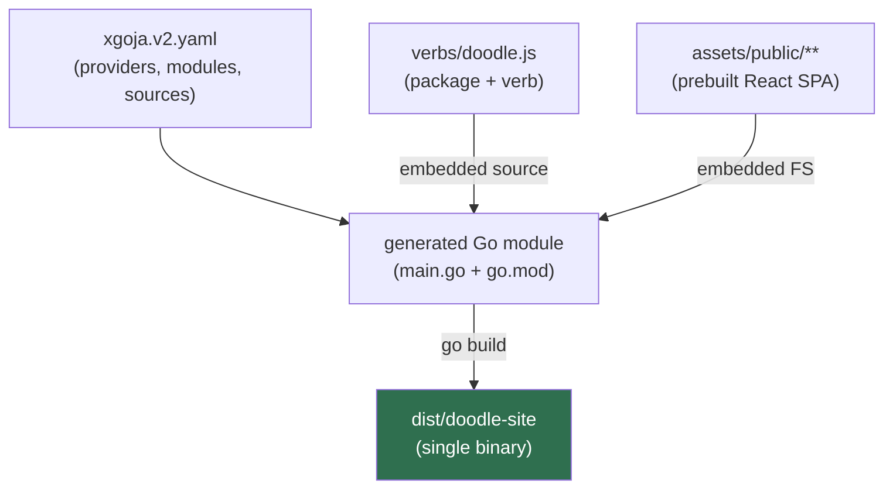

# Doodle Scheduling Site: SQLite and the rag Widget DSL on xgoja

This project is a small scheduling-poll website built to exercise three systems at once: SQLite as the datastore, the rag Widget DSL as the UI authoring layer, and xgoja as the compiler that turns a declarative spec plus a JavaScript verb into a standalone HTTP binary. A user creates a poll with several proposed time slots, shares it, and lets participants mark their availability per slot; a results grid tallies the votes and marks the best slot. The application is deliberately ordinary — it is the kind of thing a small team actually uses — because the interesting content is not the feature set but the path a request takes from a browser click, through a React renderer, into JavaScript running on a Go event loop, down to a SQL statement, and back. The site lives at `examples/xgoja/doodle-site/` inside the `rag-evaluation-system` repository.

> [!summary]
> - The whole application is one JavaScript verb (`verbs/doodle.js`) plus one declarative build spec (`xgoja.v2.yaml`); xgoja generates a Go program, compiles it, and embeds both the verb and a prebuilt React SPA into a single binary.
> - The page author never emits HTML. Pages are **Widget IR** — JSON trees of component nodes — produced by the `ui.dsl` and `data.dsl` helpers and rendered in the browser by the React `RagEvaluationSiteApp`.
> - Two distinct round trips coexist: read paths (`GET /api/widget/pages/<id>`) return Widget IR for the SPA to render, and typed-input writes use a native HTML `<form>` POST answered by a `303` redirect, because Widget IR form values reach the server only through a browser form submission.

## Why this project exists

The `rag-evaluation-system` repository contains a UI stack whose parts are usually described in isolation: a widget component library, a Go DSL that emits Widget IR, an xgoja provider that exposes that DSL to JavaScript, and a set of documentation pages. What was missing was a single application that used all of them together to do something a person would recognize, and that could be driven end to end in a real browser. A scheduling poll is a good forcing function because it needs every capability the stack claims to have: persistent structured data, dynamic tables whose columns depend on the data, typed text and select input, and navigation between a list view and a detail view. If any one of those capabilities is missing or awkward, building a poll surfaces it immediately.

The project also exists to validate the toolchain against its own current source rather than against a released version. The repository is a Go workspace; the generated binary resolves `go-go-goja` to the local checkout, which means the application is compiled against the newest, sometimes unreleased, Express and DSL code. That distinction turned out to matter, and the section on the planned-route API below explains why.

## Current project status

The application is complete and verified. It builds with `xgoja build`, serves over HTTP, persists to a file-backed SQLite database, and was driven end to end in a headless browser: creating a poll through the form, casting a vote through per-slot dropdowns, and watching the availability grid and the best-slot tally update. The research record — including the toolchain gotchas discovered along the way — is in the repo ticket `DOODLE-1` under `ttmp/2026/07/07/`.

What exists:

- a v2 xgoja spec, `examples/xgoja/doodle-site/xgoja.v2.yaml`
- the application verb, `examples/xgoja/doodle-site/verbs/doodle.js`
- an embedded copy of the current React SPA under `examples/xgoja/doodle-site/assets/public/`
- a `Makefile` with `doctor`, `build`, `serve`, and `sync-app` targets

What is deliberately not built:

- authentication or per-user identity; anyone with the link can vote
- edit or delete of an existing poll or vote
- closing a poll or notifying participants

## Project shape

The application has three layers, and each maps to a specific artifact.

1. **Data.** A SQLite schema with four tables — `polls`, `options`, `participants`, `votes` — created on startup and seeded once if empty. All state lives here; the JavaScript holds no long-lived data of its own.
2. **Presentation.** Three page builders (`index`, `create`, `poll`) that read the database and return Widget IR. They describe structure and data; they never describe pixels.
3. **Transport.** A set of planned Express routes: three `GET` routes that return page IR, and two `POST` routes that accept native form submissions and reply with redirects.

## Architecture

Two diagrams capture the system. The first is the build: how a spec and a verb become a binary. The second is the runtime: how a browser interaction becomes a SQL statement and a re-render.



```mermaid
flowchart TD
  click["browser: click / submit"]
  spa["RagEvaluationSiteApp (React)"]
  getp["GET /api/widget/pages/&lt;id&gt;?query"]
  post["POST /api/form/&lt;action&gt; (urlencoded)"]
  verbjs["doodle.js route handler (goja)"]
  db[("SQLite doodle.db")]
  ir["Widget IR (JSON)"]
  redir["303 -> /pages/&lt;id&gt;"]
  click -->|read| spa --> getp --> verbjs
  click -->|write| post --> verbjs
  verbjs -->|db.query / db.exec| db
  verbjs -->|read result| ir --> spa
  verbjs -->|write result| redir --> spa
  style db fill:#3b5b8c,color:#fff
  style ir fill:#7a5c1e,color:#fff
```

Key code locations:

- `examples/xgoja/doodle-site/verbs/doodle.js` — schema, seed, page builders, route handlers
- `examples/xgoja/doodle-site/xgoja.v2.yaml` — providers, runtime modules, sources, artifacts
- `pkg/xgoja/providers/widgetsite/` — the `ui.dsl` / `data.dsl` provider and its docs
- `packages/rag-evaluation-site/src/app/App.tsx` — the SPA shell, routing, and action dispatch
- `packages/rag-evaluation-site/src/widgets/actions.ts` — client-side action handling
- `go-go-goja/modules/express/express.go` — the planned-route Express API
- `go-go-goja/pkg/gojahttp/` — request/response DTOs, body parsing, redirects

## Implementation details

### The xgoja build model

xgoja does not interpret the application at runtime the way a scripting host would. It reads a declarative spec, generates a small Go program that imports the selected provider packages and registers the selected modules, embeds the JavaScript verbs and static assets, and compiles the result with the ordinary Go toolchain. The spec is the whole configuration surface. For this project it declares three providers (`go-go-goja-host` for the filesystem and database modules, `go-go-goja-http` for Express, and `rag-widget-site` for the DSL), and it wires the runtime modules the verb will `require`:

```yaml
runtime:
  modules:
    - { provider: go-go-goja-http, name: express, as: express }
    - provider: go-go-goja-host
      name: db
      as: db
      config:
        driverName: sqlite3
        dataSourceName: 'file:doodle.db?_foreign_keys=on'
    - { provider: rag-widget-site, name: ui.dsl,   as: ui.dsl }
    - { provider: rag-widget-site, name: data.dsl, as: data.dsl }
```

The database is configured once, in the spec, and reaches the verb as a `require("db")` handle. The data source is a file, not `:memory:`, which is the difference between a demonstration that resets on every restart and a website whose polls survive one. This choice was verified directly: after a server restart, the previously created polls and votes were still present, because the bytes were on disk in `doodle.db` rather than in a process that had exited.

One property of the spec deserves emphasis because it silently determines which version of the runtime the binary contains. The spec sets `workspace.mode: auto`, so module resolution follows the repository's `go.work`. `go.work` lists the local `go-go-goja` checkout, so the generated binary is compiled against local, current source — not the `v0.9.6` version named in `go.mod`. `xgoja doctor` reports this explicitly as `resolution_kind: workspace`. The consequence is described under the request contract below.

### The SQLite data model

The schema is four tables. Polls own options and participants; participants own votes; a vote is the association of one participant with one option and a value drawn from `yes`, `maybe`, or `no`. The composite primary key on `votes` makes each participant's answer to each slot unique.

```sql
CREATE TABLE polls (id INTEGER PRIMARY KEY AUTOINCREMENT, slug TEXT UNIQUE,
                    title TEXT NOT NULL, description TEXT, location TEXT, created_at TEXT NOT NULL);
CREATE TABLE options (id INTEGER PRIMARY KEY AUTOINCREMENT, poll_id INTEGER NOT NULL,
                      label TEXT NOT NULL, sort INTEGER NOT NULL);
CREATE TABLE participants (id INTEGER PRIMARY KEY AUTOINCREMENT, poll_id INTEGER NOT NULL,
                           name TEXT NOT NULL, created_at TEXT NOT NULL);
CREATE TABLE votes (participant_id INTEGER NOT NULL, option_id INTEGER NOT NULL,
                    value TEXT NOT NULL, PRIMARY KEY (participant_id, option_id));
```

The `db` module exposes two operations: `db.exec(sql, ...args)` for statements and `db.query(sql, ...args)` for reads, which returns an array of row objects keyed by column name. Both use positional `?` parameters, so untrusted form values never enter a SQL string by concatenation. Row identifiers after an insert come from `SELECT last_insert_rowid()` rather than a returned value, because `exec` reports no insert id:

```js
db.exec("INSERT INTO polls (slug, title, description, location, created_at) VALUES (?,?,?,?,?)",
        null, title, description, location, new Date().toISOString());
const pollId = Number(db.query("SELECT last_insert_rowid() AS id")[0].id);
```

Aggregation for the results view is done in SQL-adjacent JavaScript rather than in a single grouped query, because the availability grid needs both the per-participant answers and the per-slot totals from the same data. The handler reads all votes for a poll once, indexes them by participant and option in a map, and derives two structures: the grid rows and the per-slot tally. The best slot is the one with the highest score, where a `yes` is worth two points and a `maybe` one:

```js
const tally = options.map(opt => {
  let yes = 0, maybe = 0, no = 0;
  participants.forEach(pt => {
    const v = voteMap[pt.id] && voteMap[pt.id][opt.id];
    if (v === "yes") yes++; else if (v === "maybe") maybe++; else if (v === "no") no++;
  });
  return { option: opt, yes, maybe, no, score: yes * 2 + maybe };
});
```

### Pages are Widget IR, not HTML

A page builder returns a JSON tree, not markup. `ui.page({...})` produces an object with a schema version, an id, a title, and a root node; the `ui.*` and `data.*` helpers produce component nodes of the form `{ kind: "component", type, props, children }`. The React `RagEvaluationSiteApp` fetches this tree and walks it, mapping each `type` to a registered React component. The page author therefore controls structure, data, and intent; the React layer owns CSS, accessibility, keyboard behavior, and the actual DOM. The `index` page, for example, is a stack of a panel, a metrics strip, a data table, and a panel of navigation buttons:

```js
return ui.page({
  id: "index", title: "Doodle · scheduling polls", meta: pageMeta("index"),
  sections: [
    ui.panel({ title: "Scheduling polls" },
      ui.statusText({ status: "succeeded", icon: true }, polls.length + " active poll(s)"),
      ui.button({ variant: "primary", action: ui.action.navigate("/pages/create") }, "+ New poll")),
    ui.recipes.metrics({ items: [ { label: "Polls", value: polls.length } /* ... */ ] }),
    ui.panel({ title: "Polls" }, data.dataTable({ rows, getRowKey: "id", columns })),
  ],
});
```

The availability grid is the one place where the data shapes the table. The number of columns equals the number of slots, which is known only at request time, so the columns array is generated by iterating the poll's options. Each generated column reads a per-row field named `opt_<optionId>`, and the rows are built by projecting each participant's vote map into those fields. This is the payoff of pages being data: a dynamic table is an ordinary loop that builds an array, not a templating problem.

### The planned-route request/response contract

Because the binary is compiled against local `go-go-goja`, it uses the current Express API, in which routes are declared as plans before a handler is attached. The older two-argument form `app.get(path, handler)` was removed and now panics with an explicit message; a route must call `.public()` (or an auth chain) and then `.handle(...)`. This is the single most important thing to get right when writing a verb against this toolchain, because a verb copied from an older example will compile and only fail when the first request arrives. The correct shape is:

```js
app.get("/api/widget/pages/poll").public().handle((ctx, res) => {
  const pollId = Number(ctx.request.query.poll || 0);
  res.json(pollPage(pollId));
});
```

The handler receives `(ctx, res)`. Query parameters are on `ctx.request.query`; path parameters are on `ctx.params`; a parsed body is on `ctx.body`. The response object offers `res.json(...)`, `res.status(n)`, `res.type(...)`, `res.send(...)`, `res.redirect(...)`, and `res.end()`. The host parses the request body by content type before the handler runs: JSON becomes an object on `ctx.body`, and `application/x-www-form-urlencoded` is run through `ParseForm` and flattened into an object as well, so a native form submission and a JSON POST look the same to the handler. That symmetry is what makes the write path below work without any client-side serialization code.

### Typed input: native form POST and the 303 redirect

Reading a page is a fetch that returns IR. Writing is different, and the difference is structural rather than stylistic. Widget IR form controls — a `textInput`, a `selectInput` — render as real DOM `<input>` and `<select>` elements inside a real `<form>`. Their values live in the browser, not in the IR, and the only mechanism that transports them to the server is a browser form submission. The DSL exposes this directly: `ui.formPanel({ method: "post", formAction: "/api/form/create-poll" }, ...rows)` renders a `<form action method>`, and each input carries a `name`. When the user clicks the submit button, the browser posts the encoded fields to `formAction` as a full navigation.

The handler therefore reads `ctx.body` and answers with a redirect rather than with IR:

```js
app.post("/api/form/create-poll").public().handle((ctx, res) => {
  const b = ctx.body || {};
  const slots = String(b.slots || "").split(/\r?\n/).map(s => s.trim()).filter(Boolean);
  if (!b.title || slots.length === 0) return res.redirect(303, "/pages/create");
  const pollId = createPoll(b.title.trim(), b.description, b.location, slots);
  res.redirect(303, "/pages/poll?poll=" + pollId);
});
```

The `303 See Other` status is deliberate. It instructs the browser to follow the `Location` with a `GET`, which lands on the SPA fallback for `/pages/poll?poll=<id>`, boots the application, and fetches the new poll's IR. The result is the post/redirect/get sequence: a write is a real navigation to a fresh read, so a reload does not re-submit the form. This path was verified with both a raw urlencoded `curl` POST — which returned `303` with the expected `Location` — and a browser form submission that landed on the new poll page.

There is a subtle default that costs a debugging cycle if missed. The `textInput` and `textareaInput` widgets default to `readOnly: true`; an input named "input" renders locked unless the builder passes `readOnly: false`. Every editable field in the create and vote forms sets it explicitly. Similarly, `formRow` takes its control as a prop named `control`, not as a child, which is the one place the DSL departs from its otherwise uniform "content goes in children" convention.

### Client-side navigation

Navigation between pages does not touch the network for the navigation itself; it is a History API operation that then triggers a data fetch. `ui.action.navigate("/pages/poll?poll=3")` is serialized into the IR as `{ kind: "navigate", to: "/pages/poll?poll=3" }`. When a button carrying that action fires, the React widget calls up to `App.tsx`, which routes any non-server action to `dispatchWidgetAction`. The navigate branch is small:

```js
if (action.kind === "navigate") {
  const target = interpolate(action.to, context);        // "${row.id}" -> "3", URL-encoded
  window.history.pushState(action.params ?? {}, "", target);
  window.dispatchEvent(new PopStateEvent("popstate"));
  return;
}
```

`pushState` changes the URL with no reload and no request. Because `pushState` alone does not emit `popstate`, the handler dispatches a synthetic `popstate` event. The application subscribes to `popstate` at mount; the listener bumps a state counter, which forces a re-render, which recomputes the page id and query string from `window.location` and passes the new URL to the page-fetching hook. The hook's URL dependency changed, so it fetches `/api/widget/pages/poll?poll=3` and renders the returned IR. The navigation is local; the fetch it causes is the only server contact. Two consequences follow for free: the browser back and forward buttons work, because real history navigation emits the same `popstate` the listener already handles; and deep links work, because the initial mount reads the same location the push would have set.

This is why the write path uses a server redirect while the read paths use client navigation. A `navigate` action changes the URL and fetches a different page's IR. A form POST cannot carry IR back — it carries the redirect that names the next page — and the `303` produces the same end state through a real navigation.

### The stale-SPA failure and the JSON boundary for cells

The first browser run surfaced two rendering failures that share one cause. A table column built with `data.cell.actionButton` rendered as `Unsupported cell`, and the create form rendered as `Unknown widget: FormPanel`. Both are the symptom of an embedded SPA bundle that predates the widgets the verb used. The bundle had been copied from a sibling example whose assets were older than the current `packages/rag-evaluation-site` source. The fix was to rebuild the SPA from that source with its own `build:app` script (`vite build --config vite.app.config.ts`), embed the fresh output, and rebuild the binary. No React or TypeScript source was modified; only the build output was regenerated. The lesson generalizes: an xgoja site embeds a compiled frontend, and the frontend and the DSL that feeds it must be built from the same generation of source, or the renderer will not recognize the nodes the verb emits.

The `Unsupported cell` failure also exposes a real boundary in the IR. Everywhere else, a renderable slot — a panel title, a form row's control, a split pane's side — accepts a full widget node, and the renderer recurses into it. Table cells are the exception. A cell is a discriminated specification (`field`, `number`, `status`, `caption`, `link`, `linkButton`, `actionButton`, `constant`) rendered by a fixed switch, not an arbitrary node. The IR rule states it directly: table cells must use `data.cell.*` specs, and JavaScript render functions cannot cross the JSON boundary. This keeps rows cheap to virtualize and their payloads small, at the cost of a closed set of cell kinds. When the fresh bundle still left the row-navigation column feeling like a workaround, the index page was changed to render navigation as ordinary `ui.button` widgets in a panel below the table, which read cleanly and depend on nothing beyond a basic button. The general escape hatch — a `node` cell kind that hands a widget node back to the generic renderer — is a small, principled addition the closed set could grow, but it was not needed here.

## Current user-facing surface

| Route | Method | Returns | Purpose |
| --- | --- | --- | --- |
| `/pages/index` | GET | Widget IR | list of polls, metrics, navigation |
| `/pages/create` | GET | Widget IR | poll creation form |
| `/pages/poll?poll=<id>` | GET | Widget IR | availability grid, results, vote form |
| `/api/form/create-poll` | POST | 303 redirect | create a poll and its slots |
| `/api/form/cast-vote?poll=<id>` | POST | 303 redirect | record one participant's votes |
| `/healthz` | GET | JSON | liveness check |

The binary is run as `./dist/doodle-site serve doodle site --http-listen 127.0.0.1:18793`, where `doodle` is the verb package and `site` is the verb; `make serve` builds and runs it in one step.

## Important project docs

- repo ticket `DOODLE-1` in `ttmp/2026/07/07/` — investigation diary, toolchain gotchas, verification record
- `pkg/xgoja/providers/widgetsite/doc/01-widget-dsl-getting-started.md` — the DSL tutorial the verb follows
- `pkg/xgoja/providers/widgetsite/doc/02-widget-dsl-js-api-reference.md` — the helper and cell reference
- `go-go-goja/pkg/doc/18-express-module.md` — the planned-route Express contract

## Open questions

- Should the sibling `examples/xgoja/widget-site` be migrated to the v2 spec and the planned-route API? It currently uses the legacy spec and the removed two-argument route form, so it no longer builds against the local toolchain.
- Should the prebuilt SPA bundles checked into `examples/*/assets` be treated as build artifacts and regenerated in CI, given that a stale bundle silently breaks rendering rather than failing the build?
- Is a `node` cell kind worth adding to `data.dsl`, so a table cell can carry an arbitrary widget without the closed-set switch rejecting it?

## Near-term next steps

- add poll close and per-participant edit, which requires an update path and therefore a second look at whether writes should stay form-only or gain a JSON action variant
- add a shareable human slug route (`/p/<slug>`) in addition to the numeric `?poll=<id>` query
- write a smoke target mirroring the sibling example, so the build, serve, and the create/vote round trips are checked automatically

## Project working rule

Treat the verb as the entire application and the spec as the entire configuration. Data belongs in SQLite, structure belongs in Widget IR, and pixels belong in React. When a page needs input, prefer the native-form POST with a `303` redirect over inventing a client-side value channel, and when a page needs navigation, prefer `ui.action.navigate`. Build the embedded SPA from the same source generation as the DSL, or the renderer will not recognize what the verb emits.

## Related notes

- [[ARTICLE - Widget DSL Grammar - Designing an Intent-Level UI Authoring Layer for a Widget IR System|Widget DSL Grammar: intent-level authoring for the same Widget IR system]]
